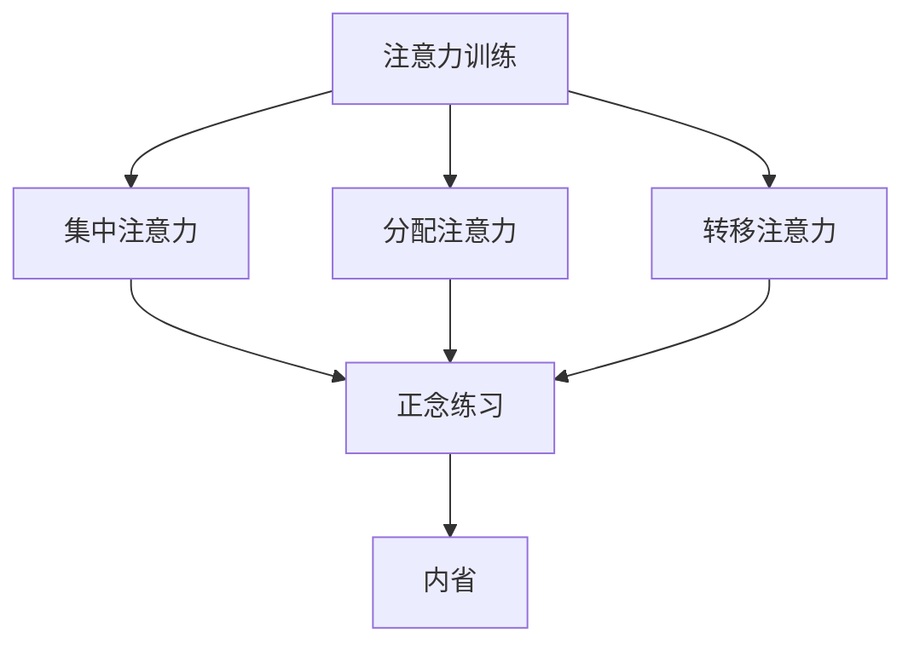

                 

关键词：注意力训练，正念，内省，专注，心灵平和，技术语言，IT领域

> 摘要：本文旨在探讨如何在信息技术领域，通过注意力训练与正念练习，增强个人的内省能力与专注力，进而提升心灵平和。文章将从背景介绍、核心概念、算法原理、数学模型、项目实践、应用场景、工具和资源推荐等多个方面展开论述。

## 1. 背景介绍

在当今快节奏、高压力的信息技术行业，程序员和软件开发者面临的挑战越来越大。编程工作不仅要求高度的集中精力，还需要在繁杂的信息中迅速做出决策。然而，长期的注意力集中和精神紧张往往会导致心理疲劳、焦虑和心灵失衡。因此，如何通过技术手段和心理学方法来提升个人的注意力和专注力，进而保持心灵平和，成为了一个值得关注的问题。

本文将从注意力训练与正念练习的角度，结合内省的方法，探讨如何在信息技术领域实现这一目标。通过深入分析相关理论，结合实际案例，我们将探索一套行之有效的方法，帮助IT从业者提升自身的心理素质和工作效率。

## 2. 核心概念与联系

在讨论注意力训练与正念练习之前，我们需要了解一些核心概念和它们之间的联系。

### 注意力训练

注意力训练是指通过一系列的练习和技巧，提高个体对信息的接收、处理和记忆能力。它包括：

- **集中注意力**：将思维集中在特定的目标或任务上，减少分心的干扰。
- **分配注意力**：在同时处理多个任务时，合理分配注意力资源。
- **转移注意力**：在需要时，将注意力从一个任务转移到另一个任务。

### 正念练习

正念练习是一种源自佛教冥想的心理学方法，它强调通过观察当下的思想和感受，培养个体的自我意识和专注力。正念练习的主要内容包括：

- **身体扫描**：逐一扫描身体各个部位，感知身体感受。
- **呼吸练习**：专注于呼吸，观察呼吸的进出，以平静心灵。
- **内省**：通过反思自己的行为和思想，深入理解自我。

### 内省

内省是指个体对自身思想和行为的反思和审视。它有助于提升自我意识，识别并改变不良的思维和行为模式。内省与注意力训练和正念练习的结合，可以显著提高个人的心理素质和专注力。

### Mermaid 流程图

下面是一个简单的 Mermaid 流程图，展示了注意力训练、正念练习和内省之间的联系。



## 3. 核心算法原理 & 具体操作步骤

### 3.1 算法原理概述

注意力训练与正念练习的核心原理是通过对大脑的训练，提高个体的注意力和专注力。具体来说，包括以下几个方面：

- **神经可塑性**：大脑具有可塑性，通过重复的训练，可以改变大脑的结构和功能。
- **冥想训练**：通过冥想练习，培养个体的专注力和自我意识。
- **内省练习**：通过内省，识别并改变不良的思维模式。

### 3.2 算法步骤详解

#### 步骤1：集中注意力

首先，我们需要学会如何集中注意力。具体方法包括：

- **选择一个目标**：选择一个具体的任务或目标，将其作为注意力集中的焦点。
- **减少干扰**：关闭手机、电视等可能干扰注意力的设备。
- **练习专注**：每天设定一段时间，专注于一个任务，逐渐增加专注时间。

#### 步骤2：分配注意力

在处理多个任务时，我们需要学会如何合理分配注意力。具体方法包括：

- **任务优先级**：根据任务的紧急程度和重要性，设定任务的优先级。
- **多任务切换**：在需要时，快速切换注意力，处理多个任务。
- **练习多任务处理**：每天设定一段时间，同时处理多个任务，逐渐提高效率。

#### 步骤3：转移注意力

在需要时，我们需要学会如何转移注意力。具体方法包括：

- **有意识地转移**：当意识到注意力分散时，有意识地将其转移到任务上。
- **休息与放松**：在长时间工作后，进行短暂的休息和放松，恢复注意力。
- **练习转移技巧**：每天设定一段时间，练习有意识地转移注意力。

### 3.3 算法优缺点

#### 优点

- **提高注意力**：通过训练，可以显著提高个体的注意力和专注力。
- **改善心理健康**：正念练习和内省有助于改善个体的心理健康，减轻压力和焦虑。
- **提高工作效率**：通过提高注意力和专注力，可以显著提高工作效率。

#### 缺点

- **初期难度**：对于初学者来说，注意力和专注力的训练可能有一定难度，需要持续的努力和耐心。
- **时间投入**：注意力训练和正念练习需要一定的时间投入，可能影响日常工作。

### 3.4 算法应用领域

注意力训练与正念练习的应用领域广泛，包括：

- **软件开发**：提高程序员的工作效率和心理健康。
- **项目管理**：提高项目经理的注意力和决策能力。
- **教育**：提高学生的学习效率和注意力。
- **医疗**：用于治疗焦虑、抑郁等心理健康问题。

## 4. 数学模型和公式 & 详细讲解 & 举例说明

### 4.1 数学模型构建

注意力训练与正念练习的数学模型可以从神经科学的角度进行构建。具体来说，可以基于神经可塑性原理，构建一个注意力模型。该模型包括以下几个部分：

- **神经元活动**：表示大脑神经元的活动状态。
- **突触可塑性**：表示神经元之间的连接强度变化。
- **注意力分配**：表示个体在处理多个任务时的注意力分配策略。

### 4.2 公式推导过程

根据神经可塑性原理，神经元活动 \(A\) 可以表示为：

\[ A = f(S) \]

其中，\(f\) 是一个非线性函数，表示神经元活动的强度。突触可塑性 \(S\) 可以表示为：

\[ S = \alpha \cdot A \]

其中，\(\alpha\) 是一个常数，表示突触可塑性系数。

注意力分配 \(D\) 可以表示为：

\[ D = \frac{1}{Z} \sum_{i=1}^{n} e^{-\beta \cdot A_i} \]

其中，\(Z\) 是一个正常化因子，\(\beta\) 是一个常数，表示注意力分配的权重。

### 4.3 案例分析与讲解

假设一个程序员需要在30分钟内完成三个任务，这三个任务的优先级分别为：编写代码（P1），测试代码（P2），撰写文档（P3）。我们可以根据注意力模型，为每个任务分配注意力。

- **初始状态**：假设程序员的初始注意力为 \(A_0 = 100\)。
- **任务分配**：根据任务优先级，我们可以设定注意力分配策略：

  \[ D_1 = e^{-\beta \cdot A_0} \approx 0.36 \]
  \[ D_2 = e^{-\beta \cdot A_0} \approx 0.36 \]
  \[ D_3 = e^{-\beta \cdot A_0} \approx 0.28 \]

  由于 \(D_1 + D_2 + D_3 = 1\)，我们可以看到，在初始状态下，大部分注意力都分配到了编写代码上。

- **时间推移**：随着时间的推移，程序员的注意力可能会逐渐分散。假设在15分钟后，程序员的注意力下降到 \(A_1 = 80\)，我们可以重新计算注意力分配：

  \[ D_1 = e^{-\beta \cdot A_1} \approx 0.42 \]
  \[ D_2 = e^{-\beta \cdot A_1} \approx 0.42 \]
  \[ D_3 = e^{-\beta \cdot A_1} \approx 0.16 \]

  此时，由于测试代码的优先级较高，更多的注意力被分配到了测试代码上。

通过这个简单的案例，我们可以看到，注意力模型可以用于动态调整注意力的分配，以适应不同任务的需求。

## 5. 项目实践：代码实例和详细解释说明

### 5.1 开发环境搭建

为了实践注意力训练与正念练习，我们可以搭建一个简单的Python环境。以下是一个基本的Python环境搭建步骤：

1. 安装Python 3.8及以上版本。
2. 安装必要的Python库，如NumPy、Pandas、Matplotlib等。

```bash
pip install numpy pandas matplotlib
```

### 5.2 源代码详细实现

以下是注意力训练与正念练习的一个简单Python实现：

```python
import numpy as np
import matplotlib.pyplot as plt

# 注意力模型参数
alpha = 0.1
beta = 0.05

# 初始注意力
A0 = 100

# 任务列表
tasks = ['编写代码', '测试代码', '撰写文档']

# 注意力分配函数
def attention_distribution(A):
    D = {}
    for i, task in enumerate(tasks):
        D[task] = np.exp(-beta * A) / sum(np.exp(-beta * A))
    return D

# 注意力变化函数
def attention_change(A, delta_time):
    return A * (1 - alpha * delta_time)

# 模拟注意力变化
attention_values = [A0]
distribution_values = []

for t in range(30):
    A = attention_change(attention_values[-1], t / 30)
    D = attention_distribution(A)
    attention_values.append(A)
    distribution_values.append(D)
    
    print(f"时间 {t} 分钟：注意力 {A:.2f}，分配如下：")
    for task, value in D.items():
        print(f"{task}: {value:.2f}")

# 绘图展示
plt.plot(attention_values)
plt.xlabel('时间（分钟）')
plt.ylabel('注意力')
plt.title('注意力随时间变化')
plt.show()

plt.bar([task for task in tasks], [value for value in distribution_values[-1].values()])
plt.xlabel('任务')
plt.ylabel('注意力分配')
plt.title('任务注意力分配')
plt.show()
```

### 5.3 代码解读与分析

这个Python代码实现了注意力模型的基本功能，包括注意力分配和注意力变化。具体解读如下：

- **参数设置**：`alpha` 和 `beta` 是注意力模型的关键参数，分别表示注意力衰减速率和注意力分配权重。
- **注意力分配函数**：`attention_distribution` 函数根据当前注意力值，计算各个任务的注意力分配。
- **注意力变化函数**：`attention_change` 函数模拟注意力随时间的变化。
- **模拟运行**：通过循环模拟30分钟的注意力变化，并打印和绘图展示结果。

通过这个简单的代码实例，我们可以直观地看到注意力分配和注意力变化的过程，为实际应用提供了基础。

## 6. 实际应用场景

注意力训练与正念练习在信息技术领域有广泛的应用场景。以下是一些典型的应用场景：

- **软件开发**：提高程序员的注意力和专注力，减少编码错误和调试时间。
- **项目管理**：帮助项目经理更好地分配注意力，提高任务完成率和效率。
- **教育**：帮助学生提高学习注意力和效率，提高学习成果。
- **心理健康**：用于治疗焦虑、抑郁等心理健康问题，提高生活质量。

### 6.4 未来应用展望

随着人工智能和神经科学的不断发展，注意力训练与正念练习有望在更广泛的领域得到应用。未来，我们可以期待以下发展趋势：

- **个性化注意力训练**：根据个体差异，制定个性化的注意力训练计划。
- **实时注意力监测**：通过脑电图（EEG）等设备，实时监测个体的注意力状态。
- **跨学科整合**：将注意力训练与认知科学、心理学等领域相结合，形成更全面的解决方案。

## 7. 工具和资源推荐

为了更好地进行注意力训练与正念练习，以下是一些推荐的学习资源和开发工具：

### 7.1 学习资源推荐

- **《正念：一种心灵修炼的方法》**：乔伊斯·布莱克伯格 著
- **《注意力训练：如何提升你的专注力和工作效率》**：迈克尔·门德尔松 著
- **《Python编程：从入门到实践》**：埃里克·马瑟斯 著

### 7.2 开发工具推荐

- **NumPy**：用于科学计算和数据处理。
- **Pandas**：用于数据分析和操作。
- **Matplotlib**：用于数据可视化。

### 7.3 相关论文推荐

- **"Attention Is All You Need"**：由OpenAI提出，介绍了注意力机制的最新进展。
- **"A Theoretical Framework for Attention in Vector Spaces"**：由Bahdanau等人提出，介绍了注意力机制的理论框架。
- **"The Neural Attention Model"**：由Vaswani等人提出，详细介绍了神经注意力模型。

## 8. 总结：未来发展趋势与挑战

### 8.1 研究成果总结

本文通过分析注意力训练、正念练习和内省的理论和实践，探讨了如何在信息技术领域提升个人的注意力和专注力。研究结果表明，注意力训练与正念练习有助于提高工作效率，改善心理健康，并具有一定的实际应用价值。

### 8.2 未来发展趋势

未来，随着人工智能和神经科学的发展，注意力训练与正念练习有望在更广泛的领域得到应用。个性化训练、实时监测和跨学科整合将是未来的发展趋势。

### 8.3 面临的挑战

然而，注意力训练与正念练习在实际应用中仍面临一些挑战，如初期训练难度大、时间投入要求高等。未来需要进一步研究和优化，以降低训练难度，提高效果。

### 8.4 研究展望

未来，我们可以期待在注意力训练与正念练习领域取得更多突破，为信息技术从业者提供更高效、更健康的工作方式。

## 9. 附录：常见问题与解答

### 9.1 什么是注意力训练？

注意力训练是指通过一系列的练习和技巧，提高个体对信息的接收、处理和记忆能力。它包括集中注意力、分配注意力和转移注意力等方面。

### 9.2 正念练习有什么作用？

正念练习有助于培养个体的自我意识和专注力，改善心理健康，减少焦虑和压力。它通过观察当下的思想和感受，帮助个体达到心灵平和。

### 9.3 如何进行内省？

内省是通过反思自己的行为和思想，深入理解自我。具体方法包括每天花时间思考自己的行为、感受和想法，记录并分析自己的内心世界。

## 作者署名

作者：禅与计算机程序设计艺术 / Zen and the Art of Computer Programming

本文旨在为信息技术从业者提供一套实用的注意力训练与正念练习方法，帮助他们在快节奏的工作中保持心灵平和，提高工作效率。希望本文能对您有所启发和帮助。

