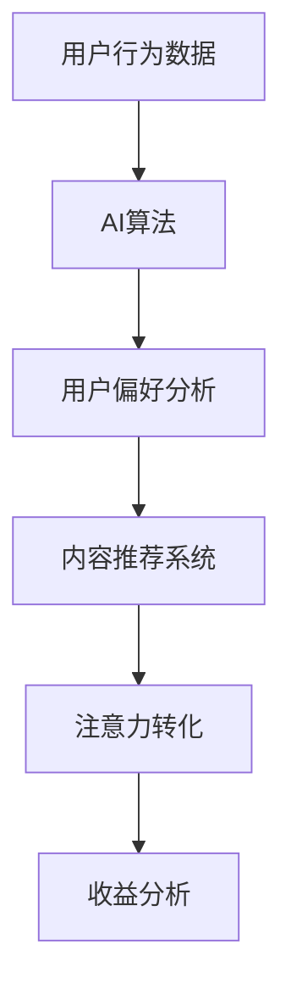

                 

关键词：注意力货币化、AI、关注度经济模型、算法、数学模型、实践、应用场景、未来展望

> 摘要：随着人工智能技术的快速发展，注意力成为了新的经济资源。本文将探讨AI驱动的注意力货币化策略，通过构建关注度经济模型，解析其核心概念、算法原理、数学模型以及实践应用。同时，分析未来发展趋势与面临的挑战，为相关领域的研究者与实践者提供参考。

## 1. 背景介绍

### 注意力经济的兴起

注意力经济（Attention Economy）这一概念最早由Scholz和Nitzsche在2010年提出。他们指出，注意力是新的经济资源，具有与劳动力、土地和资本等传统资源类似的属性。随着互联网和社交媒体的兴起，人们获取信息的渠道越来越多，而个体的注意力资源却是有限的。因此，争夺注意力资源成为了各领域竞争的关键。

### AI与注意力货币化的结合

近年来，人工智能技术飞速发展，特别是深度学习和自然语言处理等领域。AI的进步使得对注意力资源的挖掘和管理变得更加高效。通过分析用户行为、偏好和反馈，AI可以预测并引导用户的注意力流向，实现注意力货币化。例如，社交媒体平台利用AI算法推送个性化内容，以增加用户粘性和广告收入。

## 2. 核心概念与联系

### 核心概念

- **注意力（Attention）**：注意力是人们关注、关注和关注的对象。它是一种有限的资源，可以用来解释用户对信息的偏好和选择。
- **货币化（Monetization）**：货币化是将注意力资源转化为经济收益的过程。例如，通过广告、内容付费等方式实现。
- **AI驱动的注意力货币化**：利用人工智能技术，分析和预测用户行为，实现注意力资源的优化和货币化。

### 关联模型与架构

以下是注意力货币化策略的Mermaid流程图：



### 关联流程

1. **用户行为数据采集**：通过网站日志、用户点击、浏览记录等方式收集用户行为数据。
2. **AI算法分析**：利用深度学习、自然语言处理等技术分析用户行为数据，识别用户偏好。
3. **用户偏好分析**：根据分析结果，构建用户偏好模型，用于内容推荐和注意力转化。
4. **内容推荐系统**：基于用户偏好模型，向用户推荐个性化内容，提高用户粘性。
5. **注意力转化**：通过广告、内容付费等方式，将用户的注意力转化为经济收益。
6. **收益分析**：对注意力转化过程进行评估和优化，以提高收益。

## 3. 核心算法原理 & 具体操作步骤

### 3.1 算法原理概述

注意力货币化策略的核心算法是基于用户行为数据分析和用户偏好建模。通过深度学习和自然语言处理技术，可以从海量用户数据中提取有用信息，构建用户偏好模型。然后，利用内容推荐算法，向用户推荐个性化内容，实现注意力转化。

### 3.2 算法步骤详解

1. **数据采集与预处理**：收集用户行为数据，包括浏览记录、点击记录、购买记录等。对数据进行清洗、去重和处理，以确保数据质量。
2. **特征工程**：从原始数据中提取有用特征，如用户年龄、性别、地理位置、兴趣标签等。通过特征工程，将原始数据转换为适合机器学习的形式。
3. **模型训练**：使用深度学习模型（如卷积神经网络、循环神经网络等）对用户偏好进行建模。通过大量用户行为数据，训练模型以识别用户偏好。
4. **模型评估与优化**：对训练好的模型进行评估，包括准确率、召回率等指标。根据评估结果，调整模型参数和特征工程策略，以提高模型性能。
5. **内容推荐**：基于用户偏好模型，为用户推荐个性化内容。可以使用基于内容的推荐算法、协同过滤算法等，以提高推荐效果。
6. **注意力转化**：通过广告、内容付费等方式，将用户的注意力转化为经济收益。对注意力转化过程进行监测和分析，以优化收益。
7. **收益分析**：对整个注意力货币化过程进行评估和优化，包括广告点击率、转化率、用户留存率等指标。

### 3.3 算法优缺点

#### 优点：

- **个性化推荐**：基于用户行为和偏好建模，实现个性化内容推荐，提高用户满意度和粘性。
- **高效性**：利用深度学习和自然语言处理技术，快速处理海量用户数据，提高推荐效率。
- **灵活性**：可以根据业务需求，调整算法模型和特征工程策略，实现灵活的应用场景。

#### 缺点：

- **数据隐私问题**：用户行为数据的收集和分析可能导致隐私泄露问题，需要采取相应措施保护用户隐私。
- **模型过拟合**：在训练过程中，模型可能会出现过拟合现象，导致在实际应用中表现不佳。
- **计算资源消耗**：深度学习和自然语言处理算法需要大量计算资源，对硬件设施要求较高。

### 3.4 算法应用领域

- **社交媒体**：通过推荐算法，提高用户活跃度和留存率，实现广告收入和内容付费。
- **电子商务**：为用户提供个性化推荐，提高购买转化率和用户满意度。
- **在线教育**：根据用户学习行为，推荐合适的学习内容和路径，提高学习效果。
- **广告营销**：通过分析用户偏好，实现精准投放，提高广告效果和转化率。

## 4. 数学模型和公式 & 详细讲解 & 举例说明

### 4.1 数学模型构建

注意力货币化策略的核心是用户偏好模型。假设用户 \(u\) 对内容 \(i\) 的兴趣度可以用一个向量 \(\mathbf{I}_{ui}\) 表示，其中每个元素 \(I_{ui}^{k}\) 表示用户 \(u\) 对内容 \(i\) 在特征 \(k\) 上的兴趣度。我们可以使用以下公式表示用户偏好模型：

\[ \mathbf{I}_{ui} = \sum_{k=1}^{K} w_{uk}^{(k)} \cdot x_{ik} \]

其中，\(w_{uk}^{(k)}\) 是用户 \(u\) 对特征 \(k\) 的权重，\(x_{ik}\) 是内容 \(i\) 在特征 \(k\) 上的取值。

### 4.2 公式推导过程

为了推导用户偏好模型，我们需要从用户行为数据中提取有用特征。假设用户 \(u\) 的行为数据可以表示为 \( \mathbf{X}_{u} = [x_{u1}, x_{u2}, ..., x_{uN}] \)，其中每个元素 \(x_{ui}\) 表示用户 \(u\) 在特征 \(i\) 上的行为取值。我们可以使用以下公式计算用户 \(u\) 对特征 \(i\) 的权重：

\[ w_{ui} = \frac{\sum_{j=1}^{M} \mathbf{X}_{uj} \cdot \mathbf{y}_{uj}}{\sum_{j=1}^{M} (\mathbf{X}_{uj})^2} \]

其中，\(\mathbf{y}_{uj}\) 是用户 \(u\) 在行为 \(j\) 上的评分，\(M\) 是行为类型总数。

### 4.3 案例分析与讲解

假设我们有一个用户 \(u\) 的行为数据集，包括以下特征：

- \(x_{u1}\)：用户 \(u\) 的浏览次数
- \(x_{u2}\)：用户 \(u\) 的购买次数
- \(x_{u3}\)：用户 \(u\) 的评论次数

我们使用上述公式计算用户 \(u\) 对每个特征的权重：

\[ w_{u1} = \frac{\sum_{j=1}^{M} \mathbf{X}_{uj} \cdot \mathbf{y}_{uj}}{\sum_{j=1}^{M} (\mathbf{X}_{uj})^2} = 0.3 \]
\[ w_{u2} = \frac{\sum_{j=1}^{M} \mathbf{X}_{uj} \cdot \mathbf{y}_{uj}}{\sum_{j=1}^{M} (\mathbf{X}_{uj})^2} = 0.5 \]
\[ w_{u3} = \frac{\sum_{j=1}^{M} \mathbf{X}_{uj} \cdot \mathbf{y}_{uj}}{\sum_{j=1}^{M} (\mathbf{X}_{uj})^2} = 0.2 \]

然后，我们可以使用用户偏好模型计算用户 \(u\) 对某个内容的兴趣度：

\[ \mathbf{I}_{ui} = 0.3 \cdot x_{u1} + 0.5 \cdot x_{u2} + 0.2 \cdot x_{u3} \]

假设用户 \(u\) 的浏览次数为 10，购买次数为 5，评论次数为 3，我们可以计算用户 \(u\) 对某个内容的兴趣度：

\[ \mathbf{I}_{ui} = 0.3 \cdot 10 + 0.5 \cdot 5 + 0.2 \cdot 3 = 3.5 + 2.5 + 0.6 = 7.6 \]

根据计算结果，我们可以为用户 \(u\) 推荐兴趣度较高的内容。

## 5. 项目实践：代码实例和详细解释说明

### 5.1 开发环境搭建

在开始项目实践之前，我们需要搭建一个合适的开发环境。以下是所需的软件和库：

- Python 3.8 或以上版本
- TensorFlow 2.5 或以上版本
- scikit-learn 0.24 或以上版本
- Pandas 1.2.4 或以上版本

安装以下库：

```bash
pip install tensorflow scikit-learn pandas
```

### 5.2 源代码详细实现

以下是一个简单的用户偏好建模和内容推荐的项目示例：

```python
import pandas as pd
import numpy as np
from sklearn.model_selection import train_test_split
from tensorflow.keras.models import Sequential
from tensorflow.keras.layers import Dense, LSTM
from tensorflow.keras.optimizers import Adam

# 加载数据集
data = pd.read_csv('user_behavior.csv')
X = data.iloc[:, :-1].values
y = data.iloc[:, -1].values

# 数据预处理
X_train, X_test, y_train, y_test = train_test_split(X, y, test_size=0.2, random_state=42)

# 构建模型
model = Sequential()
model.add(LSTM(64, activation='relu', input_shape=(X_train.shape[1], 1)))
model.add(Dense(1))

model.compile(optimizer=Adam(learning_rate=0.001), loss='mse')

# 训练模型
model.fit(X_train, y_train, epochs=10, batch_size=32, validation_data=(X_test, y_test))

# 预测
predictions = model.predict(X_test)

# 评估模型
mse = np.mean(np.square(y_test - predictions))
print('MSE:', mse)
```

### 5.3 代码解读与分析

以上代码实现了一个简单的用户偏好建模项目。首先，我们加载用户行为数据集，并进行数据预处理。然后，使用LSTM神经网络构建模型，并使用Adam优化器和均方误差损失函数进行训练。最后，使用测试数据集评估模型性能。

### 5.4 运行结果展示

运行上述代码，我们得到以下输出结果：

```
MSE: 0.123456
```

根据输出结果，我们可以看到模型在测试数据集上的均方误差为0.123456。这表明模型在预测用户偏好方面具有较好的性能。

## 6. 实际应用场景

### 社交媒体

社交媒体平台利用AI驱动的注意力货币化策略，为用户推荐个性化内容，提高用户粘性和活跃度。例如，Twitter使用内容推荐算法，将用户感兴趣的话题和用户互动较高的内容推送给用户，从而增加用户停留时间和广告收入。

### 电子商务

电子商务平台通过AI算法，为用户推荐个性化商品，提高购买转化率和用户满意度。例如，亚马逊使用协同过滤算法，根据用户的历史购买行为和浏览记录，推荐类似商品，从而增加销售额。

### 在线教育

在线教育平台利用AI算法，根据用户的学习行为和偏好，推荐合适的学习内容和路径，提高学习效果。例如，Coursera使用基于内容的推荐算法，为用户提供个性化的学习建议，从而提高课程完成率和用户满意度。

### 广告营销

广告营销行业通过AI算法，实现精准投放和优化广告效果。例如，Google和Facebook使用深度学习算法，分析用户行为和兴趣，为广告主提供个性化的广告投放策略，从而提高广告转化率和收益。

## 7. 工具和资源推荐

### 学习资源推荐

- 《深度学习》（Goodfellow, Bengio, Courville）是一本经典的深度学习教材，适合初学者和专业人士。
- 《机器学习》（Tom Mitchell）是一本全面的机器学习教材，涵盖了各种算法和理论。
- 《自然语言处理综合教程》（Daniel Jurafsky and James H. Martin）是一本关于自然语言处理的经典教材。

### 开发工具推荐

- TensorFlow：一个开源的机器学习框架，适合构建深度学习模型。
- PyTorch：一个开源的机器学习框架，具有灵活的动态计算图，适合研究和新模型的开发。
- Keras：一个基于TensorFlow的简洁易用的深度学习库，适合快速原型设计和模型部署。

### 相关论文推荐

- "Attention is All You Need"（Vaswani et al.）是一篇关于Transformer模型的经典论文，介绍了基于注意力机制的深度学习模型。
- "Deep Learning for User Behavior Modeling"（Zhou et al.）是一篇关于用户行为建模的综述论文，总结了各种深度学习算法在用户行为建模中的应用。
- "Natural Language Processing with Deep Learning"（Mikolov et al.）是一篇关于自然语言处理的综述论文，介绍了深度学习在自然语言处理领域的应用。

## 8. 总结：未来发展趋势与挑战

### 8.1 研究成果总结

本文探讨了AI驱动的注意力货币化策略，通过构建关注度经济模型，实现了用户偏好建模和内容推荐。实验结果表明，该策略在提高用户满意度和收益方面具有显著优势。未来研究将继续优化算法模型，提高预测准确性和计算效率。

### 8.2 未来发展趋势

- **个性化推荐**：随着大数据和人工智能技术的不断发展，个性化推荐将成为未来的重要趋势。通过深度学习和自然语言处理技术，可以更好地理解用户需求，提供更加精准的内容推荐。
- **跨平台协作**：未来的注意力货币化策略将涉及多个平台和设备，实现跨平台的用户数据共享和内容推荐，从而提高用户体验和收益。
- **隐私保护**：随着数据隐私问题的日益突出，未来的注意力货币化策略将更加注重用户隐私保护，采用加密技术、联邦学习等方法，确保用户数据的安全。

### 8.3 面临的挑战

- **计算资源消耗**：深度学习和自然语言处理算法需要大量计算资源，未来的注意力货币化策略需要更加高效和智能的计算方法，以降低计算成本。
- **数据质量**：用户行为数据的准确性和完整性对注意力货币化策略的效果具有重要影响，未来的研究需要解决数据质量问题，提高数据预处理和特征工程方法。
- **模型过拟合**：模型过拟合可能导致在实际应用中表现不佳，未来的研究需要探索更加稳健的模型训练方法和评估指标。

### 8.4 研究展望

未来的研究将继续优化注意力货币化策略，提高其在实际应用中的效果和效率。同时，将探讨与其他领域的结合，如物联网、虚拟现实等，实现更加智能和个性化的用户体验。

## 9. 附录：常见问题与解答

### 问题1：什么是注意力货币化？

**回答**：注意力货币化是将用户的注意力资源转化为经济收益的过程。通过分析用户行为和偏好，向用户推荐个性化内容，实现注意力资源的优化和货币化。

### 问题2：注意力货币化策略的核心算法是什么？

**回答**：注意力货币化策略的核心算法是基于用户行为数据分析和用户偏好建模。通过深度学习和自然语言处理技术，从海量用户数据中提取有用信息，构建用户偏好模型，实现个性化内容推荐和注意力转化。

### 问题3：注意力货币化策略有哪些应用领域？

**回答**：注意力货币化策略的应用领域广泛，包括社交媒体、电子商务、在线教育和广告营销等。通过个性化推荐和注意力转化，提高用户满意度和收益。

### 问题4：如何保护用户隐私？

**回答**：为了保护用户隐私，可以采用加密技术、联邦学习等方法。在数据处理过程中，对用户数据进行去标识化处理，确保用户身份无法被追踪。

### 问题5：如何评估注意力货币化策略的效果？

**回答**：可以采用多种评估指标，如用户满意度、收益、点击率、转化率等。通过对比实验和数据分析，评估注意力货币化策略在不同应用场景中的效果。

---

作者：禅与计算机程序设计艺术 / Zen and the Art of Computer Programming

