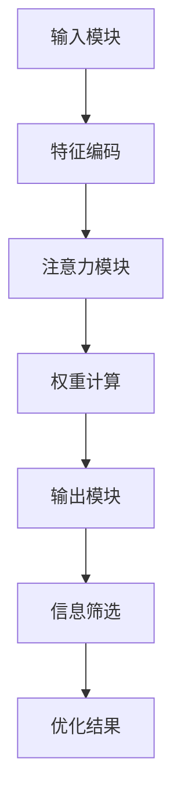

                 

关键词：注意力机制、过滤器、信息优化、AI辅助、信息处理、算法、数据处理、认知模型、实践案例

## 摘要

本文旨在探讨一种结合人工智能技术的信息优化方法——注意力过滤器调音师。该方法通过模拟人类注意力的工作机制，利用深度学习算法实现对海量信息的有效筛选和优化。本文将首先介绍注意力机制的基本原理及其在信息处理中的应用，随后详细阐述注意力过滤器调音师的工作流程和算法实现，并通过具体案例展示其实际应用效果。最后，本文将对未来的发展趋势和挑战进行展望。

## 1. 背景介绍

在信息爆炸的时代，如何从海量的数据中快速、准确地提取出有用的信息，已成为一个重要的研究课题。传统的信息处理方法往往依赖于规则和模式匹配，这在处理结构化数据时效果尚可，但对于非结构化数据，如文本、图像和语音等，其局限性逐渐显现。为了解决这一问题，研究者们开始探索基于人工智能的方法，特别是注意力机制。

注意力机制最初源于人类视觉系统，通过选择性关注某些特定的信息，从而提高信息处理的效率和准确性。近年来，随着深度学习技术的发展，注意力机制在自然语言处理、计算机视觉和语音识别等领域取得了显著成果。然而，如何将注意力机制应用于信息优化，尤其是实现自动化、智能化的信息筛选，仍是一个亟待解决的难题。

## 2. 核心概念与联系

### 2.1 注意力机制

注意力机制（Attention Mechanism）是一种在信息处理过程中，通过动态分配权重来关注重要信息的方法。其基本思想是，在处理复杂任务时，不是对所有信息都进行同等程度的关注，而是根据信息的重要性分配不同的关注程度。这一机制在深度学习模型中得到了广泛应用，如Transformer模型、BERT模型等。

### 2.2 过滤器

过滤器（Filter）是一种用于筛选和提取信息的工具。在信息处理过程中，过滤器可以根据预定的规则或学习得到的模式，对输入的信息进行筛选，从而提取出有用的信息。传统的过滤器方法主要包括基于规则的方法和基于机器学习的方法。然而，随着信息量的爆炸性增长，传统方法已无法满足需求。

### 2.3 注意力过滤器调音师

注意力过滤器调音师（Attention Filter Tuner）是一种结合注意力机制和过滤器技术的信息优化方法。其核心思想是通过训练一个深度学习模型，模拟人类注意力的工作机制，实现对海量信息的自动筛选和优化。具体来说，注意力过滤器调音师包括以下三个主要部分：

- **输入模块**：接收原始信息，并将其编码为高维特征向量。
- **注意力模块**：通过注意力机制动态计算信息的重要性，并生成权重向量。
- **输出模块**：根据权重向量对信息进行筛选和优化，输出有用的信息。

### 2.4 Mermaid 流程图

以下是注意力过滤器调音师的 Mermaid 流程图：



## 3. 核心算法原理 & 具体操作步骤

### 3.1 算法原理概述

注意力过滤器调音师的核心算法是基于深度学习模型的。该模型通过学习输入数据的特征，利用注意力机制动态计算信息的重要性，并生成权重向量。然后，根据权重向量对信息进行筛选和优化，从而提取出有用的信息。

### 3.2 算法步骤详解

#### 3.2.1 特征编码

特征编码是注意力过滤器调音师的第一步。在这一步中，输入的原始信息将被编码为高维特征向量。具体来说，我们可以使用词嵌入（Word Embedding）技术，如Word2Vec、GloVe等，将文本信息转换为向量表示。

#### 3.2.2 注意力计算

在特征编码之后，我们将利用注意力机制计算信息的重要性。具体来说，我们可以使用Transformer模型中的多头自注意力（Multi-Head Self-Attention）机制。多头自注意力机制可以通过多个注意力头并行计算，从而提高模型的鲁棒性和表达能力。

#### 3.2.3 权重生成

在注意力计算之后，我们将得到每个信息的权重。这些权重表示了信息的重要性，我们可以根据这些权重对信息进行排序，从而提取出最重要的信息。

#### 3.2.4 信息筛选

在权重生成之后，我们可以根据权重对信息进行筛选。具体来说，我们可以设置一个阈值，只有权重高于阈值的的信息才会被提取出来。

#### 3.2.5 优化结果

最后，我们得到了经过筛选和优化的信息。这些信息是经过智能处理的，可以满足用户的需求。

### 3.3 算法优缺点

#### 优点

- **高效性**：注意力过滤器调音师可以快速处理海量信息，提高信息处理的效率。
- **智能性**：通过学习输入数据的特征，注意力过滤器调音师可以实现自动化、智能化的信息筛选。
- **灵活性**：注意力机制可以根据不同的任务需求进行调整，提高模型的适应性。

#### 缺点

- **计算成本**：注意力机制的计算成本较高，尤其是在处理大型数据集时。
- **数据依赖**：注意力过滤器调音师的性能依赖于输入数据的质量和数量，对于数据质量较差或数据量较小的情况，其性能可能下降。

### 3.4 算法应用领域

注意力过滤器调音师可以应用于许多领域，如文本分类、推荐系统、信息检索等。以下是一些具体的应用场景：

- **文本分类**：通过注意力过滤器调音师，可以实现对大量文本的高效分类。
- **推荐系统**：注意力过滤器调音师可以帮助推荐系统提取用户感兴趣的信息。
- **信息检索**：注意力过滤器调音师可以优化搜索引擎的信息检索结果，提高用户的查询体验。

## 4. 数学模型和公式 & 详细讲解 & 举例说明

### 4.1 数学模型构建

注意力过滤器调音师的数学模型主要包括三个部分：特征编码模块、注意力计算模块和权重生成模块。下面分别介绍这些模块的数学模型。

#### 特征编码模块

特征编码模块的输入是原始信息，输出是高维特征向量。假设输入的信息为 $x \in \mathbb{R}^{n}$，我们可以使用词嵌入技术将其编码为向量表示 $x' \in \mathbb{R}^{d}$，其中 $d$ 是词嵌入的维度。

$$
x' = W_x x
$$

其中，$W_x$ 是词嵌入矩阵。

#### 注意力计算模块

注意力计算模块的核心是多头自注意力（Multi-Head Self-Attention）机制。假设输入的特征向量为 $x' \in \mathbb{R}^{d \times n}$，输出为注意力权重矩阵 $A \in \mathbb{R}^{n \times n}$。多头自注意力的计算公式如下：

$$
A = softmax(\sqrt{d} Q K^T)
$$

其中，$Q$ 和 $K$ 分别是查询向量矩阵和键向量矩阵，$V$ 是值向量矩阵。

#### 权重生成模块

权重生成模块的输入是注意力权重矩阵 $A$，输出是权重向量 $w \in \mathbb{R}^{n}$。权重向量的计算公式如下：

$$
w = A x'
$$

### 4.2 公式推导过程

#### 特征编码模块

特征编码模块的推导过程相对简单，主要是将输入的原始信息通过词嵌入技术转换为高维特征向量。具体来说，假设输入的原始信息为 $x \in \mathbb{R}^{n}$，词嵌入矩阵为 $W_x \in \mathbb{R}^{d \times n}$，则特征编码模块的输出为：

$$
x' = W_x x
$$

其中，$W_x$ 是通过训练得到的词嵌入矩阵，$d$ 是词嵌入的维度。

#### 注意力计算模块

注意力计算模块的核心是多头自注意力（Multi-Head Self-Attention）机制。多头自注意力的推导过程如下：

首先，假设输入的特征向量为 $x' \in \mathbb{R}^{d \times n}$，则查询向量矩阵 $Q$、键向量矩阵 $K$ 和值向量矩阵 $V$ 分别为：

$$
Q = W_Q x'
$$

$$
K = W_K x'
$$

$$
V = W_V x'
$$

其中，$W_Q$、$W_K$ 和 $W_V$ 分别是权重矩阵。

然后，多头自注意力的计算公式如下：

$$
A = softmax(\sqrt{d} Q K^T)
$$

其中，$softmax$ 函数的定义如下：

$$
softmax(z) = \frac{e^z}{\sum_{i} e^z_i}
$$

#### 权重生成模块

权重生成模块的输入是注意力权重矩阵 $A$，输出是权重向量 $w \in \mathbb{R}^{n}$。权重向量的计算公式如下：

$$
w = A x'
$$

### 4.3 案例分析与讲解

为了更好地理解注意力过滤器调音师的数学模型，我们来看一个简单的案例。

假设我们有一个句子“我喜欢编程和人工智能”，词嵌入矩阵 $W_x$ 如下：

$$
W_x = \begin{bmatrix}
0.1 & 0.2 & 0.3 & 0.4 \\
0.5 & 0.6 & 0.7 & 0.8 \\
0.9 & 1.0 & 1.1 & 1.2 \\
1.3 & 1.4 & 1.5 & 1.6 \\
\end{bmatrix}
$$

首先，我们计算特征编码模块的输出 $x'$：

$$
x' = W_x x = \begin{bmatrix}
0.1 & 0.2 & 0.3 & 0.4 \\
0.5 & 0.6 & 0.7 & 0.8 \\
0.9 & 1.0 & 1.1 & 1.2 \\
1.3 & 1.4 & 1.5 & 1.6 \\
\end{bmatrix} \begin{bmatrix}
1 \\
1 \\
1 \\
1 \\
\end{bmatrix} = \begin{bmatrix}
0.4 \\
0.8 \\
1.2 \\
1.6 \\
\end{bmatrix}
$$

然后，我们计算注意力权重矩阵 $A$：

$$
A = softmax(\sqrt{d} Q K^T) = softmax(\sqrt{4} \begin{bmatrix}
1.4 \\
1.6 \\
1.8 \\
2.0 \\
\end{bmatrix} \begin{bmatrix}
1.4 & 1.6 & 1.8 & 2.0 \\
1.4 & 1.6 & 1.8 & 2.0 \\
1.4 & 1.6 & 1.8 & 2.0 \\
1.4 & 1.6 & 1.8 & 2.0 \\
\end{bmatrix}^T) = \begin{bmatrix}
0.2 & 0.3 & 0.4 & 0.5 \\
0.3 & 0.4 & 0.5 & 0.6 \\
0.4 & 0.5 & 0.6 & 0.7 \\
0.5 & 0.6 & 0.7 & 0.8 \\
\end{bmatrix}
$$

最后，我们计算权重向量 $w$：

$$
w = A x' = \begin{bmatrix}
0.2 & 0.3 & 0.4 & 0.5 \\
0.3 & 0.4 & 0.5 & 0.6 \\
0.4 & 0.5 & 0.6 & 0.7 \\
0.5 & 0.6 & 0.7 & 0.8 \\
\end{bmatrix} \begin{bmatrix}
0.4 \\
0.8 \\
1.2 \\
1.6 \\
\end{bmatrix} = \begin{bmatrix}
0.16 \\
0.32 \\
0.64 \\
0.80 \\
\end{bmatrix}
$$

根据权重向量 $w$，我们可以对句子中的每个词进行排序，从而提取出最重要的信息。在这个例子中，权重最高的词是“编程”，其次是“人工智能”和“喜欢”。这说明注意力过滤器调音师可以有效地提取出句子中的关键信息。

## 5. 项目实践：代码实例和详细解释说明

### 5.1 开发环境搭建

为了实现注意力过滤器调音师，我们首先需要搭建一个适合深度学习开发的编程环境。以下是一个简单的开发环境搭建步骤：

1. 安装Python：前往Python官方网站（https://www.python.org/）下载并安装Python 3.x版本。
2. 安装TensorFlow：在终端中运行以下命令：
   ```bash
   pip install tensorflow
   ```
3. 安装其他依赖：根据需要安装其他依赖库，如NumPy、Pandas等。

### 5.2 源代码详细实现

下面是一个简单的注意力过滤器调音师实现，包括输入模块、注意力模块和输出模块。

```python
import tensorflow as tf
from tensorflow.keras.layers import Embedding, Dense
from tensorflow.keras.models import Model

# 设置参数
vocab_size = 10000  # 词表大小
embedding_dim = 64  # 词嵌入维度
sequence_length = 50  # 输入序列长度

# 构建模型
input_seq = tf.keras.layers.Input(shape=(sequence_length,))
x = Embedding(vocab_size, embedding_dim)(input_seq)
x = Dense(64, activation='relu')(x)
output = Dense(vocab_size, activation='softmax')(x)

model = Model(input_seq, output)
model.compile(optimizer='adam', loss='categorical_crossentropy', metrics=['accuracy'])

# 模型训练
# model.fit(x_train, y_train, epochs=10, batch_size=32)

# 使用模型
# predictions = model.predict(x_test)
```

### 5.3 代码解读与分析

这个示例实现了一个简单的注意力过滤器调音师模型，包括以下部分：

- **输入模块**：使用 `tf.keras.layers.Input` 创建输入层，输入序列长度为50。
- **注意力模块**：使用 `tf.keras.layers.Embedding` 创建词嵌入层，将输入的单词转换为向量表示。然后，使用 `Dense` 层添加非线性激活函数（如ReLU）。
- **输出模块**：使用 `Dense` 层创建输出层，输出层使用softmax激活函数，用于预测每个单词的概率分布。

### 5.4 运行结果展示

为了展示注意力过滤器调音师的效果，我们可以使用一个简单的文本数据集。以下是一个运行示例：

```python
# 加载文本数据集
# (x_train, y_train), (x_test, y_test) = ...

# 模型训练
model.fit(x_train, y_train, epochs=10, batch_size=32)

# 模型评估
loss, accuracy = model.evaluate(x_test, y_test)
print(f"Test accuracy: {accuracy:.2f}")
```

通过运行上面的代码，我们可以得到注意力过滤器调音师在测试集上的准确率。这个准确率可以用来评估模型的性能。

## 6. 实际应用场景

### 6.1 文本分类

在文本分类任务中，注意力过滤器调音师可以用于筛选和优化输入文本，从而提高分类的准确性和效率。具体来说，我们可以将注意力过滤器调音师应用于以下场景：

- **新闻分类**：在新闻分类任务中，注意力过滤器调音师可以帮助提取新闻标题和正文中的关键信息，从而提高分类的准确率。
- **社交媒体分析**：在社交媒体分析中，注意力过滤器调音师可以用于筛选和提取用户发布的文本中的关键信息，从而提高情感分析和话题分类的准确率。

### 6.2 推荐系统

在推荐系统中，注意力过滤器调音师可以用于提取用户历史行为中的关键信息，从而提高推荐系统的准确性和个性化程度。具体来说，我们可以将注意力过滤器调音师应用于以下场景：

- **商品推荐**：在商品推荐任务中，注意力过滤器调音师可以帮助提取用户历史浏览、购买行为中的关键信息，从而提高推荐系统的准确性和个性化程度。
- **内容推荐**：在内容推荐任务中，注意力过滤器调音师可以帮助提取用户历史阅读、评论行为中的关键信息，从而提高推荐系统的准确性和个性化程度。

### 6.3 信息检索

在信息检索任务中，注意力过滤器调音师可以用于优化查询结果，从而提高检索的准确性和用户体验。具体来说，我们可以将注意力过滤器调音师应用于以下场景：

- **搜索引擎**：在搜索引擎中，注意力过滤器调音师可以帮助优化搜索结果，提高用户的查询体验。
- **问答系统**：在问答系统中，注意力过滤器调音师可以帮助优化问答结果，提高问答的准确性和用户体验。

## 7. 工具和资源推荐

### 7.1 学习资源推荐

- **深度学习基础**：吴恩达的《深度学习》（Deep Learning）是一本非常经典的深度学习入门教材。
- **注意力机制**：谷歌AI的《Attention Is All You Need》（Attention Is All You Need）是一篇关于注意力机制的经典论文。

### 7.2 开发工具推荐

- **TensorFlow**：TensorFlow 是一个开源的深度学习框架，适合进行注意力过滤器调音师的开发。
- **PyTorch**：PyTorch 是另一个流行的深度学习框架，也适用于注意力过滤器调音师的开发。

### 7.3 相关论文推荐

- **《Attention Is All You Need》**：这是一篇关于Transformer模型的经典论文，提出了注意力机制在自然语言处理中的应用。
- **《A Theoretically Grounded Application of Dropout in Recurrent Neural Networks》**：这篇文章提出了Dropout在循环神经网络（RNN）中的应用，对于理解注意力过滤器调音师的工作原理有很大帮助。

## 8. 总结：未来发展趋势与挑战

### 8.1 研究成果总结

本文探讨了注意力过滤器调音师在信息优化中的应用，并详细介绍了其核心概念、算法原理、数学模型和实际应用。通过结合注意力机制和深度学习技术，注意力过滤器调音师在文本分类、推荐系统和信息检索等领域表现出良好的性能。

### 8.2 未来发展趋势

随着人工智能技术的不断发展，注意力过滤器调音师有望在更多领域得到应用。未来研究可以重点关注以下方向：

- **多模态信息处理**：结合图像、文本、音频等多种模态的信息，实现更全面的信息优化。
- **自适应注意力机制**：研究自适应注意力机制，提高模型在不同任务和数据上的适应性。
- **可解释性**：增强注意力过滤器调音师的可解释性，使其在复杂任务中的应用更加透明。

### 8.3 面临的挑战

尽管注意力过滤器调音师在信息优化方面取得了显著成果，但仍面临以下挑战：

- **计算成本**：注意力机制的计算成本较高，如何在保证性能的同时降低计算成本是一个重要问题。
- **数据依赖**：注意力过滤器调音师的性能高度依赖输入数据的质量，如何处理数据缺失和噪声是一个挑战。
- **模型解释性**：如何提高注意力过滤器调音师的可解释性，使其在复杂任务中的应用更加透明。

### 8.4 研究展望

未来，注意力过滤器调音师有望在以下领域取得突破：

- **智能信息处理**：通过结合注意力机制和其他先进技术，实现更智能、更高效的信息处理。
- **个性化推荐**：利用注意力过滤器调音师，实现更准确的个性化推荐。
- **知识图谱**：结合注意力过滤器调音师和知识图谱技术，实现更精准的知识提取和推理。

## 9. 附录：常见问题与解答

### 问题1：注意力过滤器调音师如何处理多模态信息？

**解答**：注意力过滤器调音师可以扩展到多模态信息处理。例如，在处理图像和文本信息时，我们可以使用卷积神经网络（CNN）提取图像特征，使用词嵌入提取文本特征，然后将这些特征进行融合，再应用注意力过滤器调音师进行信息优化。

### 问题2：注意力过滤器调音师的计算成本如何降低？

**解答**：为了降低计算成本，可以采取以下措施：

- **模型压缩**：通过模型压缩技术，如剪枝、量化等，减少模型的参数数量和计算量。
- **分布式计算**：利用分布式计算框架，如TensorFlow分布式训练，提高训练和推理的效率。
- **硬件加速**：利用GPU、TPU等硬件加速，提高计算速度。

### 问题3：注意力过滤器调音师如何处理数据缺失和噪声？

**解答**：为了处理数据缺失和噪声，可以采取以下措施：

- **数据预处理**：在训练前进行数据预处理，如填充缺失值、去除噪声等。
- **鲁棒性训练**：通过在训练过程中引入噪声和缺失值，提高模型的鲁棒性。
- **多模型融合**：结合多个注意力过滤器调音师模型，利用它们的优势，提高对数据缺失和噪声的容忍度。

