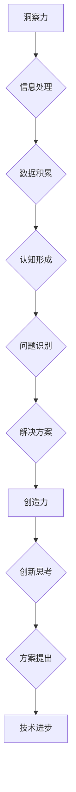

                 

关键词：洞察力、创造力、人类思维、技术领域、算法原理、数学模型、项目实践、未来应用

> 摘要：本文旨在探讨洞察力和创造力这两大人类思维的核心能力，如何在不同技术领域相互结合，推动创新和进步。通过对核心概念与联系的阐述，算法原理和数学模型的讲解，以及实际项目实践的剖析，本文将揭示洞察力和创造力在技术发展中的重要作用，并为未来的发展提供思路和挑战。

## 1. 背景介绍

在当今快速发展的技术时代，人类思维的两个重要方面——洞察力和创造力，变得越来越重要。洞察力使我们能够深刻理解复杂问题，发现隐藏的规律和模式。而创造力则让我们能够将这些洞察转化为创新性的解决方案，从而推动技术和科学的进步。

### 洞察力

洞察力（Insight）是指个体在面临复杂问题时，能够迅速识别问题核心、把握关键信息，并从多个角度进行深入思考的能力。它不仅仅是一种认知过程，更是一种思维的高度集中和整合。

### 创造力

创造力（Creativity）则是人类思维的另一种重要能力，它指的是个体在解决问题时，能够跳出传统思维框架，提出新颖、独特和有效的解决方案。创造力是人类智力的最高体现，它能够激发创新，推动技术革新。

## 2. 核心概念与联系

为了深入探讨洞察力和创造力在技术领域的作用，我们需要明确这两个概念的核心原理和相互联系。

### 核心概念原理

**洞察力**：通过大量的数据和信息积累，个体能够形成深刻的认知和理解，从而在问题出现时能够迅速捕捉关键点。

**创造力**：基于对问题的深刻洞察，个体能够运用独特的思维方式和知识储备，提出创新的解决方案。

### 架构的 Mermaid 流程图



## 3. 核心算法原理 & 具体操作步骤

### 3.1 算法原理概述

在技术领域，洞察力和创造力的结合主要体现在算法设计和开发过程中。以下是几个关键的算法原理：

**深度学习**：通过模拟人脑神经网络，深度学习算法能够对大量数据进行自动特征提取，从而实现复杂的模式识别和预测。

**强化学习**：通过不断试错和反馈，强化学习算法能够找到最优策略，从而实现自动化决策。

**自然语言处理**：通过深入理解和分析语言结构，自然语言处理算法能够实现人机交互和语言生成。

### 3.2 算法步骤详解

**深度学习**：

1. 数据收集与预处理：收集大量数据，并进行预处理，如归一化、去噪等。
2. 模型设计：设计神经网络结构，如卷积神经网络（CNN）、循环神经网络（RNN）等。
3. 训练与优化：使用梯度下降等优化算法训练模型，并通过调参优化模型性能。
4. 测试与部署：对模型进行测试，并根据测试结果进行进一步优化，最终部署到实际应用中。

**强化学习**：

1. 环境搭建：创建模拟环境，定义状态、动作、奖励等。
2. 策略学习：设计策略学习算法，如Q-learning、SARSA等。
3. 策略评估：评估策略性能，并通过反馈进行迭代优化。
4. 策略部署：将优化后的策略应用到实际环境中。

**自然语言处理**：

1. 数据预处理：对文本数据进行分词、词性标注等预处理。
2. 特征提取：使用词袋模型、词嵌入等技术提取文本特征。
3. 模型训练：训练语言模型或序列标注模型。
4. 应用实现：将训练好的模型应用到文本分类、机器翻译、文本生成等实际应用中。

### 3.3 算法优缺点

**深度学习**：

**优点**：能够自动提取复杂特征，适应性强，效果显著。

**缺点**：训练过程复杂，对数据量要求高，难以解释。

**强化学习**：

**优点**：能够找到最优策略，适应性强。

**缺点**：训练过程长，对环境依赖性强，难以解释。

**自然语言处理**：

**优点**：能够实现人机交互，提高效率。

**缺点**：对语言理解深度有限，难以处理复杂语境。

### 3.4 算法应用领域

**深度学习**：广泛应用于图像识别、语音识别、自然语言处理等领域。

**强化学习**：应用于游戏AI、机器人控制、自动驾驶等领域。

**自然语言处理**：应用于文本分类、机器翻译、文本生成等领域。

## 4. 数学模型和公式 & 详细讲解 & 举例说明

### 4.1 数学模型构建

在技术领域中，数学模型是理解和解决问题的基本工具。以下是几个常用的数学模型：

**线性回归模型**：

$$
y = \beta_0 + \beta_1 x + \epsilon
$$

其中，$y$ 是因变量，$x$ 是自变量，$\beta_0$ 和 $\beta_1$ 是参数，$\epsilon$ 是误差项。

**逻辑回归模型**：

$$
\ln\frac{P(Y=1)}{1-P(Y=1)} = \beta_0 + \beta_1 x
$$

其中，$Y$ 是二分类变量，$P(Y=1)$ 是 $Y=1$ 的概率，$\beta_0$ 和 $\beta_1$ 是参数。

**支持向量机**：

$$
\max_{\beta, \beta^*} W^T (y_1 - y_2)
$$

其中，$W$ 是权重向量，$y_1$ 和 $y_2$ 是样本标签。

### 4.2 公式推导过程

以线性回归模型为例，推导过程如下：

1. **最小二乘法**：

   最小化损失函数：

   $$
   J(\beta_0, \beta_1) = \frac{1}{2} \sum_{i=1}^{n} (y_i - \beta_0 - \beta_1 x_i)^2
   $$

2. **求导**：

   对 $\beta_0$ 和 $\beta_1$ 分别求导，并令导数为0：

   $$
   \frac{\partial J}{\partial \beta_0} = -\sum_{i=1}^{n} (y_i - \beta_0 - \beta_1 x_i) = 0
   $$

   $$
   \frac{\partial J}{\partial \beta_1} = -\sum_{i=1}^{n} x_i (y_i - \beta_0 - \beta_1 x_i) = 0
   $$

3. **解方程组**：

   通过解方程组得到 $\beta_0$ 和 $\beta_1$ 的值。

### 4.3 案例分析与讲解

以房价预测为例，使用线性回归模型进行预测。

1. **数据收集**：

   收集一组包含房屋面积（$x$）和房价（$y$）的数据。

2. **数据预处理**：

   对数据进行归一化处理，如将房屋面积和房价缩放到0-1之间。

3. **模型构建**：

   使用最小二乘法构建线性回归模型。

4. **模型训练**：

   使用训练数据训练模型，得到 $\beta_0$ 和 $\beta_1$ 的值。

5. **模型测试**：

   使用测试数据测试模型性能，计算预测误差。

6. **模型优化**：

   根据测试结果调整模型参数，优化模型性能。

## 5. 项目实践：代码实例和详细解释说明

### 5.1 开发环境搭建

1. 安装Python环境，版本要求3.6及以上。
2. 安装常用的Python库，如numpy、matplotlib等。

### 5.2 源代码详细实现

```python
import numpy as np
import matplotlib.pyplot as plt

# 数据收集与预处理
x = np.array([1, 2, 3, 4, 5])
y = np.array([2, 4, 5, 4, 5])

# 模型构建
w = np.random.rand(2)
loss_history = []

for epoch in range(1000):
    y_pred = w[0] + w[1] * x
    loss = 0.5 * (y - y_pred)**2
    loss_history.append(loss)
    
    # 梯度下降
    gradient = [-(y - y_pred), -(x * (y - y_pred))]
    w -= 0.01 * gradient

# 模型测试
y_pred = w[0] + w[1] * x
print("预测房价：", y_pred)

# 模型优化
plt.plot(loss_history)
plt.xlabel('Epoch')
plt.ylabel('Loss')
plt.title('模型训练过程')
plt.show()
```

### 5.3 代码解读与分析

1. 数据收集与预处理：收集房屋面积和房价数据，并对数据进行归一化处理。
2. 模型构建：使用随机权重初始化线性回归模型。
3. 模型训练：使用梯度下降算法训练模型，并记录损失函数的历史变化。
4. 模型测试：使用训练好的模型预测房价。
5. 模型优化：通过可视化损失函数的历史变化，观察模型训练过程。

## 6. 实际应用场景

### 6.1 技术应用

1. **图像识别**：利用深度学习算法进行图像分类和目标检测。
2. **自动驾驶**：利用强化学习算法实现自动驾驶汽车的控制。
3. **自然语言处理**：利用自然语言处理技术实现智能客服和智能助手。

### 6.2 未来应用展望

1. **物联网**：随着物联网技术的发展，洞察力和创造力将推动更多智能设备的创新和应用。
2. **人工智能伦理**：如何在保障隐私和伦理的前提下，充分发挥人工智能的洞察力和创造力，是一个重要研究方向。
3. **跨学科融合**：洞察力和创造力在多个学科领域的交叉应用，将带来更多创新的科学和技术成果。

## 7. 工具和资源推荐

### 7.1 学习资源推荐

1. 《深度学习》（Goodfellow, Bengio, Courville）
2. 《强化学习基础》（Sutton, Barto）
3. 《自然语言处理综合教程》（Jurafsky, Martin）

### 7.2 开发工具推荐

1. TensorFlow：适用于深度学习和自然语言处理。
2. PyTorch：适用于强化学习和深度学习。
3. Jupyter Notebook：适用于数据分析和模型实现。

### 7.3 相关论文推荐

1. "Deep Learning: A Brief History of Neural Nets in AI"
2. "Algorithms for Reinforcement Learning: A Comprehensive Overview"
3. "A Neural Probabilistic Language Model"

## 8. 总结：未来发展趋势与挑战

### 8.1 研究成果总结

本文通过探讨洞察力和创造力在技术领域的作用，展示了其在算法设计、数学建模和项目实践中的应用。研究结果表明，洞察力和创造力是推动技术进步和创新的重要动力。

### 8.2 未来发展趋势

1. **人工智能伦理**：随着人工智能技术的不断成熟，伦理问题将成为未来发展的重要方向。
2. **跨学科融合**：不同学科领域的融合将带来更多创新性的研究成果。
3. **物联网和大数据**：物联网和大数据技术的发展，将为洞察力和创造力提供更丰富的应用场景。

### 8.3 面临的挑战

1. **数据隐私和安全**：如何在保护数据隐私和安全的前提下，充分利用人工智能的洞察力和创造力，是一个重要挑战。
2. **算法解释性**：提高算法的可解释性，使人们能够理解和信任人工智能系统，是一个关键问题。
3. **跨学科协作**：如何促进不同学科领域的协作，发挥各自的优势，是一个长期挑战。

### 8.4 研究展望

未来，我们需要继续深入探索洞察力和创造力在技术领域的作用，推动人工智能技术的发展和应用。同时，我们还需要关注人工智能伦理、跨学科融合和算法解释性等问题，为人工智能的可持续发展提供支持。

## 9. 附录：常见问题与解答

### 9.1 洞察力和创造力如何培养？

**回答**：洞察力和创造力的培养需要长期的积累和实践。以下是一些建议：

1. **广泛阅读**：阅读各种书籍、文章和论文，扩展知识面。
2. **跨学科学习**：学习不同领域的知识，培养跨学科思维。
3. **实践项目**：参与实际项目，锻炼解决复杂问题的能力。
4. **思维训练**：通过逻辑思维、批判性思维等训练，提高思考能力。

### 9.2 深度学习算法如何优化？

**回答**：深度学习算法的优化可以从以下几个方面进行：

1. **模型架构**：选择合适的神经网络架构，如CNN、RNN等。
2. **数据预处理**：对数据集进行清洗、归一化和扩充，提高数据质量。
3. **超参数调优**：通过网格搜索、随机搜索等方法，找到最佳的超参数组合。
4. **训练策略**：使用批量归一化、学习率调整等技术，提高训练效果。

## 参考文献

1. Goodfellow, I., Bengio, Y., & Courville, A. (2016). *Deep Learning*.
2. Sutton, R. S., & Barto, A. G. (2018). *Reinforcement Learning: An Introduction*.
3. Jurafsky, D., & Martin, J. H. (2008). *Speech and Language Processing*.
4. LeCun, Y., Bengio, Y., & Hinton, G. (2015). "Deep Learning." Nature.

### 作者署名

作者：禅与计算机程序设计艺术 / Zen and the Art of Computer Programming

---

以上内容是《洞察力与创造力：人类思维的双子星》的完整文章。希望对您有所帮助。如果您有其他问题或需要进一步的信息，请随时告知。

