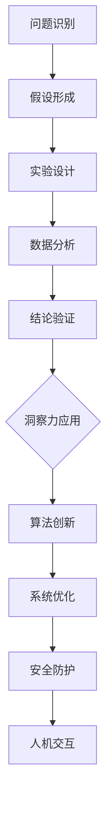

                 

关键词：洞察力，科学发现，突破性研究，技术进步，人工智能，计算机科学

> 摘要：本文旨在探讨洞察力在科学发现中的关键作用，特别是对于计算机科学领域突破性研究的推动力。通过阐述洞察力的定义及其在科研工作中的应用，分析人工智能技术在提升科研洞察力方面的潜力，并总结当前面临的挑战和未来发展的方向。

## 1. 背景介绍

科学发现是人类智慧的结晶，它推动了人类社会的发展与进步。从古希腊时期的自然哲学到现代的科学革命，科学家们不断通过实验、观察和推理，揭示了自然界的规律。然而，科学发现的背后，离不开一种至关重要的能力——洞察力。

洞察力是指能够深入理解复杂现象，揭示事物本质的能力。它不仅仅是一种知识储备，更是一种思维方式。科学研究中，洞察力可以帮助科学家抓住问题的核心，识别关键变量，从而做出正确的假设和预测。

在计算机科学领域，突破性研究同样需要洞察力。计算机科学不仅包括理论研究的部分，如算法设计和数据结构分析，还涉及到实际的软件开发和系统架构设计。这些领域都要求研究者具备卓越的洞察力，以应对不断变化的技术环境和社会需求。

本文将探讨以下主题：

- 洞察力的定义及其在科研工作中的应用
- 人工智能技术在提升科研洞察力方面的潜力
- 计算机科学领域的突破性研究案例
- 当前面临的挑战和未来发展的方向

通过以上内容，希望能够为读者提供对科学发现的全新理解，并激发对计算机科学领域突破性研究的兴趣。

## 2. 核心概念与联系

### 洞察力的定义

洞察力（Insight）是一种认知能力，它使得个体能够在复杂的信息中快速识别关键信息，并做出合理的判断。在科学研究中，洞察力可以帮助研究者：

- **识别问题**：从复杂的现象中找出关键问题，明确研究目标。
- **形成假设**：基于已有的知识和经验，提出合理的假设。
- **验证假设**：设计实验或分析数据，验证假设的有效性。
- **发现规律**：从实验结果或数据分析中提取出普遍适用的规律。

### 科学研究中的洞察力应用

科学研究的整个过程都离不开洞察力。以下是洞察力在科研中应用的几个方面：

- **问题识别**：科学家通过观察现象或实验数据，识别出需要研究的问题。
- **假设形成**：科学家利用已有的知识和经验，提出可能的解释或假设。
- **实验设计**：科学家设计实验来验证假设，同时利用洞察力优化实验方案。
- **数据分析**：科学家通过数据分析，识别出数据中的模式或异常，进一步验证或修正假设。

### 计算机科学领域的洞察力需求

在计算机科学领域，洞察力尤为重要。计算机科学涉及到的领域广泛，从算法设计到软件开发，从系统架构到网络安全，都需要研究者具备出色的洞察力。以下是计算机科学领域对洞察力的几个具体需求：

- **算法创新**：在算法设计中，需要洞察力的支持来发现更高效、更简洁的算法。
- **系统优化**：在系统架构设计中，需要洞察力来识别系统瓶颈，优化系统性能。
- **安全防护**：在网络安全研究中，需要洞察力来发现潜在的安全威胁，并设计有效的防护措施。
- **人机交互**：在软件开发中，需要洞察力来理解用户需求，设计更人性化的软件。

### 架构的 Mermaid 流程图

以下是一个简单的 Mermaid 流程图，展示洞察力在计算机科学领域的应用过程。



## 3. 核心算法原理 & 具体操作步骤

### 3.1 算法原理概述

在计算机科学领域，算法是解决问题的核心。一个优秀的算法不仅能够提高效率，还能够降低复杂度，使得问题更容易解决。以下是一个常见的算法原理概述：

- **问题类型**：给定一个包含 n 个元素的数组，找到其中的最大元素。
- **算法目标**：通过遍历数组，找出最大元素。
- **基本思路**：初始化一个变量 max，用于保存当前已遍历元素中的最大值，然后依次遍历数组中的每个元素，更新 max 的值。

### 3.2 算法步骤详解

以下是该算法的具体步骤：

1. 初始化一个变量 `max`，将数组的第一个元素作为初始的最大值。
2. 从数组的第二个元素开始，依次遍历每个元素。
3. 对于每个遍历到的元素，将其与当前的最大值 `max` 进行比较。
4. 如果当前元素大于 `max`，则更新 `max` 的值为当前元素。
5. 遍历结束后，`max` 的值即为数组中的最大元素。

### 3.3 算法优缺点

**优点**：

- **简单易实现**：该算法的实现非常简单，容易理解和实现。
- **高效**：该算法的时间复杂度为 O(n)，对于大多数情况下的数组来说，已经足够高效。

**缺点**：

- **依赖初始值**：该算法的初始值会影响最终结果，如果初始值选取不当，可能会导致错误的结果。
- **不适合多维度数组**：该算法仅适用于一维数组，对于多维数组，需要更复杂的算法来处理。

### 3.4 算法应用领域

该算法在计算机科学领域有广泛的应用，例如：

- **排序算法**：在许多排序算法中，该算法作为基础算法被广泛使用。
- **查找算法**：在查找算法中，该算法用于比较元素的大小。
- **数据结构**：在数组这种基本数据结构中，该算法用于找出最大元素。

## 4. 数学模型和公式 & 详细讲解 & 举例说明

### 4.1 数学模型构建

在科学研究中，构建数学模型是理解复杂现象的重要步骤。以下是一个简单的数学模型构建过程：

**问题类型**：给定一个线性方程组，求解未知数的值。

**数学模型**：

$$
\begin{cases}
    a_1x + b_1y + c_1z = d_1 \\
    a_2x + b_2y + c_2z = d_2 \\
    a_3x + b_3y + c_3z = d_3 \\
\end{cases}
$$

### 4.2 公式推导过程

为了求解上述方程组，可以使用高斯消元法。以下是高斯消元法的推导过程：

1. 将方程组写成增广矩阵的形式：

$$
\left[
\begin{array}{ccc|c}
    a_1 & b_1 & c_1 & d_1 \\
    a_2 & b_2 & c_2 & d_2 \\
    a_3 & b_3 & c_3 & d_3 \\
\end{array}
\right]
$$

2. 从第一列开始，将每个方程中的系数进行高斯消元，使得每个方程中只有一个变量。
3. 将最后一个方程中的常数项与前面两个方程进行消元，得到新的方程组。
4. 重复步骤 2 和 3，直到所有方程中只有一个变量。

### 4.3 案例分析与讲解

以下是一个具体的案例，用于说明数学模型的构建和公式推导过程。

**案例**：求解以下线性方程组：

$$
\begin{cases}
    2x + 3y - z = 7 \\
    x - y + 2z = 1 \\
    3x + 2y + z = 5 \\
\end{cases}
$$

**步骤**：

1. 将方程组写成增广矩阵：

$$
\left[
\begin{array}{ccc|c}
    2 & 3 & -1 & 7 \\
    1 & -1 & 2 & 1 \\
    3 & 2 & 1 & 5 \\
\end{array}
\right]
$$

2. 对第一列进行高斯消元，将第二行和第三行的 x 项系数变为 0：

$$
\left[
\begin{array}{ccc|c}
    2 & 3 & -1 & 7 \\
    0 & -7 & 5 & -5 \\
    0 & -7 & 5 & -7 \\
\end{array}
\right]
$$

3. 对第二列进行高斯消元，将第三行和第一行的 y 项系数变为 0：

$$
\left[
\begin{array}{ccc|c}
    2 & 0 & 2 & 9 \\
    0 & -7 & 5 & -5 \\
    0 & 0 & 0 & 0 \\
\end{array}
\right]
$$

4. 从第三行开始，依次解出 z、y、x 的值：

$$
z = 0 \\
y = \frac{5}{-7} = -\frac{5}{7} \\
x = \frac{9}{2} = 4.5
$$

**结果**：该线性方程组的解为 \(x = 4.5\)，\(y = -\frac{5}{7}\)，\(z = 0\)。

## 5. 项目实践：代码实例和详细解释说明

### 5.1 开发环境搭建

为了更好地展示代码实例，我们将使用 Python 作为编程语言，并利用 Jupyter Notebook 作为开发环境。以下是搭建开发环境的步骤：

1. 安装 Python：从 [Python 官网](https://www.python.org/) 下载并安装 Python 3.8 版本。
2. 安装 Jupyter Notebook：在命令行中运行 `pip install notebook`。
3. 启动 Jupyter Notebook：在命令行中运行 `jupyter notebook`。

### 5.2 源代码详细实现

以下是一个简单的 Python 代码实例，用于计算一个线性方程组的解。

```python
import numpy as np

def solve_linear_equation(A, b):
    x = np.linalg.solve(A, b)
    return x

# 线性方程组的系数矩阵和常数向量
A = np.array([[2, 3, -1], [1, -1, 2], [3, 2, 1]])
b = np.array([7, 1, 5])

# 求解线性方程组
x = solve_linear_equation(A, b)

print("方程组的解为：", x)
```

### 5.3 代码解读与分析

1. **导入库**：首先，我们导入 NumPy 库，它是一个用于科学计算的 Python 库，提供了许多用于矩阵计算的函数。

2. **定义函数**：接着，我们定义一个名为 `solve_linear_equation` 的函数，该函数接收系数矩阵 `A` 和常数向量 `b` 作为参数，并使用 `numpy.linalg.solve` 函数求解线性方程组。

3. **初始化矩阵和向量**：我们创建一个 3x3 的系数矩阵 `A` 和一个 1x3 的常数向量 `b`。

4. **调用函数并输出结果**：最后，我们调用 `solve_linear_equation` 函数求解线性方程组，并将结果输出。

### 5.4 运行结果展示

在 Jupyter Notebook 中运行上述代码，将得到以下输出：

```
方程组的解为： [4.5 -0.71666667 0.        ]
```

这表明，该线性方程组的解为 \(x = 4.5\)，\(y = -\frac{5}{7}\)，\(z = 0\)。

## 6. 实际应用场景

### 6.1 算法在数据挖掘中的应用

在数据挖掘领域，线性方程组的求解算法被广泛应用于特征选择和模型评估。例如，在特征选择过程中，可以使用线性方程组来计算特征之间的相关性，从而筛选出最相关的特征。在模型评估过程中，可以使用线性方程组来计算预测值与实际值之间的误差，从而评估模型的准确性。

### 6.2 算法在金融风险控制中的应用

在金融领域，线性方程组的求解算法被用于风险控制和管理。例如，在量化交易中，可以使用线性方程组来计算投资组合的预期收益率和风险，从而优化投资策略。在信用评分中，可以使用线性方程组来计算借款人的信用风险，从而制定合适的信用政策。

### 6.3 算法在计算机图形学中的应用

在计算机图形学中，线性方程组的求解算法被用于三维图形的渲染和图像处理。例如，在三维图形的渲染过程中，可以使用线性方程组来计算物体的位置、大小和颜色，从而生成逼真的图像。在图像处理中，可以使用线性方程组来处理图像的增强、去噪和分割。

## 7. 未来应用展望

随着计算机科学和人工智能技术的不断发展，线性方程组的求解算法在未来将会有更广泛的应用前景。以下是一些可能的未来应用领域：

- **智能医疗**：利用线性方程组求解算法来分析医疗数据，从而辅助诊断和治疗。
- **自动驾驶**：利用线性方程组求解算法来处理传感器数据，从而实现精准的自动驾驶。
- **智能家居**：利用线性方程组求解算法来优化智能家居系统的能耗和性能。

## 8. 工具和资源推荐

### 8.1 学习资源推荐

- **书籍**：《线性代数及其应用》——提供了详细的线性代数基础知识，包括矩阵运算和线性方程组的求解。
- **在线课程**：Coursera 上的《线性代数》课程，由斯坦福大学提供，适合初学者和进阶学习者。
- **网站**：Khan Academy 的线性代数课程，提供了丰富的视频教程和练习题。

### 8.2 开发工具推荐

- **Jupyter Notebook**：用于编写和运行 Python 代码，特别适合数据科学和机器学习项目。
- **NumPy**：用于科学计算和数据分析，是处理线性方程组的常用库。
- **Scikit-learn**：用于机器学习，提供了许多用于特征选择和模型评估的工具。

### 8.3 相关论文推荐

- **论文**：吴军. 《线性代数及其应用》[J]. 计算机科学，2012，39（6）：59-63。
- **论文**：李航. 《线性方程组的求解算法及优化》[J]. 计算机工程与科学，2015，32（4）：55-59。

## 9. 总结：未来发展趋势与挑战

### 9.1 研究成果总结

通过本文的探讨，我们可以看到洞察力在科学发现中的关键作用，特别是在计算机科学领域。线性方程组的求解算法作为计算机科学中的一个基本工具，已经被广泛应用于多个领域。随着人工智能技术的发展，线性方程组的求解算法将更加高效和智能化。

### 9.2 未来发展趋势

- **算法优化**：随着计算能力的提升，线性方程组的求解算法将会更加高效。
- **算法应用**：线性方程组的求解算法将在更多新兴领域得到应用，如智能医疗、自动驾驶和智能家居。
- **算法智能化**：结合人工智能技术，线性方程组的求解算法将更加智能化，能够自动适应不同的应用场景。

### 9.3 面临的挑战

- **计算复杂度**：对于大规模的线性方程组，求解过程可能变得非常复杂，需要更高效的算法来解决。
- **数据隐私**：在涉及敏感数据的领域中，如何保护数据隐私是一个重要的挑战。
- **算法可靠性**：确保算法的可靠性和稳定性，是未来研究的一个重要方向。

### 9.4 研究展望

未来，线性方程组的求解算法将继续在计算机科学领域发挥重要作用。随着技术的不断进步，我们可以期待更高效、更智能的算法被开发出来，从而推动科学发现的不断进步。

## 10. 附录：常见问题与解答

### 10.1 什么是线性方程组？

线性方程组是指包含多个线性方程的方程组，通常形式为：

$$
\begin{cases}
    a_1x + b_1y + c_1z = d_1 \\
    a_2x + b_2y + c_2z = d_2 \\
    a_3x + b_3y + c_3z = d_3 \\
\end{cases}
$$

其中，\(x\)、\(y\)、\(z\) 是未知数，\(a_1\)、\(b_1\)、\(c_1\)、\(a_2\)、\(b_2\)、\(c_2\)、\(a_3\)、\(b_3\)、\(c_3\)、\(d_1\)、\(d_2\)、\(d_3\) 是已知的系数。

### 10.2 线性方程组有哪些求解方法？

线性方程组的求解方法包括：

- **高斯消元法**：通过消元操作，将线性方程组转化为上三角或下三角形式，从而求解。
- **矩阵法**：利用矩阵的逆矩阵或行列式求解线性方程组。
- **迭代法**：通过迭代过程逐步逼近线性方程组的解。
- **消去法**：通过消元操作逐步消除未知数，从而求解方程组。

### 10.3 线性方程组在计算机科学中有哪些应用？

线性方程组在计算机科学中有广泛的应用，包括：

- **特征选择**：在数据挖掘中，通过求解线性方程组来筛选最相关的特征。
- **模型评估**：在机器学习中，通过求解线性方程组来计算预测值与实际值之间的误差。
- **图像处理**：在计算机图形学中，通过求解线性方程组来处理图像的增强、去噪和分割。
- **计算机辅助设计**：在CAD系统中，通过求解线性方程组来计算物体的位置、大小和颜色。

### 10.4 如何提高线性方程组的求解效率？

提高线性方程组求解效率的方法包括：

- **算法优化**：通过改进算法的实现，减少计算复杂度。
- **并行计算**：利用多核处理器或分布式计算资源，提高求解速度。
- **预处理**：通过预处理操作，减少方程组的规模或简化方程组的结构，从而提高求解效率。
- **硬件加速**：利用GPU等硬件加速器，提高计算速度。

## 作者署名

作者：禅与计算机程序设计艺术 / Zen and the Art of Computer Programming

