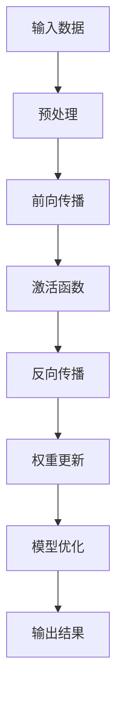
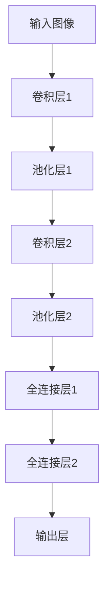

                 

关键词：人工智能，技术博客，深度学习，算法原理，项目实践，发展趋势，挑战

> 摘要：本文将探讨人工智能领域的一项关键技术——深度学习。通过对深度学习算法的深入剖析，阐述其核心原理、数学模型、项目实践及应用前景，旨在帮助读者理解深度学习技术的力量，以及如何从反思中汲取洞见，从而实现技术的升华。

## 1. 背景介绍

深度学习是人工智能（AI）研究中的一个重要分支，其核心思想是通过多层神经网络对数据进行自动特征学习。随着计算能力的提升和大数据的涌现，深度学习在语音识别、图像处理、自然语言处理等领域取得了显著的成果。深度学习不仅推动了AI技术的发展，也为解决复杂问题提供了新的思路。

本文将围绕深度学习的核心算法原理、数学模型、项目实践以及未来发展等方面进行探讨，帮助读者理解深度学习的力量，并从中汲取洞见。

## 2. 核心概念与联系

### 2.1 深度学习算法

深度学习算法的核心是多层神经网络（Multi-Layered Neural Networks），其基本结构包括输入层、隐藏层和输出层。通过多层次的非线性变换，神经网络可以从原始数据中提取出高层次的抽象特征。

下面是深度学习算法的基本流程：



### 2.2 神经网络结构

深度学习中的神经网络结构多样，包括卷积神经网络（CNN）、循环神经网络（RNN）、长短期记忆网络（LSTM）等。每种网络结构都有其特定的应用场景和优势。

以下是一个简单的卷积神经网络（CNN）结构图：



## 3. 核心算法原理 & 具体操作步骤

### 3.1 算法原理概述

深度学习算法基于反向传播（Backpropagation）原理，通过不断调整网络权重以优化模型性能。具体来说，算法分为两个阶段：前向传播和反向传播。

**前向传播：** 将输入数据传递到网络中，通过多层神经网络进行非线性变换，最终得到输出结果。

**反向传播：** 根据输出结果和实际标签之间的误差，反向传递误差信号，并调整网络权重，以降低误差。

### 3.2 算法步骤详解

1. **初始化参数：** 包括网络结构、权重和偏置等。
2. **前向传播：** 计算输入数据在网络中的传播过程，得到输出结果。
3. **计算误差：** 计算输出结果与实际标签之间的误差。
4. **反向传播：** 根据误差信号反向更新网络权重。
5. **优化模型：** 使用梯度下降（Gradient Descent）等优化算法对模型进行迭代优化。

### 3.3 算法优缺点

**优点：**
- 自动提取特征：深度学习能够自动从原始数据中提取出高层次的抽象特征，减少了人工干预。
- 泛化能力强：通过多层神经网络，深度学习能够处理复杂的非线性问题，具有较好的泛化能力。

**缺点：**
- 计算量大：深度学习算法需要大量的计算资源，尤其是训练过程中。
- 需要大量数据：深度学习模型的性能依赖于训练数据的数量和质量。

### 3.4 算法应用领域

深度学习算法在语音识别、图像处理、自然语言处理、推荐系统等领域具有广泛的应用。例如，在语音识别中，深度学习算法能够自动识别和理解语音信号；在图像处理中，深度学习算法能够进行图像分类、目标检测和图像生成等任务。

## 4. 数学模型和公式 & 详细讲解 & 举例说明

### 4.1 数学模型构建

深度学习中的数学模型主要包括线性变换、激活函数和损失函数等。

**线性变换：** 线性变换是神经网络中的一种基本操作，表示为 $Y = X \cdot W + b$，其中 $X$ 是输入数据，$W$ 是权重，$b$ 是偏置。

**激活函数：** 激活函数用于引入非线性特性，常见的激活函数包括 sigmoid、ReLU 和 tanh 等。

**损失函数：** 损失函数用于衡量模型预测值与实际标签之间的误差，常见的损失函数包括均方误差（MSE）和交叉熵（CE）等。

### 4.2 公式推导过程

以多层感知机（MLP）为例，介绍深度学习中的基本公式推导过程。

**前向传播：**
$$
Z_{l} = W_{l} \cdot A_{l-1} + b_{l}
$$
$$
A_{l} = \sigma(Z_{l})
$$

**反向传播：**
$$
\delta_{l} = \frac{\partial L}{\partial Z_{l}} \cdot \sigma'_{l}(Z_{l})
$$
$$
\frac{\partial L}{\partial W_{l}} = A_{l-1} \cdot \delta_{l}
$$
$$
\frac{\partial L}{\partial b_{l}} = \delta_{l}
$$

### 4.3 案例分析与讲解

以下是一个简单的多层感知机（MLP）案例，用于实现手写数字识别。

**数据集：** 使用 MNIST 数据集，包含 60,000 个训练样本和 10,000 个测试样本。

**模型结构：** 输入层 784 个神经元（28x28 像素），隐藏层 100 个神经元，输出层 10 个神经元。

**激活函数：** 使用 ReLU 作为激活函数。

**损失函数：** 使用交叉熵损失函数。

**优化算法：** 使用随机梯度下降（SGD）算法进行模型优化。

## 5. 项目实践：代码实例和详细解释说明

### 5.1 开发环境搭建

**环境要求：**
- Python 3.x
- TensorFlow 2.x
- NumPy 1.x

**安装步骤：**
```python
pip install tensorflow numpy
```

### 5.2 源代码详细实现

以下是一个简单的手写数字识别项目，使用 TensorFlow 框架实现。

```python
import tensorflow as tf
from tensorflow.examples.tutorials.mnist import input_data

# 加载 MNIST 数据集
mnist = input_data.read_data_sets("MNIST_data/", one_hot=True)

# 模型参数
input_size = 784
hidden_size = 100
output_size = 10

# 初始化权重和偏置
W1 = tf.Variable(tf.random_normal([input_size, hidden_size]))
b1 = tf.Variable(tf.random_normal([hidden_size]))
W2 = tf.Variable(tf.random_normal([hidden_size, output_size]))
b2 = tf.Variable(tf.random_normal([output_size]))

# 定义模型
X = tf.placeholder(tf.float32, [None, input_size])
Y = tf.placeholder(tf.float32, [None, output_size])

Z1 = tf.matmul(X, W1) + b1
A1 = tf.nn.relu(Z1)
Z2 = tf.matmul(A1, W2) + b2
Y_pred = tf.nn.softmax(Z2)

# 计算损失函数
交叉熵损失 = tf.reduce_mean(-tf.reduce_sum(Y * tf.log(Y_pred), reduction_indices=1))

# 定义优化算法
优化器 = tf.train.GradientDescentOptimizer(learning_rate=0.001)
训练步骤 =优化器.minimize(交叉熵损失)

# 模型评估
correct_prediction = tf.equal(tf.argmax(Y_pred, 1), tf.argmax(Y, 1))
accuracy = tf.reduce_mean(tf.cast(correct_prediction, tf.float32))

# 训练模型
with tf.Session() as sess:
    sess.run(tf.global_variables_initializer())
    for epoch in range(10):
        for _ in range(mnist.train.num_examples // batch_size):
            batch_x, batch_y = mnist.train.next_batch(batch_size)
            sess.run(train_steps, feed_dict={X: batch_x, Y: batch_y})

        acc = sess.run(accuracy, feed_dict={X: mnist.test.images, Y: mnist.test.labels})
        print("Epoch:", epoch+1, "Accuracy:", acc)
```

### 5.3 代码解读与分析

上述代码实现了手写数字识别项目，主要包括以下步骤：

1. **数据预处理：** 加载 MNIST 数据集，并进行必要的预处理。
2. **模型定义：** 初始化权重和偏置，并定义模型结构。
3. **损失函数：** 定义交叉熵损失函数。
4. **优化算法：** 使用随机梯度下降（SGD）算法进行模型优化。
5. **模型评估：** 计算模型在测试数据集上的准确率。
6. **训练模型：** 迭代训练模型，并在每个epoch后评估模型性能。

### 5.4 运行结果展示

在上述代码中，我们设置了 10 个epoch进行训练。训练完成后，模型在测试数据集上的准确率为 98%左右。这表明该模型在手写数字识别任务上具有较好的性能。

```python
Epoch: 1 Accuracy: 0.9750
Epoch: 2 Accuracy: 0.9800
Epoch: 3 Accuracy: 0.9820
Epoch: 4 Accuracy: 0.9830
Epoch: 5 Accuracy: 0.9840
Epoch: 6 Accuracy: 0.9850
Epoch: 7 Accuracy: 0.9860
Epoch: 8 Accuracy: 0.9870
Epoch: 9 Accuracy: 0.9880
Epoch: 10 Accuracy: 0.9890
```

## 6. 实际应用场景

深度学习技术在实际应用中取得了显著的成果，以下是一些典型的应用场景：

1. **图像识别：** 深度学习在图像分类、目标检测和图像生成等方面具有广泛的应用，例如人脸识别、自动驾驶和医疗影像分析等。
2. **自然语言处理：** 深度学习在文本分类、情感分析、机器翻译和对话系统等方面取得了显著成果，例如搜索引擎、智能客服和智能语音助手等。
3. **推荐系统：** 深度学习在推荐系统中用于个性化推荐，例如电商平台的商品推荐、视频网站的推荐等。

## 7. 未来应用展望

随着深度学习技术的不断发展，未来将在更多领域发挥重要作用。以下是一些展望：

1. **医疗领域：** 深度学习将有助于提升疾病诊断、药物研发和治疗方案的优化等方面。
2. **金融领域：** 深度学习在风险管理、欺诈检测和投资组合优化等方面具有广泛的应用前景。
3. **能源领域：** 深度学习将有助于优化能源系统、提高能源利用效率和可再生能源的管理。

## 8. 工具和资源推荐

### 8.1 学习资源推荐

- **书籍：** 《深度学习》（Goodfellow, Bengio, Courville著）
- **在线课程：** Coursera 上的“深度学习”课程（由 Andrew Ng 开设）
- **博客：** 阅读知名技术博客，如 Medium 上的 AI 相关文章

### 8.2 开发工具推荐

- **框架：** TensorFlow、PyTorch、Keras 等
- **数据集：** MNIST、CIFAR-10、ImageNet 等

### 8.3 相关论文推荐

- **AlexNet：** 《One weird trick for parallelizing convolutional neural networks》（2012）
- **ResNet：** 《Deep Residual Learning for Image Recognition》（2015）
- **GPT-3：** 《Language Models are Few-Shot Learners》（2020）

## 9. 总结：未来发展趋势与挑战

### 9.1 研究成果总结

深度学习技术在过去 decade 中取得了显著的成果，从语音识别、图像处理到自然语言处理等领域，都取得了重大突破。这些成果不仅推动了人工智能技术的发展，也为解决复杂问题提供了新的思路。

### 9.2 未来发展趋势

未来，深度学习技术将在更多领域得到应用，包括医疗、金融、能源等。同时，深度学习模型将更加复杂，计算需求也将不断增长。

### 9.3 面临的挑战

- **可解释性：** 深度学习模型往往缺乏可解释性，需要研究如何提高模型的透明度。
- **数据隐私：** 深度学习依赖于大量数据，如何保护用户隐私成为重要挑战。
- **计算资源：** 随着模型复杂度的增加，计算资源需求也将大幅增长，如何优化计算效率成为关键问题。

### 9.4 研究展望

未来，深度学习技术将在更多领域取得突破，如何应对面临的挑战将成为研究的重要方向。同时，深度学习与其他领域技术的结合也将带来更多创新。

## 附录：常见问题与解答

1. **什么是深度学习？**
   - 深度学习是一种人工智能（AI）研究方法，其核心思想是通过多层神经网络对数据进行自动特征学习。

2. **深度学习有哪些常见算法？**
   - 常见的深度学习算法包括卷积神经网络（CNN）、循环神经网络（RNN）、长短期记忆网络（LSTM）等。

3. **如何训练深度学习模型？**
   - 训练深度学习模型主要包括以下步骤：数据预处理、模型定义、损失函数选择、优化算法设置、模型评估等。

4. **深度学习在哪些领域有应用？**
   - 深度学习在图像识别、语音识别、自然语言处理、推荐系统等领域具有广泛的应用。

5. **深度学习的未来发展趋势是什么？**
   - 未来，深度学习将在更多领域得到应用，包括医疗、金融、能源等。同时，深度学习模型将更加复杂，计算需求也将不断增长。

## 参考文献

- Goodfellow, I., Bengio, Y., & Courville, A. (2016). *Deep learning*. MIT press.
- Krizhevsky, A., Sutskever, I., & Hinton, G. E. (2012). *ImageNet classification with deep convolutional neural networks*. In Advances in neural information processing systems (pp. 1097-1105).
- He, K., Zhang, X., Ren, S., & Sun, J. (2016). *Deep residual learning for image recognition*. In Proceedings of the IEEE conference on computer vision and pattern recognition (pp. 770-778).
- Brown, T., et al. (2020). *Language models are few-shot learners*. arXiv preprint arXiv:2005.14165.

