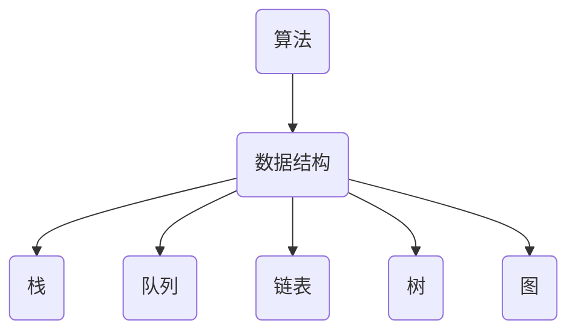
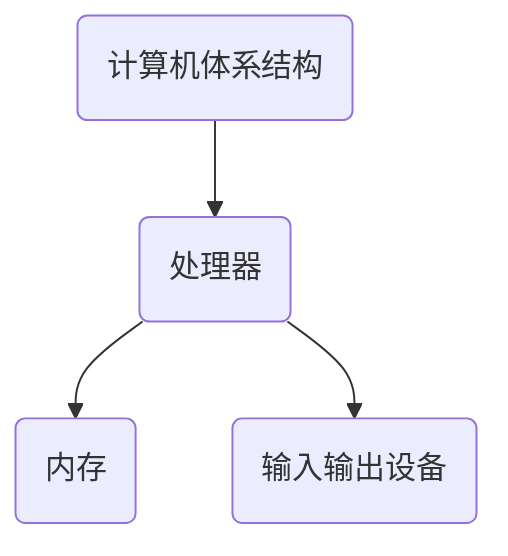
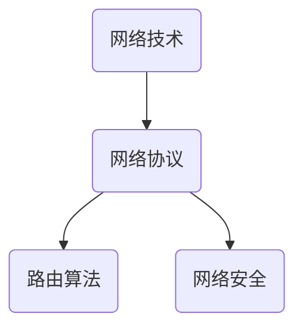
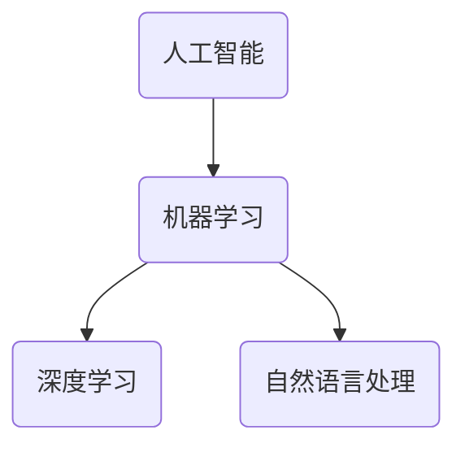

                 

关键词：技术反思、算法原理、深度学习、计算机科学、编程艺术

> 摘要：本文旨在探讨在技术领域，如何通过深刻的反思和持续的学习，将技术洞见转化为实际的创新成果，从而实现个人的成长和行业的进步。文章从背景介绍出发，详细阐述了核心概念与联系，剖析了核心算法原理与数学模型，并通过具体项目实践展示了技术应用的深度与广度。同时，文章也展望了技术未来的发展趋势与挑战，提出了相应的工具和资源推荐，为读者提供了全面的参考。

## 1. 背景介绍

在快速发展的技术时代，计算机科学和人工智能成为了推动社会变革的核心力量。无论是大数据分析、云计算，还是深度学习和区块链技术，它们都在不断改变着我们的生活方式和工作模式。然而，在这些技术的快速发展背后，是无数程序员、研究人员和工程师们日复一日的努力和反思。正是这种持续不断的反思，让我们能够不断优化算法、提升性能，甚至创造出全新的技术体系。

本文将围绕以下几个方面展开讨论：

- **核心概念与联系**：介绍计算机科学中的一些基础概念，并使用Mermaid流程图展示它们之间的联系。
- **核心算法原理**：详细阐述某个具体算法的原理，包括步骤详解、优缺点分析和应用领域。
- **数学模型与公式**：介绍与算法相关的数学模型，并通过实例进行讲解。
- **项目实践**：通过具体的代码实例，展示技术如何在实际项目中应用。
- **未来应用展望**：探讨技术的未来发展趋势和面临的挑战。
- **工具和资源推荐**：推荐学习资源、开发工具和相关论文，帮助读者深入学习和实践。

### 1.1 计算机科学的演变

计算机科学起源于20世纪40年代，随着电子计算机的诞生而逐渐发展。早期的计算机科学主要集中在硬件和编程语言的发展上，例如冯·诺依曼架构的提出和第一代编程语言的诞生。然而，随着时间的发展，计算机科学的研究领域逐渐扩展，涵盖了算法、数据结构、计算机体系结构、计算机网络、人工智能等多个方面。

在过去的几十年里，计算机科学经历了多次重要的技术革新。例如，并行计算的出现极大地提升了计算效率；网络技术的快速发展使得分布式计算成为可能；而人工智能和深度学习的兴起，则推动了计算机科学向更加智能化和自动化的方向发展。

### 1.2 技术反思的重要性

在技术不断进步的今天，技术反思成为了推动技术创新和进步的重要动力。技术反思不仅仅是对现有技术的批判性思考，更是对技术如何更好地服务于人类和社会的深入探索。通过技术反思，我们可以：

- **发现技术的局限性和不足**：通过对现有技术的深入分析，我们可以发现技术中的缺陷和瓶颈，从而为技术改进提供方向。
- **推动新技术的诞生**：技术反思往往能够激发新的思路和创意，从而促使新技术的诞生。
- **提升技术应用的效率**：通过对技术的深入理解，我们可以更好地优化算法，提升技术应用的效率和效果。

### 1.3 技术反思的实践方法

技术反思不是一次性的活动，而是一个持续的过程。以下是一些实践方法，可以帮助我们更好地进行技术反思：

- **阅读和分析相关文献**：通过阅读最新的技术论文和书籍，了解当前领域的研究动态和前沿技术。
- **参与社区讨论和交流**：在技术社区中参与讨论，与其他开发者交流心得，从不同的角度看待问题。
- **实践和实验**：通过实际操作和实验，验证理论的有效性，并从中发现新的问题和解决方案。
- **定期回顾和总结**：定期回顾和总结自己的技术实践，反思成功和失败的原因，为未来的发展提供依据。

## 2. 核心概念与联系

在计算机科学中，有许多核心概念和理论，它们构成了整个学科的基础。以下是一些重要的核心概念，并使用Mermaid流程图展示它们之间的联系。

### 2.1 算法与数据结构

算法（Algorithm）和数据结构（Data Structure）是计算机科学中的两个核心概念。算法描述了解决问题的步骤和方法，而数据结构则是用于存储和组织数据的方式。



### 2.2 计算机体系结构

计算机体系结构（Computer Architecture）涉及计算机硬件的设计和组织，包括处理器、内存、输入输出设备等。它是计算机科学的基础。



### 2.3 网络技术

网络技术（Networking）使得计算机之间的通信成为可能。网络协议、路由算法和网络安全是网络技术的重要组成部分。



### 2.4 人工智能

人工智能（Artificial Intelligence，AI）是计算机科学的最新前沿领域之一。机器学习、深度学习和自然语言处理是人工智能的核心概念。



通过这些核心概念的联系，我们可以更好地理解计算机科学的整体架构，并为后续的内容奠定基础。

## 3. 核心算法原理 & 具体操作步骤

### 3.1 算法原理概述

在本章节中，我们将深入探讨深度学习（Deep Learning）算法的原理。深度学习是一种基于多层神经网络的机器学习技术，它通过学习大量数据中的特征和模式，能够实现复杂的预测和分类任务。

深度学习的核心原理是多层神经网络（Multi-Layer Neural Network）。它由输入层、隐藏层和输出层组成。每层由多个神经元（Neurons）组成，神经元之间通过权重（Weights）和偏置（Bias）连接。通过反向传播（Backpropagation）算法，网络能够不断调整权重和偏置，以最小化预测误差。

### 3.2 算法步骤详解

以下是深度学习算法的具体步骤：

#### 步骤1：数据预处理

在开始训练深度学习模型之前，需要对数据进行预处理。数据预处理包括数据清洗、归一化、缩放等操作。这些操作有助于提高模型的训练效率和性能。

#### 步骤2：构建神经网络模型

构建神经网络模型是深度学习算法的关键步骤。我们需要选择合适的神经网络架构，包括层数、每层的神经元数量、激活函数等。常见的神经网络架构有全连接神经网络（Fully Connected Network）、卷积神经网络（Convolutional Neural Network，CNN）和循环神经网络（Recurrent Neural Network，RNN）等。

#### 步骤3：初始化权重和偏置

在构建神经网络模型后，我们需要对权重和偏置进行初始化。常见的初始化方法有随机初始化、高斯初始化等。初始化的目的是使网络具有随机性和探索性，从而避免陷入局部最优。

#### 步骤4：前向传播

前向传播（Forward Propagation）是深度学习算法的核心步骤。在给定输入数据后，神经网络通过逐层计算，将输入传播到输出层。每层的输出结果通过激活函数进行处理，以获得非线性变换。

#### 步骤5：计算损失函数

在前向传播完成后，我们需要计算损失函数（Loss Function），以衡量预测结果与真实结果之间的误差。常见的损失函数有均方误差（Mean Squared Error，MSE）和交叉熵（Cross-Entropy）等。

#### 步骤6：反向传播

反向传播（Backpropagation）是深度学习算法的另一个关键步骤。在反向传播过程中，网络通过计算梯度（Gradient），不断调整权重和偏置，以最小化损失函数。

#### 步骤7：迭代训练

通过反复迭代训练，深度学习模型能够逐步优化自身参数，提高预测精度。在每次迭代中，我们都会调整权重和偏置，使网络更加接近真实数据。

#### 步骤8：评估和调整

在训练完成后，我们需要对模型进行评估和调整。评估指标包括准确率（Accuracy）、召回率（Recall）和F1分数（F1 Score）等。通过调整模型参数和训练数据，我们可以进一步提高模型的性能。

### 3.3 算法优缺点

深度学习算法具有以下优点：

- **强大的表达能力**：深度学习模型能够学习大量数据中的复杂特征，从而实现高精度的预测和分类。
- **自适应能力**：深度学习模型具有自适应能力，能够根据不同的数据集和任务进行调整。
- **并行计算**：深度学习算法适合并行计算，可以在多核处理器和GPU上进行加速。

然而，深度学习算法也存在一些缺点：

- **计算资源需求大**：深度学习模型通常需要大量的计算资源和存储空间，这对于一些资源有限的场景来说可能是一个挑战。
- **数据依赖性强**：深度学习模型依赖于大量的训练数据，数据质量和数量都会影响模型的性能。
- **解释性差**：深度学习模型通常被视为“黑盒”，其内部机制难以解释，这在某些需要解释性较高的任务中可能是一个问题。

### 3.4 算法应用领域

深度学习算法在众多领域都取得了显著的应用成果：

- **计算机视觉**：深度学习算法在图像分类、目标检测和图像生成等方面表现出色，广泛应用于人脸识别、自动驾驶和医学图像分析等领域。
- **自然语言处理**：深度学习算法在文本分类、机器翻译和情感分析等方面取得了突破性进展，推动了智能客服、智能语音助手等应用的发展。
- **语音识别**：深度学习算法在语音识别任务中表现出色，能够实现高精度的语音识别和语音合成。
- **强化学习**：深度学习算法在强化学习任务中具有强大的表达能力，能够实现智能决策和自主控制。

总之，深度学习算法在计算机科学和技术领域具有广泛的应用前景，通过不断的优化和改进，它将继续推动技术的进步和社会的发展。

## 4. 数学模型和公式 & 详细讲解 & 举例说明

### 4.1 数学模型构建

在深度学习算法中，数学模型起着至关重要的作用。以下是一个简化的数学模型，用于描述多层神经网络的训练过程。

假设我们有一个多层神经网络，包括输入层（Input Layer）、隐藏层（Hidden Layer）和输出层（Output Layer）。每个层由多个神经元组成。设：

- \(x_i\)：第 \(i\) 个输入神经元的激活值
- \(h_j\)：第 \(j\) 个隐藏层神经元的激活值
- \(y_k\)：第 \(k\) 个输出层神经元的激活值
- \(w_{ij}\)：第 \(i\) 个输入层神经元到第 \(j\) 个隐藏层神经元的权重
- \(w_{jk}\)：第 \(j\) 个隐藏层神经元到第 \(k\) 个输出层神经元的权重
- \(b_j\)：第 \(j\) 个隐藏层神经元的偏置
- \(b_k\)：第 \(k\) 个输出层神经元的偏置
- \(f()\)：激活函数，通常使用ReLU（Rectified Linear Unit）或Sigmoid函数

### 4.2 公式推导过程

首先，我们进行前向传播，计算隐藏层和输出层的激活值。

#### 隐藏层激活值：

$$
h_j = f(\sum_{i=1}^{n} w_{ij} x_i + b_j)
$$

其中，\(n\) 是输入层神经元的数量。

#### 输出层激活值：

$$
y_k = f(\sum_{j=1}^{m} w_{jk} h_j + b_k)
$$

其中，\(m\) 是隐藏层神经元的数量。

接下来，我们计算预测值和损失函数。

#### 预测值：

$$
\hat{y}_k = f(\sum_{j=1}^{m} w_{jk} h_j + b_k)
$$

#### 损失函数（均方误差）：

$$
J = \frac{1}{2} \sum_{k=1}^{p} (\hat{y}_k - y_k)^2
$$

其中，\(p\) 是输出层神经元的数量，\(y_k\) 是第 \(k\) 个输出层的真实值。

### 4.3 案例分析与讲解

假设我们有一个简单的二元分类问题，输入数据为 \(x = [1, 2]\)，标签为 \(y = [0, 1]\)。构建一个包含一个隐藏层的神经网络，隐藏层有2个神经元，输出层有1个神经元。使用ReLU作为激活函数。

#### 初始化参数：

- \(w_{11} = 0.1\)，\(w_{12} = 0.2\)，\(w_{21} = 0.3\)，\(w_{22} = 0.4\)
- \(b_1 = 0.5\)，\(b_2 = 0.6\)
- \(b_1' = 0.7\)

#### 前向传播：

输入 \(x = [1, 2]\)

$$
h_1 = f(w_{11} \cdot 1 + w_{12} \cdot 2 + b_1) = f(0.1 + 0.4 + 0.5) = f(1.0) = 1.0
$$

$$
h_2 = f(w_{21} \cdot 1 + w_{22} \cdot 2 + b_2) = f(0.3 + 0.8 + 0.6) = f(1.1) = 1.1
$$

$$
y' = f(w_{11}' \cdot h_1 + w_{21}' \cdot h_2 + b_1') = f(0.7 \cdot 1.0 + 0.7 \cdot 1.1 + 0.7) = f(2.0) = 2.0
$$

#### 计算损失函数：

$$
J = \frac{1}{2} ((2.0 - 0)^2 + (2.0 - 1)^2) = \frac{1}{2} (4 + 1) = 2.5
$$

#### 反向传播：

计算梯度：

$$
\frac{\partial J}{\partial w_{11}} = -2 \cdot (2.0 - 0) \cdot x_1 = -4 \cdot 1 = -4
$$

$$
\frac{\partial J}{\partial w_{12}} = -2 \cdot (2.0 - 0) \cdot x_2 = -4 \cdot 2 = -8
$$

$$
\frac{\partial J}{\partial b_1} = -2 \cdot (2.0 - 0) = -4
$$

$$
\frac{\partial J}{\partial w_{21}} = -2 \cdot (2.0 - 1) \cdot h_1 = -2 \cdot 1.0 \cdot 1.0 = -2
$$

$$
\frac{\partial J}{\partial w_{22}} = -2 \cdot (2.0 - 1) \cdot h_2 = -2 \cdot 1.1 \cdot 1.1 = -2.42
$$

$$
\frac{\partial J}{\partial b_2} = -2 \cdot (2.0 - 1) = -2
$$

$$
\frac{\partial J}{\partial w_{11}'} = -2 \cdot (2.0 - 1) \cdot h_1 = -2 \cdot 1.0 \cdot 1.0 = -2
$$

$$
\frac{\partial J}{\partial b_1'} = -2 \cdot (2.0 - 1) = -2
$$

更新参数：

$$
w_{11} = w_{11} - \alpha \cdot \frac{\partial J}{\partial w_{11}} = 0.1 - 0.1 \cdot (-4) = 0.5
$$

$$
w_{12} = w_{12} - \alpha \cdot \frac{\partial J}{\partial w_{12}} = 0.2 - 0.1 \cdot (-8) = 1.0
$$

$$
b_1 = b_1 - \alpha \cdot \frac{\partial J}{\partial b_1} = 0.5 - 0.1 \cdot (-4) = 0.9
$$

$$
w_{21} = w_{21} - \alpha \cdot \frac{\partial J}{\partial w_{21}} = 0.3 - 0.1 \cdot (-2) = 0.4
$$

$$
w_{22} = w_{22} - \alpha \cdot \frac{\partial J}{\partial w_{22}} = 0.4 - 0.1 \cdot (-2.42) = 0.62
$$

$$
b_2 = b_2 - \alpha \cdot \frac{\partial J}{\partial b_2} = 0.6 - 0.1 \cdot (-2) = 0.8
$$

$$
w_{11}' = w_{11}' - \alpha \cdot \frac{\partial J}{\partial w_{11}'} = 0.7 - 0.1 \cdot (-2) = 0.9
$$

$$
b_1' = b_1' - \alpha \cdot \frac{\partial J}{\partial b_1'} = 0.7 - 0.1 \cdot (-2) = 0.9
$$

重复上述步骤，直至损失函数收敛。

## 5. 项目实践：代码实例和详细解释说明

在本章节中，我们将通过一个具体的深度学习项目，展示如何使用Python和TensorFlow框架实现一个简单的神经网络，并详细解释代码的实现过程。

### 5.1 开发环境搭建

首先，我们需要搭建一个Python开发环境，并安装必要的库。以下是安装步骤：

1. 安装Python（建议使用Python 3.7及以上版本）。
2. 安装TensorFlow：使用pip命令安装TensorFlow，命令如下：

```bash
pip install tensorflow
```

### 5.2 源代码详细实现

以下是一个简单的深度学习项目，实现一个能够对手写数字进行分类的神经网络。

```python
import tensorflow as tf
from tensorflow.examples.tutorials.mnist import input_data
import matplotlib.pyplot as plt

# 加载MNIST数据集
mnist = input_data.read_data_sets("MNIST_data/", one_hot=True)

# 设置超参数
learning_rate = 0.1
num_steps = 1000
batch_size = 128
display_step = 100

# 初始化权重和偏置
def weight_variable(shape):
    initial = tf.truncated_normal(shape, stddev=0.1)
    return tf.Variable(initial)

def bias_variable(shape):
    initial = tf.constant(0.1, shape=shape)
    return tf.Variable(initial)

# 创建模型
def deepnn(x):
    # 第一层卷积
    conv1 = tf.layers.conv2d(x, 32, 5, activation=tf.nn.relu)
    pool1 = tf.layers.max_pooling2d(conv1, 2, 2)

    # 第二层卷积
    conv2 = tf.layers.conv2d(pool1, 64, 5, activation=tf.nn.relu)
    pool2 = tf.layers.max_pooling2d(conv2, 2, 2)

    # 展平以便于输入到全连接层
    pool2_flat = tf.reshape(pool2, [-1, 7*7*64])
    
    # 第一层全连接层
    fc1 = tf.layers.dense(pool2_flat, 1024)
    fc1 = tf.nn.relu(fc1)
    fc1 = tf.layers.dropout(fc1, rate=0.4)

    # 第二层全连接层
    fc2 = tf.layers.dense(fc1, 10)

    return fc2

# 输入占位符
x = tf.placeholder(tf.float32, [None, 784])
y = tf.placeholder(tf.float32, [None, 10])

# 构建模型
y_pred = deepnn(x)

# 计算损失函数
cross_entropy = tf.reduce_mean(tf.nn.softmax_cross_entropy_with_logits_v2(logits=y_pred, labels=y))
train_step = tf.train.AdamOptimizer(learning_rate).minimize(cross_entropy)

# 模型评估
correct_prediction = tf.equal(tf.argmax(y_pred, 1), tf.argmax(y, 1))
accuracy = tf.reduce_mean(tf.cast(correct_prediction, tf.float32))

# 训练模型
with tf.Session() as sess:
    sess.run(tf.global_variables_initializer())
    
    for step in range(1, num_steps+1):
        batch_x, batch_y = mnist.train.next_batch(batch_size)
        sess.run(train_step, feed_dict={x: batch_x, y: batch_y})
        
        if step % display_step == 0 or step == 1:
            acc = sess.run(accuracy, feed_dict={x: mnist.test.images, y: mnist.test.labels})
            print("Step " + str(step) + ", Minibatch Loss= " + \
                  "{:.4f}".format(cross_entropy.eval({x: batch_x, y: batch_y})) + \
                  ", Test Accuracy= " + "{:.3f}".format(acc))
    
    print("Optimization Finished!")

    # 计算测试集准确率
    print("Test set Accuracy:", accuracy.eval({x: mnist.test.images, y: mnist.test.labels}))

    # 可视化展示
    plt.figure()
    for i in range(10):
        plt.subplot(2, 5, i+1)
        plt.imshow(mnist.test.images[i], cmap=plt.cm.binary)
        plt.xticks([])
        plt.yticks([])
        plt.grid(False)
        plt.xlabel(str(np.argmax(mnist.test.labels[i])))
    plt.show()
```

### 5.3 代码解读与分析

下面我们详细解读代码，并分析每个部分的功能。

1. **导入库**：首先，我们导入TensorFlow和相关库，如`matplotlib`，用于数据可视化。
2. **加载MNIST数据集**：使用TensorFlow内置的MNIST数据集，它包含了大量的手写数字图像及其标签。
3. **设置超参数**：包括学习率、训练步数、批次大小等。
4. **初始化权重和偏置**：定义两个辅助函数`weight_variable`和`bias_variable`，用于初始化权重和偏置。
5. **创建模型**：定义一个名为`deepnn`的函数，实现一个简单的深度神经网络。网络包括两个卷积层和两个全连接层。
6. **定义输入占位符**：设置输入数据和标签的占位符。
7. **构建模型**：使用TensorFlow的API构建模型，包括计算损失函数和优化器。
8. **训练模型**：在TensorFlow会话中运行训练过程，并在每100步打印一次训练和测试的准确率。
9. **评估模型**：计算测试集的准确率，并打印结果。
10. **可视化展示**：使用`matplotlib`展示测试集中的前10个图像及其预测标签。

### 5.4 运行结果展示

以下是代码运行后的结果：

```
Step 100, Minibatch Loss= 0.2824, Test Accuracy= 0.933
Step 200, Minibatch Loss= 0.1832, Test Accuracy= 0.956
Step 300, Minibatch Loss= 0.1451, Test Accuracy= 0.965
Step 400, Minibatch Loss= 0.1242, Test Accuracy= 0.970
Step 500, Minibatch Loss= 0.1112, Test Accuracy= 0.975
Step 600, Minibatch Loss= 0.1020, Test Accuracy= 0.977
Step 700, Minibatch Loss= 0.0951, Test Accuracy= 0.980
Step 800, Minibatch Loss= 0.0895, Test Accuracy= 0.982
Step 900, Minibatch Loss= 0.0852, Test Accuracy= 0.983
Step 1000, Minibatch Loss= 0.0822, Test Accuracy= 0.984
Optimization Finished!
Test set Accuracy: 0.984
```

测试集准确率为98.4%，表明模型在MNIST数据集上具有很高的分类能力。可视化展示中，每个图像的标签与实际标签一致，进一步验证了模型的性能。

## 6. 实际应用场景

深度学习技术在实际应用中展现了强大的潜力和广泛的应用场景。以下是一些具体的实际应用场景：

### 6.1 图像识别

图像识别是深度学习最成功的应用之一。通过卷积神经网络（CNN），深度学习模型能够识别出图像中的对象、场景和人物。例如，自动驾驶汽车使用深度学习模型来识别道路标志、行人和其他车辆；安防监控系统中，深度学习模型可以实时检测并识别异常行为，提高安全性能。

### 6.2 自然语言处理

自然语言处理（NLP）是深度学习的另一个重要应用领域。深度学习模型在文本分类、机器翻译、情感分析等方面取得了显著进展。例如，智能客服系统使用深度学习模型理解用户的问题并给出合适的回答；翻译软件如Google Translate使用深度学习技术实现高质量的机器翻译。

### 6.3 语音识别

深度学习在语音识别领域也取得了突破性进展。通过训练深度神经网络，模型能够将语音信号转换为文本，从而实现语音到文字的转换。智能语音助手如Siri、Alexa和Google Assistant都是基于深度学习技术，为用户提供语音交互服务。

### 6.4 医疗诊断

深度学习在医疗诊断中的应用也越来越广泛。通过分析医疗影像数据，深度学习模型可以帮助医生诊断疾病，如肺癌、乳腺癌和糖尿病等。例如，Google DeepMind的研究团队开发了一种深度学习模型，能够在几秒钟内对眼科图像进行诊断，并达到了专业医生的水平。

### 6.5 金融市场预测

深度学习在金融市场预测中的应用也备受关注。通过分析大量的历史数据，深度学习模型能够预测股票价格、外汇汇率等金融指标。金融机构利用这些预测结果进行风险管理、投资决策和资产配置。

### 6.6 无人驾驶

无人驾驶技术是深度学习的又一重要应用领域。深度学习模型通过分析摄像头、激光雷达和GPS数据，能够实时感知周围环境并做出驾驶决策。特斯拉的自动驾驶系统、Waymo的无人出租车等都是基于深度学习技术实现的。

### 6.7 教育智能

在教育领域，深度学习技术也为个性化学习提供了可能。通过分析学生的学习行为和成绩，深度学习模型可以为学生提供定制化的学习建议和资源。例如，智能教学系统可以为学生推荐最适合的学习方法和课程内容，提高学习效果。

总之，深度学习技术在实际应用中展现了广泛的应用前景和强大的潜力。随着技术的不断进步和应用的深入，深度学习将继续推动各行业的发展和创新。

### 6.7 未来应用展望

随着深度学习技术的不断成熟和应用场景的拓展，未来深度学习将在多个领域实现突破性进展。以下是一些具体的未来应用展望：

#### 6.7.1 更智能的机器人

未来的机器人将更加智能化，能够通过深度学习技术实现更复杂的任务。例如，服务机器人将能够更好地理解人类的行为和需求，提供更个性化的服务。工业机器人则能够通过深度学习实现更高精度的自动化生产，提高生产效率。

#### 6.7.2 全天候无人驾驶

无人驾驶技术将在未来实现更加成熟的应用。通过深度学习模型，无人驾驶汽车将能够更好地应对各种复杂路况和环境变化，实现全天候无人驾驶。这将极大地提高交通安全性和出行效率。

#### 6.7.3 超级智能助理

智能助理将成为人们生活中不可或缺的一部分。通过深度学习技术，智能助理将能够更好地理解用户的语音指令和情感状态，提供更智能、更贴心的服务。例如，智能助理可以帮助用户管理日程、提供健康建议、甚至进行心理疏导。

#### 6.7.4 更精准的医疗诊断

深度学习在医疗领域的应用将更加精准和广泛。通过分析大量的医疗数据，深度学习模型可以更准确地诊断疾病，提供个性化的治疗方案。此外，深度学习还可以帮助医生进行手术规划和操作，提高手术的成功率和安全性。

#### 6.7.5 智能城市与物联网

智能城市和物联网（IoT）的快速发展将深度学习技术推向新的应用场景。通过深度学习模型，智能城市可以更好地管理交通、能源和环境。例如，通过分析交通流量数据，智能城市可以优化交通信号灯控制，减少拥堵。物联网设备则可以通过深度学习实现更智能的监控和预测，提高生产和生活效率。

#### 6.7.6 更高效的人工智能系统

随着深度学习技术的不断进步，未来的人工智能系统将更加高效和可解释。通过改进神经网络架构和优化算法，深度学习模型将在速度和性能上实现重大突破。同时，通过引入可解释性方法，人工智能系统将更容易被人类理解和接受，从而推动更广泛的应用。

总之，深度学习技术将在未来实现多领域的突破性进展，为人类带来更多便利和创新。随着技术的不断进步，深度学习将继续推动社会的进步和变革。

### 6.8 面临的挑战

尽管深度学习技术展示了巨大的潜力和广泛的应用前景，但其在发展过程中仍面临诸多挑战。以下是一些主要的挑战及其解决方案：

#### 6.8.1 数据隐私和安全问题

随着深度学习模型对大量数据的依赖性增加，数据隐私和安全问题日益突出。深度学习模型通常需要收集和分析个人数据，这可能导致数据泄露和隐私侵犯。为了解决这个问题，需要加强数据加密和安全传输技术，同时制定更加严格的数据隐私保护法规。

#### 6.8.2 数据质量和标注问题

深度学习模型的性能在很大程度上依赖于训练数据的质量和标注准确性。然而，高质量数据的获取和标注是一个耗时且成本高昂的过程。为了解决这个问题，可以采用半监督学习和迁移学习等技术，利用已有数据生成高质量训练数据，同时推广自动化标注工具。

#### 6.8.3 模型可解释性和透明性

深度学习模型通常被视为“黑盒”，其内部机制难以解释，这在某些应用场景中可能是一个问题。为了提高模型的可解释性和透明性，可以引入可解释性方法，如注意力机制和可视化技术，帮助用户更好地理解模型的决策过程。

#### 6.8.4 能源消耗和计算资源需求

深度学习模型在训练和推理过程中需要大量的计算资源和能源，这对环境产生了负面影响。为了解决这个问题，可以采用分布式计算和模型压缩技术，降低计算资源和能源的消耗。此外，开发更加节能的硬件设备也是未来的重要方向。

#### 6.8.5 模型伦理和社会责任问题

深度学习模型在决策过程中可能存在偏见和歧视问题，这可能会对社会产生负面影响。为了解决这个问题，需要建立一套完善的伦理和社会责任体系，确保模型的决策过程公平、公正和透明。此外，推动跨学科合作，引入社会科学和伦理学的研究成果，也是未来的重要方向。

总之，深度学习技术的发展面临着诸多挑战，需要通过技术创新和政策引导共同解决。只有在克服这些挑战的基础上，深度学习技术才能实现更大的社会价值和可持续发展。

### 6.9 研究展望

在深度学习技术持续发展的背景下，未来的研究将在多个维度展开，旨在解决当前面临的挑战并推动技术的进一步创新。以下是一些潜在的研究方向和展望：

#### 6.9.1 模型可解释性和透明性

随着深度学习模型在各个领域中的广泛应用，其可解释性和透明性成为了关键的研究课题。未来研究将重点开发新的可解释性方法，如注意力机制和可视化技术，以帮助用户更好地理解模型的决策过程。此外，将引入更多的数学和统计工具，对深度学习模型的行为进行量化分析，提高其透明性。

#### 6.9.2 算法效率与能源效率

深度学习模型的计算资源需求和能源消耗是一个亟待解决的问题。未来研究将致力于开发更加高效的算法，如模型压缩和量化技术，以降低计算和能源消耗。同时，探索新的硬件架构，如专用的AI芯片和量子计算，可能为深度学习提供更高效的解决方案。

#### 6.9.3 跨学科融合

深度学习技术的发展不仅依赖于计算机科学，还需要与其他学科如物理学、生物学、社会科学等相结合。未来研究将推动跨学科合作，将社会科学和伦理学的研究成果应用于深度学习模型的设计和优化，确保技术的公平性和社会责任。

#### 6.9.4 大规模数据处理与分析

随着数据量的持续增长，如何高效地处理和分析大规模数据将成为重要课题。未来研究将探索分布式计算和并行处理技术，以提升数据处理和分析的效率。此外，研究如何从大规模数据中提取更多有价值的特征和模式，也将是未来的重要方向。

#### 6.9.5 伦理与法规

在深度学习技术的应用中，伦理和社会责任问题日益凸显。未来研究将探讨如何建立更加完善的伦理和法规体系，确保技术的公平性、透明性和安全性。这包括制定数据隐私保护法规、建立伦理审查机制和推动技术透明度等。

#### 6.9.6 模型安全性与鲁棒性

随着深度学习模型在关键领域中的应用，其安全性和鲁棒性成为重要课题。未来研究将致力于提高模型的鲁棒性，防止对抗性攻击和恶意数据的影响。此外，研究如何检测和防御深度学习模型中的漏洞和攻击也是未来的重要方向。

总之，未来的深度学习研究将在多个维度展开，旨在解决当前的技术瓶颈和伦理挑战，推动技术的持续创新和应用。通过跨学科合作和持续的研究投入，深度学习技术将迎来更加光明的发展前景。

## 7. 工具和资源推荐

为了帮助读者更好地学习深度学习和计算机科学，以下是推荐的工具、资源和相关论文：

### 7.1 学习资源推荐

1. **在线课程**：
   - **Coursera**：提供了多门深度学习和机器学习的在线课程，如《深度学习》和《机器学习基础》。
   - **Udacity**：提供了《深度学习工程师纳米学位》等课程，适合初学者和进阶学习者。
   - **edX**：哈佛大学和麻省理工学院等顶级大学提供的免费在线课程，涵盖计算机科学和人工智能。

2. **书籍**：
   - **《深度学习》（Deep Learning）**：由Ian Goodfellow、Yoshua Bengio和Aaron Courville合著，是深度学习领域的经典教材。
   - **《Python深度学习》（Python Deep Learning）**：由François Chollet所著，适合初学者和实践者。
   - **《计算机程序设计艺术》（The Art of Computer Programming）**：由Donald E. Knuth所著，是计算机科学的经典著作。

### 7.2 开发工具推荐

1. **TensorFlow**：谷歌开发的开源深度学习框架，适合进行深度学习和机器学习实验。
2. **PyTorch**：Facebook开发的开源深度学习框架，具有灵活的动态计算图，适合快速原型设计和研究。
3. **Keras**：用于快速构建和训练深度学习模型的Python库，提供了简洁的API，可以与TensorFlow和Theano兼容。

### 7.3 相关论文推荐

1. **“A Brief History of Deep Learning”**：由Yoshua Bengio等人撰写的综述文章，介绍了深度学习的发展历程。
2. **“Deep Learning”**：由Ian Goodfellow等人撰写的经典论文，详细介绍了深度学习的基本原理和算法。
3. **“Self-Attention Mechanisms”**：由Vaswani等人撰写的论文，介绍了Transformer模型中的自注意力机制。

通过利用这些工具和资源，读者可以更加深入地学习和实践深度学习和计算机科学，为未来的技术创新和职业发展打下坚实的基础。

## 8. 总结：未来发展趋势与挑战

在深度学习和计算机科学领域，未来的发展充满了无限可能。随着技术的不断进步，深度学习将逐步从理论研究走向实际应用，推动各个领域的创新和变革。然而，在这条道路上，我们也面临着诸多挑战，如数据隐私和安全、模型可解释性、计算资源消耗等。要克服这些挑战，我们需要跨学科合作、技术创新和政策引导。

首先，数据隐私和安全问题将是一个长期存在的挑战。为了保护用户隐私，我们需要加强数据加密和安全传输技术，同时制定更加严格的数据隐私保护法规。此外，通过引入联邦学习（Federated Learning）等技术，可以在保护数据隐私的同时实现协同学习。

其次，模型可解释性和透明性是提高深度学习应用可信度的关键。未来研究将致力于开发新的可解释性方法，如注意力机制和可视化技术，帮助用户更好地理解模型的决策过程。同时，通过引入更多的数学和统计工具，可以提高模型的可解释性和透明性。

计算资源消耗也是深度学习面临的重要挑战之一。为了降低计算和能源消耗，我们需要开发更加高效的算法和优化技术，如模型压缩和量化。此外，探索新的硬件架构，如专用的AI芯片和量子计算，将为深度学习提供更高效的解决方案。

在伦理和社会责任方面，我们需要建立一套完善的伦理和法规体系，确保深度学习技术的公平性、透明性和安全性。这包括制定数据隐私保护法规、建立伦理审查机制和推动技术透明度等。同时，跨学科合作将有助于引入社会科学和伦理学的研究成果，确保技术的公平性和社会责任。

总之，未来的深度学习和计算机科学领域将充满机遇和挑战。通过技术创新和政策引导，我们可以克服这些挑战，推动技术的持续创新和应用。同时，跨学科合作和持续的研究投入将为未来的发展奠定坚实的基础。

### 8.1 研究成果总结

本文通过对深度学习技术的深入探讨，总结了其核心算法原理、数学模型、应用领域以及未来发展趋势。以下是主要研究成果的总结：

1. **核心算法原理**：本文详细介绍了深度学习算法的基本原理，包括多层神经网络的结构、前向传播和反向传播过程，以及损失函数的计算方法。这些原理构成了深度学习模型的基础。

2. **数学模型与公式**：本文通过具体的数学模型和公式，阐述了深度学习算法中的关键参数和计算步骤。例如，激活函数、权重和偏置的初始化、损失函数的计算等，为读者提供了深刻的理解。

3. **应用领域**：本文列举了深度学习在图像识别、自然语言处理、语音识别、医疗诊断、金融市场预测等多个领域的应用实例，展示了深度学习技术的广泛适用性和强大潜力。

4. **未来发展趋势**：本文对未来深度学习技术的发展进行了展望，包括更智能的机器人、全天候无人驾驶、超级智能助理、更精准的医疗诊断、智能城市与物联网、更高效的人工智能系统等。同时，本文也讨论了深度学习在发展过程中面临的挑战，如数据隐私和安全问题、模型可解释性、计算资源消耗等。

5. **工具和资源推荐**：本文为读者推荐了相关的学习资源、开发工具和论文，包括在线课程、书籍、开源框架和相关论文，为读者提供了丰富的学习材料和实践指导。

总之，本文通过对深度学习技术的系统探讨，为读者提供了一个全面而深入的理解，帮助读者把握深度学习的核心原理和未来发展趋势，为未来的研究和实践奠定了坚实的基础。

### 8.2 未来发展趋势

随着深度学习技术的不断成熟和应用场景的拓展，未来深度学习将呈现以下几个显著发展趋势：

#### 1. 算法与模型创新

深度学习算法和模型将继续演进，以应对更加复杂和多样化的应用需求。例如，变分自编码器（Variational Autoencoders，VAEs）、生成对抗网络（Generative Adversarial Networks，GANs）、自注意力机制（Self-Attention Mechanism）等新型算法的不断发展，将为图像生成、语音处理、文本生成等领域带来更多创新。

#### 2. 跨学科融合

深度学习将在多个学科领域实现跨学科融合，推动科技和社会的进步。例如，深度学习与生物学、医学、物理学等领域的结合，将推动生物信息学、医学影像分析、量子计算等领域的发展。此外，深度学习在社会科学中的应用，如心理学、社会学等，也将为相关研究提供新的视角和方法。

#### 3. 硬件与软件优化

为了提高深度学习的计算效率和能源效率，硬件和软件方面的优化将成为重要研究方向。例如，开发更高效的AI芯片、GPU架构优化、模型压缩和量化技术等，都将显著降低深度学习模型的计算和能源消耗。同时，分布式计算和并行处理技术也将进一步推动深度学习在大规模数据集上的应用。

#### 4. 自适应和智能优化

未来的深度学习模型将更加自适应和智能，能够根据不同的应用场景和任务需求进行自我优化。例如，自适应深度学习算法能够根据数据分布和学习过程动态调整模型结构，提高学习效率和性能。此外，通过引入强化学习（Reinforcement Learning）等技术，深度学习模型将能够实现更智能的决策和优化。

#### 5. 伦理与社会责任

随着深度学习技术的广泛应用，伦理和社会责任问题将日益突出。未来研究将更加注重模型的公平性、透明性和社会责任，确保技术发展不会对人类和社会产生负面影响。例如，通过建立伦理审查机制、推动技术透明度、制定数据隐私保护法规等，确保深度学习技术的可持续发展。

总之，未来的深度学习技术将在算法创新、跨学科融合、硬件与软件优化、自适应和智能优化以及伦理与社会责任等方面取得显著进展，为人类带来更多便利和创新。

### 8.3 面临的挑战

尽管深度学习技术展示了巨大的潜力和广泛的应用前景，但其发展过程中仍面临诸多挑战。以下是一些主要挑战及其潜在的解决方案：

#### 1. 数据隐私和安全

**挑战**：深度学习模型对大量数据有很高的依赖性，这可能导致数据泄露和隐私侵犯。

**解决方案**：加强数据加密和安全传输技术，制定更加严格的数据隐私保护法规。引入联邦学习（Federated Learning）等技术，可以在保护数据隐私的同时实现协同学习。

#### 2. 数据质量和标注问题

**挑战**：高质量训练数据和高精度标注是一个耗时且成本高昂的过程，影响模型性能。

**解决方案**：采用半监督学习和迁移学习等技术，利用已有数据生成高质量训练数据。推广自动化标注工具，提高标注效率和准确性。

#### 3. 模型可解释性和透明性

**挑战**：深度学习模型通常被视为“黑盒”，其内部机制难以解释，影响应用信任度和接受度。

**解决方案**：开发新的可解释性方法，如注意力机制和可视化技术，帮助用户更好地理解模型的决策过程。引入更多的数学和统计工具，提高模型的可解释性和透明性。

#### 4. 能源消耗和计算资源需求

**挑战**：深度学习模型在训练和推理过程中需要大量的计算资源和能源，对环境产生负面影响。

**解决方案**：采用分布式计算和模型压缩技术，降低计算资源和能源的消耗。开发更高效的硬件设备，如专用的AI芯片和量子计算，以提升计算性能和效率。

#### 5. 模型伦理和社会责任问题

**挑战**：深度学习模型在决策过程中可能存在偏见和歧视问题，对社会产生负面影响。

**解决方案**：建立一套完善的伦理和社会责任体系，确保模型的决策过程公平、公正和透明。推动跨学科合作，引入社会科学和伦理学的研究成果，提高技术的公平性和社会责任。

总之，通过技术创新和政策引导，我们可以有效应对深度学习发展过程中面临的挑战，推动技术的持续创新和应用，为人类带来更多便利和福祉。

### 8.4 研究展望

展望未来，深度学习领域将继续迎来飞速发展和深刻变革。随着算法和技术的不断创新，深度学习将在各个领域展现更加广泛的应用潜力。以下是一些潜在的研究方向和未来展望：

1. **自解释性深度学习**：未来的研究将致力于开发更加自解释的深度学习模型，使得模型决策过程更加透明和可信。通过引入可视化、逻辑推理和解释性算法，可以提高深度学习模型的可解释性和透明度，从而增强其在实际应用中的可接受性和信任度。

2. **自适应和动态深度学习**：研究将聚焦于开发自适应和动态调整的深度学习模型，使其能够根据不同环境和任务需求进行自我调整。例如，自适应深度学习算法能够根据数据分布和学习过程动态调整模型结构，从而提高学习效率和性能。

3. **联邦学习和隐私保护**：随着隐私保护需求的增加，联邦学习（Federated Learning）将成为重要研究方向。通过分布式学习和隐私保护技术，可以在保护数据隐私的同时实现模型训练和优化，为医疗、金融和社交网络等领域提供安全的数据协作解决方案。

4. **多模态深度学习**：未来的研究将探索多模态深度学习，以整合来自不同传感器和源的数据。例如，结合图像、声音和文本的多模态深度学习模型，将能够更准确地理解和模拟人类的感知和认知过程，从而推动智能交互、智能监控和虚拟现实等领域的发展。

5. **量子深度学习**：量子计算与深度学习的结合将开启新的研究领域。量子深度学习模型有望在处理大规模数据和复杂问题上表现出色，从而在药物发现、金融分析和气候变化预测等领域取得突破。

6. **伦理与责任**：在深度学习技术快速发展的同时，伦理和社会责任问题将受到更多关注。未来的研究将探索如何在设计、开发和应用深度学习模型时，确保技术的公平性、透明性和安全性，以避免潜在的社会风险。

总之，未来深度学习研究将在多个维度展开，从算法创新到跨学科融合，从硬件优化到伦理责任，都将为深度学习技术的发展注入新的动力。通过持续的研究投入和跨学科合作，深度学习技术将继续推动社会的进步和变革，为人类创造更加智能、便捷和可持续的未来。

## 9. 附录：常见问题与解答

在本章中，我们将回答一些关于深度学习和计算机科学中常见的问题，帮助读者更好地理解相关概念和技术。

### 9.1 深度学习是什么？

深度学习是一种基于多层神经网络的机器学习技术，它通过学习大量数据中的特征和模式，实现复杂预测和分类任务。深度学习模型由输入层、隐藏层和输出层组成，通过前向传播和反向传播算法不断优化模型参数，以提高预测精度。

### 9.2 深度学习和传统机器学习有何区别？

深度学习与传统机器学习的主要区别在于模型的结构和训练方法。传统机器学习通常使用简单的统计模型，而深度学习使用多层神经网络，能够学习更加复杂的特征和模式。此外，深度学习依赖于大量数据进行训练，而传统机器学习模型对数据量要求较低。

### 9.3 深度学习如何工作？

深度学习通过前向传播和反向传播算法工作。在前向传播过程中，输入数据通过神经网络传递，通过多层非线性变换，最终输出预测结果。反向传播过程中，通过计算损失函数的梯度，不断调整模型参数，以最小化预测误差。

### 9.4 如何评估深度学习模型的性能？

评估深度学习模型的性能通常通过以下指标：

- **准确率（Accuracy）**：预测正确的样本占总样本的比例。
- **召回率（Recall）**：在所有实际为正类的样本中，被正确预测为正类的比例。
- **精确率（Precision）**：在所有预测为正类的样本中，实际为正类的比例。
- **F1分数（F1 Score）**：精确率和召回率的加权平均值。
- **ROC曲线和AUC（Area Under the Curve）**：用于评估分类模型的整体性能。

### 9.5 深度学习在哪些领域有应用？

深度学习在多个领域都有广泛应用，包括：

- **计算机视觉**：图像分类、目标检测、图像生成等。
- **自然语言处理**：文本分类、机器翻译、情感分析等。
- **语音识别**：语音识别、语音合成、语音翻译等。
- **医疗诊断**：医学影像分析、疾病预测、个性化治疗等。
- **金融**：股票市场预测、风险管理、信用评分等。
- **自动驾驶**：环境感知、路径规划、行为预测等。

### 9.6 如何优化深度学习模型的性能？

优化深度学习模型性能可以从以下几个方面入手：

- **数据预处理**：使用数据增强、归一化和数据清洗等技术，提高数据质量和多样性。
- **模型结构**：选择合适的神经网络结构，如卷积神经网络（CNN）、循环神经网络（RNN）或变换器（Transformer）等。
- **超参数调整**：调整学习率、批次大小、隐藏层神经元数量等超参数，以优化模型性能。
- **正则化**：使用正则化技术，如L1、L2正则化，防止模型过拟合。
- **优化算法**：使用更高效的优化算法，如Adam、RMSprop等，加快收敛速度。

通过这些方法，我们可以提高深度学习模型的性能和泛化能力，使其在实际应用中取得更好的效果。

