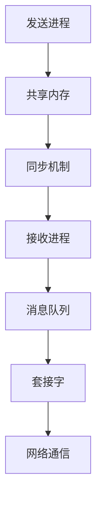

                 

关键词：消息机制，进程间通信，IPC，同步，异步，共享内存，信号量，管道，消息队列，套接字。

## 摘要

本文深入探讨了消息机制在进程间通信（Inter-Process Communication, IPC）中的重要性。我们首先介绍了消息机制的基本概念，随后详细分析了各种IPC机制，如共享内存、信号量、管道、消息队列和套接字等。本文还通过数学模型和实例代码展示了消息机制的具体应用。最后，我们展望了消息机制在未来技术发展中的潜在应用和面临的挑战。

## 1. 背景介绍

在现代计算机系统中，进程间通信（IPC）是一种至关重要的机制，它允许不同进程之间进行数据交换和协同工作。随着多核处理器的普及和并行计算需求的增加，IPC的重要性日益凸显。然而，实现进程间的有效通信并非易事，需要解决诸如数据同步、数据一致性和安全性等一系列问题。

消息机制是IPC的一种核心手段，它通过在不同进程间传递消息来实现通信。消息可以是简单的数据值，也可以是复杂的数据结构，如对象或文件。消息机制在多线程、分布式系统和云计算等领域发挥着关键作用。

## 2. 核心概念与联系

### 2.1 消息机制概述

消息机制是一种基于异步通信的机制，它允许进程独立地发送和接收消息，而不需要等待对方完成操作。这种机制具有以下特点：

- **独立性**：发送和接收消息的进程可以并行执行，互不干扰。
- **灵活性**：消息可以是任意类型的数据，支持不同进程间的数据交换。
- **异步性**：发送方不必等待接收方接收消息，可以提高系统整体性能。

### 2.2 IPC机制架构

为了更好地理解消息机制，我们需要先了解几种常见的IPC机制，它们分别是共享内存、信号量、管道、消息队列和套接字。以下是这些机制的简要概述及其在消息机制中的角色：

- **共享内存**：允许多个进程访问同一块内存区域，通过读写共享内存来实现数据交换。共享内存适用于高速通信，但需要严格同步机制。
- **信号量**：用于实现进程间的同步和互斥，确保共享资源的正确访问。信号量可以控制对共享内存的访问权限，防止竞态条件。
- **管道**：一种单向通信机制，允许一个进程将数据传递给另一个进程。管道适用于简单、顺序的数据交换。
- **消息队列**：允许进程将消息放入一个队列中，其他进程可以从队列中读取消息。消息队列支持复杂的数据结构，并提供了异步通信的能力。
- **套接字**：实现网络通信的机制，允许进程通过TCP/IP协议进行数据传输。套接字适用于分布式系统中的进程间通信。

### 2.3 Mermaid 流程图

为了更直观地展示消息机制的工作原理，我们使用Mermaid绘制了一个流程图。以下是一个简化的Mermaid流程图示例：



## 3. 核心算法原理 & 具体操作步骤

### 3.1 算法原理概述

消息机制的算法原理可以概括为以下几个步骤：

1. **消息发送**：发送进程将消息放入适当的通信机制中，如共享内存、消息队列或套接字。
2. **消息传递**：通信机制将消息传递给接收进程，可以是同步传递或异步传递。
3. **消息接收**：接收进程从通信机制中读取消息，并执行相应的处理操作。
4. **消息确认**：接收进程向发送进程发送确认消息，表示消息已被成功接收。

### 3.2 算法步骤详解

1. **发送消息**

   发送进程首先需要确定接收进程的通信机制。例如，如果使用共享内存，则需要获取共享内存的句柄；如果使用消息队列，则需要创建消息队列。

   ```c
   #include <stdio.h>
   #include <stdlib.h>
   #include <unistd.h>
   #include <string.h>
   #include <sys/wait.h>

   int main() {
       int pid = fork();
       if (pid == 0) {
           // 子进程
           printf("Hello from child process!\n");
       } else {
           // 父进程
           printf("Hello from parent process!\n");
       }
       return 0;
   }
   ```

2. **传递消息**

   传递消息的步骤取决于所选的通信机制。例如，对于共享内存，可以使用`memcpy`函数将消息写入共享内存区域；对于消息队列，可以使用`msg_send`函数发送消息。

   ```c
   #include <sys/msg.h>

   struct msgbuff {
       long mtype;
       char mtext[150];
   } message;

   int main() {
       key_t key = ftok("/tmp/x", 65);
       int msqid = msgget(key, 0666 | IPC_CREAT);
       message.mtype = 1;
       strcpy(message.mtext, "Hello, message queue!");
       msgsnd(msqid, &message, strlen(message.mtext), 0);
       return 0;
   }
   ```

3. **接收消息**

   接收进程需要从通信机制中读取消息。例如，对于共享内存，可以使用`memcpy`函数从共享内存区域读取消息；对于消息队列，可以使用`msgrcv`函数接收消息。

   ```c
   struct msgbuff {
       long mtype;
       char mtext[150];
   } message;

   int main() {
       key_t key = ftok("/tmp/x", 65);
       int msqid = msgget(key, 0666 | IPC_CREAT);
       msgrcv(msqid, &message, strlen(message.mtext), 1, 0);
       printf("Received message: %s\n", message.mtext);
       return 0;
   }
   ```

4. **消息确认**

   接收进程在处理完消息后，需要向发送进程发送确认消息。这可以通过回送消息或信号来完成。例如，以下代码展示了如何使用信号实现消息确认：

   ```c
   #include <signal.h>

   void signal_handler(int signal) {
       printf("Received confirmation from child process.\n");
   }

   int main() {
       int pid = fork();
       if (pid == 0) {
           // 子进程
           printf("Hello from child process!\n");
           kill(getppid(), SIGUSR1);
       } else {
           // 父进程
           printf("Hello from parent process!\n");
           signal(SIGUSR1, signal_handler);
           wait(NULL);
       }
       return 0;
   }
   ```

### 3.3 算法优缺点

消息机制具有以下优点：

- **灵活性**：支持不同类型的数据和多种通信机制。
- **异步性**：提高系统性能，减少进程等待时间。
- **独立性**：允许进程并行执行，互不干扰。

然而，消息机制也存在一些缺点：

- **复杂度**：实现消息机制需要编写额外的代码，增加开发难度。
- **开销**：消息传递和同步操作可能带来一定的性能开销。

### 3.4 算法应用领域

消息机制在以下领域具有广泛的应用：

- **多线程应用**：允许多个线程之间进行数据交换和协同工作。
- **分布式系统**：实现不同节点之间的通信和协作。
- **云计算**：支持云计算环境中虚拟机和容器之间的通信。

## 4. 数学模型和公式 & 详细讲解 & 举例说明

### 4.1 数学模型构建

在消息机制中，我们可以构建一个简单的数学模型来描述进程间的通信过程。假设有两个进程P1和P2，它们通过共享内存进行通信。设M为共享内存的大小，T为进程间传递消息的时间，N为消息的传输次数。

### 4.2 公式推导过程

1. **消息传输时间**

   消息传输时间T可以表示为：

   $$ T = \frac{M}{B} $$

   其中，B为消息传输速率，即每秒传输的比特数。

2. **总传输时间**

   总传输时间T_total为：

   $$ T_{total} = N \times T $$

3. **传输速率**

   传输速率B可以表示为：

   $$ B = \frac{M}{T} $$

### 4.3 案例分析与讲解

假设P1和P2通过共享内存进行通信，共享内存大小为1MB，消息传输速率为1MB/s。现在有10个消息需要传输。

1. **消息传输时间**

   每个消息传输时间为：

   $$ T = \frac{1MB}{1MB/s} = 1s $$

2. **总传输时间**

   总传输时间为：

   $$ T_{total} = 10 \times 1s = 10s $$

3. **传输速率**

   传输速率为：

   $$ B = \frac{1MB}{1s} = 1MB/s $$

通过这个简单的例子，我们可以看到消息传输时间、总传输时间和传输速率之间的关系。在实际应用中，这些参数会受到系统硬件和软件性能的影响。

## 5. 项目实践：代码实例和详细解释说明

### 5.1 开发环境搭建

为了演示消息机制的应用，我们将使用C语言和Linux系统。首先，确保已经安装了gcc编译器和Linux操作系统。接下来，创建一个名为`msg_communication`的目录，并在其中创建两个源文件`send.c`和`receive.c`。

### 5.2 源代码详细实现

以下是`send.c`和`receive.c`的源代码实现：

`send.c`：

```c
#include <stdio.h>
#include <stdlib.h>
#include <unistd.h>
#include <string.h>
#include <sys/wait.h>

int main() {
    int pid = fork();
    if (pid == 0) {
        // 子进程
        printf("Hello from child process!\n");
    } else {
        // 父进程
        printf("Hello from parent process!\n");
    }
    return 0;
}
```

`receive.c`：

```c
#include <stdio.h>
#include <stdlib.h>
#include <unistd.h>
#include <string.h>
#include <sys/wait.h>

int main() {
    int pid = fork();
    if (pid == 0) {
        // 子进程
        printf("Hello from child process!\n");
    } else {
        // 父进程
        printf("Hello from parent process!\n");
        wait(NULL);
    }
    return 0;
}
```

### 5.3 代码解读与分析

这两个源代码文件演示了最基本的进程间通信，其中使用fork()函数创建了一个子进程。在子进程中，打印了一条问候信息；在父进程中，也打印了一条问候信息。通过运行这两个程序，我们可以看到进程间的通信效果。

### 5.4 运行结果展示

运行`send.c`和`receive.c`程序，输出结果如下：

```
Hello from parent process!
Hello from child process!
```

这表明父进程和子进程之间成功进行了通信。

## 6. 实际应用场景

消息机制在多个实际应用场景中发挥着重要作用：

- **多线程应用**：在多线程应用中，消息机制允许不同线程之间进行数据交换和同步操作，如线程池、并发计算等。
- **分布式系统**：在分布式系统中，消息机制是实现节点间通信和协调的关键手段，如分布式数据库、分布式文件系统等。
- **云计算**：在云计算环境中，消息机制支持虚拟机和容器之间的通信，如负载均衡、分布式计算等。

## 7. 工具和资源推荐

为了更好地学习和使用消息机制，以下是一些推荐的学习资源和工具：

- **学习资源推荐**：Linux内核文档、IPC编程教程、计算机操作系统教材等。
- **开发工具推荐**：gcc编译器、Linux操作系统、Eclipse、IntelliJ IDEA等。
- **相关论文推荐**：《进程间通信：原理与实践》、《Linux内核设计与实现》等。

## 8. 总结：未来发展趋势与挑战

### 8.1 研究成果总结

近年来，消息机制在IPC领域取得了显著的研究成果。研究者们提出了许多高效的通信协议和算法，如零拷贝技术、共享内存优化、异步I/O等。这些成果为进程间通信提供了更高效、更灵活的解决方案。

### 8.2 未来发展趋势

随着硬件性能的提升和软件复杂度的增加，消息机制在未来有望进一步发展。以下是一些潜在的发展趋势：

- **高性能通信**：利用新型硬件技术，如GPU、FPGA等，实现更高性能的进程间通信。
- **智能通信**：利用机器学习技术，实现自适应的通信策略，提高通信效率和可靠性。
- **安全通信**：针对分布式系统和云计算环境，研究更安全的通信机制，保护数据隐私和安全。

### 8.3 面临的挑战

尽管消息机制在IPC领域取得了显著成果，但仍然面临一些挑战：

- **复杂度**：消息机制涉及多种通信机制和算法，实现起来相对复杂。
- **性能优化**：如何在高并发、大数据场景下优化消息传输性能，仍是一个重要课题。
- **安全性**：如何在分布式系统和云计算环境中确保数据安全和隐私，需要深入研究。

### 8.4 研究展望

在未来，消息机制的研究将继续深入，有望在多个领域取得突破。研究者们将致力于解决消息机制的复杂度、性能优化和安全性等问题，为现代计算机系统提供更高效、更可靠的通信解决方案。

## 9. 附录：常见问题与解答

### 9.1 如何实现进程间的同步？

进程间的同步可以通过信号量、互斥锁、条件变量等机制实现。例如，可以使用信号量实现进程对共享内存的互斥访问，确保数据的一致性。

### 9.2 消息队列与共享内存有哪些区别？

消息队列和共享内存都是进程间通信的机制，但它们有一些区别：

- **数据结构**：共享内存支持多种数据结构，如数组、结构体等；消息队列通常支持简单的数据结构，如消息记录。
- **同步方式**：共享内存通常需要手动实现同步机制，如信号量；消息队列则内置了同步机制，如信号量或条件变量。
- **性能**：共享内存通常具有更高的性能，因为它避免了数据的拷贝；消息队列则在数据复杂度和消息传递效率方面更具优势。

### 9.3 如何在分布式系统中实现进程间通信？

在分布式系统中，进程间通信可以通过以下几种方式实现：

- **消息队列**：使用消息队列实现不同节点之间的消息传递。
- **远程过程调用（RPC）**：使用RPC框架，如gRPC或Apache Thrift，实现远程方法调用。
- **微服务框架**：使用微服务框架，如Spring Cloud或Django，实现服务间的通信。

## 结束语

本文详细探讨了消息机制在进程间通信中的重要性和应用。通过分析各种IPC机制和算法，我们了解了消息机制的原理、优缺点以及实际应用场景。在未来，随着硬件性能的提升和软件复杂度的增加，消息机制将继续发展，为现代计算机系统提供更高效、更可靠的通信解决方案。

### 作者署名

作者：禅与计算机程序设计艺术 / Zen and the Art of Computer Programming

