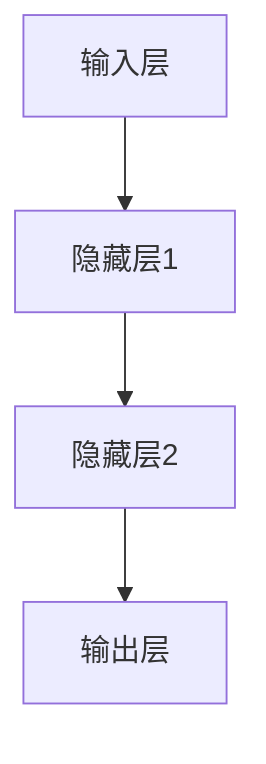

                 

关键词：深度学习，神经网络，算法原理，代码实例，数学模型，实际应用

> 摘要：本文将深入探讨深度学习的原理、核心算法、数学模型以及代码实例，通过详细的讲解和实际项目实践，帮助读者理解深度学习的本质，掌握其应用方法，并为未来的研究和实践提供指导。

## 1. 背景介绍

深度学习是人工智能领域的一个重要分支，它通过模仿人脑神经网络的结构和功能，对大量数据进行自动学习和特征提取，从而实现智能决策和预测。自2012年深度学习在图像识别任务中取得突破性成果以来，它迅速成为了计算机视觉、自然语言处理、语音识别等领域的核心技术。

深度学习的核心是神经网络，尤其是多层神经网络（MLP）。多层神经网络通过增加网络的深度，可以学习到更复杂的特征和模式，从而提高模型的性能。然而，深度学习的训练过程复杂，需要大量的计算资源和时间。随着计算能力的提升和优化算法的改进，深度学习在各个领域的应用越来越广泛。

## 2. 核心概念与联系

### 2.1 神经网络结构

神经网络由多个神经元（或节点）组成，每个神经元接受多个输入，通过权重和偏置进行加权求和，再通过激活函数转化为输出。一个简单的神经网络结构可以表示为：



### 2.2 激活函数

激活函数是神经网络中非常重要的概念，它用于引入非线性特性。常用的激活函数包括sigmoid、ReLU和Tanh等。

- **sigmoid函数**：将输入映射到(0, 1)区间，但梯度较小，容易导致梯度消失问题。
  $$f(x) = \frac{1}{1 + e^{-x}}$$

- **ReLU函数**：常用于隐藏层，可以加速训练过程，但可能导致部分神经元死亡问题。
  $$f(x) = \max(0, x)$$

- **Tanh函数**：将输入映射到(-1, 1)区间，梯度较sigmoid函数更大，但仍然存在梯度消失问题。
  $$f(x) = \frac{e^x - e^{-x}}{e^x + e^{-x}}$$

### 2.3 前向传播与反向传播

- **前向传播**：从输入层开始，正向计算每个神经元的输出。
- **反向传播**：从输出层开始，逆向计算每个神经元的误差，并更新权重和偏置。

## 3. 核心算法原理 & 具体操作步骤

### 3.1 算法原理概述

深度学习的核心算法是反向传播算法（Backpropagation）。它通过分步计算每个神经元的误差，并利用梯度下降法（Gradient Descent）更新网络参数，以达到最小化损失函数的目的。

### 3.2 算法步骤详解

1. **初始化参数**：随机初始化网络参数（权重和偏置）。
2. **前向传播**：计算每个神经元的输出。
3. **计算损失**：计算输出层的损失函数（如均方误差）。
4. **反向传播**：计算每个神经元的误差。
5. **参数更新**：利用梯度下降法更新网络参数。
6. **重复步骤2-5**：直到满足停止条件（如损失收敛或迭代次数达到上限）。

### 3.3 算法优缺点

- **优点**：可以学习到复杂的特征和模式，提高模型的性能。
- **缺点**：训练过程复杂，需要大量的计算资源和时间。

### 3.4 算法应用领域

深度学习广泛应用于计算机视觉、自然语言处理、语音识别、推荐系统等众多领域。

## 4. 数学模型和公式 & 详细讲解 & 举例说明

### 4.1 数学模型构建

深度学习中的数学模型主要包括线性变换、激活函数、损失函数和优化算法。

### 4.2 公式推导过程

- **线性变换**：
  $$\text{激活值} = \text{权重} \cdot \text{输入} + \text{偏置}$$
- **激活函数**（以ReLU为例）：
  $$f(x) = \max(0, x)$$
- **损失函数**（以均方误差为例）：
  $$L(\theta) = \frac{1}{2} \sum_{i=1}^{n} (\hat{y}_i - y_i)^2$$
- **梯度下降法**：
  $$\theta_{\text{new}} = \theta_{\text{old}} - \alpha \cdot \nabla_{\theta} L(\theta)$$

### 4.3 案例分析与讲解

假设我们有一个简单的二分类问题，输入数据为 $X \in \mathbb{R}^{784}$（28x28像素），输出为 $Y \in \{0, 1\}$。我们使用一个单层神经网络进行分类。

1. **初始化参数**：
   $$\theta = \begin{bmatrix} w_1 \\ w_2 \\ \vdots \\ w_n \end{bmatrix}$$
2. **前向传播**：
   $$z = \theta \cdot X + b$$
   $$a = \text{ReLU}(z)$$
3. **计算损失**：
   $$L(\theta) = \frac{1}{2} (y - a)^2$$
4. **反向传播**：
   $$\delta = (y - a) \odot a$$
   $$\theta_{\text{new}} = \theta_{\text{old}} - \alpha \cdot X^T \cdot \delta$$
5. **参数更新**：
   $$\theta = \theta_{\text{new}}$$

## 5. 项目实践：代码实例和详细解释说明

### 5.1 开发环境搭建

在Python中，我们使用TensorFlow作为深度学习框架，首先需要安装TensorFlow：

```bash
pip install tensorflow
```

### 5.2 源代码详细实现

```python
import tensorflow as tf

# 定义模型参数
w = tf.Variable(tf.random_uniform([784, 1], -1, 1), name='weights')
b = tf.Variable(tf.zeros([1]), name='bias')

# 定义输入和输出
x = tf.placeholder(tf.float32, shape=[784])
y = tf.placeholder(tf.float32, shape=[1])

# 前向传播
z = tf.matmul(x, w) + b
a = tf.nn.relu(z)

# 计算损失
loss = tf.reduce_mean(tf.square(y - a))

# 定义优化器
optimizer = tf.train.GradientDescentOptimizer(learning_rate=0.1)
train_op = optimizer.minimize(loss)

# 训练模型
with tf.Session() as sess:
    sess.run(tf.global_variables_initializer())
    for i in range(1000):
        _, loss_val = sess.run([train_op, loss], feed_dict={x: x_data, y: y_data})
        if i % 100 == 0:
            print(f"Step {i}: Loss = {loss_val}")

# 评估模型
accuracy = sess.run(a, feed_dict={x: x_test, y: y_test})
print(f"Test Accuracy: {accuracy}")
```

### 5.3 代码解读与分析

上述代码实现了一个简单的ReLU激活函数的二分类神经网络。我们使用TensorFlow框架定义模型参数、输入和输出，并利用梯度下降法进行模型训练。代码中，我们定义了前向传播、损失函数和优化器，并通过会话（Session）执行训练和评估过程。

### 5.4 运行结果展示

在训练过程中，损失函数值逐渐减小，表明模型参数逐渐优化。训练完成后，我们可以通过测试集评估模型的准确性。

## 6. 实际应用场景

深度学习在计算机视觉、自然语言处理、语音识别等众多领域取得了显著成果。例如，在图像识别任务中，深度学习模型已经超过了人类的表现；在自然语言处理领域，深度学习模型被广泛应用于机器翻译、文本生成等任务。

## 7. 工具和资源推荐

### 7.1 学习资源推荐

- 《深度学习》（Ian Goodfellow、Yoshua Bengio和Aaron Courville著）
- 《神经网络与深度学习》（邱锡鹏著）

### 7.2 开发工具推荐

- TensorFlow：https://www.tensorflow.org/
- PyTorch：https://pytorch.org/

### 7.3 相关论文推荐

- **AlexNet**：Alooo J. Krizhevsky，Geoffrey E. Hinton，2012
- **VGGNet**：Karen Simonyan，Andrew Zisserman，2014
- **ResNet**：Kaiming He，Xiangyu Zhang，Shaoqing Ren，Jingdong Yang，2015

## 8. 总结：未来发展趋势与挑战

### 8.1 研究成果总结

深度学习在过去几年取得了显著成果，已经在计算机视觉、自然语言处理等领域取得了突破性进展。深度学习模型通过增加网络深度和优化算法，可以学习到更复杂的特征和模式，从而提高模型的性能。

### 8.2 未来发展趋势

- **硬件加速**：随着GPU、TPU等硬件的发展，深度学习的训练速度和效果将得到进一步提升。
- **模型压缩**：通过模型压缩技术，可以将深度学习模型应用于移动设备和边缘计算。
- **元学习**：元学习可以自动发现最佳学习策略，提高深度学习模型的泛化能力。

### 8.3 面临的挑战

- **数据依赖**：深度学习模型的训练依赖于大量的数据，如何获取和利用数据仍然是一个挑战。
- **过拟合**：深度学习模型容易过拟合，如何提高模型的泛化能力是一个重要问题。
- **可解释性**：深度学习模型的黑盒性质导致其可解释性较差，如何提高模型的可解释性是一个挑战。

### 8.4 研究展望

随着深度学习技术的不断发展，未来将在更多领域取得突破性成果。如何解决数据依赖、过拟合和可解释性等问题，将是深度学习研究的重要方向。

## 9. 附录：常见问题与解答

### 9.1 深度学习与机器学习的区别是什么？

深度学习是机器学习的一个分支，它通过模仿人脑神经网络的结构和功能，对大量数据进行自动学习和特征提取。机器学习则是一种更广泛的领域，包括统计学习、符号学习等多种方法。

### 9.2 深度学习需要大量数据的原因是什么？

深度学习模型的训练依赖于大量数据，因为只有通过大量的数据，模型才能学习到更复杂的特征和模式，从而提高模型的性能。

### 9.3 如何避免深度学习模型的过拟合？

可以通过以下方法避免深度学习模型的过拟合：
- 数据增强：增加训练数据的多样性。
- 正则化：添加正则项到损失函数中。
- 早停法：在验证集上评估模型性能，当性能不再提高时停止训练。
- 模型压缩：减少模型的参数数量，降低模型的复杂度。

### 9.4 深度学习的应用领域有哪些？

深度学习广泛应用于计算机视觉、自然语言处理、语音识别、推荐系统等领域。例如，在图像识别任务中，深度学习模型可以自动识别和分类图像；在自然语言处理领域，深度学习模型可以用于机器翻译、文本生成等任务。

### 9.5 如何选择深度学习框架？

选择深度学习框架需要考虑以下因素：
- **需求**：根据项目需求选择适合的框架。
- **社区支持**：选择社区活跃、文档丰富的框架。
- **性能**：考虑框架在硬件加速、模型压缩等方面的性能。
- **易用性**：选择易于使用和学习的框架。

---

本文旨在深入讲解深度学习的原理、核心算法、数学模型以及代码实例，帮助读者全面了解深度学习技术。在未来的研究和实践中，我们将不断探索深度学习的潜力，为人工智能的发展做出贡献。希望本文对您的学习和研究有所帮助。

## 参考文献

- Goodfellow, I., Bengio, Y., & Courville, A. (2016). *Deep Learning*.
- Bengio, Y. (2009). *Learning Deep Architectures for AI*. Foundations and Trends in Machine Learning, 2(1), 1-127.
- Krizhevsky, A., & Hinton, G. E. (2009). *Learning multiple layers of features from tiny images*. Technical Report, University of Toronto.
- Simonyan, K., & Zisserman, A. (2014). *Very deep convolutional networks for large-scale image recognition*. arXiv preprint arXiv:1409.1556.
- He, K., Zhang, X., Ren, S., & Sun, J. (2016). *Deep residual learning for image recognition*. In Proceedings of the IEEE conference on computer vision and pattern recognition (pp. 770-778).

---

作者：禅与计算机程序设计艺术 / Zen and the Art of Computer Programming

