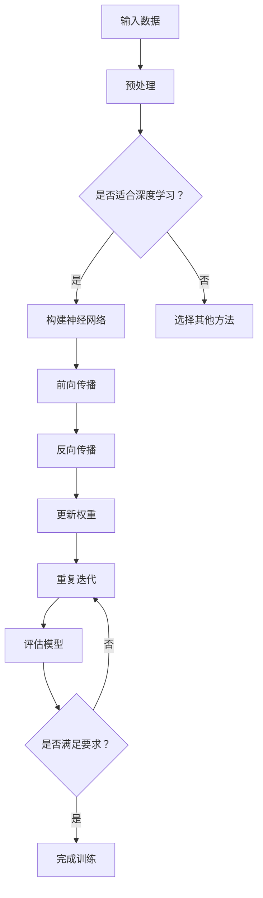
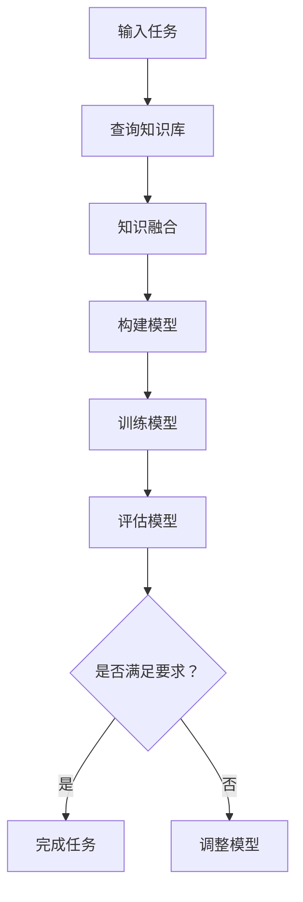

                 

关键词：深度学习、广度学习、知识获取、人工智能、机器学习、学习策略

> 摘要：本文探讨了深度学习和广度学习这两种知识获取策略在人工智能领域的重要性和区别。通过对它们的核心原理、算法、数学模型、实际应用和未来展望的深入分析，旨在为读者提供一种更为全面和深入的理解，帮助他们在实际应用中做出明智的选择。

## 1. 背景介绍

### 1.1 深度学习的兴起

深度学习是一种机器学习技术，起源于20世纪40年代的神经网络理论。然而，直到最近几年，随着计算能力的提升和大数据的出现，深度学习才得到了广泛的应用。它通过多层神经网络模拟人脑的神经元结构，从而能够从大量数据中自动学习特征，实现高精度的模式识别和预测。

### 1.2 广度学习的兴起

广度学习则是一种相对较新的概念，强调在知识获取过程中对广泛领域知识的理解和应用。与深度学习不同，广度学习不追求对特定任务的极致性能，而是关注在多个任务和领域中的泛化能力。

### 1.3 人工智能与知识获取

人工智能（AI）是研究、开发和应用使计算机系统具备人类智能能力的科学和技术。知识获取是人工智能的核心任务之一，而深度学习和广度学习则是实现这一目标的重要途径。

## 2. 核心概念与联系

### 2.1 深度学习

深度学习通过多层神经网络结构，将输入数据逐步转换，以提取更高级的特征表示。其核心是卷积神经网络（CNN）和循环神经网络（RNN）。

#### Mermaid 流程图：



### 2.2 广度学习

广度学习则注重对广泛领域知识的理解和应用，通常采用知识图谱、迁移学习和多任务学习等技术。其核心是利用已有的知识库和模型，实现对新任务的快速适应。

#### Mermaid 流程图：



## 3. 核心算法原理 & 具体操作步骤

### 3.1 算法原理概述

#### 深度学习

深度学习的核心在于神经网络，尤其是卷积神经网络（CNN）和循环神经网络（RNN）。CNN主要用于图像处理任务，而RNN则擅长处理序列数据。

#### 广度学习

广度学习则侧重于知识图谱和迁移学习。知识图谱用于表示和存储领域知识，而迁移学习则利用已有的模型和知识库，快速适应新任务。

### 3.2 算法步骤详解

#### 深度学习

1. 数据预处理：对输入数据（如图像、文本等）进行归一化、裁剪、翻转等操作。
2. 网络结构设计：根据任务需求，设计合适的神经网络结构（如CNN或RNN）。
3. 模型训练：通过前向传播和反向传播，不断调整模型参数，以最小化损失函数。
4. 模型评估：使用验证集和测试集，评估模型性能，调整模型参数。

#### 广度学习

1. 知识图谱构建：收集和整理领域知识，构建知识图谱。
2. 迁移学习：利用已有模型和知识库，对新任务进行快速适应。
3. 多任务学习：同时训练多个任务，提高模型泛化能力。
4. 模型评估：使用验证集和测试集，评估模型性能。

### 3.3 算法优缺点

#### 深度学习

优点：能够自动提取高级特征，对复杂任务有很高的性能。

缺点：训练过程复杂，对数据和计算资源需求高。

#### 广度学习

优点：能够快速适应新任务，具有很好的泛化能力。

缺点：对领域知识的理解和构建要求高。

### 3.4 算法应用领域

#### 深度学习

广泛应用于图像识别、自然语言处理、语音识别等领域。

#### 广度学习

广泛应用于知识图谱构建、多任务学习、推荐系统等领域。

## 4. 数学模型和公式 & 详细讲解 & 举例说明

### 4.1 数学模型构建

#### 深度学习

深度学习的核心是神经网络，其基本模型如下：

$$
\begin{align*}
Z &= W \cdot X + b \\
A &= \sigma(Z)
\end{align*}
$$

其中，$X$ 是输入数据，$W$ 和 $b$ 分别是权重和偏置，$\sigma$ 是激活函数。

#### 广度学习

广度学习中的知识图谱通常用图论模型表示，其基本模型如下：

$$
\begin{align*}
G &= (V, E) \\
V &= \{v_1, v_2, ..., v_n\} \\
E &= \{(v_i, v_j)\}
\end{align*}
$$

其中，$V$ 是节点集合，$E$ 是边集合。

### 4.2 公式推导过程

#### 深度学习

假设我们有一个多层神经网络，其输出层为：

$$
\begin{align*}
Z &= W \cdot A + b \\
A &= \sigma(Z)
\end{align*}
$$

则其误差函数为：

$$
\begin{align*}
E &= \frac{1}{2} \sum_{i=1}^{n} (y_i - A_i)^2
\end{align*}
$$

通过梯度下降法，我们有：

$$
\begin{align*}
\frac{\partial E}{\partial W} &= (y_i - A_i) \cdot A_i \cdot (1 - A_i) \\
\frac{\partial E}{\partial b} &= y_i - A_i
\end{align*}
$$

#### 广度学习

在知识图谱中，假设我们有一个关系 $R$，其表示为：

$$
\begin{align*}
R &= (v_i, v_j)
\end{align*}
$$

则其权重函数为：

$$
\begin{align*}
w_{ij} &= f(h_i, h_j)
\end{align*}
$$

其中，$h_i$ 和 $h_j$ 分别是节点 $v_i$ 和 $v_j$ 的特征表示。

### 4.3 案例分析与讲解

#### 深度学习

以图像识别任务为例，我们可以使用卷积神经网络（CNN）进行训练。

1. 数据预处理：对图像进行归一化处理，并转换为二维矩阵。
2. 网络结构设计：设计一个简单的CNN结构，包括卷积层、池化层和全连接层。
3. 模型训练：使用梯度下降法，不断调整网络参数，以最小化损失函数。
4. 模型评估：使用验证集和测试集，评估模型性能。

#### 广度学习

以知识图谱构建为例，我们可以使用图嵌入技术进行建模。

1. 知识图谱构建：收集和整理领域知识，构建知识图谱。
2. 图嵌入：使用图嵌入技术，将知识图谱中的节点和边表示为向量。
3. 模型训练：使用迁移学习，将预训练的模型应用于新任务。
4. 模型评估：使用验证集和测试集，评估模型性能。

## 5. 项目实践：代码实例和详细解释说明

### 5.1 开发环境搭建

1. 安装Python环境。
2. 安装深度学习框架（如TensorFlow或PyTorch）。
3. 准备数据集。

### 5.2 源代码详细实现

```python
import tensorflow as tf
from tensorflow.keras.models import Sequential
from tensorflow.keras.layers import Conv2D, MaxPooling2D, Flatten, Dense

# 数据预处理
# ...

# 网络结构设计
model = Sequential([
    Conv2D(filters=32, kernel_size=(3, 3), activation='relu', input_shape=(28, 28, 1)),
    MaxPooling2D(pool_size=(2, 2)),
    Flatten(),
    Dense(units=10, activation='softmax')
])

# 模型训练
model.compile(optimizer='adam', loss='categorical_crossentropy', metrics=['accuracy'])
model.fit(x_train, y_train, epochs=10, batch_size=32, validation_data=(x_val, y_val))

# 模型评估
model.evaluate(x_test, y_test)
```

### 5.3 代码解读与分析

这段代码演示了一个简单的CNN模型，用于手写数字识别任务。

1. 数据预处理：将图像数据转换为二维矩阵。
2. 网络结构设计：设计一个包含卷积层、池化层和全连接层的模型。
3. 模型训练：使用Adam优化器和交叉熵损失函数进行训练。
4. 模型评估：使用测试集评估模型性能。

## 6. 实际应用场景

### 6.1 图像识别

深度学习在图像识别领域具有广泛的应用，如人脸识别、物体识别等。通过训练大量的图像数据，深度学习模型能够自动提取图像中的高级特征，实现高精度的识别。

### 6.2 自然语言处理

广度学习在自然语言处理领域有广泛的应用，如文本分类、机器翻译等。通过构建大规模的知识图谱和迁移学习技术，广度学习能够快速适应新任务，提高模型的泛化能力。

### 6.3 医疗诊断

深度学习和广度学习在医疗诊断领域也有重要的应用，如疾病预测、影像分析等。通过分析大量的医疗数据和知识图谱，这些模型能够提供准确的诊断建议，提高医疗水平。

## 7. 工具和资源推荐

### 7.1 学习资源推荐

1. 《深度学习》（Goodfellow, Bengio, Courville著）
2. 《自然语言处理与深度学习》（黄海广、吴军等著）
3. 《图嵌入技术及其应用》（Mikolov, Sutskever, Chen等著）

### 7.2 开发工具推荐

1. TensorFlow
2. PyTorch
3. Keras

### 7.3 相关论文推荐

1. "Deep Learning"（Goodfellow, Bengio, Courville）
2. "Natural Language Processing with Deep Learning"（Yoon, et al.）
3. "Graph Embeddings and Extensions"（Mikolov, Sutskever, Chen）

## 8. 总结：未来发展趋势与挑战

### 8.1 研究成果总结

深度学习和广度学习在人工智能领域取得了显著的成果，分别解决了特定任务和广泛领域知识的获取问题。

### 8.2 未来发展趋势

随着计算能力的提升和大数据的发展，深度学习和广度学习将继续发展，并在更多领域得到应用。

### 8.3 面临的挑战

深度学习和广度学习在模型解释性、数据隐私保护和计算效率等方面仍面临挑战。

### 8.4 研究展望

未来，深度学习和广度学习将深度融合，为人工智能的发展提供更为强大的动力。

## 9. 附录：常见问题与解答

### 问题1：深度学习和广度学习有什么区别？

深度学习主要关注特定任务的高性能，而广度学习则关注在多个任务和领域中的泛化能力。

### 问题2：如何选择深度学习或广度学习？

根据具体任务需求和数据特点，选择合适的算法。对于需要高性能的任务，可以选择深度学习；对于需要广泛领域知识的任务，可以选择广度学习。

### 问题3：深度学习和广度学习是否可以结合？

是的，深度学习和广度学习可以结合，通过迁移学习和多任务学习等技术，提高模型在多个任务和领域的泛化能力。

---

作者：禅与计算机程序设计艺术 / Zen and the Art of Computer Programming
----------------------------------------------------------------

