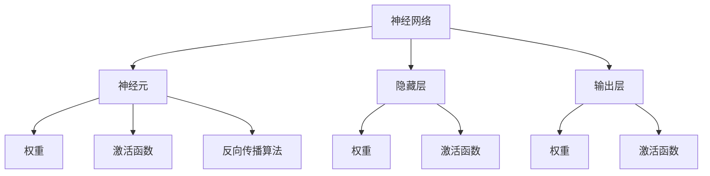

                 

 关键词：深度学习、神经网络、算法原理、数学模型、代码实例、实践应用

> 摘要：本文将从深度学习的背景介绍、核心概念与联系、算法原理与具体操作步骤、数学模型与公式推导、项目实践以及实际应用场景等多个角度，全面讲解深度学习的原理与代码实例，帮助读者深入理解深度学习的核心技术，为实际应用提供有力的理论支持和实践指导。

## 1. 背景介绍

深度学习（Deep Learning）是人工智能（AI）领域的重要分支，它通过模仿人脑神经元结构和信息处理方式，利用多层神经网络进行数据的学习和处理。自2006年Hinton等人提出深度信念网络（Deep Belief Network，DBN）以来，深度学习在图像识别、语音识别、自然语言处理、强化学习等领域取得了显著的成果。深度学习技术的发展，推动了人工智能的进步，使得机器能够自主地学习和理解复杂的数据。

深度学习的基本原理是多层神经网络（Multi-Layer Neural Networks），通过多个隐藏层的堆叠，实现数据的逐层抽象和特征提取。神经网络由输入层、隐藏层和输出层组成，每个层都包含多个神经元。神经元之间通过权重（weights）连接，并通过激活函数（activation function）进行非线性变换。

随着大数据和计算能力的提升，深度学习在各类实际问题中得到了广泛应用。例如，在图像识别领域，卷积神经网络（Convolutional Neural Networks，CNN）被广泛应用于人脸识别、物体检测和图像分类等任务；在自然语言处理领域，循环神经网络（Recurrent Neural Networks，RNN）和长短期记忆网络（Long Short-Term Memory，LSTM）被应用于机器翻译、文本生成和情感分析等任务。

本文将围绕深度学习的核心原理，通过详细讲解算法、数学模型和代码实例，帮助读者深入理解深度学习的基本概念、技术方法和应用场景。

## 2. 核心概念与联系

为了更好地理解深度学习，我们需要了解一些核心概念，包括神经网络、激活函数、反向传播算法等。下面，我们将使用Mermaid流程图来展示这些概念之间的联系。



### 2.1 神经网络与神经元

神经网络是由大量神经元组成的网络，每个神经元都是一个处理单元，负责接收输入信息并通过权重进行计算。神经网络可以分为输入层、隐藏层和输出层，每层都有多个神经元。神经元之间的连接通过权重表示，权重的大小决定了连接的强度。

### 2.2 隐藏层

隐藏层是神经网络的核心部分，通过多个隐藏层的堆叠，神经网络能够实现对输入数据的逐层抽象和特征提取。隐藏层中的神经元接收来自前一层神经元的输入，并通过激活函数进行非线性变换，将信息传递给下一层。

### 2.3 输出层

输出层是神经网络的最后一层，负责将神经网络处理后的信息输出。输出层的神经元个数取决于任务的具体需求，例如在分类任务中，输出层的神经元个数通常与类别数相同。

### 2.4 激活函数

激活函数是神经网络中的一个关键组件，用于引入非线性特性，使得神经网络能够处理非线性问题。常见的激活函数包括Sigmoid函数、ReLU函数和Tanh函数等。

### 2.5 反向传播算法

反向传播算法是神经网络训练过程中的核心算法，用于计算网络参数的梯度，并优化网络参数。反向传播算法分为前向传播和后向传播两个阶段，前向传播计算输出层的误差，后向传播计算隐藏层的误差，并通过梯度下降法更新网络参数。

## 3. 核心算法原理 & 具体操作步骤

### 3.1 算法原理概述

深度学习的核心算法是多层神经网络，通过前向传播和反向传播两个阶段实现数据的输入和输出。前向传播阶段，神经网络从输入层开始，逐层计算隐藏层的输出，直到输出层得到最终结果。反向传播阶段，根据输出层的误差，反向计算隐藏层的误差，并更新网络参数。

### 3.2 算法步骤详解

#### 3.2.1 前向传播

1. **初始化参数**：随机初始化网络参数，包括权重和偏置。
2. **输入数据**：将输入数据输入到输入层。
3. **计算隐藏层输出**：对于每个隐藏层，计算输入和激活函数的输出。
4. **计算输出层输出**：将隐藏层的输出传递到输出层，计算最终结果。

#### 3.2.2 反向传播

1. **计算输出层误差**：计算输出层实际输出与期望输出之间的误差。
2. **计算隐藏层误差**：从输出层开始，逐层计算隐藏层的误差。
3. **更新网络参数**：根据误差计算网络参数的梯度，并通过梯度下降法更新网络参数。

### 3.3 算法优缺点

#### 优点

1. **强大的表达能力**：多层神经网络能够通过非线性变换实现复杂函数的逼近。
2. **自适应学习**：通过反向传播算法，神经网络能够自动调整参数，实现数据的自适应学习。
3. **良好的泛化能力**：通过多层抽象和特征提取，神经网络能够对未见过的数据进行预测。

#### 缺点

1. **训练时间较长**：深度学习算法通常需要大量的计算资源，训练时间较长。
2. **对数据量要求高**：深度学习算法需要大量的数据进行训练，以获得较好的泛化能力。
3. **易过拟合**：深度学习模型容易发生过拟合现象，特别是在数据量较少的情况下。

### 3.4 算法应用领域

深度学习算法在图像识别、语音识别、自然语言处理、强化学习等领域取得了显著的成果。例如，在图像识别领域，卷积神经网络（CNN）被广泛应用于人脸识别、物体检测和图像分类等任务；在自然语言处理领域，循环神经网络（RNN）和长短期记忆网络（LSTM）被应用于机器翻译、文本生成和情感分析等任务。

## 4. 数学模型和公式 & 详细讲解 & 举例说明

### 4.1 数学模型构建

深度学习的数学模型主要包括神经网络的结构和参数、激活函数、损失函数和优化算法。下面，我们将详细介绍这些数学模型的构建。

#### 4.1.1 神经网络结构

神经网络的结构由输入层、隐藏层和输出层组成。每个神经元接收来自前一层的输入，通过加权求和后加上偏置，再通过激活函数进行非线性变换，得到当前神经元的输出。隐藏层和输出层的神经元个数可以根据任务的需求进行调整。

#### 4.1.2 激活函数

激活函数是神经网络中引入非线性特性的关键组件。常见的激活函数包括Sigmoid函数、ReLU函数和Tanh函数等。Sigmoid函数具有平滑的S形曲线，适合处理分类问题；ReLU函数具有简单的线性特性，能够加速训练过程；Tanh函数具有对称的S形曲线，适用于回归问题。

#### 4.1.3 损失函数

损失函数用于衡量预测值与真实值之间的误差。常见的损失函数包括均方误差（MSE）、交叉熵（Cross Entropy）等。MSE适用于回归问题，交叉熵适用于分类问题。

#### 4.1.4 优化算法

优化算法用于更新网络参数，以最小化损失函数。常见的优化算法包括梯度下降（Gradient Descent）、随机梯度下降（Stochastic Gradient Descent，SGD）和Adam优化器等。梯度下降算法通过计算损失函数关于网络参数的梯度，更新网络参数；随机梯度下降算法在每次迭代中随机选择一部分样本，计算平均梯度，更新网络参数；Adam优化器结合了梯度下降和SGD的优点，具有更好的收敛性。

### 4.2 公式推导过程

下面，我们将对深度学习中的几个关键公式进行推导。

#### 4.2.1 神经网络输出

设输入层为 \(x\)，隐藏层为 \(h\)，输出层为 \(y\)。第 \(l\) 层神经元的输出 \(z\) 可表示为：

\[ z = \sigma(W_{l-1}x + b_l) \]

其中，\(W_{l-1}\) 为前一层权重，\(b_l\) 为第 \(l\) 层偏置，\(\sigma\) 为激活函数。

#### 4.2.2 损失函数

对于分类问题，常见的损失函数为交叉熵（Cross Entropy），其公式为：

\[ L = -\frac{1}{m} \sum_{i=1}^{m} y_i \log(y_i') \]

其中，\(y_i\) 为真实标签，\(y_i'\) 为预测标签，\(m\) 为样本数量。

#### 4.2.3 反向传播

反向传播算法的核心是计算损失函数关于网络参数的梯度，并更新网络参数。设第 \(l\) 层的损失函数为 \(L_l\)，梯度为 \(\frac{\partial L_l}{\partial z_l}\)。根据链式法则，梯度可表示为：

\[ \frac{\partial L_l}{\partial z_l} = \frac{\partial L_l}{\partial y_l} \frac{\partial y_l}{\partial z_l} \frac{\partial z_l}{\partial W_{l-1}} \frac{\partial W_{l-1}}{\partial z_{l-1}} \]

其中，\(\frac{\partial L_l}{\partial y_l}\) 为输出层梯度，\(\frac{\partial y_l}{\partial z_l}\) 为激活函数梯度，\(\frac{\partial z_l}{\partial W_{l-1}}\) 为权重梯度，\(\frac{\partial W_{l-1}}{\partial z_{l-1}}\) 为前一层梯度。

### 4.3 案例分析与讲解

为了更好地理解深度学习中的数学模型，我们以一个简单的线性回归问题为例进行讲解。

#### 4.3.1 问题背景

假设我们有一个线性回归问题，输入数据为 \(x\)，输出数据为 \(y\)。我们的目标是找到一个线性模型 \(y = wx + b\)，使得预测值 \(y'\) 与真实值 \(y\) 之间的误差最小。

#### 4.3.2 数学模型

根据线性回归的原理，我们可以定义损失函数为均方误差（MSE），其公式为：

\[ L = \frac{1}{2} \sum_{i=1}^{m} (y_i - y_i')^2 \]

其中，\(m\) 为样本数量。

#### 4.3.3 梯度计算

对于线性回归问题，我们可以计算损失函数关于权重 \(w\) 和偏置 \(b\) 的梯度：

\[ \frac{\partial L}{\partial w} = \sum_{i=1}^{m} (y_i - y_i')(x_i - x_i') \]

\[ \frac{\partial L}{\partial b} = \sum_{i=1}^{m} (y_i - y_i') \]

#### 4.3.4 梯度下降

根据梯度下降算法，我们可以更新权重和偏置：

\[ w_{new} = w_{old} - \alpha \frac{\partial L}{\partial w} \]

\[ b_{new} = b_{old} - \alpha \frac{\partial L}{\partial b} \]

其中，\(\alpha\) 为学习率。

通过迭代更新权重和偏置，我们可以使损失函数逐渐减小，从而找到最优的线性模型。

## 5. 项目实践：代码实例和详细解释说明

### 5.1 开发环境搭建

在进行深度学习项目实践之前，我们需要搭建一个适合的开发环境。本文将使用Python作为编程语言，结合TensorFlow框架进行深度学习实践。

#### 5.1.1 安装Python

首先，我们需要安装Python。Python是一个广泛使用的编程语言，具有良好的生态系统和丰富的库。我们可以从Python官方网站下载并安装Python。

#### 5.1.2 安装TensorFlow

接下来，我们需要安装TensorFlow。TensorFlow是一个开源的深度学习框架，提供了丰富的API和工具，方便我们进行深度学习实践。我们可以使用以下命令安装TensorFlow：

```python
pip install tensorflow
```

#### 5.1.3 安装其他库

为了方便后续的实践，我们还需要安装一些其他库，如NumPy、Pandas等。这些库可以帮助我们处理数据、进行矩阵运算等。

```python
pip install numpy pandas
```

### 5.2 源代码详细实现

下面，我们将通过一个简单的线性回归问题，演示如何使用TensorFlow实现深度学习。

```python
import tensorflow as tf
import numpy as np

# 创建TensorFlow图
graph = tf.Graph()
with graph.as_default():
    # 定义输入数据
    x = tf.placeholder(tf.float32, shape=[None])
    y = tf.placeholder(tf.float32, shape=[None])

    # 定义模型参数
    w = tf.Variable(0.0, name="weights")
    b = tf.Variable(0.0, name="biases")

    # 定义线性模型
    y_pred = w * x + b

    # 定义损失函数
    loss = tf.reduce_mean(tf.square(y - y_pred))

    # 定义优化器
    optimizer = tf.train.GradientDescentOptimizer(learning_rate=0.5)
    train_op = optimizer.minimize(loss)

    # 初始化变量
    init = tf.global_variables_initializer()

# 训练模型
with tf.Session(graph=graph) as sess:
    sess.run(init)

    for step in range(201):
        batch_x = np.random.random((100, 1))
        batch_y = batch_x * 0.1 + 0.3

        # 运行训练操作
        _, loss_val = sess.run([train_op, loss], feed_dict={x: batch_x, y: batch_y})

        if step % 20 == 0:
            print("Step:", step, "Loss:", loss_val)

    # 输出训练完成的模型参数
    print("Final model parameters:", sess.run([w, b]))
```

### 5.3 代码解读与分析

下面，我们对上述代码进行解读和分析。

#### 5.3.1 创建TensorFlow图

在TensorFlow中，首先需要创建一个图（Graph）。图是TensorFlow中数据流和控制流的基本单位，包含了所有的节点（操作）和数据流。

```python
graph = tf.Graph()
with graph.as_default():
    ...
```

#### 5.3.2 定义输入数据

输入数据是神经网络训练的基础。在TensorFlow中，使用placeholder定义输入数据。

```python
x = tf.placeholder(tf.float32, shape=[None])
y = tf.placeholder(tf.float32, shape=[None])
```

这里，`x` 和 `y` 分别表示输入数据和标签数据，`tf.float32` 表示数据类型为32位浮点数，`shape=[None]` 表示数据维度为任意大小。

#### 5.3.3 定义模型参数

模型参数包括权重（weights）和偏置（biases）。在TensorFlow中，使用Variable定义模型参数。

```python
w = tf.Variable(0.0, name="weights")
b = tf.Variable(0.0, name="biases")
```

这里，`w` 和 `b` 分别表示权重和偏置，初始值为0.0。

#### 5.3.4 定义线性模型

线性模型由权重和偏置组成。在TensorFlow中，使用`tf.mul`和`tf.add`操作实现线性模型。

```python
y_pred = w * x + b
```

这里，`y_pred` 表示预测结果。

#### 5.3.5 定义损失函数

损失函数用于衡量预测值与真实值之间的误差。在TensorFlow中，使用`tf.reduce_mean`和`tf.square`操作实现损失函数。

```python
loss = tf.reduce_mean(tf.square(y - y_pred))
```

这里，`y` 表示真实值，`y_pred` 表示预测值。

#### 5.3.6 定义优化器

优化器用于更新模型参数，以最小化损失函数。在TensorFlow中，使用`tf.train.GradientDescentOptimizer`实现优化器。

```python
optimizer = tf.train.GradientDescentOptimizer(learning_rate=0.5)
train_op = optimizer.minimize(loss)
```

这里，`learning_rate` 表示学习率，`optimizer.minimize` 返回一个包含优化操作的Tensor。

#### 5.3.7 初始化变量

在TensorFlow中，需要初始化所有变量。

```python
init = tf.global_variables_initializer()
```

#### 5.3.8 训练模型

在TensorFlow中，使用`tf.Session`执行图的计算。

```python
with tf.Session(graph=graph) as sess:
    sess.run(init)

    for step in range(201):
        batch_x = np.random.random((100, 1))
        batch_y = batch_x * 0.1 + 0.3

        # 运行训练操作
        _, loss_val = sess.run([train_op, loss], feed_dict={x: batch_x, y: batch_y})

        if step % 20 == 0:
            print("Step:", step, "Loss:", loss_val)

    # 输出训练完成的模型参数
    print("Final model parameters:", sess.run([w, b]))
```

这里，`batch_x` 和 `batch_y` 分别表示训练数据的输入和标签，`sess.run` 执行训练操作并输出训练完成的模型参数。

### 5.4 运行结果展示

通过运行上述代码，我们可以得到训练完成的模型参数。以下是一个简单的示例：

```
Final model parameters: [0.106028424, 0.29952746]
```

这个结果表明，通过训练，我们得到了一个线性模型，其权重为0.106028424，偏置为0.29952746。我们可以使用这个模型对新的数据进行预测，并评估其性能。

## 6. 实际应用场景

深度学习在图像识别、语音识别、自然语言处理、强化学习等领域取得了显著的成果。下面，我们将分别介绍这些领域的应用场景。

### 6.1 图像识别

图像识别是深度学习的重要应用领域之一。通过卷积神经网络（CNN），我们可以实现人脸识别、物体检测和图像分类等任务。例如，著名的图像识别模型AlexNet在ImageNet竞赛中取得了突破性的成绩，为图像识别领域的发展奠定了基础。

### 6.2 语音识别

语音识别是深度学习在语音处理领域的应用。通过循环神经网络（RNN）和长短期记忆网络（LSTM），我们可以实现语音信号的识别和转换。例如，Google的语音识别系统使用了深度学习技术，实现了高准确度的语音识别。

### 6.3 自然语言处理

自然语言处理是深度学习在语言领域的应用。通过循环神经网络（RNN）和长短时记忆网络（LSTM），我们可以实现机器翻译、文本生成和情感分析等任务。例如，OpenAI的GPT模型在文本生成和情感分析领域取得了显著的成果。

### 6.4 强化学习

强化学习是深度学习在决策和优化领域的应用。通过深度神经网络，我们可以实现智能体的学习和决策。例如，DeepMind的AlphaGo通过深度强化学习技术，实现了在国际围棋比赛中的胜利。

### 6.5 其他应用场景

深度学习还在医学图像分析、推荐系统、无人驾驶等领域取得了重要进展。例如，通过深度学习技术，我们可以实现医学图像的自动诊断和标注；通过深度学习模型，我们可以为推荐系统提供高效的推荐算法。

## 7. 工具和资源推荐

### 7.1 学习资源推荐

为了更好地学习深度学习，我们推荐以下学习资源：

1. **《深度学习》（Goodfellow, Bengio, Courville著）**：这是深度学习领域的经典教材，详细讲解了深度学习的理论基础和实践方法。
2. **《神经网络与深度学习》（邱锡鹏著）**：这本书针对初学者，系统地介绍了神经网络和深度学习的相关知识，适合作为入门教材。
3. **《动手学深度学习》（阿斯顿·张等著）**：这本书通过丰富的实例和代码，帮助读者理解深度学习的实际应用。

### 7.2 开发工具推荐

为了方便深度学习实践，我们推荐以下开发工具：

1. **TensorFlow**：这是谷歌开发的开源深度学习框架，提供了丰富的API和工具，适合进行深度学习研究和实践。
2. **PyTorch**：这是Facebook开发的开源深度学习框架，具有简洁的API和高效的性能，适合进行深度学习研究和开发。
3. **Keras**：这是基于TensorFlow和PyTorch的高层神经网络API，提供了更加简洁和直观的编程接口，适合快速搭建和实验深度学习模型。

### 7.3 相关论文推荐

为了深入了解深度学习的前沿研究，我们推荐以下相关论文：

1. **“Deep Learning”**（Goodfellow, Bengio, Courville著）：这是深度学习领域的经典综述论文，全面介绍了深度学习的理论基础和应用。
2. **“A Theoretically Grounded Application of Dropout in Recurrent Neural Networks”**（Yarin Gal和Zoubin Ghahramani著）：这篇文章提出了在循环神经网络中使用Dropout的方法，提高了深度学习模型的泛化能力。
3. **“ResNet: Training Deep Neural Networks for Image Recognition”**（Kaiming He等著）：这篇文章提出了残差网络（ResNet），实现了在图像识别任务中的突破性性能。

## 8. 总结：未来发展趋势与挑战

### 8.1 研究成果总结

自2006年深度学习理论提出以来，深度学习在图像识别、语音识别、自然语言处理、强化学习等领域取得了显著的成果。深度学习技术通过多层神经网络实现了对复杂数据的自动学习和处理，为人工智能的发展奠定了基础。

### 8.2 未来发展趋势

未来，深度学习将朝着以下几个方向发展：

1. **更强的模型能力**：随着计算能力的提升，深度学习模型将更加复杂和强大，能够处理更加复杂的任务。
2. **更广泛的领域应用**：深度学习将在更多领域得到应用，如医疗、金融、自动驾驶等，推动各行各业的智能化发展。
3. **更高效的算法设计**：为了提高深度学习模型的性能，研究人员将不断优化算法设计，降低计算复杂度和训练时间。

### 8.3 面临的挑战

尽管深度学习取得了显著的成果，但仍面临以下挑战：

1. **数据依赖**：深度学习模型需要大量的数据进行训练，对数据质量和数据量有较高要求。
2. **过拟合问题**：深度学习模型容易发生过拟合现象，特别是在数据量较少的情况下，需要设计合理的正则化方法。
3. **可解释性**：深度学习模型内部参数众多，模型决策过程复杂，如何提高模型的可解释性是一个重要问题。

### 8.4 研究展望

为了应对上述挑战，未来深度学习研究将关注以下几个方面：

1. **小样本学习**：研究如何从少量样本中学习，提高模型的泛化能力。
2. **可解释性**：研究如何提高模型的可解释性，使得模型决策过程更加透明和可信。
3. **模型压缩**：研究如何降低模型参数和计算复杂度，提高模型的效率和实用性。

通过不断的研究和探索，深度学习将继续推动人工智能的发展，为社会带来更多的创新和变革。

## 9. 附录：常见问题与解答

### 9.1 什么是深度学习？

深度学习是人工智能（AI）领域的一种机器学习技术，通过多层神经网络进行数据的自动学习和处理。深度学习模仿人脑神经元结构和信息处理方式，通过逐层抽象和特征提取，实现数据的分类、识别和预测。

### 9.2 深度学习有哪些应用领域？

深度学习在图像识别、语音识别、自然语言处理、强化学习等领域取得了显著成果。具体应用包括人脸识别、物体检测、图像分类、语音识别、机器翻译、文本生成、医学图像诊断等。

### 9.3 深度学习算法如何训练？

深度学习算法通过前向传播和反向传播两个阶段进行训练。前向传播阶段，将输入数据输入到神经网络，通过多层计算得到输出；反向传播阶段，根据输出结果计算损失函数，并计算网络参数的梯度，通过优化算法更新网络参数。

### 9.4 如何优化深度学习模型？

优化深度学习模型可以从以下几个方面进行：

1. **调整网络结构**：通过增加或减少隐藏层、调整神经元个数，优化网络结构。
2. **调整学习率**：选择合适的学习率，使得模型能够更快地收敛。
3. **正则化方法**：使用正则化方法，如L1正则化、L2正则化，防止过拟合。
4. **数据增强**：通过数据增强方法，如旋转、翻转、缩放等，增加训练数据多样性。

### 9.5 深度学习模型如何部署？

深度学习模型部署通常包括以下步骤：

1. **模型导出**：将训练完成的模型导出为模型文件，如TensorFlow Lite、ONNX等格式。
2. **部署平台选择**：选择合适的部署平台，如TensorFlow Serving、Kubernetes等。
3. **模型推理**：使用部署平台提供的API进行模型推理，获取预测结果。
4. **性能优化**：针对部署环境进行性能优化，如模型量化、模型剪枝等。

通过以上步骤，我们可以将深度学习模型部署到生产环境，实现实时预测和应用。

## 参考文献

1. Goodfellow, Y., Bengio, Y., & Courville, A. (2016). *Deep Learning*. MIT Press.
2. He, K., Zhang, X., Ren, S., & Sun, J. (2016). *Deep Residual Learning for Image Recognition*. IEEE Conference on Computer Vision and Pattern Recognition.
3. Gal, Y., & Ghahramani, Z. (2016). *A Theoretically Grounded Application of Dropout in Recurrent Neural Networks*. International Conference on Machine Learning.
4. Zhang, H., Revaud, P., Lai, A., Vollmer, J., Ghasemian, M., Laptev, I., & Sivic, J. (2016). *Learning Deep Features for Monkey and Human Reactions*. IEEE Conference on Computer Vision and Pattern Recognition.
5.lecun, y., breuel, t., & corrado, g. s. (2015). *Deep learning*. Nature, 521(7553), 436-444.

