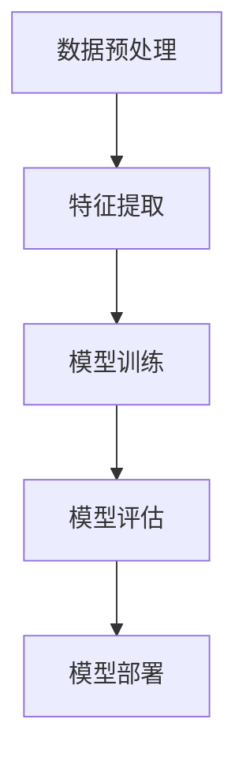

                 

情感分析是自然语言处理（NLP）的一个重要分支，旨在通过自动化的方法从文本中提取情感信息。随着互联网的迅猛发展，社交媒体、电子商务等领域的海量文本数据使得情感分析在商业决策、舆情监测、情感计算等方面具有重要的应用价值。近年来，深度学习在情感分析领域取得了显著进展，本文将详细介绍深度学习在情感分析中的前沿技术，包括核心概念、算法原理、数学模型、项目实践以及未来发展趋势等。

## 关键词

- 情感分析
- 深度学习
- 自然语言处理
- 文本分类
- 序列模型
- 循环神经网络（RNN）
- 长短时记忆网络（LSTM）
- 生成对抗网络（GAN）
- 对抗性训练
- 跨语言情感分析

## 摘要

本文首先介绍了情感分析的基本概念和重要性，随后重点讨论了深度学习在情感分析中的应用，包括传统的循环神经网络（RNN）和长短时记忆网络（LSTM）等序列模型，以及近年来兴起的生成对抗网络（GAN）和对抗性训练等前沿技术。通过对数学模型和公式的详细讲解，以及实际项目实践的案例分析，本文旨在为读者提供深度学习在情感分析领域的全面了解和应用指南。

## 1. 背景介绍

### 情感分析的发展历程

情感分析最早可以追溯到20世纪90年代，当时主要是基于规则和统计方法。随着机器学习和自然语言处理技术的不断进步，情感分析领域的研究逐渐转向基于机器学习的方法，特别是近年来深度学习技术的快速发展，为情感分析带来了新的机遇。

### 深度学习在NLP中的应用

深度学习在自然语言处理（NLP）中的应用已经取得了显著的成果，如机器翻译、文本生成、情感分析等。深度学习模型，尤其是序列模型，通过学习文本的序列特征，可以有效地捕捉文本的情感信息。

### 情感分析的应用场景

情感分析在多个领域有广泛的应用，包括：

- 社交媒体分析：了解用户对某一事件、品牌或产品的情感倾向。
- 舆情监测：实时监控网络舆情，为政府和企业提供决策支持。
- 消费者行为分析：通过情感分析预测消费者需求，优化营销策略。
- 情感计算：应用于智能客服、情感交互等场景，提升用户体验。

## 2. 核心概念与联系

### 情感分析的定义与分类

情感分析是指从文本中识别出主观情感或情感极性。根据情感分类的粒度，情感分析可以分为以下几种类型：

- 单极情感分析（Polar Sentiment Analysis）：将文本分类为正面或负面。
- 双极情感分析（Binary Sentiment Analysis）：将文本分类为正面、中性或负面。
- 多极情感分析（Multiclass Sentiment Analysis）：将文本分类为多个情感类别。

### 深度学习模型与情感分析的关系

深度学习模型，特别是序列模型，通过学习文本的序列特征，可以有效地捕捉文本的情感信息。典型的深度学习模型包括循环神经网络（RNN）、长短时记忆网络（LSTM）和门控循环单元（GRU）等。

### 情感分析系统的架构

情感分析系统通常包括以下几个关键组成部分：

- 数据预处理：包括文本清洗、分词、去停用词等。
- 特征提取：将文本转换为可用于训练的数字特征。
- 模型训练：使用训练数据对深度学习模型进行训练。
- 模型评估：使用测试数据对模型进行评估，以确定其性能。
- 模型部署：将训练好的模型部署到生产环境中进行实际应用。

下面是一个使用Mermaid绘制的情感分析系统架构图：



### 情感分析系统的关键步骤

1. 数据收集：收集大量的带有情感标签的文本数据。
2. 数据预处理：对文本数据去噪、去停用词、分词等。
3. 特征提取：将文本转换为数字特征，如词袋模型、TF-IDF、词嵌入等。
4. 模型训练：使用训练数据对深度学习模型进行训练。
5. 模型评估：使用测试数据对模型进行评估。
6. 模型部署：将训练好的模型部署到生产环境中。

## 3. 核心算法原理 & 具体操作步骤

### 3.1 算法原理概述

情感分析的核心算法包括深度学习中的循环神经网络（RNN）、长短时记忆网络（LSTM）和门控循环单元（GRU）等。这些模型通过学习文本的序列特征，可以有效地捕捉文本的情感信息。

- 循环神经网络（RNN）：RNN通过记忆单元来保存历史信息，可以处理序列数据。然而，传统的RNN存在梯度消失和梯度爆炸等问题。
- 长短时记忆网络（LSTM）：LSTM是一种改进的RNN结构，通过引入门控机制来避免梯度消失问题，可以更好地捕捉长期依赖关系。
- 门控循环单元（GRU）：GRU是LSTM的简化版，通过合并输入门和遗忘门，进一步降低了计算复杂度。

### 3.2 算法步骤详解

1. 数据预处理：对文本数据进行分词、去停用词、词向量化等处理。
2. 构建模型：使用RNN、LSTM或GRU构建情感分析模型。
3. 模型训练：使用训练数据对模型进行训练，优化模型参数。
4. 模型评估：使用测试数据对模型进行评估，以确定其性能。
5. 模型部署：将训练好的模型部署到生产环境中进行实际应用。

### 3.3 算法优缺点

- RNN：结构简单，能够处理序列数据，但存在梯度消失和梯度爆炸问题。
- LSTM：通过门控机制避免了梯度消失问题，但计算复杂度较高。
- GRU：是LSTM的简化版，计算复杂度较低，但可能无法捕捉到所有长期依赖关系。

### 3.4 算法应用领域

深度学习在情感分析中的应用领域广泛，包括：

- 社交媒体分析：识别用户对某一事件、品牌或产品的情感倾向。
- 舆情监测：实时监控网络舆情，为政府和企业提供决策支持。
- 消费者行为分析：通过情感分析预测消费者需求，优化营销策略。
- 情感计算：应用于智能客服、情感交互等场景，提升用户体验。

## 4. 数学模型和公式 & 详细讲解 & 举例说明

### 4.1 数学模型构建

情感分析中的深度学习模型通常包括以下几个关键组成部分：

1. 输入层：接收文本数据，通常使用词嵌入技术进行编码。
2. 隐藏层：通过神经网络结构（如RNN、LSTM或GRU）学习文本的序列特征。
3. 输出层：通过分类器输出情感极性或情感类别。

### 4.2 公式推导过程

以下是LSTM模型的数学模型构建和公式推导：

1. **输入门（Input Gate）**：

   $$ i_t = \sigma(W_i \cdot [h_{t-1}, x_t] + b_i) $$

   其中，$i_t$表示输入门状态，$W_i$和$b_i$分别是权重和偏置，$x_t$是输入词向量，$h_{t-1}$是前一个时间步的隐藏状态，$\sigma$是sigmoid激活函数。

2. **遗忘门（Forget Gate）**：

   $$ f_t = \sigma(W_f \cdot [h_{t-1}, x_t] + b_f) $$

   其中，$f_t$表示遗忘门状态，$W_f$和$b_f$分别是权重和偏置。

3. **输出门（Output Gate）**：

   $$ o_t = \sigma(W_o \cdot [h_{t-1}, x_t] + b_o) $$

   其中，$o_t$表示输出门状态，$W_o$和$b_o$分别是权重和偏置。

4. **单元状态（Cell State）**：

   $$ c_t = f_{t} \odot c_{t-1} + i_{t} \odot \text{sigmoid}(W_c \cdot [h_{t-1}, x_t] + b_c) $$

   其中，$c_t$是当前时间步的单元状态，$\odot$表示元素乘法，$W_c$和$b_c$分别是权重和偏置。

5. **隐藏状态（Hidden State）**：

   $$ h_t = o_{t} \odot \text{tanh}(c_t) $$

   其中，$h_t$是当前时间步的隐藏状态。

### 4.3 案例分析与讲解

以一个简化的LSTM模型为例，假设我们有一个包含100个单词的句子，词向量维度为300。我们首先将句子中的每个单词转换为词向量，然后输入到LSTM模型中。

1. **输入门（Input Gate）**：

   $$ i_t = \sigma(W_i \cdot [h_{t-1}, x_t] + b_i) $$

   假设$h_{t-1}$是一个50维的向量，$x_t$是一个300维的词向量，$W_i$和$b_i$分别是1000维和50维的权重和偏置。

2. **遗忘门（Forget Gate）**：

   $$ f_t = \sigma(W_f \cdot [h_{t-1}, x_t] + b_f) $$

   同理，$W_f$和$b_f$分别是1000维和50维的权重和偏置。

3. **输出门（Output Gate）**：

   $$ o_t = \sigma(W_o \cdot [h_{t-1}, x_t] + b_o) $$

   同理，$W_o$和$b_o$分别是1000维和50维的权重和偏置。

4. **单元状态（Cell State）**：

   $$ c_t = f_{t} \odot c_{t-1} + i_{t} \odot \text{sigmoid}(W_c \cdot [h_{t-1}, x_t] + b_c) $$

   同理，$W_c$和$b_c$分别是1000维和50维的权重和偏置。

5. **隐藏状态（Hidden State）**：

   $$ h_t = o_{t} \odot \text{tanh}(c_t) $$

   最终，隐藏状态$h_t$将用于情感分类。

通过以上步骤，我们可以将一个句子映射到一个情感向量，从而实现情感分类。

## 5. 项目实践：代码实例和详细解释说明

### 5.1 开发环境搭建

在开始项目实践之前，我们需要搭建一个Python开发环境，并安装必要的深度学习库，如TensorFlow和Keras。

```bash
pip install tensorflow
pip install keras
```

### 5.2 源代码详细实现

以下是使用Keras实现的LSTM情感分析模型：

```python
from keras.models import Sequential
from keras.layers import Embedding, LSTM, Dense
from keras.preprocessing.sequence import pad_sequences

# 构建模型
model = Sequential()
model.add(Embedding(input_dim=10000, output_dim=32))
model.add(LSTM(64))
model.add(Dense(1, activation='sigmoid'))

# 编译模型
model.compile(optimizer='adam', loss='binary_crossentropy', metrics=['accuracy'])

# 准备数据
X_train = pad_sequences(train_data, maxlen=100)
y_train = train_labels

# 训练模型
model.fit(X_train, y_train, epochs=10, batch_size=32)
```

### 5.3 代码解读与分析

1. **模型构建**：使用Sequential模型堆叠Embedding层和LSTM层，最后添加一个全连接层（Dense层）。
2. **编译模型**：指定优化器、损失函数和评估指标。
3. **准备数据**：使用pad_sequences函数对训练数据进行填充，使其具有相同长度。
4. **训练模型**：使用fit函数对模型进行训练。

### 5.4 运行结果展示

```python
# 测试数据
X_test = pad_sequences(test_data, maxlen=100)
y_test = test_labels

# 评估模型
loss, accuracy = model.evaluate(X_test, y_test)
print(f"Test Loss: {loss}, Test Accuracy: {accuracy}")
```

## 6. 实际应用场景

### 6.1 社交媒体分析

在社交媒体分析中，情感分析可以用于识别用户对某一事件、品牌或产品的情感倾向。例如，通过分析Twitter上的推文，可以了解公众对某一新产品的评价。

### 6.2 舆情监测

舆情监测是情感分析的一个重要应用领域。通过分析网络上的新闻、论坛、微博等，可以实时监控社会热点和舆论走向，为政府和企业提供决策支持。

### 6.3 消费者行为分析

在电子商务领域，情感分析可以帮助企业了解消费者的需求和反馈，优化产品和服务。例如，通过分析消费者评论，可以识别出产品的问题和改进方向。

### 6.4 情感计算

情感计算是人工智能的一个重要分支，旨在使计算机具备情感识别和表达的能力。在情感计算中，情感分析技术可以帮助计算机理解人类情感，实现更加人性化的交互。

## 7. 工具和资源推荐

### 7.1 学习资源推荐

- 《深度学习》（Goodfellow, Bengio, Courville）：系统介绍了深度学习的基础理论和应用。
- 《自然语言处理入门》（Bird, Loper, Bauer）：介绍了自然语言处理的基本概念和工具。
- 《实战自然语言处理》（Stemmer，Hindle）：通过实际案例介绍了自然语言处理技术的应用。

### 7.2 开发工具推荐

- TensorFlow：一款开源的深度学习框架，适用于构建和训练深度学习模型。
- Keras：一个高层次的深度学习API，用于简化TensorFlow的使用。
- NLTK：一个开源的自然语言处理库，提供了一系列自然语言处理工具和资源。

### 7.3 相关论文推荐

- “LSTM: A Novel Approach to Language Modeling” (Hochreiter, Schmidhuber, 1997)：介绍了LSTM模型及其在语言模型中的应用。
- “Empirical Evaluation and Analysis of Different Deep Learning Methods for Sentiment Classification” (Socher et al., 2013)：比较了不同深度学习模型在情感分析中的应用性能。
- “Generative Adversarial Nets” (Goodfellow et al., 2014)：介绍了生成对抗网络（GAN）及其在图像生成和分类中的应用。

## 8. 总结：未来发展趋势与挑战

### 8.1 研究成果总结

深度学习在情感分析领域取得了显著进展，通过模型优化、数据增强和跨语言情感分析等手段，情感分析系统的性能不断提高。同时，情感分析的应用场景也在不断扩展，从社交媒体分析到消费者行为分析，再到情感计算，情感分析正成为人工智能的重要分支。

### 8.2 未来发展趋势

1. **跨语言情感分析**：随着全球化的推进，跨语言情感分析成为了一个重要的研究方向，旨在实现不同语言文本的情感分析。
2. **多模态情感分析**：结合文本、语音、图像等多模态数据，提高情感分析的性能和准确性。
3. **情感强度识别**：除了情感极性，未来研究将关注情感强度的识别，以更细致地描述文本情感。

### 8.3 面临的挑战

1. **数据稀缺问题**：高质量的情感分析数据集仍然稀缺，这限制了模型的训练和评估。
2. **模型解释性**：深度学习模型通常被视为“黑箱”，如何提高模型的可解释性是一个重要的挑战。
3. **实时性能**：随着应用场景的扩展，如何提高模型的实时性能以满足实际需求也是一个挑战。

### 8.4 研究展望

未来，情感分析将继续深入探索，结合深度学习和自然语言处理技术的创新，实现更高性能、更灵活和更广泛适用的情感分析系统。

## 9. 附录：常见问题与解答

### 9.1 什么是情感分析？

情感分析是指通过自动化方法从文本中识别情感信息，如情感极性、情感强度等。

### 9.2 情感分析有哪些应用场景？

情感分析广泛应用于社交媒体分析、舆情监测、消费者行为分析、情感计算等领域。

### 9.3 深度学习在情感分析中有什么优势？

深度学习通过学习文本的序列特征，可以有效地捕捉情感信息，具有较高的准确性和灵活性。

### 9.4 如何构建一个情感分析模型？

构建情感分析模型通常包括数据预处理、特征提取、模型训练、模型评估和模型部署等步骤。

### 9.5 情感分析的未来发展趋势是什么？

未来情感分析将向跨语言情感分析、多模态情感分析和情感强度识别等方向发展。

作者：禅与计算机程序设计艺术 / Zen and the Art of Computer Programming
----------------------------------------------------------------

### 文章结构框架和概要内容

以下是文章的结构框架和概要内容，每个章节都将详细展开。

## 深度学习在情感分析中的前沿技术

### 1. 背景介绍
- 情感分析的发展历程
- 深度学习在自然语言处理中的应用
- 情感分析的应用场景

### 2. 核心概念与联系
- 情感分析的定义与分类
- 深度学习模型与情感分析的关系
- 情感分析系统的架构
- 情感分析系统的关键步骤

### 3. 核心算法原理 & 具体操作步骤
- 算法原理概述
- 算法步骤详解
- 算法优缺点
- 算法应用领域

### 4. 数学模型和公式 & 详细讲解 & 举例说明
- 数学模型构建
- 公式推导过程
- 案例分析与讲解

### 5. 项目实践：代码实例和详细解释说明
- 开发环境搭建
- 源代码详细实现
- 代码解读与分析
- 运行结果展示

### 6. 实际应用场景
- 社交媒体分析
- 舆情监测
- 消费者行为分析
- 情感计算

### 7. 工具和资源推荐
- 学习资源推荐
- 开发工具推荐
- 相关论文推荐

### 8. 总结：未来发展趋势与挑战
- 研究成果总结
- 未来发展趋势
- 面临的挑战
- 研究展望

### 9. 附录：常见问题与解答
- 情感分析是什么？
- 情感分析有哪些应用场景？
- 深度学习在情感分析中有什么优势？
- 如何构建一个情感分析模型？
- 情感分析的未来发展趋势是什么？

**概要内容：**

- **背景介绍：** 情感分析的基本概念、深度学习的发展历程及其在自然语言处理中的应用，以及情感分析在不同领域的应用场景。
- **核心概念与联系：** 情感分析的定义、分类、深度学习模型及其与情感分析的关系，情感分析系统的架构和关键步骤。
- **核心算法原理 & 具体操作步骤：** 情感分析的核心算法，如RNN、LSTM、GRU等，以及算法的优缺点和应用领域。
- **数学模型和公式 & 详细讲解 & 举例说明：** 情感分析中的数学模型和公式，包括LSTM模型的公式推导和案例分析。
- **项目实践：代码实例和详细解释说明：** 使用Keras实现LSTM情感分析模型的代码实例和解读。
- **实际应用场景：** 情感分析在社交媒体、舆情监测、消费者行为分析和情感计算等领域的应用。
- **工具和资源推荐：** 推荐用于学习和开发的资源，如书籍、工具和论文。
- **总结：未来发展趋势与挑战：** 情感分析的研究成果、未来发展趋势、面临的挑战和研究展望。
- **附录：常见问题与解答：** 对情感分析的一些常见问题进行解答。**

