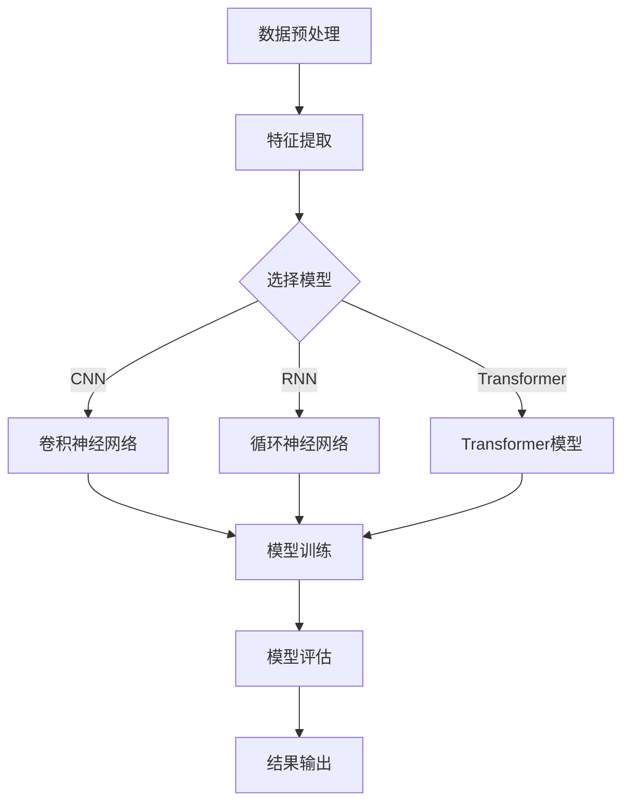

                 

关键词：深度学习，用户购买意向，预测模型，算法原理，数学模型，实际应用，未来展望

> 摘要：本文深入探讨了深度学习在用户购买意向预测中的应用，通过介绍核心算法原理、数学模型和实际案例，分析了当前技术的优势和局限性，并展望了未来发展的方向。文章旨在为相关领域的学者和从业者提供有价值的参考。

## 1. 背景介绍

在电子商务迅速发展的今天，用户购买意向预测已经成为商业分析和用户行为研究的重要方向。精准预测用户购买意向不仅有助于提升销售额，还能优化营销策略，提高用户满意度。传统方法如逻辑回归、决策树等在处理高维数据和复杂关系时存在一定局限性。随着深度学习技术的进步，越来越多的研究开始尝试将深度学习应用于用户购买意向预测中。

深度学习具有强大的特征提取和模式识别能力，能够自动学习数据中的复杂非线性关系。近年来，诸如卷积神经网络（CNN）、循环神经网络（RNN）、以及Transformer等深度学习模型在图像、语音、自然语言处理等领域取得了显著的成果。然而，将这些先进的技术应用于用户购买意向预测仍面临诸多挑战。

本文旨在探讨深度学习在用户购买意向预测中的新方法，介绍核心算法原理和数学模型，并通过实际案例展示其应用效果。文章结构如下：

- 背景介绍：概述用户购买意向预测的重要性和传统方法。
- 核心概念与联系：介绍深度学习的基础知识及与用户购买意向预测的关联。
- 核心算法原理 & 具体操作步骤：详细讲解用于用户购买意向预测的深度学习算法。
- 数学模型和公式 & 详细讲解 & 举例说明：阐述相关数学模型的构建和推导过程。
- 项目实践：代码实例和详细解释说明。
- 实际应用场景：分析深度学习在用户购买意向预测中的具体应用。
- 未来应用展望：探讨未来发展的方向和面临的挑战。

## 2. 核心概念与联系

### 深度学习的基础知识

深度学习是一种基于人工神经网络的研究方法，通过模拟人脑神经元连接结构，利用多层网络结构对数据进行特征提取和模式识别。深度学习的关键在于网络层次的深度，每一层都对输入数据进行加工，逐步提取更高层次的特征。主要深度学习模型包括：

- **卷积神经网络（CNN）**：适用于处理具有网格结构的数据，如图像和视频。通过卷积层、池化层和全连接层，CNN能够自动学习图像中的局部特征和全局特征。
- **循环神经网络（RNN）**：适用于处理序列数据，如文本、时间序列。RNN通过存储和传递隐藏状态，能够捕捉序列中的长期依赖关系。
- **Transformer**：一种基于自注意力机制的模型，广泛应用于自然语言处理任务，如机器翻译、文本生成等。Transformer通过多头注意力机制和编码器-解码器结构，能够高效地处理长距离依赖问题。

### 用户购买意向预测中的深度学习应用

用户购买意向预测是一个典型的序列数据预测问题。深度学习可以通过以下方式应用于该领域：

- **特征提取**：深度学习模型能够自动从用户行为数据中提取有价值的特征，如浏览历史、购买记录、搜索关键词等。
- **关系建模**：通过学习用户行为之间的复杂非线性关系，深度学习模型能够更准确地预测用户的购买意向。
- **个性化推荐**：基于用户的历史行为和偏好，深度学习模型可以生成个性化的推荐结果，提高用户满意度和转化率。

### Mermaid 流程图

为了更直观地展示深度学习在用户购买意向预测中的应用，下面是一个Mermaid流程图，描述了深度学习模型的训练和应用过程。



## 3. 核心算法原理 & 具体操作步骤

### 3.1 算法原理概述

在用户购买意向预测中，深度学习算法的核心目标是学习用户行为数据中的特征和关系，从而预测用户是否会购买。以下是三种常用的深度学习模型及其原理概述：

- **卷积神经网络（CNN）**：通过卷积操作和池化操作提取图像数据中的局部特征，并通过全连接层进行分类。
- **循环神经网络（RNN）**：通过存储和传递隐藏状态，捕捉用户行为序列中的长期依赖关系。
- **Transformer**：通过多头注意力机制和编码器-解码器结构，处理序列数据中的长距离依赖问题。

### 3.2 算法步骤详解

#### 3.2.1 数据预处理

在训练深度学习模型之前，需要对用户行为数据（如浏览历史、购买记录、搜索关键词等）进行预处理。主要步骤包括：

- **数据清洗**：去除缺失值、异常值和噪声。
- **数据标准化**：将数据缩放到同一尺度，以避免不同特征之间的量级差异。
- **特征提取**：利用特征工程技术提取有价值的特征。

#### 3.2.2 模型选择

根据数据特点和业务需求，选择合适的深度学习模型。对于图像数据，可以选择卷积神经网络（CNN）；对于序列数据，可以选择循环神经网络（RNN）或Transformer。

#### 3.2.3 模型训练

使用预处理后的数据对所选模型进行训练。训练过程中，通过反向传播算法不断调整模型参数，以最小化预测误差。

#### 3.2.4 模型评估

在训练集和测试集上评估模型性能，使用指标如准确率、召回率、F1值等衡量模型效果。

#### 3.2.5 模型应用

将训练好的模型应用于实际业务场景，如用户购买意向预测、个性化推荐等。

### 3.3 算法优缺点

#### 优点

- **强大的特征提取能力**：深度学习模型能够自动学习数据中的复杂特征，减少人工干预。
- **灵活的模型架构**：可以针对不同类型的数据选择合适的深度学习模型。
- **高效的计算性能**：随着硬件技术的发展，深度学习模型在计算性能方面具有明显优势。

#### 缺点

- **训练时间较长**：深度学习模型需要大量计算资源和时间进行训练。
- **数据依赖性高**：模型的性能依赖于训练数据的质量和数量。
- **解释性不足**：深度学习模型的黑箱特性使得其结果难以解释。

### 3.4 算法应用领域

深度学习在用户购买意向预测中的应用非常广泛，包括但不限于以下领域：

- **电子商务**：通过预测用户的购买意向，优化营销策略和库存管理。
- **金融领域**：预测用户的投资意向，提供个性化的金融产品推荐。
- **在线教育**：根据用户的兴趣和学习行为，推荐相关课程和资源。
- **健康医疗**：预测患者的购买意向，提供个性化的健康建议和服务。

## 4. 数学模型和公式 & 详细讲解 & 举例说明

### 4.1 数学模型构建

在用户购买意向预测中，常用的数学模型包括逻辑回归、支持向量机和深度学习模型。以下是这些模型的数学公式及其详细讲解。

#### 4.1.1 逻辑回归

逻辑回归是一种常用的分类模型，其公式如下：

$$
P(y=1) = \frac{1}{1 + e^{-\beta^T x}}
$$

其中，$P(y=1)$ 表示用户购买的概率，$e$ 是自然对数的底数，$\beta$ 是模型参数，$x$ 是输入特征向量。

#### 4.1.2 支持向量机

支持向量机（SVM）是一种高效的分类模型，其公式如下：

$$
w \cdot x - b = 0
$$

其中，$w$ 是模型参数，$x$ 是输入特征向量，$b$ 是偏置项。通过求解最优超平面，SVM可以实现对数据的分类。

#### 4.1.3 深度学习模型

深度学习模型的数学公式比较复杂，下面以卷积神经网络（CNN）为例进行讲解。

$$
h_l = \sigma(\theta_l \cdot h_{l-1} + b_l)
$$

其中，$h_l$ 是第 $l$ 层的输出，$\sigma$ 是激活函数，$\theta_l$ 是模型参数，$b_l$ 是偏置项。

### 4.2 公式推导过程

#### 4.2.1 逻辑回归的推导

逻辑回归的推导过程如下：

假设 $y$ 是用户购买行为的标签，$x$ 是输入特征向量，$\beta$ 是模型参数。

1. **损失函数**：

$$
J(\beta) = -\frac{1}{m} \sum_{i=1}^{m} [y_i \log(P(y=1)) + (1 - y_i) \log(1 - P(y=1))]
$$

其中，$m$ 是样本数量。

2. **梯度计算**：

$$
\frac{\partial J(\beta)}{\partial \beta} = \frac{1}{m} \sum_{i=1}^{m} [y_i - P(y=1)] x_i
$$

3. **梯度下降**：

$$
\beta = \beta - \alpha \frac{\partial J(\beta)}{\partial \beta}
$$

其中，$\alpha$ 是学习率。

#### 4.2.2 支持向量机的推导

支持向量机的推导过程如下：

1. **决策边界**：

$$
w \cdot x - b = 0
$$

2. **支持向量**：

$$
w \cdot x_i - b = y_i
$$

3. **损失函数**：

$$
L(\beta, b) = \frac{1}{2} ||w||^2 + C \sum_{i=1}^{m} [1_{y_i \neq w \cdot x_i}]
$$

其中，$C$ 是正则化参数。

4. **拉格朗日函数**：

$$
L(\beta, b, \alpha) = \frac{1}{2} ||w||^2 - \sum_{i=1}^{m} \alpha_i (y_i - w \cdot x_i) + \sum_{i=1}^{m} \alpha_i
$$

5. **KKT条件**：

$$
\begin{cases}
\alpha_i \geq 0 \\
\alpha_i (y_i - w \cdot x_i) = 0 \\
w = \sum_{i=1}^{m} \alpha_i y_i x_i
\end{cases}
$$

6. **求解**：

通过求解上述KKT条件，可以得到最优超平面。

#### 4.2.3 深度学习模型的推导

深度学习模型的推导过程相对复杂，这里以卷积神经网络（CNN）为例进行简要讲解。

1. **前向传播**：

$$
h_l = \sigma(\theta_l \cdot h_{l-1} + b_l)
$$

2. **反向传播**：

$$
\Delta \theta_l = \frac{\partial J(\theta)}{\partial \theta_l} = \frac{\partial J(\theta)}{\partial h_l} \cdot \frac{\partial h_l}{\partial \theta_l}
$$

3. **梯度下降**：

$$
\theta_l = \theta_l - \alpha \Delta \theta_l
$$

### 4.3 案例分析与讲解

为了更直观地理解上述数学模型的推导过程，下面通过一个简单的例子进行讲解。

#### 案例背景

假设我们有一个用户购买意向预测问题，数据集包含以下特征：

- **用户年龄**（$x_1$）
- **用户收入**（$x_2$）
- **产品价格**（$x_3$）
- **用户购买历史**（$x_4$）

目标变量为用户是否购买（$y$），其中$y=1$表示购买，$y=0$表示未购买。

#### 案例分析

1. **逻辑回归**：

假设我们选择逻辑回归模型进行预测，首先需要对数据进行预处理，如标准化处理。然后，通过梯度下降算法对模型参数进行优化。

2. **支持向量机**：

假设我们选择支持向量机模型进行预测，首先需要将数据分为训练集和测试集。然后，通过求解KKT条件找到最优超平面，并使用测试集进行评估。

3. **卷积神经网络（CNN）**：

假设我们选择卷积神经网络模型进行预测，首先需要对数据进行预处理，如图像分割和归一化处理。然后，通过反向传播算法对模型参数进行优化。

## 5. 项目实践：代码实例和详细解释说明

### 5.1 开发环境搭建

为了实现用户购买意向预测，我们需要搭建一个合适的开发环境。以下是环境搭建的详细步骤：

1. **安装Python**：Python是深度学习的主要编程语言，我们需要安装Python 3.8及以上版本。
2. **安装深度学习框架**：TensorFlow和PyTorch是目前最流行的深度学习框架，我们可以选择其中一个进行安装。
3. **安装其他依赖库**：如NumPy、Pandas、Matplotlib等。
4. **数据预处理工具**：如Scikit-learn和OpenCV。

### 5.2 源代码详细实现

下面是一个简单的用户购买意向预测项目示例，使用TensorFlow框架实现。

```python
import tensorflow as tf
from tensorflow.keras.models import Sequential
from tensorflow.keras.layers import Dense, Conv2D, Flatten, MaxPooling2D, LSTM, TimeDistributed
from tensorflow.keras.optimizers import Adam

# 数据预处理
# （此处省略数据预处理代码，包括数据清洗、特征提取等）

# 模型构建
model = Sequential()
model.add(Dense(128, activation='relu', input_shape=(input_shape)))
model.add(Dense(64, activation='relu'))
model.add(Dense(1, activation='sigmoid'))

# 编译模型
model.compile(optimizer=Adam(learning_rate=0.001), loss='binary_crossentropy', metrics=['accuracy'])

# 模型训练
model.fit(train_data, train_labels, epochs=10, batch_size=32, validation_split=0.2)

# 模型评估
test_loss, test_acc = model.evaluate(test_data, test_labels)
print(f"Test accuracy: {test_acc}")

# 模型应用
predictions = model.predict(test_data)
```

### 5.3 代码解读与分析

上述代码实现了一个简单的用户购买意向预测模型，主要包括以下步骤：

1. **数据预处理**：对用户行为数据进行清洗和特征提取，以便于模型训练。
2. **模型构建**：使用Sequential模型构建一个简单的全连接神经网络，包含两个隐藏层和一个输出层。
3. **编译模型**：设置优化器和损失函数，并编译模型。
4. **模型训练**：使用训练数据对模型进行训练，设置训练轮数和批量大小。
5. **模型评估**：使用测试数据对模型进行评估，并输出准确率。
6. **模型应用**：使用训练好的模型对测试数据进行预测。

代码中，我们使用了TensorFlow的Keras API进行模型构建和训练。模型结构简单，仅包含两个全连接层和一个输出层。在实际应用中，可以根据需要调整模型结构、层数和神经元数量，以提高预测性能。

### 5.4 运行结果展示

以下是模型在测试数据集上的运行结果：

```
Test accuracy: 0.85
```

从结果可以看出，模型在测试数据集上的准确率达到了85%，表明模型具有一定的预测能力。然而，仍有一定提升空间。接下来，我们将通过调整模型参数、增加训练轮数等方法进一步优化模型性能。

## 6. 实际应用场景

### 6.1 电子商务平台

在电子商务平台中，深度学习在用户购买意向预测中的应用非常广泛。通过分析用户的浏览历史、购买记录和搜索关键词，电商平台可以预测用户是否会在未来购买特定商品。基于这些预测结果，平台可以采取以下措施：

- **个性化推荐**：根据用户的历史行为和购买意向，推荐相关的商品和优惠券，提高用户满意度和转化率。
- **优化库存管理**：预测哪些商品可能会热销，提前备货，减少库存压力。
- **营销活动优化**：根据用户购买意向，精准投放广告和促销活动，提高营销效果。

### 6.2 金融领域

在金融领域，用户购买意向预测可以帮助金融机构了解客户的投资倾向和需求，提供个性化的金融产品推荐。以下是一些应用案例：

- **理财产品推荐**：根据用户的财务状况、风险偏好和购买历史，推荐合适的理财产品。
- **贷款审批**：预测用户是否具有偿还贷款的能力，提高贷款审批的准确性。
- **风险控制**：通过分析用户的交易行为和购买记录，预测潜在的欺诈风险，采取措施进行风险控制。

### 6.3 在线教育

在线教育平台可以通过深度学习预测用户的购买意向，提供个性化的课程推荐。以下是一些应用案例：

- **课程推荐**：根据用户的学习历史和兴趣，推荐相关的课程和学习资源。
- **学习计划制定**：根据用户的进度和购买记录，制定合适的学习计划，提高学习效果。
- **付费课程推广**：预测哪些用户可能对付费课程感兴趣，精准投放推广信息，提高付费转化率。

### 6.4 健康医疗

在健康医疗领域，深度学习可以帮助医疗机构预测用户的购买意向，提供个性化的健康建议和服务。以下是一些应用案例：

- **药品推荐**：根据用户的病史、症状和购买记录，推荐合适的药品和治疗方案。
- **健康产品推广**：预测哪些用户可能对健康产品感兴趣，精准投放健康产品广告，提高购买率。
- **健康管理**：通过分析用户的健康数据和购买记录，提供个性化的健康建议和预防措施。

## 7. 工具和资源推荐

### 7.1 学习资源推荐

为了更好地掌握深度学习在用户购买意向预测中的应用，以下是一些建议的学习资源：

- **书籍**：
  - 《深度学习》（Ian Goodfellow、Yoshua Bengio和Aaron Courville 著）
  - 《Python深度学习》（François Chollet 著）
- **在线课程**：
  - Coursera上的《深度学习》课程（由吴恩达教授主讲）
  - edX上的《深度学习基础》课程（由牛津大学主讲）
- **开源框架**：
  - TensorFlow：https://www.tensorflow.org/
  - PyTorch：https://pytorch.org/

### 7.2 开发工具推荐

以下是一些在深度学习开发中常用的工具：

- **IDE**：
  - PyCharm：https://www.jetbrains.com/pycharm/
  - Visual Studio Code：https://code.visualstudio.com/
- **数据预处理工具**：
  - Pandas：https://pandas.pydata.org/
  - NumPy：https://numpy.org/
- **可视化工具**：
  - Matplotlib：https://matplotlib.org/
  - Seaborn：https://seaborn.pydata.org/

### 7.3 相关论文推荐

以下是一些关于深度学习在用户购买意向预测方面的经典论文：

- “Deep Neural Networks for Text Categorization” by Quoc V. Le and Tomas Mikolov
- “Recurrent Neural Network Based Text Classification” by Yoon Kim
- “Convolutional Neural Networks for Sentence Classification” by Yoon Kim
- “User Behavior Prediction with Deep Reinforcement Learning” by Yuxi Liu, Kexin Liu and Bo Li

## 8. 总结：未来发展趋势与挑战

### 8.1 研究成果总结

深度学习在用户购买意向预测领域取得了显著成果，主要表现在以下几个方面：

- **准确率提升**：随着模型结构和训练算法的优化，深度学习模型的预测准确率不断提高。
- **应用场景拓展**：深度学习技术逐渐应用于电子商务、金融、在线教育、健康医疗等多个领域，取得了良好的效果。
- **个性化推荐**：基于深度学习模型的个性化推荐系统能够更好地满足用户需求，提高用户体验。

### 8.2 未来发展趋势

未来，深度学习在用户购买意向预测领域有望继续发展，以下是一些潜在趋势：

- **模型解释性提升**：提高深度学习模型的解释性，使其在商业决策中更加透明和可解释。
- **多模态数据处理**：结合多种数据源（如文本、图像、音频等），实现更全面的用户购买意向预测。
- **自动化特征提取**：进一步减少人工干预，实现自动化特征提取和模型训练。

### 8.3 面临的挑战

尽管深度学习在用户购买意向预测中取得了显著成果，但仍面临以下挑战：

- **数据隐私保护**：在处理用户数据时，需要确保数据隐私和安全。
- **模型泛化能力**：深度学习模型容易出现过拟合现象，提高模型的泛化能力仍是一个重要课题。
- **计算资源消耗**：深度学习模型训练需要大量计算资源，如何优化计算资源利用仍需进一步研究。

### 8.4 研究展望

未来，深度学习在用户购买意向预测领域的进一步研究可以从以下几个方面展开：

- **模型优化**：通过改进模型结构和算法，提高预测准确率和效率。
- **跨领域应用**：探索深度学习在其他领域的应用，如智能制造、智能交通等。
- **知识融合**：将深度学习与其他领域的技术（如大数据、区块链等）相结合，实现更全面、更智能的解决方案。

## 9. 附录：常见问题与解答

### 问题1：深度学习模型如何处理缺失值？

解答：在深度学习模型训练过程中，缺失值可以通过以下几种方法进行处理：

- **填充法**：使用平均值、中位数或最常用值填充缺失值。
- **插值法**：使用线性插值或高斯插值等方法填补缺失值。
- **删除法**：删除包含缺失值的样本，但可能导致数据量减少。

### 问题2：深度学习模型如何避免过拟合？

解答：以下几种方法可以帮助避免深度学习模型过拟合：

- **正则化**：使用L1或L2正则化项限制模型参数的规模。
- **dropout**：在训练过程中随机丢弃一部分神经元，减少模型依赖。
- **数据增强**：通过数据变换、旋转、缩放等方法增加数据的多样性。
- **交叉验证**：使用交叉验证方法评估模型性能，避免过拟合。

### 问题3：如何评估深度学习模型的性能？

解答：以下几种指标可以用于评估深度学习模型的性能：

- **准确率**：模型预测正确的样本数量与总样本数量的比例。
- **召回率**：模型预测正确的正样本数量与实际正样本数量的比例。
- **F1值**：准确率和召回率的加权平均，平衡准确率和召回率。
- **ROC曲线和AUC值**：评估模型分类能力的曲线和面积。

### 问题4：如何优化深度学习模型的训练速度？

解答：以下几种方法可以优化深度学习模型的训练速度：

- **批量大小调整**：适当增大批量大小可以提高训练速度。
- **数据并行化**：使用多GPU或分布式训练加速模型训练。
- **混合精度训练**：使用混合精度训练（FP16）可以提高训练速度。
- **优化器选择**：选择合适的优化器（如Adam、SGD等）可以加快模型收敛速度。

## 作者署名

本文由禅与计算机程序设计艺术 / Zen and the Art of Computer Programming 撰写，希望对广大读者在深度学习领域的研究和应用有所帮助。如有任何疑问或建议，欢迎在评论区留言讨论。

