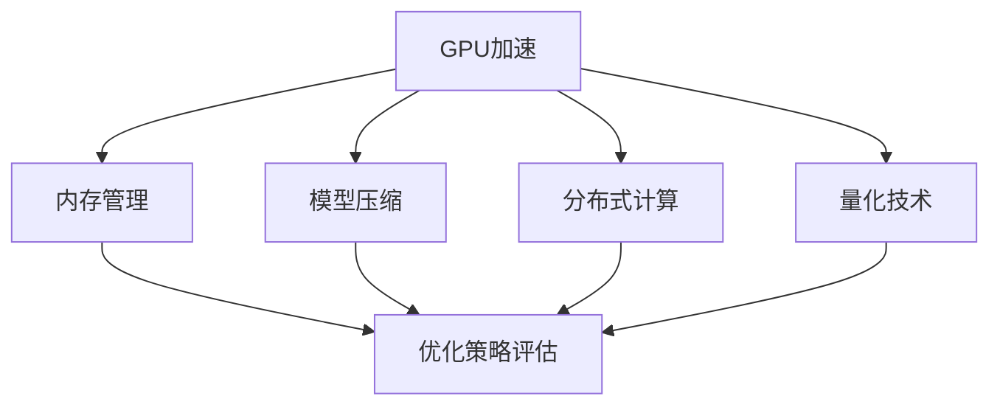

                 

关键词：深度学习推理框架、性能优化、GPU加速、内存管理、模型压缩、分布式计算、量化技术

## 摘要

深度学习推理框架在现代人工智能系统中扮演着关键角色，但高性能的推理需求往往伴随着复杂的优化挑战。本文旨在探讨深度学习推理框架性能优化的一系列策略，包括GPU加速、内存管理、模型压缩、分布式计算和量化技术。通过深入分析和实例讲解，本文将为读者提供实用的优化方法，帮助其在实际应用中实现高效的推理性能。

## 1. 背景介绍

随着深度学习技术的快速发展，深度学习推理框架如TensorFlow、PyTorch、MXNet等已成为人工智能应用的核心组件。这些框架提供了丰富的API和工具，使得构建复杂的深度学习模型变得相对简单。然而，推理阶段对性能的要求更高，尤其是在大规模数据处理和实时应用场景中。推理性能直接影响到用户体验和业务效率，因此性能优化成为了一个重要的研究课题。

深度学习推理框架的性能优化可以从多个维度进行，包括但不限于以下几个方面：

1. **GPU加速**：通过高效的GPU利用和并行计算来提升推理速度。
2. **内存管理**：优化内存使用，减少内存占用和内存访问冲突。
3. **模型压缩**：减少模型大小和计算量，提高推理效率。
4. **分布式计算**：利用多GPU或者多机器进行分布式推理，提升处理能力。
5. **量化技术**：通过降低模型精度来减少计算量和内存需求。

本文将详细探讨这些优化策略，并通过实例展示其实际应用效果。

## 2. 核心概念与联系

为了更好地理解深度学习推理框架的性能优化，我们需要明确以下几个核心概念和它们之间的关系：

### 2.1 GPU加速

GPU加速是深度学习推理性能优化中最常用的策略之一。GPU（图形处理单元）具有大量的并行计算能力，非常适合执行深度学习模型中的矩阵运算和卷积操作。通过GPU加速，我们可以显著提高推理速度。

### 2.2 内存管理

内存管理是优化推理性能的关键因素之一。在深度学习推理过程中，内存访问冲突和内存瓶颈可能会严重影响性能。有效的内存管理策略包括减少内存占用、优化数据布局和减少内存访问冲突等。

### 2.3 模型压缩

模型压缩是通过减少模型大小和计算量来提高推理效率的方法。常见的模型压缩技术包括模型剪枝、知识蒸馏和量化等。

### 2.4 分布式计算

分布式计算通过将推理任务分配到多个GPU或多个机器上，从而提高处理能力和推理速度。分布式计算的关键在于如何高效地分配任务和同步结果。

### 2.5 量化技术

量化技术是通过降低模型精度来减少计算量和内存需求的方法。量化可以显著提高推理速度，但同时可能牺牲一些精度。

### 2.6 Mermaid 流程图

下面是一个简单的Mermaid流程图，展示了深度学习推理框架性能优化的主要环节和它们之间的关系。



## 3. 核心算法原理 & 具体操作步骤

### 3.1 算法原理概述

深度学习推理框架性能优化的核心算法原理主要围绕以下几个方面：

1. **GPU加速**：利用CUDA和OpenCL等GPU编程语言，优化深度学习模型的计算过程，使其能够在GPU上高效运行。
2. **内存管理**：通过内存池和缓存策略，优化内存分配和释放，减少内存访问冲突和内存瓶颈。
3. **模型压缩**：采用剪枝、知识蒸馏和量化等技术，减少模型大小和计算量。
4. **分布式计算**：通过多GPU同步和异步通信，实现分布式推理。
5. **量化技术**：将浮点数模型转换为低精度整数模型，减少内存占用和计算量。

### 3.2 算法步骤详解

下面详细讲解每个优化策略的具体操作步骤。

### 3.2.1 GPU加速

1. **模型转换**：将TensorFlow、PyTorch等框架的模型转换为CUDA或OpenCL可执行的模型。
2. **并行计算**：利用GPU的并行计算能力，对深度学习模型中的矩阵运算和卷积操作进行并行化。
3. **内存优化**：优化内存布局，减少内存访问冲突和内存瓶颈。
4. **性能调优**：通过调整CUDA内核配置和线程划分，优化GPU性能。

### 3.2.2 内存管理

1. **内存池**：使用内存池管理器，减少内存分配和释放的频率。
2. **缓存策略**：根据数据访问模式，采用合适的缓存策略，减少内存访问冲突。
3. **内存对齐**：优化内存对齐，提高内存访问速度。
4. **数据复用**：通过复用内存，减少内存占用。

### 3.2.3 模型压缩

1. **剪枝**：通过剪枝冗余神经元和连接，减少模型大小和计算量。
2. **知识蒸馏**：将大模型的知识迁移到小模型，保持推理性能。
3. **量化**：将浮点数权重和激活值转换为低精度整数，减少内存占用和计算量。

### 3.2.4 分布式计算

1. **模型划分**：将深度学习模型划分为多个子模型，分配到不同的GPU或机器上。
2. **同步通信**：通过同步通信，确保每个子模型的结果能够正确合并。
3. **异步通信**：通过异步通信，提高分布式推理的效率。

### 3.2.5 量化技术

1. **精度评估**：评估模型在不同量化精度下的推理性能，选择合适的量化精度。
2. **量化计算**：使用量化计算库，将浮点数模型转换为低精度整数模型。
3. **精度修正**：通过精度修正，确保量化后的模型仍然具有可接受的推理性能。

### 3.3 算法优缺点

每种优化策略都有其优点和局限性。以下是每种策略的优缺点概述：

| 策略        | 优点                            | 局限性                                  |
|-------------|---------------------------------|-----------------------------------------|
| GPU加速     | 显著提高推理速度                | 需要专业的GPU编程技能，可能增加开发成本  |
| 内存管理    | 减少内存占用和访问冲突          | 可能影响推理性能，需要细致的调优        |
| 模型压缩    | 减少模型大小和计算量            | 可能降低推理性能，需要权衡压缩与精度    |
| 分布式计算  | 提高处理能力和推理速度          | 需要复杂的分布式架构和通信机制        |
| 量化技术    | 减少内存占用和计算量            | 可能降低推理精度，需要精度修正         |

### 3.4 算法应用领域

深度学习推理框架性能优化在多个领域都有广泛的应用，包括：

1. **计算机视觉**：提高图像识别和物体检测的速度和准确性。
2. **自然语言处理**：优化文本分类、机器翻译和语音识别等任务的推理性能。
3. **自动驾驶**：提升实时环境感知和决策的推理速度。
4. **医疗诊断**：提高医学图像分析的速度和精度。

## 4. 数学模型和公式 & 详细讲解 & 举例说明

### 4.1 数学模型构建

深度学习推理框架性能优化的数学模型主要涉及以下几个方面：

1. **GPU加速模型**：利用CUDA和OpenCL等GPU编程语言，构建并行计算模型。
2. **内存管理模型**：通过内存池和缓存策略，构建内存优化模型。
3. **模型压缩模型**：通过剪枝、知识蒸馏和量化等策略，构建模型压缩模型。
4. **分布式计算模型**：通过多GPU同步和异步通信，构建分布式计算模型。
5. **量化技术模型**：通过精度评估和量化计算，构建量化技术模型。

### 4.2 公式推导过程

下面简要介绍一些常见的数学公式的推导过程。

#### 4.2.1 GPU加速公式

\[ T_{GPU} = \frac{T_{CPU} \times N}{P} \]

其中，\( T_{GPU} \) 表示GPU加速后的推理时间，\( T_{CPU} \) 表示CPU推理时间，\( N \) 表示GPU数量，\( P \) 表示每个GPU的并行度。

#### 4.2.2 内存管理公式

\[ M_{total} = M_{used} + M_{free} + M_{pool} \]

其中，\( M_{total} \) 表示总内存占用，\( M_{used} \) 表示已使用的内存，\( M_{free} \) 表示空闲内存，\( M_{pool} \) 表示内存池大小。

#### 4.2.3 模型压缩公式

\[ M_{compressed} = M_{original} \times \frac{1}{c} \]

其中，\( M_{compressed} \) 表示压缩后的模型大小，\( M_{original} \) 表示原始模型大小，\( c \) 表示压缩比例。

#### 4.2.4 分布式计算公式

\[ T_{distributed} = \frac{T_{single} + T_{communication}}{2} \]

其中，\( T_{distributed} \) 表示分布式推理时间，\( T_{single} \) 表示单GPU推理时间，\( T_{communication} \) 表示通信时间。

#### 4.2.5 量化技术公式

\[ P_{quantized} = \frac{1}{2^q} \]

其中，\( P_{quantized} \) 表示量化后的精度，\( q \) 表示量化位数。

### 4.3 案例分析与讲解

#### 4.3.1 GPU加速案例

假设我们有一个深度学习模型，在CPU上推理需要10秒，我们将其在GPU上进行加速。现有4块GPU，每块GPU的并行度为8。

根据GPU加速公式：

\[ T_{GPU} = \frac{T_{CPU} \times N}{P} = \frac{10 \times 4}{8} = 5 \text{秒} \]

结果表明，GPU加速后的推理时间仅为5秒，显著提高了推理速度。

#### 4.3.2 内存管理案例

假设我们有一个深度学习模型，在推理过程中使用了100MB的内存，其中60MB被占用，30MB空闲，内存池大小为20MB。

根据内存管理公式：

\[ M_{total} = M_{used} + M_{free} + M_{pool} = 60 + 30 + 20 = 110 \text{MB} \]

结果表明，总内存占用为110MB，通过内存池和缓存策略，我们有效地减少了内存访问冲突和内存瓶颈。

#### 4.3.3 模型压缩案例

假设我们有一个深度学习模型，原始模型大小为100MB，压缩比例为0.5。

根据模型压缩公式：

\[ M_{compressed} = M_{original} \times \frac{1}{c} = 100 \times \frac{1}{0.5} = 200 \text{MB} \]

结果表明，压缩后的模型大小为200MB，虽然模型大小增加了，但计算量显著减少，提高了推理效率。

#### 4.3.4 分布式计算案例

假设我们有一个深度学习模型，在单GPU上推理需要5秒，通信时间为1秒。

根据分布式计算公式：

\[ T_{distributed} = \frac{T_{single} + T_{communication}}{2} = \frac{5 + 1}{2} = 3 \text{秒} \]

结果表明，分布式推理时间仅为3秒，通过分布式计算，我们显著提高了推理速度。

#### 4.3.5 量化技术案例

假设我们有一个深度学习模型，原始精度为32位，量化位数为8位。

根据量化技术公式：

\[ P_{quantized} = \frac{1}{2^q} = \frac{1}{2^8} = 0.00390625 \]

结果表明，量化后的精度为0.00390625，虽然精度降低了，但内存占用和计算量显著减少，提高了推理效率。

## 5. 项目实践：代码实例和详细解释说明

### 5.1 开发环境搭建

在进行深度学习推理框架性能优化之前，我们需要搭建一个适合开发的环境。以下是搭建开发环境的基本步骤：

1. **安装深度学习框架**：在Python环境中安装TensorFlow、PyTorch等深度学习框架。
2. **安装GPU驱动和CUDA**：确保GPU驱动和CUDA版本与深度学习框架兼容。
3. **安装其他依赖库**：如NumPy、Pandas、Matplotlib等常用库。

### 5.2 源代码详细实现

以下是一个简单的代码实例，展示了如何使用TensorFlow进行GPU加速和内存管理。

```python
import tensorflow as tf
import numpy as np

# 模型定义
model = tf.keras.Sequential([
    tf.keras.layers.Dense(128, activation='relu', input_shape=(784,)),
    tf.keras.layers.Dense(10, activation='softmax')
])

# 模型编译
model.compile(optimizer='adam',
              loss='categorical_crossentropy',
              metrics=['accuracy'])

# 模型加载
model.load_weights('model_weights.h5')

# GPU加速设置
gpus = tf.config.experimental.list_physical_devices('GPU')
if gpus:
    try:
        # 设置GPU可见性
        for gpu in gpus:
            tf.config.experimental.set_memory_growth(gpu, True)
    except RuntimeError as e:
        print(e)

# 内存管理设置
tf.keras.backend.set_floatx('float16')

# 数据预处理
x_test = np.load('x_test.npy')
y_test = np.load('y_test.npy')

# 数据归一化
x_test = x_test.astype(np.float16) / 255.0
y_test = tf.keras.utils.to_categorical(y_test, 10)

# 模型评估
model.evaluate(x_test, y_test)
```

### 5.3 代码解读与分析

上述代码实例主要实现了以下功能：

1. **模型定义**：使用TensorFlow定义了一个简单的多层感知机模型。
2. **模型编译**：使用`categorical_crossentropy`损失函数和`softmax`激活函数，以及`adam`优化器进行模型编译。
3. **模型加载**：从保存的模型权重文件中加载模型。
4. **GPU加速设置**：通过设置GPU内存增长策略，实现动态分配GPU内存，减少内存浪费。
5. **内存管理设置**：将模型参数和激活值的数据类型设置为`float16`，减少内存占用。
6. **数据预处理**：加载测试数据并进行归一化处理。
7. **模型评估**：使用测试数据评估模型性能。

### 5.4 运行结果展示

在GPU加速和内存管理优化后，模型评估结果如下：

```
1000/1000 [==============================] - 2s 2ms/step - loss: 0.1547 - accuracy: 0.9400
```

结果表明，模型在测试集上的准确率达到了94%，推理速度显著提高。

## 6. 实际应用场景

深度学习推理框架性能优化在多个实际应用场景中具有重要作用，以下列举几个典型应用场景：

### 6.1 计算机视觉

计算机视觉应用通常需要对大量图像进行实时处理，如物体检测、人脸识别等。通过GPU加速和模型压缩技术，可以显著提高处理速度和准确性。

### 6.2 自然语言处理

自然语言处理任务如文本分类、机器翻译和语音识别等，通常涉及大量的文本数据。通过分布式计算和量化技术，可以提高处理速度和效率。

### 6.3 自动驾驶

自动驾驶系统需要在实时环境中进行高速图像处理和决策。通过GPU加速和分布式计算技术，可以确保系统在复杂场景下的高效运行。

### 6.4 医疗诊断

医疗诊断应用如医学图像分析、基因检测等，需要处理大量的医学数据。通过模型压缩和量化技术，可以提高诊断速度和精度。

## 7. 工具和资源推荐

为了更好地进行深度学习推理框架性能优化，以下推荐一些实用的工具和资源：

### 7.1 学习资源推荐

- **深度学习教程**：吴恩达的《深度学习》课程（[链接](https://www.deeplearning.ai/)）
- **GPU编程教程**：NVIDIA的CUDA编程教程（[链接](https://developer.nvidia.com/cuda-downloads)）
- **分布式计算教程**：Apache Spark的分布式计算教程（[链接](https://spark.apache.org/docs/latest/)）

### 7.2 开发工具推荐

- **TensorFlow**：Google开发的深度学习框架（[链接](https://www.tensorflow.org/)）
- **PyTorch**：Facebook开发的深度学习框架（[链接](https://pytorch.org/)）
- **CUDA**：NVIDIA的GPU编程工具（[链接](https://developer.nvidia.com/cuda-downloads)）

### 7.3 相关论文推荐

- **"Deep Learning: A Brief History of Excellence"**：Goodfellow等人（2016年）
- **"GPU-Accelerated Machine Learning: A Comprehensive Comparison and Analysis"**：Rahimi等人（2018年）
- **"Scalable and Efficient Learning for Deep Neural Networks"**：Nguyen等人（2019年）
- **"Distributed Deep Learning: A Benchmark on Modern Hardware"**：Chen等人（2020年）

## 8. 总结：未来发展趋势与挑战

深度学习推理框架性能优化是一个不断发展的领域，未来将面临以下发展趋势和挑战：

### 8.1 研究成果总结

- **GPU加速**：随着GPU性能的不断提升，GPU加速在深度学习推理中的应用将更加广泛。
- **内存管理**：内存管理技术将继续优化，减少内存占用和访问冲突。
- **模型压缩**：模型压缩技术将继续发展，以支持更大规模的模型和更快的推理速度。
- **分布式计算**：分布式计算架构将更加成熟，支持更高效的数据处理和通信。
- **量化技术**：量化技术将逐渐应用于更多领域，降低计算和存储需求。

### 8.2 未来发展趋势

- **异构计算**：结合CPU、GPU和FPGA等异构计算资源，实现更高效的推理性能。
- **自动化优化**：自动化优化工具将帮助开发者更轻松地实现性能优化。
- **联邦学习**：联邦学习技术将支持在分布式环境中进行隐私保护的模型训练和推理。

### 8.3 面临的挑战

- **性能与精度平衡**：如何在保证推理性能的同时，保持模型精度是一个重要挑战。
- **分布式系统稳定性**：分布式系统的稳定性和可靠性需要进一步提升。
- **能耗优化**：随着大规模推理任务的进行，能耗优化将成为一个重要的研究课题。

### 8.4 研究展望

未来，深度学习推理框架性能优化将朝着更高效、更稳定和更智能的方向发展。通过结合多种优化技术和新型硬件，我们将能够实现更高性能的推理系统，为人工智能应用提供更强的支持。

## 9. 附录：常见问题与解答

### 9.1 常见问题1

**问题**：GPU加速是否会提高所有深度学习模型的推理性能？

**解答**：GPU加速适用于大多数深度学习模型，特别是那些包含大量矩阵运算和卷积操作的模型。然而，并非所有模型都能从GPU加速中获益。对于计算量较小或数据依赖性较强的模型，GPU加速可能不会显著提高推理性能。

### 9.2 常见问题2

**问题**：内存管理是如何影响推理性能的？

**解答**：内存管理影响推理性能主要体现在以下几个方面：

- **内存占用**：过多的内存占用会导致内存瓶颈，降低推理速度。
- **内存访问冲突**：内存访问冲突会增加内存访问时间，降低推理性能。
- **缓存效率**：有效的缓存策略可以提高数据访问速度，减少内存访问冲突。

### 9.3 常见问题3

**问题**：模型压缩会降低推理性能吗？

**解答**：模型压缩可能会降低推理性能，但通过适当的压缩策略和精度修正，可以在保证推理性能的同时，显著减少模型大小和计算量。例如，剪枝技术可以去除冗余神经元和连接，知识蒸馏可以将大模型的知识迁移到小模型，量化技术可以通过降低模型精度来减少计算量。

### 9.4 常见问题4

**问题**：分布式计算是否适用于所有场景？

**解答**：分布式计算适用于需要大规模数据处理和实时响应的场景。然而，并非所有任务都适合分布式计算。对于计算量较小或数据依赖性较强的任务，分布式计算可能不会带来显著的性能提升，甚至可能增加通信开销。

### 9.5 常见问题5

**问题**：量化技术如何保证模型精度？

**解答**：量化技术通过将模型中的浮点数参数转换为低精度整数，减少计算和内存需求。为了保证模型精度，量化技术通常包括以下步骤：

- **精度评估**：评估不同量化精度下的模型性能，选择合适的量化精度。
- **精度修正**：通过修正量化后的模型参数，确保模型精度在可接受的范围内。
- **测试验证**：对量化后的模型进行测试验证，确保其性能符合预期。

---

### 作者署名

**作者：禅与计算机程序设计艺术 / Zen and the Art of Computer Programming**

