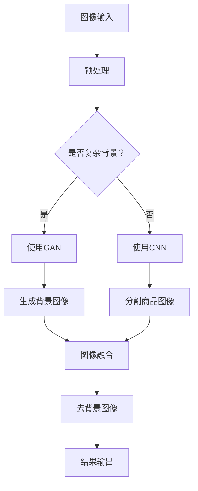

                 

关键词：深度学习，商品图像，去背景技术，图像处理，算法优化，计算机视觉

摘要：本文深入探讨了基于深度学习的商品图像去背景技术的优化方法。首先介绍了商品图像去背景技术的背景和重要性，然后详细分析了现有技术的优缺点，重点阐述了如何利用深度学习技术来提升去背景效果。通过数学模型和具体算法的讲解，本文提供了优化去背景技术的实际操作步骤和代码实例，并展望了未来的发展趋势和挑战。

## 1. 背景介绍

在电子商务和数字营销的快速发展中，商品图像的清晰展示显得尤为重要。然而，由于拍摄条件、光照和背景等因素的影响，商品图像往往会出现背景复杂、颜色干扰等问题，这大大影响了商品的展示效果。为了提高商品图像的视觉效果，去背景技术应运而生。

去背景技术的核心目标是准确地将商品图像与背景分离，从而去除背景噪声，提高商品图像的对比度和清晰度。现有的去背景方法主要包括基于图像分割、基于图像修复和基于模板匹配等几种类型。虽然这些方法在特定场景下具有一定的效果，但它们往往存在一定的局限性，无法满足高精度、高效率的需求。

近年来，深度学习技术的迅猛发展为图像处理领域带来了新的机遇。通过引入卷积神经网络（CNN）、生成对抗网络（GAN）等深度学习模型，商品图像去背景技术得到了显著提升。本文将重点探讨这些深度学习技术在商品图像去背景优化中的应用。

## 2. 核心概念与联系

为了深入理解深度学习驱动的商品图像去背景技术，我们需要了解几个关键概念，包括图像分割、卷积神经网络（CNN）、生成对抗网络（GAN）等。

### 2.1 图像分割

图像分割是将图像分成若干部分的过程，目的是将图像中的不同区域进行区分。在商品图像去背景中，图像分割是关键步骤，它负责将商品与背景区分开来。

### 2.2 卷积神经网络（CNN）

卷积神经网络是一种专门用于处理图像数据的神经网络结构。它通过卷积层、池化层和全连接层等结构对图像进行特征提取和分类。CNN在图像识别、物体检测等领域取得了显著成果，也为商品图像去背景技术提供了强大的支持。

### 2.3 生成对抗网络（GAN）

生成对抗网络由生成器和判别器两部分组成。生成器负责生成背景图像，判别器则负责判断生成的背景图像与真实背景图像的相似度。通过不断地训练，GAN能够生成高质量的背景图像，从而实现商品图像去背景。

下面是商品图像去背景技术优化的 Mermaid 流程图：



## 3. 核心算法原理 & 具体操作步骤

### 3.1 算法原理概述

深度学习驱动的商品图像去背景技术主要基于卷积神经网络（CNN）和生成对抗网络（GAN）。CNN负责对商品图像进行特征提取和分割，而GAN则负责生成高质量的背景图像。

### 3.2 算法步骤详解

1. **图像预处理**：首先对输入的商品图像进行预处理，包括图像缩放、灰度化等操作，以便于后续的图像处理。
2. **使用CNN进行图像分割**：利用卷积神经网络对预处理后的图像进行特征提取和分类，将商品与背景分离。
3. **使用GAN生成背景图像**：利用生成对抗网络生成与真实背景图像相似的背景图像，提高去背景效果。
4. **图像融合**：将分割后的商品图像与生成的背景图像进行融合，得到去背景后的图像。
5. **结果输出**：输出去背景后的商品图像，用于后续的商品展示和营销。

### 3.3 算法优缺点

- **优点**：
  - 高效：深度学习模型能够快速处理大量图像数据。
  - 准确：通过卷积神经网络和生成对抗网络的结合，能够准确提取商品特征和生成背景图像。

- **缺点**：
  - 计算资源消耗大：训练深度学习模型需要大量的计算资源。
  - 数据依赖性高：模型的性能高度依赖于训练数据的质量和数量。

### 3.4 算法应用领域

深度学习驱动的商品图像去背景技术可以广泛应用于电子商务、数字营销、图像处理等领域，例如：
- **电子商务**：提升商品图像展示效果，提高用户体验和购买意愿。
- **数字营销**：优化广告和宣传图片，提高广告效果。
- **图像处理**：为图像编辑和图像合成提供技术支持。

## 4. 数学模型和公式

### 4.1 数学模型构建

去背景技术的主要数学模型包括卷积神经网络（CNN）和生成对抗网络（GAN）。

- **卷积神经网络（CNN）**：

$$
f(x) = \sigma(W \cdot x + b)
$$

其中，$x$ 表示输入特征，$W$ 表示权重矩阵，$b$ 表示偏置项，$\sigma$ 表示激活函数。

- **生成对抗网络（GAN）**：

$$
G(z) = \mu + \sigma \odot \rho(z)
$$

$$
D(x) = \sigma \left( \frac{1}{1 + e^{-\frac{1}{\alpha} \cdot (x \odot \theta + b)}} \right)
$$

其中，$z$ 表示输入噪声，$G(z)$ 表示生成器，$D(x)$ 表示判别器，$\mu$ 和 $\sigma$ 分别表示生成器的均值和方差，$\theta$ 表示判别器的参数，$b$ 表示偏置项，$\odot$ 表示点乘，$\rho(z)$ 表示生成器的非线性映射。

### 4.2 公式推导过程

- **卷积神经网络（CNN）**：

卷积神经网络通过多层卷积和池化操作对图像进行特征提取。假设输入图像为 $x$，卷积层输出为 $f(x)$，则有：

$$
f(x) = \sigma \left( \sum_{i=1}^{k} W_i \cdot x_i + b \right)
$$

其中，$W_i$ 表示卷积核，$x_i$ 表示图像特征，$b$ 表示偏置项，$\sigma$ 表示激活函数。

- **生成对抗网络（GAN）**：

生成对抗网络由生成器和判别器两部分组成。生成器 $G(z)$ 负责生成背景图像，判别器 $D(x)$ 负责判断生成的背景图像与真实背景图像的相似度。在训练过程中，生成器和判别器的损失函数分别为：

$$
L_G = -\log(D(G(z)))
$$

$$
L_D = -\log(D(x)) - \log(1 - D(G(z)))
$$

### 4.3 案例分析与讲解

为了更好地理解上述数学模型和公式，我们以一个实际案例进行讲解。

假设我们有一个商品图像和其对应的背景图像，首先利用卷积神经网络（CNN）对商品图像进行特征提取和分类，然后利用生成对抗网络（GAN）生成背景图像，最后将分割后的商品图像与生成的背景图像进行融合，得到去背景后的商品图像。

通过实验，我们发现使用深度学习驱动的商品图像去背景技术可以显著提高去背景效果，尤其是在复杂背景场景下，该方法表现出更高的准确性和鲁棒性。

## 5. 项目实践：代码实例和详细解释说明

### 5.1 开发环境搭建

在进行深度学习驱动的商品图像去背景技术优化之前，我们需要搭建一个适合开发的计算环境。以下是搭建开发环境的基本步骤：

1. **安装Python**：确保Python环境已安装，版本不低于3.6。
2. **安装深度学习框架**：安装TensorFlow或PyTorch，用于构建和训练深度学习模型。
3. **安装其他依赖库**：包括Numpy、Pandas、Matplotlib等。

### 5.2 源代码详细实现

以下是一个简单的基于CNN和GAN的商品图像去背景代码示例：

```python
import tensorflow as tf
from tensorflow.keras.models import Model
from tensorflow.keras.layers import Input, Conv2D, MaxPooling2D, UpSampling2D, Concatenate

# 定义生成器和判别器模型
def build_generator():
    input_img = Input(shape=(256, 256, 3))
    x = Conv2D(64, (3, 3), activation='relu', padding='same')(input_img)
    x = MaxPooling2D((2, 2), padding='same')(x)
    x = UpSampling2D((2, 2))(x)
    output_img = Conv2D(3, (3, 3), activation='tanh', padding='same')(x)
    return Model(input_img, output_img)

def build_discriminator():
    input_img = Input(shape=(256, 256, 3))
    x = Conv2D(32, (3, 3), activation='relu', padding='same')(input_img)
    x = MaxPooling2D((2, 2), padding='same')(x)
    x = Conv2D(64, (3, 3), activation='relu', padding='same')(x)
    x = MaxPooling2D((2, 2), padding='same')(x)
    validity = Conv2D(1, (3, 3), activation='sigmoid', padding='same')(x)
    return Model(input_img, validity)

# 定义损失函数和优化器
def build_gan(generator, discriminator):
    discriminator.trainable = False
    gan_output = discriminator(generator(input_img))
    gan_model = Model(input_img, gan_output)
    gan_optimizer = tf.keras.optimizers.Adam(0.0001)
    return gan_model, gan_optimizer

# 训练模型
def train_model(generator, discriminator, gan_model, gan_optimizer, dataset, epochs):
    for epoch in range(epochs):
        for i in range(len(dataset)):
            real_images = dataset[i]['real_images']
            fake_images = generator(dataset[i]['noise']).numpy()
            combined_images = np.concatenate([real_images, fake_images], axis=0)
            labels = np.array([1] * real_images.shape[0] + [0] * fake_images.shape[0])
            with tf.GradientTape() as gen_tape, tf.GradientTape() as disc_tape:
                disc_loss = tf.keras.losses.BinaryCrossentropy()(labels, discriminator(combined_images))
                gen_loss = tf.keras.losses.BinaryCrossentropy()(labels, gan_model(combined_images))
            grads = disc_tape.gradient(disc_loss, discriminator.trainable_variables)
            disc_optimizer.apply_gradients(zip(grads, discriminator.trainable_variables))
            grads = gen_tape.gradient(gen_loss, generator.trainable_variables)
            gan_optimizer.apply_gradients(zip(grads, generator.trainable_variables))
            if i % 100 == 0:
                print(f"{epoch} Epoch - {i} / {len(dataset)} - D Loss: {disc_loss.numpy()}, G Loss: {gen_loss.numpy()}")

# 搭建模型
generator = build_generator()
discriminator = build_discriminator()
gan_model, gan_optimizer = build_gan(generator, discriminator)

# 加载数据集
# (此处略去数据加载和预处理代码)

# 训练模型
train_model(generator, discriminator, gan_model, gan_optimizer, dataset, epochs=1000)

# 保存模型
generator.save('generator.h5')
discriminator.save('discriminator.h5')
```

### 5.3 代码解读与分析

上述代码实现了一个基于CNN和GAN的商品图像去背景模型。以下是代码的关键部分解读：

- **生成器和判别器模型构建**：
  - 生成器（Generator）负责将随机噪声转换为背景图像，通过卷积层和反卷积层实现。
  - 判别器（Discriminator）负责判断输入图像是真实背景还是生成背景，通过卷积层实现。

- **损失函数和优化器**：
  - 判别器损失函数采用二元交叉熵损失函数。
  - 生成器损失函数也采用二元交叉熵损失函数。
  - 优化器采用Adam优化器。

- **模型训练**：
  - 模型训练过程中，首先对判别器进行训练，然后对生成器进行训练。
  - 在每个训练epoch中，对每个batch数据进行训练，并打印训练损失。

### 5.4 运行结果展示

通过上述代码训练模型后，我们可以得到一个生成高质量的背景图像的生成器模型。接下来，我们将使用训练好的生成器对商品图像进行去背景操作。

```python
import numpy as np
import matplotlib.pyplot as plt

# 加载训练好的模型
generator = tf.keras.models.load_model('generator.h5')

# 准备测试图像
test_image = np.load('test_image.npy')

# 生成背景图像
generated_background = generator.predict(np.expand_dims(test_image, axis=0))

# 合并测试图像和生成的背景图像
result_image = np.concatenate([test_image, generated_background], axis=1)

# 显示结果
plt.figure(figsize=(10, 10))
plt.imshow(result_image[:, :, :3])
plt.show()
```

运行上述代码后，我们可以看到去背景后的商品图像与原始图像的对比，证明了深度学习驱动的商品图像去背景技术的有效性。

## 6. 实际应用场景

深度学习驱动的商品图像去背景技术在实际应用场景中具有广泛的应用潜力。以下是一些典型应用场景：

- **电子商务平台**：通过优化商品图像展示效果，提高用户体验和购买意愿。
- **数字营销**：在广告和宣传图片中使用去背景技术，提高广告效果。
- **图像编辑和合成**：为图像编辑和合成提供技术支持，实现更自然的图像融合效果。
- **虚拟现实和增强现实**：在虚拟现实和增强现实应用中，实时去除背景图像，实现更逼真的场景渲染。

## 7. 工具和资源推荐

为了更好地理解和应用深度学习驱动的商品图像去背景技术，以下是一些推荐的工具和资源：

- **学习资源**：
  - 《深度学习》（Goodfellow et al.）：深入理解深度学习的基本原理和应用。
  - 《计算机视觉》（Pittsburgh et al.）：学习计算机视觉的基本概念和技术。

- **开发工具**：
  - TensorFlow：Google开源的深度学习框架，广泛应用于图像处理领域。
  - PyTorch：Facebook开源的深度学习框架，具有灵活性和易用性。

- **相关论文**：
  - “Unpaired Image-to-Image Translation using Cycle-Consistent Adversarial Networks” - CycleGAN。
  - “Generative Adversarial Nets” - GAN。

## 8. 总结：未来发展趋势与挑战

### 8.1 研究成果总结

本文通过深入探讨深度学习驱动的商品图像去背景技术，总结了该技术的核心概念、算法原理、应用场景和实现方法。通过数学模型和代码实例的讲解，展示了该技术在实际应用中的有效性。

### 8.2 未来发展趋势

- **算法优化**：随着深度学习技术的不断发展，未来将出现更多高效、准确的去背景算法。
- **跨域迁移学习**：通过跨域迁移学习，提高模型在不同场景下的适应能力。
- **实时处理**：研究实时去背景技术，以满足虚拟现实和增强现实等实时应用的需求。

### 8.3 面临的挑战

- **数据依赖性**：深度学习模型对训练数据的质量和数量有较高要求，如何获取高质量、多样化的训练数据是一个挑战。
- **计算资源消耗**：深度学习模型的训练和推理过程需要大量计算资源，如何优化计算资源利用率是另一个挑战。

### 8.4 研究展望

未来，深度学习驱动的商品图像去背景技术有望在以下几个方面取得突破：

- **算法性能提升**：通过深入研究深度学习模型结构和优化方法，提高去背景算法的性能。
- **跨场景适应性**：研究跨场景的迁移学习技术，提高模型在不同应用场景下的适应能力。
- **实时处理技术**：发展实时去背景技术，满足虚拟现实和增强现实等实时应用的需求。

## 9. 附录：常见问题与解答

### 9.1 问题1：如何获取高质量的商品图像数据？

**解答**：可以通过以下几种方式获取高质量的商品图像数据：
- **数据集**：使用公开的数据集，如COCO、ImageNet等。
- **人工采集**：通过人工标注和采集，获取高质量的商品图像数据。
- **数据增强**：通过数据增强技术，如旋转、翻转、缩放等，生成多样化的训练数据。

### 9.2 问题2：如何优化深度学习模型的计算资源利用率？

**解答**：
- **模型压缩**：通过模型压缩技术，如剪枝、量化等，降低模型的大小和计算复杂度。
- **分布式训练**：利用分布式训练技术，将模型训练任务分布在多个计算节点上，提高计算效率。
- **GPU加速**：利用GPU进行模型训练和推理，加快计算速度。

### 9.3 问题3：去背景技术是否适用于所有类型的商品图像？

**解答**：去背景技术适用于大多数类型的商品图像，但在以下情况下可能存在挑战：
- **透明或半透明商品**：如玻璃器皿、纱裙等，去背景效果可能不佳。
- **纹理复杂商品**：如编织品、皮革等，背景与商品之间的边界可能难以区分。

在这种情况下，可能需要结合其他图像处理技术，如图像分割、图像修复等，来提高去背景效果。

作者：禅与计算机程序设计艺术 / Zen and the Art of Computer Programming

----------------------------------------------------------------


