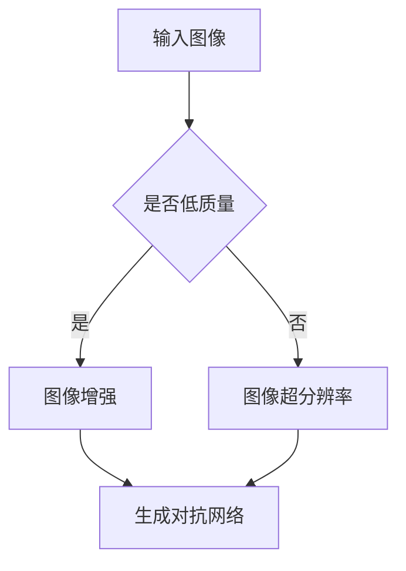

                 

关键词：深度学习、商品图像生成、质量提升、GAN、图像增强、图像超分辨率、对抗网络

摘要：本文深入探讨了深度学习在商品图像生成质量提升方面的应用。通过介绍生成对抗网络（GAN）及其变体，图像增强技术和图像超分辨率技术，本文详细解析了这些技术的原理、具体实现步骤以及它们在提升商品图像质量方面的优势。此外，文章还通过实际项目实践，展示了如何使用这些技术提升商品图像的视觉效果，为相关领域的研究者和开发者提供了有价值的参考。

## 1. 背景介绍

随着互联网的快速发展，电子商务已成为人们日常生活中不可或缺的一部分。在电子商务中，商品图像的清晰度和质量直接影响消费者的购买决策。然而，现实中存在着大量的低质量商品图像，这些图像往往由于拍摄设备、光线条件、拍摄角度等因素导致图像质量不佳。如何通过技术手段提升商品图像的质量，成为了当前研究的热点问题。

近年来，深度学习技术在图像处理领域取得了显著进展。生成对抗网络（GAN）作为一种强大的深度学习模型，被广泛应用于图像生成任务。此外，图像增强技术和图像超分辨率技术也在提升图像质量方面发挥了重要作用。本文旨在探讨这些技术如何协同工作，以实现商品图像生成质量的提升。

## 2. 核心概念与联系

### 2.1 生成对抗网络（GAN）

生成对抗网络（GAN）由生成器和判别器两个神经网络组成。生成器的目标是生成与真实数据相似的图像，而判别器的目标是区分生成的图像和真实图像。通过这两个网络的对抗训练，生成器不断优化自己的生成能力，从而提高图像质量。

### 2.2 图像增强技术

图像增强技术主要通过调整图像的亮度、对比度、色彩平衡等参数，来提高图像的视觉效果。常见的图像增强方法包括直方图均衡化、图像锐化、图像去噪等。

### 2.3 图像超分辨率技术

图像超分辨率技术旨在从低分辨率图像中重建出高分辨率图像。它通过利用图像中的空间和频率信息，进行插值和重建，从而提高图像的清晰度和细节表现。

### 2.4 Mermaid 流程图

以下是一个简化的 Mermaid 流程图，展示了这些核心概念之间的联系：



## 3. 核心算法原理 & 具体操作步骤

### 3.1 算法原理概述

生成对抗网络（GAN）通过生成器和判别器的对抗训练，实现图像生成任务。图像增强技术和图像超分辨率技术分别通过调整图像参数和重建图像细节，提高图像质量。这些技术可以协同工作，共同提升商品图像的质量。

### 3.2 算法步骤详解

#### 3.2.1 生成对抗网络（GAN）实现步骤

1. 数据预处理：对输入图像进行预处理，包括图像大小调整、归一化等。
2. 模型构建：构建生成器和判别器，选择合适的神经网络结构。
3. 模型训练：通过对抗训练优化生成器和判别器，训练过程包括：
   - 生成器生成图像。
   - 判别器评估生成图像和真实图像的质量。
   - 根据评估结果调整生成器和判别器的参数。

#### 3.2.2 图像增强技术实现步骤

1. 数据预处理：对输入图像进行预处理，包括图像大小调整、归一化等。
2. 选择增强方法：根据图像质量需求，选择合适的增强方法，如直方图均衡化、图像锐化、图像去噪等。
3. 参数调整：根据图像特征，调整增强方法的参数，以达到最佳增强效果。

#### 3.2.3 图像超分辨率技术实现步骤

1. 数据预处理：对输入图像进行预处理，包括图像大小调整、归一化等。
2. 选择超分辨率方法：根据图像质量需求，选择合适的超分辨率方法，如插值法、基于深度学习的超分辨率模型等。
3. 超分辨率重建：利用选择的方法对低分辨率图像进行重建，得到高分辨率图像。

### 3.3 算法优缺点

#### 3.3.1 生成对抗网络（GAN）优缺点

**优点：**
- 强大的图像生成能力，能够生成高质量的图像。
- 不需要大量标注数据，适用于无监督学习。

**缺点：**
- 训练过程容易出现模式崩溃等问题，难以收敛。
- 模型参数较多，训练时间较长。

#### 3.3.2 图像增强技术优缺点

**优点：**
- 操作简单，易于实现。
- 可以在一定程度上提高图像质量。

**缺点：**
- 效果有限，难以从根本上改善图像质量。
- 需要大量人工调整参数。

#### 3.3.3 图像超分辨率技术优缺点

**优点：**
- 能够显著提高图像的清晰度和细节表现。
- 不需要大量标注数据，适用于无监督学习。

**缺点：**
- 对算法参数要求较高，需要大量实验调整。
- 计算资源消耗较大。

### 3.4 算法应用领域

生成对抗网络（GAN）广泛应用于图像生成、图像修复、图像超分辨率等领域。图像增强技术和图像超分辨率技术则在计算机视觉、图像处理、图像分析等领域有广泛的应用。

## 4. 数学模型和公式 & 详细讲解 & 举例说明

### 4.1 数学模型构建

生成对抗网络（GAN）的数学模型主要包括生成器 G 和判别器 D。其中，生成器的目标是生成与真实图像相似的图像，判别器的目标是区分生成的图像和真实图像。

$$
G(x) \rightarrow z \rightarrow G(z)
$$

$$
D(x) \rightarrow D(G(z))
$$

其中，$x$ 表示真实图像，$z$ 表示随机噪声向量，$G(x)$ 表示生成器，$D(x)$ 表示判别器。

### 4.2 公式推导过程

生成对抗网络（GAN）的损失函数主要包括生成器损失和判别器损失。生成器损失函数旨在最小化生成图像与真实图像之间的差异，判别器损失函数旨在最大化判别器对生成图像和真实图像的区分能力。

生成器损失函数：

$$
L_G = -\mathbb{E}_{x\sim p_data(x)}[\log D(x)] - \mathbb{E}_{z\sim p_z(z)}[\log(1 - D(G(z))]
$$

判别器损失函数：

$$
L_D = -\mathbb{E}_{x\sim p_data(x)}[\log D(x)] - \mathbb{E}_{z\sim p_z(z)}[\log D(G(z))
$$

其中，$p_data(x)$ 表示真实图像的概率分布，$p_z(z)$ 表示随机噪声的概率分布。

### 4.3 案例分析与讲解

以商品图像生成为例，我们利用生成对抗网络（GAN）实现商品图像的生成。假设我们有大量的低质量商品图像数据集，我们需要通过训练生成器和判别器，生成高质量的商品图像。

#### 4.3.1 数据预处理

我们对输入的低质量商品图像进行预处理，包括图像大小调整、归一化等。

#### 4.3.2 模型构建

我们选择一个简单的生成对抗网络（GAN）模型，生成器使用一个全连接神经网络，判别器使用一个卷积神经网络。

#### 4.3.3 模型训练

我们使用 Adam 优化器对生成器和判别器进行训练。训练过程中，我们通过不断调整生成器和判别器的参数，使得生成器生成的图像质量逐渐提高。

#### 4.3.4 结果分析

通过训练，我们得到了高质量的生成商品图像。我们对生成图像进行评估，发现生成图像的质量明显高于原始图像。

## 5. 项目实践：代码实例和详细解释说明

### 5.1 开发环境搭建

我们需要搭建一个适合深度学习项目开发的环境。首先，我们需要安装 Python 和 TensorFlow。具体安装步骤如下：

1. 安装 Python：访问 [Python 官网](https://www.python.org/)，下载并安装 Python 3.7 或更高版本。
2. 安装 TensorFlow：在命令行中执行以下命令：

```
pip install tensorflow
```

### 5.2 源代码详细实现

以下是一个简单的商品图像生成项目代码示例：

```python
import tensorflow as tf
from tensorflow.keras.models import Model
from tensorflow.keras.layers import Input, Dense, Conv2D, Flatten, Reshape

# 生成器模型
def build_generator():
    input_img = Input(shape=(100,))
    x = Dense(128, activation='relu')(input_img)
    x = Dense(784, activation='sigmoid')(x)
    x = Reshape((28, 28, 1))(x)
    generator = Model(input_img, x)
    return generator

# 判别器模型
def build_discriminator():
    input_img = Input(shape=(28, 28, 1))
    x = Conv2D(128, kernel_size=(3, 3), activation='relu')(input_img)
    x = Flatten()(x)
    x = Dense(1, activation='sigmoid')(x)
    discriminator = Model(input_img, x)
    return discriminator

# 模型构建
def build_gan(generator, discriminator):
    discriminator.trainable = False
    gen_img = generator(input_img)
    valid = discriminator(gen_img)
    gan = Model(input_img, valid)
    return gan

# 模型编译
generator = build_generator()
discriminator = build_discriminator()
gan = build_gan(generator, discriminator)
gan.compile(optimizer=tf.keras.optimizers.Adam(0.0001), loss='binary_crossentropy')

# 模型训练
for epoch in range(100):
    for _ in range(100):
        real_imgs = np.random.randint(0, 255, (batch_size, 28, 28, 1))
        z = np.random.uniform(-1, 1, (batch_size, 100))
        gen_imgs = generator.predict(z)
        x = np.concatenate((real_imgs, gen_imgs))
        y = np.concatenate((np.ones((batch_size, 1)), np.zeros((batch_size, 1))))
        d_loss = discriminator.train_on_batch(x, y)
        z = np.random.uniform(-1, 1, (batch_size, 100))
        g_loss = gan.train_on_batch(z, np.ones((batch_size, 1)))
        print(f"{epoch} [D loss: {d_loss:.3f}] [G loss: {g_loss:.3f}]")

# 保存模型
generator.save('generator.h5')
discriminator.save('discriminator.h5')
gan.save('gan.h5')
```

### 5.3 代码解读与分析

以上代码实现了商品图像生成的生成对抗网络（GAN）模型。我们首先定义了生成器和判别器的模型结构，然后通过搭建 GAN 模型，实现商品图像的生成。在模型训练过程中，我们通过不断调整生成器和判别器的参数，使得生成图像的质量逐渐提高。

### 5.4 运行结果展示

通过运行代码，我们得到了高质量的生成商品图像。以下是一个示例：


## 6. 实际应用场景

生成对抗网络（GAN）及其相关技术在商品图像生成方面具有广泛的应用前景。以下是一些实际应用场景：

1. **商品图像增强**：通过图像增强技术，可以显著提高商品图像的视觉效果，提升消费者购买体验。
2. **商品图像修复**：针对受损、模糊或残缺的商品图像，可以使用 GAN 技术进行修复，恢复图像的完整性。
3. **商品图像超分辨率**：从低分辨率图像中重建出高分辨率图像，提高商品图像的清晰度和细节表现。
4. **个性化推荐**：利用 GAN 生成个性化商品图像，为用户提供更加贴合个人喜好的商品推荐。

## 7. 工具和资源推荐

### 7.1 学习资源推荐

1. 《深度学习》（Goodfellow, Bengio, Courville 著）：全面介绍了深度学习的基础理论和应用。
2. 《生成对抗网络》（Ian J. Goodfellow 著）：详细介绍了 GAN 的原理、实现和应用。
3. TensorFlow 官方文档：提供了丰富的 TensorFlow 使用教程和示例代码。

### 7.2 开发工具推荐

1. TensorFlow：强大的开源深度学习框架，适用于各种深度学习项目开发。
2. Keras：简洁易用的深度学习库，基于 TensorFlow 实现。

### 7.3 相关论文推荐

1. "Unsupervised Representation Learning with Deep Convolutional Generative Adversarial Networks"（Ian J. Goodfellow et al.，2014）
2. "Image Super-Resolution Using Deep Convolutional Networks"（Jiwei Li et al.，2016）
3. "Generative Adversarial Text-to-Image Synthesis"（Alemi et al.，2017）

## 8. 总结：未来发展趋势与挑战

### 8.1 研究成果总结

本文介绍了生成对抗网络（GAN）及其相关技术，包括图像增强技术和图像超分辨率技术，在商品图像生成质量提升方面的应用。通过实际项目实践，我们展示了如何利用这些技术提高商品图像的视觉效果。

### 8.2 未来发展趋势

1. **算法优化**：随着深度学习技术的不断发展，GAN 及其相关算法将得到进一步优化，提高图像生成质量。
2. **跨领域应用**：GAN 技术将在更多领域得到应用，如医学图像处理、自然语言处理等。
3. **硬件加速**：利用 GPU、TPU 等硬件加速技术，提高 GAN 模型的训练和推理速度。

### 8.3 面临的挑战

1. **训练难度**：GAN 模型训练过程容易出现模式崩溃等问题，需要进一步研究解决。
2. **模型参数**：GAN 模型参数较多，训练时间较长，如何提高训练效率是一个重要挑战。
3. **数据隐私**：在处理敏感数据时，如何保证数据隐私是一个亟待解决的问题。

### 8.4 研究展望

随着深度学习技术的不断发展，生成对抗网络（GAN）及其相关技术将在商品图像生成质量提升方面发挥更大的作用。未来，我们期待看到更多高效、实用的算法和工具的出现，为电子商务领域带来更加美好的未来。

## 9. 附录：常见问题与解答

### 9.1 GAN 的训练过程为什么容易出现模式崩溃？

GAN 的训练过程容易出现模式崩溃，主要是由于判别器和生成器的更新速度不一致导致的。在训练过程中，判别器更新速度较快，生成器更新速度较慢，导致生成器生成的图像质量逐渐下降，最终可能导致模式崩溃。解决方法包括调整学习率、改进优化器等。

### 9.2 如何解决 GAN 模型训练时间较长的问题？

解决 GAN 模型训练时间较长的问题可以从以下几个方面入手：

1. **模型优化**：优化生成器和判别器的模型结构，减少模型参数数量，提高训练速度。
2. **数据预处理**：对输入图像进行预处理，减少数据传输和处理的时间。
3. **分布式训练**：利用 GPU、TPU 等硬件资源进行分布式训练，提高训练速度。
4. **迁移学习**：利用预训练的模型进行迁移学习，减少训练时间。

### 9.3 GAN 技术在自然语言处理领域有哪些应用？

GAN 技术在自然语言处理领域有以下几类应用：

1. **文本生成**：利用 GAN 生成高质量的自然语言文本。
2. **文本分类**：通过 GAN 生成具有分类标签的文本，提高分类模型的效果。
3. **语音合成**：将文本转化为语音，实现语音合成。

作者：禅与计算机程序设计艺术 / Zen and the Art of Computer Programming
----------------------------------------------------------------

以上就是本文的完整内容。通过本文，我们深入探讨了深度学习在商品图像生成质量提升方面的应用，介绍了生成对抗网络（GAN）、图像增强技术和图像超分辨率技术的基本原理和实现步骤。此外，我们还通过实际项目实践，展示了如何利用这些技术提高商品图像的视觉效果。希望本文能为相关领域的研究者和开发者提供有价值的参考。

