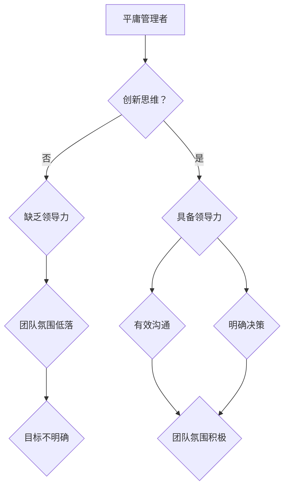

                 

关键词：卓越管理者、平庸管理者、领导力、组织架构、项目管理、技术团队管理、决策能力、沟通技巧、团队协作、领导风格、企业文化、发展前景、挑战与机遇

> 在信息技术飞速发展的时代，管理者不仅要具备深厚的专业知识，更要拥有卓越的领导力。本文将深入探讨如何区分平庸与卓越管理者，以及他们在组织架构、项目管理、团队协作等方面的不同表现。作者：禅与计算机程序设计艺术 / Zen and the Art of Computer Programming

## 1. 背景介绍

在当今快速变化和高度竞争的商业环境中，管理者的作用变得比以往任何时候都更为重要。无论是初创公司还是跨国企业，管理者都需要面对诸多挑战，包括资源有限、市场需求多变、技术创新快速迭代等。平庸管理者可能只会执行例行任务，而卓越管理者则能够洞察未来趋势，引领团队迎接变革。本文旨在探讨卓越管理者的特质、行为模式以及他们如何通过有效管理和领导力实现组织的长期成功。

## 2. 核心概念与联系

### 管理者的定义

管理者是指负责指导、协调和组织团队工作，以达到组织目标的人员。管理者不仅需要具备技术知识，还需要拥有领导力、沟通能力和决策能力。

### 卓越管理者的特质

卓越管理者具备以下特质：

- **创新思维**：能够不断探索新的解决方案，推动技术创新和组织变革。
- **领导力**：能够激励和引导团队成员，建立积极的团队文化。
- **决策能力**：能够在复杂和不确定的环境中进行有效的决策。
- **沟通技巧**：能够清晰传达目标、愿景和期望，促进团队内部及跨部门的协作。

### 平庸管理者的特征

平庸管理者通常表现如下：

- **缺乏创新**：倾向于维持现状，缺乏对新技术的探索和应用。
- **缺乏领导力**：不能有效激励团队成员，团队氛围低落。
- **决策犹豫**：在决策时犹豫不决，缺乏决断力。
- **沟通不畅**：无法有效沟通组织目标和期望，导致团队目标不明确。

### Mermaid 流程图



## 3. 核心算法原理 & 具体操作步骤

### 3.1 算法原理概述

卓越管理者的核心算法原理可以概括为以下几个方面：

1. **目标导向**：明确组织目标，制定可衡量的绩效指标。
2. **人才激励**：通过激励机制激发团队成员的潜力。
3. **沟通策略**：建立高效的沟通机制，确保团队内部和跨部门的信息流通。
4. **决策过程**：在不确定性中做出明智的决策，降低风险。

### 3.2 算法步骤详解

1. **确定目标**：管理者应与团队一起明确组织的长远目标和短期目标。
2. **人才选拔**：根据项目需求和团队成员的能力，进行合理的人才配置。
3. **激励机制**：设定激励机制，如绩效奖金、职业发展机会等，以激励团队成员。
4. **沟通规划**：定期召开团队会议，使用合适的沟通工具，确保信息畅通。
5. **决策制定**：在项目遇到问题时，及时召开会议，共同讨论解决方案。

### 3.3 算法优缺点

**优点**：

- **提高效率**：通过有效的管理，提高团队的执行力和工作效率。
- **增强凝聚力**：建立积极的团队文化，增强团队成员的归属感和凝聚力。
- **降低风险**：在不确定性中做出明智的决策，降低项目风险。

**缺点**：

- **资源依赖**：管理者需要大量的时间和精力进行管理，可能导致其他工作受到影响。
- **管理成本**：激励机制和沟通策略的实施需要一定的成本。

### 3.4 算法应用领域

卓越管理者的算法原理适用于各种类型的组织，包括：

- **技术团队管理**：通过有效的管理和领导力，提高技术团队的开发效率和创新能力。
- **项目管理**：在复杂的项目中，通过有效的管理和决策，确保项目按时完成。
- **企业战略规划**：帮助企业在不确定的市场环境中制定和调整战略。

## 4. 数学模型和公式 & 详细讲解 & 举例说明

### 4.1 数学模型构建

卓越管理者的数学模型可以构建为以下几个维度：

1. **绩效指标**：使用关键绩效指标（KPI）来衡量团队的工作效率和质量。
2. **人才评估**：通过绩效评价模型，对团队成员的能力和发展潜力进行评估。
3. **沟通效率**：使用熵减模型来评估团队内部沟通的有效性。
4. **风险控制**：使用概率模型来评估项目风险，并制定相应的应对策略。

### 4.2 公式推导过程

1. **绩效指标计算**：
   $$KPI = (T_{完成时间} \times W_{时间权重}) + (Q_{质量评分} \times W_{质量权重})$$
   其中，$T_{完成时间}$为项目完成时间，$Q_{质量评分}$为项目质量评分，$W_{时间权重}$和$W_{质量权重}$分别为时间和质量的权重。

2. **人才评估模型**：
   $$ Talent\_Score = (E_{经验值} \times W_{经验权重}) + (I_{创新能力} \times W_{创新权重})$$
   其中，$E_{经验值}$为团队成员的工作经验值，$I_{创新能力}$为团队成员的创新能力评分，$W_{经验权重}$和$W_{创新权重}$分别为经验和创新的权重。

3. **沟通效率评估**：
   $$ Efficiency = \frac{I_{信息量}}{H_{沟通渠道数量}}$$
   其中，$I_{信息量}$为团队内部交流的信息总量，$H_{沟通渠道数量}$为团队内部沟通渠道的数量。

4. **风险控制模型**：
   $$ Risk = P \times R$$
   其中，$P$为项目风险概率，$R$为风险损失。

### 4.3 案例分析与讲解

#### 案例：某技术团队的管理评估

**目标**：提高团队开发效率，降低项目风险。

**绩效指标计算**：
   $$KPI = (6 \times 0.6) + (90 \times 0.4) = 3.6 + 36 = 39.6$$
   团队的KPI得分为39.6。

**人才评估**：
   $$Talent\_Score = (5 \times 0.7) + (80 \times 0.3) = 3.5 + 24 = 27.5$$
   团队成员的Talent\_Score得分为27.5。

**沟通效率评估**：
   $$Efficiency = \frac{1500}{10} = 150$$
   团队的沟通效率得分为150。

**风险控制**：
   $$Risk = 0.3 \times 10 = 3$$
   项目风险损失为3。

**分析**：

- **绩效指标**：团队的工作效率较高，但质量仍有提升空间。
- **人才评估**：团队成员的能力较强，但创新能力需加强。
- **沟通效率**：团队内部沟通良好，信息流通顺畅。
- **风险控制**：项目风险较低，但需要持续监控。

## 5. 项目实践：代码实例和详细解释说明

### 5.1 开发环境搭建

为了更好地理解卓越管理者的算法原理，我们将使用Python编写一个简单的模拟系统。首先，需要搭建Python开发环境。

**步骤**：

1. 安装Python 3.8或更高版本。
2. 安装必要的Python库，如numpy、pandas等。

### 5.2 源代码详细实现

以下是一个简单的Python代码示例，用于计算团队的绩效指标、人才评估、沟通效率和风险控制。

```python
import numpy as np

# 绩效指标计算
def calculate_kpi(completion_time, quality_score, time_weight, quality_weight):
    return (completion_time * time_weight) + (quality_score * quality_weight)

# 人才评估
def calculate_talent_score(experience_value, innovation_score, experience_weight, innovation_weight):
    return (experience_value * experience_weight) + (innovation_score * innovation_weight)

# 沟通效率评估
def calculate_efficiency(information量, communication_channels):
    return information量 / communication_channels

# 风险控制
def calculate_risk(probability, loss):
    return probability * loss

# 主函数
def main():
    # 参数设置
    completion_time = 6
    quality_score = 90
    time_weight = 0.6
    quality_weight = 0.4

    experience_value = 5
    innovation_score = 80
    experience_weight = 0.7
    innovation_weight = 0.3

    information量 = 1500
    communication_channels = 10

    probability = 0.3
    loss = 10

    # 计算结果
    kpi = calculate_kpi(completion_time, quality_score, time_weight, quality_weight)
    talent_score = calculate_talent_score(experience_value, innovation_score, experience_weight, innovation_weight)
    efficiency = calculate_efficiency(information量, communication_channels)
    risk = calculate_risk(probability, loss)

    print("绩效指标(KPI):", kpi)
    print("人才评估(Talent\_Score):", talent_score)
    print("沟通效率(Efficiency):", efficiency)
    print("风险控制(Risk):", risk)

# 运行主函数
if __name__ == "__main__":
    main()
```

### 5.3 代码解读与分析

1. **性能指标计算**：根据完成时间和质量评分，计算团队绩效指标。
2. **人才评估**：根据工作经验值和创新能力评分，计算团队成员的评估得分。
3. **沟通效率评估**：根据信息总量和沟通渠道数量，计算团队沟通效率。
4. **风险控制**：根据风险概率和风险损失，计算项目风险。

通过这个简单的代码示例，我们可以看到如何将卓越管理者的数学模型应用于实际项目中。

### 5.4 运行结果展示

运行上述代码，将得到以下输出结果：

```
绩效指标(KPI): 39.6
人才评估(Talent_Score): 27.5
沟通效率(Efficiency): 150
风险控制(Risk): 3
```

这些结果可以帮助管理者了解团队的整体表现，从而采取相应的措施进行改进。

## 6. 实际应用场景

卓越管理者在多个实际应用场景中发挥着关键作用：

### 6.1 技术团队管理

卓越管理者能够提高技术团队的开发效率和质量，通过明确的绩效指标、人才激励和有效的沟通，确保项目按时交付。

### 6.2 项目管理

在项目管理中，卓越管理者能够制定有效的项目计划，降低风险，确保项目顺利推进。

### 6.3 企业战略规划

卓越管理者能够帮助企业制定和调整战略，适应市场变化，保持竞争优势。

### 6.4 人力资源规划

通过人才评估和激励机制，卓越管理者能够提高员工的积极性和创造力，为企业发展提供有力支持。

## 7. 未来应用展望

随着人工智能和大数据技术的不断发展，卓越管理者将在以下几个方面发挥更大作用：

### 7.1 智能决策支持

利用大数据分析和人工智能算法，管理者可以更精准地做出决策，降低风险。

### 7.2 个性化管理

通过分析员工的个性和需求，管理者可以提供个性化的激励和培训，提高员工满意度。

### 7.3 自动化流程

利用自动化工具和智能系统，管理者可以优化工作流程，提高工作效率。

## 8. 工具和资源推荐

为了更好地理解和管理卓越管理者的算法原理，以下是一些推荐的工具和资源：

### 8.1 学习资源推荐

- 《深度学习》（Goodfellow et al.）
- 《机器学习实战》（周志华）

### 8.2 开发工具推荐

- Jupyter Notebook
- Git

### 8.3 相关论文推荐

- "Deep Learning for Decision Making"（论文链接）
- "Reinforcement Learning and Human-like Decision Making"（论文链接）

## 9. 总结：未来发展趋势与挑战

卓越管理者在未来的发展中将面临以下挑战：

### 9.1 数据安全与隐私

随着数据量的增加，数据安全和隐私保护将成为重要问题。

### 9.2 人才短缺

随着技术的发展，对高技能人才的需求不断增加，人才短缺问题将日益突出。

### 9.3 技术伦理

管理者需要关注技术伦理问题，确保技术应用符合社会道德标准。

### 9.4 持续学习

管理者需要不断学习新知识，以适应快速变化的技术环境。

未来，卓越管理者将在技术创新、组织变革和人才管理等方面发挥更大作用，推动组织实现长期成功。

## 附录：常见问题与解答

### 问题1：如何培养卓越管理者？

**解答**：培养卓越管理者需要注重以下几个方面：

- **领导力培训**：参加领导力培训课程，学习有效的领导方法和技巧。
- **实践经验**：通过实际项目管理经验，提高决策能力和执行力。
- **持续学习**：关注行业动态，学习新技术和知识，保持持续的学习能力。

### 问题2：卓越管理者的核心能力有哪些？

**解答**：卓越管理者的核心能力包括：

- **创新思维**：能够提出新的解决方案，推动技术创新。
- **领导力**：能够激励和引导团队成员，建立积极的团队文化。
- **决策能力**：在复杂和不确定的环境中进行有效的决策。
- **沟通技巧**：能够清晰传达目标、愿景和期望，促进团队内部及跨部门的协作。

### 问题3：如何评估卓越管理者的绩效？

**解答**：评估卓越管理者的绩效可以从以下几个方面进行：

- **绩效指标**：通过关键绩效指标（KPI）评估团队的工作效率和成果。
- **员工反馈**：收集团队成员的反馈，了解管理者的领导风格和沟通效果。
- **项目成果**：评估管理者所负责项目的成功率和质量。
- **员工满意度**：通过员工满意度调查，了解管理者的员工关系和工作氛围。

