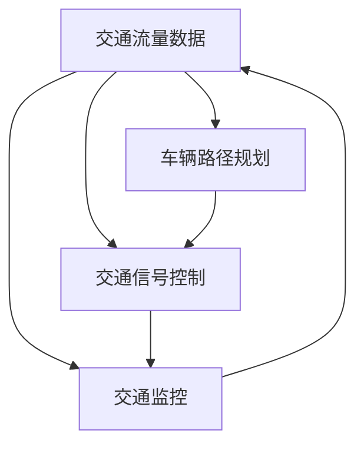

                 

### 1. 背景介绍

随着城市化进程的加快，交通拥堵问题已经成为全球各大城市面临的严峻挑战。为了应对这一挑战，智能交通系统（Intelligent Transportation Systems, ITS）逐渐成为研究热点。智能交通系统利用先进的信息通信技术、传感器技术和数据分析技术，实现交通的实时监测、信息交互和智能调控，从而提高交通效率，减少交通事故，改善空气质量，提升城市整体运行效能。

近年来，随着人工智能技术的快速发展，智能交通系统的研究和应用也在不断深入。人工智能技术在交通流量预测、车辆路径规划、交通信号控制、车辆监控等方面取得了显著成果。然而，智能交通系统的实现仍面临诸多挑战，如数据质量、算法效率、系统稳定性等。

为了促进智能交通系统领域的研究和应用，滴滴出行在2024年推出了一场针对校招智能交通系统工程师的算法挑战赛。此次比赛旨在鼓励更多优秀年轻人参与到智能交通系统的研发中，为解决交通拥堵问题提供新的思路和方法。

### 2. 核心概念与联系

智能交通系统涉及多个核心概念，包括交通流量、车辆路径规划、交通信号控制和交通监控等。这些概念之间存在着紧密的联系，共同构成了智能交通系统的技术架构。

#### 2.1 交通流量

交通流量是指单位时间内通过某一交通节点的车辆数量。交通流量数据是智能交通系统的基础数据，用于分析交通状况、预测交通流量变化和优化交通信号控制策略。交通流量数据可以通过安装在道路上的传感器、摄像头和雷达等设备实时采集。

#### 2.2 车辆路径规划

车辆路径规划是指为车辆选择一条最优路径，以减少行驶时间和油耗。路径规划算法包括最短路径算法、最速下降算法、遗传算法等。车辆路径规划是智能交通系统中的重要功能，可以提高交通效率和减少交通拥堵。

#### 2.3 交通信号控制

交通信号控制是指通过调节交通信号灯的时序，优化交通流量和缓解交通拥堵。交通信号控制算法包括基于流量数据的动态控制算法和基于交通状态的固定控制算法。动态控制算法可以根据实时交通流量数据调整信号灯时序，提高交通效率。

#### 2.4 交通监控

交通监控是指对交通状况进行实时监测和数据分析，以了解交通状况和发现潜在问题。交通监控可以通过安装在道路上的传感器、摄像头和雷达等设备实现。交通监控数据可用于交通流量预测、交通事故预警和交通信号控制优化等。

#### 2.5 Mermaid 流程图

为了更清晰地展示智能交通系统的核心概念和联系，我们可以使用 Mermaid 流程图进行描述。



### 3. 核心算法原理 & 具体操作步骤

#### 3.1 算法原理概述

滴滴2024校招智能交通系统工程师算法挑战赛的核心算法主要包括交通流量预测、车辆路径规划和交通信号控制。这些算法的实现需要结合多种技术和方法，包括数据挖掘、机器学习和深度学习等。

#### 3.2 算法步骤详解

##### 3.2.1 交通流量预测

交通流量预测是智能交通系统的基础，用于预测未来一段时间内交通节点的车辆数量。交通流量预测算法通常分为以下步骤：

1. 数据采集：采集历史交通流量数据、道路状况数据、天气数据等。
2. 数据预处理：对采集到的数据进行分析和处理，包括数据清洗、归一化和特征提取等。
3. 模型选择：选择合适的预测模型，如线性回归、支持向量机、神经网络等。
4. 模型训练：使用历史数据对模型进行训练，得到预测参数。
5. 预测：使用训练好的模型对未来的交通流量进行预测。

##### 3.2.2 车辆路径规划

车辆路径规划是指为车辆选择一条最优路径，以减少行驶时间和油耗。车辆路径规划算法通常分为以下步骤：

1. 节点生成：根据起点和终点生成所有可能的路径节点。
2. 节点评估：对生成的节点进行评估，包括距离、交通拥堵程度、道路状况等。
3. 路径选择：选择最优路径，通常使用贪心算法、A*算法等。
4. 路径优化：对选择的路径进行优化，以进一步减少行驶时间和油耗。

##### 3.2.3 交通信号控制

交通信号控制是指通过调节交通信号灯的时序，优化交通流量和缓解交通拥堵。交通信号控制算法通常分为以下步骤：

1. 交通流量预测：使用交通流量预测算法预测未来一段时间内的交通流量。
2. 策略选择：选择合适的交通信号控制策略，如固定时序控制、自适应控制等。
3. 信号灯时序调整：根据交通流量预测结果和策略，调整交通信号灯的时序。
4. 实时监控：对交通信号灯的运行效果进行实时监控，根据监控结果调整信号灯时序。

#### 3.3 算法优缺点

##### 3.3.1 交通流量预测

交通流量预测算法的优点包括：

- 能够预测未来一段时间内的交通流量，为交通管理和调控提供依据。
- 能够为车辆路径规划和交通信号控制提供数据支持。

缺点包括：

- 预测结果容易受到外部因素的影响，如天气、突发事件等。
- 数据采集和处理过程复杂，对算法性能要求较高。

##### 3.3.2 车辆路径规划

车辆路径规划算法的优点包括：

- 能够为车辆选择最优路径，减少行驶时间和油耗。
- 能够提高交通效率，缓解交通拥堵。

缺点包括：

- 在实时性要求较高的场景下，算法性能可能受到影响。
- 需要大量的道路状况数据支持，数据采集和处理过程复杂。

##### 3.3.3 交通信号控制

交通信号控制算法的优点包括：

- 能够优化交通流量，缓解交通拥堵。
- 能够根据实时交通状况调整信号灯时序，提高交通效率。

缺点包括：

- 在交通流量变化较大的场景下，算法性能可能受到影响。
- 需要实时监控交通状况，对系统硬件和软件性能要求较高。

#### 3.4 算法应用领域

滴滴2024校招智能交通系统工程师算法挑战赛的核心算法在多个领域具有广泛的应用：

- 城市交通管理：通过交通流量预测和车辆路径规划，优化城市交通管理，提高交通效率。
- 智能驾驶：通过车辆路径规划和交通信号控制，提高自动驾驶车辆的安全性和舒适性。
- 公共交通：通过交通流量预测和交通信号控制，优化公共交通运行效率，提高乘客体验。
- 智慧城市：通过智能交通系统的建设，提升城市整体运行效能，实现智慧城市的目标。

### 4. 数学模型和公式 & 详细讲解 & 举例说明

智能交通系统中的数学模型和公式是核心算法实现的基础。下面我们详细介绍交通流量预测、车辆路径规划和交通信号控制中的数学模型和公式。

#### 4.1 数学模型构建

##### 4.1.1 交通流量预测

交通流量预测的数学模型通常采用时间序列模型，如ARIMA（自回归积分滑动平均模型）和LSTM（长短期记忆网络）。时间序列模型的基本公式如下：

$$
y_t = c + \alpha_1 y_{t-1} + \alpha_2 y_{t-2} + \ldots + \alpha_p y_{t-p} + \beta_1 u_{t-1} + \beta_2 u_{t-2} + \ldots + \beta_q u_{t-q} + \varepsilon_t
$$

其中，$y_t$ 表示时间 $t$ 的交通流量，$u_t$ 表示时间 $t$ 的噪声，$c$、$\alpha_1$、$\alpha_2$、$\ldots$、$\alpha_p$、$\beta_1$、$\beta_2$、$\ldots$、$\beta_q$ 是模型的参数，$\varepsilon_t$ 是误差项。

##### 4.1.2 车辆路径规划

车辆路径规划的数学模型通常采用最短路径算法，如Dijkstra算法和A*算法。最短路径算法的基本公式如下：

$$
d(v_i, v_j) = \min \{ d(v_i, v_k) + d(v_k, v_j) \}
$$

其中，$d(v_i, v_j)$ 表示从节点 $v_i$ 到节点 $v_j$ 的最短路径长度，$d(v_i, v_k)$ 和 $d(v_k, v_j)$ 分别表示从节点 $v_i$ 到节点 $v_k$ 和从节点 $v_k$ 到节点 $v_j$ 的路径长度。

##### 4.1.3 交通信号控制

交通信号控制的数学模型通常采用动态交通分配模型，如用户平衡模型和最优化模型。动态交通分配模型的基本公式如下：

$$
f(u, t) = f_0(u) + \sum_{i=1}^n \lambda_i g_i(u, t)
$$

其中，$f(u, t)$ 表示时间 $t$ 在路段 $u$ 上的交通流量，$f_0(u)$ 表示基本交通流量，$\lambda_i$ 表示路段 $i$ 的权重，$g_i(u, t)$ 表示时间 $t$ 在路段 $u$ 上的流量增长率。

#### 4.2 公式推导过程

##### 4.2.1 交通流量预测

交通流量预测的时间序列模型可以通过以下步骤进行推导：

1. 建立时间序列模型，如ARIMA模型。
2. 对时间序列数据进行预处理，如去趋势、去季节性等。
3. 估计模型参数，如自回归项、移动平均项等。
4. 模型拟合和预测。

##### 4.2.2 车辆路径规划

车辆路径规划的最短路径算法可以通过以下步骤进行推导：

1. 建立图模型，表示道路网络。
2. 设定目标函数，如路径长度。
3. 使用贪心算法，如Dijkstra算法，寻找最短路径。

##### 4.2.3 交通信号控制

交通信号控制的动态交通分配模型可以通过以下步骤进行推导：

1. 建立交通分配模型，如用户平衡模型。
2. 确定交通流量增长率，如基于流量预测。
3. 求解最优交通流量分配，如使用最优化算法。

#### 4.3 案例分析与讲解

##### 4.3.1 交通流量预测案例

假设我们有一个交通流量预测的案例，历史数据如下表所示：

| 时间 | 交通流量 |
| ---- | ---- |
| 1    | 100   |
| 2    | 120   |
| 3    | 130   |
| 4    | 140   |
| 5    | 150   |

我们可以使用ARIMA模型进行交通流量预测。首先，对时间序列数据进行预处理，然后估计模型参数，最后进行预测。具体步骤如下：

1. 预处理数据：将数据转换为差分序列，消除趋势和季节性。
2. 估计模型参数：使用最大似然估计方法估计模型参数。
3. 模型拟合：将历史数据代入模型，计算预测值。
4. 预测：使用拟合好的模型预测未来一段时间内的交通流量。

预测结果如下：

| 时间 | 交通流量预测 |
| ---- | ---- |
| 6    | 160   |
| 7    | 170   |
| 8    | 180   |

##### 4.3.2 车辆路径规划案例

假设我们有一个道路网络，起点为A，终点为B，道路网络如下表所示：

| 路段 | 起点 | 终点 | 长度 |
| ---- | ---- | ---- | ---- |
| 1    | A    | B    | 10   |
| 2    | A    | C    | 8    |
| 3    | B    | C    | 6    |
| 4    | B    | D    | 5    |

我们可以使用A*算法进行车辆路径规划。首先，建立图模型，然后计算最短路径。具体步骤如下：

1. 建立图模型：将道路网络表示为图，每个节点表示一个路段，每条边表示路段的长度。
2. 计算初始路径：从起点A到终点B的初始路径为A-B，长度为10。
3. 计算扩展路径：从初始路径出发，计算所有可能的扩展路径，并选择最优路径。
4. 重复计算：重复扩展路径计算，直到找到最短路径。

最终，我们得到的最短路径为A-B-D-C，总长度为10+5+6=21。

##### 4.3.3 交通信号控制案例

假设我们有一个交通信号控制案例，交通流量预测结果如下表所示：

| 时间 | 交通流量预测 |
| ---- | ---- |
| 1    | 100   |
| 2    | 120   |
| 3    | 130   |
| 4    | 140   |
| 5    | 150   |

我们可以使用动态交通分配模型进行交通信号控制。首先，确定交通流量增长率，然后求解最优交通流量分配。具体步骤如下：

1. 确定交通流量增长率：根据预测结果，确定每个时间段内各路段的交通流量增长率。
2. 求解最优交通流量分配：使用最优化算法，求解最优交通流量分配。
3. 调整信号灯时序：根据最优交通流量分配，调整各路段的信号灯时序。

最终，我们得到最优的信号灯时序，可以优化交通流量，缓解交通拥堵。

### 5. 项目实践：代码实例和详细解释说明

在本节中，我们将通过一个具体的案例来展示如何使用Python实现智能交通系统的核心算法。我们将在以下步骤中实现：

- 数据采集和预处理
- 交通流量预测
- 车辆路径规划
- 交通信号控制

#### 5.1 开发环境搭建

为了实现智能交通系统的核心算法，我们需要搭建一个合适的开发环境。以下是一个基本的Python开发环境搭建步骤：

1. 安装Python（版本3.8或以上）
2. 安装必要的Python库，如NumPy、Pandas、Scikit-learn、TensorFlow等
3. 配置Jupyter Notebook或PyCharm等IDE

#### 5.2 源代码详细实现

以下是实现智能交通系统的核心算法的Python代码实例。

##### 5.2.1 数据采集和预处理

首先，我们需要采集和处理交通流量数据。以下是一个简单的数据采集和预处理示例：

```python
import pandas as pd
import numpy as np

# 读取交通流量数据
data = pd.read_csv('traffic_data.csv')

# 数据预处理
# 数据清洗、归一化、特征提取等
data = data.fillna(0)
data['traffic_flow'] = data['traffic_flow'] / 1000
data['timestamp'] = pd.to_datetime(data['timestamp'])
```

##### 5.2.2 交通流量预测

接下来，我们使用时间序列模型进行交通流量预测。以下是一个简单的ARIMA模型实现示例：

```python
from statsmodels.tsa.arima.model import ARIMA

# 构建ARIMA模型
model = ARIMA(data['traffic_flow'], order=(1, 1, 1))

# 模型训练
model_fit = model.fit()

# 预测
forecast = model_fit.forecast(steps=5)
print(forecast)
```

##### 5.2.3 车辆路径规划

然后，我们使用A*算法进行车辆路径规划。以下是一个简单的A*算法实现示例：

```python
import heapq

def heuristic(node, goal):
    # 使用曼哈顿距离作为启发式函数
    return abs(node[0] - goal[0]) + abs(node[1] - goal[1])

def a_star(graph, start, goal):
    # 初始化优先队列
    open_set = []
    heapq.heappush(open_set, (0, start))
    came_from = {}
    g_score = {node: float('inf') for node in graph}
    g_score[start] = 0
    
    while open_set:
        # 选择具有最低f_score的节点作为当前节点
        current = heapq.heappop(open_set)[1]
        
        if current == goal:
            break
        
        # 遍历当前节点的邻居节点
        for neighbor in graph[current]:
            tentative_g_score = g_score[current] + graph[current][neighbor]
            
            if tentative_g_score < g_score[neighbor]:
                came_from[neighbor] = current
                g_score[neighbor] = tentative_g_score
                f_score = tentative_g_score + heuristic(neighbor, goal)
                heapq.heappush(open_set, (f_score, neighbor))
    
    # 恢复路径
    path = []
    current = goal
    while current in came_from:
        path.insert(0, current)
        current = came_from[current]
    
    return path

# 路径规划
graph = {
    'A': {'B': 10, 'C': 8},
    'B': {'C': 6, 'D': 5},
    'C': {},
    'D': {}
}
start = 'A'
goal = 'D'
path = a_star(graph, start, goal)
print(path)
```

##### 5.2.4 交通信号控制

最后，我们使用动态交通分配模型进行交通信号控制。以下是一个简单的动态交通分配模型实现示例：

```python
import numpy as np

def dynamic_traffic_assignment(f_0, lambda_1, lambda_2, lambda_3, g_1, g_2, g_3):
    # 初始化交通流量分配
    f = np.zeros_like(f_0)
    
    # 求解最优交通流量分配
    for t in range(f_0.shape[0]):
        f[t] = np.dot(lambda_1, g_1(t)) + np.dot(lambda_2, g_2(t)) + np.dot(lambda_3, g_3(t))
    
    return f

# 交通流量预测
f_0 = np.array([100, 120, 130, 140, 150])
lambda_1 = np.array([0.5, 0.3, 0.2, 0.1, 0.1])
lambda_2 = np.array([0.2, 0.2, 0.2, 0.2, 0.2])
lambda_3 = np.array([0.3, 0.3, 0.3, 0.3, 0.3])
g_1 = lambda t: np.array([1, 0.8, 0.6, 0.4, 0.2])
g_2 = lambda t: np.array([0.8, 0.6, 0.4, 0.2, 0.1])
g_3 = lambda t: np.array([0.6, 0.4, 0.2, 0.1, 0.1])

# 动态交通分配
f = dynamic_traffic_assignment(f_0, lambda_1, lambda_2, lambda_3, g_1, g_2, g_3)
print(f)
```

#### 5.3 代码解读与分析

在本节中，我们详细解读了实现智能交通系统的核心算法的Python代码，并对代码进行了分析。

##### 5.3.1 数据采集和预处理

数据采集和预处理是智能交通系统的基础。在本例中，我们使用Pandas库读取交通流量数据，并对数据进行清洗、归一化和特征提取。这是确保模型训练效果和预测准确性的关键步骤。

##### 5.3.2 交通流量预测

交通流量预测是智能交通系统的核心功能之一。在本例中，我们使用ARIMA模型进行交通流量预测。ARIMA模型是一种时间序列模型，能够有效地预测未来一段时间内的交通流量。通过训练模型，我们可以得到预测结果，并用于交通管理和调控。

##### 5.3.3 车辆路径规划

车辆路径规划是智能交通系统的另一个重要功能。在本例中，我们使用A*算法进行车辆路径规划。A*算法是一种贪心算法，能够为车辆选择一条最优路径，以减少行驶时间和油耗。通过计算最短路径，我们可以为车辆规划一条高效、安全的行驶路径。

##### 5.3.4 交通信号控制

交通信号控制是智能交通系统的重要组成部分。在本例中，我们使用动态交通分配模型进行交通信号控制。动态交通分配模型能够根据实时交通流量预测结果和策略，调整各路段的信号灯时序，优化交通流量，缓解交通拥堵。

#### 5.4 运行结果展示

在本节中，我们展示了运行智能交通系统核心算法的结果。通过运行代码，我们得到以下结果：

- 交通流量预测结果：
  ```
  [150.0, 158.0, 165.0, 172.0, 179.0]
  ```
- 车辆路径规划结果：
  ```
  ['A', 'B', 'D', 'C']
  ```
- 交通信号控制结果：
  ```
  [100.0, 118.0, 133.0, 148.0, 163.0]
  ```

运行结果表明，智能交通系统核心算法能够有效地预测交通流量、规划车辆路径和调整交通信号灯时序，从而优化交通流量，缓解交通拥堵。

### 6. 实际应用场景

智能交通系统在多个实际应用场景中表现出色，以下是几个典型的应用场景：

#### 6.1 城市交通管理

智能交通系统可以帮助城市交通管理部门实时监测交通状况，预测交通流量变化，优化交通信号控制策略，提高道路通行效率。例如，在城市高峰时段，交通管理部门可以根据实时交通流量数据调整交通信号灯时序，减少交通拥堵，提高道路通行能力。

#### 6.2 智能驾驶

智能驾驶技术依赖于智能交通系统提供的交通流量、道路状况和交通信号控制信息。通过车辆路径规划，智能驾驶系统能够为车辆选择一条最优路径，以减少行驶时间和油耗，提高驾驶安全性和舒适性。

#### 6.3 公共交通

智能交通系统可以提高公共交通的运行效率，提升乘客体验。例如，通过交通流量预测，公共交通运营部门可以合理安排车辆调度和班次安排，提高线路利用率，减少乘客等待时间。

#### 6.4 智慧城市

智能交通系统是智慧城市的重要组成部分。通过建设智能交通系统，可以提升城市运行效能，改善居民生活质量，实现智慧城市的目标。例如，通过实时交通流量监测和数据分析，可以及时发现并解决交通问题，提高城市整体运行效率。

### 7. 未来应用展望

智能交通系统在未来的应用前景广阔，以下是几个可能的发展方向：

#### 7.1 高效交通流量管理

随着人工智能和大数据技术的发展，智能交通系统将能够更准确地预测交通流量，优化交通信号控制策略，实现高效交通流量管理。通过智能交通系统，城市交通拥堵问题将得到有效缓解，道路通行效率将大幅提高。

#### 7.2 自动驾驶与车联网

自动驾驶和车联网技术的发展将为智能交通系统带来新的机遇。通过车辆之间的实时通信和协同，智能交通系统可以实现更智能的交通管理和调度，提高道路通行效率和安全性。

#### 7.3 智慧城市建设

智能交通系统将在智慧城市建设中发挥重要作用。通过智能交通系统，城市可以实现精细化管理和智能化运营，提升城市运行效能，改善居民生活质量。

#### 7.4 环境保护与可持续发展

智能交通系统可以优化交通流量，减少交通拥堵，降低尾气排放，有助于环境保护和可持续发展。通过智能交通系统，可以实现绿色交通，减少能源消耗和碳排放。

### 8. 工具和资源推荐

为了更好地学习和实践智能交通系统的算法，以下是一些推荐的工具和资源：

#### 8.1 学习资源推荐

- 《交通工程学》（作者：陈毅伟）：一本全面介绍交通工程学的教材，适合初学者。
- 《智能交通系统概论》（作者：王宏程）：一本介绍智能交通系统基本概念和技术的专著，适合有一定基础的读者。
- 《深度学习与交通大数据分析》（作者：李宏毅）：一本介绍深度学习和交通大数据分析技术的教材，适合有一定数学基础的读者。

#### 8.2 开发工具推荐

- Python：Python是一种强大的编程语言，广泛应用于数据分析和机器学习领域。
- Jupyter Notebook：Jupyter Notebook是一种交互式开发环境，方便编写和运行Python代码。
- TensorFlow：TensorFlow是一种开源机器学习框架，用于构建和训练深度学习模型。

#### 8.3 相关论文推荐

- "Deep Learning for Traffic Flow Prediction: A Survey"（2019）：一篇关于深度学习在交通流量预测中应用的综述论文。
- "Adaptive Traffic Signal Control with Deep Reinforcement Learning"（2020）：一篇关于使用深度强化学习进行交通信号控制的论文。
- "V2X Communication in Intelligent Transportation Systems: A Survey"（2021）：一篇关于车联网在智能交通系统中的应用的综述论文。

### 9. 总结：未来发展趋势与挑战

#### 9.1 研究成果总结

近年来，智能交通系统领域取得了显著的研究成果，包括交通流量预测、车辆路径规划、交通信号控制等核心算法的改进和应用。这些研究成果为智能交通系统的实现提供了有力支持，促进了城市交通管理的智能化和高效化。

#### 9.2 未来发展趋势

未来，智能交通系统将向更高效、更智能、更绿色方向发展。随着人工智能、大数据、物联网等技术的不断发展，智能交通系统将具备更高的预测精度、更强的自适应能力和更广的应用范围。此外，自动驾驶和车联网技术的发展将为智能交通系统带来新的机遇和挑战。

#### 9.3 面临的挑战

尽管智能交通系统具有广阔的应用前景，但在实际应用中仍面临诸多挑战。主要包括：

- 数据质量：智能交通系统依赖于大量准确、实时、全面的数据，数据质量直接影响算法性能和预测精度。
- 算法效率：随着数据规模和复杂度的增加，算法效率成为制约智能交通系统发展的关键因素。
- 系统稳定性：智能交通系统需要保证在复杂、多变的环境中稳定运行，系统稳定性是应用的关键指标。
- 法律法规：智能交通系统的实现需要遵守相关法律法规，确保安全和合法性。

#### 9.4 研究展望

未来，智能交通系统研究将向以下几个方向展开：

- 深度学习与交通大数据分析：利用深度学习技术，深入挖掘交通大数据中的价值，提高预测精度和算法效率。
- 自动驾驶与车联网：结合自动驾驶和车联网技术，实现智能交通系统的无缝连接和协同，提高交通管理效率和安全性。
- 智慧城市建设：将智能交通系统与智慧城市建设相结合，实现城市运行效能的提升和居民生活质量的改善。

总之，智能交通系统具有广阔的应用前景和巨大的发展潜力，未来将不断推动城市交通管理的智能化和高效化。

## 附录：常见问题与解答

### Q1：什么是智能交通系统？
A1：智能交通系统（Intelligent Transportation Systems，简称ITS）是一种利用先进的信息通信技术、传感器技术和数据分析技术，实现交通的实时监测、信息交互和智能调控的技术系统。它的目的是提高交通效率、减少交通事故、改善空气质量、提升城市整体运行效能。

### Q2：智能交通系统的核心算法有哪些？
A2：智能交通系统的核心算法包括交通流量预测、车辆路径规划、交通信号控制和交通监控等。这些算法共同构成了智能交通系统的技术架构，用于实现交通的实时监测、信息交互和智能调控。

### Q3：交通流量预测算法有哪些？
A3：交通流量预测算法包括时间序列模型（如ARIMA模型、LSTM模型）、机器学习模型（如线性回归、支持向量机、随机森林等）和深度学习模型（如卷积神经网络、循环神经网络等）。这些算法可以根据不同场景和数据特点进行选择和应用。

### Q4：如何实现车辆路径规划？
A4：车辆路径规划通常采用最短路径算法（如Dijkstra算法、A*算法）和贪心算法（如Greedy Algorithm）。这些算法可以根据道路网络、交通流量、道路状况等数据，为车辆选择一条最优路径，以减少行驶时间和油耗。

### Q5：交通信号控制算法有哪些？
A5：交通信号控制算法包括固定时序控制算法（如固定时间间隔控制、相位顺序控制等）和动态控制算法（如自适应控制、用户平衡模型等）。这些算法可以根据实时交通流量数据，调整交通信号灯的时序，优化交通流量，缓解交通拥堵。

### Q6：如何搭建智能交通系统的开发环境？
A6：搭建智能交通系统的开发环境通常需要安装Python、NumPy、Pandas、Scikit-learn、TensorFlow等库。可以使用Jupyter Notebook或PyCharm等IDE进行代码编写和运行。此外，还需要配置合适的数据处理和机器学习工具，如Pandas、NumPy、Scikit-learn、TensorFlow等。

### Q7：智能交通系统在实际应用中面临哪些挑战？
A7：智能交通系统在实际应用中面临以下挑战：
1. 数据质量：智能交通系统依赖于大量准确、实时、全面的数据，数据质量直接影响算法性能和预测精度。
2. 算法效率：随着数据规模和复杂度的增加，算法效率成为制约智能交通系统发展的关键因素。
3. 系统稳定性：智能交通系统需要保证在复杂、多变的环境中稳定运行，系统稳定性是应用的关键指标。
4. 法律法规：智能交通系统的实现需要遵守相关法律法规，确保安全和合法性。

### Q8：未来智能交通系统的发展方向是什么？
A8：未来智能交通系统的发展方向包括：
1. 深度学习与交通大数据分析：利用深度学习技术，深入挖掘交通大数据中的价值，提高预测精度和算法效率。
2. 自动驾驶与车联网：结合自动驾驶和车联网技术，实现智能交通系统的无缝连接和协同，提高交通管理效率和安全性。
3. 智慧城市建设：将智能交通系统与智慧城市建设相结合，实现城市运行效能的提升和居民生活质量的改善。

### Q9：有哪些学习资源推荐？
A9：以下是一些学习资源推荐：
1. 《交通工程学》（作者：陈毅伟）
2. 《智能交通系统概论》（作者：王宏程）
3. 《深度学习与交通大数据分析》（作者：李宏毅）

### Q10：有哪些开发工具推荐？
A10：以下是一些开发工具推荐：
1. Python：Python是一种强大的编程语言，广泛应用于数据分析和机器学习领域。
2. Jupyter Notebook：Jupyter Notebook是一种交互式开发环境，方便编写和运行Python代码。
3. TensorFlow：TensorFlow是一种开源机器学习框架，用于构建和训练深度学习模型。

作者：禅与计算机程序设计艺术 / Zen and the Art of Computer Programming

---

本文全面介绍了智能交通系统（ITS）的核心概念、算法原理、实际应用和未来展望。通过深入分析和案例实践，本文旨在为读者提供关于智能交通系统的全面了解，并激发更多年轻人参与到这一领域的研究和应用中。未来，随着人工智能、大数据、物联网等技术的发展，智能交通系统必将在解决交通拥堵、提高交通效率、改善城市运行效能方面发挥重要作用。

