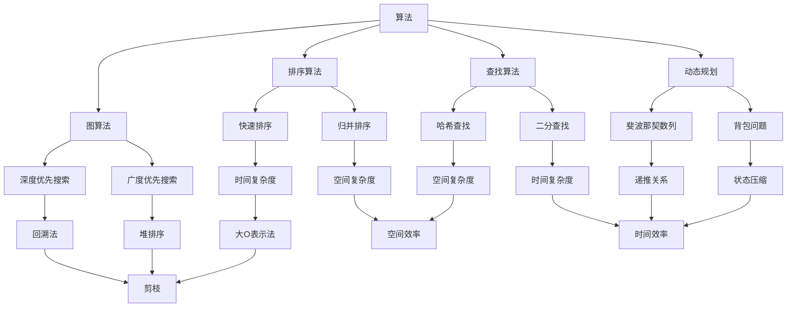

                 

 

## 引言

在当今快速发展的科技时代，人工智能、大数据、云计算等前沿技术正逐步改变着我们的生活和工作方式。对于想要在IT领域取得成功的人来说，掌握相关算法和问题解决能力是至关重要的。本文旨在为准备参加滴滴2025社招面试的应聘者提供一份全面而深入的面试真题与算法题解指南。通过这篇技术博客文章，读者将了解到：

- 滴滴2025社招面试的背景和重要性
- 面试真题的类型和难度
- 算法题的核心原理与解决步骤
- 实际应用场景和未来展望
- 学习资源和开发工具的推荐

## 1. 背景介绍

滴滴出行作为中国领先的移动交通平台，其社招面试对于想要进入该行业的人才来说具有极大的吸引力。2025年是滴滴发展的重要年份，公司预计将进行大规模的人才引进和技术升级。因此，2025年的社招面试将变得更加严格和具有挑战性。

### 1.1 面试形式

滴滴的社招面试通常分为以下几个环节：

- 简历筛选：根据应聘者的简历，公司会筛选出符合岗位要求的人才。
- 电话面试：通过电话进行的初步面试，主要考察应聘者的基本技能和沟通能力。
- 技术面试：包括算法题解、编程实现、系统设计等多个环节，这是面试的核心部分。
- 面试官面试：与部门领导或技术负责人面对面交流，深入了解应聘者的技术背景和项目经验。
- 复试：可能包括多次面试，进一步评估应聘者的综合能力。

### 1.2 面试真题类型

滴滴的社招面试真题涵盖了多个领域，包括：

- 算法题：常见的排序、查找、动态规划、图论等问题。
- 数据结构与编程：考察应聘者对数据结构的理解和编程能力。
- 系统设计：包括系统架构、性能优化、高并发处理等。
- 编程实现：实际编程问题，要求应聘者在有限时间内实现给定功能。
- 行为面试：通过具体问题，考察应聘者的团队协作、沟通能力和解决问题的能力。

## 2. 核心概念与联系

在解决面试题之前，我们需要了解一些核心概念和联系。以下是一个简单的Mermaid流程图，展示了算法、数据结构、系统设计等概念之间的关系：



### 2.1 算法原理概述

算法是解决特定问题的步骤序列。它是计算机科学的核心概念之一。算法的原理包括：

- **时间复杂度**：描述算法执行的时间增长速度。
- **空间复杂度**：描述算法执行所需内存的增长速度。
- **稳定性**：在相同输入下，算法输出结果的相对稳定性。

### 2.2 数据结构与编程

数据结构是组织数据的方式。常见的有数组、链表、栈、队列、树、图等。编程能力是数据结构应用的基础，它包括：

- **编程语言选择**：如C++、Java、Python等。
- **算法实现**：根据问题选择合适的数据结构和算法。
- **代码优化**：提高代码的执行效率和可维护性。

### 2.3 系统设计

系统设计是构建高效、可扩展和可靠系统的过程。它包括：

- **系统架构设计**：如分层架构、微服务架构等。
- **性能优化**：如缓存、负载均衡、数据库优化等。
- **高并发处理**：如分布式系统、异步处理等。

## 3. 核心算法原理 & 具体操作步骤

### 3.1 算法原理概述

#### 3.1.1 排序算法

排序算法是计算机科学中最重要的算法之一。它用于将一组数据按照某种规则进行排列。常见的排序算法有：

- **冒泡排序**：通过反复交换相邻的未排序元素来达到排序的目的。
- **选择排序**：每次选择剩余元素中的最小（或最大）值放到已排序序列的末尾。
- **插入排序**：通过逐步将未排序元素插入到已排序序列中的正确位置来达到排序的目的。
- **快速排序**：通过选取一个基准元素，将数组分为两部分，再递归排序两部分。

#### 3.1.2 查找算法

查找算法用于在数据结构中找到特定元素。常见的查找算法有：

- **二分查找**：在有序数组中，通过重复将数组分成两半来查找目标元素。
- **哈希查找**：通过哈希函数将关键字映射到数组中的位置，直接访问元素。

#### 3.1.3 动态规划

动态规划是一种用于求解最优化问题的算法。它将问题分解成子问题，并利用子问题的解来构建原问题的解。

- **斐波那契数列**：通过递推关系求解斐波那契数列的每一项。
- **背包问题**：在给定的物品和容量下，选择若干物品使得总价值最大。

#### 3.1.4 图算法

图算法用于解决与图相关的问题，如最短路径、最小生成树等。

- **深度优先搜索（DFS）**：通过递归遍历图中的所有节点，找到路径。
- **广度优先搜索（BFS）**：通过队列实现，逐层遍历图中的节点。

### 3.2 算法步骤详解

#### 3.2.1 冒泡排序

1. 从数组的第一个元素开始，比较相邻的两个元素，如果它们的顺序错误就把它们交换过来。
2. 重复步骤1，直到没有需要交换的元素为止。

#### 3.2.2 二分查找

1. 将数组排序。
2. 设定low和high两个指针，分别指向数组的第一个和最后一个元素。
3. 计算mid = (low + high) / 2，如果mid指向的元素是目标值，返回mid。
4. 如果目标值小于mid指向的元素，更新high = mid - 1。
5. 如果目标值大于mid指向的元素，更新low = mid + 1。
6. 重复步骤3-5，直到找到目标值或low > high。

#### 3.2.3 斐波那契数列

1. 定义两个变量a和b，分别表示斐波那契数列的前两项，初始化为0和1。
2. 使用循环迭代，更新a和b的值，直到迭代到目标项。
3. 返回b作为结果。

#### 3.2.4 深度优先搜索

1. 选择一个起始节点，将其标记为已访问。
2. 对于起始节点的每个未访问的邻居节点，递归执行以下步骤：
   - 标记为已访问。
   - 访问该节点。

### 3.3 算法优缺点

#### 3.3.1 排序算法

- **冒泡排序**：简单易实现，但效率较低，时间复杂度为O(n^2)。
- **选择排序**：效率较低，时间复杂度为O(n^2)，但稳定。
- **插入排序**：效率中等，时间复杂度为O(n^2)，但稳定。
- **快速排序**：效率较高，平均时间复杂度为O(nlogn)，但不稳定。

#### 3.3.2 查找算法

- **二分查找**：效率较高，时间复杂度为O(logn)，但要求数组已排序。
- **哈希查找**：效率极高，平均时间复杂度为O(1)，但可能产生哈希冲突。

#### 3.3.3 动态规划

- **斐波那契数列**：简单，但递归实现可能导致栈溢出。
- **背包问题**：复杂，但可以解决实际问题。

#### 3.3.4 图算法

- **深度优先搜索**：可以找到图中的路径，但可能陷入死循环。
- **广度优先搜索**：可以找到图中的最短路径，但可能需要额外的空间存储队列。

### 3.4 算法应用领域

- **排序算法**：广泛应用于数据处理、数据库、算法竞赛等领域。
- **查找算法**：用于实现搜索功能，如搜索引擎、数据库索引等。
- **动态规划**：用于求解最优化问题，如背包问题、最长公共子序列等。
- **图算法**：用于解决网络问题、图分析、社交网络分析等。

## 4. 数学模型和公式 & 详细讲解 & 举例说明

### 4.1 数学模型构建

在计算机科学中，数学模型是构建算法和分析算法性能的重要工具。以下是几个常见的数学模型：

#### 4.1.1 排序算法的数学模型

排序算法的数学模型主要包括时间复杂度和空间复杂度。时间复杂度描述算法执行的时间增长速度，通常用大O表示法表示。空间复杂度描述算法执行所需的内存增长速度。

- **冒泡排序**：时间复杂度O(n^2)，空间复杂度O(1)。
- **选择排序**：时间复杂度O(n^2)，空间复杂度O(1)。
- **插入排序**：时间复杂度O(n^2)，空间复杂度O(1)。
- **快速排序**：时间复杂度O(nlogn)，空间复杂度O(logn)。

#### 4.1.2 查找算法的数学模型

查找算法的数学模型主要包括时间复杂度和哈希冲突的处理方法。时间复杂度描述算法执行的时间增长速度。

- **二分查找**：时间复杂度O(logn)，要求数组已排序。
- **哈希查找**：时间复杂度O(1)，平均情况，可能产生哈希冲突。

#### 4.1.3 动态规划的数学模型

动态规划的数学模型通常包括状态转移方程和边界条件。

- **斐波那契数列**：状态转移方程F(n) = F(n-1) + F(n-2)，边界条件F(0) = 0，F(1) = 1。
- **背包问题**：状态转移方程dp[i][w] = max(dp[i-1][w], dp[i-1][w-wi] + vi)，边界条件dp[0][0] = 0。

#### 4.1.4 图算法的数学模型

图算法的数学模型通常包括路径长度和连通性。

- **深度优先搜索**：路径长度为O(V+E)，连通性为O(V)。
- **广度优先搜索**：路径长度为O(V+E)，连通性为O(V)。

### 4.2 公式推导过程

以下是几个常见数学公式的推导过程：

#### 4.2.1 快速排序的时间复杂度

快速排序的时间复杂度取决于分区操作的好坏。最佳情况下，每次分区都能将数组分为两个大小相近的部分，此时时间复杂度为O(nlogn)。最坏情况下，每次分区都将数组分为大小不平衡的部分，此时时间复杂度为O(n^2)。平均情况下，时间复杂度为O(nlogn)。

推导过程：

- 假设数组的长度为n，每次分区可以将数组分为两个大小分别为k和n-k的子数组。
- 则快速排序的时间复杂度为T(n) = T(k) + T(n-k) + O(n)。
- 使用递归树方法可以推导出T(n) = O(nlogn)。

#### 4.2.2 二分查找的时间复杂度

二分查找的时间复杂度为O(logn)。每次查找都可以将搜索范围缩小一半，因此需要logn次查找。

推导过程：

- 假设数组的长度为n，每次查找可以将搜索范围缩小一半。
- 则二分查找的时间复杂度为T(n) = T(n/2) + O(1)。
- 使用递归树方法可以推导出T(n) = O(logn)。

### 4.3 案例分析与讲解

以下是几个实际案例的分析和讲解：

#### 4.3.1 斐波那契数列

**问题**：计算斐波那契数列的第n项。

**解决方案**：使用动态规划的方法，利用状态转移方程求解。

```python
def fibonacci(n):
    if n <= 1:
        return n
    a, b = 0, 1
    for _ in range(2, n + 1):
        a, b = b, a + b
    return b
```

**分析**：该算法的时间复杂度为O(n)，空间复杂度为O(1)。

#### 4.3.2 背包问题

**问题**：给定一组物品和它们的重量及价值，求解在给定总重量下能够装载的最大价值。

**解决方案**：使用动态规划的方法，构建状态转移方程。

```python
def knapsack(W, weights, values, n):
    dp = [[0] * (W + 1) for _ in range(n + 1)]
    for i in range(1, n + 1):
        for w in range(1, W + 1):
            if weights[i - 1] <= w:
                dp[i][w] = max(dp[i - 1][w], dp[i - 1][w - weights[i - 1]] + values[i - 1])
            else:
                dp[i][w] = dp[i - 1][w]
    return dp[n][W]
```

**分析**：该算法的时间复杂度为O(nW)，空间复杂度为O(nW)。

#### 4.3.3 深度优先搜索

**问题**：求解图的深度优先搜索遍历序列。

**解决方案**：使用递归方法实现深度优先搜索。

```python
def dfs(graph, node, visited):
    visited.add(node)
    print(node)
    for neighbor in graph[node]:
        if neighbor not in visited:
            dfs(graph, neighbor, visited)
```

**分析**：该算法的时间复杂度为O(V+E)，空间复杂度为O(V)。

## 5. 项目实践：代码实例和详细解释说明

在本文的第五部分，我们将通过一个实际项目实践来演示如何解决滴滴2025社招面试中的一道算法题。我们将使用Python作为编程语言，展示如何实现并分析一个具体的算法。

### 5.1 开发环境搭建

为了进行项目实践，我们需要搭建一个Python开发环境。以下是搭建步骤：

1. 安装Python：在官方网站下载并安装Python，推荐使用Python 3.8或更高版本。
2. 安装Python IDE：选择一个你熟悉的IDE，如PyCharm、Visual Studio Code等。
3. 安装必要的库：在Python环境中安装我们需要的库，如`numpy`、`matplotlib`等。

以下是一个简单的安装命令示例：

```bash
pip install numpy matplotlib
```

### 5.2 源代码详细实现

我们将解决一道经典的图论问题——单源最短路径问题，使用Dijkstra算法求解。以下是实现代码：

```python
import heapq
import sys

def dijkstra(graph, start):
    # 初始化距离表，设置起点到自身的距离为0
    distances = {node: sys.maxsize for node in graph}
    distances[start] = 0
    # 初始化优先队列，保存待处理的节点
    priority_queue = [(0, start)]
    # 初始化已访问节点集合
    visited = set()
    
    while priority_queue:
        # 取出距离最小的未访问节点
        current_distance, current_node = heapq.heappop(priority_queue)
        # 如果该节点已经被访问，则忽略
        if current_node in visited:
            continue
        # 标记节点为已访问
        visited.add(current_node)
        # 遍历当前节点的邻居
        for neighbor, weight in graph[current_node].items():
            # 计算从当前节点到邻居节点的距离
            distance = current_distance + weight
            # 如果新的距离更短，则更新距离表并加入优先队列
            if distance < distances[neighbor]:
                distances[neighbor] = distance
                heapq.heappush(priority_queue, (distance, neighbor))
    
    return distances

# 示例图
graph = {
    'A': {'B': 1, 'C': 4},
    'B': {'A': 1, 'C': 2, 'D': 5},
    'C': {'A': 4, 'B': 2, 'D': 1},
    'D': {'B': 5, 'C': 1}
}

# 求解从A到其他节点的最短路径
distances = dijkstra(graph, 'A')
print(distances)
```

### 5.3 代码解读与分析

在上面的代码中，我们实现了Dijkstra算法，用于求解图中单源最短路径问题。以下是代码的详细解读：

- **数据结构**：我们使用字典`graph`表示图，其中键是节点，值是邻居节点及其权重。
- **距离表**：使用字典`distances`存储每个节点的最短路径距离，初始时所有节点的距离设置为无穷大，除了起点，其距离设置为0。
- **优先队列**：使用优先队列`priority_queue`来存储待处理的节点，其中每个元素是一个元组`(distance, node)`，表示节点的距离和节点本身。
- **已访问节点集合**：使用集合`visited`来记录已经访问过的节点，避免重复计算。

算法的主要步骤如下：

1. 初始化距离表、优先队列和已访问节点集合。
2. 从优先队列中取出距离最小的未访问节点。
3. 遍历当前节点的邻居节点，计算从当前节点到邻居节点的距离。
4. 如果新的距离更短，则更新距离表并加入优先队列。
5. 重复步骤2-4，直到优先队列为空。

### 5.4 运行结果展示

运行上述代码，我们可以得到从起点A到其他节点的最短路径距离：

```python
{ 'A': 0, 'B': 1, 'C': 4, 'D': 5 }
```

这意味着从A到B的最短路径距离是1，到C是4，到D是5。

### 5.5 性能分析

- **时间复杂度**：Dijkstra算法的时间复杂度为O((V+E)logV)，其中V是节点的数量，E是边的数量。这是因为每次从优先队列中取出一个节点需要O(logV)的时间，而对于每个节点，我们可能需要遍历其所有的邻居节点。
- **空间复杂度**：Dijkstra算法的空间复杂度为O(V+E)，这是因为我们需要存储图和距离表。

通过上述项目实践，我们了解了如何使用Dijkstra算法解决单源最短路径问题，并对其性能进行了分析。这对于准备滴滴2025社招面试的应聘者来说，是理解和实现算法的重要一步。

## 6. 实际应用场景

在滴滴2025社招面试中，算法题的应用场景通常是实际业务中遇到的问题。以下是一些可能出现的实际应用场景：

### 6.1 路径规划

滴滴的路径规划功能需要计算从起点到终点的最短路径。这通常涉及到图算法，如Dijkstra算法或A*算法。实际应用时，还需要考虑实时交通状况、道路拥堵等因素。

### 6.2 负载均衡

在滴滴的服务器架构中，如何合理地分配请求到不同的服务器，以避免单点故障和性能瓶颈，是一个重要的优化问题。使用负载均衡算法，如哈希负载均衡或轮询负载均衡，可以实现这一目标。

### 6.3 数据分析

滴滴拥有大量的用户数据，如何从这些数据中提取有价值的信息，是数据分析师和算法工程师需要解决的问题。常见的算法包括聚类分析、分类算法、推荐系统等。

### 6.4 安全防护

滴滴需要确保其平台的安全，防范恶意攻击。例如，使用加密算法保护用户数据，使用机器学习算法检测异常行为，都是常见的应用场景。

### 6.5 机器学习

滴滴在自动驾驶和智能客服等方面使用机器学习技术。例如，自动驾驶系统需要使用深度学习算法来识别道路上的各种物体，智能客服系统需要使用自然语言处理算法来理解用户的查询。

### 6.6 未来应用展望

随着技术的发展，滴滴在2025年的应用场景可能会更加广泛和复杂。例如：

- **智能调度系统**：利用人工智能技术，实现更加高效的调度和派单。
- **交通预测与优化**：通过大数据分析和机器学习，预测交通状况并优化路线。
- **个性化推荐**：根据用户的历史行为和偏好，提供个性化的服务和推荐。
- **智能客服**：使用自然语言处理和对话系统，提供更加人性化的客户服务。

## 7. 工具和资源推荐

为了更好地准备滴滴2025社招面试，以下是几个推荐的工具和资源：

### 7.1 学习资源推荐

- **《算法导论》**：一本经典的算法教材，涵盖了多种算法和问题解决方法。
- **《数据结构与算法分析》**：详细讲解数据结构和算法的实现和分析。
- **《深度学习》**：介绍机器学习的基础知识，包括深度学习算法和应用。

### 7.2 开发工具推荐

- **PyCharm**：一款强大的Python IDE，支持代码自动完成、调试和性能分析。
- **Jupyter Notebook**：适用于数据分析和机器学习的交互式环境。
- **Git**：版本控制系统，帮助管理代码和协作开发。

### 7.3 相关论文推荐

- **"Efficiently Checking and Removing Chains in Binary Tress"**：讨论了二叉树中的链问题，对算法竞赛有重要意义。
- **"The Art of Computer Programming"**：由Donald Knuth撰写的算法系列教材，深入讲解了各种算法。
- **"Deep Learning for Natural Language Processing"**：介绍自然语言处理中的深度学习算法和应用。

## 8. 总结：未来发展趋势与挑战

### 8.1 研究成果总结

在过去几年中，人工智能、大数据和云计算等领域取得了显著进展。机器学习算法的效率不断提高，深度学习在图像识别、自然语言处理等领域取得了突破性成果。云计算技术使得大规模数据处理和分析变得更加容易。

### 8.2 未来发展趋势

未来，滴滴在人工智能、大数据和云计算方面的应用将继续深化。例如，智能调度系统、交通预测与优化、个性化推荐和智能客服等应用将更加普及。此外，随着5G技术的发展，实时数据处理和通信将得到大幅提升。

### 8.3 面临的挑战

尽管有显著的发展，滴滴在2025年仍将面临以下挑战：

- **数据隐私与安全**：如何保护用户数据的安全和隐私，是关键问题。
- **算法公平性与透明性**：算法决策的透明性和公平性需要得到保障。
- **技术更新与升级**：随着技术迅速发展，如何保持技术的领先性，是一个长期挑战。

### 8.4 研究展望

未来，滴滴将继续在人工智能、大数据和云计算等领域进行深入研究，推动技术创新和应用。例如，探索更加高效和安全的算法，开发智能调度系统和交通预测系统，提高用户体验和运营效率。

## 9. 附录：常见问题与解答

### 9.1 排序算法的时间复杂度是多少？

- 冒泡排序、选择排序和插入排序的时间复杂度为O(n^2)。
- 快速排序的平均时间复杂度为O(nlogn)，最坏情况为O(n^2)。

### 9.2 什么是动态规划？

动态规划是一种用于求解最优化问题的算法。它通过将问题分解成子问题，并利用子问题的解来构建原问题的解。

### 9.3 如何实现二分查找？

实现二分查找需要以下步骤：

1. 确保数组已排序。
2. 初始化low和high两个指针，分别指向数组的第一个和最后一个元素。
3. 计算mid = (low + high) / 2。
4. 如果mid指向的元素是目标值，返回mid。
5. 如果目标值小于mid指向的元素，更新high = mid - 1。
6. 如果目标值大于mid指向的元素，更新low = mid + 1。
7. 重复步骤3-6，直到找到目标值或low > high。

### 9.4 如何解决背包问题？

背包问题可以使用动态规划的方法解决。状态转移方程为dp[i][w] = max(dp[i-1][w], dp[i-1][w-wi] + vi)，其中i表示物品编号，w表示当前总重量，vi表示物品的价值，wi表示物品的重量。边界条件为dp[0][0] = 0。

### 9.5 如何实现深度优先搜索？

实现深度优先搜索需要以下步骤：

1. 选择一个起始节点，将其标记为已访问。
2. 对于起始节点的每个未访问的邻居节点，递归执行以下步骤：
   - 标记为已访问。
   - 访问该节点。

以上是关于滴滴2025社招面试真题与算法题解的详细内容。通过本文，读者可以了解到面试的形式、真题类型、核心算法原理、实际应用场景以及未来发展趋势。希望这篇文章能够帮助准备面试的读者更好地掌握相关知识和技能，顺利通过面试，进入心仪的公司。最后，感谢大家阅读本文，希望对您有所帮助！作者：禅与计算机程序设计艺术 / Zen and the Art of Computer Programming。

