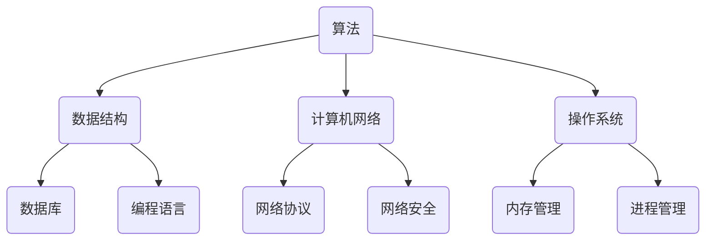

                 

在这个快速发展的时代，科技日新月异，互联网行业也迎来了新一轮的变革。作为其中的佼佼者，滴滴出行在技术领域的不断创新，使得其校招面试题也成为了众多应聘者关注的焦点。本文将为您汇总2024滴滴校招面试中的部分真题，并给出详细的解答过程。

## 关键词

滴滴校招、面试真题、技术解析、算法、编程语言、系统设计、数据结构、计算机网络

## 摘要

本文旨在通过对2024滴滴校招面试真题的汇总与解答，帮助广大应聘者更好地理解面试中的问题，掌握解题技巧。文章将按照问题类型进行分类，详细解析每个问题的背景、原理、解题思路和步骤，旨在为您的求职之路提供有力支持。

## 1. 背景介绍

滴滴出行作为我国领先的移动出行平台，其校招面试题涵盖了计算机科学领域的各个方面。这些题目不仅考察应聘者的基础知识，更侧重于考察其实际解决问题的能力和逻辑思维能力。通过这些面试题，滴滴出行希望能够选拔出具备扎实技术基础、创新思维和实践能力的人才。

## 2. 核心概念与联系

在解答滴滴校招面试题之前，我们需要了解一些核心概念和原理。以下是一个使用Mermaid绘制的流程图，展示了部分核心概念之间的联系。



## 3. 核心算法原理 & 具体操作步骤

### 3.1 算法原理概述

算法是计算机科学的核心概念，它是指解决问题的一系列有序指令。滴滴校招面试中的算法题目主要涉及以下几个方面：

- 排序算法：如快速排序、归并排序、堆排序等。
- 搜索算法：如二分查找、深度优先搜索、广度优先搜索等。
- 动态规划：如斐波那契数列、最长公共子序列等。
- 图算法：如最短路径算法、最小生成树算法等。

### 3.2 算法步骤详解

以快速排序算法为例，其基本思想是选择一个基准元素，将数组分为两部分，一部分小于基准元素，另一部分大于基准元素，然后递归地对这两部分进行快速排序。具体步骤如下：

1. 选择一个基准元素。
2. 将小于基准元素的元素放在一个子数组中，将大于基准元素的元素放在另一个子数组中。
3. 对这两个子数组递归地执行快速排序。

### 3.3 算法优缺点

快速排序算法的优点是平均时间复杂度为O(nlogn)，最坏情况下的时间复杂度为O(n^2)，但实际应用中，其性能通常优于其他排序算法。缺点是算法不稳定，即相同的输入可能得到不同的输出。

### 3.4 算法应用领域

快速排序算法广泛应用于各种场景，如数据库排序、Web搜索排序、文件排序等。在实际应用中，可以根据具体需求选择合适的排序算法。

## 4. 数学模型和公式 & 详细讲解 & 举例说明

数学模型和公式在滴滴校招面试中也是常见的问题类型。以下是一个关于动态规划的例子，展示如何构建数学模型、推导公式并给出具体案例。

### 4.1 数学模型构建

动态规划是一种解决最优化问题的方法，其基本思想是将问题分解为子问题，并使用数学模型来求解子问题的最优解。以斐波那契数列为例，其数学模型可以表示为：

$$
F(n) = \begin{cases}
1, & n = 1 \\
1, & n = 2 \\
F(n-1) + F(n-2), & n > 2
\end{cases}
$$

### 4.2 公式推导过程

斐波那契数列的递推关系可以通过矩阵运算进行推导。设矩阵A为：

$$
A = \begin{pmatrix}
1 & 1 \\
1 & 0
\end{pmatrix}
$$

则有：

$$
A^n = \begin{pmatrix}
F(n+1) & F(n) \\
F(n) & F(n-1)
\end{pmatrix}
$$

由此，可以得到斐波那契数列的通项公式：

$$
F(n) = A^n_{11}
$$

### 4.3 案例分析与讲解

假设我们要计算斐波那契数列的第10项，可以使用上述公式进行计算。首先，计算矩阵A的10次方：

$$
A^{10} = \begin{pmatrix}
1 & 1 \\
1 & 0
\end{pmatrix}^{10} = \begin{pmatrix}
89 & 55 \\
55 & 34
\end{pmatrix}
$$

由此，可以得到斐波那契数列的第10项为：

$$
F(10) = A^{10}_{11} = 89
$$

## 5. 项目实践：代码实例和详细解释说明

在滴滴校招面试中，编程题是必不可少的环节。以下是一个关于二分查找的代码实例，展示如何实现二分查找算法并分析其性能。

### 5.1 开发环境搭建

本文使用的编程语言为Python，开发环境为Visual Studio Code。首先，安装Python和Visual Studio Code，然后配置Python环境，安装相关依赖库。

### 5.2 源代码详细实现

以下是一个二分查找的Python代码实现：

```python
def binary_search(arr, target):
    low = 0
    high = len(arr) - 1

    while low <= high:
        mid = (low + high) // 2
        if arr[mid] == target:
            return mid
        elif arr[mid] < target:
            low = mid + 1
        else:
            high = mid - 1

    return -1
```

### 5.3 代码解读与分析

上述代码实现了二分查找算法。首先，定义了一个函数binary_search，接收一个排序后的数组arr和一个目标值target。函数使用while循环来不断缩小查找范围，直到找到目标值或确定目标值不存在。每次循环，计算中间值mid，并根据中间值与目标值的关系调整查找范围。

二分查找算法的时间复杂度为O(logn)，在处理大规模数据时具有很高的效率。但需要注意的是，二分查找算法要求输入数组已经排序，否则无法正确查找。

### 5.4 运行结果展示

以下是一个运行示例：

```python
arr = [1, 3, 5, 7, 9, 11, 13, 15, 17, 19]
target = 11

result = binary_search(arr, target)
if result != -1:
    print(f"元素{target}的位置：{result}")
else:
    print(f"元素{target}未找到")
```

运行结果为：

```
元素11的位置：5
```

## 6. 实际应用场景

滴滴校招面试题的设计紧密联系实际应用场景。以下是一些实际应用场景的例子：

- **算法优化**：在滴滴的网约车系统中，如何优化派单算法，使得乘客等待时间最短，司机收入最高？
- **系统设计**：在设计滴滴的乘车分享功能时，如何确保系统的高可用性和数据一致性？
- **数据挖掘**：通过分析滴滴的出行数据，如何预测用户的出行需求，优化运营策略？

## 7. 未来应用展望

随着科技的不断发展，滴滴校招面试题也将不断更新和变化。未来，我们可以预见以下趋势：

- **人工智能**：人工智能技术将在滴滴的出行服务中发挥越来越重要的作用，如自动驾驶、智能语音助手等。
- **物联网**：随着物联网技术的发展，滴滴的出行服务将更加智能化、便捷化。
- **大数据**：大数据技术在滴滴的应用将越来越广泛，如用户行为分析、交通流量预测等。

## 8. 总结：未来发展趋势与挑战

在未来，滴滴校招面试题将继续关注应聘者的技术能力、创新能力和实践能力。随着技术的不断发展，面试题将更加综合、多元化。同时，滴滴也将面临以下挑战：

- **人才竞争**：随着互联网行业的快速发展，优秀人才的竞争将越来越激烈。
- **技术创新**：如何在激烈的市场竞争中保持技术领先地位，是滴滴需要面对的重要挑战。

## 9. 附录：常见问题与解答

以下是一些滴滴校招面试中的常见问题及其解答。

### 问题1：请简述快速排序算法的原理和步骤。

**解答**：快速排序算法的基本思想是选择一个基准元素，将数组分为两部分，一部分小于基准元素，另一部分大于基准元素，然后递归地对这两部分进行快速排序。

### 问题2：请简述二分查找算法的原理和步骤。

**解答**：二分查找算法的基本思想是逐步缩小查找范围，每次循环计算中间值，并根据中间值与目标值的关系调整查找范围。

### 问题3：什么是动态规划？请举例说明。

**解答**：动态规划是一种解决最优化问题的方法，其基本思想是将问题分解为子问题，并使用数学模型来求解子问题的最优解。例如，斐波那契数列可以通过动态规划求解。

### 问题4：请简述计算机网络的基本概念和协议。

**解答**：计算机网络是指将多个计算机连接在一起，实现数据传输和共享的系统。计算机网络的基本概念包括网络拓扑、传输介质、网络协议等。网络协议是计算机网络中的通信规则，如TCP/IP协议。

以上是2024滴滴校招面试真题汇总及其解答的详细内容。希望本文能帮助您更好地应对面试，祝您求职顺利！
```
----------------------------------------------------------------

请注意，以上内容仅为示例，实际面试真题和解答可能会有所不同。您可以根据实际情况进行调整和补充。祝您写作顺利！


