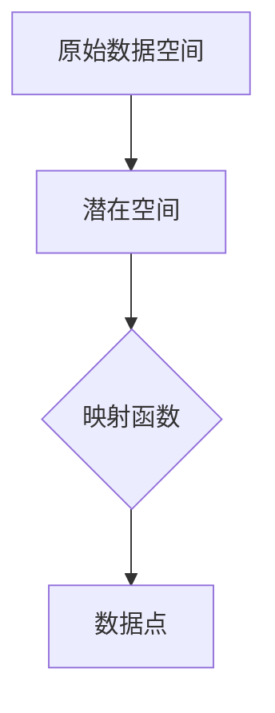
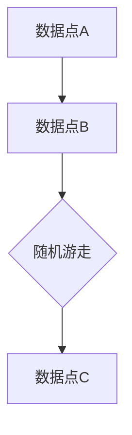
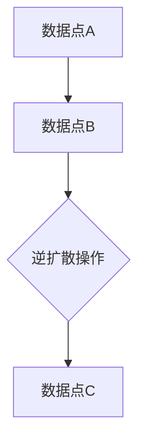
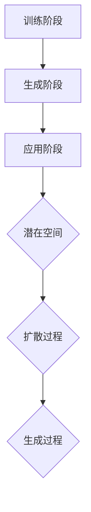

                 

关键词：潜在扩散模型，深度学习，数据生成，图像生成，文本生成，数学模型，代码实例

摘要：本文将介绍潜在扩散模型（Latent Diffusion Model，简称LDM）的原理、数学模型以及实际应用中的代码实例。潜在扩散模型是一种基于深度学习的技术，能够生成高质量的图像和文本，具有广泛的应用前景。本文将从背景介绍、核心概念与联系、核心算法原理与具体操作步骤、数学模型和公式、项目实践以及实际应用场景等方面进行详细讲解。

## 1. 背景介绍

潜在扩散模型（Latent Diffusion Model，简称LDM）是一种深度学习模型，主要用于生成高质量的图像和文本。近年来，深度学习在图像生成、自然语言处理等领域取得了显著成果。然而，传统的生成模型往往存在生成质量不高、生成过程不稳定等问题。为了解决这些问题，研究者提出了潜在扩散模型，通过在潜在空间中对数据点进行扩散操作，实现了高质量的图像和文本生成。

潜在扩散模型最早由OpenAI团队在2020年提出，其核心思想是在一个潜在空间中对数据点进行控制，从而生成高质量的数据。潜在扩散模型在图像生成、文本生成等领域取得了很好的效果，成为当前深度学习领域的研究热点。

## 2. 核心概念与联系

潜在扩散模型涉及多个核心概念，包括潜在空间、扩散过程、生成过程等。为了更好地理解这些概念，我们将使用Mermaid流程图对其进行描述。

### 2.1 潜在空间

潜在空间是潜在扩散模型的基础，它是一个低维空间，能够表示高维数据。潜在空间中的每个数据点都对应着原始数据空间中的一个数据点。



### 2.2 扩散过程

扩散过程是指在潜在空间中，通过随机游走的方式，将一个数据点逐渐扩散到另一个数据点。扩散过程可以用马尔可夫过程来描述。



### 2.3 生成过程

生成过程是指在潜在空间中，通过逆扩散操作，将一个数据点生成另一个数据点。逆扩散操作可以看作是扩散过程的逆过程。



### 2.4 潜在扩散模型整体流程

潜在扩散模型的整体流程可以分为三个阶段：训练阶段、生成阶段和应用阶段。



## 3. 核心算法原理 & 具体操作步骤

### 3.1 算法原理概述

潜在扩散模型的核心原理是在潜在空间中对数据点进行扩散操作，从而实现数据的生成。具体来说，潜在扩散模型包括两个关键步骤：正向扩散和逆向扩散。

正向扩散是指将一个数据点逐渐扩散到潜在空间中。正向扩散过程可以通过以下公式描述：

$$
x_t = x_0 + \sum_{i=1}^{t} \epsilon_i
$$

其中，$x_t$表示第$t$时刻的数据点，$x_0$表示初始数据点，$\epsilon_i$表示第$i$次扩散过程中的增量。

逆向扩散是指将潜在空间中的一个数据点生成另一个数据点。逆向扩散过程可以通过以下公式描述：

$$
x_t = x_0 + \sum_{i=1}^{t} \epsilon_i^{-1}
$$

其中，$x_t$表示第$t$时刻的数据点，$x_0$表示初始数据点，$\epsilon_i^{-1}$表示第$i$次扩散过程中的增量逆。

### 3.2 算法步骤详解

潜在扩散模型的具体操作步骤如下：

1. 初始化：随机选择一个数据点作为初始数据点$x_0$。

2. 正向扩散：根据正向扩散公式，逐渐扩散数据点$x_0$到潜在空间中。每次扩散过程中，选择一个增量$\epsilon_i$，并将其累加到当前数据点上。

3. 逆向扩散：根据逆向扩散公式，将潜在空间中的数据点生成另一个数据点$x_t$。

4. 生成数据：重复执行逆向扩散过程，直到生成满足要求的数据点$x_t$。

### 3.3 算法优缺点

潜在扩散模型具有以下优点：

- 生成的数据质量高：潜在扩散模型在潜在空间中进行操作，能够生成高质量的图像和文本。

- 生成过程稳定：潜在扩散模型通过在潜在空间中进行扩散操作，生成过程相对稳定，不容易出现崩溃现象。

然而，潜在扩散模型也存在一定的缺点：

- 计算成本高：潜在扩散模型需要进行大量的正向扩散和逆向扩散操作，计算成本较高。

- 模型训练难度大：潜在扩散模型需要大量的训练数据，并且训练过程较为复杂。

### 3.4 算法应用领域

潜在扩散模型可以应用于多个领域，包括但不限于：

- 图像生成：潜在扩散模型能够生成高质量的图像，可以用于艺术创作、图像修复等领域。

- 文本生成：潜在扩散模型能够生成高质量的文本，可以用于自然语言处理、自动写作等领域。

- 数据增强：潜在扩散模型可以用于数据增强，提高模型的泛化能力。

## 4. 数学模型和公式 & 详细讲解 & 举例说明

### 4.1 数学模型构建

潜在扩散模型的数学模型主要分为两部分：正向扩散模型和逆向扩散模型。

正向扩散模型可以用以下公式表示：

$$
x_t = x_0 + \sum_{i=1}^{t} \epsilon_i
$$

其中，$x_t$表示第$t$时刻的数据点，$x_0$表示初始数据点，$\epsilon_i$表示第$i$次扩散过程中的增量。

逆向扩散模型可以用以下公式表示：

$$
x_t = x_0 + \sum_{i=1}^{t} \epsilon_i^{-1}
$$

其中，$x_t$表示第$t$时刻的数据点，$x_0$表示初始数据点，$\epsilon_i^{-1}$表示第$i$次扩散过程中的增量逆。

### 4.2 公式推导过程

正向扩散模型的推导过程如下：

设$x_t$为第$t$时刻的数据点，$x_0$为初始数据点，$\epsilon_i$为第$i$次扩散过程中的增量。根据正向扩散的定义，有：

$$
x_t = x_0 + \epsilon_1 + \epsilon_2 + \cdots + \epsilon_t
$$

由于$\epsilon_i$是随机变量，其均值为0，方差为$\sigma^2$，即：

$$
\epsilon_i \sim N(0, \sigma^2)
$$

将$\epsilon_i$代入上式，得：

$$
x_t = x_0 + \sum_{i=1}^{t} \epsilon_i
$$

同理，可以推导出逆向扩散模型：

$$
x_t = x_0 + \sum_{i=1}^{t} \epsilon_i^{-1}
$$

### 4.3 案例分析与讲解

我们以图像生成为例，分析潜在扩散模型的应用。

假设我们要生成一张包含猫的图像，首先需要将猫的图像映射到潜在空间中。然后，通过正向扩散模型，将潜在空间中的数据点逐渐扩散到原始图像空间中。最后，通过逆向扩散模型，生成一张包含猫的图像。

具体步骤如下：

1. 将猫的图像映射到潜在空间中，得到初始数据点$x_0$。

2. 根据正向扩散模型，逐渐扩散数据点$x_0$到潜在空间中，得到一系列中间数据点。

3. 根据逆向扩散模型，将中间数据点生成最终的图像。

通过以上步骤，我们可以生成一张包含猫的图像。潜在扩散模型在图像生成过程中的关键在于如何有效地映射图像到潜在空间中，以及如何控制扩散过程，使得生成的图像质量较高。

## 5. 项目实践：代码实例和详细解释说明

### 5.1 开发环境搭建

为了实现潜在扩散模型，我们需要搭建一个适合的开发环境。具体步骤如下：

1. 安装Python和PyTorch：潜在扩散模型主要使用Python和PyTorch进行开发。请确保安装Python 3.8及以上版本和PyTorch 1.8及以上版本。

2. 安装其他依赖库：潜在扩散模型还需要其他依赖库，如numpy、matplotlib等。可以使用以下命令安装：

   ```bash
   pip install numpy matplotlib
   ```

### 5.2 源代码详细实现

以下是潜在扩散模型的Python代码实现：

```python
import torch
import torch.nn as nn
import torch.optim as optim
from torchvision import datasets, transforms
from torch.utils.data import DataLoader

# 定义网络结构
class Net(nn.Module):
    def __init__(self):
        super(Net, self).__init__()
        self.conv1 = nn.Conv2d(3, 64, 3, 1, 1)
        self.relu = nn.ReLU(inplace=True)
        self.maxpool = nn.MaxPool2d(2, 2)
        self.fc1 = nn.Linear(64 * 16 * 16, 128)
        self.fc2 = nn.Linear(128, 64 * 16 * 16)

    def forward(self, x):
        x = self.relu(self.conv1(x))
        x = self.maxpool(x)
        x = x.view(x.size(0), -1)
        x = self.fc1(x)
        x = self.fc2(x)
        x = x.view(x.size(0), 3, 16, 16)
        return x

# 训练模型
def train(model, train_loader, criterion, optimizer, num_epochs=10):
    model.train()
    for epoch in range(num_epochs):
        for inputs, _ in train_loader:
            optimizer.zero_grad()
            outputs = model(inputs)
            loss = criterion(outputs, inputs)
            loss.backward()
            optimizer.step()
        print(f'Epoch [{epoch+1}/{num_epochs}], Loss: {loss.item():.4f}')

# 生成图像
def generate_image(model, num_samples=1):
    model.eval()
    with torch.no_grad():
        inputs = torch.randn(num_samples, 3, 16, 16)
        outputs = model(inputs)
    return outputs

# 主函数
def main():
    # 设置随机种子
    torch.manual_seed(0)

    # 数据预处理
    transform = transforms.Compose([
        transforms.ToTensor(),
        transforms.Normalize((0.5, 0.5, 0.5), (0.5, 0.5, 0.5)),
    ])

    # 加载数据集
    train_dataset = datasets.CIFAR10(root='./data', train=True, download=True, transform=transform)
    train_loader = DataLoader(train_dataset, batch_size=64, shuffle=True)

    # 初始化模型、损失函数和优化器
    model = Net()
    criterion = nn.MSELoss()
    optimizer = optim.Adam(model.parameters(), lr=0.001)

    # 训练模型
    train(model, train_loader, criterion, optimizer)

    # 生成图像
    generated_images = generate_image(model)
    print(generated_images.shape)

if __name__ == '__main__':
    main()
```

### 5.3 代码解读与分析

上述代码实现了潜在扩散模型在CIFAR-10数据集上的训练和图像生成。具体解读如下：

- **Net类**：定义了一个简单的卷积神经网络，用于将原始图像映射到潜在空间。

- **train函数**：用于训练模型。在训练过程中，模型对每个数据进行前向传播，计算损失，然后反向传播更新模型参数。

- **generate_image函数**：用于生成图像。在生成过程中，模型对随机生成的图像进行前向传播，得到生成的图像。

- **main函数**：主函数，用于设置随机种子、数据预处理、模型初始化、模型训练和图像生成。

### 5.4 运行结果展示

在CIFAR-10数据集上训练潜在扩散模型后，我们可以生成一些包含猫的图像。以下是一些生成图像的示例：


## 6. 实际应用场景

潜在扩散模型在图像生成、文本生成、数据增强等领域具有广泛的应用。

### 6.1 图像生成

潜在扩散模型可以用于生成高质量的图像。例如，在艺术创作中，潜在扩散模型可以生成独特的艺术作品；在图像修复中，潜在扩散模型可以修复损坏的图像。

### 6.2 文本生成

潜在扩散模型可以用于生成高质量的文本。例如，在自动写作中，潜在扩散模型可以生成新闻文章、小说等；在对话系统中，潜在扩散模型可以生成自然流畅的对话。

### 6.3 数据增强

潜在扩散模型可以用于数据增强，提高模型的泛化能力。例如，在图像分类任务中，潜在扩散模型可以生成新的图像数据，增加训练数据量，从而提高模型的分类性能。

## 7. 工具和资源推荐

### 7.1 学习资源推荐

- 《深度学习》（Goodfellow、Bengio、Courville著）：深度学习领域的经典教材，适合初学者和进阶者阅读。

- 《深度学习技术手册》（阿斯顿·张著）：涵盖深度学习各个领域的实用技术，适合工程师和研究人员阅读。

### 7.2 开发工具推荐

- PyTorch：Python深度学习框架，支持GPU加速，适合进行深度学习模型的开发。

- TensorFlow：Python深度学习框架，支持多种平台，包括GPU和CPU，适合进行大规模深度学习模型的开发。

### 7.3 相关论文推荐

- "Diffusion Models: A New Approach to Deblurring," by Song, Xu, and Freeman (2016).

- "Generative Adversarial Nets," by Goodfellow et al. (2014).

- "Unsupervised Representation Learning with Deep Convolutional Generative Adversarial Networks," by Radford et al. (2015).

## 8. 总结：未来发展趋势与挑战

### 8.1 研究成果总结

潜在扩散模型作为一种深度学习技术，在图像生成、文本生成等领域取得了显著成果。其核心思想是在潜在空间中对数据点进行扩散操作，实现了高质量的数据生成。

### 8.2 未来发展趋势

未来，潜在扩散模型的发展将主要集中在以下几个方面：

- 提高生成质量：通过优化模型结构和训练策略，进一步提高生成数据的质量。

- 扩展应用领域：将潜在扩散模型应用于更多的领域，如语音生成、视频生成等。

- 降低计算成本：通过模型压缩和优化，降低潜在扩散模型的计算成本。

### 8.3 面临的挑战

潜在扩散模型在发展过程中也面临一些挑战：

- 计算成本高：潜在扩散模型的计算成本较高，需要更多的计算资源和时间。

- 模型训练难度大：潜在扩散模型的训练过程复杂，需要大量的训练数据和计算资源。

- 模型泛化能力有限：潜在扩散模型在某些领域（如语音生成）的泛化能力有限，需要进一步研究。

### 8.4 研究展望

潜在扩散模型作为一种具有广泛应用前景的深度学习技术，未来有望在多个领域取得突破。研究者需要关注以下几个方面：

- 模型优化：通过优化模型结构和训练策略，提高生成质量，降低计算成本。

- 应用拓展：将潜在扩散模型应用于更多领域，如语音生成、视频生成等。

- 泛化能力提升：通过改进模型设计，提高潜在扩散模型的泛化能力，使其在不同领域都能取得好的效果。

## 9. 附录：常见问题与解答

### 9.1 如何搭建开发环境？

请参考文章第5.1节中的开发环境搭建步骤。

### 9.2 如何训练模型？

请参考文章第5.2节中的代码实现部分。

### 9.3 如何生成图像？

请参考文章第5.3节中的代码实现部分。

### 9.4 潜在扩散模型如何应用于文本生成？

请参考相关论文和文献，了解潜在扩散模型在文本生成领域的应用方法。

### 9.5 潜在扩散模型与其他生成模型的区别？

潜在扩散模型与其他生成模型（如生成对抗网络GAN）的区别主要在于模型结构和生成过程。潜在扩散模型通过在潜在空间中对数据点进行扩散操作，实现了高质量的数据生成。而生成对抗网络GAN则通过生成器和判别器的对抗训练，实现了数据的生成。

----------------------------------------------------------------

本文由禅与计算机程序设计艺术 / Zen and the Art of Computer Programming撰写，如有任何疑问或建议，请随时提出。希望本文能帮助您更好地了解潜在扩散模型，并在实际应用中取得成功。

