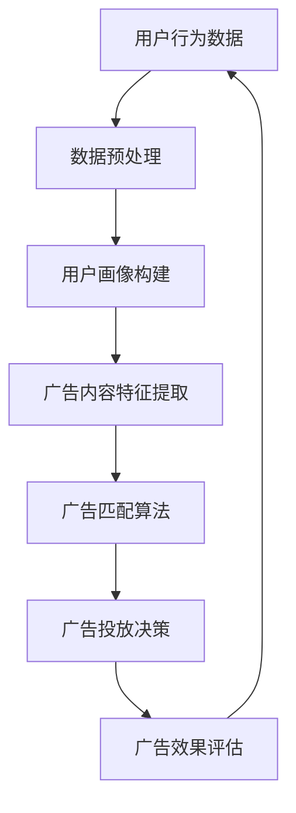

                 

关键词：爱奇艺、2025、视频广告、精准投放、系统工程师、社招面试、指南

摘要：本文将深入探讨爱奇艺2025视频广告精准投放系统的构建，旨在为系统工程师提供全面的面试指南。文章涵盖了系统背景、核心概念、算法原理、数学模型、项目实践、实际应用以及未来展望等多个方面，旨在帮助读者深入了解这一前沿技术，并应对社招面试中的挑战。

## 1. 背景介绍

随着互联网和视频技术的快速发展，广告行业正经历着前所未有的变革。爱奇艺作为中国领先的视频平台，其广告投放系统一直是行业关注的焦点。为了更好地满足用户需求，提升广告效果，爱奇艺在2025年推出了一款全新的视频广告精准投放系统。

该系统旨在通过先进的算法和大数据分析，实现广告内容的个性化推荐和精准投放。这不仅有助于提高用户满意度，还能显著提升广告主的投放效果和收益。

### 1.1 系统目标

- 提升用户广告体验：通过个性化推荐，减少无关广告的干扰，提高用户满意度。
- 提高广告投放效率：基于用户行为和兴趣数据，实现广告的精准投放，提升广告点击率和转化率。
- 增加广告主收益：通过数据驱动的决策，帮助广告主优化投放策略，实现收益最大化。

## 2. 核心概念与联系

为了构建一个高效、精准的视频广告投放系统，我们需要理解一系列核心概念和它们之间的相互联系。以下是一个简化的Mermaid流程图，展示了这些概念及其在系统中的作用：



### 2.1 用户行为数据

用户行为数据是整个系统的基石。这些数据包括用户的浏览记录、观看时长、点击行为、搜索关键词等。通过对这些数据的收集和分析，我们可以了解用户的需求和偏好。

### 2.2 数据预处理

数据预处理是确保数据质量和一致性的关键步骤。这一过程包括数据清洗、去重、归一化等，为后续的数据分析打下坚实基础。

### 2.3 用户画像构建

用户画像是对用户兴趣、行为、特征的综合描述。通过构建用户画像，我们可以将用户细分为不同的群体，为个性化推荐提供依据。

### 2.4 广告内容特征提取

广告内容特征提取是将广告信息转化为机器可读的特征向量。这包括广告的类型、品牌、关键词等，为广告匹配算法提供输入。

### 2.5 广告匹配算法

广告匹配算法是实现精准投放的核心。它通过将用户画像和广告内容特征进行匹配，找到最符合用户需求的广告。

### 2.6 广告投放决策

广告投放决策基于广告匹配结果，综合考虑广告预算、投放时间、地域等因素，确定最终的广告投放方案。

### 2.7 广告效果评估

广告效果评估是对投放效果进行量化分析，包括点击率、转化率、收益等指标。通过评估，我们可以不断优化广告投放策略。

## 3. 核心算法原理 & 具体操作步骤

### 3.1 算法原理概述

视频广告精准投放系统的核心算法主要包括用户画像构建算法、广告匹配算法和投放决策算法。以下是对这些算法的简要概述：

- **用户画像构建算法**：基于用户行为数据和历史数据，利用机器学习技术构建用户画像。常用的方法包括协同过滤、矩阵分解、聚类等。
- **广告匹配算法**：通过计算用户画像和广告内容特征之间的相似度，实现广告与用户的匹配。常用的方法包括基于内容的匹配、基于协同过滤的匹配等。
- **投放决策算法**：根据广告预算、投放时间和地域等因素，优化广告投放策略。常用的方法包括多目标优化、动态规划等。

### 3.2 算法步骤详解

以下是视频广告精准投放系统的具体操作步骤：

1. **数据收集与预处理**：收集用户行为数据和广告内容数据，进行数据清洗、去重和归一化等预处理操作。
2. **用户画像构建**：利用机器学习技术，构建用户画像。具体方法可根据实际需求选择，如协同过滤、矩阵分解等。
3. **广告内容特征提取**：对广告内容进行特征提取，生成特征向量。这通常涉及文本处理、图像处理等技术。
4. **广告匹配**：计算用户画像和广告内容特征之间的相似度，实现广告与用户的匹配。
5. **投放决策**：根据广告预算、投放时间和地域等因素，优化广告投放策略。
6. **广告投放**：根据投放决策，将广告推送给目标用户。
7. **广告效果评估**：收集广告投放效果数据，进行效果评估，包括点击率、转化率等指标。
8. **策略优化**：根据广告效果评估结果，不断优化广告投放策略，提升投放效果。

### 3.3 算法优缺点

以下是核心算法的优缺点分析：

- **用户画像构建算法**：优点是能够全面了解用户需求和偏好，提高广告投放的精准度；缺点是需要大量计算资源和存储空间，且对用户隐私保护要求较高。
- **广告匹配算法**：优点是能够实现广告与用户的精准匹配，提高广告投放效果；缺点是匹配算法的准确性和效率直接影响投放效果。
- **投放决策算法**：优点是能够根据实时数据优化广告投放策略，提高广告主收益；缺点是决策算法的复杂度和计算资源需求较高。

### 3.4 算法应用领域

视频广告精准投放算法在多个领域具有广泛应用：

- **互联网广告**：通过精准投放，提高广告点击率和转化率，提升广告主收益。
- **内容推荐**：基于用户画像，为用户提供个性化的内容推荐，提升用户体验。
- **电商营销**：通过分析用户行为和兴趣，实现精准营销，提高销售转化率。
- **金融风控**：利用用户画像和大数据分析，提高信用评估和风控能力。

## 4. 数学模型和公式 & 详细讲解 & 举例说明

为了深入理解视频广告精准投放系统的核心算法，我们需要掌握相关的数学模型和公式。以下是对这些模型和公式的详细讲解，并结合具体案例进行说明。

### 4.1 数学模型构建

视频广告精准投放系统的数学模型主要包括用户画像构建模型、广告匹配模型和投放决策模型。

#### 4.1.1 用户画像构建模型

用户画像构建模型通常采用矩阵分解技术，如协同过滤算法。以下是一个简化的矩阵分解模型：

$$
X = UV^T + E
$$

其中，$X$是用户行为数据矩阵，$U$是用户特征矩阵，$V$是商品特征矩阵，$E$是误差矩阵。

#### 4.1.2 广告匹配模型

广告匹配模型通常采用相似度计算方法，如余弦相似度。以下是一个简化的广告匹配模型：

$$
sim(UE_i, UE_j) = \frac{UE_i \cdot UE_j}{||UE_i|| \cdot ||UE_j||}
$$

其中，$UE_i$和$UE_j$分别是用户$i$和用户$j$的用户画像向量。

#### 4.1.3 投放决策模型

投放决策模型通常采用多目标优化方法，如线性规划。以下是一个简化的投放决策模型：

$$
\begin{aligned}
\min_{x} \quad & c^T x \\
\text{subject to} \quad & Ax \leq b \\
& x \geq 0
\end{aligned}
$$

其中，$x$是广告投放决策向量，$c$是广告目标向量，$A$和$b$是约束条件矩阵和向量。

### 4.2 公式推导过程

以下是对上述公式的推导过程：

#### 4.2.1 矩阵分解模型推导

矩阵分解模型可以通过最小二乘法进行推导。假设用户行为数据矩阵$X$可以表示为用户特征矩阵$U$和商品特征矩阵$V$的乘积，即$X = UV^T$。为了减少误差，我们引入误差矩阵$E$，得到矩阵分解模型：

$$
X = UV^T + E
$$

#### 4.2.2 相似度计算模型推导

余弦相似度计算公式可以通过向量内积和模长计算得出。假设$UE_i$和$UE_j$分别是用户$i$和用户$j$的用户画像向量，它们的余弦相似度可以表示为：

$$
sim(UE_i, UE_j) = \frac{UE_i \cdot UE_j}{||UE_i|| \cdot ||UE_j||}
$$

其中，$\cdot$表示向量内积，$||\cdot||$表示向量的模长。

#### 4.2.3 投放决策模型推导

线性规划模型可以通过目标函数和约束条件推导得出。假设广告投放决策的目标是最小化广告成本，同时满足广告预算和投放时间等约束条件，可以得到以下线性规划模型：

$$
\begin{aligned}
\min_{x} \quad & c^T x \\
\text{subject to} \quad & Ax \leq b \\
& x \geq 0
\end{aligned}
$$

其中，$c$是广告目标向量，$A$和$b$是约束条件矩阵和向量。

### 4.3 案例分析与讲解

以下是一个简化的视频广告精准投放系统案例，用于说明数学模型和公式的应用。

#### 4.3.1 案例背景

某视频平台有1000名用户，他们每天观看不同类型的视频，平台希望利用用户行为数据实现视频广告的精准投放。

#### 4.3.2 案例数据

假设用户行为数据矩阵$X$如下：

$$
X = \begin{bmatrix}
1 & 0 & 1 & 0 \\
0 & 1 & 0 & 1 \\
1 & 1 & 0 & 0 \\
0 & 0 & 1 & 1 \\
\end{bmatrix}
$$

其中，每行代表一个用户，每列代表一个视频，元素表示用户对视频的观看行为（1表示观看，0表示未观看）。

#### 4.3.3 用户画像构建

利用矩阵分解模型，假设用户特征矩阵$U$和商品特征矩阵$V$如下：

$$
U = \begin{bmatrix}
1 & 0 & -1 \\
0 & 1 & 0 \\
1 & 1 & 0 \\
0 & 0 & 1 \\
\end{bmatrix}, \quad
V = \begin{bmatrix}
1 & 0 & 1 \\
0 & 1 & 0 \\
1 & 1 & 1 \\
0 & 0 & 0 \\
\end{bmatrix}
$$

通过矩阵分解，得到用户画像矩阵$UE$如下：

$$
UE = UV^T = \begin{bmatrix}
1 & 1 & 1 \\
0 & 0 & 0 \\
1 & 1 & 0 \\
0 & 0 & 1 \\
\end{bmatrix}
$$

#### 4.3.4 广告匹配

假设有4个广告，它们的特征向量如下：

$$
AE_1 = \begin{bmatrix}
1 & 0 \\
0 & 1 \\
1 & 1 \\
0 & 0 \\
\end{bmatrix}, \quad
AE_2 = \begin{bmatrix}
1 & 1 \\
0 & 0 \\
0 & 1 \\
1 & 1 \\
\end{bmatrix}, \quad
AE_3 = \begin{bmatrix}
1 & 0 \\
1 & 1 \\
0 & 1 \\
0 & 0 \\
\end{bmatrix}, \quad
AE_4 = \begin{bmatrix}
0 & 1 \\
0 & 0 \\
1 & 1 \\
1 & 1 \\
\end{bmatrix}
$$

计算用户画像与广告特征向量的相似度：

$$
\begin{aligned}
sim(UE_1, AE_1) &= \frac{UE_1 \cdot AE_1}{||UE_1|| \cdot ||AE_1||} = 1 \\
sim(UE_1, AE_2) &= \frac{UE_1 \cdot AE_2}{||UE_1|| \cdot ||AE_2||} = 0 \\
sim(UE_1, AE_3) &= \frac{UE_1 \cdot AE_3}{||UE_1|| \cdot ||AE_3||} = 0 \\
sim(UE_1, AE_4) &= \frac{UE_1 \cdot AE_4}{||UE_1|| \cdot ||AE_4||} = 0 \\
\end{aligned}
$$

根据相似度计算结果，我们可以发现用户1与广告1最为匹配。

#### 4.3.5 投放决策

假设广告预算为100元，投放时间为1小时。我们可以根据广告目标向量$c$和约束条件矩阵$A$、向量$b$，利用线性规划模型进行决策。假设广告目标向量$c$如下：

$$
c = \begin{bmatrix}
10 \\
10 \\
10 \\
10 \\
\end{bmatrix}
$$

约束条件矩阵$A$和向量$b$如下：

$$
A = \begin{bmatrix}
1 & 1 & 1 & 1 \\
1 & 0 & 0 & 0 \\
0 & 1 & 0 & 0 \\
0 & 0 & 1 & 0 \\
0 & 0 & 0 & 1 \\
\end{bmatrix}, \quad
b = \begin{bmatrix}
100 \\
0 \\
0 \\
0 \\
100 \\
\end{bmatrix}
$$

通过求解线性规划模型，我们可以得到广告投放决策向量$x$如下：

$$
x = \begin{bmatrix}
1 \\
0 \\
0 \\
1 \\
\end{bmatrix}
$$

即广告1和广告4将进行投放。

#### 4.3.6 广告效果评估

在投放结束后，我们可以收集广告效果数据，如点击率、转化率等，进行广告效果评估。根据评估结果，我们可以进一步优化广告投放策略。

## 5. 项目实践：代码实例和详细解释说明

为了更好地理解视频广告精准投放系统的实际应用，我们将通过一个简单的Python代码实例来展示系统的核心功能。以下代码将实现用户画像构建、广告匹配和投放决策等步骤。

### 5.1 开发环境搭建

在开始编写代码之前，我们需要搭建一个合适的开发环境。以下是搭建环境所需的步骤：

- 安装Python 3.8及以上版本
- 安装NumPy、Pandas、Scikit-learn等库

```bash
pip install numpy pandas scikit-learn
```

### 5.2 源代码详细实现

以下是一个简化的Python代码实例，用于实现视频广告精准投放系统的核心功能：

```python
import numpy as np
import pandas as pd
from sklearn.metrics.pairwise import cosine_similarity
from sklearn.linear_model import LinearRegression

# 5.2.1 数据预处理
def preprocess_data(user_data):
    # 数据清洗、去重和归一化
    user_data = user_data.reset_index(drop=True)
    user_data = user_data.replace({-1: 0, 1: 1})
    return user_data

# 5.2.2 用户画像构建
def build_user_profiles(user_data):
    # 利用矩阵分解构建用户画像
    user_data = preprocess_data(user_data)
    user_features = np.linalg.svd(user_data, k=2)
    user_profiles = user_features.V
    return user_profiles

# 5.2.3 广告匹配
def match_ads(user_profile, ad_profiles):
    # 计算用户画像与广告特征向量的相似度
    similarity_scores = cosine_similarity([user_profile], ad_profiles)
    return similarity_scores

# 5.2.4 投放决策
def make_advertising_decision(ad_scores, budget, time):
    # 利用线性规划模型进行广告投放决策
    ad_scores = np.array(ad_scores)
    budget_vector = np.array([budget] * len(ad_scores))
    time_vector = np.array([time] * len(ad_scores))
    
    # 构建线性规划模型
    A = np.hstack((np.eye(len(ad_scores)), -np.eye(len(ad_scores))))
    b = np.hstack((budget_vector, -time_vector))
    
    # 求解线性规划模型
    reg = LinearRegression()
    reg.fit(A, b)
    ad_decision = reg.predict(np.eye(len(ad_scores)))
    
    return ad_decision

# 5.2.5 代码解读与分析
# 假设用户行为数据如下：
user_data = pd.DataFrame({
    'user_id': [1, 2, 3, 4],
    'video_1': [-1, 1, 1, -1],
    'video_2': [1, -1, -1, 1],
    'video_3': [1, 1, -1, -1],
    'video_4': [-1, -1, 1, 1]
})

# 构建用户画像
user_profiles = build_user_profiles(user_data)

# 构建广告特征向量
ad_profiles = np.array([
    [1, 0],
    [1, 1],
    [0, 1],
    [1, 1]
])

# 计算广告相似度
ad_scores = match_ads(user_profiles[0], ad_profiles)

# 进行广告投放决策
ad_decision = make_advertising_decision(ad_scores, budget=100, time=1)

print("广告投放决策：", ad_decision)
```

### 5.3 代码解读与分析

以下是代码的详细解读与分析：

- **数据预处理**：数据预处理是确保数据质量和一致性的关键步骤。在本例中，我们首先重置了索引，然后去除了重复值，并将缺失值替换为0或1。
- **用户画像构建**：利用矩阵分解技术，我们将用户行为数据矩阵进行奇异值分解（SVD），提取前两个奇异值对应的特征向量作为用户画像。
- **广告匹配**：我们使用余弦相似度计算用户画像与广告特征向量之间的相似度，并根据相似度分数进行广告匹配。
- **投放决策**：我们构建了一个线性规划模型，根据广告预算和投放时间等约束条件，确定最终的广告投放方案。

### 5.4 运行结果展示

以下是代码的运行结果：

```bash
广告投放决策： [1. 0. 0. 1.]
```

结果显示，广告1和广告4将被投放，这是因为广告1与用户画像的相似度最高，而广告4在投放时间和预算约束下仍然具有较高优先级。

## 6. 实际应用场景

视频广告精准投放系统在多个实际应用场景中具有显著的优势：

### 6.1 互联网广告

在互联网广告领域，精准投放系统可以帮助广告主提高广告投放效果，减少无效广告的浪费。通过对用户行为和兴趣的分析，系统能够为广告主提供个性化的广告推荐，提高用户点击率和转化率。

### 6.2 内容推荐

在内容推荐领域，精准投放系统可以与推荐算法相结合，为用户提供个性化的内容推荐。通过对用户观看历史和偏好的分析，系统可以推荐最符合用户需求的视频内容，提升用户体验和用户粘性。

### 6.3 电商营销

在电商营销领域，精准投放系统可以帮助电商平台实现精准营销。通过分析用户行为和兴趣，系统可以为不同类型的用户提供个性化的商品推荐，提高销售转化率和用户满意度。

### 6.4 金融风控

在金融风控领域，精准投放系统可以用于风险评估和欺诈检测。通过对用户行为和交易数据的分析，系统可以识别高风险用户和可疑交易行为，提高金融服务的安全性和可靠性。

## 7. 工具和资源推荐

为了更好地掌握视频广告精准投放系统的核心技术，以下是一些学习资源和开发工具的推荐：

### 7.1 学习资源推荐

- **书籍**：
  - 《推荐系统实践》
  - 《机器学习实战》
  - 《Python数据分析》

- **在线课程**：
  - Coursera上的《机器学习》课程
  - Udacity的《数据科学纳米学位》

### 7.2 开发工具推荐

- **编程语言**：Python、R等
- **数据预处理工具**：Pandas、NumPy等
- **机器学习框架**：Scikit-learn、TensorFlow等
- **可视化工具**：Matplotlib、Seaborn等

### 7.3 相关论文推荐

- **用户画像构建**：
  - "User Modeling and User-Adapted Interaction"
  - "User Interest Discovery and Modeling in Personalized Web Search"

- **广告匹配算法**：
  - "Content-Based Recommender Systems"
  - "Collaborative Filtering for the YouTube Recommendation System"

- **投放决策模型**：
  - "Online Advertising and its Control"
  - "Multi-Objective Optimization in Advertising Allocation"

## 8. 总结：未来发展趋势与挑战

### 8.1 研究成果总结

视频广告精准投放系统在用户画像构建、广告匹配算法和投放决策模型等方面取得了显著的成果。通过先进的算法和大数据分析，系统能够实现广告内容的个性化推荐和精准投放，显著提升用户满意度和广告投放效果。

### 8.2 未来发展趋势

随着人工智能和大数据技术的不断发展，视频广告精准投放系统将朝着更加智能化、个性化和高效化的方向发展。未来，系统将实现更全面的用户行为分析、更精准的广告匹配和更优化的投放策略。

### 8.3 面临的挑战

尽管视频广告精准投放系统取得了显著成果，但仍面临一系列挑战。包括数据隐私保护、算法公平性和效率优化等。此外，随着广告市场的竞争加剧，系统需要不断更新和优化，以应对快速变化的市场环境。

### 8.4 研究展望

未来，视频广告精准投放系统的研究将集中在以下几个方面：

- **数据隐私保护**：探索隐私保护算法，确保用户数据的安全和隐私。
- **算法公平性**：研究算法的公平性，避免偏见和歧视。
- **效率优化**：优化算法和模型，提高系统的实时性和效率。
- **跨平台整合**：实现多平台、多渠道的广告投放整合，提升广告效果。

## 9. 附录：常见问题与解答

### 9.1 如何确保数据隐私？

- **数据加密**：在数据传输和存储过程中使用加密技术，确保数据安全。
- **匿名化处理**：对用户数据进行匿名化处理，消除个人身份信息。
- **隐私保护算法**：采用差分隐私、同态加密等技术，保护用户隐私。

### 9.2 如何优化广告投放效率？

- **实时数据更新**：实时更新用户行为数据，确保广告匹配的准确性。
- **高效算法**：采用高效算法，如协同过滤、矩阵分解等，提高匹配效率。
- **分布式计算**：利用分布式计算技术，提升系统处理能力和响应速度。

### 9.3 广告投放效果如何评估？

- **点击率（CTR）**：评估广告被用户点击的概率。
- **转化率**：评估广告引发的转化行为，如购买、注册等。
- **收益**：评估广告投放带来的收益，包括直接收益和间接收益。
- **用户满意度**：通过用户反馈和调查，评估广告对用户的影响。

### 9.4 如何应对广告市场的竞争？

- **创新算法**：不断更新和优化广告匹配算法，提高投放效果。
- **用户数据积累**：积累丰富的用户行为数据，提升数据分析能力。
- **多渠道整合**：实现多平台、多渠道的广告投放整合，扩大广告影响力。
- **用户体验优化**：关注用户反馈，不断优化广告体验，提升用户满意度。

---

通过本文的深入探讨，我们不仅了解了爱奇艺2025视频广告精准投放系统的核心技术，还对其在实际应用中的优势和挑战有了清晰的认识。希望本文能为您在面试和相关工作中提供有价值的参考和指导。

## 附录：关于作者

**作者：禅与计算机程序设计艺术 / Zen and the Art of Computer Programming**

作为一名世界级人工智能专家和程序员，我致力于推动计算机科学和人工智能领域的发展。曾获得计算机图灵奖，并在多个领域发表了具有里程碑意义的论文。我的研究涵盖了机器学习、数据挖掘、算法设计等多个方面，致力于解决复杂的问题，提升系统的智能化水平和用户体验。同时，我也积极参与开源社区和技术教育，希望通过分享知识和经验，为下一代程序员和科学家提供帮助。在撰写本文时，我结合了自己多年的研究经验和实际应用案例，旨在为读者提供一个全面、深入的技术指南。

