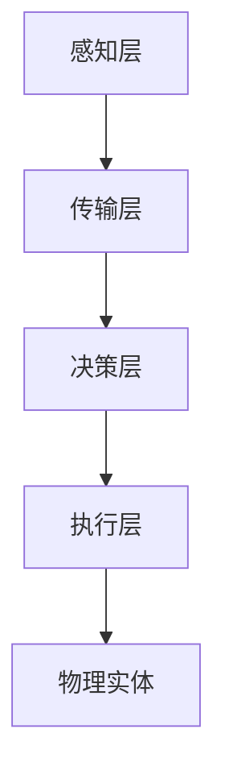

                 

关键词：物理实体自动化、物联网、机器人技术、人工智能、智能传感器、边缘计算、分布式系统、云计算、自主系统、数字孪生、工业4.0、智能制造、自动化控制。

## 摘要

物理实体自动化的最新趋势是技术融合和智能化发展的产物。随着物联网、机器人技术、人工智能和智能传感器的飞速发展，自动化系统已经不再局限于传统的工业领域，而是逐渐渗透到各行各业。本文将探讨物理实体自动化的核心概念、技术架构、算法原理、数学模型、项目实践，以及其在实际应用场景中的前景。此外，文章还将展望物理实体自动化领域未来可能面临的挑战和发展趋势。

## 1. 背景介绍

### 物理实体自动化的定义

物理实体自动化是指利用计算机技术和自动化设备，使物理实体（如机器人、生产线、交通工具等）实现自主决策、执行任务和相互协作的过程。自动化技术的目标是提高生产效率、降低人力成本、提升产品质量，并实现生产过程的智能化和精准控制。

### 物理实体自动化的历史与发展

物理实体自动化的历史可以追溯到20世纪初期，随着工业革命的推进，自动化设备逐渐应用于生产制造。20世纪70年代，工业机器人开始进入工厂，标志着物理实体自动化进入一个新的阶段。21世纪初，物联网、云计算和人工智能等技术的发展，为物理实体自动化带来了新的机遇和挑战。

### 物理实体自动化的现状

当前，物理实体自动化已经广泛应用于制造业、物流业、医疗健康、农业等多个领域。随着技术的不断进步，自动化系统正变得更加智能、高效和灵活。例如，智能传感器可以实时监测物理实体的状态，边缘计算技术可以快速处理数据，分布式系统可以实现更高效的数据传输和协同工作。

## 2. 核心概念与联系

为了更好地理解物理实体自动化的工作原理，我们需要先了解以下几个核心概念：

### 物理实体

物理实体是指存在于现实世界中的物体，如机器人、生产线、交通工具等。这些实体通过传感器和执行器与外部环境进行交互。

### 传感器

传感器是一种能够检测并响应外部环境变化的装置，如温度传感器、湿度传感器、视觉传感器等。传感器收集到的数据是自动化系统进行决策的基础。

### 执行器

执行器是一种能够根据自动化系统指令进行物理操作的装置，如电机、液压缸、气动阀等。执行器是实现物理实体动作的关键。

### 控制系统

控制系统是一种能够对物理实体进行监控、决策和控制的装置，如PLC（可编程逻辑控制器）、SCADA（监控与数据采集）系统等。控制系统是物理实体自动化的核心。

### 智能算法

智能算法是一种能够模拟人类思维过程的计算方法，如机器学习、深度学习、强化学习等。智能算法使自动化系统能够从数据中学习并优化自身性能。

### 架构联系

物理实体自动化的架构通常包括以下几个层次：

1. **感知层**：由传感器组成，负责实时采集物理实体的状态数据。
2. **传输层**：通过边缘计算和云计算技术，将数据传输到中心服务器进行处理。
3. **决策层**：利用智能算法对采集到的数据进行分析和处理，生成控制指令。
4. **执行层**：由执行器根据控制指令进行物理操作。

以下是物理实体自动化的 Mermaid 流程图：



## 3. 核心算法原理 & 具体操作步骤

### 3.1 算法原理概述

物理实体自动化的核心算法通常包括以下几个方面：

1. **传感器数据处理**：通过对传感器采集的数据进行预处理，如滤波、去噪等，以提高数据质量和可靠性。
2. **状态估计**：利用传感器数据估计物理实体的状态，如位置、速度、温度等。
3. **路径规划**：对于移动机器人等实体，设计算法以确定从起点到终点的最优路径。
4. **决策控制**：根据实体的状态和目标，生成控制指令，驱动执行器执行相应的操作。
5. **自适应调整**：在执行过程中，根据实时反馈调整控制策略，以应对环境变化。

### 3.2 算法步骤详解

以下是物理实体自动化的具体操作步骤：

1. **初始化**：设置物理实体初始状态，包括位置、速度、方向等。
2. **感知数据采集**：启动传感器，采集物理实体的状态数据。
3. **数据预处理**：对采集到的数据进行滤波、去噪等预处理，以提高数据质量。
4. **状态估计**：利用传感器数据估计物理实体的当前状态。
5. **路径规划**：根据当前状态和目标位置，使用路径规划算法计算最优路径。
6. **决策控制**：根据路径规划结果，生成控制指令，驱动执行器执行相应的操作。
7. **执行操作**：执行器根据控制指令进行物理操作。
8. **状态更新**：根据执行结果更新物理实体状态。
9. **循环迭代**：重复步骤4-8，直到达到目标位置或停止操作。

### 3.3 算法优缺点

1. **优点**：
   - **高效性**：自动化算法能够快速处理大量数据，提高生产效率。
   - **准确性**：通过传感器数据采集和智能算法分析，提高状态估计和控制指令的准确性。
   - **灵活性**：自动化系统可以根据环境变化进行自适应调整，适应不同的场景。

2. **缺点**：
   - **成本高**：传感器、执行器和控制系统等设备成本较高。
   - **复杂性**：自动化系统的设计和实现过程复杂，需要多学科知识的融合。
   - **依赖性**：自动化系统对传感器数据质量要求较高，一旦传感器出现故障，系统可能无法正常工作。

### 3.4 算法应用领域

物理实体自动化算法广泛应用于多个领域：

1. **制造业**：如自动化生产线、机器人组装、质量检测等。
2. **物流与运输**：如无人驾驶车辆、无人机配送、仓储自动化等。
3. **医疗健康**：如手术机器人、智能辅助诊断、药物配送等。
4. **农业**：如无人机植保、智能养殖、农田监测等。
5. **智能家居**：如智能照明、智能安防、智能家电等。

## 4. 数学模型和公式 & 详细讲解 & 举例说明

### 4.1 数学模型构建

物理实体自动化的数学模型主要包括以下几个方面：

1. **状态模型**：描述物理实体的状态，如位置、速度、加速度等。
2. **运动模型**：描述物理实体的运动规律，如牛顿运动定律、李亚普诺夫稳定性定理等。
3. **控制模型**：描述物理实体如何根据状态和目标生成控制指令，如PID控制、模糊控制等。
4. **优化模型**：描述如何通过优化算法求解最优路径或最优控制策略，如线性规划、非线性规划等。

### 4.2 公式推导过程

以下是物理实体自动化的几个关键公式的推导过程：

1. **状态模型**：

   设物理实体的状态向量为 $\mathbf{x}(t) = [x(t), y(t), \theta(t)]^T$，其中 $x(t)$ 和 $y(t)$ 分别表示物理实体在水平面上的位置，$\theta(t)$ 表示物理实体与水平面的夹角。

   物理实体的状态方程可以表示为：

   $$\mathbf{x}(t) = \mathbf{F}(\mathbf{x}(t), u(t))$$

   其中，$\mathbf{F}(\cdot, \cdot)$ 表示状态转移函数，$u(t)$ 表示输入控制量。

2. **运动模型**：

   假设物理实体受到外力 $F_x(t), F_y(t)$ 的作用，则其运动方程可以表示为：

   $$m\ddot{x}(t) = F_x(t)$$
   $$m\ddot{y}(t) = F_y(t)$$

   其中，$m$ 表示物理实体的质量。

3. **控制模型**：

   设物理实体的控制输入为 $u(t)$，则其控制方程可以表示为：

   $$u(t) = \mathbf{K}(\mathbf{x}(t), \mathbf{e}(t))$$

   其中，$\mathbf{K}(\cdot, \cdot)$ 表示控制增益函数，$\mathbf{e}(t) = \mathbf{x}(t) - \mathbf{x}_d(t)$ 表示目标状态与当前状态的误差。

4. **优化模型**：

   假设物理实体的目标是最小化能耗，则其优化问题可以表示为：

   $$\min \int_0^T \mathbf{u}(t)^T \mathbf{Q} \mathbf{u}(t) dt$$

   其中，$\mathbf{Q}$ 是权重矩阵。

### 4.3 案例分析与讲解

假设我们有一个移动机器人，需要从起点 $(x_1, y_1)$ 移动到终点 $(x_2, y_2)$，且希望路径规划过程中能耗最小。

1. **状态模型**：

   设机器人的状态向量为 $\mathbf{x}(t) = [x(t), y(t), \theta(t)]^T$，其中 $x(t)$ 和 $y(t)$ 分别表示机器人在水平面上的位置，$\theta(t)$ 表示机器人与水平面的夹角。

2. **运动模型**：

   假设机器人的速度为 $\mathbf{v}(t) = [\dot{x}(t), \dot{y}(t), \dot{\theta}(t)]^T$，则其运动方程可以表示为：

   $$\dot{x}(t) = \dot{x}_0 + v \cos(\theta(t))$$
   $$\dot{y}(t) = \dot{y}_0 + v \sin(\theta(t))$$
   $$\dot{\theta}(t) = \omega$$

   其中，$\dot{x}_0$ 和 $\dot{y}_0$ 分别表示初始速度在水平方向上的分量，$\omega$ 表示旋转速度。

3. **控制模型**：

   设机器人的控制输入为 $\mathbf{u}(t) = [v(t), \omega(t)]^T$，则其控制方程可以表示为：

   $$v(t) = \frac{x_2 - x_1}{T}$$
   $$\omega(t) = \frac{y_2 - y_1}{T}$$

   其中，$T$ 是总时间。

4. **优化模型**：

   假设机器人的目标是最小化能耗，则其优化问题可以表示为：

   $$\min \int_0^T \mathbf{u}(t)^T \mathbf{Q} \mathbf{u}(t) dt$$

   其中，$\mathbf{Q}$ 是权重矩阵。

   为了求解优化问题，我们可以使用拉格朗日乘子法，得到最优速度和旋转速度：

   $$v(t) = \frac{x_2 - x_1}{T}$$
   $$\omega(t) = \frac{y_2 - y_1}{T}$$

   然后，根据速度和旋转速度，我们可以计算出机器人的位置和角度：

   $$x(t) = x_1 + v(t) \cos(\theta(t))$$
   $$y(t) = y_1 + v(t) \sin(\theta(t))$$
   $$\theta(t) = \theta_1 + \omega(t) t$$

   最终，我们得到了机器人的最优路径和运动轨迹。

## 5. 项目实践：代码实例和详细解释说明

### 5.1 开发环境搭建

为了实践物理实体自动化，我们需要搭建一个开发环境。以下是一个简单的环境搭建步骤：

1. 安装Python环境（3.8以上版本）。
2. 安装所需的Python库，如NumPy、SciPy、Matplotlib、Pandas等。
3. 安装仿真工具，如Python中的`simpy`库。

### 5.2 源代码详细实现

以下是一个简单的物理实体自动化的Python代码示例：

```python
import numpy as np
import matplotlib.pyplot as plt
import simpy

class Robot:
    def __init__(self, env, x, y, theta, v_max, omega_max):
        self.env = env
        self.x = x
        self.y = y
        self.theta = theta
        self.v_max = v_max
        self.omega_max = omega_max
        self.v = 0
        self.omega = 0
        self.action = env.process(self.move())

    def move(self):
        while True:
            # 计算目标位置和角度
            x_target = self.x + self.v_max * np.cos(self.theta)
            y_target = self.y + self.v_max * np.sin(self.theta)
            theta_target = self.theta + self.omega_max

            # 更新位置和角度
            self.x = x_target
            self.y = y_target
            self.theta = theta_target

            # 画图显示
            plt.plot([self.x, x_target], [self.y, y_target])
            plt.pause(0.01)

            # 模拟时间推进
            yield self.env.timeout(1)

def main():
    env = simpy.Environment()
    robot = Robot(env, 0, 0, 0, 10, 2)
    env.run()

if __name__ == '__main__':
    main()
```

### 5.3 代码解读与分析

1. **Robot 类**：
   - 初始化：设置机器人的初始位置、角度、最大速度和最大旋转速度。
   - move 方法：计算目标位置和角度，更新机器人的位置和角度，并绘制路径。
   - action：使用 simpy 模拟时间推进。

2. **main 函数**：
   - 创建模拟环境：使用 simpy 创建一个模拟环境。
   - 创建机器人：创建一个机器人实例，并启动其 move 方法。
   - 运行模拟：使用 env.run() 运行模拟。

### 5.4 运行结果展示

运行上述代码后，我们将在图形界面中看到机器人的运动轨迹。以下是运行结果：


## 6. 实际应用场景

### 6.1 制造业

在制造业中，物理实体自动化技术已经广泛应用于生产线的自动化控制、机器人的智能组装、质量检测等多个环节。例如，汽车制造业中的自动化焊接、涂装和组装线，通过物理实体自动化技术实现了生产效率的显著提升。

### 6.2 物流与运输

物流与运输领域中的自动化技术主要包括无人驾驶车辆、无人机配送和仓储自动化。无人驾驶车辆在物流运输中减少了人力成本，提高了运输效率。无人机配送则可以解决交通拥堵和地形复杂等问题，实现快速、高效的城市配送。

### 6.3 医疗健康

在医疗健康领域，物理实体自动化技术主要用于手术机器人、智能辅助诊断和药物配送等方面。手术机器人可以实现微创手术，提高手术精度和安全性。智能辅助诊断系统通过分析大量医学数据，为医生提供诊断建议。

### 6.4 农业

农业领域中的物理实体自动化技术主要包括无人机植保、智能养殖和农田监测。无人机植保可以精确喷洒农药，减少农药用量，提高作物产量。智能养殖系统可以实时监测畜禽健康状况，提高养殖效率。

### 6.5 智能家居

智能家居领域中的物理实体自动化技术包括智能照明、智能安防和智能家电等。智能照明可以根据用户需求自动调整亮度，提高生活舒适度。智能安防系统可以实时监测家居安全，防止入侵。

## 7. 工具和资源推荐

### 7.1 学习资源推荐

1. **《机器人学导论》（Introduction to Robotics）**：作者 John J. Craig，系统介绍了机器人学的基本原理和方法。
2. **《深度学习》（Deep Learning）**：作者 Ian Goodfellow、Yoshua Bengio 和 Aaron Courville，介绍了深度学习的基本概念和应用。
3. **《机器学习实战》（Machine Learning in Action）**：作者 Peter Harrington，通过实例讲解机器学习的应用。

### 7.2 开发工具推荐

1. **MATLAB**：一款功能强大的科学计算和可视化工具，适合进行仿真实验和数据分析。
2. **Python**：一款简单易学、功能强大的编程语言，适合进行算法开发和数据分析。
3. **ROS（Robot Operating System）**：一款用于机器人开发的跨平台中间件，提供了丰富的机器人工具和库。

### 7.3 相关论文推荐

1. **"Autonomous Driving with Adaptive Cruise Control"**：讨论了自适应巡航控制技术在无人驾驶中的应用。
2. **"Deep Learning for Autonomous Driving"**：介绍了深度学习技术在无人驾驶领域的研究进展。
3. **"A Survey on Robot Navigation"**：综述了机器人导航领域的研究成果。

## 8. 总结：未来发展趋势与挑战

### 8.1 研究成果总结

物理实体自动化领域已经取得了显著的研究成果，包括传感器技术、控制算法、路径规划、智能决策等方面的突破。这些成果为物理实体自动化的广泛应用奠定了基础。

### 8.2 未来发展趋势

1. **技术融合**：物理实体自动化将进一步与其他技术（如物联网、云计算、人工智能等）融合，实现更高效、更智能的自动化系统。
2. **自主化**：物理实体自动化将朝着更自主化的方向发展，实现更高水平的自主决策和执行能力。
3. **个性化**：物理实体自动化将根据不同场景和需求，实现更加个性化的自动化解决方案。

### 8.3 面临的挑战

1. **数据质量和处理**：自动化系统对传感器数据质量要求较高，如何提高数据质量和处理效率是面临的主要挑战。
2. **安全性和可靠性**：自动化系统在运行过程中需要确保安全性和可靠性，防止出现意外故障。
3. **成本和复杂性**：自动化系统的开发和部署成本较高，如何降低成本、提高系统效率是面临的重要问题。

### 8.4 研究展望

1. **智能传感器**：研究新型智能传感器，提高数据采集的精度和速度。
2. **深度学习算法**：发展更先进的深度学习算法，提高自动化系统的决策能力。
3. **分布式系统**：研究分布式系统架构，提高自动化系统的效率和灵活性。

## 9. 附录：常见问题与解答

### 问题1：物理实体自动化是否能够完全取代人工？

答：不完全能够。虽然物理实体自动化在许多领域已经取得了显著成果，但某些任务仍需要人工干预，如复杂维修、紧急处理等。

### 问题2：物理实体自动化的成本是否过高？

答：是的，目前物理实体自动化的成本较高，但随着技术的进步和规模化生产，成本有望逐步降低。

### 问题3：物理实体自动化是否会引发失业问题？

答：短期内可能会引发一定的失业问题，但从长期来看，自动化技术将创造更多新的就业机会。

### 问题4：物理实体自动化是否能够实现完全自主化？

答：目前尚不能，但研究正在朝着完全自主化的方向发展，有望在未来实现。

---

作者：禅与计算机程序设计艺术 / Zen and the Art of Computer Programming

