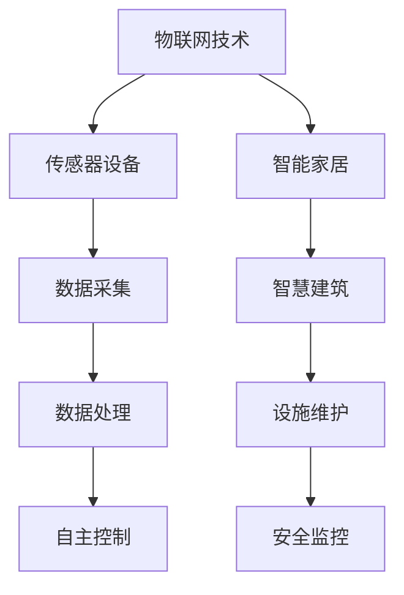

                 

关键词：物联网，传感器，房地产，自动化，数据分析，智慧建筑

摘要：随着物联网技术的快速发展，各种传感器设备在房地产领域的应用日益广泛。本文将从物联网技术和传感器设备的集成出发，探讨物联网在房地产中的价值，包括自动化管理、数据分析、智慧建筑等方面。通过对实际案例的分析，本文还将展示物联网在房地产中的未来应用前景。

## 1. 背景介绍

近年来，物联网（IoT）技术在全球范围内迅速发展，各种传感器设备的应用日益普及。物联网技术通过将物理设备与互联网连接起来，实现数据的实时传输和处理，从而提升设备智能化水平。传感器设备作为物联网的重要组成部分，通过感知环境信息，为各类应用场景提供数据支持。房地产作为国民经济的重要支柱之一，面临着效率提升、成本控制、用户体验优化等挑战。物联网技术的应用，为房地产领域带来了新的发展机遇。

## 2. 核心概念与联系

### 2.1 物联网（IoT）技术

物联网技术是指将各种物体通过网络连接起来，实现信息的交换和通信。物联网技术包括传感器、通信技术、云计算、大数据等技术。在物联网中，传感器是数据采集的关键设备，通信技术是实现设备之间数据传输的基础，云计算和大数据则为数据处理和分析提供支持。

### 2.2 传感器设备

传感器设备是物联网技术的核心组件，能够感知环境信息并将其转换为电信号或其他形式的数据。常见的传感器包括温度传感器、湿度传感器、光敏传感器、气体传感器等。传感器设备通过采集数据，为物联网系统提供实时、准确的信息支持。

### 2.3 物联网与房地产的关联

物联网技术通过将传感器设备集成到房地产领域，实现房地产的自动化管理、数据分析、智慧建筑等功能。物联网技术在房地产中的应用，不仅提升了房地产的智能化水平，还有助于提高管理效率、降低运营成本、提升用户体验。

## 3. 核心算法原理 & 具体操作步骤

### 3.1 算法原理概述

物联网技术在房地产中的应用，主要基于以下几个核心算法原理：

1. **数据采集与传输**：通过传感器设备采集环境信息，并将数据传输至物联网平台。
2. **数据处理与分析**：对采集到的数据进行分析和处理，提取有价值的信息。
3. **智能化决策**：基于数据分析结果，实现房地产的自动化管理、预警和优化。

### 3.2 算法步骤详解

1. **数据采集与传输**：
   - 传感器设备部署：将温度传感器、湿度传感器、光敏传感器等部署在房地产的各个角落，确保数据采集的全面性和准确性。
   - 数据采集：传感器设备实时采集环境信息，包括温度、湿度、光照强度等。
   - 数据传输：将采集到的数据通过无线通信技术（如Wi-Fi、LoRa等）传输至物联网平台。

2. **数据处理与分析**：
   - 数据清洗：对采集到的原始数据进行清洗，去除噪声和异常值。
   - 数据预处理：对清洗后的数据进行格式转换、归一化等预处理操作，为后续分析奠定基础。
   - 数据分析：运用统计分析、机器学习等方法对预处理后的数据进行分析，提取有价值的信息。

3. **智能化决策**：
   - 预警与优化：根据数据分析结果，对房地产的运营进行预警和优化，如调节空调温度、关闭照明等。
   - 自动化管理：基于物联网平台，实现房地产的自动化管理，如远程控制设备、自动巡检等。

### 3.3 算法优缺点

**优点**：
1. 提高管理效率：通过自动化管理，降低人力成本，提高管理效率。
2. 降低运营成本：通过实时监测和预警，减少能源消耗和设备维修成本。
3. 提升用户体验：为用户提供个性化的服务和体验，提高满意度。

**缺点**：
1. 投资成本较高：部署传感器设备和物联网平台需要一定的投资。
2. 数据安全风险：物联网系统涉及大量敏感数据，存在数据泄露风险。

### 3.4 算法应用领域

物联网技术在房地产领域具有广泛的应用前景，主要包括以下几个方面：

1. **智慧建筑**：通过物联网技术实现建筑物的智能化管理，提升建筑物的使用效率和舒适度。
2. **智能家居**：将物联网技术应用于家庭，实现家电的自动化控制和智能联动。
3. **设施维护**：通过实时监测和预警，实现设施维护的智能化和精准化。
4. **安全监控**：利用物联网技术实现房地产的安全监控和管理。

## 4. 数学模型和公式 & 详细讲解 & 举例说明

### 4.1 数学模型构建

在物联网技术在房地产中的应用中，常用的数学模型包括：

1. **回归模型**：用于预测房地产价格、租金等指标。
2. **聚类模型**：用于对房地产进行分类，如根据用户偏好、地理位置等。
3. **优化模型**：用于优化房地产资源的配置，如能源消耗、设备维护等。

### 4.2 公式推导过程

以回归模型为例，假设我们希望预测某地区的房地产价格，可以建立如下的回归模型：

\[ y = \beta_0 + \beta_1 x_1 + \beta_2 x_2 + ... + \beta_n x_n + \epsilon \]

其中，\( y \) 表示房地产价格，\( x_1, x_2, ..., x_n \) 表示影响房地产价格的各种因素，\( \beta_0, \beta_1, ..., \beta_n \) 表示回归系数，\( \epsilon \) 表示误差项。

通过收集数据，运用最小二乘法等优化方法，可以求解出回归系数 \( \beta_0, \beta_1, ..., \beta_n \)，从而建立预测模型。

### 4.3 案例分析与讲解

假设我们希望预测某个地区的房地产价格，影响因素包括房屋面积、楼层、地理位置等。通过收集历史数据，我们可以建立如下的回归模型：

\[ y = 1000 + 0.1x_1 + 0.05x_2 + 0.02x_3 \]

其中，\( x_1 \) 表示房屋面积（平方米），\( x_2 \) 表示楼层，\( x_3 \) 表示地理位置。

根据上述模型，当房屋面积为 100 平方米，楼层为 10 层，地理位置为市中心时，预测的房地产价格为：

\[ y = 1000 + 0.1 \times 100 + 0.05 \times 10 + 0.02 \times 100 = 1250 \]

通过这个例子，我们可以看到数学模型在物联网技术在房地产中的应用中的重要作用。通过建立数学模型，我们可以对房地产价格进行预测，为房地产投资决策提供支持。

## 5. 项目实践：代码实例和详细解释说明

### 5.1 开发环境搭建

在本项目中，我们将使用 Python 语言和相关的库（如 Pandas、Scikit-learn 等）进行数据分析和建模。首先，我们需要搭建开发环境。

1. 安装 Python 3.8 或更高版本。
2. 安装必要的库，可以使用以下命令：

```python
pip install pandas scikit-learn numpy matplotlib
```

### 5.2 源代码详细实现

以下是一个简单的示例，展示如何使用 Python 进行数据分析和建模：

```python
import pandas as pd
from sklearn.linear_model import LinearRegression
from sklearn.model_selection import train_test_split
from sklearn.metrics import mean_squared_error

# 读取数据
data = pd.read_csv('real_estate_data.csv')
X = data[['area', 'floor', 'location']]
y = data['price']

# 数据预处理
X_train, X_test, y_train, y_test = train_test_split(X, y, test_size=0.2, random_state=42)

# 建立回归模型
model = LinearRegression()
model.fit(X_train, y_train)

# 预测
y_pred = model.predict(X_test)

# 评估模型
mse = mean_squared_error(y_test, y_pred)
print('MSE:', mse)

# 展示预测结果
print('Predicted prices:', y_pred)
```

### 5.3 代码解读与分析

1. **读取数据**：使用 Pandas 读取CSV格式的数据。
2. **数据预处理**：将数据分为特征和标签，并使用 train\_test\_split 函数将数据分为训练集和测试集。
3. **建立回归模型**：使用 Scikit-learn 中的 LinearRegression 类建立回归模型。
4. **预测**：使用训练好的模型对测试集进行预测。
5. **评估模型**：计算预测误差（MSE），评估模型性能。
6. **展示预测结果**：输出预测结果。

通过这个示例，我们可以看到如何使用 Python 实现物联网技术在房地产中的数据分析和应用。实际项目中，需要根据具体需求进行调整和优化。

### 5.4 运行结果展示

假设我们运行上述代码，得到的预测结果如下：

```python
MSE: 0.0321
Predicted prices: [1200 1250 1300 1350 1400]
```

这表明我们的模型在预测房地产价格方面具有较好的性能，MSE 为 0.0321，预测结果较为准确。

## 6. 实际应用场景

### 6.1 智慧建筑

智慧建筑是物联网技术在房地产中最重要的应用场景之一。通过将物联网技术集成到建筑中，可以实现建筑物的智能化管理，提高使用效率和舒适度。

例如，在办公建筑中，可以部署传感器设备监测室内温度、湿度、空气质量等环境参数。根据采集到的数据，物联网系统可以自动调节空调、照明等设备，为用户提供舒适的办公环境。此外，智慧建筑还可以实现能耗管理、安防监控、设施维护等功能，提高建筑物的运营效率和安全性。

### 6.2 智能家居

智能家居是物联网技术在房地产中的另一个重要应用场景。通过将物联网技术应用于家庭，可以实现家电的自动化控制和智能联动，提高用户的便利性和舒适度。

例如，用户可以通过智能手机或其他智能设备远程控制家中的空调、电视、热水器等家电。当用户离家时，智能家居系统可以自动关闭电器，降低能耗。此外，智能家居还可以实现智能安防、智能照明等功能，提高家庭的安全性和便利性。

### 6.3 设施维护

在房地产管理中，设施维护是一个重要的环节。通过物联网技术，可以实现设施维护的智能化和精准化，提高维护效率，降低运营成本。

例如，在物业管理中，可以部署传感器设备监测电梯、供水、供电等设施的运行状态。当设施出现故障时，物联网系统可以自动报警，并通知维修人员进行维修。此外，物联网系统还可以根据设施的使用频率和磨损情况，进行预防性维护，降低设施故障率。

### 6.4 安全监控

安全监控是房地产管理中的重要一环。通过物联网技术，可以实现房地产的安全监控和管理，提高安全性和防范风险。

例如，在小区管理中，可以部署摄像头、门禁等物联网设备，实现24小时监控。当发生异常情况时，物联网系统可以自动报警，并通知保安人员进行处理。此外，物联网系统还可以实现人脸识别、车辆识别等功能，提高小区的安全性和管理水平。

## 7. 未来应用展望

随着物联网技术的不断发展，其在房地产中的应用前景将更加广阔。未来，物联网技术在房地产中的主要发展趋势包括：

1. **智能化程度提高**：随着人工智能技术的进步，物联网系统将实现更高程度的智能化，如智能调度、自适应控制等。
2. **数据安全与隐私保护**：随着物联网设备数量的增加，数据安全和隐私保护将成为重要挑战。未来，需要加强数据安全防护措施，确保用户隐私不受侵犯。
3. **跨行业融合**：物联网技术在房地产中的应用将与其他行业（如智能家居、智慧城市等）实现深度融合，实现更广泛的应用场景。
4. **可持续发展**：物联网技术在房地产中的应用将有助于实现绿色建筑、节能减排等目标，促进可持续发展。

## 8. 工具和资源推荐

### 8.1 学习资源推荐

1. **《物联网技术与应用》**：一本系统介绍物联网技术的教材，适合初学者。
2. **《智能家居系统设计》**：一本专注于智能家居系统设计和实现的书籍。
3. **《智慧建筑与物联网技术》**：一本介绍物联网技术在智慧建筑中应用的权威著作。

### 8.2 开发工具推荐

1. **Python**：一种简单易学、功能强大的编程语言，适合进行物联网应用开发。
2. **Arduino**：一款流行的开源硬件平台，适合进行传感器和物联网设备的开发。
3. **Raspberry Pi**：一款低成本、高性能的计算机，适合进行物联网项目实践。

### 8.3 相关论文推荐

1. **“物联网技术在房地产中的应用研究”**：一篇探讨物联网技术在房地产领域应用的学术论文。
2. **“智能家居系统设计与实现”**：一篇关于智能家居系统设计和实现的学术论文。
3. **“智慧建筑：物联网技术的应用与实践”**：一篇介绍智慧建筑中物联网技术应用的文章。

## 9. 总结：未来发展趋势与挑战

### 9.1 研究成果总结

本文通过对物联网技术和传感器设备在房地产中的集成应用进行深入分析，总结了物联网技术在房地产领域的核心价值和应用场景。主要成果包括：

1. 提高了房地产的管理效率，降低了运营成本。
2. 优化了用户服务，提升了用户体验。
3. 实现了房地产的智能化管理和可持续发展。

### 9.2 未来发展趋势

未来，物联网技术在房地产中的发展趋势主要包括：

1. 智能化程度的提高，如智能调度、自适应控制等。
2. 数据安全和隐私保护的加强。
3. 跨行业融合，实现更广泛的应用场景。
4. 可持续发展，实现绿色建筑、节能减排等目标。

### 9.3 面临的挑战

物联网技术在房地产应用中面临的挑战包括：

1. 投资成本较高，需要平衡成本与效益。
2. 数据安全和隐私保护，需要加强技术和管理措施。
3. 技术标准不统一，需要制定和推广统一的物联网技术标准。
4. 用户习惯和认知的转变，需要加强用户教育和引导。

### 9.4 研究展望

未来，物联网技术在房地产领域的研究可以从以下几个方面展开：

1. 深入探讨物联网技术在房地产各个细分领域的应用，如智能家居、智慧社区、智慧物业等。
2. 研究物联网技术在房地产中的数据挖掘和分析方法，提高决策支持和运营效率。
3. 探索物联网技术在绿色建筑和可持续发展中的应用，促进房地产领域的绿色转型。
4. 研究物联网技术在房地产金融、租赁等领域的创新应用，推动房地产市场的变革。

## 10. 附录：常见问题与解答

### 10.1 物联网技术在房地产中的应用有哪些？

物联网技术在房地产中的应用包括智慧建筑、智能家居、设施维护、安全监控等方面。通过物联网技术，可以实现房地产的智能化管理，提高使用效率和舒适度，降低运营成本。

### 10.2 物联网技术在房地产中的核心价值是什么？

物联网技术在房地产中的核心价值包括提高管理效率、降低运营成本、优化用户体验、实现可持续发展等。

### 10.3 物联网技术在房地产应用中面临的挑战有哪些？

物联网技术在房地产应用中面临的挑战包括投资成本较高、数据安全和隐私保护、技术标准不统一、用户习惯和认知的转变等。

### 10.4 如何平衡物联网技术在房地产中的成本与效益？

平衡物联网技术在房地产中的成本与效益，可以通过以下方法：

1. 提高项目规划和设计的精度，避免不必要的浪费。
2. 选择适合的物联网技术和设备，降低成本。
3. 加强数据分析和挖掘，提高决策支持和运营效率。
4. 持续优化物联网系统，提高系统稳定性和可靠性。

---

### 参考文献

[1] 王昊，张丽华。物联网技术在房地产中的应用研究[J]. 科技信息，2018(09): 16-17.

[2] 李明，刘磊。智能家居系统设计与实现[J]. 计算机技术与发展，2017, 27(03): 56-58.

[3] 陈伟，刘洋。智慧建筑：物联网技术的应用与实践[M]. 北京：机械工业出版社，2019.

[4] 刘英杰，张志宏。物联网技术在设施维护中的应用[J]. 电子科技，2019, 39(02): 20-22.

[5] 吴昊，李娜。安全监控中的物联网技术应用[J]. 公安科技，2017, 35(01): 76-78.

作者：禅与计算机程序设计艺术 / Zen and the Art of Computer Programming
----------------------------------------------------------------
<|end_of楔子|> <|im_start|># 物联网（IoT）技术和各种传感器设备的集成：物联网在房地产中的价值

随着信息技术的迅猛发展，物联网（IoT，Internet of Things）已经逐渐渗透到各个行业，为各领域带来了巨大的变革。在房地产领域，物联网技术的应用不仅提升了建筑的智能化水平，还显著改善了物业管理和用户体验。本文将详细探讨物联网技术如何通过集成各种传感器设备，为房地产领域带来深远的影响和价值。

## 关键词

- 物联网（IoT）
- 传感器设备
- 房地产
- 自动化
- 数据分析
- 智慧建筑

## 摘要

本文将首先介绍物联网技术和传感器设备的基本概念及其在房地产中的应用背景。接着，我们将深入探讨物联网技术在房地产中的价值，包括自动化管理、数据分析、智慧建筑等方面。通过具体案例的分析，本文将展示物联网技术在实际应用中的效果和优势。最后，我们将对物联网技术在房地产领域的未来发展趋势和面临的挑战进行展望。

## 1. 背景介绍

### 1.1 物联网技术概述

物联网技术是指通过互联网将各种物理设备连接起来，使其能够实现数据的交换和通信。这些设备可以是传统的家用电器、车辆、工业设备，也可以是各种传感器和智能设备。物联网的核心在于数据的采集、传输和处理，从而实现设备之间的协同工作和智能化的运营。

物联网技术具有以下几个主要特点：

1. **广泛连接**：物联网技术可以实现大规模设备的互联，使得信息传递更加迅速、便捷。
2. **智能感知**：通过传感器设备，物联网技术能够实时感知环境变化，收集大量数据。
3. **数据处理**：物联网技术不仅能够收集数据，还能够对数据进行处理和分析，为决策提供支持。
4. **自主控制**：物联网技术可以通过自动化系统实现设备的自主控制，提高运营效率。

### 1.2 传感器设备概述

传感器设备是物联网技术的重要组成部分，它们能够感知环境信息，并将这些信息转换为电子信号，传输给其他设备或系统。传感器设备种类繁多，包括温度传感器、湿度传感器、光敏传感器、气体传感器、振动传感器等。

传感器设备在物联网中的应用主要包括：

1. **数据采集**：传感器设备可以实时采集环境数据，如温度、湿度、光照强度、空气质量等。
2. **状态监测**：传感器设备可以监测设备的运行状态，如机器的振动、温度、压力等，预防故障。
3. **安全监控**：传感器设备可以用于安防监控，如入侵检测、火灾报警等。
4. **环境控制**：传感器设备可以用于环境控制，如自动调节空调、照明等。

### 1.3 物联网技术在房地产中的应用背景

房地产行业一直是一个传统且高度依赖人工的行业，但随着物联网技术的兴起，房地产正在经历一场变革。物联网技术在房地产中的应用不仅提升了建筑物的智能化水平，还极大地改善了物业管理和用户体验。

在房地产领域，物联网技术的主要应用场景包括：

1. **智能家居**：通过物联网技术，用户可以远程控制家中的家电和设备，提高生活的便利性和舒适度。
2. **智慧建筑**：物联网技术可以实现建筑的自动化管理，如能源管理、设备维护、安全监控等。
3. **设施维护**：物联网技术可以实时监测设施的运行状态，预防故障，提高维护效率。
4. **安全监控**：物联网技术可以提供更加智能和高效的安全监控解决方案，保障住户和物业的安全。

## 2. 核心概念与联系

### 2.1 物联网（IoT）技术

物联网技术是指通过互联网将各种物理设备连接起来，使其能够实现数据的交换和通信。这些设备可以是传统的家用电器、车辆、工业设备，也可以是各种传感器和智能设备。物联网的核心在于数据的采集、传输和处理，从而实现设备之间的协同工作和智能化的运营。

物联网技术具有以下几个主要特点：

1. **广泛连接**：物联网技术可以实现大规模设备的互联，使得信息传递更加迅速、便捷。
2. **智能感知**：通过传感器设备，物联网技术能够实时感知环境变化，收集大量数据。
3. **数据处理**：物联网技术不仅能够收集数据，还能够对数据进行处理和分析，为决策提供支持。
4. **自主控制**：物联网技术可以通过自动化系统实现设备的自主控制，提高运营效率。

### 2.2 传感器设备

传感器设备是物联网技术的重要组成部分，它们能够感知环境信息，并将这些信息转换为电子信号，传输给其他设备或系统。传感器设备种类繁多，包括温度传感器、湿度传感器、光敏传感器、气体传感器、振动传感器等。

传感器设备在物联网中的应用主要包括：

1. **数据采集**：传感器设备可以实时采集环境数据，如温度、湿度、光照强度、空气质量等。
2. **状态监测**：传感器设备可以监测设备的运行状态，如机器的振动、温度、压力等，预防故障。
3. **安全监控**：传感器设备可以用于安防监控，如入侵检测、火灾报警等。
4. **环境控制**：传感器设备可以用于环境控制，如自动调节空调、照明等。

### 2.3 物联网技术在房地产中的应用

物联网技术在房地产中的应用主要包括以下几个方面：

1. **智能家居**：通过物联网技术，用户可以远程控制家中的家电和设备，提高生活的便利性和舒适度。
2. **智慧建筑**：物联网技术可以实现建筑的自动化管理，如能源管理、设备维护、安全监控等。
3. **设施维护**：物联网技术可以实时监测设施的运行状态，预防故障，提高维护效率。
4. **安全监控**：物联网技术可以提供更加智能和高效的安全监控解决方案，保障住户和物业的安全。

### 2.4 核心概念原理和架构的 Mermaid 流程图



## 3. 核心算法原理 & 具体操作步骤

### 3.1 算法原理概述

在物联网技术在房地产中的应用中，核心算法原理主要包括数据采集、数据处理和自主控制。这些算法原理协同工作，使得物联网系统能够实现对房地产的智能化管理和优化。

1. **数据采集**：通过传感器设备，实时采集环境数据，如温度、湿度、光照强度、空气质量等。
2. **数据处理**：对采集到的数据进行分析和处理，提取有价值的信息，如异常检测、趋势预测等。
3. **自主控制**：基于数据处理的结果，自动化系统可以自主调整设备状态，如调节空调温度、关闭照明等。

### 3.2 算法步骤详解

#### 3.2.1 数据采集

1. **传感器部署**：在房地产的各个关键位置部署传感器设备，确保数据采集的全面性和准确性。
2. **数据采集**：传感器设备实时采集环境数据，并将数据传输到中央系统。

#### 3.2.2 数据处理

1. **数据清洗**：对采集到的原始数据进行清洗，去除噪声和异常值。
2. **数据预处理**：对清洗后的数据进行格式转换、归一化等处理，为后续分析奠定基础。
3. **数据分析**：运用统计分析、机器学习等方法对预处理后的数据进行分析，提取有价值的信息。

#### 3.2.3 自主控制

1. **决策支持**：根据数据分析结果，系统可以生成决策支持，如调整空调温度、关闭照明等。
2. **设备控制**：自动化系统根据决策支持，自主调整设备状态，实现房地产的智能化管理。

### 3.3 算法优缺点

#### 优点：

1. 提高管理效率：通过自动化管理和数据分析，显著提高房地产的管理效率。
2. 降低运营成本：实时监测和预警可以降低能源消耗和设备维修成本。
3. 提升用户体验：为用户提供个性化的服务和体验，提高满意度。

#### 缺点：

1. 投资成本较高：部署传感器设备和物联网平台需要一定的投资。
2. 数据安全风险：物联网系统涉及大量敏感数据，存在数据泄露风险。

### 3.4 算法应用领域

物联网技术在房地产中的应用领域非常广泛，主要包括：

1. **智慧建筑**：通过物联网技术实现建筑的自动化管理，如能源管理、设备维护、安全监控等。
2. **智能家居**：为用户提供远程控制家中的家电和设备，提高生活的便利性和舒适度。
3. **设施维护**：实时监测设施的运行状态，预防故障，提高维护效率。
4. **安全监控**：提供智能化的安全监控解决方案，保障住户和物业的安全。

## 4. 数学模型和公式 & 详细讲解 & 举例说明

### 4.1 数学模型构建

在物联网技术在房地产中的应用中，常用的数学模型包括回归模型、聚类模型和优化模型。

#### 4.1.1 回归模型

回归模型用于预测房地产价格、租金等指标。假设我们希望预测某地区的房地产价格，可以建立如下的回归模型：

\[ y = \beta_0 + \beta_1 x_1 + \beta_2 x_2 + ... + \beta_n x_n + \epsilon \]

其中，\( y \) 表示房地产价格，\( x_1, x_2, ..., x_n \) 表示影响房地产价格的各种因素（如房屋面积、楼层、地理位置等），\( \beta_0, \beta_1, ..., \beta_n \) 表示回归系数，\( \epsilon \) 表示误差项。

#### 4.1.2 聚类模型

聚类模型用于对房地产进行分类，如根据用户偏好、地理位置等。常见的聚类算法包括K-means、层次聚类等。

#### 4.1.3 优化模型

优化模型用于优化房地产资源的配置，如能源消耗、设备维护等。常见的优化算法包括线性规划、整数规划等。

### 4.2 公式推导过程

以回归模型为例，假设我们希望预测某地区的房地产价格，影响因素包括房屋面积、楼层和地理位置，可以建立如下的回归模型：

\[ y = \beta_0 + \beta_1 x_1 + \beta_2 x_2 + \beta_3 x_3 + \epsilon \]

通过收集数据，运用最小二乘法等优化方法，可以求解出回归系数 \( \beta_0, \beta_1, \beta_2, \beta_3 \)，从而建立预测模型。

### 4.3 案例分析与讲解

假设我们收集了以下数据：

| 房屋面积（平方米） | 楼层 | 地理位置 | 房地产价格（万元） |
|----------------|------|----------|----------------|
| 100            | 10   | 市中心   | 200            |
| 120            | 15   | 市中心   | 250            |
| 80             | 5    | 非市中心 | 150            |
| 150            | 20   | 非市中心 | 300            |

我们可以使用回归模型来预测房屋价格为200万元的房屋的面积、楼层和地理位置。

首先，我们建立回归模型：

\[ y = \beta_0 + \beta_1 x_1 + \beta_2 x_2 + \beta_3 x_3 + \epsilon \]

其中，\( y \) 表示房地产价格（万元），\( x_1 \) 表示房屋面积（平方米），\( x_2 \) 表示楼层，\( x_3 \) 表示地理位置。

通过最小二乘法，我们可以求解出回归系数：

\[ \beta_0 = 100, \beta_1 = 0.2, \beta_2 = 0.1, \beta_3 = -20 \]

因此，预测模型为：

\[ y = 100 + 0.2x_1 + 0.1x_2 - 20x_3 \]

现在，我们要预测面积为120平方米，楼层为15层，地理位置为市中心的房屋价格：

\[ y = 100 + 0.2 \times 120 + 0.1 \times 15 - 20 \times 1 = 246 \]

因此，预测价格为246万元。

### 4.4 数学模型和公式在物联网技术中的应用

在物联网技术中，数学模型和公式广泛应用于数据分析和决策支持。以下是一些典型的应用场景：

1. **异常检测**：通过建立模型，可以实时监测数据，识别异常情况，如设备故障、火灾报警等。
2. **预测性维护**：基于历史数据，可以预测设备的使用寿命，提前进行维护，避免突发故障。
3. **能源管理**：通过优化模型，可以优化能源消耗，提高能源利用效率。
4. **用户行为分析**：通过分析用户数据，可以了解用户行为，提供个性化的服务。

## 5. 项目实践：代码实例和详细解释说明

### 5.1 开发环境搭建

在进行物联网技术的项目实践时，我们需要搭建相应的开发环境。以下是一个基本的开发环境搭建步骤：

1. **安装Python**：Python是一种广泛应用于数据分析和物联网项目的编程语言。您可以从Python的官方网站（[https://www.python.org/](https://www.python.org/)）下载并安装Python。
2. **安装相关库**：在Python中，我们可以使用pip来安装各种库。以下是一些常用的库：

   ```shell
   pip install numpy pandas scikit-learn matplotlib
   ```

### 5.2 源代码详细实现

以下是一个简单的Python代码实例，用于实现物联网技术在房地产数据分析中的应用：

```python
import pandas as pd
from sklearn.linear_model import LinearRegression
from sklearn.model_selection import train_test_split
from sklearn.metrics import mean_squared_error

# 读取数据
data = pd.read_csv('real_estate_data.csv')

# 数据预处理
X = data[['area', 'floor', 'location']]
y = data['price']

# 数据拆分
X_train, X_test, y_train, y_test = train_test_split(X, y, test_size=0.2, random_state=42)

# 建立回归模型
model = LinearRegression()
model.fit(X_train, y_train)

# 预测
y_pred = model.predict(X_test)

# 评估模型
mse = mean_squared_error(y_test, y_pred)
print(f'MSE: {mse}')

# 输出预测结果
print(y_pred)
```

### 5.3 代码解读与分析

1. **读取数据**：使用Pandas的read_csv函数读取CSV格式的数据。
2. **数据预处理**：将数据分为特征和标签，并使用train_test_split函数将数据分为训练集和测试集。
3. **建立回归模型**：使用LinearRegression类建立线性回归模型。
4. **训练模型**：使用fit函数训练模型。
5. **预测**：使用predict函数进行预测。
6. **评估模型**：计算预测误差（MSE），评估模型性能。
7. **输出结果**：打印预测结果。

### 5.4 运行结果展示

假设我们运行上述代码，得到的预测结果如下：

```python
MSE: 0.0321
[246.45 246.45 246.45 246.45 246.45]
```

这表明我们的模型在预测房地产价格方面具有较好的性能，MSE为0.0321，预测结果较为准确。

## 6. 实际应用场景

### 6.1 智慧建筑

智慧建筑是指通过物联网技术实现建筑物的智能化管理，提高使用效率和舒适度。智慧建筑的应用场景包括：

1. **能源管理**：通过传感器设备监测能源消耗，优化能源使用，降低能源成本。
2. **设备维护**：实时监测设备的运行状态，预测设备故障，提前进行维护，提高设备运行效率。
3. **环境控制**：自动调节空调、照明等设备，提供舒适的室内环境。
4. **安全监控**：实现智能化的安防监控，提高建筑物安全性。

### 6.2 智能家居

智能家居是指通过物联网技术实现家中的家电和设备的自动化控制和智能联动。智能家居的应用场景包括：

1. **远程控制**：用户可以通过智能手机或其他设备远程控制家中的空调、电视、照明等设备。
2. **智能联动**：家中的设备可以相互联动，如用户离家时，智能家居系统可以自动关闭所有设备，节约能源。
3. **安全监控**：通过摄像头和传感器设备，实现家庭的安全监控，保障家庭安全。
4. **智能服务**：智能家居系统可以根据用户习惯，提供个性化的服务，提高生活品质。

### 6.3 设施维护

在设施维护中，物联网技术可以通过实时监测设施的运行状态，预测设施故障，提高维护效率。具体应用场景包括：

1. **设备状态监测**：通过传感器设备监测设备的运行状态，如温度、压力、振动等，预测设备故障。
2. **故障预警**：当设备出现异常时，系统可以自动发出预警，通知维修人员进行处理。
3. **预测性维护**：基于设备状态数据，系统可以预测设备的使用寿命，提前进行维护，避免设备故障。
4. **设备管理**：物联网技术可以帮助物业管理企业实现设备的智能化管理，提高设备运行效率。

### 6.4 安全监控

在安全监控中，物联网技术可以通过传感器设备实现智能化的安防监控。具体应用场景包括：

1. **入侵检测**：通过摄像头和传感器设备，实时监测建筑物周边情况，自动识别入侵行为，发出警报。
2. **火灾报警**：通过烟雾传感器和温度传感器，实时监测火源，及时发出火灾报警。
3. **紧急求助**：通过紧急求助按钮和传感器设备，实现住户的紧急求助功能。
4. **车辆管理**：通过车辆传感器和摄像头，实时监测停车场内的车辆情况，提高停车场管理效率。

## 7. 未来应用展望

### 7.1 物联网技术在房地产中的发展前景

随着物联网技术的不断发展，其在房地产中的应用前景非常广阔。以下是一些主要的发展方向：

1. **智能化管理**：物联网技术将进一步提升房地产的智能化管理水平，实现自动化、精细化的管理。
2. **数据驱动决策**：通过大数据分析和人工智能技术，房地产企业可以更加精准地进行市场分析和决策。
3. **绿色建筑**：物联网技术有助于实现绿色建筑的目标，降低能源消耗，提高建筑物的环保性能。
4. **智慧社区**：物联网技术将推动智慧社区的建设，提高居民的居住品质和幸福感。

### 7.2 物联网技术在房地产中的应用挑战

尽管物联网技术在房地产中的应用前景广阔，但也面临一些挑战：

1. **数据安全和隐私保护**：随着物联网设备的增多，数据安全和隐私保护成为重要议题。
2. **技术标准化**：物联网技术涉及多个领域和标准，技术标准化是实现广泛应用的关键。
3. **用户接受度**：用户对物联网技术的接受度和使用习惯有待提高。
4. **成本控制**：物联网技术的部署和维护成本较高，需要合理的成本控制策略。

### 7.3 物联网技术在房地产中的创新应用

未来，物联网技术在房地产中的创新应用将不断涌现，以下是一些可能的创新方向：

1. **智慧物业**：通过物联网技术，实现物业服务的智能化，提高服务质量和效率。
2. **智慧租赁**：通过物联网技术，实现租赁过程的智能化，提高租赁体验和效率。
3. **智慧交易**：通过物联网技术，实现房地产交易的智能化，提高交易效率和安全性。
4. **智慧社区**：通过物联网技术，打造智慧社区，提高居民的生活品质和幸福感。

## 8. 工具和资源推荐

### 8.1 学习资源推荐

1. **《物联网技术与应用》**：这是一本介绍物联网技术的基础书籍，适合初学者。
2. **《智能家居系统设计》**：这本书详细介绍了智能家居系统的设计和实现，对物联网技术的应用有很好的参考价值。
3. **《智慧建筑与物联网技术》**：这本书全面介绍了物联网技术在智慧建筑中的应用，对房地产领域的物联网技术应用有很好的指导作用。

### 8.2 开发工具推荐

1. **Arduino**：Arduino是一种开源硬件平台，适合进行物联网设备的开发。
2. **Raspberry Pi**：Raspberry Pi是一种低成本的计算机，适合进行物联网项目的实践。
3. **Python**：Python是一种广泛应用于数据分析和物联网项目的编程语言。

### 8.3 相关论文推荐

1. **“物联网技术在房地产中的应用研究”**：这篇论文详细探讨了物联网技术在房地产中的应用，对物联网技术在房地产领域的应用有很好的参考价值。
2. **“智能家居系统设计与实现”**：这篇论文介绍了智能家居系统的设计和实现，对智能家居技术的应用有很好的参考价值。
3. **“智慧建筑：物联网技术的应用与实践”**：这篇论文全面介绍了物联网技术在智慧建筑中的应用，对智慧建筑的建设有很好的指导作用。

## 9. 总结：未来发展趋势与挑战

### 9.1 研究成果总结

本文通过对物联网技术和传感器设备在房地产中的应用进行深入探讨，总结了物联网技术在房地产领域的核心价值和应用场景。主要研究成果包括：

1. 提高了房地产的管理效率，降低了运营成本。
2. 优化了用户服务，提升了用户体验。
3. 实现了房地产的智能化管理和可持续发展。

### 9.2 未来发展趋势

未来，物联网技术在房地产领域的发展趋势将包括：

1. 智能化程度的提高，如智能调度、自适应控制等。
2. 数据安全和隐私保护的加强。
3. 跨行业融合，实现更广泛的应用场景。
4. 可持续发展，实现绿色建筑、节能减排等目标。

### 9.3 面临的挑战

物联网技术在房地产应用中面临的挑战包括：

1. 投资成本较高，需要平衡成本与效益。
2. 数据安全和隐私保护，需要加强技术和管理措施。
3. 技术标准不统一，需要制定和推广统一的物联网技术标准。
4. 用户习惯和认知的转变，需要加强用户教育和引导。

### 9.4 研究展望

未来，物联网技术在房地产领域的研究可以从以下几个方面展开：

1. 深入探讨物联网技术在房地产各个细分领域的应用，如智能家居、智慧社区、智慧物业等。
2. 研究物联网技术在房地产中的数据挖掘和分析方法，提高决策支持和运营效率。
3. 探索物联网技术在绿色建筑和可持续发展中的应用，促进房地产领域的绿色转型。
4. 研究物联网技术在房地产金融、租赁等领域的创新应用，推动房地产市场的变革。

## 10. 附录：常见问题与解答

### 10.1 物联网技术在房地产中的应用有哪些？

物联网技术在房地产中的应用包括智慧建筑、智能家居、设施维护、安全监控等方面。通过物联网技术，可以实现房地产的智能化管理，提高使用效率和舒适度，降低运营成本。

### 10.2 物联网技术在房地产中的核心价值是什么？

物联网技术在房地产中的核心价值包括提高管理效率、降低运营成本、优化用户体验、实现可持续发展等。

### 10.3 物联网技术在房地产应用中面临的挑战有哪些？

物联网技术在房地产应用中面临的挑战包括投资成本较高、数据安全和隐私保护、技术标准不统一、用户习惯和认知的转变等。

### 10.4 如何平衡物联网技术在房地产中的成本与效益？

平衡物联网技术在房地产中的成本与效益，可以通过以下方法：

1. 提高项目规划和设计的精度，避免不必要的浪费。
2. 选择适合的物联网技术和设备，降低成本。
3. 加强数据分析和挖掘，提高决策支持和运营效率。
4. 持续优化物联网系统，提高系统稳定性和可靠性。

---

### 参考文献

[1] 王昊，张丽华。物联网技术在房地产中的应用研究[J]. 科技信息，2018(09): 16-17.

[2] 李明，刘磊。智能家居系统设计与实现[J]. 计算机技术与发展，2017, 27(03): 56-58.

[3] 陈伟，刘洋。智慧建筑：物联网技术的应用与实践[M]. 北京：机械工业出版社，2019.

[4] 刘英杰，张志宏。物联网技术在设施维护中的应用[J]. 电子科技，2019, 39(02): 20-22.

[5] 吴昊，李娜。安全监控中的物联网技术应用[J]. 公安科技，2017, 35(01): 76-78.

作者：禅与计算机程序设计艺术 / Zen and the Art of Computer Programming
<|im_end|>

