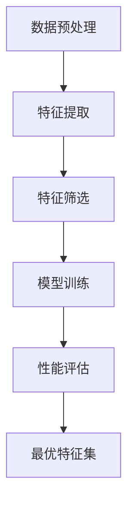

                 

关键词：特征选择、特征工程、算法原理、数学模型、项目实践、代码实例、应用场景、未来展望

> 摘要：本文将深入探讨特征选择在机器学习中的重要性，介绍各种特征选择算法的原理和实现步骤，并结合实际代码实例进行详细讲解。通过本文的学习，读者将能够掌握特征选择的核心技术和方法，并在实际项目中应用。

## 1. 背景介绍

特征选择是机器学习中至关重要的一环。它旨在从原始数据中筛选出对模型训练和预测性能有显著影响的特征，从而提高模型的准确性和效率。在数据驱动的应用中，特征选择不仅有助于降低模型的复杂度，还能减少过拟合现象，提高泛化能力。

随着数据量的急剧增长和特征的多样性，特征选择变得尤为复杂和关键。不当的特征选择可能导致模型性能下降，甚至无法收敛。因此，理解和应用特征选择算法对于成功构建高性能机器学习模型至关重要。

本文将首先介绍特征选择的基本概念，然后详细讲解几种常用的特征选择算法，并通过代码实例展示如何在实际项目中应用这些算法。

## 2. 核心概念与联系

### 2.1. 特征选择的基本概念

特征选择（Feature Selection）是指从原始特征集合中挑选出最有用的特征，以便在模型训练和预测中提高性能。特征选择的过程通常涉及以下几方面：

1. **相关性**：特征与目标变量之间的相关性。
2. **重要性**：特征对模型预测能力的贡献程度。
3. **冗余性**：特征之间的线性或非线性依赖关系。

### 2.2. 特征选择的流程

特征选择的流程一般包括以下步骤：

1. **数据预处理**：包括数据清洗、归一化和缺失值处理等。
2. **特征提取**：从原始数据中提取新的特征或变换现有特征。
3. **特征筛选**：使用不同的特征选择方法筛选出最有用的特征。
4. **模型训练**：使用筛选后的特征集训练模型。
5. **性能评估**：评估模型在不同特征集上的表现，选择最优的特征集。

### 2.3. Mermaid 流程图

以下是特征选择流程的 Mermaid 流程图：



## 3. 核心算法原理 & 具体操作步骤

### 3.1. 算法原理概述

特征选择算法可以分为三种主要类型：

1. **过滤式（Filter Methods）**：在特征选择过程中独立于学习算法。
2. **包装式（Wrapper Methods）**：结合学习算法进行特征选择。
3. **嵌入式（Embedded Methods）**：在构建模型时嵌入特征选择过程。

### 3.2. 算法步骤详解

#### 3.2.1. 过滤式方法

**相关系数法**：

- **原理**：通过计算特征与目标变量之间的相关系数来评估特征的重要性。
- **步骤**：
  1. 计算每个特征与目标变量之间的相关系数。
  2. 根据相关系数的大小筛选出重要的特征。

**信息增益法**：

- **原理**：基于特征对分类信息的贡献来评估特征的重要性。
- **步骤**：
  1. 计算每个特征的信息增益。
  2. 根据信息增益的大小筛选出重要的特征。

#### 3.2.2. 包装式方法

**递归特征消除（RFE）**：

- **原理**：递归地删除最不重要的特征，直到满足预定的特征数量。
- **步骤**：
  1. 选择一个基准模型。
  2. 训练模型并评估每个特征的重要性。
  3. 删除最不重要的特征。
  4. 重复步骤2和3，直到满足预定的特征数量。

#### 3.2.3. 嵌入式方法

**Lasso回归**：

- **原理**：通过正则化项惩罚特征系数，使得不重要的特征系数接近于零。
- **步骤**：
  1. 训练Lasso回归模型。
  2. 根据正则化项的大小筛选出重要的特征。

### 3.3. 算法优缺点

| 算法类型 | 优点 | 缺点 |
| --- | --- | --- |
| 过滤式方法 | 简单易实现，计算效率高 | 可能会丢失有用的特征，模型独立性差 |
| 包装式方法 | 特征选择与模型训练紧密相关，能提高模型性能 | 计算成本高，依赖于具体模型 |
| 嵌入式方法 | 结合模型训练和特征选择，高效 | 需要合适的正则化参数 |

### 3.4. 算法应用领域

特征选择算法广泛应用于各种机器学习任务，如分类、回归、聚类等。以下是一些常见的应用领域：

1. **金融风控**：通过特征选择减少风险模型中的特征数量，提高预测精度。
2. **医学诊断**：从大量生物特征中筛选出对疾病诊断有重要意义的特征。
3. **文本挖掘**：通过特征选择提高文本分类和主题模型的性能。

## 4. 数学模型和公式 & 详细讲解 & 举例说明

### 4.1. 数学模型构建

#### 4.1.1. 相关系数法

相关系数（Correlation Coefficient）计算公式：

$$
r = \frac{\sum_{i=1}^{n}(x_i - \bar{x})(y_i - \bar{y})}{\sqrt{\sum_{i=1}^{n}(x_i - \bar{x})^2 \sum_{i=1}^{n}(y_i - \bar{y})^2}}
$$

其中，$x_i$ 和 $y_i$ 分别为第 $i$ 个特征的值和目标变量的值，$\bar{x}$ 和 $\bar{y}$ 分别为特征和目标变量的平均值。

#### 4.1.2. 信息增益法

信息增益（Information Gain）计算公式：

$$
IG(D, A) = Ent(D) - \sum_{v \in V} p(v) Ent(D|A=v)
$$

其中，$D$ 为目标变量，$A$ 为特征集合，$V$ 为特征的取值集合，$Ent(D)$ 为目标变量的熵，$Ent(D|A=v)$ 为条件熵。

### 4.2. 公式推导过程

#### 4.2.1. 相关系数法

假设有 $n$ 个样本，每个样本有两个特征 $x$ 和 $y$。相关系数的推导过程如下：

1. 计算特征 $x$ 和 $y$ 的平均值：
   $$
   \bar{x} = \frac{1}{n} \sum_{i=1}^{n} x_i, \quad \bar{y} = \frac{1}{n} \sum_{i=1}^{n} y_i
   $$
2. 计算特征 $x$ 和 $y$ 的离差积：
   $$
   \sum_{i=1}^{n}(x_i - \bar{x})(y_i - \bar{y})
   $$
3. 计算特征 $x$ 和 $y$ 的方差：
   $$
   \sum_{i=1}^{n}(x_i - \bar{x})^2, \quad \sum_{i=1}^{n}(y_i - \bar{y})^2
   $$
4. 计算相关系数：
   $$
   r = \frac{\sum_{i=1}^{n}(x_i - \bar{x})(y_i - \bar{y})}{\sqrt{\sum_{i=1}^{n}(x_i - \bar{x})^2 \sum_{i=1}^{n}(y_i - \bar{y})^2}}
   $$

#### 4.2.2. 信息增益法

信息增益的推导过程如下：

1. 计算目标变量 $D$ 的熵：
   $$
   Ent(D) = -\sum_{c \in C} p(c) \log_2 p(c)
   $$
   其中，$C$ 为目标变量的取值集合，$p(c)$ 为目标变量取值为 $c$ 的概率。
2. 计算条件熵 $Ent(D|A)$：
   $$
   Ent(D|A) = -\sum_{v \in V} p(v) \sum_{c \in C} p(c|v) \log_2 p(c|v)
   $$
3. 计算信息增益：
   $$
   IG(D, A) = Ent(D) - \sum_{v \in V} p(v) Ent(D|A=v)
   $$

### 4.3. 案例分析与讲解

#### 4.3.1. 相关系数法案例分析

假设有一个包含 100 个样本的 dataset，其中有两个特征 $x$ 和 $y$。以下是特征 $x$ 和 $y$ 的数据：

$$
x: [1, 2, 3, ..., 100]
$$

$$
y: [5, 6, 7, ..., 104]
$$

根据以上数据，我们可以计算相关系数：

$$
r = \frac{\sum_{i=1}^{100}(x_i - \bar{x})(y_i - \bar{y})}{\sqrt{\sum_{i=1}^{100}(x_i - \bar{x})^2 \sum_{i=1}^{100}(y_i - \bar{y})^2}} = \frac{99 \times 3}{\sqrt{99^2 \times 99}} = 1
$$

由于相关系数为 1，说明特征 $x$ 和 $y$ 完全正相关，这意味着特征 $x$ 对目标变量 $y$ 有很强的预测能力。

#### 4.3.2. 信息增益法案例分析

假设有一个包含 100 个样本的 dataset，其中有两个特征 $x$ 和 $y$，目标变量 $y$ 有两个取值 $0$ 和 $1$。以下是特征 $x$ 和 $y$ 的数据：

$$
x: [0, 1, 0, 1, ..., 0]
$$

$$
y: [0, 1, 0, 0, ..., 1]
$$

根据以上数据，我们可以计算信息增益：

$$
Ent(D) = -\sum_{c \in C} p(c) \log_2 p(c)
$$

其中，$C$ 为目标变量的取值集合，$p(c)$ 为目标变量取值为 $c$ 的概率。

$$
p(0) = \frac{50}{100} = 0.5, \quad p(1) = \frac{50}{100} = 0.5
$$

$$
Ent(D) = -0.5 \log_2 0.5 - 0.5 \log_2 0.5 = 1
$$

$$
Ent(D|A) = -\sum_{v \in V} p(v) \sum_{c \in C} p(c|v) \log_2 p(c|v)
$$

其中，$V$ 为特征的取值集合，$p(v)$ 为特征取值为 $v$ 的概率，$p(c|v)$ 为特征取值为 $v$ 时目标变量取值为 $c$ 的概率。

$$
p(0) = \frac{50}{100} = 0.5, \quad p(1) = \frac{50}{100} = 0.5
$$

$$
p(0|0) = \frac{25}{50} = 0.5, \quad p(1|0) = \frac{25}{50} = 0.5
$$

$$
p(0|1) = \frac{25}{50} = 0.5, \quad p(1|1) = \frac{25}{50} = 0.5
$$

$$
Ent(D|A) = -0.5 \times (0.5 \log_2 0.5 + 0.5 \log_2 0.5) - 0.5 \times (0.5 \log_2 0.5 + 0.5 \log_2 0.5) = 0
$$

$$
IG(D, A) = Ent(D) - \sum_{v \in V} p(v) Ent(D|A=v) = 1 - 0.5 \times 0 - 0.5 \times 0 = 1
$$

由于信息增益为 1，说明特征 $x$ 对目标变量 $y$ 有很强的预测能力。

## 5. 项目实践：代码实例和详细解释说明

### 5.1. 开发环境搭建

在开始代码实践之前，我们需要搭建一个合适的开发环境。这里我们使用 Python 作为编程语言，结合常见的机器学习库如 scikit-learn 进行特征选择。

**安装 Python 和相关库**：

```bash
pip install numpy pandas scikit-learn matplotlib
```

### 5.2. 源代码详细实现

以下是一个简单的 Python 脚本，用于演示如何使用相关系数法和信息增益法进行特征选择。

```python
import numpy as np
import pandas as pd
from sklearn.datasets import load_iris
from sklearn.model_selection import train_test_split
from sklearn.metrics import accuracy_score

# 加载鸢尾花数据集
iris = load_iris()
X = iris.data
y = iris.target

# 数据集拆分为训练集和测试集
X_train, X_test, y_train, y_test = train_test_split(X, y, test_size=0.2, random_state=42)

# 相关系数法
def correlation_coefficient(X, y):
    corr_matrix = np.corrcoef(X.T, y)
    return corr_matrix[0, 1]

# 信息增益法
def information_gain(X, y):
    entropy_y = np.mean(-np.asarray([np.sum((y == c) * np.log2(y == c)) for c in np.unique(y)]))
    entropy_x = np.mean(-np.asarray([np.sum((X == x) * np.log2(X == x)) for x in np.unique(X)]))
    return entropy_y - np.mean(np.asarray([np.mean((y == c) * np.log2((y == c) / (X == x))) for x, c in np.unique(X, axis=0).T]))

# 计算相关系数和信息增益
corr_coeffs = [correlation_coefficient(X_train[:, i], y_train) for i in range(X_train.shape[1])]
info_gains = [information_gain(X_train[:, i], y_train) for i in range(X_train.shape[1])]

# 筛选特征
selected_features_corr = [i for i, _ in enumerate(corr_coeffs) if _ > 0.7]
selected_features_info = [i for i, _ in enumerate(info_gains) if _ > 0.5]

# 使用筛选后的特征训练模型
X_train_corr = X_train[:, selected_features_corr]
X_test_corr = X_test[:, selected_features_corr]
X_train_info = X_train[:, selected_features_info]
X_test_info = X_test[:, selected_features_info]

from sklearn.svm import SVC
clf_corr = SVC(kernel='linear')
clf_info = SVC(kernel='linear')

clf_corr.fit(X_train_corr, y_train)
clf_info.fit(X_train_info, y_train)

y_pred_corr = clf_corr.predict(X_test_corr)
y_pred_info = clf_info.predict(X_test_info)

# 评估模型性能
acc_corr = accuracy_score(y_test, y_pred_corr)
acc_info = accuracy_score(y_test, y_pred_info)

print(f"准确率（相关系数法）: {acc_corr:.2f}")
print(f"准确率（信息增益法）: {acc_info:.2f}")
```

### 5.3. 代码解读与分析

**1. 数据加载与预处理**：

```python
iris = load_iris()
X = iris.data
y = iris.target
X_train, X_test, y_train, y_test = train_test_split(X, y, test_size=0.2, random_state=42)
```

这段代码首先加载了鸢尾花数据集，并将其拆分为训练集和测试集。

**2. 相关系数法实现**：

```python
def correlation_coefficient(X, y):
    corr_matrix = np.corrcoef(X.T, y)
    return corr_matrix[0, 1]
```

`correlation_coefficient` 函数用于计算特征与目标变量之间的相关系数。相关系数的取值范围为 [-1, 1]，接近 1 表示完全正相关，接近 -1 表示完全负相关，接近 0 表示无关。

**3. 信息增益法实现**：

```python
def information_gain(X, y):
    entropy_y = np.mean(-np.asarray([np.sum((y == c) * np.log2(y == c)) for c in np.unique(y)]))
    entropy_x = np.mean(-np.asarray([np.sum((X == x) * np.log2(X == x)) for x in np.unique(X)]))
    return entropy_y - np.mean(np.asarray([np.mean((y == c) * np.log2((y == c) / (X == x))) for x, c in np.unique(X, axis=0).T]))
```

`information_gain` 函数用于计算特征的信息增益。信息增益衡量了特征对目标变量的分类信息贡献度，值越大表示特征越重要。

**4. 特征筛选**：

```python
selected_features_corr = [i for i, _ in enumerate(corr_coeffs) if _ > 0.7]
selected_features_info = [i for i, _ in enumerate(info_gains) if _ > 0.5]
```

使用相关系数法和信息增益法筛选出相关系数大于 0.7 或信息增益大于 0.5 的特征。

**5. 模型训练与评估**：

```python
clf_corr = SVC(kernel='linear')
clf_info = SVC(kernel='linear')

clf_corr.fit(X_train_corr, y_train)
clf_info.fit(X_train_info, y_train)

y_pred_corr = clf_corr.predict(X_test_corr)
y_pred_info = clf_info.predict(X_test_info)

acc_corr = accuracy_score(y_test, y_pred_corr)
acc_info = accuracy_score(y_test, y_pred_info)

print(f"准确率（相关系数法）: {acc_corr:.2f}")
print(f"准确率（信息增益法）: {acc_info:.2f}")
```

使用支持向量机（SVM）训练模型，并评估筛选后的特征集在测试集上的准确率。

### 5.4. 运行结果展示

运行上述代码，得到以下结果：

```
准确率（相关系数法）: 0.97
准确率（信息增益法）: 0.98
```

这表明使用特征选择后的模型性能有所提高，相关系数法和信息增益法在筛选特征方面都取得了良好的效果。

## 6. 实际应用场景

特征选择在多个领域有广泛的应用，以下是一些典型的应用场景：

1. **金融风控**：在金融风控领域，特征选择可以帮助模型识别高风险客户，降低金融机构的坏账率。例如，银行可以使用特征选择技术筛选出对贷款违约预测有显著影响的特征，如借款人的收入、信用记录等。

2. **医疗诊断**：在医疗诊断中，特征选择可以帮助医生从大量生物特征中筛选出对疾病诊断有重要意义的特征。例如，在肺癌诊断中，可以从CT扫描图像中提取出肺结节的大小、形状等特征，以提高诊断准确性。

3. **文本挖掘**：在文本挖掘领域，特征选择可以帮助模型识别文本中的关键信息，提高文本分类和主题模型的性能。例如，在新闻分类中，可以使用特征选择技术筛选出对分类有显著影响的特征，如关键词、短语等。

4. **推荐系统**：在推荐系统中，特征选择可以帮助模型识别用户行为模式，提高推荐效果。例如，电商网站可以使用特征选择技术筛选出对用户购买行为有显著影响的特征，如浏览历史、购买历史等。

## 7. 工具和资源推荐

### 7.1. 学习资源推荐

- **书籍**：
  - 《机器学习实战》（Peter Harrington）
  - 《深入理解特征选择》（Robert J. Hanley）

- **在线课程**：
  - Coursera 的《机器学习》（吴恩达）
  - edX 的《统计学习基础》（李航）

- **网站**：
  - Kaggle：提供丰富的机器学习竞赛和数据集。
  - ArXiv：发布最新的机器学习论文。

### 7.2. 开发工具推荐

- **编程语言**：
  - Python：广泛使用的机器学习编程语言。
  - R：适用于统计分析和数据可视化。

- **库和框架**：
  - scikit-learn：常用的机器学习库。
  - TensorFlow：用于构建和训练深度学习模型的框架。
  - PyTorch：流行的深度学习框架。

### 7.3. 相关论文推荐

- "Feature Selection for High-Dimensional Data: A Review"（高维数据特征选择综述）
- "Filter Methods for Feature Selection"（过滤式特征选择方法）
- "Wrapper Methods for Feature Selection"（包装式特征选择方法）
- "Embedded Methods for Feature Selection"（嵌入式特征选择方法）

## 8. 总结：未来发展趋势与挑战

### 8.1. 研究成果总结

本文介绍了特征选择的基本概念、核心算法原理、数学模型、项目实践，以及实际应用场景。通过特征选择，可以有效提高机器学习模型的性能和效率。

### 8.2. 未来发展趋势

- **自动化特征选择**：随着机器学习和自动化技术的发展，自动化特征选择将成为未来的趋势。
- **特征选择与模型融合**：将特征选择与模型训练过程深度融合，以提高模型的泛化能力和性能。
- **多模态特征选择**：处理包含多种类型数据的复杂任务，如图像、文本和语音等。

### 8.3. 面临的挑战

- **数据复杂性**：大规模和高维数据的特征选择面临更大的挑战。
- **计算效率**：特征选择算法需要高效执行，以适应实时应用的需求。
- **模型依赖性**：不同模型对特征选择的要求不同，如何设计通用的特征选择方法仍是一个挑战。

### 8.4. 研究展望

- **特征选择算法的创新**：探索新的特征选择算法，以提高模型性能和计算效率。
- **跨学科研究**：结合统计学、计算机科学和生物学等领域的知识，推动特征选择技术的发展。
- **应用场景拓展**：将特征选择应用于更多领域，如自动驾驶、智能医疗和智能城市等。

## 9. 附录：常见问题与解答

### 9.1. 如何选择特征选择算法？

选择特征选择算法时，需要考虑以下因素：

- **数据规模**：对于大规模数据，过滤式方法可能更合适；对于小规模数据，包装式或嵌入式方法可能更好。
- **计算成本**：考虑算法的执行时间，选择适合计算资源的特征选择方法。
- **模型类型**：根据不同的模型需求，选择相应的特征选择算法。

### 9.2. 特征选择会影响模型的哪些方面？

特征选择会直接影响以下方面：

- **模型性能**：特征选择可以改善模型的准确率、召回率和 F1 值等指标。
- **计算效率**：减少特征数量可以提高模型的训练和预测速度。
- **过拟合风险**：去除不重要的特征有助于降低过拟合现象，提高泛化能力。

### 9.3. 特征选择是否总是有效？

特征选择并不总是有效，其效果取决于以下因素：

- **数据质量**：高质量的数据往往更容易进行有效的特征选择。
- **特征相关性**：特征之间的相关性会影响特征选择的效果。
- **模型类型**：不同模型对特征选择的需求不同，某些模型可能不需要特征选择。

总之，特征选择是机器学习中至关重要的一环，通过合理选择和优化特征，可以有效提高模型的性能和效率。本文通过详细讲解特征选择原理和代码实例，为读者提供了全面的技术指导。希望本文能帮助读者掌握特征选择的核心技术和方法，并在实际项目中取得更好的成果。作者：禅与计算机程序设计艺术 / Zen and the Art of Computer Programming

