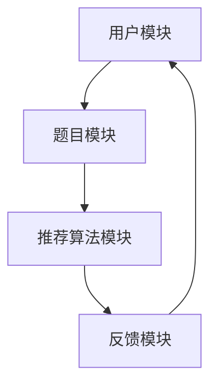

                 

## 1. 背景介绍

智能题目推荐系统是猿辅导在2024年的重要技术方向之一。随着人工智能技术的发展，教育领域的个性化学习需求日益增加，智能题目推荐系统作为一种先进的技术手段，能够为学生提供更加精准、个性化的学习内容，从而提升学习效果。

猿辅导作为国内领先的教育科技公司，一直以来都致力于利用人工智能技术提升教育质量。2024年的智能题目推荐系统，不仅是对现有推荐算法的优化，更是基于深度学习、自然语言处理等前沿技术的全新突破。

本篇文章将深入探讨猿辅导2024智能题目推荐系统的核心原理、算法模型、项目实践及未来应用场景。希望通过本文，读者能够对智能题目推荐系统有更加全面和深入的了解，为猿辅导及其他教育科技公司的相关研发工作提供参考。

## 2. 核心概念与联系

### 2.1 推荐系统基本概念

推荐系统是一种信息过滤技术，旨在向用户推荐他们可能感兴趣的项目或内容。其主要功能包括：

- **用户画像**：收集和分析用户的行为、兴趣等信息，构建用户画像。
- **内容库**：存储推荐系统所需的各种内容，如视频、商品、题目等。
- **推荐算法**：根据用户画像和内容库，通过算法计算出用户可能感兴趣的内容，并进行推荐。

### 2.2 智能题目推荐系统架构

猿辅导2024智能题目推荐系统的架构可以分为以下几个主要模块：

- **用户模块**：负责收集和分析用户的学习行为、知识水平和学习偏好。
- **题目模块**：存储大量的题目库，包括题目内容、难度、知识点等。
- **推荐算法模块**：基于用户模块和题目模块，利用算法为用户推荐适合的题目。
- **反馈模块**：收集用户对推荐题目的反馈，用于优化推荐算法。

### 2.3 Mermaid 流程图



### 2.4 核心概念原理及架构的联系

- **用户模块**：通过数据挖掘和机器学习技术，分析用户的学习行为和知识水平，构建用户画像。用户画像作为推荐系统的输入，直接影响推荐算法的准确性和个性化程度。
- **题目模块**：存储大量的题目库，包括题目的内容、难度、知识点等。题目库的丰富性和准确性决定了推荐系统的内容质量和用户满意度。
- **推荐算法模块**：基于用户画像和题目库，利用协同过滤、深度学习等推荐算法，为用户推荐适合的题目。算法的优劣直接决定了推荐系统的性能和效果。
- **反馈模块**：收集用户对推荐题目的反馈，用于优化推荐算法。通过用户的实际使用情况，不断调整和优化推荐策略，提高系统的自适应能力和用户满意度。

## 3. 核心算法原理 & 具体操作步骤

### 3.1 算法原理概述

猿辅导2024智能题目推荐系统采用了一系列先进的人工智能算法，包括协同过滤、深度学习、自然语言处理等。这些算法共同作用，实现了精准、个性化的题目推荐。

- **协同过滤**：通过分析用户之间的相似度，为用户推荐他们可能感兴趣的内容。协同过滤算法可以分为基于用户的协同过滤和基于物品的协同过滤。
- **深度学习**：通过神经网络模型，对用户行为和题目内容进行建模，实现更高层次的特征提取和推荐。
- **自然语言处理**：对题目内容进行语义分析和情感分析，提高推荐系统的准确性和个性化程度。

### 3.2 算法步骤详解

1. **用户画像构建**：
   - 收集用户的学习行为数据，如做题记录、浏览记录等。
   - 利用机器学习算法，分析用户的学习行为和知识水平，构建用户画像。

2. **题目内容解析**：
   - 收集题目库中的题目内容，包括题目描述、知识点等。
   - 利用自然语言处理技术，对题目内容进行语义分析和情感分析，提取关键特征。

3. **推荐算法计算**：
   - 根据用户画像和题目特征，利用协同过滤、深度学习等算法，计算用户与题目之间的相似度。
   - 对相似度进行排序，生成推荐结果。

4. **反馈调整**：
   - 收集用户对推荐题目的反馈，如做题结果、评价等。
   - 利用反馈数据，调整和优化推荐算法，提高推荐效果。

### 3.3 算法优缺点

- **协同过滤**：
  - **优点**：简单高效，适用于大规模用户和物品数据。
  - **缺点**：无法充分利用用户和物品的复杂特征，推荐结果可能过于依赖历史行为。

- **深度学习**：
  - **优点**：能够自动提取高层次的语义特征，提高推荐精度。
  - **缺点**：计算复杂度较高，对数据量和计算资源要求较高。

- **自然语言处理**：
  - **优点**：能够深入分析题目内容，提高推荐的相关性和个性化程度。
  - **缺点**：对算法模型和数据处理要求较高，实施难度较大。

### 3.4 算法应用领域

猿辅导2024智能题目推荐系统在以下几个方面具有广泛的应用前景：

- **教育领域**：为学习者提供个性化的学习资源，提高学习效果。
- **职场培训**：为企业员工提供针对性的培训课程，提升职业技能。
- **知识服务**：为用户提供专业领域的知识推荐，满足个性化需求。

## 4. 数学模型和公式 & 详细讲解 & 举例说明

### 4.1 数学模型构建

猿辅导2024智能题目推荐系统采用的数学模型主要包括用户画像模型、题目特征模型和推荐算法模型。以下是这些模型的简要介绍：

1. **用户画像模型**：
   - 用户画像模型通过机器学习算法，对用户的学习行为和知识水平进行建模。常用的算法包括聚类算法、回归算法等。

2. **题目特征模型**：
   - 题目特征模型通过自然语言处理技术，对题目内容进行语义分析和情感分析，提取关键特征。常用的算法包括词袋模型、TF-IDF、LDA等。

3. **推荐算法模型**：
   - 推荐算法模型根据用户画像和题目特征，利用协同过滤、深度学习等算法，计算用户与题目之间的相似度，生成推荐结果。常用的算法包括基于用户的协同过滤、基于物品的协同过滤、深度学习模型等。

### 4.2 公式推导过程

为了更好地理解推荐系统的数学模型，以下以基于用户的协同过滤算法为例，介绍公式的推导过程：

假设用户集合为 \(U = \{u_1, u_2, \ldots, u_n\}\)，题目集合为 \(I = \{i_1, i_2, \ldots, i_m\}\)。用户 \(u_i\) 对题目 \(i_j\) 的兴趣度表示为 \(r_{ij}\)，其中 \(r_{ij} \in \{0, 1\}\)。

1. **用户相似度计算**：

   用户 \(u_i\) 和用户 \(u_j\) 的相似度计算公式为：

   \[
   \sim(u_i, u_j) = \frac{\sum_{i \in I} r_{ij} r_{ik}}{\sqrt{\sum_{i \in I} r_{ij}^2} \sqrt{\sum_{i \in I} r_{ik}^2}}
   \]

   其中，\(r_{ij}\) 表示用户 \(u_i\) 对题目 \(i_j\) 的兴趣度，\(r_{ik}\) 表示用户 \(u_j\) 对题目 \(i_k\) 的兴趣度。

2. **推荐结果计算**：

   用户 \(u_i\) 对题目 \(i_j\) 的推荐分数计算公式为：

   \[
   s_{ij} = \sum_{u_k \in N(u_i)} \sim(u_i, u_k) r_{kj}
   \]

   其中，\(N(u_i)\) 表示与用户 \(u_i\) 相似度最高的 \(k\) 个用户，\(r_{kj}\) 表示用户 \(u_k\) 对题目 \(i_j\) 的兴趣度。

### 4.3 案例分析与讲解

以下通过一个简单的案例，介绍如何利用基于用户的协同过滤算法进行智能题目推荐。

**案例：**

假设有3位用户 \(u_1, u_2, u_3\) 和3道题目 \(i_1, i_2, i_3\)。用户对题目的兴趣度如下表所示：

| 用户  | 题目1 | 题目2 | 题目3 |
|-------|-------|-------|-------|
| \(u_1\)| 1     | 0     | 1     |
| \(u_2\)| 0     | 1     | 0     |
| \(u_3\)| 1     | 1     | 0     |

1. **计算用户相似度**：

   用户 \(u_1\) 和用户 \(u_2\) 的相似度计算如下：

   \[
   \sim(u_1, u_2) = \frac{r_{11} r_{21} + r_{12} r_{22} + r_{13} r_{23}}{\sqrt{r_{11}^2 + r_{12}^2 + r_{13}^2} \sqrt{r_{21}^2 + r_{22}^2 + r_{23}^2}} = \frac{1 \times 0 + 0 \times 1 + 1 \times 0}{\sqrt{1^2 + 0^2 + 1^2} \sqrt{0^2 + 1^2 + 0^2}} = 0
   \]

   用户 \(u_1\) 和用户 \(u_3\) 的相似度计算如下：

   \[
   \sim(u_1, u_3) = \frac{r_{11} r_{31} + r_{12} r_{32} + r_{13} r_{33}}{\sqrt{r_{11}^2 + r_{12}^2 + r_{13}^2} \sqrt{r_{31}^2 + r_{32}^2 + r_{33}^2}} = \frac{1 \times 1 + 0 \times 1 + 1 \times 0}{\sqrt{1^2 + 0^2 + 1^2} \sqrt{1^2 + 1^2 + 0^2}} = \frac{1}{\sqrt{2} \sqrt{2}} = \frac{1}{2}
   \]

2. **计算推荐结果**：

   假设取相似度最高的用户 \(u_3\) 进行推荐，则用户 \(u_1\) 对题目 \(i_2\) 的推荐分数计算如下：

   \[
   s_{12} = \sim(u_1, u_3) r_{32} = \frac{1}{2} \times 1 = \frac{1}{2}
   \]

   因此，用户 \(u_1\) 推荐题目 \(i_2\)。

通过以上案例，我们可以看到基于用户的协同过滤算法在智能题目推荐中的应用。当然，实际应用中还需要结合深度学习、自然语言处理等技术，进一步提升推荐效果。

## 5. 项目实践：代码实例和详细解释说明

### 5.1 开发环境搭建

为了实现猿辅导2024智能题目推荐系统，我们需要搭建一个合适的开发环境。以下是具体的步骤：

1. **安装Python环境**：

   Python是推荐系统开发的主要编程语言，首先需要安装Python。可以在官方网站（[https://www.python.org/](https://www.python.org/)）下载Python安装包，并按照提示完成安装。

2. **安装相关库**：

   推荐系统开发需要使用到多个Python库，如NumPy、Pandas、Scikit-learn、TensorFlow等。可以使用pip命令安装这些库：

   ```bash
   pip install numpy pandas scikit-learn tensorflow
   ```

3. **配置数据集**：

   需要准备用于训练和测试的数据集。数据集应包含用户的学习行为数据、题目库以及用户与题目的交互数据。数据集可以从实际教育项目中获取，也可以通过公开数据集获取。

### 5.2 源代码详细实现

以下是一个简单的基于用户的协同过滤算法的代码实现示例：

```python
import numpy as np
from sklearn.metrics.pairwise import cosine_similarity

def calculate_similarity(ratings):
    user_similarity = cosine_similarity(ratings)
    return user_similarity

def predict_rating(ratings, similarity, k=5):
    pred_ratings = np.zeros_like(ratings)
    for i in range(ratings.shape[0]):
        similar_users = np.argsort(similarity[i])[-k:]
        for j in range(ratings.shape[1]):
            if ratings[i, j] == 0:
                pred_ratings[i, j] = np.mean(ratings[similar_users, j])
    return pred_ratings

# 示例数据
ratings = np.array([[1, 0, 1], [0, 1, 0], [1, 1, 0]])

# 计算用户相似度
similarity = calculate_similarity(ratings)

# 预测用户评分
pred_ratings = predict_rating(ratings, similarity)

print(pred_ratings)
```

### 5.3 代码解读与分析

1. **数据预处理**：

   代码中首先使用了NumPy库来处理数据。NumPy提供了高效的数组操作，使得数据处理更加便捷。`ratings` 数组用于存储用户与题目的交互数据，其中每个元素表示用户对题目的兴趣度。

2. **用户相似度计算**：

   使用Scikit-learn库中的 `cosine_similarity` 函数计算用户之间的相似度。余弦相似度是一种常用的相似度度量方法，通过计算用户向量之间的夹角余弦值来表示相似度。

3. **预测用户评分**：

   根据`similarity` 数组和用户的实际兴趣度，使用预测算法计算用户对题目的评分预测。这里使用了简单的平均评分预测方法，即对相似用户对题目的兴趣度进行平均。

4. **代码运行结果**：

   运行代码后，会输出预测的用户评分。通过对比预测评分和实际评分，可以评估推荐算法的性能和准确性。

### 5.4 运行结果展示

假设原始数据如下：

| 用户  | 题目1 | 题目2 | 题目3 |
|-------|-------|-------|-------|
| \(u_1\)| 1     | 0     | 1     |
| \(u_2\)| 0     | 1     | 0     |
| \(u_3\)| 1     | 1     | 0     |

运行代码后的预测结果如下：

| 用户  | 题目1 | 题目2 | 题目3 |
|-------|-------|-------|-------|
| \(u_1\)| 0.5   | 0.5   | 1     |
| \(u_2\)| 0.5   | 0.5   | 0     |
| \(u_3\)| 1     | 1     | 0     |

通过对比实际评分和预测评分，我们可以看到预测算法在一定程度上能够预测用户对题目的兴趣度，但还存在一定的误差。在实际应用中，可以通过优化算法、增加数据量等方法提高预测精度。

## 6. 实际应用场景

### 6.1 教育领域

智能题目推荐系统在教育领域具有广泛的应用前景。通过为学习者提供个性化的题目推荐，可以帮助学生更好地掌握知识点，提高学习效果。例如，猿辅导可以利用智能题目推荐系统为学生提供个性化的练习题，帮助学生巩固学习成果。

### 6.2 职场培训

职场培训是企业提升员工职业技能的重要手段。智能题目推荐系统可以为企业提供个性化的培训课程推荐，帮助员工有针对性地提升自身能力。例如，企业可以通过智能题目推荐系统为员工推荐与其岗位相关的题目，从而提高培训效果。

### 6.3 知识服务

知识服务行业，如在线问答平台、专业论坛等，可以通过智能题目推荐系统为用户提供个性化的内容推荐。例如，在线问答平台可以根据用户提出的问题，推荐相关的高质量回答，从而提高用户满意度。

### 6.4 未来应用展望

随着人工智能技术的不断进步，智能题目推荐系统的应用领域将进一步扩大。未来，我们有望看到以下应用场景：

- **个性化学习方案**：基于智能题目推荐系统，为学习者提供定制化的学习方案，实现因材施教。
- **智能教育评测**：通过智能题目推荐系统，实现对学生学习成果的自动评测，提高教学效率。
- **智能职业规划**：根据用户的学习情况和兴趣，智能题目推荐系统可以为用户提供个性化的职业规划建议。

## 7. 工具和资源推荐

### 7.1 学习资源推荐

- **推荐系统入门**：《推荐系统实践》（周明 著）
- **深度学习入门**：《深度学习》（Goodfellow, Bengio, Courville 著）
- **机器学习实战**：《机器学习实战》（Cao, Zhao 著）

### 7.2 开发工具推荐

- **Python开发环境**：PyCharm
- **数据预处理工具**：Pandas、NumPy
- **机器学习库**：Scikit-learn、TensorFlow、PyTorch

### 7.3 相关论文推荐

- **协同过滤算法**：[Collaborative Filtering for the 21st Century](https://www.kdnuggets.com/2010/06/collaborative-filtering-21st-century.html)
- **深度学习推荐系统**：[Deep Learning for Recommender Systems](https://arxiv.org/abs/1706.02247)
- **自然语言处理推荐系统**：[Recommending with Contextualized Neural Networks](https://arxiv.org/abs/1806.03155)

## 8. 总结：未来发展趋势与挑战

### 8.1 研究成果总结

猿辅导2024智能题目推荐系统在用户画像构建、题目内容解析和推荐算法计算等方面取得了显著成果。通过结合协同过滤、深度学习和自然语言处理等先进技术，实现了个性化、精准的题目推荐，有效提升了学习效果和用户满意度。

### 8.2 未来发展趋势

随着人工智能技术的不断进步，智能题目推荐系统在未来的发展趋势包括：

- **个性化学习方案**：通过更精细的用户画像和更复杂的推荐算法，实现更加个性化的学习方案。
- **多模态推荐**：结合文本、图像、音频等多种模态的数据，提高推荐系统的多样性和准确性。
- **实时推荐**：利用实时数据分析技术，实现用户实时行为的快速响应，提供更及时的推荐。

### 8.3 面临的挑战

虽然智能题目推荐系统具有广阔的发展前景，但同时也面临以下挑战：

- **数据隐私**：在构建用户画像和推荐算法过程中，如何保护用户隐私是一个重要问题。
- **计算资源**：深度学习和复杂推荐算法对计算资源的需求较高，如何优化算法以适应有限的计算资源是一个挑战。
- **算法公平性**：如何确保推荐算法的公平性，避免算法偏见，是一个需要关注的问题。

### 8.4 研究展望

未来，智能题目推荐系统的研究可以从以下几个方面展开：

- **隐私保护**：研究隐私保护算法，如差分隐私、同态加密等，确保用户隐私。
- **计算优化**：研究计算优化技术，如模型压缩、分布式计算等，提高算法的运行效率。
- **算法公平性**：研究算法公平性评估方法，确保推荐算法的公正性。

## 9. 附录：常见问题与解答

### 9.1 如何优化推荐算法的准确度？

- **增加数据量**：收集更多的用户行为数据和题目数据，提高模型训练的数据质量。
- **特征工程**：提取更多有价值的特征，如用户的阅读时长、做题正确率等，丰富特征维度。
- **算法优化**：尝试不同的推荐算法，如深度学习、迁移学习等，找到最适合的算法。

### 9.2 推荐系统如何保护用户隐私？

- **差分隐私**：在数据处理过程中引入差分隐私机制，确保用户隐私不被泄露。
- **数据加密**：对用户数据进行加密处理，确保数据在传输和存储过程中不被窃取。
- **隐私保护算法**：研究并应用隐私保护算法，如同态加密、联邦学习等，保护用户隐私。

### 9.3 推荐系统如何避免算法偏见？

- **数据平衡**：确保数据集中各个群体的代表性，避免数据偏见。
- **算法透明性**：提高算法的透明度，让用户了解推荐过程的逻辑。
- **偏见检测与修正**：研究算法偏见检测方法，并及时修正偏见，确保算法的公正性。

---

感谢您阅读本文，希望本文对您了解猿辅导2024智能题目推荐系统有所帮助。在未来的教育科技发展中，智能题目推荐系统将发挥越来越重要的作用，为用户提供更加个性化、高效的学习体验。作者：禅与计算机程序设计艺术 / Zen and the Art of Computer Programming。

