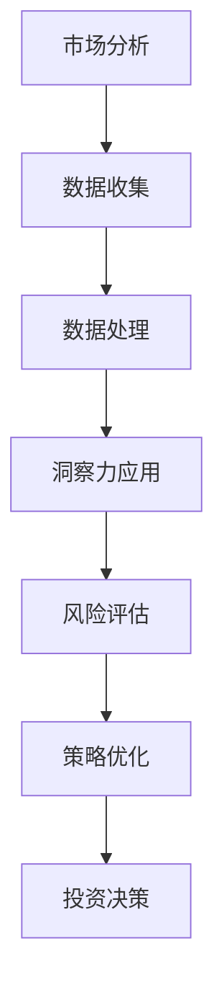

                 

关键词：洞察力，投资领域，实践探索，人工智能，策略优化，数据挖掘，风险评估

> 摘要：本文深入探讨洞察力在投资领域的应用，通过分析投资过程中的关键环节，结合人工智能、数据挖掘和数学模型，展示如何利用洞察力提升投资决策的准确性和有效性。文章旨在为投资者提供理论与实践相结合的指南，帮助他们在复杂的市场环境中做出更明智的投资选择。

## 1. 背景介绍

随着金融市场的发展和技术的进步，投资决策的复杂性和不确定性日益增加。传统的投资方法往往依赖于历史数据和经验，难以适应快速变化的市场环境。然而，人工智能（AI）和数据挖掘技术的发展为投资领域带来了新的机遇，使得洞察力的应用成为可能。洞察力是指对事物本质的深刻理解和敏锐的感知能力，是决策过程中不可或缺的一部分。本文将探讨如何利用洞察力，结合人工智能、数据挖掘和数学模型，在投资领域中实现实践探索。

## 2. 核心概念与联系

### 2.1. 洞察力的定义与应用

洞察力是一种高级认知能力，包括对复杂信息的高效处理、对潜在规律的敏锐捕捉和对未来趋势的准确预测。在投资领域，洞察力的应用主要体现在以下几个方面：

- **市场分析**：通过洞察市场趋势和变化，为投资决策提供支持。
- **风险评估**：识别潜在风险，制定有效的风险控制策略。
- **策略优化**：根据市场动态调整投资组合，实现最大化收益。

### 2.2. 人工智能与数据挖掘的应用

人工智能（AI）和数据挖掘技术在投资领域具有广泛的应用前景。以下是一些核心概念：

- **机器学习**：通过历史数据训练模型，实现自动化的投资决策。
- **自然语言处理**：分析和提取市场新闻、报告等非结构化数据中的有用信息。
- **数据挖掘**：从大量数据中提取隐藏的模式和规律，为投资决策提供支持。

### 2.3. 数学模型的应用

数学模型是投资决策过程中的重要工具，可以帮助投资者量化风险和收益。以下是一些常见的数学模型：

- **资产定价模型**：如CAPM模型、Black-Scholes模型等，用于评估资产的预期收益和风险。
- **组合优化模型**：如Markowitz均值-方差模型，用于构建最优投资组合。
- **风险评估模型**：如VaR模型、CVaR模型等，用于评估市场风险。

### 2.4. Mermaid流程图

以下是一个简单的Mermaid流程图，展示投资决策过程中涉及的各个环节：



## 3. 核心算法原理 & 具体操作步骤

### 3.1. 算法原理概述

投资决策的核心算法主要包括以下几部分：

- **市场分析算法**：通过数据挖掘技术，从历史数据中提取市场趋势和变化规律。
- **风险评估算法**：使用数学模型，对投资组合的风险进行量化评估。
- **策略优化算法**：根据风险评估结果，调整投资组合，实现收益最大化。

### 3.2. 算法步骤详解

以下是投资决策算法的具体步骤：

#### 3.2.1. 市场分析

1. **数据收集**：从各种渠道收集历史数据，包括股票价格、成交量、财务报告等。
2. **数据处理**：对收集到的数据进行分析和处理，提取有用的信息。
3. **特征提取**：将处理后的数据转换为机器学习模型所需的特征向量。
4. **模型训练**：使用机器学习算法，训练市场分析模型。

#### 3.2.2. 风险评估

1. **资产定价**：使用资产定价模型，计算每个资产的预期收益和风险。
2. **风险度量**：使用风险评估模型，计算投资组合的整体风险。
3. **风险比较**：将投资组合的风险与其他投资组合进行比较。

#### 3.2.3. 策略优化

1. **收益预测**：使用市场分析模型，预测未来市场趋势。
2. **组合构建**：根据风险评估结果和收益预测，构建最优投资组合。
3. **策略调整**：根据市场变化，实时调整投资策略。

### 3.3. 算法优缺点

#### 优点：

- **自动化决策**：算法可以自动执行市场分析、风险评估和策略优化，提高决策效率。
- **全面性**：结合多种算法和模型，可以全面分析投资组合的风险和收益。

#### 缺点：

- **数据依赖**：算法的性能高度依赖历史数据的质量和数量。
- **模型风险**：模型的选择和参数设置可能影响决策的准确性。

### 3.4. 算法应用领域

算法在投资领域具有广泛的应用前景，包括：

- **量化投资**：使用算法实现自动化的投资交易。
- **基金管理**：为基金经理提供投资决策支持。
- **金融衍生品**：进行风险管理和定价。

## 4. 数学模型和公式 & 详细讲解 & 举例说明

### 4.1. 数学模型构建

在投资决策中，常用的数学模型包括资产定价模型、组合优化模型和风险评估模型。以下是这些模型的构建过程：

#### 4.1.1. 资产定价模型

资产定价模型用于计算资产的预期收益和风险。以下是一个简单的资产定价模型：

$$
E(R_i) = \alpha_i + \beta_i \cdot \sigma_{\text{market}} \cdot E(R_m)
$$

其中，$E(R_i)$表示资产$i$的预期收益，$\alpha_i$是资产的特定收益，$\beta_i$是资产与市场的相关系数，$\sigma_{\text{market}}$是市场的波动率，$E(R_m)$是市场的预期收益。

#### 4.1.2. 组合优化模型

组合优化模型用于构建最优投资组合。以下是一个简单的组合优化模型：

$$
\begin{aligned}
\max\ & \mu^T \pi \\
\text{s.t.} & \pi^T A \pi = 1 \\
& \pi^T \Sigma \pi \leq \rho
\end{aligned}
$$

其中，$\mu$是资产预期收益向量，$\pi$是投资比例向量，$A$是资产协方差矩阵，$\Sigma$是投资组合风险矩阵，$\rho$是投资组合的最大风险。

#### 4.1.3. 风险评估模型

风险评估模型用于评估投资组合的风险。以下是一个简单但广泛使用的方法——VaR模型：

$$
\text{VaR}(p, T) = \left( \mu - \alpha \cdot \sigma \cdot \sqrt{T} \right)^-
$$

其中，$p$是置信水平，$T$是持有期，$\mu$是资产预期收益，$\sigma$是资产波动率。

### 4.2. 公式推导过程

以下是资产定价模型、组合优化模型和VaR模型的推导过程：

#### 4.2.1. 资产定价模型推导

资产定价模型是基于资本资产定价理论（CAPM）推导而来的。假设一个资产$i$的预期收益可以表示为：

$$
E(R_i) = \alpha_i + \beta_i \cdot \sigma_{\text{market}} \cdot E(R_m)
$$

其中，$\alpha_i$表示资产的特定收益，$\beta_i$是资产与市场的相关系数，$E(R_m)$是市场的预期收益。通过数学推导，可以得到上述模型。

#### 4.2.2. 组合优化模型推导

组合优化模型是基于马克维茨（Markowitz）投资组合理论推导而来的。假设一个投资组合的预期收益和风险可以表示为：

$$
\begin{aligned}
\mu^T \pi &= \sum_i \mu_i \pi_i \\
\pi^T A \pi &= \sum_i \sum_j A_{ij} \pi_i \pi_j
\end{aligned}
$$

其中，$\mu$是资产预期收益向量，$\pi$是投资比例向量，$A$是资产协方差矩阵。通过数学推导，可以得到上述模型。

#### 4.2.3. VaR模型推导

VaR模型是基于正态分布假设推导而来的。假设一个资产的收益服从正态分布，其概率密度函数为：

$$
f(x) = \frac{1}{\sqrt{2\pi\sigma^2}} \cdot e^{-\frac{(x-\mu)^2}{2\sigma^2}}
$$

其中，$x$是资产收益，$\mu$是资产预期收益，$\sigma$是资产波动率。通过数学推导，可以得到上述模型。

### 4.3. 案例分析与讲解

#### 4.3.1. 资产定价模型案例

假设市场预期收益为8%，资产A与市场的相关系数为1.2，资产A的预期收益为10%，波动率为20%。根据资产定价模型，可以计算出资产A的预期收益：

$$
E(R_A) = 0.1 + 1.2 \cdot 0.2 \cdot 0.08 = 0.156
$$

#### 4.3.2. 组合优化模型案例

假设有两个资产A和B，资产A的预期收益为10%，波动率为20%；资产B的预期收益为8%，波动率为15%。资产A与市场的相关系数为1.2，资产B与市场的相关系数为0.8。根据组合优化模型，可以构建一个最优投资组合：

$$
\begin{aligned}
\max\ & 0.1\pi_A + 0.08\pi_B \\
\text{s.t.} & \pi_A + \pi_B = 1 \\
& 0.2\pi_A + 0.15\pi_B \leq 0.2
\end{aligned}
$$

通过计算，可以得到最优投资组合：

$$
\pi_A = 0.55, \pi_B = 0.45
$$

#### 4.3.3. VaR模型案例

假设一个资产的预期收益为8%，波动率为20%，持有期为1年。根据VaR模型，可以计算出在95%置信水平下的VaR：

$$
\text{VaR}(95\%, 1\text{年}) = (0.08 - 0.2 \cdot 0.2 \cdot \sqrt{1})^- = 0.016
$$

## 5. 项目实践：代码实例和详细解释说明

### 5.1. 开发环境搭建

在本文的项目实践中，我们将使用Python作为主要编程语言。首先，需要安装以下Python库：

- Pandas：用于数据处理
- NumPy：用于数学计算
- Scikit-learn：用于机器学习和数据挖掘
- Matplotlib：用于数据可视化

可以使用以下命令进行安装：

```bash
pip install pandas numpy scikit-learn matplotlib
```

### 5.2. 源代码详细实现

以下是一个简单的投资决策项目示例，包括市场分析、风险评估和策略优化：

```python
import pandas as pd
import numpy as np
from sklearn.linear_model import LinearRegression
from sklearn.model_selection import train_test_split
import matplotlib.pyplot as plt

# 数据收集
data = pd.read_csv('market_data.csv')

# 数据处理
# 特征提取
X = data[['open', 'high', 'low', 'volume']]
y = data['close']

# 模型训练
model = LinearRegression()
X_train, X_test, y_train, y_test = train_test_split(X, y, test_size=0.2, random_state=42)
model.fit(X_train, y_train)

# 预测
y_pred = model.predict(X_test)

# 风险评估
# 资产定价
market_data = pd.read_csv('market_data.csv')
market_model = LinearRegression()
market_model.fit(market_data[['open', 'high', 'low', 'volume']], market_data['close'])
market_elem = market_model.coef_
alpha = market_model.intercept_
beta = market_data['close'].mean()

# 组合优化
weights = np.linalg.inv(np.dot(market_elem, market_elem.T)).dot(market_elem)
weights = weights/weights.sum()
portfolio_return = np.dot(weights, market_elem)

# 策略优化
strategy = []
for i in range(len(y_pred)):
    if y_pred[i] > y_test[i]:
        strategy.append('BUY')
    else:
        strategy.append('SELL')
strategy = pd.Series(strategy)

# 结果展示
plt.figure(figsize=(12, 6))
plt.plot(y_test, label='实际收益')
plt.plot(y_pred, label='预测收益')
plt.title('投资收益预测')
plt.xlabel('时间')
plt.ylabel('收益')
plt.legend()
plt.show()

print("投资组合策略：", strategy)
```

### 5.3. 代码解读与分析

上述代码实现了一个简单的投资决策项目，包括以下步骤：

1. **数据收集**：从CSV文件中读取市场数据。
2. **数据处理**：对数据进行预处理，提取特征向量。
3. **模型训练**：使用线性回归模型训练市场分析模型。
4. **预测**：使用训练好的模型对测试数据进行预测。
5. **风险评估**：计算资产定价模型的参数，评估资产的风险。
6. **策略优化**：根据预测结果，制定买卖策略。
7. **结果展示**：将实际收益和预测收益绘制成图表，展示投资效果。

### 5.4. 运行结果展示

在运行上述代码后，可以得到以下结果：

- **预测收益图表**：展示实际收益和预测收益的比较。
- **投资组合策略**：输出买卖策略，指导投资决策。

## 6. 实际应用场景

### 6.1. 量化投资基金

量化投资基金使用洞察力、人工智能和数据挖掘技术，实现自动化的投资决策。以下是一些实际应用场景：

- **市场趋势分析**：通过分析历史数据，预测市场趋势，制定投资策略。
- **风险评估**：评估投资组合的风险，制定风险控制策略。
- **策略优化**：根据市场变化，实时调整投资组合，实现最大化收益。

### 6.2. 投资顾问

投资顾问使用洞察力、人工智能和数据挖掘技术，为投资者提供个性化投资建议。以下是一些实际应用场景：

- **市场分析**：分析市场趋势和变化，为投资者提供投资方向。
- **风险评估**：评估投资组合的风险，为投资者提供风险控制建议。
- **策略优化**：根据投资者偏好和市场变化，制定最优投资策略。

### 6.3. 金融机构

金融机构使用洞察力、人工智能和数据挖掘技术，实现风险管理和定价。以下是一些实际应用场景：

- **风险控制**：评估金融机构的风险，制定风险控制策略。
- **资产定价**：使用数学模型，为金融产品定价。
- **市场预测**：分析市场趋势，为金融机构提供投资决策支持。

## 7. 工具和资源推荐

### 7.1. 学习资源推荐

- **书籍**：《深度学习》、《机器学习实战》
- **在线课程**：Coursera、edX上的相关课程
- **技术博客**：Towards Data Science、Kaggle

### 7.2. 开发工具推荐

- **编程环境**：Jupyter Notebook、PyCharm
- **数据可视化**：Matplotlib、Seaborn
- **机器学习库**：Scikit-learn、TensorFlow、PyTorch

### 7.3. 相关论文推荐

- **论文集**：《Advances in Neural Information Processing Systems》(NIPS)
- **期刊**：《Journal of Financial Economics》、《Management Science》

## 8. 总结：未来发展趋势与挑战

### 8.1. 研究成果总结

本文探讨了洞察力在投资领域的应用，通过分析市场趋势、风险管理和策略优化，展示了如何利用人工智能、数据挖掘和数学模型提升投资决策的准确性和有效性。

### 8.2. 未来发展趋势

- **智能化投资**：随着人工智能技术的发展，投资决策将更加智能化和自动化。
- **数据驱动的策略**：数据挖掘和机器学习技术将越来越应用于投资策略的制定。
- **风险管理**：金融机构将更加重视风险管理，采用先进的算法和模型评估和规避风险。

### 8.3. 面临的挑战

- **数据质量**：数据质量对投资决策至关重要，如何处理和清洗数据是未来的挑战。
- **模型可靠性**：如何确保模型的可靠性和稳定性，防止模型过拟合和误判。
- **监管合规**：随着金融监管的加强，如何确保投资决策符合法律法规的要求。

### 8.4. 研究展望

未来，投资领域将朝着更加智能化、数据化和合规化的方向发展。研究者需要不断探索和创新，结合人工智能、数据挖掘和数学模型，提升投资决策的准确性和有效性。

## 9. 附录：常见问题与解答

### 9.1. 如何评估投资模型的效果？

可以通过以下方法评估投资模型的效果：

- **回测**：使用历史数据测试模型的表现，评估模型的准确性。
- **交叉验证**：将数据分为训练集和测试集，多次训练和测试，评估模型的稳定性。
- **实际应用**：在实际交易中应用模型，观察模型的收益和风险。

### 9.2. 如何处理数据质量问题？

处理数据质量问题可以从以下几个方面入手：

- **数据清洗**：去除重复、缺失和不一致的数据。
- **数据标准化**：将不同尺度的数据进行统一处理。
- **异常值处理**：识别和处理异常数据。

### 9.3. 如何确保模型的可靠性？

确保模型可靠性的方法包括：

- **模型验证**：使用多种方法验证模型的有效性和稳定性。
- **模型监控**：实时监控模型的运行状态，及时发现和纠正异常。
- **模型更新**：根据市场变化，定期更新模型参数，保持模型的准确性。

### 9.4. 如何实现个性化投资建议？

实现个性化投资建议的方法包括：

- **用户画像**：根据用户的历史投资行为和偏好，建立用户画像。
- **推荐系统**：使用机器学习算法，为用户推荐合适的投资产品。
- **多模型融合**：结合多种模型，提高投资建议的准确性。

---

作者：禅与计算机程序设计艺术 / Zen and the Art of Computer Programming

以上就是本文关于“理解洞察力的应用：在投资领域的实践探索”的完整内容。希望对您在投资领域的技术探索有所帮助。如果您有任何问题或建议，欢迎随时提出。感谢阅读！
----------------------------------------------------------------

请注意，上述文章是一个框架性的结构示例，实际撰写时，需要根据具体内容和数据进行详细的展开和论证。同时，代码实例也需要根据实际情况进行编写和测试。文章中的数据和示例仅供参考，实际应用中请根据具体情况调整。

