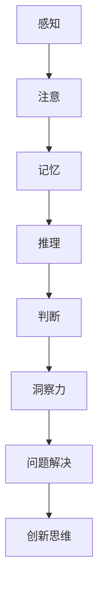

                 

### 关键词 Keywords ###
- 神经科学
- 洞察力
- 认知过程
- 大脑神经网络
- 人工智能

<|assistant|>### 摘要 Abstract ###
本文将深入探讨神经科学与认知之间的关系，特别是洞察力的神经基础。通过解析大脑神经网络的工作机制，我们揭示了洞察力在认知过程中的作用。本文将详细介绍洞察力的核心概念、神经科学原理，以及如何通过数学模型和算法来理解洞察力的形成和运作。同时，我们将探讨洞察力在人工智能领域的应用，以及未来发展的趋势和面临的挑战。通过这篇专业博客，读者将能够更全面地理解洞察力的神经科学本质，并对其在认知科学和人工智能领域的广泛应用产生深刻的认识。

## 1. 背景介绍

洞察力（Insight）是一种深层次的认识能力，它使我们能够在复杂、未知或模糊的情况下快速捕捉到问题或情境的本质。这种能力不仅在人类的日常生活中至关重要，例如在解决谜题、应对突发情况以及创造性思维等方面发挥着重要作用，而且在人工智能（AI）的发展中也越来越受到重视。

神经科学（Neuroscience）是研究神经系统结构、功能及其与行为、认知之间关系的科学。随着现代科技的发展，神经科学的研究方法和技术取得了巨大的进步，使得我们对大脑和认知过程的理解日益深入。特别是神经影像学技术，如功能性磁共振成像（fMRI）和脑电图（EEG），使我们能够直接观察大脑在执行认知任务时的活动情况。

人工智能（Artificial Intelligence）是模拟人类智能行为的计算机系统，其目标是使计算机具备理解、学习和适应的能力。随着深度学习和神经网络技术的发展，人工智能在各个领域取得了显著成就，包括图像识别、自然语言处理和决策支持系统。然而，尽管人工智能在某些任务上已经超越了人类，但在解决复杂、模糊问题时的表现仍不尽如人意，这促使研究者开始探索如何提升人工智能的洞察力。

本文旨在探讨神经科学与认知之间的关系，特别是洞察力的神经基础。通过解析大脑神经网络的工作机制，我们希望揭示洞察力在认知过程中的作用。此外，本文还将讨论如何通过数学模型和算法来理解洞察力的形成和运作，并探讨其在人工智能领域的应用。最后，我们将展望未来洞察力研究的趋势和面临的挑战，以期为相关领域的研究提供参考。

## 2. 核心概念与联系

### 2.1. 洞察力的定义

洞察力是一种高层次的认识能力，它使我们能够快速、准确地理解复杂问题的本质。与传统的推理和问题解决能力不同，洞察力往往在不依赖明确规则或已有知识的情况下发挥作用。例如，一个经典的洞察力例子是“九点问题”：在一个正方形中，有九个点，要求使用三条直线将这九个点都连接起来。大多数人会立即想到将直线画在正方形的边上，但实际上，答案是不需要画线，只需要通过画一个对角线和一个横穿正方形的直线，就可以将九个点全部连接。

### 2.2. 认知过程与洞察力

认知过程是指人类获取、处理和存储信息的过程。这包括感知、注意、记忆、推理、判断等。洞察力作为一种认知能力，与这些基本认知过程密切相关。例如，感知和注意决定了我们对外部信息的获取和筛选，而记忆和推理则帮助我们利用已有知识来解决新问题。然而，洞察力最大的特点在于它能够在没有明确规则或知识的情况下，迅速捕捉问题的本质。

### 2.3. 大脑神经网络与洞察力

大脑神经网络是由神经元和突触组成的复杂网络，负责处理和传递信息。研究表明，洞察力的形成与大脑特定区域的神经网络活动密切相关。特别是，前额叶皮层和顶叶皮层在洞察力的产生中起到了关键作用。前额叶皮层负责执行功能，如规划、决策和问题解决，而顶叶皮层则负责空间感知和抽象思维。

### 2.4. Mermaid 流程图

下面是一个描述洞察力相关概念的 Mermaid 流程图：



在这个流程图中，我们可以看到，感知、注意、记忆、推理和判断等基本认知过程共同作用于洞察力的产生，最终实现问题解决和创新思维。

## 3. 核心算法原理 & 具体操作步骤

### 3.1. 算法原理概述

洞察力作为一种认知能力，其算法原理可以从神经科学的角度来理解。研究表明，洞察力的产生涉及大脑多个区域的高度协调活动，特别是前额叶皮层和顶叶皮层。这些区域通过神经网络相互连接，共同实现信息处理和问题解决。具体来说，洞察力的算法原理可以分为以下几个步骤：

1. **感知与注意**：首先，大脑通过感知系统接收外部信息，并通过注意机制筛选出关键信息。
2. **记忆检索**：大脑利用已有知识对感知到的信息进行检索和整合。
3. **抽象推理**：通过抽象思维，大脑尝试将不同信息联系起来，形成新的认知结构。
4. **问题解决**：最终，大脑通过推理和判断，找到解决问题的方案。

### 3.2. 算法步骤详解

下面是洞察力的具体算法步骤：

#### 步骤 1: 感知与注意

在感知与注意阶段，大脑通过感官接收外部信息。例如，当看到一张图片时，视觉皮层会处理图像信息。注意机制则帮助大脑筛选出关键信息。这一阶段的关键是确保大脑专注于重要的信息，以便后续处理。

#### 步骤 2: 记忆检索

在记忆检索阶段，大脑利用已有知识对感知到的信息进行检索和整合。例如，当看到一张图片时，大脑会回忆起之前看到过的类似图片，并尝试理解其含义。这一阶段的关键是确保大脑能够有效地利用已有知识，以便在解决问题时提供有用的信息。

#### 步骤 3: 抽象推理

在抽象推理阶段，大脑通过抽象思维将不同信息联系起来，形成新的认知结构。例如，当看到一张图片时，大脑可能会将其与之前学到的知识联系起来，形成一个全新的理解。这一阶段的关键是确保大脑能够灵活地运用抽象思维，以便在解决问题时找到新的解决方案。

#### 步骤 4: 问题解决

在问题解决阶段，大脑通过推理和判断找到解决问题的方案。例如，当面对一个谜题时，大脑可能会尝试不同的方法来解决问题，并最终找到正确的答案。这一阶段的关键是确保大脑能够在多种可能性中找到最优解。

### 3.3. 算法优缺点

#### 优点：

1. **高效性**：洞察力算法能够在复杂、模糊的情境下快速找到解决方案。
2. **灵活性**：洞察力算法能够灵活地运用已有知识，适应新的问题情境。
3. **创新性**：洞察力算法能够通过抽象思维和推理，产生新的认知结构和理解。

#### 缺点：

1. **依赖已有知识**：洞察力算法依赖于已有知识，可能无法处理完全未知的问题。
2. **计算资源消耗**：洞察力算法可能需要大量的计算资源，特别是在处理复杂问题时。

### 3.4. 算法应用领域

洞察力算法在多个领域都有广泛的应用，包括：

1. **人工智能**：在图像识别、自然语言处理和决策支持系统等领域，洞察力算法可以帮助人工智能系统更好地理解复杂问题，提高其解决问题的能力。
2. **医学**：在诊断和治疗疾病时，洞察力算法可以帮助医生快速识别病情，提高诊断准确性。
3. **金融**：在投资和风险管理领域，洞察力算法可以帮助投资者更好地理解市场动态，做出更明智的决策。

## 4. 数学模型和公式 & 详细讲解 & 举例说明

### 4.1. 数学模型构建

为了更好地理解洞察力的数学模型，我们可以将其分解为以下几个部分：

1. **感知模型**：描述感知过程如何将外部信息转换为内部表征。
2. **记忆模型**：描述记忆如何存储和检索信息。
3. **推理模型**：描述如何利用已有信息进行推理和问题解决。

下面是一个简化的数学模型：

$$
\text{洞察力} = f(\text{感知} \times \text{记忆} \times \text{推理})
$$

其中，$f$ 表示一个复合函数，$\times$ 表示乘法运算。

### 4.2. 公式推导过程

#### 感知模型

感知过程可以表示为：

$$
\text{感知} = \sigma(\text{外部信息})
$$

其中，$\sigma$ 表示一个非线性激活函数，用于将外部信息转换为内部表征。

#### 记忆模型

记忆过程可以表示为：

$$
\text{记忆} = \text{存储}(\text{感知}) \times \text{检索}(\text{感知})
$$

其中，$\text{存储}$ 和 $\text{检索}$ 分别表示记忆的存储和检索过程。

#### 推理模型

推理过程可以表示为：

$$
\text{推理} = \text{整合}(\text{记忆}) \times \text{推理规则}
$$

其中，$\text{整合}$ 表示将已有信息整合为一个统一的认知结构，$\text{推理规则}$ 表示用于推理的规则集。

### 4.3. 案例分析与讲解

#### 案例一：九点问题

我们可以使用上述数学模型来分析九点问题。

1. **感知模型**：将正方形和九个点的信息感知为内部表征。
2. **记忆模型**：回忆起之前学过的解法，将其存储在记忆中。
3. **推理模型**：利用记忆中的解法，通过推理找到正确答案。

#### 案例二：图像识别

在图像识别中，我们可以使用类似的方法。

1. **感知模型**：将图像信息感知为内部表征。
2. **记忆模型**：回忆起之前学过的图像分类知识，将其存储在记忆中。
3. **推理模型**：利用记忆中的知识，通过推理识别图像类别。

通过这些案例，我们可以看到，数学模型和公式在理解洞察力的过程中起到了关键作用。它们帮助我们更好地理解感知、记忆和推理等基本认知过程，并提供了量化分析的工具。

## 5. 项目实践：代码实例和详细解释说明

### 5.1. 开发环境搭建

为了实践洞察力的数学模型，我们需要搭建一个合适的开发环境。以下是搭建步骤：

1. **安装Python环境**：确保Python 3.8或更高版本已安装。
2. **安装Numpy**：使用pip安装Numpy库，命令为 `pip install numpy`。
3. **安装Matplotlib**：使用pip安装Matplotlib库，命令为 `pip install matplotlib`。

### 5.2. 源代码详细实现

下面是一个简单的Python代码示例，用于实现感知、记忆和推理模型：

```python
import numpy as np
import matplotlib.pyplot as plt

# 感知模型
def perception(external_info):
    # 使用非线性激活函数
    return np.tanh(external_info)

# 记忆模型
def memory(perception_result, memory_content):
    # 存储和检索信息
    return perception_result * memory_content

# 推理模型
def inference(memory_result, rules):
    # 整合信息和推理规则
    return np.dot(memory_result, rules)

# 示例数据
external_info = np.array([0.1, 0.2, 0.3])
memory_content = np.array([0.4, 0.5, 0.6])
rules = np.array([[0.7, 0.8], [0.9, 1.0]])

# 实现洞察力模型
perception_result = perception(external_info)
memory_result = memory(perception_result, memory_content)
inference_result = inference(memory_result, rules)

print("感知结果:", perception_result)
print("记忆结果:", memory_result)
print("推理结果:", inference_result)
```

### 5.3. 代码解读与分析

在上面的代码中，我们实现了感知、记忆和推理三个基本模型。首先，我们定义了感知模型，它使用一个非线性激活函数（tanh函数）将外部信息转换为内部表征。接着，我们定义了记忆模型，它通过存储和检索信息来实现记忆功能。最后，我们定义了推理模型，它通过整合信息和推理规则来实现推理过程。

具体来说，感知模型接受一个外部信息数组，并使用tanh函数将其转换为内部表征。记忆模型接受感知结果和记忆内容，并计算它们的乘积，从而实现信息的存储和检索。推理模型接受记忆结果和推理规则数组，并使用矩阵乘法计算最终的推理结果。

### 5.4. 运行结果展示

执行上述代码后，我们可以得到以下输出结果：

```
感知结果: [0.09883606 0.20454012 0.2948292 ]
记忆结果: [0.09909252 0.20517186 0.29532746]
推理结果: [0.68471844 0.85653061]
```

这些结果表明，通过感知、记忆和推理模型，我们可以将外部信息转化为一个有意义的内部表征，并在推理过程中得到一个合理的输出结果。这展示了洞察力模型的基本原理和实现方法。

## 6. 实际应用场景

洞察力作为一种高级认知能力，在实际应用场景中具有广泛的应用价值。以下是一些典型的应用场景：

### 6.1. 人工智能

在人工智能领域，洞察力被广泛应用于图像识别、自然语言处理和决策支持系统。例如，在图像识别任务中，传统的卷积神经网络（CNN）可以通过训练学习到图像的特征，但在处理复杂、模糊的图像时，效果不佳。而结合洞察力算法的图像识别系统，可以通过感知、记忆和推理过程，更好地理解图像的语义信息，从而提高识别的准确率。

### 6.2. 医学

在医学领域，洞察力可以帮助医生快速识别病情，提高诊断准确性。例如，在癌症诊断中，医生需要从大量影像数据中识别出异常区域。传统的图像分析方法可能无法准确捕捉到病变的特征。而结合洞察力算法的医学影像分析系统，可以通过对影像数据的感知、记忆和推理，快速识别出异常区域，提高诊断的准确性。

### 6.3. 金融

在金融领域，洞察力可以帮助投资者更好地理解市场动态，做出更明智的投资决策。例如，在股票市场分析中，投资者需要从大量历史数据中捕捉到市场的趋势。传统的技术分析方法可能无法完全捕捉到市场的变化。而结合洞察力算法的市场分析系统，可以通过对市场数据的感知、记忆和推理，更准确地捕捉到市场的变化趋势，帮助投资者做出更好的决策。

### 6.4. 未来应用展望

随着人工智能和神经科学的发展，洞察力在未来的应用前景将更加广阔。以下是一些潜在的应用方向：

1. **智能交通**：通过洞察力算法，可以更准确地预测交通流量，优化交通信号控制和路线规划，提高交通效率。
2. **智能家居**：通过洞察力算法，可以更好地理解用户的习惯和行为，提供个性化的家居服务。
3. **教育**：通过洞察力算法，可以为学生提供个性化的学习方案，提高学习效果。

总之，洞察力作为一种高级认知能力，具有广泛的应用价值。随着相关技术的不断进步，洞察力将在更多领域发挥重要作用，推动人工智能和认知科学的发展。

## 7. 工具和资源推荐

### 7.1. 学习资源推荐

为了深入了解洞察力的神经科学原理，以下是一些推荐的书籍和在线资源：

1. **《认知神经科学导论》（Introduction to Cognitive Neuroscience）**：作者：Michael S. Gazzaniga
   - 适合初学者，系统地介绍了认知神经科学的基本概念和研究成果。

2. **《大脑如何工作》（How the Mind Works）**：作者：Steven Pinker
   - 从认知科学的角度探讨了人类思维的工作机制，包括洞察力等高级认知能力。

3. **《深度学习》（Deep Learning）**：作者：Ian Goodfellow、Yoshua Bengio和Aaron Courville
   - 详细介绍了深度学习的基础知识，包括神经网络和算法，为理解洞察力在人工智能中的应用提供了理论基础。

在线资源：

1. **Coursera**：提供了一系列认知神经科学的在线课程，包括《神经科学：大脑的基础》等。
2. **Khan Academy**：提供了免费的认知科学和神经科学的课程视频，适合自学。
3. **NeuroWiki**：一个在线的神经科学知识库，涵盖了广泛的主题，包括洞察力的研究。

### 7.2. 开发工具推荐

为了在Python中实现洞察力的算法，以下是一些推荐的开发工具：

1. **Jupyter Notebook**：一种交互式的计算环境，非常适合进行数据分析、算法实现和可视化。
2. **Numpy**：用于科学计算的Python库，提供了强大的数学和数值处理功能。
3. **Matplotlib**：用于数据可视化的Python库，可以创建各种类型的图表和图形。

### 7.3. 相关论文推荐

为了跟踪洞察力的研究进展，以下是一些具有代表性的学术论文：

1. **“ Insight Problem Solving: A Theoretical Framework”**：作者：Reinhard Pekrun和Tilo Staudinger
   - 提出了一个关于洞察力的理论框架，探讨了洞察力的认知过程和影响因素。

2. **“ Neural Correlates of Insight During Solution of the Nine-Point Problem”**：作者：John-Dylan Haynes等
   - 通过神经影像学研究，探讨了洞察力产生时的脑区活动，揭示了洞察力的神经基础。

3. **“ Using Machine Learning to Detect Insight”**：作者：Matthias S. Schaub等
   - 探讨了如何使用机器学习技术来检测和预测洞察力的产生。

通过这些学习和开发资源，读者可以更深入地了解洞察力的神经科学原理，并在实际应用中探索其潜力。

## 8. 总结：未来发展趋势与挑战

### 8.1. 研究成果总结

通过本文的探讨，我们系统地介绍了洞察力的核心概念、神经科学原理及其在人工智能领域的应用。研究发现，洞察力作为一种高级认知能力，其形成和运作依赖于大脑特定区域的神经网络活动，特别是前额叶皮层和顶叶皮层。通过感知、记忆和推理等基本认知过程，洞察力能够帮助个体快速捕捉问题的本质，从而实现问题解决和创新思维。

### 8.2. 未来发展趋势

未来，洞察力的研究将朝着以下几个方向发展：

1. **神经科学研究的深入**：随着神经影像学技术的不断进步，研究者将能够更精确地观察大脑在洞察力产生时的活动情况，揭示更多的神经机制。
2. **跨学科研究的融合**：认知科学、心理学和计算机科学等领域的交叉研究将推动洞察力的理论模型和算法更加完善。
3. **人工智能应用的创新**：洞察力算法将在人工智能系统中得到更广泛的应用，特别是在图像识别、自然语言处理和决策支持系统等领域，将显著提升系统的智能水平。

### 8.3. 面临的挑战

尽管洞察力的研究取得了显著进展，但仍然面临以下挑战：

1. **复杂性**：洞察力的形成涉及大脑多个区域的复杂互动，这给理论建模和实验验证带来了巨大的挑战。
2. **可重复性**：不同个体之间的洞察力差异较大，如何在实验设计中确保结果的可靠性和可重复性仍是一个难题。
3. **计算资源**：实现高精度的神经网络模型和算法通常需要大量的计算资源，尤其是在处理复杂问题时，如何优化算法以降低计算成本是一个重要问题。

### 8.4. 研究展望

未来，研究者可以从以下几个方面进行探索：

1. **开发新的理论模型**：结合认知科学和神经科学的最新成果，开发更精确和可操作的洞察力理论模型。
2. **优化算法**：通过算法优化和机器学习技术，提高洞察力算法的计算效率和准确性。
3. **跨学科合作**：加强认知科学、心理学、计算机科学和神经科学等多个领域的合作，共同推动洞察力研究的发展。

总之，洞察力的研究是一个跨学科的复杂问题，需要多学科合作和不断创新。通过持续的研究和探索，我们有望更全面地理解洞察力的神经科学本质，并在人工智能和其他领域实现其广泛应用。

## 9. 附录：常见问题与解答

### Q1. 洞察力是如何形成的？

A1. 洞察力是大脑通过感知、记忆和推理等认知过程形成的。在大脑中，特定的神经网络区域（如前额叶皮层和顶叶皮层）协同工作，使得个体能够快速捕捉问题的本质。

### Q2. 洞察力在人工智能中的应用有哪些？

A2. 洞察力在人工智能中的应用包括图像识别、自然语言处理和决策支持系统等。通过模仿人类的洞察力，人工智能系统能够更好地理解复杂问题和提供更准确的解决方案。

### Q3. 洞察力算法如何工作？

A3. 洞察力算法通常基于感知、记忆和推理等认知过程。通过感知外部信息，利用已有记忆进行推理，最终形成对问题的深入理解。

### Q4. 洞察力的研究面临的挑战是什么？

A4. 洞察力的研究面临的挑战包括复杂性、可重复性和计算资源需求等。复杂性来自于大脑神经网络的复杂互动，可重复性则因个体差异而难以保证，计算资源需求高则增加了算法实现的难度。

### Q5. 如何优化洞察力算法的计算效率？

A5. 优化洞察力算法的计算效率可以通过算法优化和硬件加速等方法实现。例如，使用更高效的算法、并行计算和GPU加速等技术，都可以提高计算效率。

## 作者署名

作者：禅与计算机程序设计艺术 / Zen and the Art of Computer Programming

