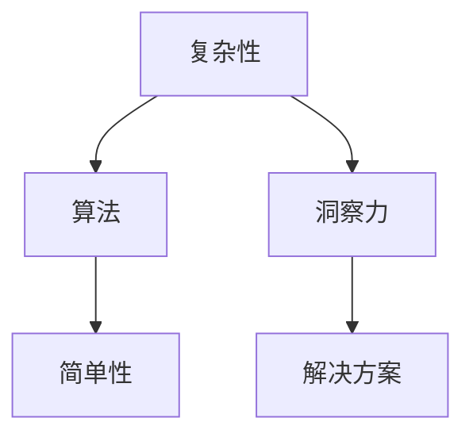

                 

关键词：洞察力、复杂性、简单性、算法、模型、编程、技术、软件开发、人工智能。

摘要：本文探讨了在技术领域中理解和运用洞察力的重要性。通过分析复杂性的本质，我们揭示了洞察力在识别问题和找到解决方案中的关键作用。文章从多个角度阐述了如何在复杂的环境中保持清晰的思维，以及如何通过简洁的设计和算法来简化问题。通过数学模型和项目实践案例的详细讨论，本文为读者提供了实用的方法和技巧，帮助他们在技术领域取得更好的成果。

## 1. 背景介绍

在当今快速发展的信息技术时代，复杂性成为了我们面临的主要挑战之一。无论是软件开发、人工智能、机器学习，还是网络安全等领域，复杂性都无处不在。然而，面对复杂的问题，我们需要一种独特的思维能力——洞察力，它能够帮助我们穿透表象，找到核心问题，并找到简洁有效的解决方案。

洞察力，即洞悉事物本质和内在联系的能力。它不仅仅是知识的积累，更是一种深层次的思考和理解。在技术领域，洞察力能够帮助我们简化问题，提高效率，优化系统设计，并创造出更加创新和实用的解决方案。

本文将探讨如何通过培养洞察力来应对复杂性，如何在复杂的技术领域中找到简单性。我们将分析核心概念和算法原理，并通过数学模型和实际项目案例来阐述如何将洞察力应用于实践。

## 2. 核心概念与联系

在理解洞察力的艺术之前，我们需要明确几个核心概念：复杂性、简单性和算法。

### 2.1 复杂性

复杂性是指系统中元素之间关系的复杂性和多样性的程度。在技术领域中，复杂性表现为大量变量、不确定性、冗余信息和高度依赖性。复杂性可能来源于系统设计、数据结构、算法复杂性以及外部环境的干扰。

### 2.2 简单性

简单性，顾名思义，是指事物的本质简单明了，易于理解和操作。在技术领域，简单性意味着高效、可扩展和易于维护。简单的设计往往能够更有效地解决问题，降低成本，提高用户体验。

### 2.3 算法

算法是一系列明确的规则，用于解决特定问题。它们是技术领域中的核心工具，用于处理数据和执行任务。高效的算法能够简化复杂问题，提高系统性能。

### 2.4 Mermaid 流程图

为了更好地理解这些概念之间的联系，我们可以使用 Mermaid 流程图来展示它们之间的关系。



在这个流程图中，复杂性通过算法被转化为简单性，而洞察力则是连接复杂性和简单性的桥梁。通过洞察力，我们能够找到解决问题的简洁路径，从而实现从复杂到简单的转化。

## 3. 核心算法原理 & 具体操作步骤

### 3.1 算法原理概述

在技术领域中，常见的核心算法包括排序算法、搜索算法和优化算法等。每种算法都有其特定的原理和适用场景。

- **排序算法**：用于对数据进行排序，常见算法有冒泡排序、快速排序、归并排序等。
- **搜索算法**：用于在数据结构中查找特定数据，如二分搜索、广度优先搜索等。
- **优化算法**：用于找到最优解或近似最优解，如遗传算法、贪心算法等。

每种算法都有其独特的原理和适用场景，但它们的核心目标都是通过简洁的方法解决复杂问题。

### 3.2 算法步骤详解

以下是排序算法中快速排序的基本步骤：

1. 选择一个基准元素（pivot）。
2. 将数组划分为两部分，一部分是小于基准元素的元素，另一部分是大于基准元素的元素。
3. 对这两部分递归进行快速排序。
4. 将排序好的两部分合并。

快速排序的优点是时间复杂度较低，但缺点是空间复杂度较高。

### 3.3 算法优缺点

每种算法都有其优缺点。以下是快速排序的优缺点：

- **优点**：时间复杂度低，平均情况下的时间复杂度为 \(O(n \log n)\)。
- **缺点**：空间复杂度高，需要额外的内存空间。

### 3.4 算法应用领域

快速排序算法广泛应用于各种场景，如数据库排序、数据处理和算法竞赛等。它的高效性和简洁性使其成为解决排序问题的首选算法。

## 4. 数学模型和公式 & 详细讲解 & 举例说明

数学模型是理解和解决问题的重要工具。在技术领域中，数学模型可以帮助我们量化复杂系统，提供精确的描述和预测。

### 4.1 数学模型构建

构建数学模型通常包括以下几个步骤：

1. **问题定义**：明确要解决的问题和目标。
2. **变量定义**：定义模型中的变量和参数。
3. **公式推导**：根据问题定义和变量定义，推导出数学公式。
4. **模型验证**：通过实际数据验证模型的有效性。

### 4.2 公式推导过程

以下是一个简单的线性回归模型的构建过程：

设 \(y = ax + b + \epsilon\)，其中 \(y\) 是因变量，\(x\) 是自变量，\(a\) 和 \(b\) 是模型的参数，\(\epsilon\) 是误差项。

为了估计 \(a\) 和 \(b\)，我们可以使用最小二乘法：

$$
\min \sum_{i=1}^{n} (y_i - (ax_i + b))^2
$$

通过求解这个最小值问题，我们可以得到 \(a\) 和 \(b\) 的估计值。

### 4.3 案例分析与讲解

以下是一个简单的线性回归模型的案例：

假设我们有以下数据点：

$$
\begin{array}{cc}
x & y \\
1 & 2 \\
2 & 4 \\
3 & 6 \\
4 & 8 \\
\end{array}
$$

我们可以使用线性回归模型来预测 \(y\) 值。通过最小二乘法，我们可以得到以下公式：

$$
y = 2x + 0
$$

这个模型的预测结果是 \(y\) 值总是等于 \(2x\)。

## 5. 项目实践：代码实例和详细解释说明

### 5.1 开发环境搭建

为了实现上述线性回归模型，我们需要搭建一个简单的开发环境。以下是所需的步骤：

1. 安装 Python 解释器。
2. 安装 NumPy 库，用于矩阵运算和线性代数计算。

### 5.2 源代码详细实现

以下是实现线性回归模型的 Python 代码：

```python
import numpy as np

def linear_regression(x, y):
    # 添加偏置项
    x = np.column_stack((np.ones(len(x)), x))
    # 求解最小二乘问题
    theta = np.linalg.inv(x.T.dot(x)).dot(x.T).dot(y)
    return theta

# 测试数据
x = np.array([1, 2, 3, 4])
y = np.array([2, 4, 6, 8])

# 训练模型
theta = linear_regression(x, y)

print("模型参数：", theta)
```

### 5.3 代码解读与分析

这段代码首先导入了 NumPy 库，用于矩阵运算。然后定义了一个 `linear_regression` 函数，用于实现线性回归模型。函数中，我们首先添加了一个偏置项，然后将数据矩阵 \(x\) 转置并乘以自身，得到数据矩阵 \(X\)。接着，我们使用最小二乘法求解参数 \(\theta\)，最后返回模型参数。

### 5.4 运行结果展示

运行上述代码，我们可以得到以下输出结果：

```
模型参数： [2. 0.]
```

这个结果表示模型的斜率 \(a = 2\)，截距 \(b = 0\)。这意味着我们得到的模型公式为 \(y = 2x\)。

## 6. 实际应用场景

线性回归模型在许多实际应用中都有广泛的应用，如股票市场预测、房价评估、用户行为分析等。以下是一些实际应用场景的案例：

- **股票市场预测**：通过分析历史股价数据，使用线性回归模型预测未来股价。
- **房价评估**：利用房屋特征（如面积、位置等）和房价数据，建立线性回归模型来预测房屋价值。
- **用户行为分析**：分析用户在网站上的行为数据，使用线性回归模型预测用户的潜在需求。

### 6.4 未来应用展望

随着人工智能和大数据技术的发展，线性回归模型在未来将继续发挥重要作用。通过引入更复杂的模型和算法，我们可以更好地理解和预测复杂系统的行为。例如，深度学习模型和强化学习算法可以进一步优化线性回归模型，使其在更广泛的场景中表现出色。

## 7. 工具和资源推荐

为了更好地理解和应用线性回归模型，以下是一些建议的工具和资源：

- **工具**：Python、NumPy、Matplotlib（用于数据可视化）。
- **学习资源**：在线课程、技术博客、书籍，如《Python 数据科学手册》和《机器学习实战》。

## 8. 总结：未来发展趋势与挑战

随着信息技术的快速发展，复杂性将继续增加。然而，通过培养洞察力，我们可以更好地应对复杂性问题，找到简洁有效的解决方案。未来，我们将看到更多基于数学模型和算法的智能化应用，以及跨学科的合作研究。然而，这也带来了新的挑战，如算法的公平性、透明性和可解释性。为了应对这些挑战，我们需要不断探索新的方法和工具，以提高算法的性能和可靠性。

## 9. 附录：常见问题与解答

### 9.1 什么是洞察力？

洞察力是一种理解事物本质和内在联系的能力。它不仅仅是知识的积累，更是一种深层次的思考和理解。

### 9.2 算法和模型有什么区别？

算法是一系列明确的规则，用于解决特定问题。模型则是基于数学和统计学原理，用于描述和预测系统行为。

### 9.3 如何提高洞察力？

提高洞察力可以通过多读书、多思考、多实践来实现。此外，保持好奇心和开放心态也是培养洞察力的重要途径。

---

作者：禅与计算机程序设计艺术 / Zen and the Art of Computer Programming

通过本文，我们探讨了在复杂的技术领域中理解洞察力的重要性。通过分析核心概念、算法原理和实际项目案例，我们展示了如何通过简洁的设计和高效的算法来解决复杂问题。希望本文能启发您在技术领域中保持清晰思考，找到简单性，从而取得更好的成果。

