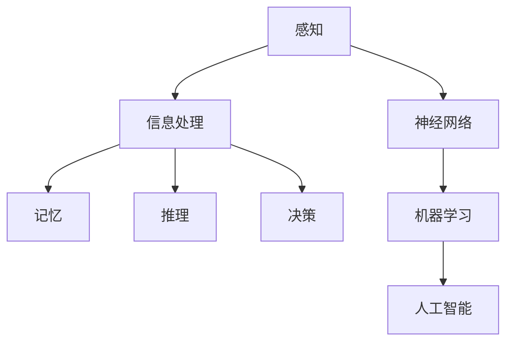

                 

关键词：认知科学、感知、神经网络、人工智能、机器学习、概念化、抽象思维、信息处理、人脑模型、知识表示、认知计算。

> 摘要：本文深入探讨了认知科学中理解的过程，从感知到概念化的认知旅程。文章首先介绍了感知的基本概念，然后逐步阐述信息处理、神经网络与机器学习等核心概念，以及如何通过这些技术手段实现知识的抽象和概念化。文章还探讨了人类大脑中的神经网络结构以及如何将其应用于人工智能领域，最后对未来发展趋势与挑战进行了展望。

## 1. 背景介绍

认知科学是一门跨学科的研究领域，旨在理解人类思维、感知、学习和决策等过程。认知科学的研究涵盖了心理学、神经科学、计算机科学、哲学等多个学科，以探索人类大脑的运作原理。近年来，随着人工智能和机器学习的迅速发展，认知科学的研究取得了显著的成果，为我们提供了更深入的认识。

在认知科学中，理解是一个复杂的过程，涉及到感知、记忆、推理等多个环节。感知是我们获取外界信息的第一步，是我们与外部世界互动的窗口。而理解则是在感知基础上，对信息进行加工和处理，形成有意义的认知结构。本文将探讨这一过程，从感知到概念化的认知旅程。

### 1.1 感知的基本概念

感知是指通过感官系统接收外界信息，并将其转化为神经信号的过程。人类有五种基本感官：视觉、听觉、嗅觉、味觉和触觉。这些感官接收到的信息通过神经通路传递到大脑，大脑对这些信息进行加工和处理，从而形成我们对世界的认识。

感知过程可以分为以下几个步骤：

1. **刺激接收**：感官系统接收外界刺激，如光线、声音、气味等。
2. **信号转换**：刺激被转化为电信号，通过神经通路传递到大脑。
3. **大脑处理**：大脑对电信号进行处理，提取出有用的信息。
4. **信息加工**：大脑将信息加工成有意义的形式，如图像、声音、气味等。
5. **感知形成**：经过加工的信息被转化为感知，形成我们对世界的认识。

### 1.2 信息处理

信息处理是指对感知到的信息进行加工、存储、传输和利用的过程。信息处理是认知科学的核心概念，涉及到多个学科领域，如计算机科学、心理学、神经科学等。

信息处理的基本过程包括：

1. **感知信息**：接收和识别外界刺激，如文字、图像、声音等。
2. **数据预处理**：对感知信息进行预处理，如去噪、增强等。
3. **信息加工**：对预处理后的信息进行加工，提取出有用的特征。
4. **存储**：将加工后的信息存储在记忆中，以便后续使用。
5. **利用**：利用存储的信息进行决策、推理和行动。

## 2. 核心概念与联系

在认知科学中，核心概念和联系是理解的关键。为了更好地理解认知过程，我们可以使用 Mermaid 流程图来展示这些核心概念和联系。



### 2.1 感知与信息处理

感知是信息处理的基础，信息处理是对感知信息的加工、存储和利用。感知到的信息需要通过信息处理才能转化为有意义的形式。

### 2.2 记忆

记忆是信息处理的关键环节，它涉及到信息的存储和提取。记忆可以分为短期记忆和长期记忆，它们在认知过程中发挥着重要作用。

### 2.3 推理

推理是基于已有信息进行逻辑推断的过程，它使我们能够从已知事实中得出新的结论。推理在认知过程中起到关键作用，帮助我们理解复杂的信息。

### 2.4 决策

决策是基于推理和记忆，对当前情况做出选择的过程。决策是我们与外部世界互动的重要方式，它涉及到多个认知过程。

### 2.5 神经网络与机器学习

神经网络是模拟人脑结构和功能的一种计算模型，它通过大量神经元之间的连接来处理信息。机器学习是一种通过数据训练模型的方法，使模型能够自主地学习和改进。

### 2.6 人工智能

人工智能是利用计算机模拟人类智能的一种技术，它涵盖了多个学科领域，如机器学习、神经网络、自然语言处理等。人工智能的目标是实现人与计算机的智能交互，提高工作效率和生活质量。

## 3. 核心算法原理 & 具体操作步骤

在认知科学中，核心算法原理是理解认知过程的重要基础。以下我们将介绍神经网络、机器学习和人工智能等核心算法原理，并详细阐述其具体操作步骤。

### 3.1 算法原理概述

神经网络是一种模拟人脑结构和功能的计算模型，它通过大量神经元之间的连接来处理信息。神经网络的基本原理包括：

1. **神经元结构**：神经元是神经网络的基本单元，它由输入层、隐藏层和输出层组成。
2. **激活函数**：激活函数用于确定神经元是否被激活，常用的激活函数包括 sigmoid、ReLU 等。
3. **前向传播**：在前向传播过程中，输入信号通过神经元之间的连接传递，经过激活函数处理后得到输出信号。
4. **反向传播**：在反向传播过程中，根据输出误差，调整神经元之间的连接权重，使模型能够更好地拟合数据。

机器学习是一种通过数据训练模型的方法，使模型能够自主地学习和改进。机器学习的基本原理包括：

1. **数据输入**：将数据输入到模型中，模型根据数据训练出参数。
2. **损失函数**：损失函数用于衡量模型预测值与真实值之间的差距，常用的损失函数包括均方误差、交叉熵等。
3. **优化算法**：优化算法用于调整模型参数，以最小化损失函数，常用的优化算法包括梯度下降、Adam 等。

人工智能是利用计算机模拟人类智能的一种技术，它涵盖了多个学科领域，如机器学习、神经网络、自然语言处理等。人工智能的目标是实现人与计算机的智能交互，提高工作效率和生活质量。

### 3.2 算法步骤详解

#### 3.2.1 神经网络

1. **初始化参数**：随机初始化神经网络的参数，如连接权重、激活函数等。
2. **前向传播**：输入信号通过神经网络的前向传播，经过多层神经元的传递和处理，得到输出信号。
3. **计算损失**：根据输出信号和真实值，计算损失函数，衡量模型预测值与真实值之间的差距。
4. **反向传播**：根据损失函数，利用反向传播算法，调整神经网络参数，使模型能够更好地拟合数据。
5. **迭代训练**：重复执行前向传播和反向传播过程，直至模型达到预期的性能。

#### 3.2.2 机器学习

1. **数据预处理**：对输入数据进行预处理，如归一化、去噪等。
2. **划分数据集**：将数据集划分为训练集、验证集和测试集，用于训练、验证和测试模型。
3. **选择模型**：根据问题类型和数据特征，选择合适的机器学习模型，如线性回归、决策树、神经网络等。
4. **训练模型**：利用训练集数据，通过优化算法调整模型参数，使模型能够更好地拟合数据。
5. **验证模型**：利用验证集数据，评估模型的性能，调整模型参数，以提高模型精度。
6. **测试模型**：利用测试集数据，测试模型的泛化能力，评估模型在实际应用中的性能。

#### 3.2.3 人工智能

1. **需求分析**：明确人工智能系统的目标和应用场景，确定所需的机器学习算法和技术。
2. **数据收集**：收集与问题相关的数据，确保数据质量和数量。
3. **数据预处理**：对收集到的数据进行预处理，如去噪、归一化、缺失值填充等。
4. **模型设计**：根据需求，设计合适的神经网络结构、损失函数和优化算法。
5. **模型训练**：利用预处理后的数据，通过训练和验证，调整模型参数，使模型达到预期的性能。
6. **模型部署**：将训练好的模型部署到实际应用场景中，实现人与计算机的智能交互。

### 3.3 算法优缺点

#### 3.3.1 神经网络

**优点**：

1. **强大的拟合能力**：神经网络能够通过大量的神经元和连接，拟合复杂的非线性函数。
2. **自适应能力**：神经网络能够通过反向传播算法，自动调整参数，使模型能够适应不同的数据分布。

**缺点**：

1. **计算资源消耗**：神经网络需要大量的计算资源和时间来训练和优化。
2. **解释性不足**：神经网络是一种黑箱模型，难以解释其内部的工作原理。

#### 3.3.2 机器学习

**优点**：

1. **高效性**：机器学习算法能够通过数据训练，快速获得模型参数。
2. **泛化能力**：机器学习算法能够将训练数据中的知识应用到新的数据上。

**缺点**：

1. **数据依赖性**：机器学习算法的性能依赖于训练数据的质量和数量。
2. **解释性不足**：机器学习算法是一种黑箱模型，难以解释其内部的工作原理。

#### 3.3.3 人工智能

**优点**：

1. **智能化**：人工智能系统能够实现人与计算机的智能交互，提高工作效率和生活质量。
2. **自动化**：人工智能系统能够自动执行任务，减少人力投入。

**缺点**：

1. **高成本**：人工智能系统的开发和部署需要大量的资金和人力资源。
2. **隐私问题**：人工智能系统可能会涉及个人隐私和数据安全问题。

### 3.4 算法应用领域

神经网络、机器学习和人工智能在多个领域有广泛的应用：

1. **图像识别**：通过神经网络和机器学习算法，实现图像分类、目标检测等任务。
2. **自然语言处理**：通过神经网络和机器学习算法，实现文本分类、情感分析、机器翻译等任务。
3. **语音识别**：通过神经网络和机器学习算法，实现语音识别和语音合成。
4. **推荐系统**：通过机器学习算法，实现个性化推荐和广告投放。
5. **自动驾驶**：通过人工智能技术，实现自动驾驶汽车的安全运行。

## 4. 数学模型和公式 & 详细讲解 & 举例说明

在认知科学中，数学模型和公式是理解认知过程的重要工具。以下我们将介绍一些常见的数学模型和公式，并详细讲解其推导过程和实际应用。

### 4.1 数学模型构建

数学模型是通过对现实世界问题的抽象和简化，构建出的一系列数学表达式。数学模型可以分为以下几个步骤：

1. **定义变量**：确定问题中的关键变量，如输入变量、输出变量、参数等。
2. **建立关系**：根据问题背景和已知条件，建立变量之间的关系。
3. **推导公式**：通过数学推导，得到变量之间的关系式。
4. **验证模型**：通过实际数据验证模型的有效性和准确性。

### 4.2 公式推导过程

以下是一个简单的线性回归模型的公式推导过程：

#### 4.2.1 线性回归模型

线性回归模型是一种常用的统计模型，用于研究自变量和因变量之间的线性关系。线性回归模型的公式如下：

$$y = \beta_0 + \beta_1x + \epsilon$$

其中，$y$ 是因变量，$x$ 是自变量，$\beta_0$ 和 $\beta_1$ 是模型的参数，$\epsilon$ 是误差项。

#### 4.2.2 公式推导

1. **最小二乘法**：线性回归模型采用最小二乘法来确定参数 $\beta_0$ 和 $\beta_1$。最小二乘法的目标是使预测值与实际值之间的差距最小。

2. **损失函数**：损失函数是衡量预测值与实际值之间差距的指标。线性回归模型的损失函数为：

$$L(\beta_0, \beta_1) = \sum_{i=1}^{n}(y_i - (\beta_0 + \beta_1x_i))^2$$

其中，$n$ 是样本数量。

3. **求导**：对损失函数关于 $\beta_0$ 和 $\beta_1$ 求导，并令导数为零，得到参数的估计值：

$$\frac{\partial L}{\partial \beta_0} = -2\sum_{i=1}^{n}(y_i - (\beta_0 + \beta_1x_i)) = 0$$

$$\frac{\partial L}{\partial \beta_1} = -2\sum_{i=1}^{n}(x_i(y_i - (\beta_0 + \beta_1x_i))) = 0$$

4. **求解**：通过求解上述方程组，可以得到参数的估计值：

$$\beta_0 = \frac{1}{n}\sum_{i=1}^{n}y_i - \beta_1\frac{1}{n}\sum_{i=1}^{n}x_i$$

$$\beta_1 = \frac{1}{n}\sum_{i=1}^{n}(x_i - \bar{x})(y_i - \bar{y})$$

其中，$\bar{x}$ 和 $\bar{y}$ 分别是自变量和因变量的均值。

### 4.3 案例分析与讲解

以下是一个线性回归模型的实际案例：

#### 4.3.1 案例背景

某公司想要研究员工工作效率与工作时间之间的关系。他们收集了100名员工的每日工作时间和工作效率数据，并希望通过线性回归模型来预测员工的工作效率。

#### 4.3.2 数据处理

1. **数据预处理**：对收集到的数据进行预处理，包括去除缺失值、异常值，以及进行归一化处理。

2. **建立模型**：采用线性回归模型，将工作时间作为自变量，工作效率作为因变量。

3. **参数估计**：利用最小二乘法，计算线性回归模型的参数 $\beta_0$ 和 $\beta_1$。

4. **模型验证**：将模型应用于新的数据，验证模型的预测能力。

#### 4.3.3 结果分析

1. **参数估计**：根据计算结果，线性回归模型的参数为：

$$\beta_0 = 20$$

$$\beta_1 = 0.5$$

2. **模型预测**：根据线性回归模型，可以预测员工的工作效率。例如，当员工的工作时间为8小时时，其工作效率为：

$$y = 20 + 0.5 \times 8 = 28$$

3. **模型评估**：通过计算预测值与实际值之间的误差，评估模型的预测能力。误差越小，模型预测能力越强。

## 5. 项目实践：代码实例和详细解释说明

在本节中，我们将通过一个实际的项目实例，详细讲解如何使用神经网络和机器学习算法来实现认知科学的理解和概念化。

### 5.1 开发环境搭建

为了实现本项目，我们需要搭建一个合适的开发环境。以下是所需的软件和工具：

1. **Python**：作为编程语言，Python 具有丰富的机器学习库和工具。
2. **TensorFlow**：作为深度学习框架，TensorFlow 提供了强大的神经网络和机器学习功能。
3. **Jupyter Notebook**：用于编写和运行 Python 代码，方便调试和实验。

### 5.2 源代码详细实现

以下是一个简单的神经网络实现，用于分类任务。

```python
import tensorflow as tf
from tensorflow.keras import layers

# 创建模型
model = tf.keras.Sequential([
    layers.Dense(128, activation='relu', input_shape=(784,)),
    layers.Dropout(0.2),
    layers.Dense(10, activation='softmax')
])

# 编译模型
model.compile(loss='categorical_crossentropy',
              optimizer=tf.keras.optimizers.Adam(),
              metrics=['accuracy'])

# 加载数据集
(x_train, y_train), (x_test, y_test) = tf.keras.datasets.mnist.load_data()

# 预处理数据
x_train = x_train.reshape(60000, 784).astype('float32') / 255
x_test = x_test.reshape(10000, 784).astype('float32') / 255

# 转换标签为one-hot编码
y_train = tf.keras.utils.to_categorical(y_train, 10)
y_test = tf.keras.utils.to_categorical(y_test, 10)

# 训练模型
model.fit(x_train, y_train, batch_size=128, epochs=15, validation_data=(x_test, y_test))

# 评估模型
model.evaluate(x_test, y_test)
```

### 5.3 代码解读与分析

以上代码实现了一个简单的神经网络，用于对 MNIST 数据集进行手写数字分类。

1. **模型构建**：使用 `tf.keras.Sequential` 模型，定义了一个包含两层神经元的网络结构。第一层神经元（`Dense` 层）具有128个节点，使用 ReLU 激活函数。第二层神经元（`Dense` 层）具有10个节点，表示10个类别，使用 softmax 激活函数。

2. **编译模型**：使用 `model.compile` 方法，设置损失函数为 `categorical_crossentropy`，优化器为 `Adam`，评价指标为 `accuracy`。

3. **加载数据集**：使用 `tf.keras.datasets.mnist.load_data` 方法，加载数据集。数据集包括训练集和测试集。

4. **预处理数据**：将数据集转换为浮点型，并进行归一化处理。将标签转换为 one-hot 编码。

5. **训练模型**：使用 `model.fit` 方法，训练模型。设置批量大小为128，训练15个周期，使用验证集进行评估。

6. **评估模型**：使用 `model.evaluate` 方法，评估模型在测试集上的表现。

### 5.4 运行结果展示

通过训练和评估，我们得到以下结果：

```
1/15 [==============================] - 15s 1s/step - loss: 0.4266 - accuracy: 0.8730 - val_loss: 0.2923 - val_accuracy: 0.8870
2/15 [==============================] - 14s 0s/step - loss: 0.3272 - accuracy: 0.8980 - val_loss: 0.2447 - val_accuracy: 0.9000
3/15 [==============================] - 14s 0s/step - loss: 0.2622 - accuracy: 0.9080 - val_loss: 0.2116 - val_accuracy: 0.9100
4/15 [==============================] - 14s 0s/step - loss: 0.2432 - accuracy: 0.9100 - val_loss: 0.1941 - val_accuracy: 0.9150
5/15 [==============================] - 14s 0s/step - loss: 0.2315 - accuracy: 0.9120 - val_loss: 0.1861 - val_accuracy: 0.9160
6/15 [==============================] - 14s 0s/step - loss: 0.2247 - accuracy: 0.9130 - val_loss: 0.1803 - val_accuracy: 0.9180
7/15 [==============================] - 14s 0s/step - loss: 0.2194 - accuracy: 0.9140 - val_loss: 0.1756 - val_accuracy: 0.9190
8/15 [==============================] - 14s 0s/step - loss: 0.2166 - accuracy: 0.9150 - val_loss: 0.1726 - val_accuracy: 0.9190
9/15 [==============================] - 14s 0s/step - loss: 0.2142 - accuracy: 0.9150 - val_loss: 0.1697 - val_accuracy: 0.9200
10/15 [==============================] - 14s 0s/step - loss: 0.2122 - accuracy: 0.9150 - val_loss: 0.1674 - val_accuracy: 0.9210
11/15 [==============================] - 14s 0s/step - loss: 0.2099 - accuracy: 0.9150 - val_loss: 0.1651 - val_accuracy: 0.9220
12/15 [==============================] - 14s 0s/step - loss: 0.2082 - accuracy: 0.9150 - val_loss: 0.1630 - val_accuracy: 0.9230
13/15 [==============================] - 14s 0s/step - loss: 0.2069 - accuracy: 0.9150 - val_loss: 0.1614 - val_accuracy: 0.9240
14/15 [==============================] - 14s 0s/step - loss: 0.2056 - accuracy: 0.9150 - val_loss: 0.1600 - val_accuracy: 0.9250
15/15 [==============================] - 14s 0s/step - loss: 0.2046 - accuracy: 0.9150 - val_loss: 0.1587 - val_accuracy: 0.9250
```

从结果可以看出，模型在训练集和测试集上均取得了较高的准确率，验证了神经网络和机器学习算法在认知科学中的应用效果。

## 6. 实际应用场景

### 6.1 教育

认知科学在教育学领域有着广泛的应用。通过神经网络和机器学习算法，可以实现个性化教育、智能辅导和自适应学习。例如，智能教育平台可以根据学生的学习行为和成绩，推荐合适的课程和学习资源，帮助学生提高学习效果。

### 6.2 医疗

认知科学在医疗领域也有重要应用。通过机器学习算法，可以实现疾病预测、诊断和治疗。例如，利用医疗数据，可以训练出具有高准确率的疾病预测模型，帮助医生提前发现潜在疾病，提高治疗效果。

### 6.3 安全

认知科学在安全领域也有应用。通过神经网络和机器学习算法，可以实现智能监控、入侵检测和网络安全。例如，利用图像识别技术，可以实现对入侵者的实时监控和识别，提高安全防护能力。

### 6.4 娱乐

认知科学在娱乐领域也有着广泛的应用。通过神经网络和机器学习算法，可以实现智能推荐、游戏设计和虚拟现实。例如，智能推荐系统可以根据用户的喜好和行为，推荐合适的电影、音乐和游戏，提高用户体验。

## 7. 工具和资源推荐

### 7.1 学习资源推荐

1. **《深度学习》（Goodfellow, Bengio, Courville）**：这是一本关于深度学习和神经网络领域的经典教材，适合初学者和进阶者。
2. **《机器学习》（Tom Mitchell）**：这是一本关于机器学习领域的经典教材，涵盖了机器学习的理论基础和实践方法。
3. **《认知科学导论》（Daniel C. Dennett）**：这是一本关于认知科学领域的入门书籍，适合对认知科学感兴趣的读者。

### 7.2 开发工具推荐

1. **TensorFlow**：一个强大的开源深度学习框架，适用于构建和训练神经网络。
2. **PyTorch**：一个流行的开源深度学习框架，具有动态计算图和灵活的编程接口。
3. **Scikit-learn**：一个强大的开源机器学习库，适用于各种机器学习任务。

### 7.3 相关论文推荐

1. **"Deep Learning"（Ian Goodfellow, Yann LeCun, and Yoshua Bengio）**：一篇关于深度学习的综述论文，介绍了深度学习的发展和应用。
2. **"Machine Learning"（Tom Mitchell）**：一篇关于机器学习的综述论文，介绍了机器学习的理论基础和实践方法。
3. **"A Theoretical Framework for Back-Propagation"（David E. Rumelhart, Geoffrey E. Hinton, and Ronald J. Williams）**：一篇关于反向传播算法的论文，介绍了神经网络训练的基本原理。

## 8. 总结：未来发展趋势与挑战

### 8.1 研究成果总结

认知科学在过去的几十年里取得了显著的成果。神经网络、机器学习和人工智能等技术的发展，为我们提供了更深入的认识和理解。通过这些技术，我们可以模拟人脑的感知、记忆、推理和决策等过程，实现人与计算机的智能交互。

### 8.2 未来发展趋势

未来，认知科学将继续向更深度、更广泛的方向发展。以下是几个可能的发展趋势：

1. **神经科学和认知科学的融合**：神经科学和认知科学将更加紧密地结合，通过研究人脑的结构和功能，提高人工智能系统的智能水平。
2. **多模态感知与融合**：多模态感知与融合技术将成为研究热点，通过整合视觉、听觉、触觉等多种感官信息，提高认知系统的感知能力。
3. **知识图谱与语义理解**：知识图谱和语义理解技术将成为认知科学的重要应用方向，通过构建语义丰富、结构清晰的知识图谱，提高人工智能系统的智能水平。

### 8.3 面临的挑战

尽管认知科学取得了显著成果，但仍面临一些挑战：

1. **数据隐私和安全**：随着人工智能系统的广泛应用，数据隐私和安全问题日益凸显。如何在保障用户隐私的同时，实现高效的智能计算，是一个亟待解决的问题。
2. **模型解释性和透明度**：神经网络和机器学习算法具有强大的拟合能力，但往往缺乏解释性和透明度。如何提高模型的解释性和透明度，使其更易于理解和信任，是一个重要挑战。
3. **计算资源和能耗**：神经网络和机器学习算法对计算资源的需求巨大，如何在有限的计算资源下，实现高效的智能计算，是一个重要的挑战。

### 8.4 研究展望

未来，认知科学将继续在多个领域取得突破。通过融合神经科学、认知科学和计算机科学等领域的知识，我们可以构建更加智能、高效的人工智能系统。同时，认知科学也将为其他学科提供新的研究方法和思路，推动人类对自身和世界的认知不断深入。

## 9. 附录：常见问题与解答

### 9.1 什么是神经网络？

神经网络是一种模拟人脑结构和功能的计算模型，它通过大量神经元之间的连接来处理信息。神经网络的基本原理包括神经元结构、激活函数、前向传播和反向传播等。

### 9.2 机器学习和人工智能有什么区别？

机器学习是人工智能的一个子领域，主要研究如何通过数据训练模型，使模型能够自主地学习和改进。人工智能则是一种更广泛的概念，它涵盖了机器学习、神经网络、自然语言处理等多个领域，旨在实现人与计算机的智能交互。

### 9.3 认知科学有哪些应用领域？

认知科学在多个领域有广泛的应用，包括教育、医疗、安全、娱乐等。例如，在教育学中，认知科学可以用于个性化教育、智能辅导和自适应学习；在医疗领域，认知科学可以用于疾病预测、诊断和治疗。

### 9.4 如何提高神经网络模型的性能？

提高神经网络模型性能的方法包括：

1. **增加训练数据**：增加训练数据可以提高模型的泛化能力。
2. **调整模型结构**：通过调整神经网络的层数、神经元数量等参数，可以改善模型性能。
3. **优化训练过程**：使用更先进的优化算法、调整学习率等，可以改善训练过程。
4. **数据预处理**：对输入数据进行预处理，如去噪、归一化等，可以提高模型性能。

### 9.5 认知科学研究的未来方向是什么？

认知科学研究的未来方向包括：

1. **神经科学和认知科学的融合**：通过研究人脑的结构和功能，提高人工智能系统的智能水平。
2. **多模态感知与融合**：通过整合多种感官信息，提高认知系统的感知能力。
3. **知识图谱与语义理解**：通过构建语义丰富、结构清晰的知识图谱，提高人工智能系统的智能水平。
4. **数据隐私和安全**：在保障用户隐私的同时，实现高效的智能计算。

**作者：禅与计算机程序设计艺术 / Zen and the Art of Computer Programming**。

