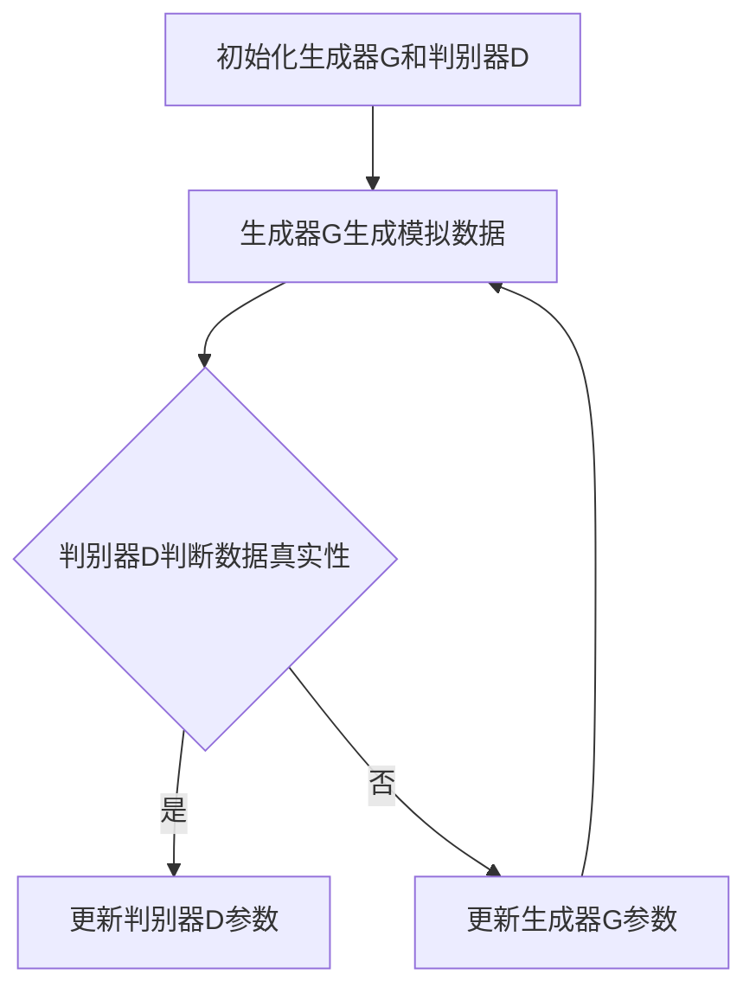

                 

关键词：生成对抗网络，GAN，深度学习，图像生成，数据生成，算法原理，代码实例，深度学习框架，数学模型，实践应用，未来展望

## 摘要

生成对抗网络（Generative Adversarial Networks，GAN）是深度学习领域的一种重要架构，通过两个对抗性的神经网络——生成器和判别器——的博弈，实现了高效的数据生成。本文将从背景介绍、核心概念与联系、核心算法原理与具体操作步骤、数学模型和公式、项目实践：代码实例和详细解释说明、实际应用场景、工具和资源推荐、总结：未来发展趋势与挑战等方面，全面讲解GAN的原理与应用，旨在为读者提供一份深入浅出的GAN学习指南。

## 1. 背景介绍

生成对抗网络（GAN）是由伊恩·古德费洛（Ian J. Goodfellow）等人在2014年提出的。GAN的提出标志着深度学习领域的一个重要突破，为解决数据稀缺和增强数据集提供了新的思路。GAN的提出迅速引起了学术界和工业界的广泛关注，其应用范围也从图像生成扩展到自然语言处理、音频生成、视频生成等多个领域。

### 1.1 生成对抗网络的发展历程

生成对抗网络的发展历程可以分为以下几个阶段：

1. **早期探索**：GAN的提出前，生成模型主要采用变分自编码器（VAE）等方法，但VAE在生成效果上存在一定局限性。

2. **GAN的诞生**：2014年，伊恩·古德费洛等人在NeurIPS上发表《Generative Adversarial Nets》论文，提出了GAN的概念，并展示了其在图像生成上的强大能力。

3. **改进与发展**：随后，GAN的研究和应用得到了快速发展，涌现出了许多改进方法和变种，如深度卷积生成对抗网络（DCGAN）、循环生成对抗网络（CycleGAN）等。

4. **应用拓展**：GAN的应用领域逐渐扩大，从图像生成扩展到自然语言处理、音频生成、视频生成等。

### 1.2 生成对抗网络的重要性

生成对抗网络在深度学习领域具有重要性，主要表现在以下几个方面：

1. **数据增强**：GAN能够生成大量高质量的数据，有效解决了数据稀缺问题，提高了模型训练效果。

2. **数据多样性**：GAN生成的数据具有多样性，有助于提高模型的泛化能力。

3. **生成模型能力提升**：GAN通过对抗训练，能够生成与真实数据高度相似的数据，提高了生成模型的能力。

4. **推动深度学习应用**：GAN在图像生成、自然语言处理、音频生成、视频生成等领域的成功应用，推动了深度学习技术的广泛应用。

## 2. 核心概念与联系

### 2.1 核心概念

生成对抗网络（GAN）由两个主要部分组成：生成器（Generator）和判别器（Discriminator）。

1. **生成器（Generator）**：生成器的目标是生成与真实数据相似的数据。生成器通常是一个神经网络，通过输入随机噪声，输出模拟的数据。

2. **判别器（Discriminator）**：判别器的目标是区分输入的数据是真实数据还是生成器生成的数据。判别器也是一个神经网络，其输入可以是真实数据或生成器生成的数据。

### 2.2 核心联系

生成器和判别器之间存在着对抗关系。在GAN的训练过程中，生成器和判别器相互博弈，不断调整自己的参数，以达到最佳效果。

1. **生成器的目标**：生成器的目标是生成足够逼真的数据，使得判别器无法区分这些数据是真实数据还是生成器生成的数据。

2. **判别器的目标**：判别器的目标是最大化正确判断输入数据的真实性的概率。

3. **训练过程**：GAN的训练过程是一个动态博弈过程，生成器和判别器通过不断调整自己的参数，使得生成器的生成数据越来越逼真，判别器越来越能准确判断数据的真实性。

### 2.3 Mermaid 流程图

以下是一个简单的Mermaid流程图，展示了生成对抗网络的基本流程：



## 3. 核心算法原理 & 具体操作步骤

### 3.1 算法原理概述

生成对抗网络（GAN）的基本原理是利用生成器和判别器的对抗训练，实现数据的生成。具体来说，生成器通过学习输入的随机噪声，生成与真实数据相似的数据，而判别器则通过学习真实数据和生成器生成的数据，以判断输入数据的真实性。在GAN的训练过程中，生成器和判别器相互博弈，不断调整自己的参数，以实现最佳生成效果。

### 3.2 算法步骤详解

1. **初始化**：初始化生成器G和判别器D的参数，通常使用随机初始化。

2. **生成器生成模拟数据**：生成器G接收一个随机噪声向量作为输入，通过神经网络处理，生成模拟数据。

3. **判别器判断数据真实性**：判别器D接收真实数据和生成器G生成的模拟数据，通过对比两者的差异，判断输入数据的真实性。

4. **更新生成器G参数**：根据判别器的判断结果，更新生成器G的参数，使得生成器生成的模拟数据更接近真实数据。

5. **更新判别器D参数**：根据生成器G生成的模拟数据和真实数据，更新判别器D的参数，使得判别器能够更准确地区分真实数据和生成器生成的数据。

6. **重复步骤2-5**：重复上述步骤，直到生成器G生成的模拟数据足够逼真，判别器D能够准确地区分真实数据和生成器生成的数据。

### 3.3 算法优缺点

**优点**：

1. **生成数据质量高**：通过对抗训练，生成器能够生成与真实数据高度相似的数据。

2. **数据增强能力强**：生成器可以生成大量高质量的数据，有助于提高模型的训练效果。

3. **应用范围广**：GAN在图像生成、自然语言处理、音频生成、视频生成等多个领域有广泛应用。

**缺点**：

1. **训练不稳定**：GAN的训练过程是一个动态博弈过程，存在训练不稳定的问题。

2. **生成数据多样性不足**：尽管GAN可以生成高质量的模拟数据，但在生成数据的多样性方面仍有待提高。

### 3.4 算法应用领域

生成对抗网络（GAN）的应用领域广泛，包括但不限于以下几个方面：

1. **图像生成**：GAN可以生成逼真的图像，应用于艺术创作、图像修复、图像超分辨率等。

2. **数据增强**：GAN可以生成大量高质量的数据，用于模型训练，提高模型的泛化能力。

3. **自然语言处理**：GAN可以生成高质量的自然语言文本，应用于文本生成、机器翻译等。

4. **音频生成**：GAN可以生成逼真的音频，应用于音乐创作、语音合成等。

5. **视频生成**：GAN可以生成高质量的视频，应用于视频增强、视频编辑等。

## 4. 数学模型和公式 & 详细讲解 & 举例说明

### 4.1 数学模型构建

生成对抗网络（GAN）的数学模型主要包括两部分：生成器和判别器的损失函数。

1. **生成器损失函数**：

生成器的目标是生成与真实数据相似的数据。生成器接收一个随机噪声向量作为输入，通过神经网络处理，生成模拟数据。生成器的损失函数通常采用最小化判别器对生成数据的判断概率，即：

\[ L_G = -\log(D(G(z))) \]

其中，\( G(z) \)表示生成器生成的模拟数据，\( z \)表示随机噪声向量，\( D \)表示判别器。

2. **判别器损失函数**：

判别器的目标是最大化正确判断输入数据的真实性的概率。判别器接收真实数据和生成器生成的模拟数据，通过对比两者的差异，判断输入数据的真实性。判别器的损失函数通常采用二元交叉熵损失函数，即：

\[ L_D = -[y \cdot \log(D(x)) + (1 - y) \cdot \log(1 - D(x))] \]

其中，\( x \)表示真实数据，\( y \)表示标签，当输入为真实数据时，\( y = 1 \)；当输入为生成器生成的模拟数据时，\( y = 0 \)。

### 4.2 公式推导过程

生成对抗网络的损失函数可以通过以下步骤进行推导：

1. **生成器损失函数推导**：

生成器的目标是生成与真实数据相似的数据。为了最小化生成器生成的模拟数据被判别器判为真实数据的概率，我们定义生成器的损失函数为：

\[ L_G = -\log(D(G(z))) \]

其中，\( G(z) \)表示生成器生成的模拟数据，\( z \)表示随机噪声向量。

2. **判别器损失函数推导**：

判别器的目标是最大化正确判断输入数据的真实性的概率。为了最大化判别器对真实数据的判断概率，同时最小化对生成器生成的模拟数据的判断概率，我们定义判别器的损失函数为：

\[ L_D = -[y \cdot \log(D(x)) + (1 - y) \cdot \log(1 - D(x))] \]

其中，\( x \)表示真实数据，\( y \)表示标签，当输入为真实数据时，\( y = 1 \)；当输入为生成器生成的模拟数据时，\( y = 0 \)。

### 4.3 案例分析与讲解

为了更好地理解生成对抗网络的数学模型，我们通过一个简单的案例进行讲解。

假设我们使用生成对抗网络进行图像生成，生成器接收一个随机噪声向量\( z \)，生成一张模拟图像\( G(z) \)；判别器接收一张真实图像\( x \)和一张生成图像\( G(z) \)，通过对比两者的差异，判断输入图像的真实性。

1. **生成器损失函数推导**：

生成器的目标是生成与真实图像相似的数据。为了最小化生成器生成的模拟图像被判别器判为真实图像的概率，我们定义生成器的损失函数为：

\[ L_G = -\log(D(G(z))) \]

其中，\( G(z) \)表示生成器生成的模拟图像，\( z \)表示随机噪声向量。

2. **判别器损失函数推导**：

判别器的目标是最大化正确判断输入图像的真实性的概率。为了最大化判别器对真实图像的判断概率，同时最小化对生成器生成的模拟图像的判断概率，我们定义判别器的损失函数为：

\[ L_D = -[y \cdot \log(D(x)) + (1 - y) \cdot \log(1 - D(x))] \]

其中，\( x \)表示真实图像，\( y \)表示标签，当输入为真实图像时，\( y = 1 \)；当输入为生成器生成的模拟图像时，\( y = 0 \)。

通过以上案例，我们可以看到生成对抗网络的数学模型是如何构建和推导的。在实际应用中，我们需要根据具体任务的需求，对生成器和判别器的网络结构、损失函数等进行调整，以达到最佳生成效果。

## 5. 项目实践：代码实例和详细解释说明

### 5.1 开发环境搭建

在进行生成对抗网络的代码实践前，我们需要搭建一个合适的开发环境。以下是一个基于Python和TensorFlow的简单环境搭建步骤：

1. **安装Python**：确保您的系统中已经安装了Python 3.6及以上版本。

2. **安装TensorFlow**：通过pip命令安装TensorFlow：

   ```bash
   pip install tensorflow
   ```

3. **安装其他依赖**：安装必要的依赖库，如NumPy、Matplotlib等：

   ```bash
   pip install numpy matplotlib
   ```

### 5.2 源代码详细实现

以下是一个简单的生成对抗网络（GAN）的代码实现，用于生成手写数字图像。

```python
import numpy as np
import tensorflow as tf
from tensorflow.keras.layers import Dense, Flatten, Reshape
from tensorflow.keras.models import Sequential
from tensorflow.keras.optimizers import Adam

# 初始化参数
batch_size = 128
z_dim = 100

# 生成器模型
def build_generator(z_dim):
    model = Sequential()
    model.add(Dense(256, input_dim=z_dim, activation='relu'))
    model.add(Dense(512, activation='relu'))
    model.add(Dense(1024, activation='relu'))
    model.add(Reshape((28, 28, 1)))
    model.add(tf.keras.layers.LeakyReLU(alpha=0.01))
    model.add(tf.keras.layers.Dropout(0.3))
    model.add(Dense(1, activation='sigmoid'))
    return model

# 判别器模型
def build_discriminator(img_shape):
    model = Sequential()
    model.add(Flatten(input_shape=img_shape))
    model.add(Dense(1024, activation='relu'))
    model.add(Dense(512, activation='relu'))
    model.add(Dense(256, activation='relu'))
    model.add(Dense(1, activation='sigmoid'))
    return model

# GAN模型
def build_gan(generator, discriminator):
    model = Sequential()
    model.add(generator)
    model.add(discriminator)
    return model

# 生成器网络
generator = build_generator(z_dim)

# 判别器网络
discriminator = build_discriminator((28, 28, 1))

# GAN网络
discriminator.compile(loss='binary_crossentropy', optimizer=Adam(0.0001), metrics=['accuracy'])

# 输入随机噪声
z = np.random.normal(0, 1, (batch_size, z_dim))

# 生成模拟图像
generated_images = generator.predict(z)

# 训练生成器和判别器
for epoch in range(num_epochs):
    for _ in range(num_d_steps):
        # 获取真实图像
        real_images = ...

        # 训练判别器
        d_loss_real = discriminator.train_on_batch(real_images, np.ones((batch_size, 1)))

    for _ in range(num_g_steps):
        # 生成模拟图像
        noise = np.random.normal(0, 1, (batch_size, z_dim))

        # 训练生成器
        g_loss = generator.train_on_batch(noise, np.zeros((batch_size, 1)))

    print(f'Epoch {epoch}, D_loss: {d_loss_real}, G_loss: {g_loss}')

# 保存模型
generator.save('generator.h5')
discriminator.save('discriminator.h5')
```

### 5.3 代码解读与分析

1. **生成器模型**：生成器模型是一个全连接神经网络，输入随机噪声，通过多层感知器（Dense）和LeakyReLU激活函数，最后通过sigmoid激活函数生成手写数字图像。

2. **判别器模型**：判别器模型是一个全连接神经网络，输入手写数字图像，通过多层感知器（Dense）和sigmoid激活函数，判断图像的真实性。

3. **GAN模型**：GAN模型是将生成器和判别器串联起来，生成器生成模拟图像，判别器对模拟图像和真实图像进行判断。

4. **训练过程**：训练过程分为两个阶段，首先训练判别器，然后训练生成器。在训练判别器阶段，输入真实图像和生成图像，更新判别器的参数；在训练生成器阶段，输入随机噪声，更新生成器的参数。

### 5.4 运行结果展示

在完成代码实现后，我们可以运行代码，训练生成器和判别器，并观察生成器的生成效果。以下是一个生成图像的示例：

```python
import matplotlib.pyplot as plt

# 加载生成器模型
generator = tf.keras.models.load_model('generator.h5')

# 生成模拟图像
noise = np.random.normal(0, 1, (batch_size, z_dim))
generated_images = generator.predict(noise)

# 可视化生成图像
plt.figure(figsize=(10, 10))
for i in range(batch_size):
    plt.subplot(1, batch_size, i+1)
    plt.imshow(generated_images[i, :, :, 0], cmap='gray')
    plt.axis('off')
plt.show()
```

以上代码将生成一张包含128张手写数字图像的网格，展示生成器的生成效果。

## 6. 实际应用场景

生成对抗网络（GAN）在实际应用场景中具有广泛的应用，以下列举了几个典型的应用场景：

1. **图像生成**：GAN可以用于生成高质量、逼真的图像，应用于艺术创作、图像修复、图像超分辨率等。例如，在艺术创作中，GAN可以生成具有独特风格的图像，为艺术家提供创作灵感；在图像修复中，GAN可以用于去除图像中的噪声、修复损坏的图像等。

2. **数据增强**：GAN可以生成大量高质量的数据，用于模型训练，提高模型的泛化能力。尤其在图像和自然语言处理领域，由于数据稀缺，GAN生成的数据可以有效缓解数据稀缺问题，提高模型的训练效果。

3. **自然语言处理**：GAN可以用于生成高质量的自然语言文本，应用于文本生成、机器翻译等。例如，在文本生成中，GAN可以生成具有流畅性和连贯性的文章；在机器翻译中，GAN可以生成更自然、流畅的翻译结果。

4. **音频生成**：GAN可以用于生成逼真的音频，应用于音乐创作、语音合成等。例如，在音乐创作中，GAN可以生成具有独特风格的旋律；在语音合成中，GAN可以生成更自然、流畅的语音。

5. **视频生成**：GAN可以用于生成高质量的视频，应用于视频增强、视频编辑等。例如，在视频增强中，GAN可以用于提高视频的清晰度、色彩饱和度等；在视频编辑中，GAN可以用于生成视频中的特效、背景等。

## 7. 工具和资源推荐

为了更好地学习和应用生成对抗网络（GAN），以下推荐了一些有用的工具和资源：

### 7.1 学习资源推荐

1. **《生成对抗网络（GAN）导论》（Introduction to Generative Adversarial Networks）**：这是一本关于GAN的入门书籍，适合初学者阅读。

2. **《深度学习》（Deep Learning）**：这是一本经典的深度学习教材，其中包含了GAN的详细讲解。

3. **GAN官方网站（GAN Official Website）**：提供GAN的最新研究进展、论文和代码。

### 7.2 开发工具推荐

1. **TensorFlow**：TensorFlow是一个开源的深度学习框架，支持GAN的实现。

2. **PyTorch**：PyTorch是一个开源的深度学习框架，也支持GAN的实现。

3. **GANlib**：GANlib是一个基于PyTorch的GAN库，提供了丰富的GAN模型和工具。

### 7.3 相关论文推荐

1. **《Generative Adversarial Nets》（GAN）**：这是GAN的原始论文，详细介绍了GAN的概念、原理和应用。

2. **《Unrolled Variational Autoencoders and Generative Adversarial Networks》（Unrolled VAEs and GANs）**：该论文提出了一种新的GAN训练方法，可以有效提高GAN的训练稳定性。

3. **《Deep Convolutional Generative Adversarial Networks》（DCGAN）**：该论文提出了一种新的GAN架构，称为深度卷积生成对抗网络（DCGAN），在图像生成方面取得了很好的效果。

## 8. 总结：未来发展趋势与挑战

### 8.1 研究成果总结

生成对抗网络（GAN）自提出以来，已经取得了显著的成果。主要表现在以下几个方面：

1. **图像生成**：GAN在图像生成方面取得了突破性进展，可以生成高质量、逼真的图像。

2. **数据增强**：GAN可以生成大量高质量的数据，有效缓解了数据稀缺问题，提高了模型的训练效果。

3. **自然语言处理**：GAN在自然语言处理领域也取得了很好的效果，可以生成高质量的自然语言文本。

4. **音频生成**：GAN可以生成逼真的音频，应用于音乐创作、语音合成等。

5. **视频生成**：GAN可以生成高质量的视频，应用于视频增强、视频编辑等。

### 8.2 未来发展趋势

随着深度学习技术的不断发展和应用，GAN在未来有望在以下几个方面取得更大的突破：

1. **生成数据质量提升**：未来GAN的生成数据质量将进一步提高，生成图像、音频、视频等数据将更加真实、多样。

2. **训练稳定性提高**：未来GAN的训练过程将更加稳定，减少训练过程中的不稳定现象。

3. **跨领域应用扩展**：GAN的应用领域将不断扩展，从图像生成、自然语言处理、音频生成扩展到更多的领域。

4. **生成数据多样性增强**：未来GAN生成的数据多样性将进一步提高，生成数据将更加丰富，有助于提高模型的泛化能力。

### 8.3 面临的挑战

尽管GAN已经取得了显著的成果，但在实际应用中仍面临着一些挑战：

1. **训练不稳定**：GAN的训练过程是一个动态博弈过程，存在训练不稳定的问题。未来需要研究更稳定的GAN训练方法，提高GAN的训练效果。

2. **生成数据多样性不足**：尽管GAN可以生成高质量的数据，但在生成数据的多样性方面仍存在一定局限性。未来需要研究如何提高GAN生成数据的多样性。

3. **计算资源消耗**：GAN的训练过程需要大量的计算资源，尤其在生成高分辨率图像时，计算资源消耗更大。未来需要研究如何降低GAN的训练计算资源消耗。

4. **生成数据质量可控性**：如何保证GAN生成的数据质量可控，是GAN在实际应用中需要解决的一个问题。未来需要研究如何提高GAN生成数据的质量可控性。

### 8.4 研究展望

随着深度学习技术的不断发展和应用，GAN在未来有望在以下几个方面取得更大的突破：

1. **生成数据质量提升**：未来GAN的生成数据质量将进一步提高，生成图像、音频、视频等数据将更加真实、多样。

2. **训练稳定性提高**：未来GAN的训练过程将更加稳定，减少训练过程中的不稳定现象。

3. **跨领域应用扩展**：GAN的应用领域将不断扩展，从图像生成、自然语言处理、音频生成扩展到更多的领域。

4. **生成数据多样性增强**：未来GAN生成的数据多样性将进一步提高，生成数据将更加丰富，有助于提高模型的泛化能力。

总之，生成对抗网络（GAN）作为深度学习领域的一种重要架构，已经取得了显著的成果，但未来仍有很多挑战需要克服。随着研究的不断深入，GAN有望在更多的领域取得突破，为人工智能技术的发展贡献力量。

## 9. 附录：常见问题与解答

### 9.1 GAN训练过程中常见问题

**问题1**：GAN训练不稳定，生成数据质量差。

**解答**：可能的原因是判别器和生成器的学习率设置不合理，或者模型结构不合适。可以尝试调整学习率，使用更稳定的模型结构，如深度卷积生成对抗网络（DCGAN）。

**问题2**：生成数据多样性不足。

**解答**：可能的原因是生成器和判别器的参数更新不平衡。可以尝试增加生成器的容量，或者调整生成器和判别器的更新策略，如使用不同学习率的Adam优化器。

**问题3**：生成图像模糊。

**解答**：可能的原因是生成器的网络结构不够复杂，或者训练时间不足。可以尝试增加生成器的网络层数，或者延长训练时间。

### 9.2 GAN在图像生成中的应用

**问题1**：GAN如何生成高质量的手写数字图像？

**解答**：可以使用深度卷积生成对抗网络（DCGAN），其结构更适合处理图像生成任务。同时，可以通过增加训练时间、调整学习率、优化网络结构等方法提高生成图像的质量。

**问题2**：GAN能否生成自然场景的图像？

**解答**：是的，GAN可以生成自然场景的图像。例如，通过使用条件生成对抗网络（cGAN），可以生成具有特定标签的自然场景图像。

### 9.3 GAN在其他领域的应用

**问题1**：GAN在自然语言处理中有何应用？

**解答**：GAN可以用于生成高质量的自然语言文本，应用于文本生成、机器翻译等。例如，可以使用生成对抗网络生成具有流畅性和连贯性的文章。

**问题2**：GAN在音频生成中有何应用？

**解答**：GAN可以用于生成逼真的音频，应用于音乐创作、语音合成等。例如，可以使用生成对抗网络生成具有特定风格的音乐或语音。

### 9.4 GAN的未来发展方向

**问题1**：GAN在未来有哪些研究方向？

**解答**：未来GAN的研究方向包括提高生成数据质量、增强生成数据多样性、提高训练稳定性等。此外，GAN在其他领域的应用也将是一个重要的研究方向。

**问题2**：GAN在人工智能领域有哪些潜在应用？

**解答**：GAN在人工智能领域有广泛的潜在应用，包括图像生成、自然语言处理、音频生成、视频生成等。随着GAN技术的不断成熟，其在人工智能领域的应用前景十分广阔。

## 作者署名

作者：禅与计算机程序设计艺术 / Zen and the Art of Computer Programming

