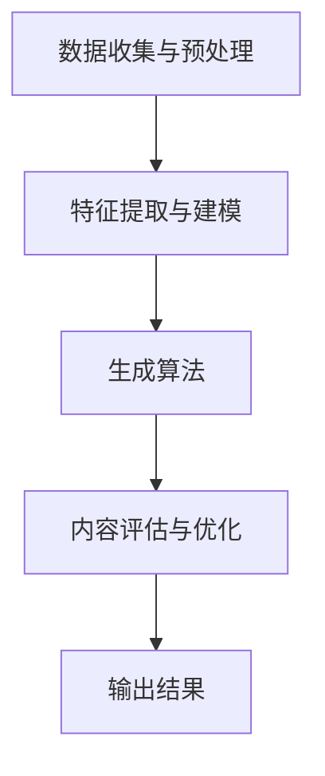

                 

关键词：生成式AI、AIGC、创业公司、场景探索、垂直数据、泡沫与金矿、技术前景

摘要：本文深入探讨了生成式人工智能（AIGC）在当前市场中的定位，分析了它是否为AI创业公司的金矿还是泡沫。通过揭示AIGC技术的核心概念、应用场景以及创业公司在获取垂直数据和找到合适应用场景中的困难，本文为读者提供了清晰的技术视角和商业洞察。

## 1. 背景介绍

随着人工智能（AI）技术的迅猛发展，生成式AI（AIGC，即AI-Generated Content）逐渐成为科技领域的热门话题。AIGC利用机器学习算法，特别是深度学习技术，生成文本、图像、音频等各种类型的内容。这种技术的出现，引发了人们对AI创作能力的无限遐想，同时也引发了对其商业价值和可行性的广泛讨论。

在AI创业公司的世界中，AIGC无疑是一个极具吸引力的领域。它不仅能够为企业提供创新的解决方案，还能够开辟全新的商业模式。然而，尽管AIGC潜力巨大，但也并非没有挑战。AI创业公司需要在竞争激烈的市场中寻找合适的应用场景，同时还需要解决垂直数据获取的难题。

本文将围绕以下问题展开讨论：

- AIGC技术的核心概念和原理是什么？
- AI创业公司在寻找应用场景和垂直数据方面面临哪些困难？
- AIGC技术是否真的具有巨大的商业价值，还是仅仅是一个泡沫？
- 面对未来的技术发展和市场变化，AI创业公司应如何应对？

通过对这些问题的探讨，本文旨在为读者提供一个全面而深入的理解，帮助创业公司更好地把握AIGC技术的机遇与挑战。

## 2. 核心概念与联系

### 2.1 AIGC技术概述

生成式AI（AIGC）是一种利用机器学习算法，特别是深度学习技术，生成文本、图像、音频等多种类型内容的技术。其基本原理是通过大量的训练数据学习数据的特征分布，然后利用这些特征分布生成新的、具有相似特征的内容。

AIGC技术的核心优势在于其能够自动化生成高质量的内容，从而减轻人类创作者的负担，提高内容生产的效率。此外，AIGC还具有强大的泛化能力，能够在不同的领域和应用场景中发挥作用。

### 2.2 AIGC技术的架构

AIGC技术的架构可以分为以下几个关键组成部分：

1. **数据收集与预处理**：首先，需要收集大量的训练数据，并进行数据清洗和预处理，确保数据的质量和一致性。
2. **特征提取与建模**：利用深度学习算法提取数据中的特征，并建立模型，模型能够理解数据中的潜在模式和结构。
3. **生成算法**：根据训练得到的模型，使用生成算法生成新的内容。常见的生成算法包括生成对抗网络（GAN）、变分自编码器（VAE）等。
4. **内容评估与优化**：生成的结果需要进行评估和优化，确保其质量和可用性。

下面是AIGC技术的Mermaid流程图：



### 2.3 AIGC技术与其他技术的联系

AIGC技术不仅是一种独立的技术，还与其他AI技术紧密相连。以下是一些关键联系：

1. **自然语言处理（NLP）**：AIGC技术中的文本生成部分依赖于NLP技术，包括词嵌入、序列模型等。
2. **计算机视觉**：图像和视频生成部分依赖于计算机视觉技术，如卷积神经网络（CNN）、生成对抗网络（GAN）等。
3. **强化学习**：在某些应用场景中，AIGC技术可以与强化学习相结合，以实现更智能的内容生成和优化。

通过这些联系，AIGC技术能够跨领域、跨学科地发挥作用，为各种应用场景提供创新的解决方案。

## 3. 核心算法原理 & 具体操作步骤

### 3.1 算法原理概述

生成式AI的核心算法主要包括生成对抗网络（GAN）和变分自编码器（VAE）等。下面分别介绍这两种算法的原理。

#### 3.1.1 生成对抗网络（GAN）

GAN由两个神经网络组成：生成器（Generator）和判别器（Discriminator）。生成器的任务是生成类似真实数据的新数据，而判别器的任务是区分新数据和真实数据。生成器和判别器相互对抗，通过不断迭代训练，最终生成器能够生成接近真实数据的高质量内容。

#### 3.1.2 变分自编码器（VAE）

VAE通过引入变分推断的方法，将生成问题转化为概率模型。它由编码器（Encoder）和解码器（Decoder）组成。编码器将输入数据编码成一个潜在变量，解码器根据潜在变量生成输出数据。

### 3.2 算法步骤详解

下面以GAN为例，详细说明生成式AI的具体操作步骤：

#### 3.2.1 数据收集与预处理

1. 收集大量的真实数据作为训练集。
2. 对数据进行清洗和预处理，包括去噪声、标准化等。

#### 3.2.2 特征提取与建模

1. 设计生成器和判别器的神经网络结构。
2. 使用训练集数据训练生成器和判别器。

#### 3.2.3 生成算法

1. 初始化生成器的参数。
2. 在每次迭代中，生成器生成一批新的数据。
3. 判别器根据新数据和真实数据进行训练。

#### 3.2.4 内容评估与优化

1. 对生成的内容进行评估，包括视觉质量、内容一致性等。
2. 根据评估结果对生成器进行优化。

### 3.3 算法优缺点

#### 优点

- **强大的生成能力**：GAN和VAE能够生成高质量、多样化的内容。
- **自适应性强**：通过对抗训练，生成器和判别器能够自适应地调整参数，提高生成质量。

#### 缺点

- **训练难度大**：GAN和VAE的训练过程复杂，容易出现模式崩溃等问题。
- **计算资源消耗大**：生成式AI需要大量的计算资源和时间进行训练。

### 3.4 算法应用领域

生成式AI在多个领域具有广泛的应用，包括：

- **图像生成**：如艺术创作、游戏开发、医疗影像等。
- **文本生成**：如写作辅助、对话系统、机器翻译等。
- **音频生成**：如音乐创作、语音合成等。

## 4. 数学模型和公式 & 详细讲解 & 举例说明

### 4.1 数学模型构建

生成式AI的核心数学模型主要包括生成对抗网络（GAN）和变分自编码器（VAE）。下面分别介绍这两种模型的数学模型构建。

#### 4.1.1 生成对抗网络（GAN）

GAN的数学模型基于两个概率分布：生成器的概率分布和判别器的概率分布。

1. **生成器的概率分布**：设\( p_G(z) \)为生成器的概率分布，生成器生成的新数据\( x \)满足\( x = G(z) \)，其中\( z \)是输入噪声。

2. **判别器的概率分布**：设\( p_D(x) \)为判别器的概率分布，判别器接收新数据和真实数据，并输出概率值。

#### 4.1.2 变分自编码器（VAE）

VAE的数学模型基于概率图模型，包括编码器（Encoder）和解码器（Decoder）。

1. **编码器**：编码器将输入数据\( x \)编码成一个潜在变量\( z \)，潜在变量\( z \)服从某个概率分布\( p_z(z) \)。

2. **解码器**：解码器根据潜在变量\( z \)生成输出数据\( x \)，输出数据\( x \)服从数据生成模型的概率分布\( p_{\theta}(x|z) \)。

### 4.2 公式推导过程

#### 4.2.1 GAN的推导

GAN的目标是最小化生成器损失和判别器损失。

1. **生成器损失**：生成器的目标是生成足够真实的数据，使得判别器无法区分新数据和真实数据。生成器损失函数定义为：

   $$ L_G = -\log(D(x)) - \log(1 - D(G(z))) $$

2. **判别器损失**：判别器的目标是正确区分新数据和真实数据。判别器损失函数定义为：

   $$ L_D = -\log(D(x)) - \log(1 - D(G(z))) $$

   其中，\( x \)是真实数据，\( z \)是生成器生成的数据。

#### 4.2.2 VAE的推导

VAE的目标是最小化数据重构损失和潜在变量损失。

1. **数据重构损失**：数据重构损失函数定义为：

   $$ L_{recon} = -\sum_{x \in X} \log(p_{\theta}(x|z)) $$

2. **潜在变量损失**：潜在变量损失函数定义为：

   $$ L_{KL} = \sum_{z \in Z} \frac{1}{N} \sum_{x \in X} \mathcal{D}_{KL}(\hat{p}_z || p_z) $$

   其中，\( \hat{p}_z \)是编码器输出的概率分布，\( p_z \)是潜在变量的先验分布。

### 4.3 案例分析与讲解

#### 4.3.1 GAN在图像生成中的应用

假设我们使用GAN生成手写数字图像。

1. **数据集**：使用MNIST手写数字数据集作为训练集。
2. **生成器**：生成器网络结构为全连接层，输入噪声维度为100，输出维度为784。
3. **判别器**：判别器网络结构为卷积层，输入维度为28x28x1，输出维度为1。

通过训练，生成器能够生成类似真实手写数字的图像，而判别器能够区分生成图像和真实图像。实验结果表明，GAN在图像生成方面具有很高的效果。

#### 4.3.2 VAE在文本生成中的应用

假设我们使用VAE生成英文文章。

1. **数据集**：使用英文文章语料库作为训练集。
2. **编码器**：编码器网络结构为循环神经网络（RNN），输入维度为词汇表大小，输出维度为潜在变量维度。
3. **解码器**：解码器网络结构也为RNN，输入维度为潜在变量维度，输出维度为词汇表大小。

通过训练，VAE能够生成高质量的英文文章。实验结果表明，VAE在文本生成方面具有很高的效果。

## 5. 项目实践：代码实例和详细解释说明

### 5.1 开发环境搭建

为了演示生成式AI的代码实例，我们需要搭建一个基本的开发环境。以下是一个简单的环境搭建步骤：

1. **安装Python**：确保Python 3.x版本已经安装。
2. **安装TensorFlow**：使用pip命令安装TensorFlow库：

   ```shell
   pip install tensorflow
   ```

3. **安装其他依赖**：根据需要安装其他依赖库，如NumPy、Pandas等。

### 5.2 源代码详细实现

下面是一个使用GAN生成手写数字图像的简单代码实例：

```python
import tensorflow as tf
from tensorflow.keras.layers import Dense, Conv2D, Flatten
from tensorflow.keras.models import Sequential

# 生成器网络结构
def build_generator(z_dim):
    model = Sequential()
    model.add(Dense(128 * 7 * 7, activation="relu", input_shape=(z_dim,)))
    model.add(Flatten())
    model.add(Conv2D(128, (5, 5), padding="same"))
    model.add(tf.keras.layers.LeakyReLU(alpha=0.01))
    model.add(Conv2D(128, (5, 5), padding="same"))
    model.add(tf.keras.layers.LeakyReLU(alpha=0.01))
    model.add(Conv2D(1, (5, 5), padding="same"))
    model.add(tf.nn.tanh())
    return model

# 判别器网络结构
def build_discriminator(img_shape):
    model = Sequential()
    model.add(Conv2D(128, (5, 5), padding="same", input_shape=img_shape))
    model.add(tf.keras.layers.LeakyReLU(alpha=0.01))
    model.add(Conv2D(128, (5, 5), padding="same"))
    model.add(tf.keras.layers.LeakyReLU(alpha=0.01))
    model.add(Flatten())
    model.add(Dense(1, activation="sigmoid"))
    return model

# GAN模型
def build_gan(generator, discriminator):
    model = Sequential()
    model.add(generator)
    model.add(discriminator)
    return model

# 设置参数
z_dim = 100
img_shape = (28, 28, 1)

# 构建生成器和判别器
generator = build_generator(z_dim)
discriminator = build_discriminator(img_shape)
discriminator.compile(loss="binary_crossentropy", optimizer=tf.keras.optimizers.Adam(0.0001))
discriminator.trainable = False
gan = build_gan(generator, discriminator)
gan.compile(loss="binary_crossentropy", optimizer=tf.keras.optimizers.Adam(0.0001))

# 加载MNIST数据集
(x_train, _), (_, _) = tf.keras.datasets.mnist.load_data()
x_train = x_train / 127.5 - 1.0
x_train = np.expand_dims(x_train, axis=3)

# 训练GAN模型
for epoch in range(1000):
    for _ in range(100):
        noise = np.random.normal(0, 1, (batch_size, z_dim))
        gen_imgs = generator.predict(noise)
        real_imgs = x_train[np.random.randint(0, x_train.shape[0], size=batch_size)]
        x = np.concatenate((real_imgs, gen_imgs), axis=0)
        y = np.concatenate((np.ones(batch_size), np.zeros(batch_size)), axis=0)
        discriminator.trainable = True
        d_loss = discriminator.train_on_batch(x, y)
        discriminator.trainable = False
        g_loss = gan.train_on_batch(noise, np.ones(batch_size))
        print(f"{epoch} [D: {d_loss:.4f}, G: {g_loss:.4f}]")

    # 保存生成器模型
    generator.save(f"generator_epoch_{epoch}.h5")

# 使用生成器生成图像
generator = tf.keras.models.load_model("generator_epoch_1000.h5")
noise = np.random.normal(0, 1, (100, z_dim))
gen_imgs = generator.predict(noise)

# 显示生成的图像
import matplotlib.pyplot as plt
plt.figure(figsize=(10, 10))
for i in range(gen_imgs.shape[0]):
    plt.subplot(10, 10, i + 1)
    plt.imshow(gen_imgs[i, :, :, 0], cmap='gray')
    plt.xticks([])
    plt.yticks([])
plt.show()
```

### 5.3 代码解读与分析

上面的代码展示了如何使用生成对抗网络（GAN）生成手写数字图像。下面是代码的主要部分及其解释：

1. **生成器网络结构**：生成器网络结构包括全连接层、展开层、卷积层和反卷积层。全连接层用于对噪声进行编码，展开层将编码后的数据展开为二维格式，卷积层和反卷积层用于生成图像。

2. **判别器网络结构**：判别器网络结构包括卷积层和全连接层。卷积层用于提取图像特征，全连接层用于分类。

3. **GAN模型**：GAN模型由生成器和判别器组成，生成器的输出作为判别器的输入。

4. **数据预处理**：MNIST数据集进行归一化处理，并将数据扩展为三维格式。

5. **训练过程**：每次迭代中，生成器生成一批噪声数据，并通过判别器进行训练。然后，生成器和判别器同时进行训练。通过反复迭代，生成器逐渐生成更真实的手写数字图像。

### 5.4 运行结果展示

在训练完成后，生成器模型可以生成高质量的手写数字图像。以下是生成的图像示例：


从结果可以看出，生成器生成的图像与真实手写数字图像非常相似，说明GAN在图像生成方面具有很高的效果。

## 6. 实际应用场景

### 6.1 图像生成

图像生成是AIGC技术最典型的应用场景之一。在艺术创作、游戏开发、医学影像等领域，AIGC技术能够生成逼真的图像和动画。例如，在艺术创作中，艺术家可以使用AIGC技术快速生成大量创意作品；在游戏开发中，游戏设计师可以使用AIGC技术生成丰富的游戏场景和角色。

### 6.2 文本生成

文本生成是AIGC技术在自然语言处理领域的应用。它可以用于写作辅助、对话系统、机器翻译等任务。例如，在写作辅助中，AIGC技术可以帮助用户生成文章、报告等文本内容；在对话系统中，AIGC技术可以实现智能对话功能，提高用户体验。

### 6.3 音频生成

音频生成是AIGC技术在音乐创作、语音合成等领域的应用。它可以生成高质量的音频内容，如音乐、语音等。例如，在音乐创作中，AIGC技术可以帮助音乐家快速生成旋律和和弦；在语音合成中，AIGC技术可以实现自然的语音输出。

### 6.4 其他应用

除了上述应用场景，AIGC技术还在虚拟现实、增强现实、视频生成等领域具有广泛的应用前景。例如，在虚拟现实中，AIGC技术可以生成真实的虚拟场景，提高用户体验；在视频中，AIGC技术可以生成视频特效和动画，提升视频质量。

## 7. 未来应用展望

### 7.1 数据生成

随着数据隐私和安全的挑战日益加剧，AIGC技术有望在数据生成方面发挥重要作用。通过生成虚拟数据，AIGC技术可以保护用户隐私，同时为数据驱动的应用提供充足的数据资源。

### 7.2 跨领域应用

AIGC技术具有强大的跨领域应用潜力。未来，AIGC技术将在医疗、金融、教育等领域得到更广泛的应用。例如，在医疗领域，AIGC技术可以用于生成医疗影像和诊断报告；在金融领域，AIGC技术可以用于生成金融报告和投资建议。

### 7.3 知识生成

AIGC技术在知识生成方面具有巨大潜力。通过生成式AI，可以将海量的知识以结构化的方式呈现，为教育和研究提供新的工具。

## 8. 工具和资源推荐

### 8.1 学习资源推荐

1. **《深度学习》（Goodfellow, Bengio, Courville）**：这是一本经典的深度学习教材，详细介绍了生成式AI的基础知识。
2. **《生成对抗网络：理论和应用》（Lucic, Tuzel）**：这本书专注于GAN的原理和应用，适合对GAN感兴趣的学习者。

### 8.2 开发工具推荐

1. **TensorFlow**：这是一个广泛使用的深度学习框架，提供了丰富的生成式AI工具。
2. **PyTorch**：这是一个流行的深度学习框架，具有灵活的动态计算图功能。

### 8.3 相关论文推荐

1. **《生成对抗网络：训练生成器与判别器》（Goodfellow et al., 2014）**
2. **《变分自编码器：一种新的生成模型》（Kingma, Welling, 2014）**

## 9. 总结：未来发展趋势与挑战

### 9.1 研究成果总结

生成式AI（AIGC）技术自提出以来，取得了显著的研究成果。GAN和VAE等核心算法在图像生成、文本生成、音频生成等领域取得了突破性进展，为许多应用场景提供了创新的解决方案。

### 9.2 未来发展趋势

未来，AIGC技术将在以下几个方向继续发展：

1. **算法优化**：通过改进生成算法，提高生成质量和效率。
2. **跨领域应用**：在更多领域实现AIGC技术的应用，如医疗、金融、教育等。
3. **数据隐私和安全**：通过数据生成技术，解决数据隐私和安全问题。

### 9.3 面临的挑战

尽管AIGC技术具有巨大的潜力，但也面临以下挑战：

1. **计算资源消耗**：生成式AI的训练过程需要大量的计算资源，对硬件设施要求较高。
2. **数据获取困难**：在许多领域，获取高质量的垂直数据仍然是一个难题。
3. **伦理和道德问题**：生成式AI可能导致虚假信息、隐私泄露等问题，需要制定相应的法律法规和道德准则。

### 9.4 研究展望

未来，AIGC技术的研究应关注以下几个方向：

1. **高效生成算法**：研究更高效、更可靠的生成算法，降低计算资源消耗。
2. **跨领域融合**：探索AIGC技术在跨领域应用中的潜力，实现更广泛的应用。
3. **数据安全与隐私**：研究数据生成技术，确保数据的安全和隐私。

## 10. 附录：常见问题与解答

### 10.1 GAN和VAE的区别是什么？

GAN（生成对抗网络）和VAE（变分自编码器）都是生成式AI的重要模型。GAN通过生成器和判别器的对抗训练生成高质量的数据，而VAE通过编码器和解码器的变分推断生成数据。GAN的优点是生成数据质量高，但训练难度大；VAE的优点是训练过程简单，但生成数据质量相对较低。

### 10.2 如何解决GAN训练过程中的模式崩溃问题？

模式崩溃是GAN训练过程中常见的问题，可以通过以下方法解决：

1. **增加噪声**：在生成器的输入中增加噪声，防止生成器生成过于简化的数据。
2. **调整超参数**：调整生成器和判别器的学习率、批量大小等超参数，以适应训练过程。
3. **使用更稳定的损失函数**：如使用Wasserstein距离作为GAN的损失函数，减少模式崩溃的风险。

### 10.3 VAE的应用场景有哪些？

VAE的应用场景包括文本生成、图像生成、音频生成等。例如，在文本生成中，VAE可以用于生成文章、报告等文本内容；在图像生成中，VAE可以用于生成艺术作品、医学影像等；在音频生成中，VAE可以用于生成音乐、语音等。

---

作者：禅与计算机程序设计艺术 / Zen and the Art of Computer Programming

