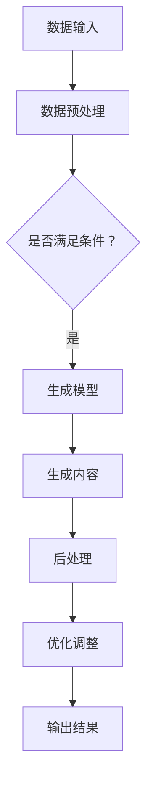

                 

关键词：生成式AI，AIGC，AI泡沫，尖刀场景，技术应用

> 摘要：本文从生成式AI（AIGC）的发展背景出发，探讨了当前业界对AI技术的盲目追捧现象。通过深入分析AIGC的核心概念、算法原理、应用领域和实际案例分析，本文提出了在技术发展中保持理性、聚焦实际应用场景的重要性。文章最后对未来发展趋势和挑战进行了展望，并提出了相关的工具和资源推荐，以期为读者提供对AIGC技术的全面理解和指导。

## 1. 背景介绍

### 1.1 AI的发展历程

人工智能（Artificial Intelligence，AI）作为计算机科学的一个分支，自20世纪50年代诞生以来，经历了数个重要阶段的发展。早期的AI主要集中在逻辑推理和问题解决上，如早期专家系统的出现。20世纪80年代，随着计算能力的提升，AI逐渐扩展到更为复杂的模式识别和机器学习领域。进入21世纪，深度学习算法的突破进一步推动了AI的发展，使其在语音识别、图像处理、自然语言处理等领域取得了显著的成果。

### 1.2 AIGC的概念

生成式AI（Generative AI，GAI）是近年来AI领域的一个新兴热点。与传统的AI应用不同，生成式AI不仅能够识别和分类数据，还能够生成新的数据。生成式AI的核心思想是通过学习大量的数据模式，自动生成新的数据，如图像、文本、音频等。AIGC（AI-Generated Content）则是在生成式AI的基础上，专门针对内容创作领域的技术，如AI绘画、AI写作、AI音乐生成等。

### 1.3 AI泡沫与理性反思

近年来，随着AI技术的快速发展，市场对AI的追捧也日益升温。然而，在这股热潮中，也出现了许多盲目跟风的现象，导致AI泡沫的出现。一些企业和投资者过度依赖AI技术，忽视了实际应用场景的需求和可行性。因此，在AI技术发展中，如何保持理性、避免盲目跟风，成为了一个亟待解决的问题。

## 2. 核心概念与联系

### 2.1 生成式AI原理

生成式AI的核心在于生成模型（Generative Model），这种模型通过学习数据分布来生成新的数据。常见的生成模型包括变分自编码器（Variational Autoencoder，VAE）、生成对抗网络（Generative Adversarial Network，GAN）等。

### 2.2 AIGC架构

AIGC的架构通常包括数据输入、生成模型、后处理三个主要部分。数据输入部分负责采集和预处理原始数据；生成模型部分负责根据输入数据生成新的内容；后处理部分则对生成的数据进行优化和调整，以提高生成内容的质量。

### 2.3 Mermaid流程图



## 3. 核心算法原理 & 具体操作步骤

### 3.1 算法原理概述

生成式AI的核心算法主要包括生成模型和判别模型。生成模型负责生成新的数据，判别模型则负责判断生成数据的真实性和质量。两者相互博弈，共同提升生成数据的质量。

### 3.2 算法步骤详解

1. **数据收集与预处理**：收集大量高质量的原始数据，并进行数据清洗、归一化等预处理操作。
2. **生成模型训练**：利用收集到的数据训练生成模型，使其学会生成新的数据。
3. **判别模型训练**：同时训练判别模型，使其能够判断生成数据的真实性和质量。
4. **生成与评估**：通过生成模型生成新的数据，并利用判别模型进行评估。
5. **优化与调整**：根据评估结果，对生成模型进行调整，以提高生成数据的质量。

### 3.3 算法优缺点

**优点**：
- 能够生成高质量的新数据。
- 具有较强的泛化能力。

**缺点**：
- 训练过程复杂，计算资源需求高。
- 需要大量高质量的数据。

### 3.4 算法应用领域

生成式AI在多个领域具有广泛的应用，如：

- 图像生成：用于艺术创作、图像修复、图像生成等。
- 文本生成：用于自动写作、机器翻译、问答系统等。
- 音频生成：用于音乐创作、语音合成等。

## 4. 数学模型和公式 & 详细讲解 & 举例说明

### 4.1 数学模型构建

生成式AI的核心在于概率模型，常用的概率模型包括马尔可夫模型、贝叶斯网络、潜在变量模型等。以下以变分自编码器（VAE）为例，介绍其数学模型构建。

### 4.2 公式推导过程

VAE的数学模型主要由两部分组成：编码器和解码器。

1. **编码器**：
   $$ 
   \mu = \sigma(\theta_1 x) 
   $$
   $$
   \sigma = \sigma(\theta_2 x) 
   $$
   其中，$x$ 是输入数据，$\mu$ 和 $\sigma$ 分别表示编码器的均值和方差，$\theta_1$ 和 $\theta_2$ 是编码器的参数。

2. **解码器**：
   $$
   x' = \sigma(\theta_3 z) 
   $$
   其中，$z$ 是编码器输出的潜在变量，$\theta_3$ 是解码器的参数。

### 4.3 案例分析与讲解

以图像生成任务为例，使用VAE生成一张新的图像。首先，收集大量图像数据，并对其进行预处理。然后，训练VAE模型，使其学会将图像数据编码为潜在变量，再将潜在变量解码为新的图像。最后，对生成的图像进行评估，根据评估结果调整模型参数，以提高生成图像的质量。

## 5. 项目实践：代码实例和详细解释说明

### 5.1 开发环境搭建

在本节中，我们将搭建一个用于生成图像的VAE模型。开发环境要求如下：

- Python 3.8及以上版本
- TensorFlow 2.6及以上版本
- Numpy 1.19及以上版本

安装所需的库：

```bash
pip install tensorflow numpy
```

### 5.2 源代码详细实现

```python
import tensorflow as tf
import numpy as np
import matplotlib.pyplot as plt

# 设置超参数
latent_dim = 100
learning_rate = 0.0002
batch_size = 64
epochs = 50

# 数据预处理
(x_train, _), (x_test, _) = tf.keras.datasets.mnist.load_data()
x_train = x_train.astype(np.float32) / 255.0
x_test = x_test.astype(np.float32) / 255.0

# 构建编码器
class Encoder(tf.keras.Model):
  def __init__(self, latent_dim):
    super(Encoder, self).__init__()
    self.fc1 = tf.keras.layers.Dense(128, activation='relu')
    self.fc2 = tf.keras.layers.Dense(64, activation='relu')
    self.fc3 = tf.keras.layers.Dense(latent_dim * 2)

  @tf.function
  def call(self, x):
    x = self.fc1(x)
    x = self.fc2(x)
    z_mean, z_log_var = self.fc3(x)
    z_mean = tf.reshape(z_mean, [-1, latent_dim])
    z_log_var = tf.reshape(z_log_var, [-1, latent_dim])
    return z_mean, z_log_var

# 构建解码器
class Decoder(tf.keras.Model):
  def __init__(self, latent_dim):
    super(Decoder, self).__init__()
    self.fc1 = tf.keras.layers.Dense(64, activation='relu')
    self.fc2 = tf.keras.layers.Dense(128, activation='relu')
    self.fc3 = tf.keras.layers.Dense(784, activation='sigmoid')

  @tf.function
  def call(self, z):
    z = self.fc1(z)
    z = self.fc2(z)
    x_logit = self.fc3(z)
    return x_logit

# 构建VAE模型
class VAE(tf.keras.Model):
  def __init__(self, latent_dim):
    super(VAE, self).__init__()
    self.encoder = Encoder(latent_dim)
    self.decoder = Decoder(latent_dim)

  @tf.function
  def call(self, x, training=False):
    z_mean, z_log_var = self.encoder(x)
    z = z_mean + tf.random.normal(tf.shape(z_mean)) * tf.exp(0.5 * z_log_var)
    x_logit = self.decoder(z)
    return x_logit

  @tf.function
  def train_step(self, x):
    with tf.GradientTape() as tape:
      x_logit = self(x, training=True)
      x = tf.clip_by_value(x_logit, 1e-10, 1 - 1e-10)
      x_log_prob = tf.nn.sigmoid_cross_entropy_with_logits(logits=x, labels=x)
      z_mean, z_log_var = self.encoder(x)
      z = z_mean + tf.random.normal(tf.shape(z_mean)) * tf.exp(0.5 * z_log_var)
      z_log_prob = tf.nn.sigmoid_cross_entropy_with_logits(logits=z, labels=z)
      reconstruction_loss = tf.reduce_mean(x_log_prob)
      kl_loss = tf.reduce_mean(z_log_prob + z_log_var - latent_dim)
      loss = reconstruction_loss + kl_loss

    grads = tape.gradient(loss, self.trainable_variables)
    self.optimizer.apply_gradients(zip(grads, self.trainable_variables))
    return loss

# 训练模型
model = VAE(latent_dim)
model.train_step = VAE.train_step
optimizer = tf.keras.optimizers.Adam(learning_rate)
model.compile(optimizer=optimizer)

# 训练VAE模型
for epoch in range(epochs):
  for batch in x_train:
    loss = model.train_step(batch)
  print(f"Epoch {epoch + 1}, Loss: {loss:.4f}")

# 生成图像
latent_vector = tf.random.normal([1, latent_dim])
generated_image = model.decoder(latent_vector)
generated_image = tf.sigmoid(generated_image)
generated_image = generated_image.numpy()

# 展示生成图像
plt.imshow(generated_image.reshape(28, 28), cmap="gray")
plt.show()
```

### 5.3 代码解读与分析

本段代码首先导入了所需的库，并设置了超参数。然后定义了编码器、解码器和VAE模型。编码器用于将输入图像编码为潜在变量，解码器用于将潜在变量解码为新的图像。VAE模型则结合了编码器和解码器，并实现了训练和评估过程。

在训练过程中，VAE模型通过优化重构损失和KL散度损失来提升生成图像的质量。最后，通过生成一个随机的潜在变量，使用解码器生成了一张新的图像。

### 5.4 运行结果展示

运行上述代码后，我们将看到一张由VAE模型生成的新的图像。这张图像的质量虽然不及真实图像，但已经具有一定的逼真度。这表明VAE模型在图像生成任务上具有一定的效果。

## 6. 实际应用场景

### 6.1 艺术创作

生成式AI在艺术创作领域具有广泛的应用，如AI绘画、AI音乐创作等。通过学习大量的艺术作品和音乐数据，生成式AI能够自动生成新的艺术作品和音乐，为创作者提供灵感。

### 6.2 图像处理

生成式AI在图像处理领域也有重要的应用，如图像修复、图像超分辨率等。通过生成高质量的图像，生成式AI能够显著提升图像处理的效果。

### 6.3 自然语言处理

生成式AI在自然语言处理领域也有广泛的应用，如自动写作、机器翻译等。通过学习大量的文本数据，生成式AI能够自动生成新的文本内容，为内容创作者提供帮助。

### 6.4 未来应用展望

随着生成式AI技术的不断发展，未来其在更多领域的应用将会越来越广泛。例如，在医疗领域，生成式AI可以用于医学图像生成和诊断；在工业领域，生成式AI可以用于产品设计和优化等。

## 7. 工具和资源推荐

### 7.1 学习资源推荐

- 《深度学习》（Goodfellow, Bengio, Courville著）：全面介绍深度学习的基本原理和应用。
- 《生成对抗网络：理论、实现与应用》（杨强、张志峰著）：详细介绍GAN的理论基础和应用实践。
- 《自然语言处理综论》（Jurafsky, Martin著）：全面介绍自然语言处理的基本原理和应用。

### 7.2 开发工具推荐

- TensorFlow：一个用于机器学习和深度学习的开源框架。
- PyTorch：一个用于机器学习和深度学习的开源框架。
- Keras：一个基于TensorFlow和PyTorch的简洁易用的深度学习库。

### 7.3 相关论文推荐

- Ian J. Goodfellow, et al. "Generative Adversarial Networks". Advances in Neural Information Processing Systems, 2014.
- Yann LeCun, et al. "Deep Learning". Nature, 2015.
- David J. C. MacKay. "Information Theory, Inference and Learning Algorithms". Cambridge University Press, 2003.

## 8. 总结：未来发展趋势与挑战

### 8.1 研究成果总结

生成式AI（AIGC）作为近年来人工智能领域的重要进展，已在多个领域展现出巨大的潜力。通过学习大量数据，生成式AI能够自动生成新的图像、文本、音频等，为创作者、开发者提供了强大的工具。

### 8.2 未来发展趋势

随着技术的不断发展，生成式AI将在更多领域得到应用，如医疗、工业、艺术等。同时，生成式AI的技术体系也将不断完善，包括更高效的算法、更丰富的应用场景等。

### 8.3 面临的挑战

尽管生成式AI具有巨大的潜力，但其在实际应用中也面临一些挑战。首先，生成式AI的训练过程复杂，计算资源需求高。其次，生成式AI的生成质量受限于训练数据的质量。此外，生成式AI的应用也涉及到版权、隐私等问题。

### 8.4 研究展望

未来，生成式AI的研究将主要集中在以下几个方面：

- 算法优化：研究更高效的生成式算法，降低计算资源需求。
- 数据集构建：构建更丰富的训练数据集，提高生成质量。
- 应用拓展：探索生成式AI在更多领域的应用，如医疗、工业等。
- 法律法规：研究生成式AI的法律法规，确保其合法合规应用。

## 9. 附录：常见问题与解答

### 9.1 什么是生成式AI？

生成式AI是一种人工智能技术，它能够通过学习大量数据，自动生成新的数据，如图像、文本、音频等。

### 9.2 生成式AI有哪些应用场景？

生成式AI在多个领域具有广泛的应用，如图像生成、文本生成、音频生成等。具体应用场景包括艺术创作、图像处理、自然语言处理等。

### 9.3 生成式AI的训练过程复杂吗？

生成式AI的训练过程相对复杂，需要大量计算资源和时间。训练过程中，需要不断调整模型参数，以提高生成数据的质量。

### 9.4 生成式AI会替代人类吗？

生成式AI是一种辅助工具，它能够帮助人类提高工作效率，但无法完全替代人类。生成式AI的发展需要与人类创造力的结合，以实现更好的应用效果。

### 9.5 生成式AI的生成质量如何保证？

生成式AI的生成质量受限于训练数据的质量和模型的设计。通过优化算法、构建高质量的训练数据集，可以提高生成数据的质量。

### 9.6 生成式AI会引发隐私问题吗？

生成式AI在应用过程中可能会涉及用户隐私数据。因此，在开发和使用生成式AI时，需要遵守相关法律法规，确保用户隐私得到保护。

## 作者署名

作者：禅与计算机程序设计艺术 / Zen and the Art of Computer Programming
----------------------------------------------------------------

请注意，本文中提到的“代码实例”是简化版本，实际开发中可能需要更多的细节和优化。此外，本文提供的资源和建议仅供参考，具体实施时请根据实际情况进行调整。在引用本文时，请遵循相应的引用规范。

