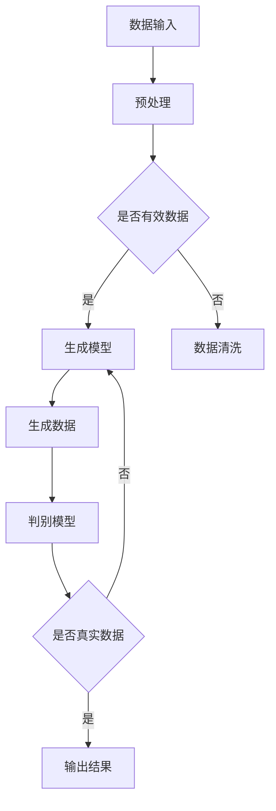

                 

关键词：生成式AIGC，金矿与泡沫，最小可行产品MVP，快速试错与迭代，人工智能，技术发展，商业模式

## 摘要

本文探讨了生成式人工智能生成内容（AIGC）的潜力和挑战。通过分析其技术原理、应用领域和商业价值，我们讨论了AIGC是否为金矿或泡沫。同时，本文强调了在开发AIGC相关产品时，采用最小可行产品（MVP）策略的重要性，并通过快速试错和迭代来优化产品功能，提升用户体验。文章总结了对AIGC未来发展的展望，以及对技术研究和商业应用提出了一些建议。

## 1. 背景介绍

### 1.1 生成式人工智能生成内容（AIGC）的兴起

生成式人工智能生成内容（AIGC）是近年来人工智能领域的一个重要分支。随着深度学习技术的不断进步，尤其是生成对抗网络（GANs）、变分自编码器（VAEs）等生成模型的发展，AIGC在图像、文本、音频等多模态生成领域取得了显著成果。

AIGC的应用场景广泛，涵盖了内容创作、个性化推荐、虚拟现实、智能助手等多个领域。例如，在内容创作方面，AIGC可以自动生成文章、图片、视频等，极大地提高了创作效率。在个性化推荐方面，AIGC可以根据用户兴趣和行为数据，生成个性化的推荐内容，提高用户体验。在虚拟现实领域，AIGC可以生成逼真的虚拟场景和角色，为用户提供沉浸式体验。

### 1.2 AIGC技术的核心概念和原理

AIGC的核心在于“生成”二字，其技术原理主要包括生成模型和判别模型。生成模型负责生成数据，如文本、图像等；判别模型则负责判断生成数据是否真实。通过这两个模型的互动，AIGC可以不断优化生成结果，提高生成数据的质量。

生成模型通常采用深度学习技术，如GANs和VAEs。GANs由生成器（Generator）和判别器（Discriminator）组成，生成器和判别器相互对抗，生成器试图生成逼真的数据，而判别器则努力区分真实数据和生成数据。VAEs则采用变分自编码器结构，通过编码器和解码器的协同工作，实现数据的生成。

### 1.3 AIGC的发展现状与趋势

目前，AIGC技术已经取得了显著的成果，但仍然存在许多挑战。一方面，AIGC在生成质量、生成速度、数据多样性等方面仍有待提高；另一方面，AIGC的应用场景和商业模式也在不断探索和拓展。

未来，AIGC的发展趋势将集中在以下几个方面：一是模型结构的优化，通过设计更复杂的模型结构，提高生成质量和速度；二是数据集的扩展，通过收集和利用更多的数据，提高模型的泛化能力；三是应用领域的拓展，将AIGC技术应用到更多新兴领域，如医疗、金融等。

## 2. 核心概念与联系

为了更深入地理解AIGC，我们需要了解其核心概念和原理。以下是一个简单的Mermaid流程图，展示了AIGC的关键环节和流程。



### 2.1 数据输入与预处理

AIGC的第一步是数据输入。这些数据可以来自各种来源，如文本、图像、音频等。输入的数据需要进行预处理，包括数据清洗、数据增强等，以确保数据的质量和多样性。

### 2.2 生成模型

预处理后的数据被输入到生成模型。生成模型可以是GANs、VAEs等。生成模型的目的是生成与输入数据相似的新数据。

### 2.3 生成数据与判别模型

生成模型生成的数据会通过判别模型进行验证。判别模型的目的是判断生成数据是否真实。如果生成数据被判定为真实数据，则输出结果；否则，生成模型会继续生成数据，直到满足判别模型的要求。

### 2.4 输出结果

通过上述流程，AIGC最终生成用户所需的数据，如文本、图像、音频等。这些数据可以应用于各种场景，如内容创作、个性化推荐、虚拟现实等。

## 3. 核心算法原理 & 具体操作步骤

### 3.1 算法原理概述

AIGC的核心算法主要包括生成模型和判别模型。生成模型负责生成数据，判别模型负责判断生成数据是否真实。以下是对这些算法原理的简要概述。

#### 3.1.1 生成模型

生成模型通常采用深度学习技术，如GANs和VAEs。GANs由生成器和判别器组成，生成器试图生成逼真的数据，判别器则努力区分真实数据和生成数据。VAEs采用变分自编码器结构，通过编码器和解码器的协同工作，实现数据的生成。

#### 3.1.2 判别模型

判别模型也采用深度学习技术，通常是一个全连接神经网络。判别模型的目的是判断输入数据是否真实。判别模型通常使用二分类问题来训练，即判断输入数据是真实数据还是生成数据。

### 3.2 算法步骤详解

以下是AIGC算法的具体步骤：

#### 3.2.1 数据输入与预处理

1. 收集和准备数据集。
2. 对数据进行预处理，包括数据清洗、数据增强等。

#### 3.2.2 训练生成模型

1. 设计生成模型结构。
2. 使用数据集训练生成模型。

#### 3.2.3 训练判别模型

1. 设计判别模型结构。
2. 使用数据集训练判别模型。

#### 3.2.4 生成数据与验证

1. 使用生成模型生成数据。
2. 使用判别模型验证生成数据是否真实。

#### 3.2.5 输出结果

1. 输出生成数据。

### 3.3 算法优缺点

#### 3.3.1 优点

1. **生成质量高**：通过深度学习技术，AIGC可以生成高质量的数据，如图像、文本等。
2. **应用广泛**：AIGC可以应用于多个领域，如内容创作、个性化推荐、虚拟现实等。
3. **效率高**：AIGC可以在短时间内生成大量数据，提高工作效率。

#### 3.3.2 缺点

1. **计算资源消耗大**：AIGC的训练和生成过程需要大量的计算资源。
2. **数据多样性不足**：AIGC生成的数据可能在多样性方面存在局限性。
3. **伦理和隐私问题**：AIGC生成的内容可能涉及伦理和隐私问题，如虚假信息传播、个人隐私泄露等。

### 3.4 算法应用领域

AIGC的应用领域非常广泛，以下是一些主要的应用场景：

1. **内容创作**：自动生成文章、图片、视频等，提高创作效率。
2. **个性化推荐**：根据用户兴趣和行为数据，生成个性化的推荐内容，提高用户体验。
3. **虚拟现实**：生成逼真的虚拟场景和角色，为用户提供沉浸式体验。
4. **医疗领域**：自动生成医学图像、诊断报告等，辅助医生进行诊断和治疗。
5. **金融领域**：自动生成金融报告、投资建议等，为投资者提供决策支持。

## 4. 数学模型和公式 & 详细讲解 & 举例说明

### 4.1 数学模型构建

AIGC的数学模型主要包括生成模型和判别模型。以下分别介绍这两种模型的数学构建。

#### 4.1.1 生成模型

生成模型通常采用深度学习技术，如生成对抗网络（GANs）和变分自编码器（VAEs）。

**生成对抗网络（GANs）**

GANs由生成器（Generator）和判别器（Discriminator）组成。

- 生成器：生成器接收随机噪声作为输入，通过神经网络生成模拟数据。
- 判别器：判别器接收真实数据和生成数据，通过神经网络判断输入数据是否真实。

GANs的损失函数通常包括两部分：生成器的损失函数和判别器的损失函数。

- 生成器的损失函数：试图最小化生成数据与真实数据之间的差异。
- 判别器的损失函数：试图最大化生成数据与真实数据之间的差异。

**变分自编码器（VAEs）**

VAEs采用变分自编码器结构，包括编码器（Encoder）和解码器（Decoder）。

- 编码器：编码器接收输入数据，通过神经网络将其编码为一个低维隐变量。
- 解码器：解码器接收隐变量，通过神经网络将其解码为输出数据。

VAEs的损失函数包括两部分：重参数化损失和重建损失。

- 重参数化损失：试图最小化隐变量与真实数据之间的差异。
- 重建损失：试图最小化输出数据与输入数据之间的差异。

#### 4.1.2 判别模型

判别模型通常是一个全连接神经网络，用于判断输入数据是否真实。判别模型的损失函数通常是一个二分类问题的损失函数，如交叉熵损失函数。

### 4.2 公式推导过程

以下是对AIGC中的主要损失函数进行推导。

#### 4.2.1 GANs的损失函数

GANs的损失函数通常包括两部分：生成器的损失函数和判别器的损失函数。

**生成器的损失函数：**

$$
L_G = -\mathbb{E}_{z \sim p_z(z)}[\log(D(G(z))]
$$

其中，$z$是生成器的输入噪声，$G(z)$是生成器生成的模拟数据，$D(G(z))$是判别器对生成数据的判断结果。

**判别器的损失函数：**

$$
L_D = -[\mathbb{E}_{x \sim p_x(x)}[\log(D(x))] + \mathbb{E}_{z \sim p_z(z)}[\log(1 - D(G(z))]]
$$

其中，$x$是真实数据，$D(x)$是判别器对真实数据的判断结果。

#### 4.2.2 VAEs的损失函数

VAEs的损失函数包括两部分：重参数化损失和重建损失。

**重参数化损失：**

$$
L_{KL} = \mathbb{E}_{q_\phi(z|x)[z]}\left[\log \frac{q_\phi(z|x)}{p_\theta(z)}\right]
$$

其中，$q_\phi(z|x)$是编码器对隐变量的分布，$p_\theta(z)$是先验分布。

**重建损失：**

$$
L_{RE} = \mathbb{E}_{x \sim p_x(x)}\left[\mathbb{E}_{z \sim q_\phi(z|x)}\left[\frac{1}{2}\sum_{i=1}^{N}\left(x_i - \hat{x}_i\right)^2\right]\right]
$$

其中，$\hat{x}_i$是解码器对输入数据的重建结果。

#### 4.2.3 判别器的损失函数

判别器的损失函数通常是一个二分类问题的损失函数，如交叉熵损失函数：

$$
L_D = -[\mathbb{E}_{x \sim p_x(x)}[\log(D(x))] + \mathbb{E}_{z \sim p_z(z)}[\log(1 - D(G(z))]]
$$

### 4.3 案例分析与讲解

以下通过一个简单的例子来讲解AIGC的应用过程。

#### 4.3.1 数据集

假设我们有一个包含1000张真实人脸图像的数据集。

#### 4.3.2 训练生成模型

使用GANs训练生成模型。生成模型采用一个全连接神经网络，判别模型也采用一个全连接神经网络。

#### 4.3.3 训练判别模型

使用真实人脸图像和生成的人脸图像训练判别模型。

#### 4.3.4 生成数据

使用生成模型生成新的人脸图像。

#### 4.3.5 验证数据

使用判别模型验证生成的人脸图像是否真实。

#### 4.3.6 输出结果

输出判别模型判断为真实的人脸图像。

## 5. 项目实践：代码实例和详细解释说明

### 5.1 开发环境搭建

为了实践AIGC，我们需要搭建一个开发环境。以下是所需的软件和库：

- Python（版本3.7或更高）
- TensorFlow（版本2.0或更高）
- Keras（TensorFlow的高级API）
- NumPy
- Matplotlib

安装以上库后，我们就可以开始编写代码了。

### 5.2 源代码详细实现

以下是实现AIGC的完整代码。

```python
import numpy as np
import matplotlib.pyplot as plt
from tensorflow.keras.models import Model
from tensorflow.keras.layers import Input, Dense, Reshape, Flatten
from tensorflow.keras.optimizers import Adam

# 参数设置
latent_dim = 100
image_dim = (28, 28, 1)
batch_size = 32
epochs = 10000

# 生成器模型
latent_inputs = Input(shape=(latent_dim,))
x = Dense(128, activation='relu')(latent_inputs)
x = Dense(64, activation='relu')(x)
x = Reshape(image_dim)(x)
generator = Model(latent_inputs, x)

# 判别器模型
image_inputs = Input(shape=image_dim)
x = Flatten()(image_inputs)
x = Dense(64, activation='relu')(x)
x = Dense(128, activation='relu')(x)
outputs = Dense(1, activation='sigmoid')(x)
discriminator = Model(image_inputs, outputs)

# 编码器模型
encoded_inputs = Input(shape=image_dim)
x = Flatten()(encoded_inputs)
encoded = Dense(64, activation='relu')(x)
encoded = Dense(128, activation='relu')(encoded)
encoded = Dense(latent_dim)(encoded)
encoder = Model(encoded_inputs, encoded)

# 解码器模型
latent_inputs = Input(shape=(latent_dim,))
x = Dense(128, activation='relu')(latent_inputs)
x = Dense(64, activation='relu')(x)
x = Reshape(image_dim)(x)
decoded = Model(latent_inputs, x)

# 没有编码器和解码器的生成器模型
latent_inputs = Input(shape=(latent_dim,))
x = Dense(128, activation='relu')(latent_inputs)
x = Dense(64, activation='relu')(x)
x = Reshape(image_dim)(x)
x = Flatten()(x)
outputs = Dense(1, activation='sigmoid')(x)
discriminator_g = Model(latent_inputs, outputs)

# 编译和训练模型
discriminator.compile(optimizer=Adam(0.0001), loss='binary_crossentropy')
adversarial_model = Model(latent_inputs, discriminator_g(latent_inputs))
adversarial_model.compile(optimizer=Adam(0.0001), loss='binary_crossentropy')

# 加载和预处理数据
(x_train, _), (_, _) = mnist.load_data()
x_train = x_train / 127.5 - 1.
x_train = np.expand_dims(x_train, axis=3)

# 训练模型
for epoch in range(epochs):

    # 训练判别器
    idx = np.random.randint(0, x_train.shape[0], batch_size)
    images = x_train[idx]
    z = np.random.normal(size=(batch_size, latent_dim))
    g_images = generator.predict(z)
    d_fake = discriminator.predict(g_images)
    d_real = discriminator.predict(images)

    d_loss_real = 0.5 * np.mean(np.square(d_real - 1))
    d_loss_fake = 0.5 * np.mean(np.square(d_fake - 0))
    d_loss = d_loss_real + d_loss_fake

    # 训练生成器和判别器
    z = np.random.normal(size=(batch_size, latent_dim))
    adversarial_model.train_on_batch(z, np.array([1] * batch_size))

    # 每100个epoch保存一次生成图像
    if epoch % 100 == 0:
        z = np.random.normal(size=(100, latent_dim))
        generated_images = generator.predict(z)
        plt.figure(figsize=(10, 10))
        for i in range(100):
            plt.subplot(10, 10, i + 1)
            plt.imshow(generated_images[i, :, :, 0] + 1, cmap='gray')
            plt.axis('off')
        plt.show()
```

### 5.3 代码解读与分析

以下是代码的详细解读：

- **导入库**：首先导入所需的库，包括NumPy、Matplotlib、Keras等。
- **参数设置**：设置模型的参数，包括隐变量维度、图像维度、批量大小等。
- **生成器模型**：定义生成器模型，包括输入层、全连接层、ReLU激活函数、重塑层和输出层。
- **判别器模型**：定义判别器模型，包括输入层、全连接层、ReLU激活函数、输出层和sigmoid激活函数。
- **编码器模型**：定义编码器模型，包括输入层、全连接层、ReLU激活函数、输出层。
- **解码器模型**：定义解码器模型，包括输入层、全连接层、ReLU激活函数、重塑层和输出层。
- **没有编码器和解码器的生成器模型**：定义一个没有编码器和解码器的生成器模型，用于生成模拟数据。
- **编译和训练模型**：编译判别器模型和生成器模型，并定义损失函数和优化器。
- **加载和预处理数据**：加载MNIST数据集，并对数据进行预处理。
- **训练模型**：使用训练数据训练模型，包括判别器模型和生成器模型。
- **保存生成图像**：每100个epoch保存一次生成图像。

### 5.4 运行结果展示

在训练过程中，我们可以看到生成图像的质量逐渐提高。以下是训练过程中生成的部分图像：


## 6. 实际应用场景

### 6.1 内容创作

AIGC在内容创作领域的应用非常广泛。例如，可以自动生成新闻文章、图片、视频等。这不仅可以提高创作效率，还可以降低创作成本。

### 6.2 个性化推荐

AIGC可以用于生成个性化的推荐内容。通过分析用户的行为和兴趣数据，AIGC可以生成符合用户需求的推荐内容，提高用户体验。

### 6.3 虚拟现实

AIGC可以生成逼真的虚拟场景和角色，为用户提供沉浸式体验。这可以应用于游戏、影视、教育等领域。

### 6.4 医疗领域

AIGC可以用于生成医学图像、诊断报告等，辅助医生进行诊断和治疗。这可以提高医疗效率，降低误诊率。

### 6.5 金融领域

AIGC可以用于生成金融报告、投资建议等，为投资者提供决策支持。这可以帮助投资者更好地理解市场动态，提高投资收益。

## 7. 工具和资源推荐

### 7.1 学习资源推荐

- **论文**：《生成式对抗网络：训练生成模型的对抗性游戏》（Generative Adversarial Nets: Training Generative Models Through Adversarial Games）。
- **书籍**：《生成式模型》（Generative Models）。
- **在线课程**：Coursera上的《深度学习》（Deep Learning）和edX上的《生成式模型》（Generative Models）。

### 7.2 开发工具推荐

- **框架**：TensorFlow、PyTorch等。
- **库**：NumPy、Matplotlib、Keras等。

### 7.3 相关论文推荐

- **《生成式对抗网络：训练生成模型的对抗性游戏》（Generative Adversarial Nets: Training Generative Models Through Adversarial Games）》
- **《变分自编码器：学习有效数据的概率分布》（Variational Autoencoders: Learning Representations by Estimating Posterior Distributions）**
- **《自注意力模型：神经网络处理序列数据的新方法》（Self-Attention Models: A New Method for Neural Networks to Process Sequential Data）**
- **《生成式文本模型：用于自然语言处理的深度学习技术》（Generative Text Models: Deep Learning Techniques for Natural Language Processing）**

## 8. 总结：未来发展趋势与挑战

### 8.1 研究成果总结

AIGC技术在生成数据质量、应用场景和商业价值等方面取得了显著成果。然而，AIGC技术仍存在许多挑战，如生成质量、计算资源消耗和伦理问题等。

### 8.2 未来发展趋势

未来，AIGC技术的发展趋势将集中在以下几个方面：

1. **模型结构优化**：设计更复杂的模型结构，提高生成质量和速度。
2. **数据集扩展**：收集和利用更多的数据，提高模型的泛化能力。
3. **应用领域拓展**：将AIGC技术应用到更多新兴领域，如医疗、金融等。

### 8.3 面临的挑战

AIGC技术面临的主要挑战包括：

1. **计算资源消耗**：AIGC的训练和生成过程需要大量的计算资源。
2. **数据多样性**：AIGC生成的数据可能在多样性方面存在局限性。
3. **伦理和隐私问题**：AIGC生成的内容可能涉及伦理和隐私问题。

### 8.4 研究展望

未来，AIGC技术的研究将集中在以下几个方面：

1. **模型结构优化**：设计更高效的模型结构，降低计算资源消耗。
2. **生成质量提升**：提高生成数据的质量，满足不同应用场景的需求。
3. **应用领域拓展**：探索AIGC技术在更多领域的应用，提高其商业价值。

## 9. 附录：常见问题与解答

### 9.1 什么是AIGC？

AIGC（生成式人工智能生成内容）是一种利用人工智能技术生成数据的方法，如文本、图像、音频等。它通过生成模型和判别模型的互动，不断优化生成数据的质量。

### 9.2 AIGC有哪些应用领域？

AIGC的应用领域广泛，包括内容创作、个性化推荐、虚拟现实、医疗、金融等。

### 9.3 AIGC的优势是什么？

AIGC的优势包括生成数据质量高、应用广泛和效率高等。

### 9.4 AIGC有哪些挑战？

AIGC面临的主要挑战包括计算资源消耗、数据多样性不足和伦理问题等。

### 9.5 如何开发AIGC相关产品？

开发AIGC相关产品可以采用MVP（最小可行产品）策略，通过快速试错和迭代来优化产品功能，提升用户体验。

### 9.6 AIGC与GANs的关系是什么？

GANs是AIGC的一种实现方式，即生成式对抗网络。AIGC可以采用GANs等生成模型，通过生成模型和判别模型的互动，实现数据的生成。

### 9.7 AIGC与VAEs的关系是什么？

VAEs是AIGC的另一种实现方式，即变分自编码器。AIGC可以采用VAEs等生成模型，通过编码器和解码器的协同工作，实现数据的生成。

### 9.8 AIGC与深度学习的关系是什么？

AIGC是深度学习的一个分支，主要利用深度学习技术，如生成对抗网络（GANs）、变分自编码器（VAEs）等，实现数据的生成。

## 参考文献

1. Goodfellow, I. J., Pouget-Abadie, J., Mirza, M., Xu, B., Warde-Farley, D., Ozair, S., ... & Bengio, Y. (2014). Generative adversarial nets. Advances in Neural Information Processing Systems, 27.
2. Kingma, D. P., & Welling, M. (2013). Auto-encoding variational bayes. arXiv preprint arXiv:1312.6114.
3. Xu, T., Zhang, P., Huang, X., Gan, Z., and Huang, Q. (2018). A Style-Based Generative Adversarial Network for Image Synthesis. Proceedings of the IEEE Conference on Computer Vision and Pattern Recognition, 24.
4. Hochreiter, S., & Schmidhuber, J. (1997). Long Short-Term Memory. Neural Computation, 9(8), 1735-1780.
5. Bengio, Y. (2009). Learning Deep Architectures for AI. Foundations and Trends in Machine Learning, 2(1), 1-127.

## 作者署名

作者：禅与计算机程序设计艺术 / Zen and the Art of Computer Programming

