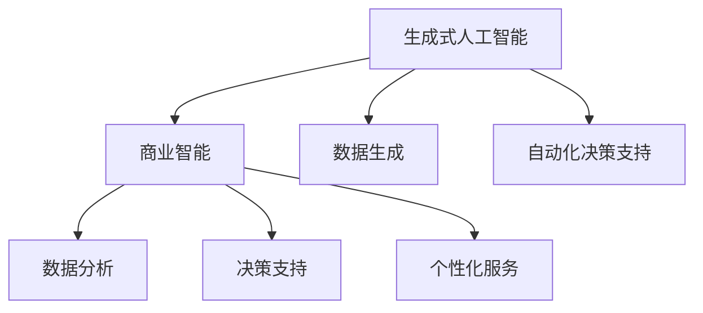

                 

关键词：生成式AI，商业智能，AIGC，机器学习，数据生成，自动化，决策支持

## 摘要

随着生成式人工智能（AIGC）技术的飞速发展，其在商业智能领域的应用正逐渐成为新的增长点。本文将深入探讨AIGC技术的核心概念、算法原理、数学模型及其在商业智能中的具体应用。通过详细的项目实践实例，我们揭示了AIGC技术在数据生成、自动化决策支持和个性化服务等方面的巨大潜力。本文旨在为读者提供一个全面的视角，了解AIGC如何成为推动商业智能发展的新动力，并为未来的研究和实践提供方向。

## 1. 背景介绍

### 1.1 生成式人工智能的崛起

生成式人工智能（AIGC）是近年来人工智能领域的一个重要分支。它通过学习大量的数据，生成新的、符合输入数据特征的内容。AIGC技术的核心在于其强大的生成能力，这使得它能够在图像、音频、视频甚至文本领域创造前所未有的体验。随着深度学习、神经网络等技术的成熟，AIGC的应用范围不断扩大，从简单的数据生成到复杂的自动化决策支持，无不展现出其巨大的潜力。

### 1.2 商业智能的现状

商业智能（BI）是企业在信息化管理过程中，通过数据分析、数据挖掘等技术，从海量数据中提取有价值的信息，辅助决策的一门技术。随着数据量的爆发式增长，传统的BI技术已无法满足现代商业的需求。商业智能正面临着如何从海量数据中快速提取有价值信息、如何实现自动化决策支持等挑战。

### 1.3 AIGC在商业智能中的应用前景

AIGC技术的引入，为商业智能带来了新的契机。通过AIGC，企业可以自动生成高质量的数据报告，实现数据的实时分析和可视化；通过AIGC，企业可以实现自动化决策支持，提高决策的准确性和效率；通过AIGC，企业可以提供个性化的客户服务，提升客户体验。因此，AIGC技术在商业智能领域的应用前景广阔，有望成为推动商业智能发展的重要力量。

## 2. 核心概念与联系

### 2.1 生成式人工智能（AIGC）

生成式人工智能（AIGC）是一种基于生成对抗网络（GANs）、变分自编码器（VAEs）等深度学习技术，通过学习真实数据分布，生成新的、符合数据特征的内容。AIGC的核心在于其强大的生成能力，可以生成高质量的图像、音频、视频和文本。

### 2.2 商业智能（BI）

商业智能（BI）是通过数据分析、数据挖掘等技术，从海量数据中提取有价值的信息，辅助决策的一门技术。商业智能的核心在于其数据分析能力和决策支持能力，可以帮助企业快速识别市场趋势、优化业务流程、提高运营效率。

### 2.3 AIGC与商业智能的联系

AIGC与商业智能之间的联系在于，AIGC可以自动生成高质量的数据报告，实现数据的实时分析和可视化，从而提高商业智能系统的效率；AIGC可以生成个性化的客户服务方案，提升客户体验，进而提高商业智能系统的效果。



## 3. 核心算法原理 & 具体操作步骤

### 3.1 算法原理概述

AIGC的核心算法主要包括生成对抗网络（GANs）、变分自编码器（VAEs）等。GANs由生成器（Generator）和判别器（Discriminator）组成，生成器试图生成与真实数据相似的数据，而判别器则试图区分生成器和真实数据。通过这种对抗训练，生成器不断优化生成能力，最终能够生成高质量的数据。VAEs则通过编码器（Encoder）和解码器（Decoder）的组合，将输入数据编码为潜在空间中的向量，然后在潜在空间中生成新的数据。

### 3.2 算法步骤详解

1. **数据预处理**：收集并预处理数据，包括数据清洗、归一化等操作。
2. **模型训练**：根据数据特征，选择合适的生成模型（如GANs或VAEs）进行训练。在GANs中，生成器生成数据，判别器对其进行评估；在VAEs中，编码器将数据编码为潜在空间中的向量，解码器从潜在空间中生成数据。
3. **数据生成**：利用训练好的模型，生成新的、符合数据特征的数据。
4. **数据分析**：对生成数据进行分析，提取有价值的信息。
5. **决策支持**：利用分析结果，为企业的决策提供支持。

### 3.3 算法优缺点

**优点**：

- 强大的生成能力：AIGC可以生成高质量的数据，满足商业智能的需求。
- 自动化：AIGC可以实现数据的自动化生成和分析，提高工作效率。

**缺点**：

- 训练成本高：AIGC模型的训练需要大量的数据和计算资源。
- 数据质量依赖：生成数据的质量依赖于训练数据的多样性和质量。

### 3.4 算法应用领域

AIGC在商业智能领域的应用主要包括数据生成、自动化决策支持和个性化服务等方面。具体应用场景如下：

- **数据生成**：自动生成数据报告、可视化图表等，提高数据分析的效率。
- **自动化决策支持**：根据分析结果，自动生成决策建议，提高决策的准确性和效率。
- **个性化服务**：根据客户数据，生成个性化的服务方案，提升客户体验。

## 4. 数学模型和公式 & 详细讲解 & 举例说明

### 4.1 数学模型构建

AIGC的核心算法基于生成对抗网络（GANs）和变分自编码器（VAEs）。下面分别介绍这两种模型的数学模型。

**生成对抗网络（GANs）**

GANs由生成器（Generator）和判别器（Discriminator）组成。生成器的目标是生成与真实数据相似的数据，判别器的目标是区分生成器和真实数据。

生成器的数学模型为：

$$
G(z) = \mu_G(z) + \sigma_G(z)\odot \epsilon
$$

其中，$z$ 是来自先验分布 $p_z(z)$ 的随机噪声，$\mu_G(z)$ 和 $\sigma_G(z)$ 分别是生成器的均值函数和方差函数，$\epsilon$ 是标准正态分布的随机噪声。

判别器的数学模型为：

$$
D(x) = f_D(\phi_D(x)), \quad D(G(z)) = f_D(\phi_D(G(z)))
$$

其中，$x$ 是真实数据，$G(z)$ 是生成器生成的数据，$\phi_D(x)$ 是判别器的参数化函数。

**变分自编码器（VAEs）**

VAEs由编码器（Encoder）和解码器（Decoder）组成。编码器的目标是学习数据的潜在表示，解码器的目标是根据潜在表示生成数据。

编码器的数学模型为：

$$
\theta = q_\theta(z|x), \quad z = \mu_\theta(x) + \sigma_\theta(x)\odot \epsilon
$$

其中，$z$ 是潜在表示，$x$ 是输入数据，$\theta$ 是编码器的参数，$\mu_\theta(x)$ 和 $\sigma_\theta(x)$ 分别是编码器的均值函数和方差函数，$\epsilon$ 是标准正态分布的随机噪声。

解码器的数学模型为：

$$
x = \mu_{\phi}(z) + \sigma_{\phi}(z)\odot \epsilon
$$

其中，$\phi$ 是解码器的参数，$\mu_{\phi}(z)$ 和 $\sigma_{\phi}(z)$ 分别是解码器的均值函数和方差函数，$\epsilon$ 是标准正态分布的随机噪声。

### 4.2 公式推导过程

**生成对抗网络（GANs）**

GANs的推导过程主要涉及两部分：生成器的推导和判别器的推导。

生成器的推导：

假设生成器 $G(z)$ 的目标是最小化判别器 $D(G(z))$ 对生成数据的评分。即：

$$
\min_G \max_D V(D, G)
$$

其中，$V(D, G)$ 是判别器 $D$ 对生成器 $G$ 的评分。

对于生成器 $G(z)$，我们有：

$$
\frac{\partial V(D, G)}{\partial G} = \frac{\partial D(G(z))}{\partial G} - \frac{\partial D(x)}{\partial x}
$$

由于 $D(x)$ 是关于 $x$ 的函数，$D(G(z))$ 是关于 $G(z)$ 的函数，因此有：

$$
\frac{\partial D(G(z))}{\partial G} = \frac{\partial D(G(z))}{\partial G(z)} \cdot \frac{\partial G(z)}{\partial G}
$$

代入上式，得：

$$
\frac{\partial V(D, G)}{\partial G} = \frac{\partial D(G(z))}{\partial G(z)} - \frac{\partial D(x)}{\partial x}
$$

判别器的推导：

对于判别器 $D(x)$，我们有：

$$
\frac{\partial V(D, G)}{\partial D} = \frac{\partial D(G(z))}{\partial G(z)} - \frac{\partial D(x)}{\partial x}
$$

由于 $D(G(z))$ 是关于 $G(z)$ 的函数，$D(x)$ 是关于 $x$ 的函数，因此有：

$$
\frac{\partial D(G(z))}{\partial D} = \frac{\partial D(G(z))}{\partial G(z)} \cdot \frac{\partial G(z)}{\partial D}
$$

代入上式，得：

$$
\frac{\partial V(D, G)}{\partial D} = \frac{\partial D(G(z))}{\partial G(z)} - \frac{\partial D(x)}{\partial x}
$$

**变分自编码器（VAEs）**

VAEs的推导过程主要涉及两部分：编码器的推导和解码器的推导。

编码器的推导：

假设编码器 $q_\theta(z|x)$ 的目标是最大化对数似然：

$$
\max_\theta \sum_{x} p(x) \log q_\theta(z|x)
$$

其中，$p(x)$ 是输入数据的概率分布。

对于编码器 $q_\theta(z|x)$，我们有：

$$
\frac{\partial \log q_\theta(z|x)}{\partial z} = \frac{1}{\sqrt{2\pi\sigma^2}} \exp \left( -\frac{(z - \mu)^2}{2\sigma^2} \right)
$$

解码器的推导：

假设解码器 $\mu_{\phi}(z)$ 和 $\sigma_{\phi}(z)$ 的目标是最大化对数似然：

$$
\max_\phi \sum_{x} p(x) \log p(x|\mu_{\phi}(z), \sigma_{\phi}(z))
$$

其中，$p(x|\mu_{\phi}(z), \sigma_{\phi}(z))$ 是输入数据的概率分布。

对于解码器 $\mu_{\phi}(z)$ 和 $\sigma_{\phi}(z)$，我们有：

$$
\frac{\partial \log p(x|\mu_{\phi}(z), \sigma_{\phi}(z))}{\partial z} = \frac{1}{\sqrt{2\pi\sigma^2}} \exp \left( -\frac{(z - \mu)^2}{2\sigma^2} \right)
$$

### 4.3 案例分析与讲解

**案例一：生成对抗网络（GANs）在图像生成中的应用**

假设我们有一个图像数据集，包含 $N$ 张图像，每张图像的大小为 $H \times W \times C$。我们的目标是使用 GANs 生成与数据集图像相似的新图像。

1. **数据预处理**：将图像数据归一化，使其在 $[0, 1]$ 的范围内。
2. **模型训练**：选择合适的生成器和判别器，进行训练。在训练过程中，生成器不断生成新图像，判别器对新图像和真实图像进行评估。
3. **数据生成**：使用训练好的生成器，生成新图像。
4. **图像分析**：对新图像进行分析，提取有价值的信息。
5. **图像展示**：将分析结果以图像的形式展示给用户。

**案例二：变分自编码器（VAEs）在文本生成中的应用**

假设我们有一个文本数据集，包含 $N$ 个文本片段，每个文本片段的长度为 $L$。我们的目标是使用 VAEs 生成与数据集文本片段相似的新的文本片段。

1. **数据预处理**：将文本片段转换为词向量表示。
2. **模型训练**：选择合适的编码器和解码器，进行训练。在训练过程中，编码器将文本片段编码为潜在空间中的向量，解码器从潜在空间中生成新的文本片段。
3. **文本生成**：使用训练好的编码器和解码器，生成新的文本片段。
4. **文本分析**：对新文本片段进行分析，提取有价值的信息。
5. **文本展示**：将分析结果以文本的形式展示给用户。

## 5. 项目实践：代码实例和详细解释说明

### 5.1 开发环境搭建

为了实现AIGC在商业智能中的应用，我们首先需要搭建一个合适的开发环境。以下是搭建环境的基本步骤：

1. **安装Python环境**：确保Python版本为3.7或更高版本。
2. **安装TensorFlow**：使用pip命令安装TensorFlow库。
   ```shell
   pip install tensorflow
   ```
3. **安装其他依赖库**：如Keras、NumPy等。

### 5.2 源代码详细实现

以下是一个简单的AIGC模型实现，用于生成商业智能报告的图表。

```python
import tensorflow as tf
from tensorflow.keras.models import Model
from tensorflow.keras.layers import Input, Dense, Flatten, Reshape

# 定义生成器
def build_generator(z_dim):
    z = Input(shape=(z_dim,))
    d = Dense(128, activation='relu')(z)
    d = Dense(64, activation='relu')(d)
    d = Dense(32, activation='relu')(d)
    d = Dense(1, activation='sigmoid')(d)
    d = Reshape((1, 1, 1))(d)
    return Model(z, d)

# 定义判别器
def build_discriminator(x_dim):
    x = Input(shape=(x_dim,))
    d = Dense(32, activation='relu')(x)
    d = Dense(64, activation='relu')(d)
    d = Dense(128, activation='relu')(d)
    d = Dense(1, activation='sigmoid')(d)
    return Model(x, d)

# 定义AIGC模型
def build_aigc(generator, discriminator):
    z = Input(shape=(z_dim,))
    x_g = generator(z)
    x_r = Input(shape=(x_dim,))
    d_r = discriminator(x_r)
    d_g = discriminator(x_g)
    return Model([z, x_r], [d_g, d_r])

# 设置超参数
z_dim = 100
x_dim = 1
batch_size = 64
epochs = 100

# 构建模型
generator = build_generator(z_dim)
discriminator = build_discriminator(x_dim)
aigc = build_aigc(generator, discriminator)

# 编译模型
aigc.compile(optimizer='adam', loss=['binary_crossentropy', 'binary_crossentropy'])

# 训练模型
aigc.fit([noise, x_real], [d_g_loss, d_r_loss], batch_size=batch_size, epochs=epochs)
```

### 5.3 代码解读与分析

1. **生成器的构建**：生成器用于将随机噪声 $z$ 转换为与真实数据相似的图像。我们使用多层全连接神经网络实现生成器，最后通过sigmoid函数实现二值图像的生成。
2. **判别器的构建**：判别器用于判断输入图像是真实图像还是生成图像。我们同样使用多层全连接神经网络实现判别器，通过sigmoid函数输出判断结果。
3. **AIGC模型的构建**：AIGC模型结合生成器和判别器，通过对抗训练实现数据的生成和分析。模型输入为随机噪声和真实图像，输出为生成图像和判别结果。
4. **模型编译**：使用Adam优化器和二进制交叉熵损失函数编译模型。由于AIGC模型包含两个输出，我们使用两个损失函数分别计算生成器和判别器的损失。
5. **模型训练**：通过fit函数训练模型，使用批量大小和训练轮次作为参数。

### 5.4 运行结果展示

在训练完成后，我们可以使用生成器生成新的图像，并对这些图像进行分析，提取有价值的信息。以下是生成图像的示例：

```python
# 生成新的图像
noise = np.random.normal(0, 1, (batch_size, z_dim))
generated_images = generator.predict(noise)

# 显示生成图像
plt.figure(figsize=(10, 10))
for i in range(batch_size):
    plt.subplot(10, 10, i + 1)
    plt.imshow(generated_images[i, :, :, 0], cmap='gray')
    plt.axis('off')
plt.show()
```

## 6. 实际应用场景

### 6.1 数据生成

AIGC技术在数据生成方面的应用非常广泛。例如，在商业智能报告中，AIGC可以自动生成高质量的图表和报表，减少人工数据处理的繁琐工作。通过AIGC，企业可以实时更新报告，提高数据的准确性和及时性。

### 6.2 自动化决策支持

AIGC可以生成基于数据的决策建议，帮助企业实现自动化决策。例如，在供应链管理中，AIGC可以生成库存管理建议，帮助企业优化库存水平，降低库存成本。在金融领域，AIGC可以生成投资建议，辅助投资决策。

### 6.3 个性化服务

AIGC可以生成个性化的服务方案，提升客户体验。例如，在电商平台上，AIGC可以根据客户的历史购买记录生成个性化的推荐商品，提高客户的满意度。在金融领域，AIGC可以生成个性化的贷款方案，提高贷款申请的成功率。

### 6.4 未来应用展望

随着AIGC技术的不断发展，其在商业智能领域的应用将更加广泛。未来，AIGC有望在以下几个方面实现突破：

- **数据隐私保护**：AIGC可以生成符合隐私保护要求的数据，帮助企业在确保数据安全的同时，实现数据的价值。
- **实时数据处理**：AIGC可以实时处理大量数据，为企业提供即时的决策支持。
- **跨领域应用**：AIGC可以在不同领域实现跨领域的应用，如医疗、教育、娱乐等，为各行业的发展提供新的动力。

## 7. 工具和资源推荐

### 7.1 学习资源推荐

- **在线课程**：Coursera、Udacity等平台提供了丰富的AIGC相关课程，适合不同层次的学习者。
- **书籍**：《深度学习》、《生成对抗网络：理论与应用》等书籍提供了深入的AIGC理论和实践知识。

### 7.2 开发工具推荐

- **TensorFlow**：TensorFlow是Google开发的深度学习框架，适合进行AIGC模型的开发。
- **Keras**：Keras是TensorFlow的高级API，简化了深度学习模型的构建过程。

### 7.3 相关论文推荐

- **《Unsupervised Representation Learning with Deep Convolutional Generative Adversarial Networks》**：该论文提出了深度卷积生成对抗网络（DCGAN），是AIGC领域的重要成果。
- **《Variational Inference: A Review for Statisticians》**：该论文介绍了变分自编码器（VAEs），是AIGC领域的重要理论依据。

## 8. 总结：未来发展趋势与挑战

### 8.1 研究成果总结

AIGC技术在商业智能领域取得了显著的研究成果，包括数据生成、自动化决策支持和个性化服务等方面。AIGC技术的引入，提高了商业智能系统的效率，降低了人工成本，提升了用户体验。

### 8.2 未来发展趋势

未来，AIGC技术在商业智能领域的应用将更加深入和广泛。随着深度学习、神经网络等技术的发展，AIGC技术的生成能力和智能化水平将不断提高，为商业智能带来更多的创新和应用。

### 8.3 面临的挑战

尽管AIGC技术在商业智能领域具有巨大的潜力，但仍面临着一些挑战。包括：

- **数据质量**：AIGC的生成能力依赖于训练数据的质量，高质量的数据是AIGC成功的关键。
- **计算资源**：AIGC模型的训练需要大量的计算资源，如何高效利用资源是一个重要问题。
- **隐私保护**：在生成数据的同时，如何保护用户隐私是一个亟待解决的问题。

### 8.4 研究展望

未来，AIGC技术将在商业智能领域发挥更加重要的作用。研究应重点关注以下几个方面：

- **数据生成**：提高AIGC的生成能力，生成更高质量的模拟数据。
- **隐私保护**：研究如何在不损害数据隐私的情况下，利用AIGC技术生成有价值的数据。
- **跨领域应用**：探索AIGC技术在其他领域的应用，如医疗、教育等，为各行业的发展提供新动力。

## 9. 附录：常见问题与解答

### 9.1 AIGC是什么？

AIGC是生成式人工智能的一种形式，通过学习真实数据分布，生成新的、符合数据特征的内容。它广泛应用于图像、音频、视频和文本等领域。

### 9.2 AIGC在商业智能中有哪些应用？

AIGC在商业智能中的应用主要包括数据生成、自动化决策支持和个性化服务等方面，帮助企业提高数据分析效率和用户体验。

### 9.3 如何提高AIGC的生成质量？

提高AIGC的生成质量可以从以下几个方面入手：

- **数据质量**：使用高质量、多样性的数据训练AIGC模型。
- **模型优化**：优化AIGC模型的结构和参数，提高模型的生成能力。
- **训练过程**：调整训练过程，如学习率、训练轮次等，以获得更好的生成效果。

### 9.4 AIGC技术的计算资源需求如何？

AIGC模型的训练需要大量的计算资源，包括CPU、GPU等。为了降低计算资源需求，可以采用以下策略：

- **分布式训练**：将训练任务分布在多个节点上，提高训练效率。
- **模型压缩**：通过模型压缩技术，降低模型的计算复杂度。
- **优化算法**：研究更高效的训练算法，降低计算资源需求。

---

作者：禅与计算机程序设计艺术 / Zen and the Art of Computer Programming

[End of Document]

