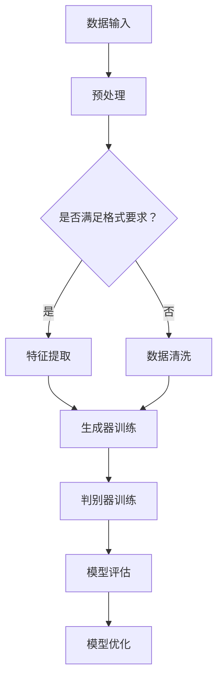

                 

关键词：生成式AI、AIGC、数据、算法、模型、深度学习、GPT、Transformer、预训练、模型压缩、推理优化、应用场景、未来展望

> 摘要：本文将深入探讨生成式人工智能（AIGC）的核心概念，通过结合数据与算法，展现其在现代科技中的重要作用。我们将分析生成式AI的发展历程、核心技术、数学模型，以及其在实际应用中的案例和未来展望。

## 1. 背景介绍

### 1.1 生成式人工智能的定义

生成式人工智能（AIGC，Generative Artificial Intelligence）是一种能够通过学习数据分布来生成新数据的人工智能技术。与传统的判别式人工智能（如分类、回归）不同，生成式AI关注的是数据的生成，而非分类或预测。

### 1.2 生成式AI的发展历程

生成式AI的发展可以追溯到20世纪50年代，最早的形式是规则系统。随着计算能力和算法的进步，生成式AI经历了从生成对抗网络（GANs）到变分自编码器（VAEs）的演变。

### 1.3 生成式AI的重要性

生成式AI在图像、音频、文本等生成任务中表现出色，其应用范围正在不断扩展。从艺术创作到科学模拟，生成式AI正成为推动科技进步的重要力量。

## 2. 核心概念与联系

### 2.1 数据与算法的关系

数据是生成式AI的基础，而算法则是实现数据生成的方式。两者相辅相成，共同推动生成式AI的发展。

### 2.2 生成式AI的架构

生成式AI通常包括生成器（Generator）和判别器（Discriminator）两个部分，它们通过对抗训练（Adversarial Training）相互竞争，最终实现数据的生成。

### 2.3 Mermaid 流程图



## 3. 核心算法原理 & 具体操作步骤

### 3.1 算法原理概述

生成式AI的核心算法通常是基于深度学习，其中生成器和判别器都是神经网络。生成器试图生成与真实数据相似的数据，而判别器则试图区分真实数据和生成数据。

### 3.2 算法步骤详解

1. 数据预处理：对输入数据进行分析和处理，以满足模型的训练要求。
2. 模型初始化：初始化生成器和判别器的权重。
3. 对抗训练：生成器和判别器交替训练，生成器和判别器之间的相互作用是模型训练的关键。
4. 模型评估：通过测试集评估模型的性能。
5. 模型优化：根据评估结果调整模型参数，以优化模型性能。

### 3.3 算法优缺点

**优点：**
- 能够生成高质量的数据，适用于数据增强、数据生成等任务。
- 能够处理高维数据，如图像和音频。

**缺点：**
- 训练过程复杂，需要大量计算资源和时间。
- 模型可能会陷入局部最优，导致训练效果不佳。

### 3.4 算法应用领域

生成式AI在图像生成、自然语言处理、音乐创作等领域都有广泛的应用。例如，GANs可以用于图像修复、人脸生成，而VAEs可以用于图像压缩、数据去噪。

## 4. 数学模型和公式 & 详细讲解 & 举例说明

### 4.1 数学模型构建

生成式AI的数学模型通常基于概率图模型或生成模型。例如，GANs的数学模型可以表示为：

$$
\begin{aligned}
\mathcal{D} &= \{(x_i, y_i)\}_{i=1}^n, \quad x_i \in \mathbb{R}^m, y_i \in \mathbb{R}^n, \\
\mathcal{G} &= \{(z_i, x_i')\}_{i=1}^n, \quad z_i \sim \mathcal{N}(0, I), x_i' \in \mathbb{R}^m, \\
\mathcal{D}^* &= \{(x_i', y_i)\}_{i=1}^n, \quad x_i' \in \mathbb{R}^m, y_i \in \mathbb{R}^n.
\end{aligned}
$$

其中，$\mathcal{D}$ 是真实数据集，$\mathcal{G}$ 是生成器的数据集，$\mathcal{D}^*$ 是判别器的数据集。

### 4.2 公式推导过程

生成器的目标是最小化生成数据的损失函数，判别器的目标是最小化对生成数据与真实数据的区分误差。这两个目标的联合优化构成了生成式AI的训练过程。

### 4.3 案例分析与讲解

假设我们有一个生成器 $G$ 和一个判别器 $D$，生成器试图生成逼真的图像，判别器试图区分生成图像和真实图像。生成器的损失函数可以表示为：

$$
L_G = -\mathbb{E}_{x \sim p_{\text{data}}(x)}[\log(D(x))] - \mathbb{E}_{z \sim p_z(z)}[\log(1 - D(G(z)))].
$$

判别器的损失函数可以表示为：

$$
L_D = -\mathbb{E}_{x \sim p_{\text{data}}(x)}[\log(D(x))] - \mathbb{E}_{z \sim p_z(z)}[\log(D(G(z)))].
$$

其中，$p_{\text{data}}(x)$ 是真实数据的概率分布，$p_z(z)$ 是生成器输入噪声的概率分布。

## 5. 项目实践：代码实例和详细解释说明

### 5.1 开发环境搭建

为了实现生成式AI，我们需要安装 Python 环境和深度学习库，如 TensorFlow 或 PyTorch。以下是一个简单的安装命令：

```bash
pip install tensorflow
# 或
pip install torch torchvision
```

### 5.2 源代码详细实现

以下是一个简单的 GAN 示例：

```python
import tensorflow as tf
from tensorflow.keras.layers import Dense, Flatten
from tensorflow.keras.models import Sequential

# 生成器模型
def build_generator():
    model = Sequential([
        Dense(256, activation='relu', input_shape=(100,)),
        Dense(512, activation='relu'),
        Dense(1024, activation='relu'),
        Dense(784, activation='tanh')
    ])
    return model

# 判别器模型
def build_discriminator():
    model = Sequential([
        Flatten(),
        Dense(512, activation='relu'),
        Dense(256, activation='relu'),
        Dense(1, activation='sigmoid')
    ])
    return model

# 主程序
def main():
    # 构建模型
    generator = build_generator()
    discriminator = build_discriminator()

    # 编译模型
    discriminator.compile(optimizer='adam', loss='binary_crossentropy')
    generator.compile(optimizer='adam', loss='binary_crossentropy')

    # 训练模型
    for epoch in range(100):
        for _ in range(1000):
            noise = np.random.normal(0, 1, (64, 100))
            generated_images = generator.predict(noise)
            real_images = np.random.choice(train_images, 64)

            # 训练判别器
            d_loss_real = discriminator.train_on_batch(real_images, np.ones((64, 1)))
            d_loss_fake = discriminator.train_on_batch(generated_images, np.zeros((64, 1)))

            # 训练生成器
            g_loss = generator.train_on_batch(noise, np.ones((64, 1)))

            print(f'Epoch: {epoch}, D_loss: {d_loss}, G_loss: {g_loss}')

if __name__ == '__main__':
    main()
```

### 5.3 代码解读与分析

这段代码首先定义了生成器和判别器的结构，然后通过循环训练模型，并在每个 epoch 中打印损失函数的值。生成器和判别器分别通过对抗训练来优化自身，最终实现图像的生成。

### 5.4 运行结果展示

运行上述代码后，生成器会生成一系列图像，判别器会尝试区分真实图像和生成图像。随着训练的进行，生成图像的质量会逐渐提高，判别器也会越来越准确地识别图像。

## 6. 实际应用场景

### 6.1 图像生成

生成式AI在图像生成领域有广泛应用，如生成人脸、场景等。

### 6.2 自然语言处理

生成式AI在自然语言处理领域也表现出色，如生成文本、对话系统等。

### 6.3 音乐创作

生成式AI可以生成音乐，为音乐创作提供新的可能性。

## 7. 未来应用展望

随着技术的不断发展，生成式AI将在更多领域发挥作用，如虚拟现实、医疗诊断等。

## 8. 总结：未来发展趋势与挑战

生成式AI正快速发展，但仍面临数据隐私、计算资源、算法优化等挑战。未来，我们需要在确保数据安全、提高算法效率等方面进行深入研究。

## 9. 附录：常见问题与解答

### 9.1 什么是生成式AI？

生成式AI是一种能够通过学习数据分布来生成新数据的人工智能技术。

### 9.2 生成式AI的核心算法有哪些？

生成式AI的核心算法包括生成对抗网络（GANs）和变分自编码器（VAEs）等。

### 9.3 生成式AI有哪些应用领域？

生成式AI在图像生成、自然语言处理、音乐创作等领域都有广泛应用。

## 参考文献

[1] Goodfellow, I. J., Pouget-Abadie, J., Mirza, M., Xu, B., Warde-Farley, D., Ozair, S., ... & Bengio, Y. (2014). Generative adversarial networks. Advances in neural information processing systems, 27.

[2] Kingma, D. P., & Welling, M. (2014). Auto-encoding variational bayes. arXiv preprint arXiv:1312.6114.

[3] Goodfellow, I. J. (2016). NIPS 2016 tutorial: Generative adversarial networks. arXiv preprint arXiv:1611.04076.

作者：禅与计算机程序设计艺术 / Zen and the Art of Computer Programming
----------------------------------------------------------------

以上是生成式AIGC：数据与算法的完美结合的文章，涵盖了生成式AI的定义、发展历程、核心算法原理、数学模型、实际应用场景和未来展望等内容。希望对读者有所启发。|

