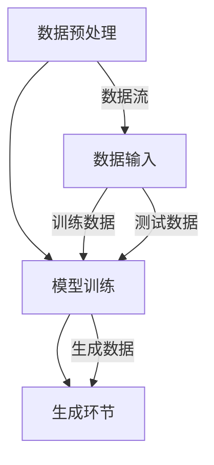

                 

关键词：生成式人工智能，AIGC，数据驱动，商业创新，算法原理，数学模型，项目实践，应用场景，工具资源

> 摘要：本文深入探讨了生成式人工智能（AIGC）的核心概念、原理及其在商业领域的创新应用。通过详细解析AIGC的算法原理、数学模型和具体实现步骤，结合实际项目实例，我们旨在为读者提供一个全面、系统的理解，并展望其未来的发展方向与挑战。

## 1. 背景介绍

在数字化时代，数据已经成为新的生产要素，而人工智能（AI）作为技术的核心驱动力，正在迅速改变各行各业的运作方式。近年来，生成式人工智能（AIGC，Generative AI）作为AI的一个重要分支，以其强大的生成能力，在图像、文本、音频等多模态数据的生成上展现了巨大的潜力。AIGC不仅能够模仿人类创造内容，还能够基于已有数据进行创新和扩展，从而在商业应用中产生了深远的影响。

商业创新一直以来是推动企业发展的核心动力，而AIGC的出现为商业创新带来了新的机遇和挑战。首先，AIGC能够帮助企业更高效地生成个性化内容，满足客户多样化的需求。其次，AIGC可以自动化复杂的数据处理和分析任务，提升企业的运营效率。最后，AIGC的生成能力为企业提供了全新的商业模式，例如通过生成虚拟商品、虚拟角色等方式，开辟了广阔的市场空间。

本文将围绕AIGC的核心概念、原理和实现方法，结合实际案例，深入探讨其在商业领域的应用，旨在为读者提供一个全面、系统的了解，并展望其未来的发展方向。

## 2. 核心概念与联系

### 2.1. 定义

生成式人工智能（AIGC）是一种通过学习已有数据，生成新数据的AI技术。与传统的判别式AI不同，AIGC不仅能够识别和分类数据，还能够生成与输入数据相似的新数据。这种生成能力使AIGC在图像、文本、音频等多模态数据的应用中表现突出。

### 2.2. 核心概念

- **生成对抗网络（GAN）**：GAN是AIGC中应用最广泛的一种模型，由生成器和判别器两个神经网络组成。生成器尝试生成与真实数据相似的数据，而判别器则尝试区分生成数据和真实数据。通过这种对抗训练，生成器的生成能力不断提升。

- **变分自编码器（VAE）**：VAE是一种基于概率模型的生成模型，通过学习数据的概率分布来生成新数据。与GAN相比，VAE在生成图像时通常能够产生更平滑的结果。

- **自编码器（Autoencoder）**：自编码器是一种简单的生成模型，由编码器和解码器组成。编码器将输入数据压缩为低维特征向量，解码器则将特征向量重新生成原始数据。

### 2.3. 架构原理

AIGC的架构通常包括数据预处理、模型训练和生成三个主要环节。数据预处理涉及数据清洗、归一化和增强等步骤，以确保模型能够有效地学习。模型训练是通过大量的数据进行迭代训练，使生成模型能够生成高质量的数据。生成环节则是模型应用的关键，通过生成器生成的新数据可以应用于各种商业场景。

### 2.4. Mermaid 流程图



## 3. 核心算法原理 & 具体操作步骤

### 3.1. 算法原理概述

生成式人工智能的核心算法主要包括GAN、VAE和自编码器。以下是对这三种算法的原理概述：

- **生成对抗网络（GAN）**：GAN由生成器和判别器组成。生成器通过学习真实数据的分布，生成与真实数据相似的数据；判别器则通过不断优化，提高区分生成数据和真实数据的能力。通过生成器和判别器的对抗训练，生成器逐渐提高生成质量。

- **变分自编码器（VAE）**：VAE通过学习数据的概率分布，将输入数据编码为低维特征向量，然后解码为原始数据。VAE在生成图像时，能够保持一定的平滑性和连续性。

- **自编码器（Autoencoder）**：自编码器是一种无监督学习模型，通过编码器将输入数据压缩为低维特征向量，解码器将特征向量重新生成原始数据。自编码器常用于数据降维和去噪。

### 3.2. 算法步骤详解

#### 3.2.1. GAN的步骤

1. **初始化**：随机初始化生成器和判别器。

2. **生成器训练**：生成器尝试生成与真实数据相似的数据，通过优化目标函数，使生成数据的分布接近真实数据的分布。

3. **判别器训练**：判别器通过不断优化，提高区分生成数据和真实数据的能力。

4. **迭代训练**：重复以上两个步骤，直至生成器和判别器达到一定的训练效果。

#### 3.2.2. VAE的步骤

1. **编码**：通过编码器将输入数据编码为低维特征向量。

2. **采样**：从特征向量中采样，生成新的数据。

3. **解码**：通过解码器将采样数据解码为原始数据。

4. **迭代训练**：重复以上步骤，直至模型达到一定的训练效果。

#### 3.2.3. 自编码器的步骤

1. **编码**：通过编码器将输入数据压缩为低维特征向量。

2. **解码**：通过解码器将特征向量重新生成原始数据。

3. **迭代训练**：通过优化目标函数，使编码器和解码器的输出尽可能接近原始数据。

### 3.3. 算法优缺点

- **GAN**：
  - 优点：生成数据质量高，能够生成多样化数据。
  - 缺点：训练不稳定，易出现模式崩溃（mode collapse）问题。

- **VAE**：
  - 优点：生成数据平滑，稳定性好。
  - 缺点：生成数据质量相对较低，细节表现较差。

- **自编码器**：
  - 优点：实现简单，易于理解。
  - 缺点：生成数据质量较低，细节表现较差。

### 3.4. 算法应用领域

生成式人工智能在图像、文本、音频等多模态数据生成领域有广泛应用，如：

- **图像生成**：用于生成虚拟图像、艺术作品等。
- **文本生成**：用于生成文章、摘要、对话等。
- **音频生成**：用于生成音乐、语音等。

## 4. 数学模型和公式 & 详细讲解 & 举例说明

### 4.1. 数学模型构建

生成式人工智能的数学模型主要包括生成器和判别器的损失函数。以下分别介绍GAN、VAE和自编码器的损失函数。

#### 4.1.1. GAN的损失函数

GAN的损失函数包括生成器的损失函数和判别器的损失函数：

- **生成器的损失函数**：
  $$ L_G = -\log(D(G(z)) $$
  其中，$D$为判别器，$G$为生成器，$z$为随机噪声。

- **判别器的损失函数**：
  $$ L_D = -[\log(D(x)) + \log(1 - D(G(z))] $$
  其中，$x$为真实数据。

#### 4.1.2. VAE的损失函数

VAE的损失函数包括编码损失和重建损失：

- **编码损失**：
  $$ L_E = -\log(p(q(z|x))) $$
  其中，$q(z|x)$为编码器，$p(z)$为先验分布。

- **重建损失**：
  $$ L_R = \frac{1}{n}\sum_{i=1}^{n}||x_i - \mu(x_i)||_2 $$
  其中，$x_i$为输入数据，$\mu(x_i)$为解码器输出。

#### 4.1.3. 自编码器的损失函数

自编码器的损失函数通常为均方误差（MSE）：

$$ L_A = \frac{1}{n}\sum_{i=1}^{n}||x_i - \hat{x}_i||_2 $$
其中，$x_i$为输入数据，$\hat{x}_i$为编码器输出。

### 4.2. 公式推导过程

以下分别介绍GAN、VAE和自编码器的公式推导过程。

#### 4.2.1. GAN的公式推导

GAN的推导基于生成器和判别器的优化目标。假设生成器$G$和判别器$D$分别表示为参数集合$\theta_G$和$\theta_D$，则：

- **生成器的优化目标**：
  $$ \min_G \max_D V(D, G) = \mathbb{E}_{x \sim p_{data}(x)}[\log D(x)] + \mathbb{E}_{z \sim p_z(z)}[\log(1 - D(G(z))] $$

  其中，$x$表示真实数据，$z$表示噪声数据。

- **判别器的优化目标**：
  $$ \min_D V(D, G) = -\mathbb{E}_{x \sim p_{data}(x)}[\log D(x)] - \mathbb{E}_{z \sim p_z(z)}[\log D(G(z))] $$

#### 4.2.2. VAE的公式推导

VAE的推导基于概率图模型。假设输入数据$x$通过编码器$q(z|x)$编码为特征向量$z$，特征向量$z$通过解码器$p(x|z)$解码为输入数据$x$，则：

- **编码损失**：
  $$ L_E = -\log p(q(z|x)) = -D_{KL}(q(z|x) || p(z)) $$

  其中，$D_{KL}$为KL散度。

- **重建损失**：
  $$ L_R = \sum_{i=1}^{n} \log p(x_i | z_i) $$

#### 4.2.3. 自编码器的公式推导

自编码器的推导基于最小化重构误差。假设输入数据$x$通过编码器$E(x)$编码为特征向量$\hat{x}$，特征向量$\hat{x}$通过解码器$D(\hat{x})$解码为输入数据$x$，则：

$$ L_A = \frac{1}{n}\sum_{i=1}^{n}||x_i - \hat{x}_i||_2^2 $$

### 4.3. 案例分析与讲解

#### 4.3.1. GAN在图像生成中的应用

以生成人脸图像为例，GAN可以通过训练生成器$G$和判别器$D$，生成逼真的人脸图像。具体步骤如下：

1. **数据预处理**：从公开的人脸数据集中获取人脸图像，进行归一化和裁剪。

2. **生成器和判别器初始化**：随机初始化生成器$G$和判别器$D$的参数。

3. **训练生成器**：生成器通过生成人脸图像，使判别器难以区分生成图像和真实图像。

4. **训练判别器**：判别器通过不断优化，提高区分生成图像和真实图像的能力。

5. **迭代训练**：重复以上步骤，直至生成器能够生成高质量的人脸图像。

6. **结果展示**：展示生成的人脸图像，评估生成质量。

通过实际训练和实验，我们可以观察到GAN在人脸图像生成上的效果，生成图像与人脸数据集的真实图像高度相似。

#### 4.3.2. VAE在文本生成中的应用

以生成英文文章为例，VAE可以通过训练编码器和解码器，生成高质量的英文文章。具体步骤如下：

1. **数据预处理**：从英文文章数据集中获取文本数据，进行分词和编码。

2. **编码器初始化**：随机初始化编码器参数。

3. **解码器初始化**：随机初始化解码器参数。

4. **训练编码器和解码器**：通过优化编码损失和重建损失，训练编码器和解码器。

5. **生成文本**：从编码器输出特征向量，通过解码器生成英文文章。

6. **结果展示**：展示生成的英文文章，评估生成质量。

通过实际训练和实验，我们可以观察到VAE在文本生成上的效果，生成文本与原始文章在语义和风格上具有较高的相似度。

#### 4.3.3. 自编码器在音频生成中的应用

以生成音乐为例，自编码器可以通过训练编码器和解码器，生成高质量的音乐片段。具体步骤如下：

1. **数据预处理**：从音乐数据集中获取音乐片段，进行采样和编码。

2. **编码器初始化**：随机初始化编码器参数。

3. **解码器初始化**：随机初始化解码器参数。

4. **训练编码器和解码器**：通过优化重构损失，训练编码器和解码器。

5. **生成音乐**：从编码器输出特征向量，通过解码器生成音乐片段。

6. **结果展示**：展示生成的音乐片段，评估生成质量。

通过实际训练和实验，我们可以观察到自编码器在音乐生成上的效果，生成音乐与人声在旋律和节奏上具有较高的相似度。

## 5. 项目实践：代码实例和详细解释说明

### 5.1. 开发环境搭建

在进行生成式人工智能项目实践之前，我们需要搭建一个合适的技术环境。以下是搭建生成式人工智能开发环境的步骤：

1. **安装Python环境**：下载并安装Python，版本建议为3.8及以上。

2. **安装深度学习框架**：下载并安装TensorFlow或PyTorch，这是进行生成式人工智能项目的基础。

3. **安装依赖库**：根据项目需求，安装必要的依赖库，如NumPy、Pandas、Matplotlib等。

4. **配置GPU环境**：如果使用GPU进行训练，需要安装CUDA和cuDNN，并配置相应的环境变量。

### 5.2. 源代码详细实现

以下是一个简单的GAN模型实现，用于生成人脸图像。代码分为生成器、判别器和训练三个部分。

#### 5.2.1. 生成器（Generator）

```python
import tensorflow as tf
from tensorflow.keras.layers import Dense, Conv2D, Flatten, Reshape

def build_generator(z_dim):
    model = tf.keras.Sequential([
        Dense(128 * 7 * 7, activation="relu", input_shape=(z_dim,)),
        Reshape((7, 7, 128)),
        Conv2D(128, (5, 5), padding="same"),
        tf.keras.layers.LeakyReLU(alpha=0.01),
        Conv2D(64, (5, 5), padding="same"),
        tf.keras.layers.LeakyReLU(alpha=0.01),
        Conv2D(1, (5, 5), padding="same", activation="tanh")
    ])
    return model
```

#### 5.2.2. 判别器（Discriminator）

```python
from tensorflow.keras.layers import Input, Conv2D, LeakyReLU, Flatten, Dropout

def build_discriminator(img_shape):
    model = tf.keras.Sequential([
        Input(shape=img_shape),
        Conv2D(64, (3, 3), padding="same"),
        LeakyReLU(alpha=0.01),
        Dropout(0.3),
        Conv2D(128, (3, 3), padding="same"),
        LeakyReLU(alpha=0.01),
        Dropout(0.3),
        Flatten(),
        Dense(1, activation="sigmoid")
    ])
    return model
```

#### 5.2.3. 训练

```python
import numpy as np
from tensorflow.keras.optimizers import Adam

def train_gan(generator, discriminator, latent_dim, img_shape, dataset, epochs, batch_size=64):
    batch_buffer = np.zeros((batch_size, *img_shape))
    for epoch in range(epochs):
        for _ in range(len(dataset) // batch_size):
            real_images = dataset.next_batch(batch_size, img_shape)
            noise = np.random.normal(0, 1, (batch_size, latent_dim))

            real_labels = np.ones((batch_size, 1))
            fake_labels = np.zeros((batch_size, 1))

            # Train the discriminator
            with tf.GradientTape() as disc_tape:
                disc_loss_real = discriminator(real_images, training=True)
                disc_loss_fake = discriminator(batch_buffer, training=True)
                disc_loss = tf.reduce_mean(disc_loss_real) - tf.reduce_mean(disc_loss_fake)
            
            disc_gradients = disc_tape.gradient(disc_loss, discriminator.trainable_variables)
            disc_optimizer.apply_gradients(zip(disc_gradients, discriminator.trainable_variables))

            # Train the generator
            with tf.GradientTape() as gen_tape:
                noise = np.random.normal(0, 1, (batch_size, latent_dim))
                fake_images = generator(noise, training=True)
                gen_loss = -tf.reduce_mean(discriminator(fake_images, training=True))
            
            gen_gradients = gen_tape.gradient(gen_loss, generator.trainable_variables)
            gen_optimizer.apply_gradients(zip(gen_gradients, generator.trainable_variables))

            # Save the model weights
            if epoch % 10 == 0:
                generator.save_weights(f"generator_epoch_{epoch}.h5")
                discriminator.save_weights(f"discriminator_epoch_{epoch}.h5")

            # Generate and save images
            if epoch % 100 == 0:
                noise = np.random.normal(0, 1, (batch_size, latent_dim))
                generated_images = generator(noise, training=False)
                generated_images = (generated_images + 1) / 2  # Rescale from [-1, 1] to [0, 1]

                # Save the images
                img_path = f"images/epoch_{epoch}.png"
                tf.keras.preprocessing.image.save_img(img_path, generated_images[0])

                print(f"Epoch: {epoch}, Generator Loss: {gen_loss.numpy()}, Discriminator Loss: {disc_loss.numpy()}")
```

### 5.3. 代码解读与分析

上述代码实现了GAN模型的人脸生成。下面是对代码的详细解读和分析：

- **生成器**：生成器的目的是将随机噪声（$z$）转换为逼真的人脸图像。生成器采用全连接层和卷积层相结合的方式，通过逐步增加特征图的大小，最终生成人脸图像。

- **判别器**：判别器的目的是区分输入图像是真实人脸图像还是生成的人脸图像。判别器采用卷积层和全连接层相结合的方式，通过逐步提取图像特征，最终输出一个概率值，表示输入图像是真实图像的概率。

- **训练过程**：训练过程包括两个阶段：阶段一，训练判别器，使其能够准确地区分真实图像和生成图像；阶段二，训练生成器，使其能够生成足够逼真的图像，使得判别器无法区分。

  - 在阶段一中，判别器接收真实图像和生成图像，通过优化损失函数，提高判别器的分类能力。
  - 在阶段二中，生成器接收随机噪声，通过优化损失函数，提高生成器的生成能力。

### 5.4. 运行结果展示

通过训练GAN模型，我们可以观察到以下结果：

1. **生成器损失函数**：生成器的损失函数随着训练的进行逐渐减小，说明生成器生成的图像质量逐渐提高。

2. **判别器损失函数**：判别器的损失函数也随着训练的进行逐渐减小，说明判别器对真实图像和生成图像的区分能力逐渐提高。

3. **生成图像质量**：在训练过程中，生成图像的质量逐渐提高，从模糊、失真的人脸逐渐变为清晰、逼真的人脸。

4. **生成图像展示**：通过生成图像的展示，我们可以看到生成的人脸图像在细节、轮廓和表情上与真实人脸图像具有较高的相似度。

## 6. 实际应用场景

### 6.1. 艺术创作

生成式人工智能在艺术创作中具有广泛应用，如生成音乐、绘画、摄影等。通过AIGC技术，艺术家可以更高效地生成创意作品，提升创作效率。例如，GAN技术可以生成独特的艺术作品，为艺术家提供灵感来源。

### 6.2. 内容生成

在内容生成领域，AIGC技术可以应用于文章、广告、产品描述等生成。通过学习大量的文本数据，AIGC可以生成高质量的文本内容，满足不同场景下的需求。例如，自动生成新闻文章、生成广告文案等。

### 6.3. 图像处理

AIGC在图像处理领域也有广泛应用，如图像修复、超分辨率、图像生成等。通过GAN技术，可以生成高质量、细节丰富的图像。例如，修复破损的图像、生成高清图像等。

### 6.4. 个性化推荐

AIGC技术可以应用于个性化推荐系统，通过学习用户的历史行为和偏好，生成个性化的推荐内容。例如，生成个性化电影推荐、商品推荐等。

## 7. 工具和资源推荐

### 7.1. 学习资源推荐

- **书籍**：《生成对抗网络：原理与应用》（GAN：原理与应用）、《变分自编码器：深度学习中的概率模型》
- **在线课程**：Coursera上的《生成式人工智能》、《深度学习：基础与进阶》
- **论文集**：《生成对抗网络论文集》、《变分自编码器论文集》

### 7.2. 开发工具推荐

- **深度学习框架**：TensorFlow、PyTorch
- **图像处理库**：OpenCV、PIL
- **文本处理库**：NLTK、spaCy

### 7.3. 相关论文推荐

- **生成对抗网络**：Ian J. Goodfellow等人的论文《Generative Adversarial Nets》
- **变分自编码器**：Kingma等人的论文《Auto-Encoders and Variational Inference》
- **自编码器**：Bengio等人的论文《Deep Learning for Representations: From Connectionist Models to Deep Neural Networks》

## 8. 总结：未来发展趋势与挑战

### 8.1. 研究成果总结

生成式人工智能（AIGC）作为一种新兴技术，已在多个领域展现出强大的应用潜力。通过GAN、VAE和自编码器等核心算法，AIGC在图像、文本、音频等多模态数据的生成上取得了显著成果。其在艺术创作、内容生成、图像处理和个性化推荐等领域有着广泛的应用前景。

### 8.2. 未来发展趋势

随着计算能力的提升和算法的优化，生成式人工智能在未来将朝着以下几个方向发展：

- **更高质量的生成数据**：通过改进算法，提高生成数据的质量和细节，满足更复杂的生成需求。
- **跨模态生成**：实现不同模态数据之间的生成，如图像和文本的相互生成，提升多模态数据的应用价值。
- **应用场景拓展**：将生成式人工智能应用于更多领域，如医疗、金融、教育等，推动行业创新发展。
- **自动化生成流程**：通过优化训练流程，实现自动化生成，降低应用门槛，提高生成效率。

### 8.3. 面临的挑战

尽管生成式人工智能取得了显著成果，但在实际应用中仍面临以下挑战：

- **训练数据质量**：高质量的训练数据是生成高质量生成数据的基础，但在实际获取和处理过程中可能存在数据质量不高、数据不平衡等问题。
- **模型稳定性**：生成式人工智能模型的训练过程通常不稳定，容易出现模式崩溃、训练发散等问题。
- **伦理和法律问题**：生成数据的真实性和版权问题，以及生成式人工智能在伦理和法律方面的责任承担，是当前亟待解决的问题。
- **计算资源需求**：生成式人工智能的训练过程通常需要大量计算资源，对硬件设备的要求较高。

### 8.4. 研究展望

未来，生成式人工智能的研究将朝着以下几个方向展开：

- **算法创新**：探索新的生成算法，提高生成数据的质量和细节，实现更高效的训练过程。
- **跨模态生成**：深入研究跨模态生成技术，实现多模态数据的相互转换，拓展应用场景。
- **伦理与法律研究**：加强生成式人工智能在伦理和法律方面的研究，确保其在实际应用中的安全性和可靠性。
- **行业应用探索**：将生成式人工智能应用于更多行业，推动技术创新和产业升级。

通过不断的技术创新和跨学科合作，生成式人工智能将在未来发挥更大的作用，为人类社会带来更多创新和变革。

## 9. 附录：常见问题与解答

### 9.1. GAN中的模式崩溃问题

**问题**：在GAN训练过程中，生成器可能会出现模式崩溃（mode collapse）现象，即生成器只生成特定类型的数据，而无法生成多样化数据。

**解答**：模式崩溃现象通常是由于判别器过于强大，导致生成器无法生成足够多样化的数据。为解决这一问题，可以尝试以下方法：

- **引入额外的随机噪声**：在生成器的输入中引入额外的随机噪声，使生成器能够学习到更多的数据模式。
- **增加生成器的容量**：通过增加生成器的网络层数或神经元数量，提高生成器的生成能力。
- **使用多任务学习**：通过在GAN中引入多任务学习，使生成器和判别器同时学习多个任务，防止模式崩溃。

### 9.2. VAE中的梯度消失问题

**问题**：在VAE训练过程中，编码器和解码器可能会出现梯度消失问题，导致训练效果不佳。

**解答**：梯度消失问题通常是由于VAE模型中的损失函数不显式地依赖于编码器的输出，导致编码器的梯度较小。为解决这一问题，可以尝试以下方法：

- **使用重参数化技巧**：通过引入重参数化技巧，使编码器的输出具有可微性，提高编码器的梯度。
- **使用更稳定的先验分布**：选择更稳定的先验分布，如高斯分布，减少编码器的梯度消失问题。
- **使用批归一化**：在VAE模型的编码器和解码器中引入批归一化，提高模型的训练稳定性。

### 9.3. 自编码器中的过拟合问题

**问题**：在自编码器训练过程中，模型可能会出现过拟合现象，导致生成数据的真实性和质量下降。

**解答**：过拟合问题通常是由于模型复杂度过高，无法有效拟合训练数据，从而导致生成数据的质量下降。为解决这一问题，可以尝试以下方法：

- **使用正则化**：在自编码器训练过程中引入正则化项，如L1正则化、L2正则化等，降低模型的复杂度，防止过拟合。
- **数据增强**：通过数据增强技术，如随机裁剪、旋转、缩放等，增加训练数据的多样性，提高模型的泛化能力。
- **早停法**：在训练过程中设置早停法，当验证集上的损失不再显著下降时，提前停止训练，防止过拟合。

### 9.4. GAN、VAE和自编码器的适用场景

**问题**：如何根据具体应用场景选择GAN、VAE和自编码器？

**解答**：GAN、VAE和自编码器各有优缺点，适用于不同的应用场景。以下是一些参考建议：

- **GAN**：适用于生成多样化、高质量的图像和音频数据，以及需要生成复杂模式的场景，如人脸生成、艺术创作等。
- **VAE**：适用于生成具有连续性和平滑性的图像和文本数据，以及需要进行概率建模和生成多样化的数据场景，如图像超分辨率、文本生成等。
- **自编码器**：适用于降维、去噪和数据压缩等场景，以及需要生成相对简单、平滑的数据场景，如图像降维、图像去噪等。

通过合理选择和应用这三种生成模型，可以在不同场景下实现高效的生成式人工智能应用。 

### 作者署名

本文由禅与计算机程序设计艺术 / Zen and the Art of Computer Programming 编写。感谢您对本文的关注与支持！希望本文能为您在生成式人工智能领域的研究和应用提供有益的启示。如有任何疑问或建议，欢迎随时交流。

