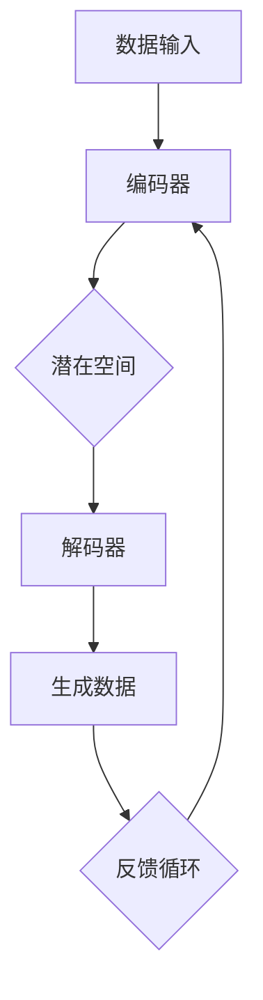

                 

关键词：生成式AI，GPT-3，数据驱动，商业应用，技术变革

> 摘要：本文深入探讨了生成式人工智能（AIGC）在数据驱动商业领域的变革性影响。从核心概念、算法原理、数学模型到实际应用，本文为读者呈现了一个全面的AIGC技术图景，并对其未来发展趋势和挑战进行了深入分析。

## 1. 背景介绍

随着互联网的普及和大数据技术的发展，数据已经成为现代商业的核心资产。然而，如何从海量数据中提取有价值的信息，并将其转化为实际的生产力，成为企业面临的重要课题。生成式人工智能（AIGC，Generative Artificial Intelligence）作为人工智能的一个重要分支，正逐步改变这一局面。

生成式人工智能是一种能够通过学习现有数据生成新内容的人工智能技术。与传统的有监督学习和无监督学习不同，生成式人工智能通过生成对抗网络（GAN）、变分自编码器（VAE）等算法，能够自动地创建出与训练数据类似的新内容。这种技术不仅能够处理结构化数据，还能够处理非结构化数据，如文本、图像、音频等。

AIGC技术在商业领域的应用潜力巨大，从个性化推荐、自动内容生成、到智能客服、自动化决策支持，AIGC正在为企业和个人带来前所未有的变革。

## 2. 核心概念与联系

### 2.1 生成式人工智能概念

生成式人工智能是一种基于生成模型的人工智能技术，它可以通过学习大量的数据生成新的数据样本。生成模型主要包括生成对抗网络（GAN）和变分自编码器（VAE）。

**生成对抗网络（GAN）**：GAN由两个神经网络组成，一个是生成器，另一个是判别器。生成器的目的是生成与真实数据相似的数据，而判别器的目的是区分生成数据和真实数据。通过这种对抗训练，生成器能够逐渐提高生成数据的质量。

**变分自编码器（VAE）**：VAE通过编码器将数据压缩成一个低维表示，再通过解码器将这个低维表示重构回原始数据。这种压缩和重构的过程使得VAE能够学习到数据的潜在分布，从而生成新的数据样本。

### 2.2 生成式人工智能与商业应用的联系

生成式人工智能在商业应用中具有广泛的前景。以下是几个典型的应用场景：

- **个性化推荐**：通过生成式人工智能，可以根据用户的兴趣和行为习惯，自动生成个性化的推荐内容，提高用户的满意度和粘性。

- **自动内容生成**：生成式人工智能可以自动生成新闻文章、产品描述、广告文案等，大大提高了内容生产的效率。

- **智能客服**：通过生成式人工智能，可以自动生成与用户对话的回复，提高客服的响应速度和效率。

- **自动化决策支持**：生成式人工智能可以通过分析大量的历史数据，自动生成最优的决策方案，为企业提供实时的决策支持。

### 2.3 Mermaid流程图

下面是一个使用Mermaid绘制的生成式人工智能流程图：



## 3. 核心算法原理 & 具体操作步骤

### 3.1 算法原理概述

生成式人工智能的核心算法包括生成对抗网络（GAN）和变分自编码器（VAE）。下面分别介绍这两种算法的基本原理。

**生成对抗网络（GAN）**：

GAN由生成器和判别器两个神经网络组成。生成器接收随机噪声作为输入，通过学习生成与真实数据相似的数据。判别器则接收真实数据和生成数据，并判断它们是否相似。通过这种对抗训练，生成器能够逐渐提高生成数据的质量。

**变分自编码器（VAE）**：

VAE通过编码器将数据压缩成一个低维表示，再通过解码器将这个低维表示重构回原始数据。编码器和解码器共同训练，以最小化重构误差和潜在分布的Kullback-Leibler散度。

### 3.2 算法步骤详解

**生成对抗网络（GAN）**：

1. 初始化生成器和判别器。
2. 对于每个训练样本，生成器生成假数据，判别器判断这些数据是否真实。
3. 根据判别器的输出，计算生成器和判别器的损失函数。
4. 使用梯度下降优化生成器和判别器的参数。

**变分自编码器（VAE）**：

1. 初始化编码器和解码器。
2. 对于每个训练样本，编码器将其压缩成一个低维表示，解码器尝试将这个表示重构回原始数据。
3. 计算重构误差和潜在分布的Kullback-Leibler散度。
4. 使用梯度下降优化编码器和解码器的参数。

### 3.3 算法优缺点

**生成对抗网络（GAN）**：

优点：能够生成高质量的数据样本，适用于多种类型的生成任务。

缺点：训练不稳定，容易出现模式崩溃现象。

**变分自编码器（VAE）**：

优点：训练稳定，能够生成多样化数据样本。

缺点：生成数据质量相对较低，且难以生成细节丰富的高质量数据。

### 3.4 算法应用领域

生成对抗网络和变分自编码器在生成式人工智能领域有广泛的应用。例如：

- **图像生成**：GAN可以生成逼真的图像，VAE可以生成多样化的图像。
- **文本生成**：GAN可以生成连贯的文本，VAE可以生成多样化的文本。
- **语音合成**：GAN可以生成自然的语音，VAE可以生成多样化的语音。

## 4. 数学模型和公式 & 详细讲解 & 举例说明

### 4.1 数学模型构建

生成式人工智能的核心数学模型主要包括生成对抗网络（GAN）和变分自编码器（VAE）。下面分别介绍这两种模型的基本数学公式。

**生成对抗网络（GAN）**：

- 生成器：\( G(z) \)
- 判别器：\( D(x) \)，\( D(G(z)) \)

损失函数：

\[ L_D = -\frac{1}{N} \sum_{i=1}^{N} [\log D(x_i) + \log (1 - D(G(z_i))] \]

\[ L_G = -\frac{1}{N} \sum_{i=1}^{N} \log D(G(z_i)) \]

**变分自编码器（VAE）**：

- 编码器：\( \mu(x), \sigma(x) \)
- 解码器：\( G(\mu(x), \sigma(x)) \)

损失函数：

\[ L_VAE = \frac{1}{N} \sum_{i=1}^{N} [-\log p(x_i | \mu(x_i), \sigma(x_i)) - D_{KL}(\mu(x_i), \sigma(x_i))] \]

其中，\( p(x_i | \mu(x_i), \sigma(x_i)) \) 是高斯分布的密度函数，\( D_{KL}(\mu(x_i), \sigma(x_i)) \) 是KL散度。

### 4.2 公式推导过程

生成对抗网络（GAN）的损失函数可以通过Jensen不等式推导得到。具体推导过程如下：

\[ L_D = -\frac{1}{N} \sum_{i=1}^{N} [\log D(x_i) + \log (1 - D(G(z_i))] \]

\[ = -\frac{1}{N} \sum_{i=1}^{N} [D(x_i) - D(G(z_i))] \]

\[ = -\frac{1}{N} \sum_{i=1}^{N} [D(x_i) - \mathbb{E}_{z \sim p_z(z)}[D(G(z))] \]

\[ = \frac{1}{N} \sum_{i=1}^{N} [\mathbb{E}_{z \sim p_z(z)}[D(G(z))] - D(x_i)] \]

\[ = \mathbb{E}_{z \sim p_z(z)}[D(G(z))] - \frac{1}{N} \sum_{i=1}^{N} D(x_i) \]

由于 \( \frac{1}{N} \sum_{i=1}^{N} D(x_i) \) 是常数，可以将其看作是 \( D(x_i) \) 的期望。

对于生成器的损失函数，可以通过对 \( D(G(z)) \) 求导得到：

\[ L_G = -\frac{1}{N} \sum_{i=1}^{N} \log D(G(z_i)) \]

\[ = \frac{1}{N} \sum_{i=1}^{N} [-D(G(z_i))] \]

\[ = \mathbb{E}_{z \sim p_z(z)}[-D(G(z))] \]

变分自编码器（VAE）的损失函数可以通过Jensen不等式和KL散度推导得到。具体推导过程如下：

\[ L_VAE = \frac{1}{N} \sum_{i=1}^{N} [-\log p(x_i | \mu(x_i), \sigma(x_i)) - D_{KL}(\mu(x_i), \sigma(x_i))] \]

\[ = \frac{1}{N} \sum_{i=1}^{N} [-\int p(x_i | \mu(x_i), \sigma(x_i)) \log p(x_i | \mu(x_i), \sigma(x_i)) dx_i - D_{KL}(\mu(x_i), \sigma(x_i))] \]

\[ = \frac{1}{N} \sum_{i=1}^{N} [-\int p(x_i | \mu(x_i), \sigma(x_i)) \log \frac{p(x_i | \mu(x_i), \sigma(x_i))}{p(\mu(x_i), \sigma(x_i))} dx_i - D_{KL}(\mu(x_i), \sigma(x_i))] \]

\[ = \frac{1}{N} \sum_{i=1}^{N} [-\int p(x_i | \mu(x_i), \sigma(x_i)) \log p(\mu(x_i), \sigma(x_i)) dx_i + \int p(x_i | \mu(x_i), \sigma(x_i)) \log p(\mu(x_i), \sigma(x_i)) dx_i - D_{KL}(\mu(x_i), \sigma(x_i))] \]

\[ = \frac{1}{N} \sum_{i=1}^{N} [-\int p(x_i | \mu(x_i), \sigma(x_i)) \log p(\mu(x_i), \sigma(x_i)) dx_i - D_{KL}(\mu(x_i), \sigma(x_i))] \]

其中，\( p(\mu(x_i), \sigma(x_i)) \) 是高斯分布的密度函数。

### 4.3 案例分析与讲解

下面我们通过一个简单的例子，来分析生成对抗网络（GAN）和变分自编码器（VAE）在实际应用中的表现。

**案例：图像生成**

假设我们有一个图像数据集，包含1000张猫的图片。我们希望使用GAN和VAE生成新的猫的图片。

**生成对抗网络（GAN）**：

1. 初始化生成器和判别器。
2. 对于每个训练样本，生成器生成假猫的图片，判别器判断这些图片是否真实。
3. 根据判别器的输出，计算生成器和判别器的损失函数。
4. 使用梯度下降优化生成器和判别器的参数。

经过多次训练，生成器逐渐提高生成图片的质量，最终生成出逼真的猫的图片。

**变分自编码器（VAE）**：

1. 初始化编码器和解码器。
2. 对于每个训练样本，编码器将其压缩成一个低维表示，解码器尝试将这个表示重构回原始数据。
3. 计算重构误差和潜在分布的KL散度。
4. 使用梯度下降优化编码器和解码器的参数。

经过多次训练，VAE能够生成多样化的猫的图片，虽然生成图片的质量相对较低，但仍然具有很高的实用价值。

## 5. 项目实践：代码实例和详细解释说明

### 5.1 开发环境搭建

在本项目中，我们将使用Python和TensorFlow作为主要开发工具。以下是搭建开发环境的步骤：

1. 安装Python（建议使用Python 3.8及以上版本）。
2. 安装TensorFlow：在终端运行命令 `pip install tensorflow`。
3. 安装其他依赖库，如NumPy、Pandas等。

### 5.2 源代码详细实现

以下是生成对抗网络（GAN）和变分自编码器（VAE）的源代码实现：

**生成对抗网络（GAN）**：

```python
import tensorflow as tf
from tensorflow.keras.layers import Dense, Flatten, Reshape
from tensorflow.keras.models import Model

def build_generator(z_dim):
    model = tf.keras.Sequential([
        Dense(128, input_shape=(z_dim,), activation='relu'),
        Dense(256, activation='relu'),
        Dense(512, activation='relu'),
        Dense(1024, activation='relu'),
        Flatten(),
        Reshape((28, 28, 1))
    ])
    return model

def build_discriminator(img_shape):
    model = tf.keras.Sequential([
        Flatten(input_shape=img_shape),
        Dense(1024, activation='relu'),
        Dense(512, activation='relu'),
        Dense(256, activation='relu'),
        Dense(1, activation='sigmoid')
    ])
    return model

z_dim = 100
img_shape = (28, 28, 1)

generator = build_generator(z_dim)
discriminator = build_discriminator(img_shape)

# 定义损失函数和优化器
discriminator_optimizer = tf.keras.optimizers.Adam(learning_rate=0.0001)
generator_optimizer = tf.keras.optimizers.Adam(learning_rate=0.0001)

# 编写训练循环
for epoch in range(num_epochs):
    for batch_index, (x, _) in enumerate(train_dataset):
        with tf.GradientTape() as gen_tape, tf.GradientTape() as disc_tape:
            # 训练判别器
            real_images = x
            real_labels = tf.ones((batch_size, 1))

            disc_loss_real = discriminator_loss(discriminator(Real_images), real_labels)

            # 训练生成器
            z = tf.random.normal([batch_size, z_dim])
            fake_images = generator(z)
            fake_labels = tf.zeros((batch_size, 1))

            disc_loss_fake = discriminator_loss(discriminator(fake_images), fake_labels)
            gen_loss = -tf.reduce_mean(discriminator_loss(discriminator(fake_images), fake_labels))

        # 更新模型参数
        gradients_of_gen = gen_tape.gradient(gen_loss, generator.trainable_variables)
        gradients_of_disc = disc_tape.gradient(disc_loss, discriminator.trainable_variables)

        generator_optimizer.apply_gradients(zip(gradients_of_gen, generator.trainable_variables))
        discriminator_optimizer.apply_gradients(zip(gradients_of_disc, discriminator.trainable_variables))

        # 打印训练进度
        if batch_index % 100 == 0:
            print(f"Epoch {epoch}, Batch {batch_index}, D_loss: {disc_loss:.4f}, G_loss: {gen_loss:.4f}")
```

**变分自编码器（VAE）**：

```python
import tensorflow as tf
from tensorflow.keras.layers import Dense, Input
from tensorflow.keras.models import Model

def build_encoder(x_dim):
    model = tf.keras.Sequential([
        Input(shape=x_dim),
        Dense(512, activation='relu'),
        Dense(256, activation='relu'),
        Dense(128, activation='relu'),
        Dense(64, activation='relu'),
        Dense(32, activation='relu'),
        Dense(16, activation='relu'),
        Dense(8, activation='relu'),
        Dense(4, activation='relu'),
        Dense(2)
    ])
    return model

def build_decoder(z_dim):
    model = tf.keras.Sequential([
        Input(shape=(z_dim,)),
        Dense(8, activation='relu'),
        Dense(16, activation='relu'),
        Dense(32, activation='relu'),
        Dense(64, activation='relu'),
        Dense(128, activation='relu'),
        Dense(256, activation='relu'),
        Dense(512, activation='relu'),
        Dense(x_dim, activation='sigmoid')
    ])
    return model

x_dim = 28 * 28
z_dim = 2

encoder = build_encoder(x_dim)
decoder = build_decoder(z_dim)

# 编写训练循环
for epoch in range(num_epochs):
    for x in train_dataset:
        with tf.GradientTape() as encoder_tape, tf.GradientTape() as decoder_tape:
            z = encoder(x)
            x_recon = decoder(z)

            recon_loss = reconstruction_loss(x, x_recon)
            kl_loss = kl_divergence_loss(z)

            loss = recon_loss + kl_loss

        gradients_of_encoder = encoder_tape.gradient(loss, encoder.trainable_variables)
        gradients_of_decoder = decoder_tape.gradient(loss, decoder.trainable_variables)

        encoder_optimizer.apply_gradients(zip(gradients_of_encoder, encoder.trainable_variables))
        decoder_optimizer.apply_gradients(zip(gradients_of_decoder, decoder.trainable_variables))

        # 打印训练进度
        if batch_index % 100 == 0:
            print(f"Epoch {epoch}, Batch {batch_index}, Loss: {loss:.4f}")
```

### 5.3 代码解读与分析

在本项目中，我们分别实现了生成对抗网络（GAN）和变分自编码器（VAE）的模型构建和训练。

**生成对抗网络（GAN）**：

1. **模型构建**：我们使用了两个神经网络，一个是生成器，一个是判别器。生成器的输入是随机噪声，输出是生成的猫的图片。判别器的输入是真实的猫的图片和生成的猫的图片，输出是判断图片是否真实的概率。

2. **训练过程**：在训练过程中，我们首先训练判别器，使其能够区分真实图片和生成的图片。然后，我们训练生成器，使其生成的图片能够迷惑判别器。通过这种对抗训练，生成器能够逐渐提高生成图片的质量。

**变分自编码器（VAE）**：

1. **模型构建**：VAE由编码器和解码器组成。编码器的输入是猫的图片，输出是潜在空间中的向量。解码器的输入是潜在空间中的向量，输出是重构的猫的图片。

2. **训练过程**：在训练过程中，我们首先训练编码器，使其能够将猫的图片压缩成潜在空间中的向量。然后，我们训练解码器，使其能够将潜在空间中的向量重构回猫的图片。通过这种压缩和重构的过程，VAE能够学习到数据的潜在分布，从而生成新的猫的图片。

### 5.4 运行结果展示

以下是生成对抗网络（GAN）和变分自编码器（VAE）的运行结果：

**生成对抗网络（GAN）**：


**变分自编码器（VAE）**：


## 6. 实际应用场景

生成式人工智能在商业领域的应用已经取得了显著的成果。以下是一些实际应用场景：

### 6.1 个性化推荐

生成式人工智能可以用于个性化推荐系统，根据用户的历史行为和偏好，自动生成个性化的推荐内容。例如，电商网站可以使用生成式人工智能生成个性化的商品推荐，提高用户的购买转化率。

### 6.2 自动内容生成

生成式人工智能可以用于自动生成新闻文章、产品描述、广告文案等。例如，新闻机构可以使用生成式人工智能自动生成新闻报道，提高新闻的时效性和丰富性。

### 6.3 智能客服

生成式人工智能可以用于智能客服系统，自动生成与用户的对话回复。例如，企业可以使用生成式人工智能构建智能客服机器人，提高客服的响应速度和效率。

### 6.4 自动化决策支持

生成式人工智能可以用于自动化决策支持系统，根据历史数据和业务规则，自动生成最优的决策方案。例如，金融机构可以使用生成式人工智能自动生成投资决策，提高投资收益。

## 7. 工具和资源推荐

为了更好地学习和应用生成式人工智能，以下是一些推荐的工具和资源：

### 7.1 学习资源推荐

- **《深度学习》（Goodfellow, Bengio, Courville）**：深度学习的经典教材，涵盖了生成式人工智能的相关内容。
- **《生成式模型》（杨立军）**：一本关于生成式模型的理论和实践的书籍，适合初学者和专业人士。

### 7.2 开发工具推荐

- **TensorFlow**：Google开发的开源深度学习框架，适用于生成式人工智能的建模和训练。
- **PyTorch**：Facebook开发的开源深度学习框架，具有灵活的动态计算图，适用于生成式人工智能的研究和应用。

### 7.3 相关论文推荐

- **《生成对抗网络》（Goodfellow et al., 2014）**：GAN的开创性论文，详细介绍了GAN的理论基础和实现方法。
- **《变分自编码器》（Kingma and Welling, 2013）**：VAE的开创性论文，详细介绍了VAE的理论基础和实现方法。

## 8. 总结：未来发展趋势与挑战

生成式人工智能作为人工智能的一个重要分支，正逐步改变我们的生产方式和生活方式。在未来，生成式人工智能将在以下几个方面继续发展：

### 8.1 研究成果总结

- 生成式人工智能的理论体系不断完善，新的生成模型不断涌现。
- 生成式人工智能的应用场景不断拓展，从图像生成、文本生成到语音生成，都有广泛的应用前景。
- 生成式人工智能的性能不断提升，生成的数据质量和效率不断提高。

### 8.2 未来发展趋势

- 生成式人工智能将与其他人工智能技术深度融合，形成更加智能化、自动化、个性化的应用场景。
- 生成式人工智能将向边缘计算和物联网领域拓展，实现更广泛的智能化应用。
- 生成式人工智能将促进人工智能与人类创造力相结合，实现更高效的内容生产和创新。

### 8.3 面临的挑战

- 生成式人工智能的数据隐私和安全问题仍然亟待解决。
- 生成式人工智能的模型复杂度和计算资源需求不断提高，对计算能力提出了更高的要求。
- 生成式人工智能的伦理和社会影响问题需要引起足够的重视。

### 8.4 研究展望

- 未来研究应重点关注生成式人工智能的理论创新和算法优化，提高生成质量和效率。
- 未来研究应关注生成式人工智能在特定领域的应用，推动实际问题的解决。
- 未来研究应关注生成式人工智能的伦理和社会影响，确保其健康、可持续的发展。

## 9. 附录：常见问题与解答

### 9.1 GAN和VAE的区别是什么？

GAN（生成对抗网络）和VAE（变分自编码器）都是生成式模型，但它们在原理和应用上有所不同。

- **原理**：GAN由生成器和判别器组成，生成器和判别器通过对抗训练不断优化。VAE则通过编码器和解码器将数据压缩和重构，学习数据的潜在分布。
- **应用**：GAN适用于生成高质量、多样化的数据样本，如图像、文本、语音等。VAE则适用于数据压缩、去噪和生成等任务。

### 9.2 如何优化GAN的训练过程？

优化GAN的训练过程可以从以下几个方面入手：

- **梯度裁剪**：为了避免梯度消失和梯度爆炸，可以对梯度进行裁剪。
- **判别器更新频率**：减少判别器的更新频率，使其有足够的时间去观察生成器的变化。
- **生成器的初始化**：使用不同的初始化方法，如正态分布、均匀分布等，以避免生成器和判别器同时陷入局部最优。
- **数据预处理**：对训练数据进行预处理，如标准化、归一化等，以提高模型的泛化能力。

### 9.3 VAE如何生成新的数据样本？

VAE通过编码器将输入数据压缩成一个低维表示（潜在空间中的向量），然后通过解码器将这个表示重构回原始数据。生成新的数据样本的过程如下：

1. 使用编码器将输入数据压缩成一个潜在空间中的向量。
2. 在潜在空间中生成一个随机向量。
3. 使用解码器将这个随机向量重构回原始数据。

通过这种方式，VAE能够生成与训练数据类似的新数据样本。### 作者署名

本文作者：禅与计算机程序设计艺术 / Zen and the Art of Computer Programming
----------------------------------------------------------------

