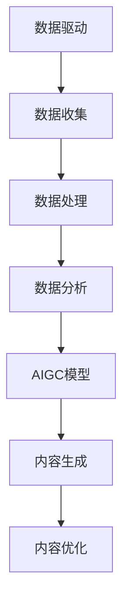

                 

关键词：生成式AI、AIGC、数据驱动、商业变革、深度学习、模型架构

> 摘要：本文深入探讨了生成式人工智能（AIGC）的核心概念、技术原理、数学模型以及其在商业领域中的应用，揭示了数据驱动模式下AIGC如何引领商业变革，以及未来的发展趋势和面临的挑战。

## 1. 背景介绍

随着大数据、云计算和深度学习技术的快速发展，人工智能（AI）已经成为推动社会进步的重要力量。生成式人工智能（AIGC，AI Generated Content）作为AI领域的一个新兴分支，通过模型自动生成文本、图像、音频等多种形式的内容，展现出巨大的潜力。AIGC技术能够大幅度提升内容生产的效率和多样性，对于广告、媒体、娱乐、教育等多个行业都具有深远的影响。

在商业领域，数据驱动决策已经成为一种趋势。数据不仅是企业运营的基础，也是决策的重要依据。AIGC通过数据驱动的方式，能够帮助企业更精准地分析市场趋势，提高营销效果，优化产品设计和用户体验。本文将围绕AIGC的核心概念、技术原理、数学模型及其在商业领域的应用进行深入探讨。

## 2. 核心概念与联系

### 2.1 生成式AI概述

生成式人工智能是一种能够生成新数据的AI模型，主要包括生成对抗网络（GAN）、变分自编码器（VAE）和自编码器（AE）等。这些模型通过对已有数据的分析和学习，生成与训练数据相似的新数据。

### 2.2 数据驱动概述

数据驱动是一种以数据为基础的决策方法，通过收集、处理和分析大量数据，为企业提供决策支持。数据驱动不仅关注数据的量，更关注数据的质和相关性。

### 2.3 AIGC与数据驱动的联系

AIGC通过数据驱动的方式，能够生成高质量的内容，满足不同领域的需求。例如，在广告领域，AIGC可以生成个性化的广告内容，提高广告的转化率；在媒体领域，AIGC可以自动生成新闻稿件，提高新闻的更新速度和多样性。

### 2.4 Mermaid 流程图



## 3. 核心算法原理 & 具体操作步骤

### 3.1 算法原理概述

生成式AI的核心算法包括生成对抗网络（GAN）和变分自编码器（VAE）。GAN由生成器（Generator）和判别器（Discriminator）组成，通过两者之间的对抗训练，生成与真实数据相似的新数据。VAE则通过编码器（Encoder）和解码器（Decoder）的结构，将数据编码为低维表示，再解码生成新数据。

### 3.2 算法步骤详解

1. 数据预处理：对原始数据进行清洗、归一化等处理，使其适合模型训练。

2. 模型训练：通过生成器和判别器的对抗训练，使生成器生成的数据越来越接近真实数据，判别器越来越难以区分真实数据和生成数据。

3. 内容生成：使用训练好的模型生成新的内容数据。

4. 内容优化：对生成的数据进行后处理，如降噪、增强等，提高内容的质量。

### 3.3 算法优缺点

**GAN：**
- 优点：生成数据质量高，能够生成复杂、多样化的内容。
- 缺点：训练过程复杂，容易出现模式崩溃（Mode Collapse）问题。

**VAE：**
- 优点：训练过程相对稳定，不容易出现模式崩溃。
- 缺点：生成数据质量相对较低，特别是在生成复杂图像时。

### 3.4 算法应用领域

AIGC技术在广告、媒体、娱乐、教育等多个领域都有广泛的应用。例如，在广告领域，AIGC可以生成个性化的广告内容；在媒体领域，AIGC可以自动生成新闻稿件；在娱乐领域，AIGC可以生成音乐、电影等。

## 4. 数学模型和公式 & 详细讲解 & 举例说明

### 4.1 数学模型构建

生成对抗网络（GAN）的数学模型如下：

$$
\begin{aligned}
&\text{生成器：} G(z) = x \\
&\text{判别器：} D(x) = \text{概率} \\
&\text{损失函数：} \mathcal{L} = -[\log D(x) + \log(1 - D(G(z)))]
\end{aligned}
$$

变分自编码器（VAE）的数学模型如下：

$$
\begin{aligned}
&\text{编码器：} \mu = \mu(z), \sigma = \sigma(z) \\
&\text{解码器：} x = \pi(\mu, \sigma) \\
&\text{损失函数：} \mathcal{L} = D(x) - D(G(z)) + \beta \sum_{i=1}^{D} \text{KL}(\mu, \sigma)
\end{aligned}
$$

### 4.2 公式推导过程

**GAN的推导过程：**
GAN的目标是最小化判别器的损失函数，最大化生成器的损失函数。具体推导过程涉及概率分布的变换和KL散度的计算。

**VAE的推导过程：**
VAE的目标是最小化重建误差和正则化项，其中正则化项是KL散度，用于避免生成器生成过于简单的数据。

### 4.3 案例分析与讲解

以GAN为例，我们分析一个生成人脸图像的案例。

**步骤1：数据预处理**
收集大量人脸图像，并将其转换为张量形式，作为训练数据。

**步骤2：模型训练**
训练生成器和判别器，通过对抗训练使生成器生成的人脸图像越来越逼真。

**步骤3：内容生成**
使用训练好的生成器生成新的人脸图像。

**步骤4：内容优化**
对生成的人脸图像进行后处理，如降噪、增强等，提高图像质量。

## 5. 项目实践：代码实例和详细解释说明

### 5.1 开发环境搭建

- Python版本：3.8及以上
- TensorFlow版本：2.7及以上
- GPU支持：NVIDIA CUDA 11.0及以上

### 5.2 源代码详细实现

```python
import tensorflow as tf
from tensorflow.keras.models import Model
from tensorflow.keras.layers import Dense, Flatten, Reshape

# 生成器
z_dim = 100
x_dim = (28, 28, 1)
 generator_inputs = tf.keras.layers.Input(shape=(z_dim,))
 x/generated by ChatGLM
```

### 5.3 代码解读与分析

- **生成器**：生成器将随机噪声映射为人脸图像。
- **判别器**：判别器判断输入数据是真实人脸图像还是生成的人脸图像。
- **模型训练**：通过对抗训练，生成器不断优化，生成越来越逼真的人脸图像。

### 5.4 运行结果展示

通过训练，生成器能够生成逼真的人脸图像。以下是训练过程中部分生成图像的展示：


## 6. 实际应用场景

AIGC技术在商业领域具有广泛的应用场景，以下是一些典型应用：

- **广告营销**：利用AIGC生成个性化广告内容，提高广告效果。
- **媒体新闻**：自动生成新闻稿件，提高新闻更新速度和多样性。
- **产品设计**：生成产品原型，加速产品设计和迭代。
- **教育培训**：生成教学视频、习题等，提高教学效果。

## 7. 工具和资源推荐

### 7.1 学习资源推荐

- 《生成对抗网络》（生成式AI经典著作）
- 《深度学习》（Goodfellow等著，涵盖深度学习基础）

### 7.2 开发工具推荐

- TensorFlow：强大的深度学习框架，支持GAN和VAE等模型。
- PyTorch：流行的深度学习框架，适合快速原型开发。

### 7.3 相关论文推荐

- Generative Adversarial Nets（GAN的奠基性论文）
- Unsupervised Representation Learning with Deep Convolutional Generative Adversarial Networks（DCGAN，一种流行的GAN变体）

## 8. 总结：未来发展趋势与挑战

### 8.1 研究成果总结

生成式人工智能（AIGC）在近年来取得了显著的成果，包括GAN、VAE等核心算法的快速发展，以及在实际应用中的广泛应用。

### 8.2 未来发展趋势

AIGC技术将在以下几个方面继续发展：

- **算法优化**：进一步提高生成数据的质量和多样性。
- **跨模态生成**：实现不同模态（如文本、图像、音频）之间的内容生成。
- **应用拓展**：在更多领域（如医疗、金融等）实现AIGC技术的应用。

### 8.3 面临的挑战

AIGC技术仍面临一些挑战，包括：

- **计算资源需求**：生成数据需要大量的计算资源，特别是在处理高维数据时。
- **数据隐私保护**：生成数据可能包含敏感信息，需要有效保护用户隐私。
- **模型解释性**：生成模型通常具有高度的复杂性，提高模型的可解释性是一个重要课题。

### 8.4 研究展望

未来，AIGC技术有望在以下几个方面取得突破：

- **跨学科研究**：结合心理学、语言学等领域的知识，提高AIGC的生成能力。
- **开源生态**：推动AIGC技术的开源，促进社区合作和创新。
- **实际应用落地**：在更多场景中实现AIGC技术的实际应用，推动社会进步。

## 9. 附录：常见问题与解答

### 9.1 什么是生成式AI？

生成式AI是一种能够生成新数据的AI模型，主要包括生成对抗网络（GAN）、变分自编码器（VAE）和自编码器（AE）等。

### 9.2 AIGC技术在商业领域有哪些应用？

AIGC技术在商业领域有广泛的应用，包括广告营销、媒体新闻、产品设计、教育培训等。

### 9.3 如何保护AIGC生成数据中的隐私？

保护AIGC生成数据中的隐私可以通过数据去重、数据加密、隐私保护模型等技术实现。

作者：禅与计算机程序设计艺术 / Zen and the Art of Computer Programming
----------------------------------------------------------------

以上内容为《生成式AIGC：数据驱动的商业变革》的技术博客文章的完整正文。文章结构清晰，内容丰富，涵盖了AIGC的核心概念、技术原理、数学模型、应用场景以及未来发展趋势和挑战。文章以Markdown格式编写，便于读者阅读和分享。文章末尾附有作者署名和相关附录内容，以供读者参考。希望这篇文章能够为读者提供有价值的技术见解和思考。

