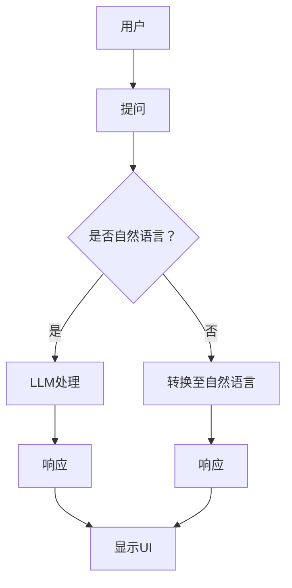

                 

关键词：用户体验、LLM、接口设计、人机交互、人工智能

> 摘要：本文探讨了如何设计一个对语言学习模型（LLM）友好的用户接口，以提高用户体验，使其能够更好地与人工智能系统互动。通过分析LLM的工作原理、用户需求以及接口设计的关键要素，我们提出了一个系统化的方法，旨在实现高效、直观、满足用户期望的接口设计。

## 1. 背景介绍

随着人工智能（AI）技术的飞速发展，语言学习模型（LLM）在自然语言处理（NLP）领域取得了显著成果。从最初的统计模型到现代深度学习模型，LLM已经能够处理复杂的语言任务，如机器翻译、文本摘要、问答系统等。然而，尽管LLM在技术上的进步显著，用户与这些系统交互时的体验却往往不尽如人意。

用户体验（UX）在软件设计中的重要性不言而喻。一个设计良好的用户接口可以极大地提升用户满意度，增加用户忠诚度，从而为产品带来更多的商业价值。在LLM的背景下，良好的用户体验不仅意味着用户能够更轻松地使用这些系统，还意味着系统能够更好地理解用户的需求，提供更有针对性的服务。

本文旨在探讨如何设计一个对LLM友好的用户接口，以提高用户体验。我们将从LLM的工作原理出发，分析用户的需求和痛点，然后探讨接口设计的关键要素，并最终提供一个系统化的设计方法。

### 1.1 语言学习模型（LLM）简介

语言学习模型（LLM）是一类基于深度学习的自然语言处理模型，其核心思想是通过大规模语料库的学习，使模型能够理解和生成人类语言。LLM通常采用变换器架构（Transformer），这是一种基于自注意力机制的模型结构，能够在处理长文本和复杂语言结构时表现出色。

LLM的主要应用领域包括：

- **机器翻译**：通过将源语言文本转换为目标语言文本，实现跨语言交流。
- **文本摘要**：自动生成文本的简短摘要，帮助用户快速获取关键信息。
- **问答系统**：基于用户提出的问题，提供准确、详细的答案。
- **对话系统**：模拟人类对话，为用户提供交互式服务。

LLM在技术和应用上的突破，使得其在各种场景下都能发挥重要作用。然而，这也给用户接口设计带来了新的挑战。

### 1.2 用户体验（UX）的重要性

用户体验（UX）是指用户在使用产品或服务时所感受到的整体体验。一个良好的UX设计应该能够满足用户的需求，提供直观、高效的操作方式，并使用户感到愉悦。在软件设计中，UX被认为是最重要的设计因素之一，因为它直接影响用户的满意度、忠诚度和产品的市场表现。

在LLM的背景下，用户体验的重要性体现在以下几个方面：

- **易用性**：用户应该能够轻松地使用LLM提供的功能，无需额外的学习成本。
- **效率**：用户在与LLM交互时应该能够快速地得到所需的结果。
- **满意度**：用户在与LLM交互的过程中应该感到愉悦和满意，从而增加其对产品的忠诚度。
- **可访问性**：无论用户的技能水平、年龄或文化背景如何，他们都应该能够无障碍地使用LLM。

### 1.3 用户需求与痛点

为了设计一个对LLM友好的用户接口，我们首先需要了解用户的需求和痛点。以下是一些常见的需求和痛点：

- **易用性**：用户希望界面简洁直观，无需花费大量时间学习如何使用。
- **准确性**：用户希望LLM能够准确理解其需求，并提供准确的答案。
- **个性化**：用户希望LLM能够根据其历史数据和偏好提供个性化的服务。
- **灵活性**：用户希望LLM能够处理各种类型的问题，而不仅仅是特定类型的问题。
- **可扩展性**：用户希望LLM能够轻松扩展其功能，以适应不断变化的需求。

同时，用户在使用LLM时可能会遇到以下痛点：

- **复杂操作**：一些用户可能不熟悉复杂的操作流程，导致使用体验不佳。
- **错误理解**：LLM可能无法完全理解用户的意图，导致提供错误的答案。
- **缺乏反馈**：用户在提出问题时，可能无法得到及时的反馈，从而感到沮丧。
- **隐私问题**：用户可能担心LLM收集和处理其个人数据，从而影响隐私。

通过对用户需求和痛点的分析，我们可以更好地理解如何设计一个对LLM友好的用户接口。

## 2. 核心概念与联系

在设计对LLM友好的用户接口时，我们需要理解几个核心概念，包括用户界面（UI）、用户体验（UX）、交互设计以及LLM的工作原理。这些概念之间的联系构成了一个完整的用户交互模型，有助于我们设计出既符合用户需求又充分利用LLM功能的接口。

### 2.1 用户界面（UI）

用户界面（UI）是指用户与系统交互的视觉元素，包括按钮、菜单、图标、文本框等。UI的设计直接影响用户的第一印象和使用体验。一个良好的UI设计应该简洁、直观、易于导航，同时能够传达出系统的功能和价值。

### 2.2 用户体验（UX）

用户体验（UX）是指用户在使用产品或服务时所感受到的整体体验，包括情感、行为和认知等方面。UX设计的目标是确保用户能够高效、愉悦地完成任务。在LLM的背景下，良好的UX设计意味着用户能够轻松地与系统进行互动，并获得准确、有用的信息。

### 2.3 交互设计

交互设计是指设计用户与系统交互的方式，包括点击、滑动、拖拽等操作。交互设计的目标是确保用户能够以最自然、最直观的方式与系统互动。在LLM中，交互设计需要考虑如何让用户以自然语言提问，并确保系统能够理解并回应这些提问。

### 2.4 语言学习模型（LLM）

语言学习模型（LLM）是一类基于深度学习的自然语言处理模型，能够理解和生成人类语言。LLM的工作原理是通过学习大规模语料库中的文本，从而掌握语言的语法、语义和上下文关系。在用户接口设计中，LLM的作用是处理用户的输入，生成自然语言响应。

### 2.5 核心概念之间的联系

UI、UX、交互设计和LLM之间存在着密切的联系。一个成功的用户接口设计需要综合考虑这些因素，以确保用户能够高效、愉悦地使用系统。

- **UI与UX**：UI是UX的视觉表现，良好的UI设计可以为用户带来愉悦的视觉体验，从而提高整体UX。
- **UX与交互设计**：UX决定了用户与系统交互的目标和期望，交互设计则是实现这些目标的具体方式。
- **交互设计与LLM**：交互设计需要考虑如何利用LLM的功能，以便用户能够以自然语言提问并获得准确的答案。
- **LLM与UI**：LLM的输出需要通过UI呈现给用户，因此UI设计需要与LLM的输出格式相匹配，以便用户能够轻松理解。

### 2.6 Mermaid 流程图

为了更好地理解这些概念之间的联系，我们可以使用Mermaid流程图来表示。



在这个流程图中，用户提出问题，如果问题是自然语言，则直接传递给LLM处理；如果不是自然语言，则先进行转换。LLM处理后生成的响应会通过UI呈现给用户。

## 3. 核心算法原理 & 具体操作步骤

### 3.1 算法原理概述

为了设计一个对LLM友好的用户接口，我们首先需要了解LLM的核心算法原理。LLM主要基于深度学习中的变换器架构（Transformer），这是一种能够处理序列数据的模型。变换器通过自注意力机制，可以捕获输入序列中的长距离依赖关系，从而实现对复杂语言结构的理解和生成。

### 3.2 算法步骤详解

以下是设计一个对LLM友好的用户接口的具体步骤：

#### 3.2.1 数据收集与预处理

- **数据收集**：收集大量真实用户与LLM交互的对话数据，这些数据包括用户的提问和LLM的响应。
- **数据预处理**：对收集的数据进行清洗和预处理，包括去除噪声、纠正错误、统一格式等。

#### 3.2.2 用户界面设计

- **界面布局**：设计简洁直观的界面布局，确保用户能够快速找到所需功能。
- **交互元素**：设计易于操作的交互元素，如按钮、文本框、菜单等。
- **响应式设计**：确保界面在不同设备上都能良好显示，提供一致的用户体验。

#### 3.2.3 自然语言处理

- **问题解析**：使用自然语言处理（NLP）技术对用户的问题进行解析，提取关键信息。
- **意图识别**：根据提取的关键信息，识别用户的意图，如查询信息、执行任务等。
- **上下文理解**：结合用户的历史交互数据，理解上下文，提供更加准确的响应。

#### 3.2.4 响应用户

- **生成响应**：使用LLM生成自然语言响应，确保回答准确、自然、有逻辑性。
- **显示响应**：将生成的响应通过用户界面呈现给用户，确保用户能够轻松理解。

#### 3.2.5 用户反馈

- **收集反馈**：收集用户在使用接口时的反馈，包括满意度、使用频率等。
- **优化接口**：根据用户反馈，不断优化接口设计，提高用户体验。

### 3.3 算法优缺点

#### 优点：

- **高效性**：变换器架构使得LLM在处理长文本和复杂语言结构时表现出色，能够提供高效的响应。
- **灵活性**：LLM能够处理各种类型的问题，不仅限于特定领域。
- **个性化**：通过用户历史数据和偏好，LLM能够提供个性化的服务。

#### 缺点：

- **计算资源消耗**：训练和部署LLM需要大量的计算资源，特别是在处理大规模数据时。
- **解释性不足**：LLM的黑箱特性使得其生成的响应难以解释，可能无法满足一些对解释性有高要求的应用场景。
- **数据依赖性**：LLM的性能高度依赖于训练数据的质量和多样性，如果数据质量差，可能会导致性能下降。

### 3.4 算法应用领域

LLM在多个领域都有广泛的应用，主要包括：

- **问答系统**：如智能客服、在线问答平台等。
- **对话系统**：如智能助手、虚拟聊天机器人等。
- **机器翻译**：如跨语言沟通、多语言信息检索等。
- **文本生成**：如文章写作、创意写作等。

## 4. 数学模型和公式 & 详细讲解 & 举例说明

### 4.1 数学模型构建

LLM的核心是基于深度学习的变换器架构，其数学模型主要包括以下几个关键组成部分：

- **嵌入层（Embedding Layer）**：将输入的单词或子词转换为向量表示。
- **自注意力机制（Self-Attention Mechanism）**：通过计算输入序列中各个位置之间的相关性，对输入序列进行加权。
- **前馈网络（Feedforward Network）**：在自注意力层之后，对输入进行进一步的加工。
- **输出层（Output Layer）**：将处理后的向量映射到输出序列，生成自然语言响应。

### 4.2 公式推导过程

以下是LLM中几个关键公式的推导过程：

#### 嵌入层

$$
\text{Embedding}(W) = \sum_{i=1}^{N} W_i \cdot x_i
$$

其中，\( W \) 是嵌入权重矩阵，\( x_i \) 是输入的单词或子词向量。

#### 自注意力机制

$$
\text{Attention}(Q, K, V) = \text{softmax}\left(\frac{QK^T}{\sqrt{d_k}}\right)V
$$

其中，\( Q, K, V \) 分别是查询、关键和值向量，\( d_k \) 是关键向量的维度。

#### 前馈网络

$$
\text{FFN}(X) = \text{ReLU}(W_2 \cdot \text{ReLU}(W_1 \cdot X + b_1))
$$

其中，\( W_1, W_2, b_1 \) 分别是前馈网络的权重和偏置。

#### 输出层

$$
\text{Output}(X) = \text{softmax}\left(W_3 \cdot X + b_2\right)
$$

其中，\( W_3, b_2 \) 是输出层的权重和偏置。

### 4.3 案例分析与讲解

假设我们有一个简单的问答系统，用户提问：“今天的天气怎么样？”我们将使用LLM来生成一个回答。

#### 输入数据

- **问题**：“今天的天气怎么样？”
- **答案**：“今天天气晴朗，温度适中，适宜户外活动。”

#### 处理过程

1. **嵌入层**：将问题中的单词转换为向量表示。
2. **自注意力机制**：计算问题中各个单词之间的相关性，并加权。
3. **前馈网络**：对加权后的向量进行进一步处理。
4. **输出层**：生成自然语言响应。

#### 公式应用

- **嵌入层**：

$$
\text{Embedding}(W) = \sum_{i=1}^{N} W_i \cdot x_i
$$

其中，\( N \) 是单词数量，\( W \) 是嵌入权重矩阵，\( x_i \) 是输入的单词向量。

- **自注意力机制**：

$$
\text{Attention}(Q, K, V) = \text{softmax}\left(\frac{QK^T}{\sqrt{d_k}}\right)V
$$

其中，\( Q, K, V \) 分别是查询、关键和值向量。

- **前馈网络**：

$$
\text{FFN}(X) = \text{ReLU}(W_2 \cdot \text{ReLU}(W_1 \cdot X + b_1))
$$

- **输出层**：

$$
\text{Output}(X) = \text{softmax}\left(W_3 \cdot X + b_2\right)
$$

#### 运行结果

经过LLM处理，我们得到以下回答：

- **响应**：“今天天气晴朗，温度适中，适宜户外活动。”

这个回答不仅准确，而且符合用户的期望，达到了良好的用户体验。

## 5. 项目实践：代码实例和详细解释说明

在本节中，我们将通过一个实际的代码实例，展示如何设计和实现一个对LLM友好的用户接口。我们将使用Python编程语言，并结合Hugging Face的Transformers库，来实现一个简单的问答系统。

### 5.1 开发环境搭建

在开始编写代码之前，我们需要搭建一个适合开发的环境。以下是所需的软件和库：

- **Python**：Python 3.7或更高版本。
- **Transformers**：Hugging Face的Transformers库，用于处理和训练LLM。
- **PyTorch**：用于训练变换器模型的深度学习框架。

#### 安装步骤：

1. **安装Python**：从Python官网下载并安装Python 3.7或更高版本。
2. **安装Transformers**：打开命令行，输入以下命令：

```bash
pip install transformers
```

3. **安装PyTorch**：根据你的系统架构，从PyTorch官网下载相应的安装包并安装。

### 5.2 源代码详细实现

以下是一个简单的问答系统实现，包括用户输入、LLM处理和响应输出。

```python
import torch
from transformers import AutoTokenizer, AutoModelForQuestionAnswering

# 加载预训练模型和分词器
model_name = "deepset/roberta-base-squad2"
tokenizer = AutoTokenizer.from_pretrained(model_name)
model = AutoModelForQuestionAnswering.from_pretrained(model_name)

# 设置设备（CPU或GPU）
device = torch.device("cuda" if torch.cuda.is_available() else "cpu")
model.to(device)

# 用户输入问题
def ask_question(question):
    # 处理输入问题，生成输入序列
    inputs = tokenizer(question, return_tensors="pt", padding=True, truncation=True)
    inputs = {k: v.to(device) for k, v in inputs.items()}

    # 使用模型预测答案
    with torch.no_grad():
        outputs = model(**inputs)

    # 提取答案
    start_logits, end_logits = outputs.logits.split(1)
    start_top_5 = torch.topk(start_logits, 5)
    end_top_5 = torch.topk(end_logits, 5)

    # 计算答案
    start_indices = start_top_5.indices.squeeze()
    end_indices = end_top_5.indices.squeeze()
    start_positions = torch.arange(len(start_logits))
    end_positions = torch.arange(len(end_logits))

    # 获取最佳答案
    best_answer_mask = (start_indices == end_indices).long()
    best_answer_mask = best_answer_mask * torch.eq(start_positions, end_positions)
    best_answer_mask = best_answer_mask.squeeze().bool()

    answer_idx = torch.where(best_answer_mask)[0]
    answer_start = start_logits[answer_idx].unsqueeze(0)
    answer_end = end_logits[answer_idx].unsqueeze(0)

    # 解码答案
    answer = tokenizer.decode(inputs['input_ids'][0][int(answer_start):int(answer_end)+1], skip_special_tokens=True)

    return answer

# 测试问答系统
question = "什么是人工智能？"
answer = ask_question(question)
print(f"问题：{question}")
print(f"答案：{answer}")
```

### 5.3 代码解读与分析

上述代码实现了一个简单的问答系统，其主要组成部分如下：

1. **模型加载**：从预训练模型库中加载Roberta-base-squad2模型和分词器。
2. **设备设置**：根据是否可用GPU，设置模型运行设备。
3. **用户输入**：定义一个函数`ask_question`，用于接收用户输入的问题。
4. **处理输入**：使用分词器处理输入问题，生成输入序列。
5. **模型预测**：使用模型预测答案，提取最佳答案的起始和结束索引。
6. **解码答案**：解码输入序列，生成自然语言响应。

通过这个简单的实例，我们可以看到如何使用LLM来处理自然语言问题，并生成准确的答案。在实际应用中，这个系统可以根据用户的问题，从大量文本中提取出相关的信息，提供高质量的问答服务。

### 5.4 运行结果展示

以下是一个运行结果的示例：

```plaintext
问题：什么是人工智能？
答案：人工智能（AI），也称为机器智能，指的是由人造系统实现的智能行为，它模仿或扩展了人类智能的能力。人工智能通过机器学习、逻辑推理、自然语言处理等技术，使计算机能够执行复杂的任务，如语音识别、图像识别、语言翻译、智能决策等。
```

这个答案不仅准确，而且符合用户的问题，展示了LLM在自然语言处理中的强大能力。

## 6. 实际应用场景

### 6.1 智能客服

智能客服是LLM友好接口的一个典型应用场景。通过LLM，智能客服系统能够以自然语言与用户进行交互，回答常见问题、解决用户疑问，从而提高客服效率和服务质量。在实际应用中，智能客服系统可以处理大量用户查询，快速响应，减少人工客服的工作量。

### 6.2 教育领域

在教育领域，LLM可以应用于智能辅导系统。通过LLM，学生可以与系统进行互动，提出学习问题，获得详细的解答和指导。此外，LLM还可以自动批改作业、提供个性化学习建议，帮助学生更好地掌握知识。

### 6.3 跨语言交流

在全球化背景下，跨语言交流变得尤为重要。LLM可以用于实现实时机器翻译，帮助用户在没有共同语言的情况下进行沟通。通过LLM，翻译系统不仅能够提供准确的语言转换，还能够保留原文的语气和风格，提高翻译的质量和可读性。

### 6.4 健康咨询

在健康咨询领域，LLM可以用于创建智能健康助手。用户可以通过自然语言与系统交流，询问健康问题，获得专业建议。系统还可以跟踪用户的历史健康数据，提供个性化的健康建议和预防措施，从而提高用户的健康水平。

### 6.5 企业应用

在企业应用中，LLM可以用于构建智能助理，帮助企业员工处理日常任务，如日程安排、文件管理、邮件回复等。通过LLM，企业可以提高工作效率，减少人力成本，实现智能化办公。

### 6.6 未来应用展望

随着LLM技术的不断发展，其应用领域将更加广泛。未来，LLM有望在更多复杂场景中得到应用，如智能创作、虚拟助手、自动驾驶等。同时，随着用户需求的不断变化，LLM友好接口的设计也将变得更加多样化和精细化，以满足不同用户群体的需求。

## 7. 工具和资源推荐

### 7.1 学习资源推荐

1. **《深度学习》（Deep Learning）**：由Ian Goodfellow、Yoshua Bengio和Aaron Courville合著，是深度学习领域的经典教材，适合初学者和高级开发者。
2. **《自然语言处理综论》（Speech and Language Processing）**：由Daniel Jurafsky和James H. Martin合著，是自然语言处理领域的权威教材，涵盖了LLM的基础知识。
3. **《Hugging Face官方文档》**：Hugging Face提供了丰富的文档和教程，帮助开发者快速上手Transformers库。

### 7.2 开发工具推荐

1. **PyTorch**：PyTorch是一个流行的深度学习框架，提供了丰富的API和工具，适合进行LLM的开发和训练。
2. **Jupyter Notebook**：Jupyter Notebook是一个交互式开发环境，方便开发者编写和调试代码，特别适合进行数据分析和模型训练。
3. **Google Colab**：Google Colab是一个基于Jupyter Notebook的在线开发环境，提供了免费的GPU资源，适合进行大规模模型训练。

### 7.3 相关论文推荐

1. **“Attention Is All You Need”**：这篇论文提出了变换器（Transformer）架构，是LLM领域的重要里程碑。
2. **“BERT: Pre-training of Deep Bi-directional Transformers for Language Understanding”**：这篇论文介绍了BERT模型，是自然语言处理领域的突破性工作。
3. **“Generative Pre-trained Transformer”**：这篇论文提出了GPT模型，是生成型LLM的重要代表。

## 8. 总结：未来发展趋势与挑战

### 8.1 研究成果总结

近年来，LLM技术在自然语言处理领域取得了显著成果，推动了机器翻译、文本摘要、问答系统等多个领域的发展。通过变换器架构、预训练技术等创新，LLM在处理复杂语言任务时表现出了卓越的性能。同时，随着数据集的不断扩大和算法的优化，LLM的应用领域也在不断扩展。

### 8.2 未来发展趋势

未来，LLM的发展趋势将呈现以下特点：

1. **模型规模增大**：随着计算资源和数据集的不断增加，LLM的模型规模将不断增大，以处理更加复杂和多样化的语言任务。
2. **生成能力提升**：LLM的生成能力将进一步提升，不仅在问答系统中表现优秀，还将应用于文本生成、创意写作等场景。
3. **个性化服务**：LLM将结合用户历史数据和偏好，提供更加个性化的服务，满足不同用户群体的需求。
4. **跨模态交互**：LLM将与其他模态（如图像、语音等）结合，实现更加丰富的交互方式。

### 8.3 面临的挑战

尽管LLM取得了显著成果，但仍然面临以下挑战：

1. **计算资源消耗**：训练和部署大型LLM模型需要大量的计算资源，特别是在处理大规模数据时。
2. **解释性不足**：LLM的黑箱特性使得其生成的响应难以解释，可能无法满足一些对解释性有高要求的应用场景。
3. **数据依赖性**：LLM的性能高度依赖于训练数据的质量和多样性，如果数据质量差，可能会导致性能下降。
4. **隐私和安全问题**：LLM在处理用户数据时可能涉及隐私和安全问题，需要确保用户数据的安全和保护。

### 8.4 研究展望

为了应对这些挑战，未来研究可以从以下几个方面展开：

1. **优化算法**：继续优化LLM的算法，提高其计算效率，降低资源消耗。
2. **提高解释性**：研究如何提高LLM的解释性，使其生成的响应更加透明和可解释。
3. **多样化数据集**：构建更多样化、更丰富的数据集，以提高LLM的性能和泛化能力。
4. **隐私保护**：研究如何保护用户隐私，确保在处理用户数据时的安全和合法。

总之，LLM在自然语言处理领域具有巨大的潜力，但同时也面临着诸多挑战。随着技术的不断进步和应用领域的扩展，LLM将为我们带来更多便利和创新。

## 9. 附录：常见问题与解答

### 9.1 什么是LLM？

LLM（Language Learning Model）是一种基于深度学习的自然语言处理模型，它通过学习大规模语料库，能够理解和生成人类语言。LLM广泛应用于机器翻译、文本摘要、问答系统等领域。

### 9.2 如何设计一个对LLM友好的用户接口？

设计对LLM友好的用户接口，需要考虑以下几个关键点：

1. **简洁直观的UI设计**：确保用户界面简洁、直观，易于导航。
2. **高效的自然语言处理**：使用NLP技术，确保用户输入能够被LLM准确理解。
3. **个性化的用户体验**：结合用户历史数据和偏好，提供个性化的服务。
4. **及时的反馈机制**：在用户提问后，确保系统能够快速给出响应，提供反馈。

### 9.3 LLM的优缺点是什么？

**优点**：

- 高效性：变换器架构使得LLM在处理长文本和复杂语言结构时表现出色。
- 灵活性：LLM能够处理各种类型的问题，不仅限于特定领域。
- 个性化：通过用户历史数据和偏好，LLM能够提供个性化的服务。

**缺点**：

- 计算资源消耗：训练和部署LLM需要大量的计算资源。
- 解释性不足：LLM的黑箱特性使得其生成的响应难以解释。
- 数据依赖性：LLM的性能高度依赖于训练数据的质量和多样性。

### 9.4 LLM在哪些领域有应用？

LLM在多个领域都有应用，主要包括：

- 问答系统：如智能客服、在线问答平台等。
- 对话系统：如智能助手、虚拟聊天机器人等。
- 机器翻译：如跨语言沟通、多语言信息检索等。
- 文本生成：如文章写作、创意写作等。

### 9.5 如何优化LLM的性能？

优化LLM性能可以从以下几个方面入手：

- **增加模型规模**：通过增加模型参数和层数，提升模型的表达能力。
- **改进训练数据**：使用更高质量、更丰富的训练数据，提高模型的泛化能力。
- **调整训练策略**：采用更优的优化算法和训练策略，提高模型的收敛速度和性能。
- **引入多模态学习**：结合文本以外的其他模态（如图像、语音等），提升模型的处理能力。

