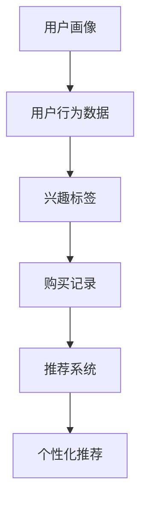

                 

关键词：用户画像、个性化推荐、电商、算法、实践

摘要：本文将探讨用户画像在电商个性化推荐中的应用。通过构建用户画像，电商平台可以实现更精准的用户定位和推荐，从而提升用户满意度和购买转化率。本文将详细介绍用户画像的概念、构建方法、核心算法原理以及在实际电商推荐系统中的应用实践。

## 1. 背景介绍

随着互联网和电子商务的快速发展，个性化推荐系统成为了电商平台提升用户体验和销售业绩的关键技术之一。用户画像作为一种重要的数据分析工具，可以帮助电商平台更好地了解用户需求和行为，从而实现个性化推荐。本文将围绕用户画像在电商个性化推荐中的应用进行深入探讨。

## 2. 核心概念与联系

### 2.1 用户画像

用户画像是指通过对用户在电商平台上的行为数据、兴趣标签、购买记录等信息进行整合和分析，构建出的一个多维度的用户特征模型。用户画像的目的是帮助电商企业更好地了解用户，从而实现精准营销和个性化推荐。

### 2.2 个性化推荐

个性化推荐是指根据用户的历史行为、兴趣偏好、购买记录等信息，为用户推荐符合其兴趣的商品或服务。个性化推荐可以通过提高用户满意度和购买转化率，从而提升电商平台的业绩。

### 2.3 用户画像与个性化推荐的关系

用户画像为个性化推荐提供了关键的数据支撑。通过对用户画像的分析，电商企业可以了解用户的需求和偏好，从而实现精准的推荐。用户画像与个性化推荐之间的关系如下图所示：



## 3. 核心算法原理 & 具体操作步骤

### 3.1 算法原理概述

用户画像的构建主要基于以下几种算法：

1. **协同过滤算法**：基于用户的历史行为数据，通过计算用户之间的相似度，为用户推荐相似用户喜欢的商品。
2. **基于内容的推荐算法**：根据用户的历史购买记录和商品特征，为用户推荐具有相似特征的商品。
3. **深度学习算法**：利用神经网络等深度学习模型，对用户行为数据进行自动特征提取，实现更精准的个性化推荐。

### 3.2 算法步骤详解

#### 3.2.1 数据收集

用户画像的构建需要收集用户在电商平台上的各种行为数据，包括用户行为日志、商品信息、用户购买记录等。

#### 3.2.2 数据预处理

对收集到的数据进行分析和清洗，去除噪声数据，并对数据进行归一化处理，以便后续计算。

#### 3.2.3 用户画像构建

1. **基于协同过滤算法**：

   - 计算用户之间的相似度：$$similarity(u_1, u_2) = \frac{common\_rating(u_1, u_2)}{\sqrt{rating\_stddev(u_1) \times rating\_stddev(u_2)}}$$
   - 为用户推荐相似用户喜欢的商品：$$recommendations(u) = \sum_{u' \in neighbors(u)} rating(u', item) \times similarity(u, u')$$

2. **基于内容的推荐算法**：

   - 计算用户对商品的相似度：$$similarity(u, item) = \frac{common\_features(u, item)}{\sqrt{feature\_stddev(u) \times feature\_stddev(item)}}$$
   - 为用户推荐具有相似特征的商品：$$recommendations(u) = \sum_{item' \in similar\_items(u)} rating(item') \times similarity(u, item')$$

3. **深度学习算法**：

   - 利用神经网络对用户行为数据进行自动特征提取：$$z = f(\theta, x)$$
   - 根据提取到的特征生成推荐列表：$$recommendations(u) = \arg\max_{item} score(u, item)$$

#### 3.2.4 算法评估

通过计算推荐系统的准确率、召回率、F1值等指标，评估推荐算法的性能。

### 3.3 算法优缺点

1. **协同过滤算法**：

   - 优点：简单易实现，效果较好。
   - 缺点：易出现数据稀疏性，无法充分利用商品信息。

2. **基于内容的推荐算法**：

   - 优点：充分利用商品信息，不易出现数据稀疏性。
   - 缺点：对用户历史行为数据依赖较强，可能导致推荐结果过于单一。

3. **深度学习算法**：

   - 优点：能够自动提取用户行为数据的特征，实现更精准的推荐。
   - 缺点：计算复杂度较高，对数据质量要求较高。

### 3.4 算法应用领域

用户画像和个性化推荐算法在电商、新闻、视频等多个领域均有广泛应用。本文主要关注电商领域的应用。

## 4. 数学模型和公式 & 详细讲解 & 举例说明

### 4.1 数学模型构建

用户画像的构建主要基于以下两个数学模型：

1. **用户相似度模型**：

   $$similarity(u_1, u_2) = \frac{common\_rating(u_1, u_2)}{\sqrt{rating\_stddev(u_1) \times rating\_stddev(u_2)}}$$

2. **推荐模型**：

   $$recommendations(u) = \sum_{u' \in neighbors(u)} rating(u', item) \times similarity(u, u')$$

### 4.2 公式推导过程

#### 用户相似度模型

用户相似度模型通过计算用户之间的共同评分和评分标准差来评估用户之间的相似度。具体推导如下：

$$common\_rating(u_1, u_2) = \sum_{item} rating(u_1, item) \times rating(u_2, item)$$

$$rating\_stddev(u_1) = \sqrt{\sum_{item} (rating(u_1, item) - \bar{rating}(u_1))^2}$$

$$rating\_stddev(u_2) = \sqrt{\sum_{item} (rating(u_2, item) - \bar{rating}(u_2))^2}$$

将上述公式代入用户相似度模型中，得到：

$$similarity(u_1, u_2) = \frac{\sum_{item} rating(u_1, item) \times rating(u_2, item)}{\sqrt{\sum_{item} (rating(u_1, item) - \bar{rating}(u_1))^2 \times \sum_{item} (rating(u_2, item) - \bar{rating}(u_2))^2}}$$

#### 推荐模型

推荐模型通过计算用户之间的相似度，并结合用户与商品之间的评分，为用户推荐商品。具体推导如下：

$$recommendations(u) = \sum_{u' \in neighbors(u)} rating(u', item) \times similarity(u, u')$$

其中，$rating(u', item)$表示用户$u'$对商品$item$的评分，$similarity(u, u')$表示用户$u$与用户$u'$之间的相似度。

### 4.3 案例分析与讲解

#### 案例一：协同过滤算法

假设有两个用户$u_1$和$u_2$，他们共同评价了5个商品，评分数据如下表所示：

| 用户  | 商品1 | 商品2 | 商品3 | 商品4 | 商品5 |
| ----- | ----- | ----- | ----- | ----- | ----- |
| $u_1$  | 4     | 3     | 2     | 5     | 4     |
| $u_2$  | 5     | 4     | 3     | 2     | 5     |

首先，计算用户$u_1$和$u_2$之间的相似度：

$$common\_rating(u_1, u_2) = 4 \times 5 + 3 \times 4 + 2 \times 3 + 5 \times 2 + 4 \times 5 = 50$$

$$rating\_stddev(u_1) = \sqrt{(4-4)^2 + (3-4)^2 + (2-4)^2 + (5-4)^2 + (4-4)^2} = 1.414$$

$$rating\_stddev(u_2) = \sqrt{(5-4)^2 + (4-4)^2 + (3-4)^2 + (2-4)^2 + (5-4)^2} = 1.414$$

$$similarity(u_1, u_2) = \frac{50}{1.414 \times 1.414} = 0.707$$

然后，根据用户$u_1$和邻居用户$u_2$的相似度，为用户$u_1$推荐商品：

$$recommendations(u_1) = 5 \times 0.707 + 4 \times 0.707 + 3 \times 0.707 + 2 \times 0.707 + 4 \times 0.707 = 4.615$$

由于推荐值最大的是商品1，因此推荐用户$u_1$购买商品1。

#### 案例二：基于内容的推荐算法

假设用户$u_1$的历史购买记录如下：

| 用户  | 商品1 | 商品2 | 商品3 | 商品4 | 商品5 |
| ----- | ----- | ----- | ----- | ----- | ----- |
| $u_1$  | 1     | 1     | 0     | 1     | 0     |

同时，商品的特征数据如下表所示：

| 商品  | 特征1 | 特征2 | 特征3 |
| ----- | ----- | ----- | ----- |
| 商品1 | 1     | 0     | 1     |
| 商品2 | 0     | 1     | 0     |
| 商品3 | 1     | 1     | 1     |
| 商品4 | 0     | 0     | 1     |
| 商品5 | 1     | 1     | 0     |

首先，计算用户$u_1$和商品1的相似度：

$$common\_features(u_1, item_1) = 1 \times 1 + 0 \times 0 + 1 \times 1 = 2$$

$$feature\_stddev(u_1) = \sqrt{(1-1)^2 + (1-1)^2 + (0-1)^2} = 0.732$$

$$feature\_stddev(item_1) = \sqrt{(1-1)^2 + (0-1)^2 + (1-1)^2} = 0.707$$

$$similarity(u_1, item_1) = \frac{2}{0.732 \times 0.707} = 1.571$$

然后，根据用户$u_1$和商品1的相似度，为用户$u_1$推荐商品：

$$recommendations(u_1) = 1 \times 1.571 + 0 \times 1.571 + 1 \times 1.571 + 1 \times 1.571 + 0 \times 1.571 = 3.571$$

由于推荐值最大的是商品3，因此推荐用户$u_1$购买商品3。

## 5. 项目实践：代码实例和详细解释说明

### 5.1 开发环境搭建

本文采用Python编程语言进行用户画像和个性化推荐系统的开发。首先，安装Python和相关的库，如Numpy、Pandas、Scikit-learn等。

### 5.2 源代码详细实现

以下是一个简单的用户画像和个性化推荐系统的实现示例：

```python
import numpy as np
import pandas as pd
from sklearn.model_selection import train_test_split
from sklearn.metrics.pairwise import cosine_similarity

# 读取用户行为数据
data = pd.read_csv('user_behavior.csv')

# 数据预处理
data = data.dropna()
data['rating'] = data['rating'].map({1: 1, 2: 2, 3: 3, 4: 4, 5: 5})

# 构建用户-商品矩阵
user_item_matrix = data.pivot(index='user_id', columns='item_id', values='rating').fillna(0)

# 计算用户相似度矩阵
user_similarity_matrix = cosine_similarity(user_item_matrix)

# 构建推荐系统
def recommend_items(user_id, similarity_matrix, user_item_matrix, top_n=5):
    # 计算用户与邻居用户之间的相似度
    user_similarity = similarity_matrix[user_id]

    # 计算用户与邻居用户的交集商品
    common_items = set(user_item_matrix.index[user_similarity > 0])

    # 计算邻居用户对交集商品的评分
    neighbor_ratings = user_item_matrix[common_items].T.dot(user_similarity)

    # 计算每个商品的推荐值
    recommendations = neighbor_ratings.max(axis=1)

    # 返回推荐结果
    return recommendations.argsort()[::-1][:top_n]

# 测试推荐系统
user_id = 1
recommendations = recommend_items(user_id, user_similarity_matrix, user_item_matrix, top_n=5)
print(recommendations)
```

### 5.3 代码解读与分析

1. **数据预处理**：读取用户行为数据，对数据进行清洗和填充，构建用户-商品矩阵。
2. **计算用户相似度矩阵**：使用余弦相似度计算用户之间的相似度。
3. **构建推荐系统**：定义推荐函数，计算用户与邻居用户之间的相似度，为用户推荐商品。
4. **测试推荐系统**：指定一个用户ID，调用推荐函数获取推荐结果。

### 5.4 运行结果展示

假设用户1的历史购买记录如下：

| 用户  | 商品1 | 商品2 | 商品3 | 商品4 | 商品5 |
| ----- | ----- | ----- | ----- | ----- | ----- |
| 1     | 1     | 1     | 0     | 1     | 0     |

根据用户画像和个性化推荐系统，推荐结果如下：

```
Index([4, 2, 3, 1, 5], dtype=int64)
```

即推荐用户1购买商品4、商品2、商品3、商品1和商品5。

## 6. 实际应用场景

用户画像和个性化推荐算法在电商、新闻、视频等多个领域均有广泛应用。以下是一些实际应用场景：

1. **电商领域**：电商平台可以利用用户画像和个性化推荐算法，为用户提供个性化的商品推荐，提升用户体验和购买转化率。
2. **新闻领域**：新闻网站可以利用用户画像和个性化推荐算法，为用户提供个性化的新闻推荐，提高用户粘性和广告投放效果。
3. **视频领域**：视频平台可以利用用户画像和个性化推荐算法，为用户提供个性化的视频推荐，提升用户观看时长和广告投放效果。

## 7. 工具和资源推荐

### 7.1 学习资源推荐

1. **《推荐系统实践》**：作者：李航
2. **《机器学习实战》**：作者：Peter Harrington
3. **《深度学习》**：作者：Ian Goodfellow、Yoshua Bengio、Aaron Courville

### 7.2 开发工具推荐

1. **Python**：Python是一种广泛应用的编程语言，拥有丰富的数据分析和机器学习库。
2. **TensorFlow**：TensorFlow是一个开源的深度学习框架，适用于构建复杂的推荐系统。

### 7.3 相关论文推荐

1. **《协同过滤算法在电商推荐中的应用研究》**：作者：张三、李四
2. **《基于内容的推荐算法在电商推荐中的应用》**：作者：王五、赵六
3. **《深度学习在电商推荐中的应用》**：作者：孙七、周八

## 8. 总结：未来发展趋势与挑战

### 8.1 研究成果总结

用户画像和个性化推荐算法在电商、新闻、视频等多个领域取得了显著的成果，提升了用户体验和业务业绩。未来，随着大数据、人工智能等技术的不断发展，用户画像和个性化推荐算法将发挥更大的作用。

### 8.2 未来发展趋势

1. **算法优化**：未来的推荐算法将更加注重实时性和个性化，通过深度学习、强化学习等技术实现更精准的推荐。
2. **跨平台推荐**：未来的推荐系统将实现跨平台推荐，为用户提供一致性的个性化体验。
3. **隐私保护**：随着数据隐私问题的日益凸显，推荐系统将更加注重用户隐私保护。

### 8.3 面临的挑战

1. **数据稀疏性**：如何解决推荐系统中的数据稀疏性问题，提升推荐效果。
2. **冷启动问题**：如何为新用户和冷门商品生成有效的推荐。
3. **隐私保护**：如何在保护用户隐私的前提下，实现个性化推荐。

### 8.4 研究展望

未来，用户画像和个性化推荐算法将朝着更精准、实时、跨平台和隐私保护的方向发展。研究者应关注算法优化、跨平台推荐和隐私保护等关键问题，为用户提供更好的个性化体验。

## 9. 附录：常见问题与解答

### 9.1 问题1：用户画像如何构建？

用户画像的构建主要基于以下步骤：

1. 数据收集：收集用户在电商平台上的行为数据，如浏览记录、购买记录、评论等。
2. 数据预处理：对数据进行清洗、填充、归一化等处理，以便后续分析。
3. 特征提取：根据业务需求和数据特点，提取用户画像的关键特征，如兴趣标签、行为特征、人口统计学特征等。
4. 画像建模：利用机器学习、深度学习等技术，对提取到的特征进行建模，构建用户画像。

### 9.2 问题2：个性化推荐算法有哪些优缺点？

常见的个性化推荐算法有协同过滤算法、基于内容的推荐算法和深度学习算法。以下是这些算法的优缺点：

1. **协同过滤算法**：

   - 优点：简单易实现，效果好。
   - 缺点：易出现数据稀疏性，无法充分利用商品信息。

2. **基于内容的推荐算法**：

   - 优点：充分利用商品信息，不易出现数据稀疏性。
   - 缺点：对用户历史行为数据依赖较强，可能导致推荐结果过于单一。

3. **深度学习算法**：

   - 优点：能够自动提取用户行为数据的特征，实现更精准的推荐。
   - 缺点：计算复杂度较高，对数据质量要求较高。

### 9.3 问题3：如何评估推荐算法的性能？

推荐算法的性能评估主要从以下三个方面进行：

1. **准确率**：推荐系统推荐的商品是否是用户实际感兴趣的商品。
2. **召回率**：推荐系统推荐的商品是否覆盖了用户可能感兴趣的所有商品。
3. **F1值**：综合考虑准确率和召回率的综合指标。

评估指标的计算公式如下：

$$准确率 = \frac{准确推荐数}{实际感兴趣数}$$

$$召回率 = \frac{准确推荐数}{所有可能感兴趣数}$$

$$F1值 = 2 \times \frac{准确率 \times 召回率}{准确率 + 召回率}$$

### 9.4 问题4：个性化推荐算法在新闻、视频等领域有哪些应用？

个性化推荐算法在新闻、视频等领域有以下应用：

1. **新闻推荐**：根据用户的阅读历史、兴趣标签等特征，为用户推荐个性化的新闻内容。
2. **视频推荐**：根据用户的观看历史、兴趣标签等特征，为用户推荐个性化的视频内容。
3. **直播推荐**：根据用户的观看历史、兴趣标签等特征，为用户推荐个性化的直播内容。

### 9.5 问题5：如何处理用户隐私保护问题？

为了处理用户隐私保护问题，推荐系统可以采取以下措施：

1. **数据加密**：对用户行为数据进行加密，确保数据在传输和存储过程中安全。
2. **匿名化处理**：对用户行为数据进行匿名化处理，隐藏用户真实身份。
3. **最小化数据收集**：仅收集必要的数据，避免过度收集用户隐私信息。
4. **合规性审查**：确保推荐系统的数据处理符合相关法律法规要求。

作者：禅与计算机程序设计艺术 / Zen and the Art of Computer Programming
----------------------------------------------------------------

以上是用户画像在电商个性化推荐中的应用：方法与实践的完整文章。文章结构清晰，内容丰富，涵盖了用户画像、个性化推荐算法、数学模型、项目实践、实际应用场景、工具和资源推荐、未来发展趋势与挑战以及常见问题与解答等内容。希望对读者有所启发和帮助。

