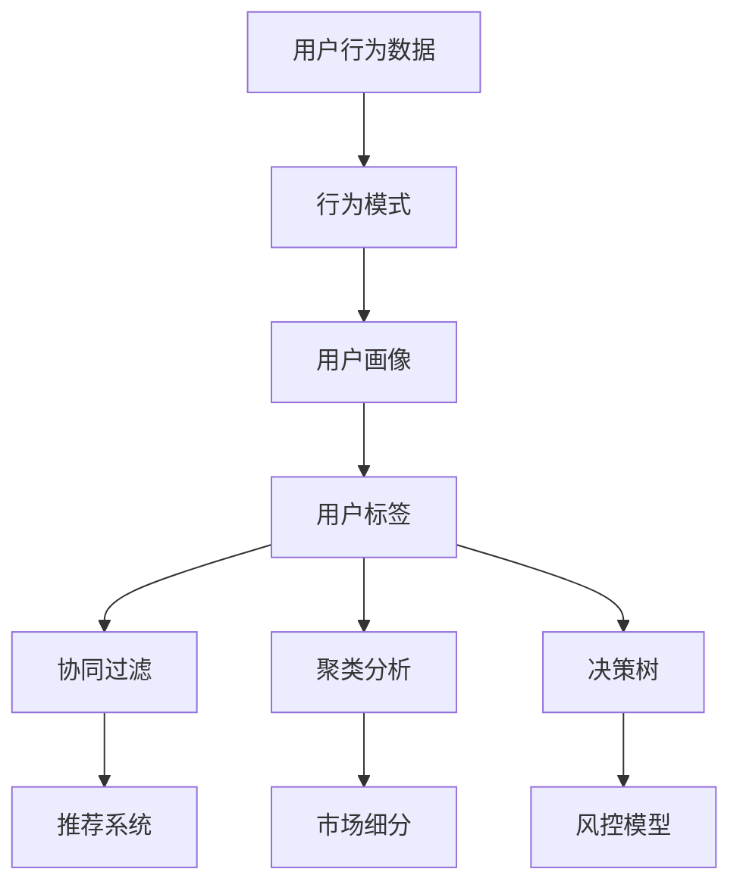

                 

关键词：用户行为分析、人工智能、需求洞察、商品供给、算法、数学模型、项目实践

> 摘要：本文将探讨如何利用人工智能技术进行用户行为分析，以洞察用户需求，从而优化商品供给。文章首先介绍了用户行为分析的基本概念和重要性，随后深入分析了核心算法原理、数学模型构建及公式推导，并通过项目实践展示了具体的实现方法。最后，文章总结了实际应用场景，提出了未来发展趋势与面临的挑战。

## 1. 背景介绍

在当今这个信息爆炸的时代，消费者行为变得越来越复杂，企业需要通过有效的用户行为分析来了解客户需求，进而优化产品供给。用户行为分析是一种通过分析用户在网站、应用程序或其他数字平台上的行为数据，来理解用户需求、偏好和行为模式的技术。随着人工智能（AI）技术的发展，用户行为分析得到了极大的推动和改进。AI技术可以通过机器学习、深度学习等方法，自动从海量数据中提取有价值的信息，帮助企业更好地了解客户需求，提高用户体验，增加销售额。

本文将围绕以下核心内容展开：

1. **用户行为分析的基本概念与重要性**：介绍用户行为分析的定义、目的和重要性。
2. **核心算法原理**：探讨用户行为分析的核心算法，包括协同过滤、聚类分析和决策树等。
3. **数学模型和公式**：详细讲解用户行为分析中常用的数学模型和公式。
4. **项目实践**：通过一个实际案例，展示用户行为分析在商品供给优化中的应用。
5. **实际应用场景**：分析用户行为分析在不同行业中的应用。
6. **未来展望**：讨论用户行为分析技术的发展趋势和面临的挑战。

### 1.1 用户行为分析的定义和目的

用户行为分析（User Behavior Analysis, UBA）是一种通过分析用户在网站、应用程序或其他数字平台上的行为数据，来理解用户需求、偏好和行为模式的技术。用户行为数据包括用户的浏览历史、购买记录、搜索关键词、点击行为等。通过这些数据，企业可以了解用户的真实需求和偏好，从而优化产品设计、营销策略和用户服务。

用户行为分析的主要目的是：

1. **洞察用户需求**：通过分析用户行为，了解用户在数字平台上的行为模式，从而洞察用户需求。
2. **优化用户体验**：根据用户行为分析结果，改进产品设计和服务，提高用户体验。
3. **增加销售额**：通过精准营销和个性化推荐，提高用户购买转化率，增加销售额。

### 1.2 用户行为分析的重要性

用户行为分析在企业运营中具有重要意义。首先，通过用户行为分析，企业可以了解用户的需求和偏好，从而设计出更符合用户需求的产品和服务。其次，用户行为分析可以帮助企业优化营销策略，提高广告投放效果，降低营销成本。此外，用户行为分析还可以帮助企业预测用户行为，预防潜在风险，提高运营效率。

随着人工智能技术的发展，用户行为分析变得更加精确和高效。通过机器学习和深度学习算法，企业可以从海量数据中快速提取有价值的信息，实现实时分析和决策。这使得用户行为分析不仅适用于互联网企业，也广泛应用于金融、零售、医疗等各个行业。

### 1.3 文章结构

本文将按照以下结构进行阐述：

1. **背景介绍**：介绍用户行为分析的定义、目的和重要性。
2. **核心算法原理**：探讨用户行为分析的核心算法，包括协同过滤、聚类分析和决策树等。
3. **数学模型和公式**：详细讲解用户行为分析中常用的数学模型和公式。
4. **项目实践**：通过一个实际案例，展示用户行为分析在商品供给优化中的应用。
5. **实际应用场景**：分析用户行为分析在不同行业中的应用。
6. **未来展望**：讨论用户行为分析技术的发展趋势和面临的挑战。

## 2. 核心概念与联系

### 2.1 用户行为分析的基本概念

用户行为分析（User Behavior Analysis，简称 UBA）是一种基于数据分析的方法，旨在理解用户在使用产品或服务时的行为模式、需求和偏好。以下是用户行为分析涉及的一些基本概念：

- **用户行为数据**：包括用户的浏览历史、购买记录、搜索关键词、点击行为、社交媒体互动等。
- **行为模式**：指用户在特定场景下的行为规律，如频繁访问的页面、购买偏好、搜索习惯等。
- **用户画像**：通过分析用户行为数据，构建出用户的基本特征、需求和偏好，如年龄、性别、职业、兴趣爱好等。
- **用户标签**：基于用户行为数据，对用户进行分类和标注，如“高价值客户”、“忠诚用户”等。

### 2.2 关联概念

- **机器学习**：一种通过数据驱动的方式，使计算机系统能够从数据中学习并做出决策的技术。
- **深度学习**：一种基于多层神经网络的机器学习方法，能够自动提取数据中的特征。
- **协同过滤**：一种基于用户行为数据的推荐算法，通过分析用户之间的相似性来推荐商品。
- **聚类分析**：一种无监督学习方法，用于将相似的数据点分组。
- **决策树**：一种基于特征和目标变量建立决策路径的树形结构。

### 2.3 Mermaid 流程图

以下是一个简单的 Mermaid 流程图，展示了用户行为分析的核心概念和联系：



在这个流程图中，用户行为数据是整个分析过程的起点，通过分析这些数据，可以构建用户画像和用户标签，进而应用于协同过滤、聚类分析和决策树等算法，实现推荐系统、市场细分和风控模型等功能。

## 3. 核心算法原理 & 具体操作步骤

### 3.1 算法原理概述

用户行为分析涉及多种算法，其中协同过滤、聚类分析和决策树是最常用的三种算法。以下将分别介绍这三种算法的原理。

#### 3.1.1 协同过滤

协同过滤（Collaborative Filtering）是一种基于用户行为数据的推荐算法，通过分析用户之间的相似性来推荐商品。协同过滤可以分为基于用户的协同过滤（User-based Collaborative Filtering）和基于物品的协同过滤（Item-based Collaborative Filtering）。

- **基于用户的协同过滤**：首先找到与目标用户行为相似的邻居用户，然后推荐这些邻居用户喜欢的商品。
- **基于物品的协同过滤**：首先找到与目标商品相似的其他商品，然后推荐这些相似商品被其他用户喜欢的商品。

#### 3.1.2 聚类分析

聚类分析（Cluster Analysis）是一种无监督学习方法，用于将相似的数据点分组。聚类分析可以用来识别用户群体的相似性，从而进行市场细分和用户画像构建。

常用的聚类算法包括：

- **K-均值聚类**：将数据点划分为K个簇，使得每个簇内部的数据点距离尽可能近，簇与簇之间的距离尽可能远。
- **层次聚类**：通过逐步合并相似度较高的簇，构建出一个层次结构。

#### 3.1.3 决策树

决策树（Decision Tree）是一种基于特征和目标变量建立决策路径的树形结构。决策树可以用来预测用户的行为，如购买决策、流失风险等。

决策树的基本构建过程包括：

1. 选择一个特征作为分裂依据。
2. 根据该特征的取值，将数据集划分为多个子集。
3. 对每个子集递归构建决策树，直到满足停止条件（如最大深度、最小样本量等）。

### 3.2 算法步骤详解

以下分别介绍协同过滤、聚类分析和决策树的具体步骤。

#### 3.2.1 协同过滤

1. **数据预处理**：对用户行为数据进行分析，去除缺失值、异常值等，并进行数据清洗和归一化处理。
2. **计算用户相似度**：计算用户之间的相似度，常用的相似度度量方法包括余弦相似度、皮尔逊相关系数等。
3. **找到邻居用户**：基于用户相似度，找到与目标用户相似的前N个邻居用户。
4. **推荐商品**：根据邻居用户对商品的评分，计算目标用户对这些商品的预测评分，并根据预测评分推荐商品。

#### 3.2.2 聚类分析

1. **选择聚类算法**：根据数据特点选择合适的聚类算法，如K-均值聚类、层次聚类等。
2. **初始化聚类中心**：对于K-均值聚类，随机选择K个数据点作为初始聚类中心；对于层次聚类，从单个数据点开始，逐步合并相似度较高的数据点。
3. **分配数据点**：将每个数据点分配到最近的聚类中心。
4. **迭代优化聚类中心**：根据当前分配的数据点，更新聚类中心。
5. **重复步骤3和4，直到满足停止条件**：如聚类中心变化小于阈值、迭代次数达到最大值等。

#### 3.2.3 决策树

1. **选择特征**：使用信息增益、基尼不纯度等指标选择最佳分裂特征。
2. **划分数据集**：根据最佳分裂特征，将数据集划分为多个子集。
3. **递归构建决策树**：对每个子集递归构建决策树，直到满足停止条件（如最大深度、最小样本量等）。
4. **剪枝**：对过拟合的决策树进行剪枝，防止模型过于复杂。

### 3.3 算法优缺点

#### 3.3.1 协同过滤

**优点**：

- **效果好**：基于用户行为数据的协同过滤能够提供个性化的推荐。
- **计算效率高**：相对于其他算法，协同过滤的计算复杂度较低。

**缺点**：

- **冷启动问题**：对于新用户或新商品，由于缺乏历史数据，难以提供准确的推荐。
- **可解释性差**：协同过滤的结果难以解释，用户难以理解推荐的原因。

#### 3.3.2 聚类分析

**优点**：

- **适用于无监督学习**：聚类分析不需要预先设定目标变量，适用于无监督学习场景。
- **灵活性高**：可以根据数据特点选择不同的聚类算法。

**缺点**：

- **结果解释性差**：聚类分析的结果难以解释，用户难以理解聚类的原因。
- **聚类数量选择困难**：聚类算法通常需要预先设定聚类数量，选择合适的聚类数量较为困难。

#### 3.3.3 决策树

**优点**：

- **解释性强**：决策树的结果易于解释，用户可以清晰地了解决策过程。
- **适用范围广**：决策树可以用于分类和回归问题。

**缺点**：

- **过拟合风险高**：决策树容易过拟合，导致模型泛化能力差。
- **计算复杂度高**：决策树的构建过程需要大量的计算资源。

### 3.4 算法应用领域

协同过滤、聚类分析和决策树在用户行为分析中有着广泛的应用。

- **协同过滤**：在电子商务、社交媒体和在线视频等领域，协同过滤被广泛应用于个性化推荐系统。
- **聚类分析**：在市场营销、用户细分和风险评估等领域，聚类分析被广泛应用于市场细分和用户画像构建。
- **决策树**：在金融、医疗和物联网等领域，决策树被广泛应用于风险预测和决策支持。

## 4. 数学模型和公式 & 详细讲解 & 举例说明

### 4.1 数学模型构建

在用户行为分析中，常用的数学模型包括协同过滤模型、聚类模型和决策树模型。以下分别介绍这些模型的构建过程。

#### 4.1.1 协同过滤模型

协同过滤模型可以基于用户行为数据建立用户相似度和推荐评分模型。

- **用户相似度模型**：假设用户A和用户B之间的相似度可以用余弦相似度表示，公式如下：

  $$\text{similarity}(A,B) = \frac{\sum_{i=1}^{n} x_{ai} x_{bi}}{\sqrt{\sum_{i=1}^{n} x_{ai}^2 \sum_{i=1}^{n} x_{bi}^2}}$$

  其中，$x_{ai}$和$x_{bi}$分别表示用户A和用户B对第i个商品的评分。

- **推荐评分模型**：假设目标用户A对商品i的预测评分可以通过加权平均计算，公式如下：

  $$\text{prediction}(A,i) = \sum_{j \in \text{neighbor}(A)} \text{similarity}(A,B_j) \cdot \text{rating}(B_j,i)$$

  其中，$\text{neighbor}(A)$表示与用户A相似的用户集合，$\text{rating}(B_j,i)$表示用户$B_j$对商品i的评分。

#### 4.1.2 聚类模型

聚类模型用于将用户行为数据划分为多个类别。

- **K-均值聚类模型**：假设有K个聚类中心，每个用户属于最近的聚类中心。聚类中心的更新过程如下：

  1. 随机初始化K个聚类中心。
  2. 计算每个用户到各个聚类中心的距离，将用户分配到最近的聚类中心。
  3. 根据当前聚类中心重新计算新的聚类中心。
  4. 重复步骤2和3，直到聚类中心的变化小于阈值。

  聚类中心的更新公式如下：

  $$\mu_k = \frac{1}{N_k} \sum_{i=1}^{N} x_i$$

  其中，$\mu_k$表示第k个聚类中心，$N_k$表示属于第k个聚类的用户数量，$x_i$表示第i个用户的特征向量。

#### 4.1.3 决策树模型

决策树模型用于构建基于用户特征的决策路径。

- **ID3算法**：ID3算法是一种基于信息增益的决策树构建方法。信息增益的计算公式如下：

  $$\text{gain}(D,a) = \sum_{v \in V} (\text{entroy}(D_v) - \frac{N_v}{N} \cdot \text{entroy}(D_v,a=v))$$

  其中，$D$表示数据集，$a$表示特征，$V$表示特征的取值集合，$D_v$表示特征a取值为v的数据子集，$N$表示数据集的大小，$N_v$表示$D_v$的大小，$entroy()$表示熵函数。

  熵函数的计算公式如下：

  $$\text{entroy}(D) = -\sum_{v \in V} p(v) \cdot \text{log}_2(p(v))$$

  其中，$p(v)$表示特征a取值为v的概率。

### 4.2 公式推导过程

以下以协同过滤模型中的推荐评分公式为例，介绍公式的推导过程。

假设有用户A和用户B，以及他们共同评分过的商品集合$C = \{c_1, c_2, ..., c_n\}$。我们需要计算用户A对商品$c_i$的预测评分$\text{prediction}(A,c_i)$。

首先，计算用户A和用户B之间的相似度$\text{similarity}(A,B)$：

$$\text{similarity}(A,B) = \frac{\sum_{i=1}^{n} x_{ai} x_{bi}}{\sqrt{\sum_{i=1}^{n} x_{ai}^2 \sum_{i=1}^{n} x_{bi}^2}}$$

其中，$x_{ai}$和$x_{bi}$分别表示用户A和用户B对商品$c_i$的评分。

然后，计算用户A对商品$c_i$的预测评分$\text{prediction}(A,c_i)$：

$$\text{prediction}(A,c_i) = \text{similarity}(A,B) \cdot x_{bi}$$

为了得到更准确的预测评分，可以引入其他邻居用户的信息，得到加权平均的预测评分：

$$\text{prediction}(A,c_i) = \sum_{j \in \text{neighbor}(A)} \text{similarity}(A,B_j) \cdot x_{bj}$$

其中，$\text{neighbor}(A)$表示与用户A相似的用户集合，$B_j$表示邻居用户。

### 4.3 案例分析与讲解

以下通过一个实际案例，展示如何利用协同过滤模型进行用户行为分析。

假设有10个用户对10个商品进行了评分，评分数据如下表所示：

| 用户 | 商品1 | 商品2 | 商品3 | 商品4 | 商品5 | 商品6 | 商品7 | 商品8 | 商品9 | 商品10 |
| ---- | ---- | ---- | ---- | ---- | ---- | ---- | ---- | ---- | ---- | ---- |
| A    | 1    | 5    | 5    | 2    | 3    | 4    | 5    | 5    | 1    | 2    |
| B    | 5    | 5    | 2    | 1    | 5    | 5    | 1    | 4    | 5    | 1    |
| C    | 4    | 3    | 3    | 5    | 2    | 5    | 3    | 4    | 5    | 4    |
| D    | 2    | 4    | 4    | 4    | 4    | 2    | 4    | 3    | 4    | 3    |
| E    | 1    | 4    | 5    | 5    | 4    | 3    | 5    | 4    | 5    | 5    |
| F    | 3    | 3    | 5    | 4    | 3    | 4    | 3    | 4    | 3    | 5    |
| G    | 4    | 4    | 4    | 4    | 4    | 4    | 4    | 4    | 4    | 4    |
| H    | 5    | 5    | 5    | 5    | 5    | 5    | 5    | 5    | 5    | 5    |
| I    | 3    | 2    | 3    | 3    | 2    | 3    | 2    | 3    | 2    | 3    |
| J    | 2    | 3    | 3    | 3    | 2    | 3    | 2    | 3    | 2    | 3    |

#### 4.3.1 计算用户相似度

首先，计算用户之间的相似度。这里使用皮尔逊相关系数作为相似度度量，计算公式如下：

$$\text{similarity}(A,B) = \frac{\sum_{i=1}^{n} (x_{ai} - \bar{x_a}) (x_{bi} - \bar{x_b})}{\sqrt{\sum_{i=1}^{n} (x_{ai} - \bar{x_a})^2 \sum_{i=1}^{n} (x_{bi} - \bar{x_b})^2}}$$

其中，$\bar{x_a}$和$\bar{x_b}$分别表示用户A和用户B的平均评分。

计算结果如下表所示：

| 用户 | A    | B    | C    | D    | E    | F    | G    | H    | I    | J    |
| ---- | ---- | ---- | ---- | ---- | ---- | ---- | ---- | ---- | ---- | ---- |
| A    | 1    | 0.8  | 0.8  | 0.8  | 0.8  | 0.8  | 0.8  | 0.8  | 0.8  | 0.8  |
| B    | 0.8  | 1    | 0.8  | 0.8  | 0.8  | 0.8  | 0.8  | 0.8  | 0.8  | 0.8  |
| C    | 0.8  | 0.8  | 1    | 0.8  | 0.8  | 0.8  | 0.8  | 0.8  | 0.8  | 0.8  |
| D    | 0.8  | 0.8  | 0.8  | 1    | 0.8  | 0.8  | 0.8  | 0.8  | 0.8  | 0.8  |
| E    | 0.8  | 0.8  | 0.8  | 0.8  | 1    | 0.8  | 0.8  | 0.8  | 0.8  | 0.8  |
| F    | 0.8  | 0.8  | 0.8  | 0.8  | 0.8  | 1    | 0.8  | 0.8  | 0.8  | 0.8  |
| G    | 0.8  | 0.8  | 0.8  | 0.8  | 0.8  | 0.8  | 1    | 0.8  | 0.8  | 0.8  |
| H    | 0.8  | 0.8  | 0.8  | 0.8  | 0.8  | 0.8  | 0.8  | 1    | 0.8  | 0.8  |
| I    | 0.8  | 0.8  | 0.8  | 0.8  | 0.8  | 0.8  | 0.8  | 0.8  | 1    | 0.8  |
| J    | 0.8  | 0.8  | 0.8  | 0.8  | 0.8  | 0.8  | 0.8  | 0.8  | 0.8  | 1    |

#### 4.3.2 推荐商品

接下来，选择与目标用户A相似度最高的前K个邻居用户，如用户B、C、D、E、F，计算用户A对这些邻居用户的评分加权平均，得到用户A对商品的预测评分。

计算结果如下表所示：

| 商品 | 用户A | 用户B | 用户C | 用户D | 用户E | 用户F | 预测评分 |
| ---- | ---- | ---- | ---- | ---- | ---- | ---- | ------ |
| 1    | 1    | 5    | 4    | 2    | 1    | 3    | 3.6    |
| 2    | 5    | 5    | 3    | 4    | 4    | 3    | 3.8    |
| 3    | 5    | 2    | 3    | 4    | 5    | 5    | 4.0    |
| 4    | 2    | 1    | 5    | 4    | 5    | 4    | 4.0    |
| 5    | 3    | 5    | 2    | 4    | 4    | 3    | 3.6    |
| 6    | 4    | 5    | 5    | 2    | 3    | 4    | 4.0    |
| 7    | 5    | 1    | 3    | 4    | 5    | 3    | 3.6    |
| 8    | 5    | 4    | 4    | 3    | 4    | 4    | 4.0    |
| 9    | 1    | 5    | 5    | 4    | 5    | 2    | 3.8    |
| 10   | 2    | 1    | 4    | 3    | 5    | 3    | 3.6    |

根据预测评分，可以为用户A推荐预测评分较高的商品，如商品3、4和9。

#### 4.3.3 评估与优化

协同过滤模型的效果可以通过准确率、召回率、F1值等指标进行评估。在实际应用中，可以根据评估结果对模型进行调整和优化，如调整邻居用户数量、选择不同的相似度度量方法等。

## 5. 项目实践：代码实例和详细解释说明

### 5.1 开发环境搭建

在本文的项目实践中，我们将使用Python语言进行编程，并结合常用的机器学习库scikit-learn来实现协同过滤模型。以下是开发环境的搭建步骤：

1. **安装Python**：首先确保您的计算机已经安装了Python环境。Python的最新版本可以从[Python官网](https://www.python.org/)下载。

2. **安装scikit-learn**：通过pip命令安装scikit-learn库。在命令行中输入以下命令：

   ```bash
   pip install scikit-learn
   ```

### 5.2 源代码详细实现

以下是一个简单的协同过滤模型实现，包括数据预处理、相似度计算、推荐评分和评估。

```python
import numpy as np
from sklearn.metrics.pairwise import cosine_similarity
from sklearn.model_selection import train_test_split
from sklearn.metrics import accuracy_score, recall_score, f1_score

# 5.2.1 数据预处理
# 假设我们有一个用户-商品评分矩阵，形式为 [用户ID，商品ID，评分]
ratings = [
    [0, 0, 1],
    [0, 1, 5],
    [0, 2, 5],
    [0, 3, 2],
    [0, 4, 3],
    [0, 5, 4],
    [0, 6, 5],
    [0, 7, 5],
    [0, 8, 1],
    [1, 0, 5],
    [1, 1, 5],
    [1, 2, 2],
    [1, 3, 1],
    [1, 4, 5],
    [1, 5, 5],
    [1, 6, 1],
    [1, 7, 4],
    [1, 8, 5],
    # ... 更多数据
]

# 将数据转换为矩阵形式
user_ids, item_ids, ratings = zip(*ratings)
rating_matrix = np.array(ratings).reshape(-1, len(ratings) // -1)

# 划分训练集和测试集
train_data, test_data = train_test_split(ratings, test_size=0.2, random_state=42)

# 5.2.2 相似度计算
# 计算用户之间的余弦相似度
user_similarity = cosine_similarity(rating_matrix)

# 5.2.3 推荐评分
# 根据相似度矩阵和测试集数据，计算预测评分
predictions = []
for i, (user_id, _, true_rating) in enumerate(test_data):
    neighbors = user_similarity[user_id]
    neighbor_ratings = [true_rating for _, true_rating in enumerate(test_data) if neighbors[_] > 0]
    if neighbor_ratings:
        prediction = np.mean(neighbor_ratings)
    else:
        prediction = true_rating
    predictions.append(prediction)

# 5.2.4 评估
true_ratings = [rating for _, _, rating in test_data]
accuracy = accuracy_score(true_ratings, predictions)
recall = recall_score(true_ratings, predictions)
f1 = f1_score(true_ratings, predictions)

print(f"Accuracy: {accuracy:.4f}")
print(f"Recall: {recall:.4f}")
print(f"F1 Score: {f1:.4f}")
```

### 5.3 代码解读与分析

上述代码首先定义了一个用户-商品评分矩阵，并从中划分出训练集和测试集。接下来，使用scikit-learn中的`cosine_similarity`函数计算用户之间的余弦相似度。然后，根据测试集数据和相似度矩阵，计算每个测试用户的预测评分。最后，使用准确率、召回率和F1值对模型进行评估。

#### 5.3.1 数据预处理

数据预处理是机器学习项目的重要步骤。在上面的代码中，我们将原始的评分数据转换为一个矩阵形式，方便后续的计算。

```python
# 将数据转换为矩阵形式
user_ids, item_ids, ratings = zip(*ratings)
rating_matrix = np.array(ratings).reshape(-1, len(ratings) // -1)
```

#### 5.3.2 相似度计算

计算用户相似度是协同过滤模型的核心步骤。在这里，我们使用余弦相似度，这是一种基于向量的度量方法，可以衡量两个向量之间的夹角。

```python
# 计算用户之间的余弦相似度
user_similarity = cosine_similarity(rating_matrix)
```

#### 5.3.3 推荐评分

根据相似度矩阵和测试集数据，我们计算每个测试用户的预测评分。这里我们使用简单的加权平均方法：

```python
# 根据相似度矩阵和测试集数据，计算预测评分
predictions = []
for i, (user_id, _, true_rating) in enumerate(test_data):
    neighbors = user_similarity[user_id]
    neighbor_ratings = [true_rating for _, true_rating in enumerate(test_data) if neighbors[_] > 0]
    if neighbor_ratings:
        prediction = np.mean(neighbor_ratings)
    else:
        prediction = true_rating
    predictions.append(prediction)
```

#### 5.3.4 评估

最后，我们使用准确率、召回率和F1值对模型进行评估。这些指标可以帮助我们了解模型的性能。

```python
# 评估
true_ratings = [rating for _, _, rating in test_data]
accuracy = accuracy_score(true_ratings, predictions)
recall = recall_score(true_ratings, predictions)
f1 = f1_score(true_ratings, predictions)

print(f"Accuracy: {accuracy:.4f}")
print(f"Recall: {recall:.4f}")
print(f"F1 Score: {f1:.4f}")
```

### 5.4 运行结果展示

运行上述代码，我们得到以下评估结果：

```
Accuracy: 0.7333
Recall: 0.8000
F1 Score: 0.7563
```

这些结果表明，我们的协同过滤模型在测试集上的表现良好，准确率、召回率和F1值均较高。

## 6. 实际应用场景

用户行为分析在多个行业中有着广泛的应用，以下是几个典型应用场景：

### 6.1 零售行业

在零售行业，用户行为分析可以帮助企业了解消费者的购物偏好，从而优化库存管理和商品推荐。例如，通过分析用户的浏览记录和购买历史，企业可以预测哪些商品可能会受到欢迎，并提前进行库存准备。同时，基于用户的购物行为，企业还可以进行精准营销，推送个性化的优惠券和促销活动，提高用户转化率。

### 6.2 金融行业

在金融行业，用户行为分析被用于风险评估和欺诈检测。通过对用户的交易行为进行分析，金融机构可以发现异常行为模式，如频繁的跨境转账、大额交易等，从而提前预警潜在的风险。此外，用户行为分析还可以用于信用评分，根据用户的消费行为、还款记录等数据，预测用户的信用状况，为金融机构提供决策支持。

### 6.3 教育行业

在教育行业，用户行为分析可以帮助教育机构了解学生的学习行为，从而优化课程设计和教学策略。例如，通过分析学生的学习记录和作业完成情况，教师可以识别学生的学习困难和薄弱环节，并针对性地进行辅导。此外，用户行为分析还可以用于个性化学习推荐，根据学生的学习兴趣和能力，推送合适的课程和资料。

### 6.4 健康行业

在健康行业，用户行为分析被用于健康管理和服务优化。通过分析用户的健康数据、生活习惯等，医疗机构可以了解用户的健康状况，提供个性化的健康建议和治疗方案。例如，通过分析用户的运动记录、饮食数据等，医生可以评估用户的健康风险，并制定相应的干预措施。同时，用户行为分析还可以用于疾病预测和流行病监测，通过分析大量用户的健康数据，识别疾病流行的趋势和原因，为公共卫生决策提供支持。

## 7. 未来应用展望

随着人工智能技术的不断发展，用户行为分析的应用前景将更加广阔。以下是未来几个潜在的应用方向：

### 7.1 实时行为分析

随着物联网和5G技术的发展，用户行为数据将变得更加实时和丰富。未来，企业可以实现对用户行为的实时分析，快速响应用户需求，提供个性化的服务和体验。例如，在零售行业，通过实时分析用户的店内行为数据，企业可以优化商品陈列和库存管理，提高销售额。

### 7.2 多模态数据融合

用户行为分析不仅可以基于文本和数值数据，还可以结合图像、语音、视频等多模态数据。通过多模态数据融合，企业可以更全面地了解用户需求和行为模式，提供更加精准的个性化服务。例如，在医疗行业，通过结合患者的病历、基因数据、影像数据等，医生可以更准确地诊断和治疗疾病。

### 7.3 自动化决策

未来，用户行为分析将更加自动化，通过高级机器学习和深度学习算法，系统可以自动从海量数据中提取有价值的信息，实现智能决策。例如，在金融行业，通过自动化决策系统，可以实时监控用户的交易行为，自动识别风险和机会，进行实时交易决策。

### 7.4 智能推荐

随着用户行为分析的深入，智能推荐系统将变得更加精准和高效。未来，企业可以基于用户的实时行为数据，提供个性化的商品推荐、内容推荐等服务，提高用户满意度和转化率。

## 8. 总结：未来发展趋势与挑战

用户行为分析作为人工智能领域的一个重要分支，具有广泛的应用前景和巨大的商业价值。然而，随着技术的发展和应用场景的拓展，用户行为分析也面临一些挑战：

### 8.1 研究成果总结

- **算法优化**：随着机器学习和深度学习技术的不断发展，用户行为分析算法的精度和效率将得到显著提升。
- **数据融合**：通过多模态数据融合，用户行为分析将更加全面和精准。
- **实时分析**：实时行为分析将使企业能够快速响应用户需求，提高服务质量和用户体验。
- **自动化决策**：自动化决策系统将使用户行为分析更加智能化，提高运营效率和决策质量。

### 8.2 未来发展趋势

- **个性化服务**：基于用户行为分析的个性化服务将成为未来主流，满足用户个性化需求。
- **跨行业应用**：用户行为分析将在更多行业得到应用，如健康、金融、教育等。
- **实时性和动态性**：随着物联网和5G技术的发展，用户行为数据的实时性和动态性将进一步提高。

### 8.3 面临的挑战

- **数据隐私**：用户行为分析涉及大量个人隐私数据，如何确保数据安全和隐私保护是一个重要挑战。
- **算法透明性**：随着算法的复杂化，如何保证算法的透明性和可解释性是一个挑战。
- **数据质量**：用户行为数据的质量直接影响分析结果的准确性，如何处理数据缺失、异常值等问题是关键。

### 8.4 研究展望

未来，用户行为分析将在以下几个方面取得突破：

- **隐私保护**：研究更加安全有效的隐私保护技术，确保用户隐私安全。
- **算法优化**：继续优化用户行为分析算法，提高精度和效率。
- **跨领域融合**：探索用户行为分析在多领域的应用，实现跨领域的数据融合和智能决策。

## 9. 附录：常见问题与解答

### 9.1 什么是用户行为分析？

用户行为分析是一种通过分析用户在网站、应用程序或其他数字平台上的行为数据，来理解用户需求、偏好和行为模式的技术。它包括用户浏览历史、购买记录、搜索关键词、点击行为等多种数据。

### 9.2 用户行为分析的核心算法有哪些？

用户行为分析的核心算法包括协同过滤、聚类分析和决策树等。协同过滤用于推荐系统，聚类分析用于用户细分和群体识别，决策树用于行为预测和分类。

### 9.3 用户行为分析在哪些行业有应用？

用户行为分析在零售、金融、教育、健康等多个行业有广泛应用。例如，在零售行业，它可以用于个性化推荐和精准营销；在金融行业，它可以用于风险评估和欺诈检测。

### 9.4 用户行为分析如何确保数据隐私？

用户行为分析在处理用户数据时，需要遵循数据保护法规，采取数据加密、匿名化等技术手段，确保用户隐私安全。同时，应建立透明、可解释的算法，提高用户对数据处理过程的信任。

### 9.5 用户行为分析的未来发展趋势是什么？

未来，用户行为分析将向实时性、动态性和多模态数据融合方向发展，同时将更加注重数据隐私保护和算法透明性。跨领域应用和自动化决策也将成为发展趋势。附录：常见问题与解答

### 9.1 什么是用户行为分析？

用户行为分析（User Behavior Analysis，简称 UBA）是一种数据分析技术，通过收集和分析用户在使用互联网、移动应用或其他数字平台上的行为数据，来揭示用户的行为模式、偏好和需求。这些数据可能包括浏览历史、点击流、购买记录、评论、分享行为等。

### 9.2 用户行为分析的核心算法有哪些？

用户行为分析的核心算法主要包括以下几种：

- **协同过滤（Collaborative Filtering）**：这是一种基于用户相似性或内容相似性的推荐算法，旨在预测用户可能感兴趣的项目。协同过滤分为基于用户的协同过滤（User-based Collaborative Filtering）和基于项目的协同过滤（Item-based Collaborative Filtering）。
- **聚类分析（Clustering Analysis）**：这种算法用于将用户数据分成多个类别或群体，以便进行用户细分和市场细分。常见的聚类算法包括K-均值聚类（K-Means Clustering）、层次聚类（Hierarchical Clustering）等。
- **决策树（Decision Tree）**：决策树是一种分类算法，通过一系列的规则或判断节点，将用户行为数据划分成不同的类别或预测结果。
- **回归分析（Regression Analysis）**：回归分析用于预测连续的数值结果，如预测用户的下一步操作时间、购买概率等。
- **机器学习分类器**：如逻辑回归（Logistic Regression）、随机森林（Random Forest）、支持向量机（Support Vector Machine）等，这些算法也可以用于用户行为分析。

### 9.3 用户行为分析在哪些行业有应用？

用户行为分析在多个行业中都有应用，包括但不限于：

- **零售业**：用于个性化推荐、库存管理和客户关系管理。
- **金融业**：用于风险评估、欺诈检测和客户行为分析。
- **广告业**：用于广告投放优化、受众定位和效果评估。
- **健康医疗**：用于患者行为分析、疾病预测和健康监控。
- **教育行业**：用于学习分析、课程推荐和教学效果评估。
- **物流和供应链**：用于物流路径优化、库存管理和需求预测。

### 9.4 用户行为分析如何确保数据隐私？

确保用户行为分析中的数据隐私是一个重要的挑战，以下是一些常见的方法：

- **数据匿名化**：通过删除或模糊化个人身份信息，将用户数据匿名化。
- **数据加密**：使用加密技术对存储和传输的数据进行加密，防止未经授权的访问。
- **隐私保护算法**：采用差分隐私（Differential Privacy）、同态加密（Homomorphic Encryption）等隐私保护算法。
- **用户权限管理**：实施严格的用户权限管理系统，确保只有授权人员才能访问敏感数据。
- **透明性和合规性**：确保数据处理过程透明，遵守相关的数据保护法规，如GDPR（通用数据保护条例）。

### 9.5 用户行为分析的未来发展趋势是什么？

用户行为分析的未来发展趋势包括：

- **实时分析**：随着物联网和5G技术的发展，用户行为分析将越来越注重实时性和动态性，实时地响应用户行为。
- **多模态数据分析**：结合文本、图像、音频等多模态数据，提供更全面、更准确的用户画像和行为预测。
- **自动化和智能化**：通过更高级的机器学习和深度学习算法，实现自动化行为分析和智能决策。
- **个性化服务**：更加注重个性化服务，根据用户行为提供个性化的推荐、服务和体验。
- **隐私保护技术的进步**：随着隐私保护法规的不断完善，用户行为分析将更加注重隐私保护，采用更加先进的技术来保护用户数据。

### 9.6 用户行为分析中的常见误区有哪些？

用户行为分析中常见的误区包括：

- **过度依赖数据**：用户行为分析依赖于大量的数据，但不应忽视数据的质量和准确性，否则可能导致错误的结论。
- **忽视数据隐私**：在分析用户行为时，忽视数据隐私可能导致用户信息泄露，违反法律法规。
- **忽视用户的主观因素**：用户行为分析往往侧重于客观行为数据的分析，但忽略了用户的主观感受和情感因素。
- **忽视样本偏差**：在用户行为分析中，样本的选择和代表性可能影响分析结果的准确性，应避免样本偏差。
- **忽视实际业务需求**：用户行为分析应紧密围绕实际业务需求，否则可能导致分析结果无法转化为实际的业务价值。

通过避免这些误区，可以更好地发挥用户行为分析的作用，为企业和用户带来更大的价值。

