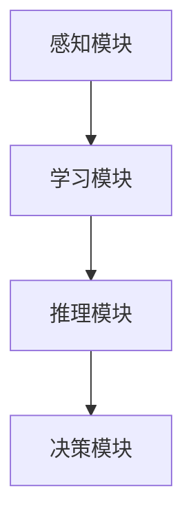

                 

人工智能（AI）的发展已经深刻地改变了我们的生活方式和工作模式。然而，随着AI技术的不断进步，用户的需求也在不断变化。本文旨在为用户提供一份AI发展的指南，帮助用户更好地理解AI技术，掌握AI应用的最佳实践，并在未来把握AI带来的机遇。

## 文章关键词
- 人工智能
- 用户需求
- 发展指南
- 技术进步
- 应用实践
- 未来展望

## 文章摘要
本文从用户需求的角度出发，探讨了人工智能技术发展的现状和趋势。通过详细分析AI的核心概念、算法原理、数学模型以及应用场景，本文为用户提供了从入门到高阶的AI应用实践指南。同时，本文还对未来的AI发展趋势和面临的挑战进行了深入探讨，为用户指明了研究方向和应用方向。

### 1. 背景介绍
人工智能的历史可以追溯到20世纪50年代，当时图灵提出了图灵测试，标志着人工智能研究的开始。随着计算机技术的飞速发展，人工智能逐渐从理论走向应用。如今，AI已经渗透到我们日常生活的方方面面，从智能手机的语音助手到自动驾驶汽车，从智能家居到医疗诊断，AI的应用场景越来越广泛。

用户需求是推动AI技术发展的核心动力。随着用户对个性化服务、智能互动、自动化决策的需求不断增加，AI技术也在不断演进。例如，在电子商务领域，用户需求推动了推荐系统的优化；在金融领域，用户需求促进了智能投顾和自动化风险管理的发展；在医疗领域，用户需求推动了AI在疾病诊断和治疗方案设计中的应用。

### 2. 核心概念与联系
#### 2.1 人工智能的定义
人工智能是指计算机系统通过模拟人类智能行为，实现感知、学习、推理、决策等功能的科学。根据其实现方式，AI可以分为弱AI和强AI。弱AI专注于特定领域的任务，如语音识别、图像识别等；强AI则试图模拟人类所有智能行为，实现通用人工智能。

#### 2.2 AI的架构
AI系统通常包括感知、学习、推理和决策四个主要模块。感知模块负责接收和处理外部信息；学习模块负责从数据中学习规律和模式；推理模块负责基于已有知识进行逻辑推理；决策模块负责根据当前状态和目标做出最优决策。



### 3. 核心算法原理 & 具体操作步骤
#### 3.1 算法原理概述
AI的核心算法主要包括监督学习、无监督学习和强化学习。监督学习通过已有标签的数据训练模型，用于预测未知数据；无监督学习通过未标记的数据发现数据分布和模式；强化学习通过试错和反馈不断优化决策策略。

#### 3.2 算法步骤详解
- **监督学习**：数据预处理 -> 模型选择 -> 训练模型 -> 模型评估。
- **无监督学习**：数据预处理 -> 算法选择 -> 模型训练 -> 模型评估。
- **强化学习**：环境初始化 -> 行为选择 -> 反馈奖励 -> 模型更新。

#### 3.3 算法优缺点
- **监督学习**：需要大量已标记数据，但模型泛化能力较强。
- **无监督学习**：不需要标记数据，但模型泛化能力较弱。
- **强化学习**：通过试错学习，但需要大量时间和计算资源。

#### 3.4 算法应用领域
监督学习在图像识别、自然语言处理等领域有广泛应用；无监督学习在聚类分析、数据挖掘等领域有广泛应用；强化学习在游戏AI、自动驾驶等领域有广泛应用。

### 4. 数学模型和公式 & 详细讲解 & 举例说明
#### 4.1 数学模型构建
AI的数学模型主要包括神经网络、决策树、支持向量机等。其中，神经网络是最常用的模型之一。

#### 4.2 公式推导过程
以神经网络为例，神经网络的输出可以通过以下公式计算：
$$
y = \sigma(W \cdot x + b)
$$
其中，$\sigma$是激活函数，$W$是权重矩阵，$x$是输入向量，$b$是偏置。

#### 4.3 案例分析与讲解
以图像识别任务为例，我们使用卷积神经网络（CNN）进行模型训练。首先，我们需要收集大量带有标签的图像数据。然后，使用CNN进行模型训练，通过调整权重和偏置，使模型能够正确识别图像。最后，对训练好的模型进行评估，确保其泛化能力。

### 5. 项目实践：代码实例和详细解释说明
#### 5.1 开发环境搭建
首先，我们需要搭建一个Python开发环境，安装必要的库，如TensorFlow、Keras等。

```bash
pip install tensorflow
pip install keras
```

#### 5.2 源代码详细实现
以下是一个简单的CNN模型实现，用于图像识别：

```python
from tensorflow.keras.models import Sequential
from tensorflow.keras.layers import Conv2D, MaxPooling2D, Flatten, Dense

model = Sequential()
model.add(Conv2D(32, (3, 3), activation='relu', input_shape=(64, 64, 3)))
model.add(MaxPooling2D(pool_size=(2, 2)))
model.add(Flatten())
model.add(Dense(128, activation='relu'))
model.add(Dense(1, activation='sigmoid'))

model.compile(optimizer='adam', loss='binary_crossentropy', metrics=['accuracy'])
```

#### 5.3 代码解读与分析
上述代码定义了一个简单的CNN模型，包含一个卷积层、一个池化层、一个全连接层和输出层。我们使用Adam优化器进行模型训练，并使用二分类交叉熵作为损失函数。

#### 5.4 运行结果展示
在训练模型时，我们使用训练集进行训练，并使用验证集进行评估。以下是一个简单的训练过程：

```python
model.fit(x_train, y_train, epochs=10, batch_size=32, validation_data=(x_val, y_val))
```

通过调整训练参数，我们可以优化模型的性能。

### 6. 实际应用场景
AI技术已经在许多实际应用场景中取得了显著成果。以下是一些典型的应用场景：

- **图像识别**：广泛应用于人脸识别、物体检测、自动驾驶等领域。
- **自然语言处理**：用于机器翻译、语音识别、情感分析等领域。
- **推荐系统**：用于电子商务、社交媒体、新闻推荐等领域。
- **医疗诊断**：用于疾病诊断、药物发现、手术模拟等领域。

### 6.4 未来应用展望
随着AI技术的不断进步，未来AI将在更多领域发挥重要作用。以下是一些可能的趋势：

- **智能城市**：AI技术将用于交通管理、环境监测、公共安全等领域。
- **智能制造**：AI技术将用于生产优化、质量控制、预测维护等领域。
- **个性化服务**：AI技术将用于个性化推荐、智能客服、健康管理等领域。

### 7. 工具和资源推荐
为了更好地学习和应用AI技术，以下是一些推荐的工具和资源：

- **学习资源**：[Coursera](https://www.coursera.org/)、[Udacity](https://www.udacity.com/)、[edX](https://www.edx.org/)等在线课程平台。
- **开发工具**：[TensorFlow](https://www.tensorflow.org/)、[PyTorch](https://pytorch.org/)、[Keras](https://keras.io/)等深度学习框架。
- **相关论文**：[ACL](https://www.aclweb.org/)、[ICML](https://icml.cc/)、[NeurIPS](https://nips.cc/)等顶级会议的论文。

### 8. 总结：未来发展趋势与挑战
#### 8.1 研究成果总结
AI技术在过去几十年取得了显著的成果，不仅在理论研究上有了突破，在实际应用中也取得了广泛的成功。然而，AI技术仍有许多挑战需要克服。

#### 8.2 未来发展趋势
随着计算能力的提升、数据资源的丰富以及算法的优化，AI技术将继续快速发展。未来，AI将在更多领域发挥重要作用，带来更多创新和变革。

#### 8.3 面临的挑战
尽管AI技术取得了显著进展，但仍面临一些挑战，如数据隐私、安全、伦理等问题。此外，如何提高AI模型的可靠性和可解释性也是未来的重要研究方向。

#### 8.4 研究展望
为了应对未来的挑战，我们需要加强多学科交叉研究，推动AI技术的可持续发展和广泛应用。同时，我们也需要关注AI技术在不同领域的具体应用，为用户带来更好的体验和价值。

### 9. 附录：常见问题与解答
1. **Q：什么是神经网络？**
   **A：**神经网络是一种由大量神经元组成的计算模型，通过模拟生物神经系统的信息处理方式，实现数据的学习和预测。

2. **Q：什么是深度学习？**
   **A：**深度学习是神经网络的一种，通过多层神经元的堆叠，实现更复杂的特征提取和表示学习。

3. **Q：如何提高模型性能？**
   **A：**可以通过增加训练数据、优化模型结构、调整训练参数、使用正则化技术等方式提高模型性能。

4. **Q：什么是强化学习？**
   **A：**强化学习是一种通过试错和反馈不断优化决策策略的机器学习方法。

5. **Q：如何实现自动驾驶？**
   **A：**自动驾驶系统通常包括感知、决策、控制三个主要模块。感知模块负责收集环境信息；决策模块负责根据环境信息做出驾驶决策；控制模块负责执行驾驶决策。

### 结论
人工智能的发展已经深刻地改变了我们的生活方式和工作模式。用户需求是推动AI技术发展的核心动力。本文从用户需求的角度出发，探讨了AI技术的核心概念、算法原理、数学模型以及应用场景，为用户提供了从入门到高阶的AI应用实践指南。未来，随着AI技术的不断进步，我们将迎来更多创新和变革。作者：禅与计算机程序设计艺术 / Zen and the Art of Computer Programming。

