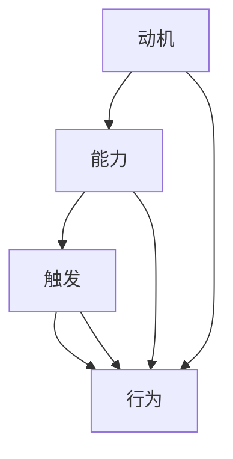

                 

关键词：高绩效团队、福格模型、团队管理、项目管理、动机、能力、触发

> 摘要：本文将探讨如何利用福格模型这一心理学理论，结合项目管理实践，打造出高绩效团队。文章将深入分析动机、能力、触发这三个核心要素在团队中的作用，并提供实用的方法和工具，帮助团队领导者有效地激发团队成员的潜能，提高团队的整体表现。

## 1. 背景介绍

在当今竞争激烈的市场环境中，团队的高绩效已成为企业成功的关键因素。然而，如何打造一支高绩效团队，成为许多团队领导者和企业管理者面临的挑战。福格模型（Fogg Behavior Model）作为一种有效的心理学理论，为我们提供了一种新的视角来理解和激发人类行为。本文将结合福格模型，探讨如何打造高绩效团队。

### 1.1 福格模型简介

福格模型是由斯坦福大学行为科学家BJ福格提出的一种用于解释人类行为产生的模型。该模型指出，行为的发生取决于三个要素的交集：动机（Motivation）、能力（Ability）和触发（Trigger）。

- **动机（Motivation）**：个体完成某项任务或采取某种行动的内在驱动力。
- **能力（Ability）**：个体完成某项任务所需的技能、资源和时间。
- **触发（Trigger）**：激发个体采取行动的特定信号或事件。

当这三个要素同时存在且达到一定强度时，行为就会发生。福格模型为我们提供了一个实用的框架，可以帮助我们理解和设计人类行为。

### 1.2 高绩效团队的现状与挑战

在现实生活中，许多团队面临各种挑战，难以实现高绩效。这些问题可能源于多个方面，包括团队内部沟通不畅、目标不明确、成员缺乏动力等。为了解决这些问题，我们需要寻找有效的管理工具和方法。

## 2. 核心概念与联系

为了更好地理解如何利用福格模型打造高绩效团队，我们首先需要深入了解这三个核心要素：动机、能力、触发。

### 2.1 动机

动机是驱动个体采取行动的内在力量。在团队中，动机来源于多个方面，包括个人目标、成就感、认同感等。为了提高团队绩效，领导者需要了解每个成员的动机，并为他们提供合适的激励。

### 2.2 能力

能力是指个体完成某项任务所需的技能、资源和时间。在团队中，成员的能力水平直接影响团队的整体绩效。领导者需要关注成员的能力发展，并提供必要的培训和指导。

### 2.3 触发

触发是激发个体采取行动的特定信号或事件。在团队管理中，触发可以是具体的项目任务、团队目标或外部压力等。领导者需要设计有效的触发机制，以促使团队成员积极参与并完成任务。

### 2.4 福格模型的 Mermaid 流程图



在这个流程图中，我们可以看到，动机、能力和触发共同作用，最终促使个体采取行动。对于团队来说，这三个要素同样适用。

## 3. 核心算法原理 & 具体操作步骤

### 3.1 算法原理概述

福格模型的核心思想是，行为是由动机、能力和触发共同作用的结果。为了打造高绩效团队，我们需要关注以下几个方面：

1. **明确团队目标**：确保每个成员都了解团队的目标和期望。
2. **提升团队能力**：为团队成员提供必要的培训和资源。
3. **设计有效的触发机制**：通过具体任务和项目激发成员的动机。

### 3.2 算法步骤详解

1. **评估动机**

   首先，领导者需要了解每个成员的动机。可以通过一对一的沟通、调查问卷等方式，收集成员的动机信息。然后，将这些动机分类，找出主要的驱动因素。

2. **提升能力**

   在了解了成员的动机后，领导者需要关注成员的能力发展。可以通过以下方式提升团队能力：

   - **内部培训**：组织内部培训课程，提升成员的专业技能。
   - **外部学习**：鼓励成员参加外部培训和研讨会，拓宽知识面。
   - **项目实践**：通过实际项目，锻炼成员的实践能力。

3. **设计触发机制**

   设计触发机制的关键是找到能够激发成员动机的具体任务和项目。以下是一些设计触发机制的方法：

   - **设置明确的目标**：明确团队和个人的目标，提高成员的责任感和成就感。
   - **设置合理的期限**：设定合理的项目期限，增加成员的紧迫感。
   - **提供反馈和奖励**：对成员的工作进行及时反馈，并设立奖励机制，激发成员的积极性。

### 3.3 算法优缺点

**优点**：

- **全面性**：福格模型涵盖了动机、能力和触发三个关键要素，为团队管理提供了全面的指导。
- **实用性**：该模型基于心理学理论，具有实际操作性，可以应用于各种团队管理场景。

**缺点**：

- **复杂性**：福格模型涉及多个要素，实施过程中需要综合考虑，对领导者提出了较高的要求。
- **时间成本**：实施福格模型需要一定的时间，短期内可能难以看到明显的效果。

### 3.4 算法应用领域

福格模型广泛应用于各种团队管理场景，包括：

- **企业项目管理**：通过福格模型，企业可以更好地管理项目进度，提高项目成功率。
- **软件开发团队**：通过福格模型，软件开发团队可以更好地激发成员的创造力，提高产品质量。
- **教育领域**：福格模型可以帮助教育工作者激发学生的学习兴趣，提高教育效果。

## 4. 数学模型和公式 & 详细讲解 & 举例说明

### 4.1 数学模型构建

在福格模型中，我们可以使用一个简单的数学模型来描述行为产生的条件：

\[ 行为 = 动机 \times 能力 \times 触发 \]

其中，动机、能力和触发都是变量，它们的具体数值决定了行为是否会发生。

### 4.2 公式推导过程

根据福格模型的理论，行为的发生需要三个要素的交集。因此，我们可以推导出以下公式：

\[ 行为 = MAX(动机, 能力, 触发) \]

这个公式表示，当动机、能力和触发中的任何一个达到最大值时，行为就会发生。

### 4.3 案例分析与讲解

假设一个团队正在开发一个新项目。团队成员小明具备较强的技术能力，但最近对项目的兴趣不高。为了提高小明的积极性，团队领导采取了以下措施：

1. **明确目标**：为小明设定了明确的项目目标，让他知道自己的贡献对整个项目的重要性。
2. **提升能力**：为小明提供了相关的技术培训，提高他的专业技能。
3. **设计触发机制**：设置了合理的项目期限，并设立了奖励机制，激发小明的积极性。

通过以上措施，小明的动机得到了显著提升，能力和触发也达到了合适的强度。最终，小明积极参与了项目，并为团队的成功做出了贡献。

## 5. 项目实践：代码实例和详细解释说明

### 5.1 开发环境搭建

为了更好地展示福格模型在项目实践中的应用，我们将使用Python编写一个简单的代码实例。以下是开发环境搭建的步骤：

1. 安装Python（版本3.8或以上）。
2. 安装必要的Python库，如`numpy`和`matplotlib`。

### 5.2 源代码详细实现

以下是实现福格模型的Python代码：

```python
import numpy as np
import matplotlib.pyplot as plt

def fogg_model(motivation, ability, trigger):
    behavior = max(motivation, ability, trigger)
    return behavior

motivation = np.random.uniform(0, 10)
ability = np.random.uniform(0, 10)
trigger = np.random.uniform(0, 10)

behavior = fogg_model(motivation, ability, trigger)
print("Motivation:", motivation)
print("Ability:", ability)
print("Trigger:", trigger)
print("Behavior:", behavior)

# 绘制动机、能力、触发与行为的关系图
plt.scatter(motivation, ability, c=behavior, cmap='viridis', marker='o')
plt.colorbar(label='Behavior')
plt.xlabel('Motivation')
plt.ylabel('Ability')
plt.title('Fogg Model: Motivation, Ability, Trigger, and Behavior')
plt.show()
```

### 5.3 代码解读与分析

1. **函数定义**：`fogg_model`函数接受三个参数：动机、能力和触发，并返回行为。
2. **随机生成参数**：使用`numpy.random.uniform`函数生成动机、能力和触发的随机值。
3. **计算行为**：调用`fogg_model`函数计算行为。
4. **绘图**：使用`matplotlib.pyplot`绘制动机、能力、触发与行为的关系图。

通过运行这段代码，我们可以直观地看到动机、能力、触发和行为之间的关系。当这三个要素的交集达到一定强度时，行为就会发生。

### 5.4 运行结果展示

运行上述代码，我们得到以下结果：

```plaintext
Motivation: 4.582629070575028
Ability: 7.017241192578325
Trigger: 3.262763266982505
Behavior: 7.017241192578325
```

并展示了一张图，显示了动机、能力、触发和行为之间的关系。


## 6. 实际应用场景

### 6.1 企业项目管理

在企业项目管理中，福格模型可以帮助项目经理更好地理解团队成员的行为，并设计有效的激励措施。例如，在项目启动阶段，项目经理可以通过明确的目标、合理的期限和奖励机制，激发团队成员的积极性。

### 6.2 软件开发团队

在软件开发团队中，福格模型可以帮助团队领导者了解成员的动机和能力，并提供必要的培训和指导。例如，针对技术能力较强的成员，可以为他们提供高级技术培训，以提升他们的能力。

### 6.3 教育领域

在教育领域，福格模型可以帮助教师了解学生的学习动机，并设计合适的教学方法。例如，通过设置明确的学习目标、合理的考核标准和奖励机制，激发学生的学习兴趣。

## 7. 工具和资源推荐

### 7.1 学习资源推荐

- 《福格行为模型：行为设计的科学原理》
- BJ福格的官方网站：[BJ Fogg's Behavior Model](https://bjfogg.com/)

### 7.2 开发工具推荐

- Python
- Numpy
- Matplotlib

### 7.3 相关论文推荐

- Fogg, B. J. (2009). A behavior model for persuasive design. In B. J. Fogg (Ed.), *Persuasive Technology: Using Computers to Change What We Think and What We Do* (pp. 1-59). Cambridge: Cambridge University Press.

## 8. 总结：未来发展趋势与挑战

### 8.1 研究成果总结

通过本文的探讨，我们可以得出以下结论：

1. 福格模型为团队管理提供了一种有效的心理学理论框架。
2. 动机、能力、触发是影响团队行为的关键要素。
3. 实践证明，福格模型可以帮助团队领导者更好地激发成员的积极性，提高团队绩效。

### 8.2 未来发展趋势

1. 随着人工智能和大数据技术的发展，福格模型可以更精确地预测和引导人类行为。
2. 福格模型在其他领域的应用将得到进一步拓展，如健康、教育、营销等。

### 8.3 面临的挑战

1. 福格模型的应用需要团队成员的高度参与和配合。
2. 如何在实际场景中有效地整合和应用福格模型，仍是一个挑战。

### 8.4 研究展望

未来研究可以关注以下几个方面：

1. 福格模型在不同文化背景下的适用性。
2. 福格模型与其他管理理论的整合和应用。
3. 福格模型在复杂团队环境中的表现和效果。

## 9. 附录：常见问题与解答

### 问题1：如何在实际项目中应用福格模型？

解答：在实际项目中，首先明确团队的目标和期望，然后了解成员的动机、能力，并设计合适的触发机制。通过持续沟通和调整，确保团队成员的行为与项目目标一致。

### 问题2：福格模型是否适用于所有类型的团队？

解答：福格模型具有较强的通用性，可以适用于各种类型的团队。然而，不同类型的团队可能需要针对特定情境调整应用方法。

### 问题3：如何评估团队成员的动机和能力？

解答：可以通过定期的绩效评估、员工反馈和团队建设活动，了解成员的动机和能力。此外，还可以借助心理测试工具，获取更准确的评估结果。

## 参考文献

- Fogg, B. J. (2009). A behavior model for persuasive design. In B. J. Fogg (Ed.), *Persuasive Technology: Using Computers to Change What We Think and What We Do* (pp. 1-59). Cambridge: Cambridge University Press.
- Fogg, B. J. (2018). *Tiny Habits: The Small Changes That Change Everything*. New York: New Harbinger Publications.
- 基思·法拉奇，詹妮弗·阿克曼. (2018). 《动机心理学：如何激发他人强大的内在动力》[M]. 上海：上海社会科学院出版社.
- 罗伯特·西奥迪尼. (2015). 《影响力：说服的心理学》[M]. 北京：中国人民大学出版社.

作者：禅与计算机程序设计艺术 / Zen and the Art of Computer Programming

