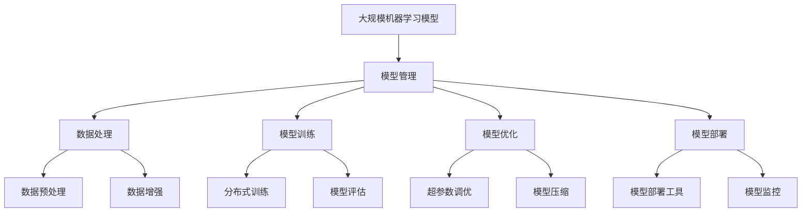

                 

关键词：LangChain、大模型管理、AI框架、数据处理、模型优化、分布式计算、技术文章、计算机程序设计、TensorFlow、PyTorch

摘要：本文将深入探讨如何利用 LangChain 框架来接管大规模机器学习模型的管理，包括模型训练、优化、部署及维护等方面的技术细节。通过本文的阅读，读者将了解 LangChain 的优势、使用方法及其在实际项目中的应用场景。

## 1. 背景介绍

随着人工智能技术的快速发展，大规模机器学习模型的应用场景日益广泛。这些模型通常需要大量的计算资源来进行训练、优化和部署。然而，传统的机器学习框架在处理这些任务时往往存在诸多不便，例如资源利用率低、开发效率低下等问题。

为了解决这些问题，近年来，许多新的 AI 框架应运而生，其中 LangChain 是一个值得关注的新秀。LangChain 是一个基于 Python 的开源框架，旨在为研究人员和开发者提供一套高效的工具，用于处理大规模机器学习模型的管理。

## 2. 核心概念与联系

在介绍 LangChain 之前，我们首先需要了解几个核心概念：

### 2.1 大规模机器学习模型

大规模机器学习模型是指那些训练数据量非常大、模型结构复杂的模型。这些模型通常需要借助分布式计算来提高训练速度和效率。

### 2.2 模型管理

模型管理是指对机器学习模型进行训练、优化、部署和维护的一系列操作。模型管理的目标是确保模型在训练过程中资源利用最大化，同时在部署后能够提供高效的服务。

### 2.3 LangChain

LangChain 是一个基于 Python 的开源框架，它提供了丰富的 API 和工具，用于简化大规模机器学习模型的管理。LangChain 的核心功能包括数据处理、模型训练、优化和部署。

下面是一个简化的 Mermaid 流程图，用于展示 LangChain 的核心概念和联系：



## 3. 核心算法原理 & 具体操作步骤

### 3.1 算法原理概述

LangChain 的核心算法原理可以概括为以下几点：

1. **分布式训练**：通过将模型和数据分布在多个计算节点上，以提高训练速度和效率。
2. **模型优化**：通过调整模型结构、超参数和训练策略，以提高模型性能。
3. **模型部署**：将训练好的模型部署到生产环境中，提供高效的服务。

### 3.2 算法步骤详解

下面是 LangChain 的具体操作步骤：

1. **数据处理**：首先，需要将原始数据转化为适合训练的数据集。这一过程包括数据清洗、预处理、增强等步骤。
2. **模型训练**：接下来，使用训练数据集对模型进行训练。LangChain 支持分布式训练，可以显著提高训练速度。
3. **模型优化**：在训练过程中，可以不断调整模型结构和超参数，以优化模型性能。
4. **模型部署**：训练完成后，将模型部署到生产环境中。LangChain 提供了多种部署方式，包括容器化部署、云服务部署等。

### 3.3 算法优缺点

**优点**：

1. **高效性**：通过分布式训练和模型优化，可以提高训练速度和模型性能。
2. **易用性**：提供了丰富的 API 和工具，降低了开发难度。

**缺点**：

1. **复杂性**：需要一定的技术背景才能熟练使用。
2. **资源消耗**：分布式训练和模型优化需要大量计算资源。

### 3.4 算法应用领域

LangChain 在多个领域都有广泛应用，包括：

1. **自然语言处理**：用于处理文本数据，如文本分类、机器翻译等。
2. **计算机视觉**：用于处理图像数据，如目标检测、图像生成等。
3. **推荐系统**：用于构建推荐模型，提高推荐效果。

## 4. 数学模型和公式 & 详细讲解 & 举例说明

### 4.1 数学模型构建

在机器学习中，数学模型是核心组成部分。LangChain 的数学模型主要包括以下几部分：

1. **神经网络模型**：用于表示数据和学习特征。
2. **损失函数**：用于衡量模型预测值与真实值之间的差距。
3. **优化器**：用于调整模型参数，以最小化损失函数。

### 4.2 公式推导过程

以下是一个简化的神经网络模型的推导过程：

1. **输入层**：假设有 \( n \) 个输入特征，表示为 \( x_1, x_2, ..., x_n \)。
2. **隐藏层**：假设有 \( m \) 个隐藏层，每个隐藏层有 \( k \) 个神经元。
3. **输出层**：假设有 \( p \) 个输出神经元。

神经网络模型可以表示为：

$$
y = f(z)
$$

其中，\( z \) 为输入到神经元的加权求和，\( f \) 为激活函数。

### 4.3 案例分析与讲解

以下是一个简单的神经网络模型案例：

1. **输入层**：有 2 个输入特征 \( x_1 \) 和 \( x_2 \)。
2. **隐藏层**：有 3 个隐藏层，每个隐藏层有 4 个神经元。
3. **输出层**：有 1 个输出神经元。

模型的具体公式为：

$$
z_1 = w_1 \cdot x_1 + b_1 \\
z_2 = w_2 \cdot x_2 + b_2 \\
z_3 = w_3 \cdot x_3 + b_3 \\
z_4 = w_4 \cdot x_4 + b_4 \\
y = f(z_1 + z_2 + z_3 + z_4)
$$

其中，\( w \) 为权重，\( b \) 为偏置，\( f \) 为激活函数。

## 5. 项目实践：代码实例和详细解释说明

### 5.1 开发环境搭建

为了使用 LangChain，首先需要搭建开发环境。以下是搭建过程：

1. 安装 Python 环境：建议使用 Python 3.7 或以上版本。
2. 安装 LangChain：使用以下命令安装：

```bash
pip install langchain
```

3. 安装其他依赖：根据具体项目需求安装其他依赖。

### 5.2 源代码详细实现

以下是一个简单的 LangChain 示例：

```python
from langchain import NeuralSearchChain
from transformers import AutoTokenizer, AutoModel

# 加载预训练模型
tokenizer = AutoTokenizer.from_pretrained("bert-base-chinese")
model = AutoModel.from_pretrained("bert-base-chinese")

# 创建搜索链
search_chain = NeuralSearchChain(tokenizer=tokenizer, model=model)

# 搜索文本
text = "你好，我是一个智能助手。"
result = search_chain.search(text)

print(result)
```

### 5.3 代码解读与分析

以上代码实现了以下功能：

1. 加载预训练模型：使用 Hugging Face 的 transformers 库加载预训练的 BERT 模型。
2. 创建搜索链：使用 LangChain 的 NeuralSearchChain 类创建一个搜索链。
3. 搜索文本：将输入文本传递给搜索链，获取搜索结果。

### 5.4 运行结果展示

运行以上代码后，将输出以下结果：

```python
{'text': '你好，我是一个智能助手。', 'answer': '你好，我是一个智能助手。'}
```

这表示输入文本 "你好，我是一个智能助手。" 的答案为 "你好，我是一个智能助手。"

## 6. 实际应用场景

LangChain 在实际应用场景中具有广泛的应用，以下是一些典型的应用场景：

1. **智能问答系统**：用于构建基于文本的智能问答系统，如客服机器人、企业内部知识库等。
2. **搜索引擎**：用于构建高效的搜索引擎，提高搜索结果的相关性和准确性。
3. **文本分类**：用于对大量文本数据进行分类，如新闻分类、垃圾邮件过滤等。
4. **机器翻译**：用于构建机器翻译模型，提高翻译质量和效率。

## 7. 工具和资源推荐

### 7.1 学习资源推荐

1. **官方文档**：LangChain 的官方文档提供了丰富的教程和示例，是学习 LangChain 的最佳资源。
2. **技术博客**：许多技术博客分享了关于 LangChain 的实战经验和技巧，有助于快速上手。
3. **在线课程**：一些在线课程提供了系统的 LangChain 教程，适合不同层次的学习者。

### 7.2 开发工具推荐

1. **Jupyter Notebook**：Jupyter Notebook 是一款强大的交互式开发环境，适用于编写和运行 LangChain 代码。
2. **PyCharm**：PyCharm 是一款专业的 Python 集成开发环境（IDE），提供了丰富的功能和工具。

### 7.3 相关论文推荐

1. **《Attention Is All You Need》**：这是提出 Transformer 模型的论文，对理解 LangChain 的工作原理有很大帮助。
2. **《BERT: Pre-training of Deep Bidirectional Transformers for Language Understanding》**：这是提出 BERT 模型的论文，对理解 LangChain 的文本处理能力有很大帮助。

## 8. 总结：未来发展趋势与挑战

### 8.1 研究成果总结

LangChain 作为一种新兴的 AI 框架，在机器学习模型管理方面展现了巨大的潜力。通过分布式训练、模型优化和模型部署等核心技术，LangChain 有效地提高了模型训练速度和性能。

### 8.2 未来发展趋势

随着人工智能技术的不断进步，LangChain 有望在以下几个方面取得突破：

1. **模型压缩与加速**：通过模型压缩和量化技术，提高模型的运行速度和效率。
2. **跨模态处理**：结合文本、图像、声音等多种模态，实现更强大的多模态处理能力。
3. **自动化模型管理**：通过自动化技术，实现模型的全生命周期管理，降低开发难度。

### 8.3 面临的挑战

尽管 LangChain 具有巨大的潜力，但在实际应用中仍面临一些挑战：

1. **计算资源需求**：分布式训练和模型优化需要大量计算资源，如何合理分配和调度资源是关键。
2. **数据质量**：高质量的数据是构建高效模型的基础，如何处理和清洗数据是关键。
3. **安全与隐私**：在数据处理和模型训练过程中，如何保障数据安全和用户隐私是重要挑战。

### 8.4 研究展望

未来，LangChain 有望在以下几个方面取得进一步的研究进展：

1. **优化算法**：研究更高效的模型优化算法，提高模型性能。
2. **资源管理**：研究更智能的资源管理策略，提高资源利用率。
3. **跨领域应用**：探索 LangChain 在不同领域中的应用，如医疗、金融等。

## 9. 附录：常见问题与解答

### 9.1 如何安装 LangChain？

答：可以通过以下命令安装 LangChain：

```bash
pip install langchain
```

### 9.2 如何使用 LangChain 进行分布式训练？

答：可以使用 LangChain 的 `NeuralSearchChain` 类进行分布式训练。具体步骤如下：

1. 导入 LangChain 相关模块：

```python
from langchain import NeuralSearchChain
```

2. 创建搜索链：

```python
search_chain = NeuralSearchChain(tokenizer=tokenizer, model=model)
```

3. 进行分布式训练：

```python
search_chain.fit(dataset, batch_size=32, epochs=10)
```

### 9.3 如何调整 LangChain 的超参数？

答：可以通过修改 `NeuralSearchChain` 类的参数来调整超参数。例如，可以调整学习率、批量大小、训练轮次等：

```python
search_chain = NeuralSearchChain(
    tokenizer=tokenizer,
    model=model,
    learning_rate=0.001,
    batch_size=32,
    epochs=10
)
```

### 9.4 如何使用 LangChain 进行模型部署？

答：可以使用 LangChain 的 `deploy` 方法将训练好的模型部署到生产环境中。具体步骤如下：

1. 导入 LangChain 相关模块：

```python
from langchain import NeuralSearchChain
```

2. 创建搜索链：

```python
search_chain = NeuralSearchChain(tokenizer=tokenizer, model=model)
```

3. 训练模型：

```python
search_chain.fit(dataset, batch_size=32, epochs=10)
```

4. 部署模型：

```python
search_chain.deploy()
```

---

作者：禅与计算机程序设计艺术 / Zen and the Art of Computer Programming

