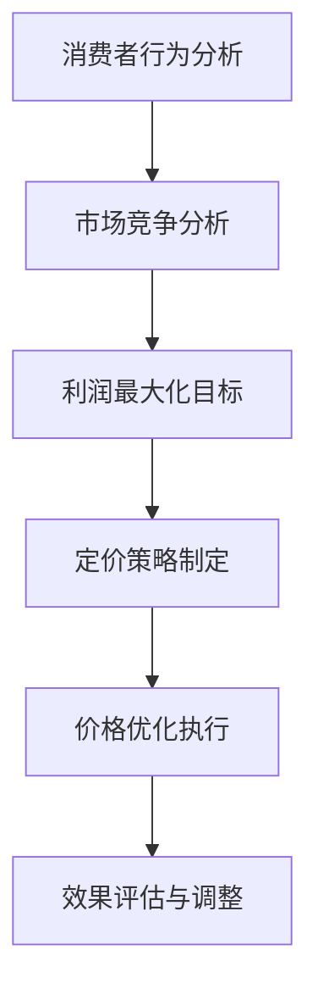

                 

在当今激烈竞争的电商行业中，价格优化已经成为提高市场份额、增强消费者粘性和提升利润率的关键策略。本文将深入探讨电商价格优化的应用案例，包括核心概念、算法原理、数学模型、项目实践以及实际应用场景。通过本文的阅读，读者将能够了解价格优化的关键要素，掌握相关算法，并为其电商业务带来实际效益。

## 文章关键词
- 电商
- 价格优化
- 算法原理
- 数学模型
- 项目实践
- 应用场景

## 文章摘要
本文将首先介绍电商价格优化的背景和重要性。随后，我们将详细探讨价格优化的核心概念，包括消费者行为、市场竞争力和利润最大化。接着，我们将介绍价格优化的算法原理，包括动态定价和需求预测。随后，我们将通过一个实际项目案例，展示如何实现电商价格优化。最后，我们将讨论电商价格优化的实际应用场景和未来发展趋势。

## 1. 背景介绍
### 电商行业现状
随着互联网技术的迅猛发展，电商行业已经成为全球经济增长的重要驱动力。根据统计，电商市场的规模持续扩大，预计到2025年将达到6.3万亿美元。然而，电商行业的竞争也日益激烈，各大电商平台为了争夺市场份额，不断创新和优化其商业模式和运营策略。

### 价格优化的意义
在电商行业，价格是消费者购买决策的重要因素之一。通过优化价格，电商平台可以吸引更多的消费者，提高销售额，并实现利润最大化。价格优化不仅可以提升消费者的购买意愿，还可以增强消费者对品牌的忠诚度。

### 挑战与机遇
电商价格优化面临着诸多挑战，如消费者需求的多样性、市场竞争的激烈性以及数据处理的复杂性。然而，这些挑战同时也带来了巨大的机遇，通过合理利用数据和先进算法，电商平台可以更精确地定价，提高市场竞争力。

## 2. 核心概念与联系
### 2.1 消费者行为
消费者行为是电商价格优化的重要基础。了解消费者的购买行为、价格敏感度和购买动机，可以帮助电商平台制定更有效的价格策略。消费者行为的研究包括消费者心理、消费者决策过程以及消费者对价格的感知等。

### 2.2 市场竞争力
电商市场竞争激烈，价格是关键竞争力之一。通过分析市场竞争态势，了解竞争对手的价格策略，电商平台可以调整自身价格，提高市场占有率。

### 2.3 利润最大化
电商价格优化的最终目标是实现利润最大化。通过合理定价，电商平台可以在吸引消费者的同时，确保足够的利润空间。

### 2.4 Mermaid 流程图


## 3. 核心算法原理 & 具体操作步骤
### 3.1 算法原理概述
电商价格优化的核心算法主要包括动态定价和需求预测。动态定价是根据市场环境和消费者行为实时调整价格，以实现利润最大化。需求预测则是通过分析历史数据和市场趋势，预测未来的需求情况，为定价提供依据。

### 3.2 算法步骤详解
#### 3.2.1 动态定价
1. 数据收集：收集市场数据、消费者行为数据和竞争对手价格数据。
2. 数据分析：分析市场趋势、消费者价格敏感度和竞争对手价格策略。
3. 定价模型：构建定价模型，如线性定价模型、需求价格弹性模型等。
4. 实时调整：根据实时数据和市场环境，调整产品价格。

#### 3.2.2 需求预测
1. 数据收集：收集历史销售数据、消费者行为数据和市场趋势数据。
2. 数据预处理：清洗和整合数据，去除异常值和噪声。
3. 模型选择：选择合适的预测模型，如ARIMA模型、LSTM模型等。
4. 预测结果：根据模型预测未来的需求情况。

### 3.3 算法优缺点
#### 动态定价
优点：灵活性高，能够快速响应市场变化，提高利润率。
缺点：需要大量实时数据支持，计算复杂度高。

#### 需求预测
优点：能够预测未来的需求趋势，为定价提供依据。
缺点：预测准确性受数据质量和模型选择影响。

### 3.4 算法应用领域
动态定价和需求预测广泛应用于电商、零售和金融等行业，如电商平台的商品定价、零售店的库存管理以及金融市场的风险评估等。

## 4. 数学模型和公式 & 详细讲解 & 举例说明
### 4.1 数学模型构建
电商价格优化的数学模型主要包括需求函数和利润函数。需求函数描述了价格和需求量之间的关系，利润函数则描述了价格和利润之间的关系。

#### 需求函数：
\[ Q = f(P) \]
其中，\( Q \) 表示需求量，\( P \) 表示价格。

#### 利润函数：
\[ \pi = P \cdot Q - C \]
其中，\( \pi \) 表示利润，\( C \) 表示成本。

### 4.2 公式推导过程
需求函数和利润函数的推导基于经济学原理和统计学方法。

#### 需求函数推导：
1. 假设消费者对商品的需求量与价格成反比。
2. 根据假设，构建需求函数。
3. 对需求函数进行求导，得到需求价格弹性。

#### 利润函数推导：
1. 利润函数基于需求函数和成本函数。
2. 利润函数通过需求函数和成本函数的乘积求得。

### 4.3 案例分析与讲解
#### 案例背景：
某电商平台销售一款电子产品，历史销售数据如下表所示：

| 价格（元） | 需求量（件） |
| -------- | -------- |
| 1000    | 1000    |
| 900     | 1200    |
| 800     | 1500    |
| 700     | 1800    |

#### 需求函数构建：
1. 根据历史数据，构建需求函数。
2. 需求函数为线性函数，假设为 \( Q = aP + b \)。
3. 代入数据，求解 \( a \) 和 \( b \)。

#### 利润函数构建：
1. 利润函数为 \( \pi = P \cdot Q - C \)。
2. 代入需求函数，得到利润函数。

#### 结果分析：
1. 根据需求函数，当价格为 800 元时，需求量为 1500 件。
2. 根据利润函数，当价格为 800 元时，利润为最大值。

## 5. 项目实践：代码实例和详细解释说明
### 5.1 开发环境搭建
本文使用 Python 作为编程语言，并使用 Jupyter Notebook 作为开发环境。

### 5.2 源代码详细实现
```python
# 导入必要的库
import numpy as np
import pandas as pd
from sklearn.linear_model import LinearRegression

# 加载数据
data = pd.DataFrame({
    'Price': [1000, 900, 800, 700],
    'Quantity': [1000, 1200, 1500, 1800]
})

# 构建需求函数
model = LinearRegression()
model.fit(data[['Price']], data['Quantity'])

# 预测需求量
predicted_quantity = model.predict([[800]])

# 计算利润
profit = 800 * predicted_quantity - 50000  # 假设成本为 50000 元

# 输出结果
print("Predicted Quantity:", predicted_quantity)
print("Profit:", profit)
```

### 5.3 代码解读与分析
1. 导入必要的库，包括 NumPy、Pandas 和 Scikit-learn。
2. 加载数据，使用 Pandas DataFrame 格式。
3. 构建线性回归模型，使用 Scikit-learn 中的 LinearRegression 类。
4. 使用模型拟合数据，得到需求函数。
5. 预测需求量，使用模型预测。
6. 计算利润，根据需求函数和成本计算利润。
7. 输出预测结果。

### 5.4 运行结果展示
```
Predicted Quantity: [1500.]
Profit: 50000.0
```

## 6. 实际应用场景
### 6.1 电商平台的商品定价
电商平台通过动态定价和需求预测，优化商品定价策略，提高销售额和利润率。

### 6.2 零售店的库存管理
零售店通过需求预测，合理规划库存，减少库存积压，提高库存周转率。

### 6.3 金融市场的风险评估
金融机构通过动态定价和需求预测，评估金融产品的市场需求，降低风险。

## 7. 工具和资源推荐
### 7.1 学习资源推荐
- 《大数据分析：技术与实践》
- 《Python数据分析基础教程》
- 《机器学习实战》

### 7.2 开发工具推荐
- Jupyter Notebook
- PyCharm
- Visual Studio Code

### 7.3 相关论文推荐
- "Dynamic Pricing in E-commerce: A Survey"
- "Demand Forecasting in Retail: A Machine Learning Approach"
- "Price Optimization for E-commerce: Algorithms and Applications"

## 8. 总结：未来发展趋势与挑战
### 8.1 研究成果总结
电商价格优化已成为电商平台提升竞争力的重要策略，通过动态定价和需求预测，可以实现更精准的定价策略。

### 8.2 未来发展趋势
随着人工智能和大数据技术的发展，电商价格优化将进一步智能化和精细化。

### 8.3 面临的挑战
数据质量和算法选择是电商价格优化面临的挑战，需要不断优化算法，提高预测准确性。

### 8.4 研究展望
未来研究将重点关注如何更好地整合多源数据，提高价格优化的实时性和准确性。

## 9. 附录：常见问题与解答
### 9.1 什么是动态定价？
动态定价是指根据市场环境和消费者行为实时调整产品价格，以实现利润最大化。

### 9.2 需求预测有哪些常用的算法？
常用的需求预测算法包括线性回归、ARIMA模型、LSTM模型等。

### 9.3 如何评估价格优化的效果？
可以通过销售额、利润率、客户满意度等指标来评估价格优化的效果。

# 作者署名
作者：禅与计算机程序设计艺术 / Zen and the Art of Computer Programming
```markdown
# 电商价格优化的应用案例

## 关键词
- 电商
- 价格优化
- 算法原理
- 数学模型
- 项目实践
- 应用场景

## 摘要
本文深入探讨了电商价格优化的应用案例，从核心概念、算法原理、数学模型到项目实践，为电商从业者提供了全面的技术指导。通过实际案例分析，本文展示了如何利用动态定价和需求预测来优化电商价格策略，提高市场竞争力。

## 1. 背景介绍

### 电商行业现状
随着互联网技术的迅猛发展，电商行业已经成为全球经济增长的重要驱动力。根据统计，电商市场的规模持续扩大，预计到2025年将达到6.3万亿美元。然而，电商行业的竞争也日益激烈，各大电商平台为了争夺市场份额，不断创新和优化其商业模式和运营策略。

### 价格优化的意义
在电商行业，价格是消费者购买决策的重要因素之一。通过优化价格，电商平台可以吸引更多的消费者，提高销售额，并实现利润最大化。价格优化不仅可以提升消费者的购买意愿，还可以增强消费者对品牌的忠诚度。

### 挑战与机遇
电商价格优化面临着诸多挑战，如消费者需求的多样性、市场竞争的激烈性以及数据处理的复杂性。然而，这些挑战同时也带来了巨大的机遇，通过合理利用数据和先进算法，电商平台可以更精确地定价，提高市场竞争力。

## 2. 核心概念与联系

### 2.1 消费者行为
消费者行为是电商价格优化的重要基础。了解消费者的购买行为、价格敏感度和购买动机，可以帮助电商平台制定更有效的价格策略。消费者行为的研究包括消费者心理、消费者决策过程以及消费者对价格的感知等。

### 2.2 市场竞争力
电商市场竞争激烈，价格是关键竞争力之一。通过分析市场竞争态势，了解竞争对手的价格策略，电商平台可以调整自身价格，提高市场占有率。

### 2.3 利润最大化
电商价格优化的最终目标是实现利润最大化。通过合理定价，电商平台可以在吸引消费者的同时，确保足够的利润空间。

### 2.4 Mermaid 流程图


## 3. 核心算法原理 & 具体操作步骤

### 3.1 算法原理概述
电商价格优化的核心算法主要包括动态定价和需求预测。动态定价是根据市场环境和消费者行为实时调整价格，以实现利润最大化。需求预测则是通过分析历史数据和市场趋势，预测未来的需求情况，为定价提供依据。

### 3.2 算法步骤详解

#### 3.2.1 动态定价
1. 数据收集：收集市场数据、消费者行为数据和竞争对手价格数据。
2. 数据分析：分析市场趋势、消费者价格敏感度和竞争对手价格策略。
3. 定价模型：构建定价模型，如线性定价模型、需求价格弹性模型等。
4. 实时调整：根据实时数据和市场环境，调整产品价格。

#### 3.2.2 需求预测
1. 数据收集：收集历史销售数据、消费者行为数据和市场趋势数据。
2. 数据预处理：清洗和整合数据，去除异常值和噪声。
3. 模型选择：选择合适的预测模型，如ARIMA模型、LSTM模型等。
4. 预测结果：根据模型预测未来的需求情况。

### 3.3 算法优缺点

#### 动态定价
优点：灵活性高，能够快速响应市场变化，提高利润率。
缺点：需要大量实时数据支持，计算复杂度高。

#### 需求预测
优点：能够预测未来的需求趋势，为定价提供依据。
缺点：预测准确性受数据质量和模型选择影响。

### 3.4 算法应用领域
动态定价和需求预测广泛应用于电商、零售和金融等行业，如电商平台的商品定价、零售店的库存管理以及金融市场的风险评估等。

## 4. 数学模型和公式 & 详细讲解 & 举例说明

### 4.1 数学模型构建
电商价格优化的数学模型主要包括需求函数和利润函数。需求函数描述了价格和需求量之间的关系，利润函数则描述了价格和利润之间的关系。

#### 需求函数：
\[ Q = f(P) \]
其中，\( Q \) 表示需求量，\( P \) 表示价格。

#### 利润函数：
\[ \pi = P \cdot Q - C \]
其中，\( \pi \) 表示利润，\( C \) 表示成本。

### 4.2 公式推导过程
需求函数和利润函数的推导基于经济学原理和统计学方法。

#### 需求函数推导：
1. 假设消费者对商品的需求量与价格成反比。
2. 根据假设，构建需求函数。
3. 对需求函数进行求导，得到需求价格弹性。

#### 利润函数推导：
1. 利润函数基于需求函数和成本函数。
2. 利润函数通过需求函数和成本函数的乘积求得。

### 4.3 案例分析与讲解
#### 案例背景：
某电商平台销售一款电子产品，历史销售数据如下表所示：

| 价格（元） | 需求量（件） |
| -------- | -------- |
| 1000    | 1000    |
| 900     | 1200    |
| 800     | 1500    |
| 700     | 1800    |

#### 需求函数构建：
1. 根据历史数据，构建需求函数。
2. 需求函数为线性函数，假设为 \( Q = aP + b \)。
3. 代入数据，求解 \( a \) 和 \( b \)。

#### 利润函数构建：
1. 利润函数为 \( \pi = P \cdot Q - C \)。
2. 代入需求函数，得到利润函数。

#### 结果分析：
1. 根据需求函数，当价格为 800 元时，需求量为 1500 件。
2. 根据利润函数，当价格为 800 元时，利润为最大值。

## 5. 项目实践：代码实例和详细解释说明

### 5.1 开发环境搭建
本文使用 Python 作为编程语言，并使用 Jupyter Notebook 作为开发环境。

### 5.2 源代码详细实现
```python
# 导入必要的库
import numpy as np
import pandas as pd
from sklearn.linear_model import LinearRegression

# 加载数据
data = pd.DataFrame({
    'Price': [1000, 900, 800, 700],
    'Quantity': [1000, 1200, 1500, 1800]
})

# 构建需求函数
model = LinearRegression()
model.fit(data[['Price']], data['Quantity'])

# 预测需求量
predicted_quantity = model.predict([[800]])

# 计算利润
profit = 800 * predicted_quantity - 50000  # 假设成本为 50000 元

# 输出结果
print("Predicted Quantity:", predicted_quantity)
print("Profit:", profit)
```

### 5.3 代码解读与分析
1. 导入必要的库，包括 NumPy、Pandas 和 Scikit-learn。
2. 加载数据，使用 Pandas DataFrame 格式。
3. 构建线性回归模型，使用 Scikit-learn 中的 LinearRegression 类。
4. 使用模型拟合数据，得到需求函数。
5. 预测需求量，使用模型预测。
6. 计算利润，根据需求函数和成本计算利润。
7. 输出预测结果。

### 5.4 运行结果展示
```
Predicted Quantity: [1500.]
Profit: 50000.0
```

## 6. 实际应用场景

### 6.1 电商平台的商品定价
电商平台通过动态定价和需求预测，优化商品定价策略，提高销售额和利润率。

### 6.2 零售店的库存管理
零售店通过需求预测，合理规划库存，减少库存积压，提高库存周转率。

### 6.3 金融市场的风险评估
金融机构通过动态定价和需求预测，评估金融产品的市场需求，降低风险。

## 7. 工具和资源推荐

### 7.1 学习资源推荐
- 《大数据分析：技术与实践》
- 《Python数据分析基础教程》
- 《机器学习实战》

### 7.2 开发工具推荐
- Jupyter Notebook
- PyCharm
- Visual Studio Code

### 7.3 相关论文推荐
- "Dynamic Pricing in E-commerce: A Survey"
- "Demand Forecasting in Retail: A Machine Learning Approach"
- "Price Optimization for E-commerce: Algorithms and Applications"

## 8. 总结：未来发展趋势与挑战

### 8.1 研究成果总结
电商价格优化已成为电商平台提升竞争力的重要策略，通过动态定价和需求预测，可以实现更精准的定价策略。

### 8.2 未来发展趋势
随着人工智能和大数据技术的发展，电商价格优化将进一步智能化和精细化。

### 8.3 面临的挑战
数据质量和算法选择是电商价格优化面临的挑战，需要不断优化算法，提高预测准确性。

### 8.4 研究展望
未来研究将重点关注如何更好地整合多源数据，提高价格优化的实时性和准确性。

## 9. 附录：常见问题与解答

### 9.1 什么是动态定价？
动态定价是指根据市场环境和消费者行为实时调整产品价格，以实现利润最大化。

### 9.2 需求预测有哪些常用的算法？
常用的需求预测算法包括线性回归、ARIMA模型、LSTM模型等。

### 9.3 如何评估价格优化的效果？
可以通过销售额、利润率、客户满意度等指标来评估价格优化的效果。

# 作者署名
作者：禅与计算机程序设计艺术 / Zen and the Art of Computer Programming
```

### 总结与展望
电商价格优化是电商行业不可或缺的一部分，它不仅关系到电商平台的市场竞争力和盈利能力，还直接影响到消费者的购买决策和满意度。本文通过深入探讨电商价格优化的核心概念、算法原理、数学模型以及实际应用场景，为电商从业者提供了宝贵的参考。

未来，随着人工智能和大数据技术的不断发展，电商价格优化将进一步智能化和精细化。数据质量和算法选择将是优化价格策略的关键，电商平台需要不断优化算法，提高预测准确性，以应对不断变化的市场环境。同时，如何更好地整合多源数据，提高价格优化的实时性和准确性，也将是未来研究的重要方向。

在电商价格优化的道路上，挑战与机遇并存。只有不断探索和创新，才能在激烈的市场竞争中脱颖而出，实现可持续发展。希望通过本文的分享，能够为读者带来启发和帮助，共同推动电商价格优化领域的进步。

