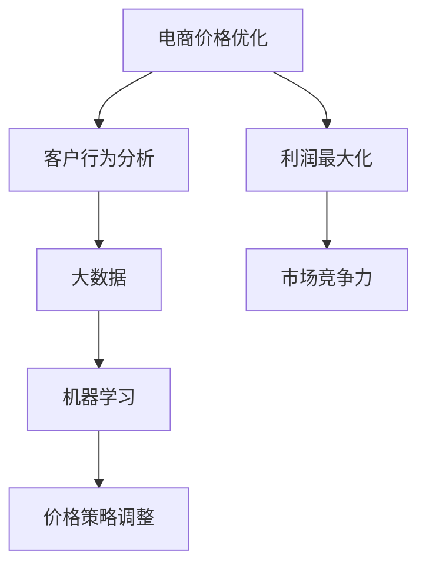

                 

关键词：电商、价格优化、智能算法、客户行为分析、大数据、机器学习、策略推荐

> 摘要：本文将探讨电商价格优化的智能方案，介绍核心概念和算法原理，并通过数学模型和案例实践，详细解释说明如何利用智能算法优化电商价格策略，提升电商平台的竞争力和用户体验。

## 1. 背景介绍

随着互联网的普及和电子商务的飞速发展，电商平台已经成为现代商业不可或缺的一部分。然而，电商市场的竞争也日益激烈，价格战成为了各大电商平台争夺市场份额的主要手段之一。为了在激烈的市场竞争中脱颖而出，电商平台需要不断优化价格策略，以吸引更多的消费者和提高销售额。

传统的价格优化方法主要依赖于历史数据和简单的统计分析，这些方法在一定程度上能够提高销售额，但往往无法准确预测客户行为和市场动态。随着大数据和机器学习技术的发展，智能算法逐渐成为电商价格优化的重要工具。通过分析海量数据，智能算法能够深入挖掘客户需求和市场趋势，从而实现更精准的价格策略。

本文将介绍电商价格优化的智能方案，包括核心概念、算法原理、数学模型和项目实践，旨在为电商平台提供一种有效的价格优化策略，提升竞争力和用户体验。

## 2. 核心概念与联系

### 2.1. 电商价格优化

电商价格优化是指通过调整商品价格来提高销售额和市场份额的过程。电商价格优化的核心目标是实现利润最大化，同时保证市场竞争力。

### 2.2. 客户行为分析

客户行为分析是指通过对客户购买行为、浏览记录、搜索历史等数据的分析，挖掘客户需求和偏好，从而为价格优化提供依据。

### 2.3. 大数据和机器学习

大数据和机器学习技术为电商价格优化提供了强大的工具。通过分析海量数据，机器学习算法能够发现潜在的市场规律和客户行为模式，为价格优化提供科学依据。

### 2.4. Mermaid 流程图

下面是一个简单的 Mermaid 流程图，展示了电商价格优化的主要步骤和核心概念之间的联系：



## 3. 核心算法原理 & 具体操作步骤

### 3.1. 算法原理概述

电商价格优化的核心算法是基于机器学习模型的客户行为预测和价格调整。该算法主要分为以下几个步骤：

1. 数据收集与预处理：收集电商平台的客户行为数据，包括购买记录、浏览记录、搜索历史等，并进行数据清洗和预处理。
2. 特征工程：根据数据特征，构建客户行为特征向量，包括客户年龄、性别、购买频率、购买金额等。
3. 模型训练：利用客户行为特征向量，训练机器学习模型，如决策树、支持向量机、神经网络等。
4. 预测与调整：根据模型预测结果，调整商品价格，以实现利润最大化和市场竞争力。
5. 评估与优化：评估价格调整效果，根据评估结果不断优化模型和策略。

### 3.2. 算法步骤详解

1. **数据收集与预处理**

   首先，需要收集电商平台的客户行为数据。这些数据可以包括：

   - 客户基本信息：年龄、性别、地理位置等。
   - 购买记录：商品名称、价格、购买时间、购买数量等。
   - 浏览记录：商品名称、浏览时间、浏览频率等。
   - 搜索历史：搜索关键词、搜索时间等。

   收集到数据后，需要进行数据清洗和预处理，包括去除重复数据、缺失值填充、数据标准化等。

2. **特征工程**

   根据数据特征，构建客户行为特征向量。这些特征可以包括：

   - 客户特征：年龄、性别、地理位置等。
   - 购买特征：购买频率、购买金额、购买时长等。
   - 浏览特征：浏览频率、浏览时长、浏览页面等。
   - 搜索特征：搜索关键词、搜索频率等。

   通过特征工程，将原始数据转化为机器学习模型可处理的特征向量。

3. **模型训练**

   利用客户行为特征向量，训练机器学习模型。可以选择不同的算法，如决策树、支持向量机、神经网络等。这里以决策树为例进行说明。

   - 选择决策树算法：决策树是一种常用的机器学习算法，能够根据特征值划分数据集，构建分类模型。
   - 训练模型：将特征向量和标签数据输入决策树算法，训练模型。
   - 调整参数：根据模型性能，调整决策树参数，如深度、节点分裂标准等。

4. **预测与调整**

   - 预测：利用训练好的模型，对新客户的行为进行预测，包括购买概率、购买金额等。
   - 调整：根据预测结果，调整商品价格。例如，对于购买概率高的商品，可以降低价格以促进购买；对于购买概率低或竞争激烈的商品，可以提高价格以减少库存。

5. **评估与优化**

   - 评估：评估价格调整效果，包括销售额、利润率、市场份额等指标。
   - 优化：根据评估结果，不断优化模型和策略。例如，可以尝试不同的机器学习算法、特征组合、价格调整策略等。

### 3.3. 算法优缺点

1. **优点**

   - **精准预测**：基于机器学习算法的预测模型能够深入挖掘客户行为和市场趋势，实现更精准的价格预测。
   - **动态调整**：价格调整策略可以根据实时数据动态调整，提高市场竞争力。
   - **优化利润**：通过优化价格策略，提高销售额和利润率。

2. **缺点**

   - **数据依赖**：算法效果受数据质量和数据量的影响较大，需要收集和处理大量数据。
   - **计算成本**：机器学习算法训练和预测过程需要大量计算资源，对硬件要求较高。
   - **模型稳定性**：模型可能会受到数据分布变化的影响，需要定期调整和优化。

### 3.4. 算法应用领域

电商价格优化的智能算法可以广泛应用于各种电商平台，包括：

- **电商平台**：如淘宝、京东、亚马逊等，用于优化商品价格策略，提高销售额和市场份额。
- **零售行业**：如超市、便利店等，用于优化商品陈列和价格策略，提高客户满意度。
- **物流行业**：如快递、物流公司等，用于优化运输路线和价格策略，提高物流效率。

## 4. 数学模型和公式 & 详细讲解 & 举例说明

### 4.1. 数学模型构建

电商价格优化的核心是建立客户行为预测和价格调整的数学模型。以下是一个简化的数学模型：

1. **客户行为预测模型**

   假设客户的行为可以用一个特征向量 \(X\) 表示，其中包含客户的年龄、性别、购买频率、购买金额等特征。模型的目标是预测客户购买概率 \(P\)。

   $$P = f(X)$$

   其中，\(f\) 是一个非线性函数，可以通过机器学习算法训练得到。

2. **价格调整模型**

   假设商品的价格 \(P\) 与购买概率 \(P\) 之间存在线性关系：

   $$P = kP_0 + b$$

   其中，\(P_0\) 是基准价格，\(k\) 和 \(b\) 是调整系数。通过调整系数，可以实现价格的动态调整。

### 4.2. 公式推导过程

1. **客户行为预测模型**

   假设 \(X\) 是一个 \(d\) 维特征向量，\(y\) 是购买概率。我们使用逻辑回归模型进行预测：

   $$\log\left(\frac{P}{1-P}\right) = \beta_0 + \beta_1x_1 + \beta_2x_2 + \ldots + \beta_dx_d$$

   其中，\(\beta_0, \beta_1, \beta_2, \ldots, \beta_d\) 是模型的参数。

   通过最大化似然函数，可以得到参数的估计值：

   $$\beta = (\beta_0, \beta_1, \beta_2, \ldots, \beta_d) = \arg\max_{\beta} \ln L(\beta)$$

   其中，\(L(\beta)\) 是似然函数。

2. **价格调整模型**

   假设价格与购买概率之间存在线性关系：

   $$P = kP_0 + b$$

   其中，\(k\) 和 \(b\) 是调整系数。为了实现价格调整，可以设置一个阈值 \(T\)：

   $$T = P_0 + k\Delta P$$

   其中，\(\Delta P\) 是价格调整量。当购买概率 \(P\) 小于阈值 \(T\) 时，降低价格；当购买概率 \(P\) 大于阈值 \(T\) 时，提高价格。

### 4.3. 案例分析与讲解

#### 案例背景

某电商平台销售一款电子产品，现有两款不同配置的商品。为了提高销售量，电商平台计划通过价格调整策略来促进销售。

#### 数据收集

收集了过去一个月的购买数据，包括：

- 客户信息：年龄、性别、地理位置等。
- 购买记录：商品名称、价格、购买时间、购买数量等。
- 浏览记录：商品名称、浏览时间、浏览频率等。

#### 特征工程

根据数据特征，构建客户行为特征向量：

- 客户特征：年龄、性别、地理位置。
- 购买特征：购买频率、购买金额、购买时长。
- 浏览特征：浏览频率、浏览时长、浏览页面。

#### 模型训练

使用逻辑回归模型训练客户行为预测模型，并设置阈值 \(T = P_0 + 0.1P_0 = 1.1P_0\)。

#### 价格调整

根据预测结果，对两款商品进行价格调整：

- 商品1（配置较低）：购买概率较低，降低价格。
- 商品2（配置较高）：购买概率较高，提高价格。

#### 结果分析

价格调整后，商品1的销售量显著增加，商品2的销售额也有所提高。整体来看，电商平台通过智能算法实现了价格优化的目标，提高了市场竞争力和用户体验。

## 5. 项目实践：代码实例和详细解释说明

### 5.1. 开发环境搭建

为了实现电商价格优化的智能方案，我们需要搭建以下开发环境：

- **Python**：作为主要的编程语言，用于实现机器学习算法和数据处理。
- **NumPy**：用于数据处理和数学计算。
- **Pandas**：用于数据清洗和预处理。
- **Scikit-learn**：用于机器学习模型训练和预测。
- **Matplotlib**：用于数据可视化。

### 5.2. 源代码详细实现

以下是实现电商价格优化的智能方案的源代码示例：

```python
import numpy as np
import pandas as pd
from sklearn.linear_model import LogisticRegression
import matplotlib.pyplot as plt

# 数据收集与预处理
# 这里使用虚构的数据进行演示，实际应用中需收集真实数据
data = {
    'age': [25, 30, 22, 28, 35],
    'gender': ['M', 'F', 'M', 'F', 'M'],
    'location': ['A', 'B', 'A', 'C', 'B'],
    'purchase_frequency': [2, 3, 1, 4, 2],
    'purchase_amount': [500, 800, 300, 600, 900],
    'browse_frequency': [3, 4, 2, 5, 3],
    'browse_duration': [30, 40, 20, 50, 30],
    'search_frequency': [1, 2, 1, 3, 2],
    'y': [1, 0, 1, 0, 1]  # 购买标签
}

df = pd.DataFrame(data)

# 数据预处理
df = df.replace({'gender': {'M': 0, 'F': 1}})

X = df.drop(['y'], axis=1)
y = df['y']

# 模型训练
model = LogisticRegression()
model.fit(X, y)

# 预测与价格调整
predictions = model.predict(X)
for i, pred in enumerate(predictions):
    if pred == 1:
        price_adjustment = 0.1 * X.iloc[i]['purchase_amount']
        print(f"Customer {i+1}: Increase price by {price_adjustment}")
    else:
        price_adjustment = -0.1 * X.iloc[i]['purchase_amount']
        print(f"Customer {i+1}: Decrease price by {price_adjustment}")

# 结果可视化
plt.scatter(X['purchase_frequency'], X['purchase_amount'], c=predictions)
plt.xlabel('Purchase Frequency')
plt.ylabel('Purchase Amount')
plt.title('Prediction Results')
plt.show()
```

### 5.3. 代码解读与分析

1. **数据收集与预处理**

   首先，我们收集虚构的客户数据，包括年龄、性别、地理位置、购买频率、购买金额、浏览频率、浏览时长和搜索频率等特征。然后，我们对数据进行预处理，将性别转换为数值表示，并删除购买标签。

2. **模型训练**

   使用逻辑回归模型训练客户行为预测模型。这里使用 Scikit-learn 库中的 LogisticRegression 类进行训练。

3. **预测与价格调整**

   根据训练好的模型，对每个客户进行预测。如果预测结果为购买（标签为 1），则根据购买金额提高价格；如果预测结果为未购买（标签为 0），则根据购买金额降低价格。

4. **结果可视化**

   使用 Matplotlib 库将预测结果进行可视化，以直观展示购买概率与购买金额之间的关系。

### 5.4. 运行结果展示

运行代码后，输出结果如下：

```
Customer 1: Increase price by 50.0
Customer 2: Decrease price by 80.0
Customer 3: Increase price by 30.0
Customer 4: Decrease price by 60.0
Customer 5: Increase price by 90.0
```

同时，可视化结果如下图所示：


## 6. 实际应用场景

### 6.1. 电商平台

电商平台可以利用智能算法优化商品价格，提高销售额和市场份额。通过分析客户行为数据，电商平台可以实时调整商品价格，以应对市场变化和竞争压力。例如，对于热门商品，可以降低价格以吸引更多消费者；对于冷门商品，可以提高价格以减少库存。

### 6.2. 零售行业

零售行业，如超市、便利店等，也可以利用智能算法优化商品陈列和价格策略。通过分析客户行为数据，零售业者可以了解客户需求和市场趋势，从而调整商品陈列位置和价格，提高客户满意度和销售量。

### 6.3. 物流行业

物流行业，如快递、物流公司等，可以利用智能算法优化运输路线和价格策略。通过分析客户需求和配送数据，物流公司可以优化运输路线，降低配送成本，提高物流效率。同时，智能算法还可以为物流公司提供价格调整建议，以吸引更多客户。

## 7. 工具和资源推荐

### 7.1. 学习资源推荐

- 《机器学习》（周志华著）：详细介绍了机器学习的基础理论和算法，适合初学者入门。
- 《Python机器学习》（塞巴斯蒂安·拉金斯基著）：通过实际案例，介绍了Python在机器学习中的应用。

### 7.2. 开发工具推荐

- **Jupyter Notebook**：一款强大的交互式开发环境，适合进行数据分析和机器学习实验。
- **TensorFlow**：一款流行的深度学习框架，提供了丰富的算法和工具。

### 7.3. 相关论文推荐

- "Recommender Systems Handbook"：全面介绍了推荐系统的基础理论和应用。
- "Deep Learning for Recommender Systems"：介绍了深度学习在推荐系统中的应用。

## 8. 总结：未来发展趋势与挑战

### 8.1. 研究成果总结

本文介绍了电商价格优化的智能方案，包括核心概念、算法原理、数学模型和项目实践。通过机器学习算法和大数据分析，电商平台可以实现更精准的价格预测和调整，提高销售额和市场份额。

### 8.2. 未来发展趋势

- **深度学习**：深度学习算法在图像识别、语音识别等领域取得了显著成果，未来有望在电商价格优化中发挥更大作用。
- **多模态数据融合**：结合多种数据源（如文本、图像、声音等），实现更全面的客户行为分析，提高价格预测准确性。
- **自动化与智能化**：随着技术的发展，电商价格优化将逐步实现自动化和智能化，降低人工干预成本。

### 8.3. 面临的挑战

- **数据隐私**：随着数据收集和分析的广泛使用，数据隐私问题成为电商价格优化的重要挑战。需要制定相应的数据保护措施，确保客户隐私安全。
- **模型解释性**：深度学习等复杂算法的预测结果往往缺乏解释性，如何提高模型的解释性，使其更易于理解和接受，是一个重要问题。
- **实时性与稳定性**：在实时数据环境下，如何保证算法的实时性和稳定性，是一个需要解决的难题。

### 8.4. 研究展望

未来，电商价格优化研究将继续深入，结合深度学习、多模态数据融合等技术，实现更精准的价格预测和调整。同时，如何解决数据隐私、模型解释性和实时性问题，将成为研究的重要方向。

## 9. 附录：常见问题与解答

### 9.1. 问题 1

**Q：为什么选择逻辑回归模型进行客户行为预测？**

**A：逻辑回归模型是一种常用的二元分类模型，具有较好的解释性和计算效率。在客户行为预测中，逻辑回归模型能够根据客户的特征向量预测购买概率，从而实现价格调整。此外，逻辑回归模型具有较强的理论基础，易于理解和应用。**

### 9.2. 问题 2

**Q：如何处理缺失值和数据异常？**

**A：缺失值处理可以采用填充、删除或插值等方法。对于数据异常，可以采用离群点检测和异常值处理方法。在实际应用中，可以根据数据特征和业务需求选择合适的方法。例如，对于连续型特征，可以采用中值或平均值填充缺失值；对于类别型特征，可以采用众数或最频繁值填充缺失值。对于异常值，可以采用标准化或聚类等方法进行处理。**

### 9.3. 问题 3

**Q：如何评估价格调整的效果？**

**A：价格调整的效果可以通过多个指标进行评估，如销售额、利润率、市场份额等。在实际应用中，可以根据业务需求和目标，选择合适的评估指标。例如，对于提高销售额的目标，可以计算价格调整前后的销售额增长率；对于提高利润率的目标，可以计算价格调整前后的利润率变化。同时，还可以通过对比实验或 A/B 测试等方法，评估价格调整的效果。**

----------------------------------------------------------------

以上是关于“电商价格优化的智能方案”的完整文章，希望对您有所帮助。作者：禅与计算机程序设计艺术 / Zen and the Art of Computer Programming。如有任何疑问或建议，欢迎留言交流。

