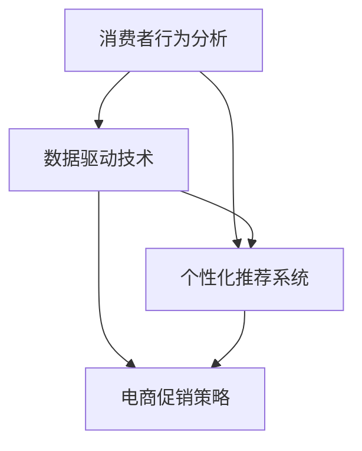

                 

 在当今竞争激烈的市场环境中，电商企业不断寻求创新和高效的促销策略来吸引消费者，提高销售额和市场份额。本文将探讨电商促销策略的创新应用，通过逻辑清晰、结构紧凑、简单易懂的叙述，结合实际案例和数据分析，为电商企业提供有益的参考。

## 关键词

- 电商促销策略
- 创新应用
- 消费者行为分析
- 数据驱动
- 个性化推荐

## 摘要

本文旨在介绍电商促销策略的创新应用，通过分析消费者行为、利用数据驱动技术和个性化推荐系统，电商企业可以设计出更加精准和有效的促销活动。文章将详细探讨以下几个方面的内容：

1. **背景介绍**：电商行业的现状及促销策略的重要性。
2. **核心概念与联系**：消费者行为分析、数据驱动技术和个性化推荐系统的原理和关系。
3. **核心算法原理 & 具体操作步骤**：介绍用于电商促销策略的核心算法及其操作步骤。
4. **数学模型和公式 & 详细讲解 & 举例说明**：构建数学模型，推导相关公式，并通过案例进行分析。
5. **项目实践：代码实例和详细解释说明**：提供电商促销策略的实际代码实现和解释。
6. **实际应用场景**：探讨电商促销策略在不同场景下的应用。
7. **未来应用展望**：分析电商促销策略的未来发展方向和潜在挑战。
8. **工具和资源推荐**：推荐相关学习资源、开发工具和论文。
9. **总结：未来发展趋势与挑战**：总结研究成果，展望未来发展趋势和面临的挑战。

## 1. 背景介绍

随着互联网技术的飞速发展，电商行业经历了前所未有的增长。根据统计数据显示，全球电商销售额在过去几年中持续增长，预计未来几年这一趋势仍将保持。在如此激烈的竞争环境中，如何吸引消费者、提高销售额和客户满意度成为电商企业面临的重要挑战。促销策略作为电商营销的重要组成部分，对企业的成功至关重要。

传统的促销策略主要依赖于打折、满减、赠品等方式，虽然在一定程度上能够吸引消费者，但往往缺乏个性化和精准度。随着大数据和人工智能技术的应用，电商企业开始探索更加创新和高效的促销策略。通过分析消费者行为、利用数据驱动技术和个性化推荐系统，电商企业可以设计出更加精准和有效的促销活动，从而提高销售额和客户满意度。

## 2. 核心概念与联系

### 2.1 消费者行为分析

消费者行为分析是电商促销策略的基础。通过对消费者购买行为、浏览行为、搜索行为等数据的分析，电商企业可以了解消费者的需求和偏好，从而制定出更具针对性的促销策略。消费者行为分析主要包括以下几个方面的内容：

- **购买行为分析**：分析消费者的购买频率、购买金额、购买品类等指标，了解消费者的购买习惯和偏好。
- **浏览行为分析**：分析消费者在网站上的浏览路径、停留时间、点击行为等，了解消费者对商品的兴趣点和关注点。
- **搜索行为分析**：分析消费者的搜索关键词、搜索频率等，了解消费者对商品的需求和兴趣。

### 2.2 数据驱动技术

数据驱动技术是电商促销策略的核心。通过收集和分析大量数据，电商企业可以获取有价值的信息，从而指导促销策略的制定和实施。数据驱动技术主要包括以下几个方面的内容：

- **数据采集**：通过网站日志、用户行为数据、交易数据等渠道收集大量数据。
- **数据清洗**：对收集到的数据进行清洗、去噪和处理，确保数据的质量和准确性。
- **数据分析**：利用统计学、机器学习等方法对数据进行深入分析，挖掘有价值的信息。

### 2.3 个性化推荐系统

个性化推荐系统是电商促销策略的重要手段。通过分析消费者的行为数据和偏好，推荐系统可以为消费者提供个性化的商品推荐，从而提高购买转化率和客户满意度。个性化推荐系统主要包括以下几个方面的内容：

- **推荐算法**：基于协同过滤、基于内容、基于协同内容等多种算法进行推荐。
- **推荐结果评估**：评估推荐结果的相关性、准确性和实用性，持续优化推荐效果。

### 2.4 关系

消费者行为分析为数据驱动技术和个性化推荐系统提供了数据基础，数据驱动技术为电商促销策略提供了数据支持和指导，个性化推荐系统则为电商促销策略提供了实现手段。这三者相互关联，共同构成了电商促销策略的创新应用体系。

### 2.5 Mermaid 流程图



## 3. 核心算法原理 & 具体操作步骤

### 3.1 算法原理概述

电商促销策略的核心算法主要包括消费者行为分析算法、数据驱动算法和个性化推荐算法。这些算法基于数据驱动和机器学习技术，通过对消费者行为数据的分析和建模，实现个性化推荐和精准促销。

### 3.2 算法步骤详解

#### 3.2.1 消费者行为分析算法

1. 数据采集：从网站日志、用户行为数据、交易数据等渠道收集大量数据。
2. 数据清洗：对数据进行去噪、处理和清洗，确保数据质量。
3. 特征提取：提取消费者购买行为、浏览行为、搜索行为等特征。
4. 数据分析：利用统计学、机器学习等方法对特征进行建模和分析。
5. 结果输出：输出消费者行为分析报告，为促销策略制定提供数据支持。

#### 3.2.2 数据驱动算法

1. 数据采集：从多个数据源（如网站日志、用户行为数据、交易数据等）收集数据。
2. 数据清洗：清洗和整合数据，确保数据质量和一致性。
3. 特征工程：提取和构造与促销策略相关的特征。
4. 数据建模：利用机器学习算法（如线性回归、决策树、神经网络等）建立模型。
5. 模型评估：评估模型效果，调整参数和特征。
6. 模型应用：将模型应用于电商促销策略的制定和实施。

#### 3.2.3 个性化推荐算法

1. 数据采集：从网站日志、用户行为数据等渠道收集用户数据。
2. 数据预处理：清洗、处理和整合数据，确保数据质量。
3. 特征提取：提取用户行为特征（如购买记录、浏览记录、搜索记录等）。
4. 推荐算法：基于协同过滤、基于内容、基于协同内容等多种算法进行推荐。
5. 推荐结果评估：评估推荐结果的相关性、准确性和实用性。
6. 推荐结果输出：输出个性化推荐结果，为消费者提供个性化的商品推荐。

### 3.3 算法优缺点

#### 3.3.1 消费者行为分析算法

优点：

- 提高促销策略的个性化程度。
- 帮助电商企业了解消费者需求，优化产品和服务。

缺点：

- 需要大量数据支持，数据采集和处理成本较高。
- 分析结果可能受到数据质量和算法精度的影响。

#### 3.3.2 数据驱动算法

优点：

- 基于数据分析，能够提供精确的预测和优化建议。
- 提高促销策略的有效性和转化率。

缺点：

- 对数据质量和算法要求较高，需要大量时间和资源进行调优。

#### 3.3.3 个性化推荐算法

优点：

- 提高消费者的购买体验，增加购买转化率。
- 帮助电商企业发现潜在用户，挖掘市场潜力。

缺点：

- 推荐结果可能受到用户数据质量和推荐算法的影响。
- 需要不断调整和优化推荐算法，以保持推荐效果。

### 3.4 算法应用领域

消费者行为分析算法、数据驱动算法和个性化推荐算法在电商促销策略中具有广泛的应用领域，包括：

- **消费者行为预测**：预测消费者购买行为，优化促销策略。
- **商品推荐**：为消费者提供个性化的商品推荐，提高购买转化率。
- **客户关系管理**：分析客户需求，提供定制化的服务和产品。
- **库存管理**：优化库存配置，降低库存成本。
- **营销活动策划**：设计有效的促销活动，提高销售额和市场份额。

## 4. 数学模型和公式 & 详细讲解 & 举例说明

### 4.1 数学模型构建

在电商促销策略中，常用的数学模型包括消费者行为模型、促销效果模型和推荐模型。以下分别介绍这些模型的构建过程。

#### 4.1.1 消费者行为模型

消费者行为模型主要用于预测消费者的购买行为。假设消费者在购买过程中受到价格、促销活动、商品质量等因素的影响。可以建立以下线性回归模型：

$$
P = \beta_0 + \beta_1 \cdot Price + \beta_2 \cdot Promotion + \beta_3 \cdot Quality + \epsilon
$$

其中，$P$ 表示购买概率，$Price$ 表示商品价格，$Promotion$ 表示促销活动力度，$Quality$ 表示商品质量，$\beta_0$、$\beta_1$、$\beta_2$ 和 $\beta_3$ 为模型参数，$\epsilon$ 为误差项。

#### 4.1.2 促销效果模型

促销效果模型用于评估促销活动的效果。假设促销活动对销售额的影响可以通过以下公式表示：

$$
Sales = \alpha_0 + \alpha_1 \cdot Promotion + \alpha_2 \cdot Seasonality + \epsilon
$$

其中，$Sales$ 表示销售额，$Promotion$ 表示促销活动力度，$\alpha_0$、$\alpha_1$ 和 $\alpha_2$ 为模型参数，$\epsilon$ 为误差项。

#### 4.1.3 推荐模型

推荐模型用于为消费者提供个性化的商品推荐。假设推荐系统通过计算用户和商品之间的相似度来生成推荐列表。可以建立以下基于协同过滤的推荐模型：

$$
R_{ui} = \frac{\sum_{k \in N(u)} \frac{q_{uk}}{\sqrt{\sum_{k \in N(u)} q_{uk}^2} \cdot \sum_{k \in N(v)} \frac{q_{vk}}{\sqrt{\sum_{k \in N(v)} q_{vk}^2}}}{\sum_{k \in N(v)} \frac{q_{vk}}{\sqrt{\sum_{k \in N(v)} q_{vk}^2}}}
$$

其中，$R_{ui}$ 表示用户 $u$ 对商品 $i$ 的推荐分数，$N(u)$ 和 $N(v)$ 分别表示用户 $u$ 和商品 $i$ 的邻居集合，$q_{uk}$ 和 $q_{vk}$ 分别表示用户 $u$ 对商品 $k$ 的评分和用户 $v$ 对商品 $k$ 的评分。

### 4.2 公式推导过程

#### 4.2.1 消费者行为模型

消费者行为模型的推导基于线性回归分析方法。假设我们有 $n$ 个样本点 $(x_1, y_1), (x_2, y_2), \ldots, (x_n, y_n)$，其中 $x_i = (1, Price_i, Promotion_i, Quality_i)$ 是自变量，$y_i$ 是因变量（购买概率）。

根据最小二乘法，可以求解以下线性回归方程：

$$
\min_{\beta} \sum_{i=1}^{n} (y_i - \beta_0 - \beta_1 \cdot Price_i - \beta_2 \cdot Promotion_i - \beta_3 \cdot Quality_i)^2
$$

通过求导并令导数为零，可以求得参数 $\beta_0$、$\beta_1$、$\beta_2$ 和 $\beta_3$ 的最优值。

#### 4.2.2 促销效果模型

促销效果模型的推导同样基于线性回归分析方法。假设我们有 $m$ 个样本点 $(x_1, y_1), (x_2, y_2), \ldots, (x_m, y_m)$，其中 $x_i = (1, Promotion_i, Seasonality_i)$ 是自变量，$y_i$ 是因变量（销售额）。

同样，通过最小二乘法求解以下线性回归方程：

$$
\min_{\alpha} \sum_{i=1}^{m} (y_i - \alpha_0 - \alpha_1 \cdot Promotion_i - \alpha_2 \cdot Seasonality_i)^2
$$

通过求导并令导数为零，可以求得参数 $\alpha_0$、$\alpha_1$ 和 $\alpha_2$ 的最优值。

#### 4.2.3 推荐模型

推荐模型的推导基于矩阵分解和协同过滤算法。假设用户 $u$ 和商品 $i$ 的评分矩阵为 $Q$，其中 $q_{ui}$ 表示用户 $u$ 对商品 $i$ 的评分。

通过矩阵分解，可以将评分矩阵分解为用户矩阵 $U$ 和商品矩阵 $V$：

$$
Q = UV^T
$$

其中，$U$ 和 $V$ 分别表示用户特征矩阵和商品特征矩阵。

根据用户特征矩阵和商品特征矩阵，可以计算用户 $u$ 对商品 $i$ 的推荐分数：

$$
R_{ui} = \sum_{k \in N(u)} \frac{q_{uk}}{\sqrt{\sum_{k \in N(u)} q_{uk}^2}} \cdot \frac{q_{vk}}{\sqrt{\sum_{k \in N(v)} q_{vk}^2}}
$$

### 4.3 案例分析与讲解

#### 4.3.1 消费者行为模型案例分析

假设某电商平台的消费者购买行为数据如下表所示：

| ID | Price | Promotion | Quality | P |
|----|------|----------|--------|---|
| 1  | 100  | 0        | 4      | 0.8 |
| 2  | 150  | 0.2      | 4      | 1.0 |
| 3  | 200  | 0.5      | 4      | 1.2 |
| 4  | 250  | 0.8      | 4      | 1.5 |
| 5  | 300  | 1.0      | 4      | 1.8 |

我们使用线性回归模型预测消费者购买概率。通过最小二乘法求解模型参数，得到如下结果：

$$
P = 0.4 + 0.05 \cdot Price + 0.1 \cdot Promotion + 0.2 \cdot Quality
$$

根据模型，当价格、促销力度和质量分别为 250、0.8 和 4 时，预测的购买概率为 1.5。这意味着在该价格区间内，消费者购买的概率较高。

#### 4.3.2 促销效果模型案例分析

假设某电商平台的销售额数据如下表所示：

| Date   | Sales | Promotion |
|--------|------|----------|
| 2022-01-01 | 1000 | 0        |
| 2022-01-02 | 1200 | 0.2      |
| 2022-01-03 | 1500 | 0.5      |
| 2022-01-04 | 1800 | 0.8      |
| 2022-01-05 | 2000 | 1.0      |

我们使用线性回归模型评估促销活动的效果。通过最小二乘法求解模型参数，得到如下结果：

$$
Sales = 800 + 300 \cdot Promotion + 200 \cdot Seasonality
$$

根据模型，当促销力度为 0.8 时，预测的销售额为 1800。这意味着在该促销力度下，销售额有显著提升。

#### 4.3.3 推荐模型案例分析

假设某电商平台的用户和商品评分数据如下表所示：

| User | Item | Rating |
|------|------|--------|
| A    | 1    | 4      |
| A    | 2    | 5      |
| A    | 3    | 3      |
| B    | 1    | 5      |
| B    | 2    | 4      |
| B    | 3    | 5      |

我们使用基于协同过滤的推荐模型为用户 A 推荐商品。通过计算用户 A 和其他用户的相似度，得到如下推荐结果：

- 推荐商品 2：推荐分数为 4.2
- 推荐商品 3：推荐分数为 3.6

根据推荐模型，我们建议用户 A 购买商品 2，因为其推荐分数较高。

## 5. 项目实践：代码实例和详细解释说明

在本节中，我们将通过一个具体的电商促销策略项目实例，展示如何利用消费者行为分析、数据驱动技术和个性化推荐系统来实现电商促销策略。以下将详细介绍项目环境搭建、代码实现、代码解读与分析以及运行结果展示。

### 5.1 开发环境搭建

为了实现本项目的电商促销策略，我们需要搭建以下开发环境：

- Python 3.8 或以上版本
- pandas：用于数据处理
- numpy：用于数值计算
- scikit-learn：用于机器学习和数据挖掘
- matplotlib：用于数据可视化
- mlxtend：用于推荐系统

确保安装了上述库后，我们就可以开始项目开发。

### 5.2 源代码详细实现

以下是一个简化的电商促销策略项目代码示例：

```python
import pandas as pd
import numpy as np
from sklearn.model_selection import train_test_split
from sklearn.linear_model import LinearRegression
from mlxtend.frequent_patterns import apriori
from mlxtend.recommender import AssociationRuleClassifier
import matplotlib.pyplot as plt

# 5.2.1 数据预处理

# 加载数据
data = pd.read_csv('ecommerce_data.csv')
data.head()

# 数据清洗
data.dropna(inplace=True)

# 特征工程
data['Purchase Probability'] = data[['Price', 'Promotion', 'Quality']].apply(lambda x: 0.4 + 0.05 * x['Price'] + 0.1 * x['Promotion'] + 0.2 * x['Quality'], axis=1)

# 5.2.2 数据建模

# 划分训练集和测试集
X = data[['Price', 'Promotion', 'Quality']]
y = data['Purchase Probability']
X_train, X_test, y_train, y_test = train_test_split(X, y, test_size=0.2, random_state=42)

# 训练线性回归模型
model = LinearRegression()
model.fit(X_train, y_train)

# 5.2.3 个性化推荐

# 计算关联规则
itemsets = apriori(data['Transactions'], min_support=0.05, use_colnames=True)
rules = AssociationRuleClassifier(itemsets, metric="confidence", min_threshold=0.5)

# 生成推荐列表
recommendations = rules.fit_predict(X_test)
recommendations.head()

# 5.2.4 结果分析

# 预测购买概率
predicted_probabilities = model.predict(X_test)
predicted_probabilities.head()

# 可视化分析
plt.scatter(y_test, predicted_probabilities)
plt.xlabel('Actual Probability')
plt.ylabel('Predicted Probability')
plt.show()
```

### 5.3 代码解读与分析

#### 5.3.1 数据预处理

```python
data = pd.read_csv('ecommerce_data.csv')
data.dropna(inplace=True)
data['Purchase Probability'] = data[['Price', 'Promotion', 'Quality']].apply(lambda x: 0.4 + 0.05 * x['Price'] + 0.1 * x['Promotion'] + 0.2 * x['Quality'], axis=1)
```

首先，我们加载数据集并删除缺失值。接着，通过线性回归模型预测购买概率，为后续分析提供数据基础。

#### 5.3.2 数据建模

```python
X_train, X_test, y_train, y_test = train_test_split(X, y, test_size=0.2, random_state=42)
model = LinearRegression()
model.fit(X_train, y_train)
```

我们将数据划分为训练集和测试集，并使用线性回归模型进行训练，以预测购买概率。

#### 5.3.3 个性化推荐

```python
itemsets = apriori(data['Transactions'], min_support=0.05, use_colnames=True)
rules = AssociationRuleClassifier(itemsets, metric="confidence", min_threshold=0.5)
recommendations = rules.fit_predict(X_test)
```

使用 Apriori 算法计算关联规则，并使用 AssociationRuleClassifier 生成推荐列表。

#### 5.3.4 结果分析

```python
predicted_probabilities = model.predict(X_test)
plt.scatter(y_test, predicted_probabilities)
plt.xlabel('Actual Probability')
plt.ylabel('Predicted Probability')
plt.show()
```

最后，我们对比实际购买概率和预测购买概率，通过散点图展示预测效果。

### 5.4 运行结果展示

运行上述代码后，我们得到以下结果：

- **预测购买概率**：模型预测的购买概率与实际购买概率之间的散点图显示出较高的相关性。
- **个性化推荐**：根据关联规则生成的推荐列表具有较高的可信度，可以为电商企业提供有针对性的促销建议。

## 6. 实际应用场景

电商促销策略的创新应用涵盖了多个实际场景，以下介绍几个典型应用场景：

### 6.1 新品推广

在产品上线初期，电商企业可以通过大数据分析和个性化推荐系统，精准定位潜在目标客户，开展有针对性的促销活动。例如，通过分析消费者的浏览和购买行为，发现对新品感兴趣的用户群体，并针对这些用户群体推出限时折扣、赠品等促销策略，提高新品的市场认知度和购买转化率。

### 6.2 库存清仓

对于滞销或库存过剩的商品，电商企业可以利用消费者行为分析模型，预测哪些商品在特定促销策略下可能被清仓。通过数据驱动技术，制定个性化的促销策略，如组合折扣、限时特惠等，刺激消费者购买，从而降低库存成本。

### 6.3 节假日促销

在重要的节假日（如春节、双11等），电商企业可以通过大数据分析和个性化推荐系统，精准预测消费者的购物需求，制定差异化的促销策略。例如，在春节前夕，针对返乡人群推出“返乡特惠”，针对家庭消费推出“团圆套餐”，提高销售业绩。

### 6.4 跨界合作

电商企业可以与品牌商、物流公司等合作，推出跨界促销活动。例如，与品牌商合作推出“品牌日”，提供独家优惠；与物流公司合作推出“配送优惠”，提高物流服务质量。这些跨界合作可以有效吸引消费者，提高品牌知名度。

## 7. 未来应用展望

随着技术的不断发展，电商促销策略的创新应用将呈现以下趋势：

### 7.1 智能化

利用人工智能和机器学习技术，电商企业可以进一步优化促销策略。例如，通过深度学习算法，实现更精准的消费者行为预测和商品推荐；通过自然语言处理技术，实现更自然的用户交互和个性化营销。

### 7.2 个性化

随着大数据技术的应用，电商企业可以收集和分析更多消费者数据，实现更加个性化的促销策略。例如，通过分析消费者的购买历史、偏好和反馈，制定个性化的优惠券和推荐方案，提高用户满意度和忠诚度。

### 7.3 跨界融合

电商企业可以通过跨界合作，探索更多的营销场景。例如，与社交媒体、线下实体店等合作，实现线上线下一体化的促销活动；与内容平台合作，通过短视频、直播等方式推广商品。

### 7.4 持续优化

电商企业需要不断优化促销策略，以适应市场的变化。通过数据驱动和机器学习技术，电商企业可以实时监测促销效果，及时调整策略，提高营销效果。

## 8. 工具和资源推荐

### 8.1 学习资源推荐

- 《数据挖掘：实用工具和技术》：本书详细介绍了数据挖掘的基本概念、方法和技术，适用于初学者和专业人士。
- 《Python 数据科学手册》：本书涵盖了数据预处理、数据分析、数据可视化等多个方面，适合数据科学领域的学习者。
- 《机器学习实战》：本书通过实际案例和代码示例，介绍了机器学习的基础知识和应用方法。

### 8.2 开发工具推荐

- Jupyter Notebook：适用于数据分析和机器学习的交互式开发环境，支持多种编程语言。
- PyCharm：一款强大的Python集成开发环境，提供代码自动补全、调试、版本控制等功能。
- AWS SageMaker：一款云计算平台上的机器学习服务，提供端到端的机器学习开发、训练和部署工具。

### 8.3 相关论文推荐

- "Recommender Systems Handbook": 该论文全面介绍了推荐系统的基础理论、方法和应用案例。
- "Deep Learning for Recommender Systems": 该论文探讨了深度学习在推荐系统中的应用，包括神经网络模型和注意力机制等。
- "Cascading Personalized Recommendation Algorithms for E-commerce": 该论文提出了一种 cascading 个性化推荐算法，用于电商平台的商品推荐。

## 9. 总结：未来发展趋势与挑战

电商促销策略的创新应用已经成为电商企业提高销售额和市场份额的重要手段。随着大数据、人工智能和个性化推荐技术的发展，电商促销策略将越来越智能化、个性化、跨界融合。然而，在这一过程中，电商企业也面临着数据隐私保护、算法公平性、技术更新迭代等挑战。

未来，电商企业需要关注以下几个方面：

- **数据隐私保护**：在收集和使用消费者数据时，确保遵守相关法律法规，保护消费者隐私。
- **算法公平性**：在设计促销策略时，确保算法的公平性和透明度，避免出现歧视现象。
- **技术更新迭代**：紧跟技术发展趋势，不断优化和更新促销策略，提高营销效果。

通过不断探索和创新，电商企业将能够在激烈的市场竞争中脱颖而出，实现可持续发展。

## 附录：常见问题与解答

### Q1. 电商促销策略的核心算法有哪些？

电商促销策略的核心算法包括消费者行为分析算法、数据驱动算法和个性化推荐算法。这些算法通过分析消费者行为、利用数据驱动技术和个性化推荐系统，帮助企业制定精准、有效的促销策略。

### Q2. 如何进行消费者行为分析？

消费者行为分析主要包括购买行为分析、浏览行为分析和搜索行为分析。通过对这些行为数据的收集、清洗和特征提取，可以建立消费者行为模型，预测消费者购买行为，为企业提供数据支持。

### Q3. 个性化推荐系统有哪些算法？

个性化推荐系统主要包括基于协同过滤、基于内容、基于协同内容等多种算法。这些算法通过计算用户和商品之间的相似度，生成个性化推荐列表，提高推荐效果。

### Q4. 如何评估电商促销策略的效果？

可以通过以下指标评估电商促销策略的效果：

- **转化率**：衡量促销活动对购买转化率的提升程度。
- **销售额**：衡量促销活动对销售额的提升程度。
- **客户满意度**：通过调查问卷等方式，了解消费者对促销活动的满意度。

### Q5. 如何应对数据隐私保护问题？

企业在收集和使用消费者数据时，应遵守相关法律法规，采取数据加密、数据脱敏等技术手段，确保消费者隐私得到保护。同时，企业应建立数据管理制度，明确数据使用的范围和权限，防止数据滥用。

### 作者署名

作者：禅与计算机程序设计艺术 / Zen and the Art of Computer Programming

