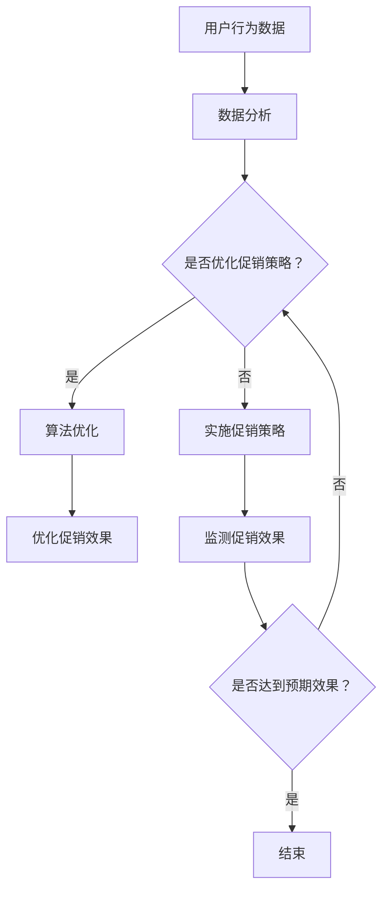

                 

关键词：电商、促销策略、数据分析、用户行为、算法优化

> 摘要：本文将探讨电商促销策略的应用案例，通过深入分析用户行为、市场趋势和算法优化，探讨如何有效实施促销策略，提高电商平台的销售额和用户满意度。

## 1. 背景介绍

随着互联网的普及和电子商务的快速发展，电商平台已经成为消费者购买商品的主要渠道之一。为了吸引更多的用户和提升销售额，电商平台不断尝试各种促销策略，如折扣、满减、赠品、优惠券等。然而，不同促销策略的效果因平台、产品、用户群体等因素而异，因此需要根据实际情况进行优化和调整。

本文将结合实际案例，探讨电商促销策略的制定、实施和优化过程，通过数据分析、用户行为分析和算法优化等技术手段，提高促销策略的有效性和用户体验。

## 2. 核心概念与联系

### 2.1 电商促销策略

电商促销策略是指电商平台为了提高销售额、吸引新用户和提升用户忠诚度而采取的一系列营销手段。常见的促销策略包括：

- **折扣促销**：对商品进行价格折扣，吸引用户购买。
- **满减促销**：当用户购买金额达到一定额度时，可以享受减价优惠。
- **赠品促销**：购买指定商品时，赠送相关商品或赠品。
- **优惠券促销**：发放优惠券，用户在购买商品时可以抵扣一定金额。

### 2.2 用户行为分析

用户行为分析是指通过分析用户在电商平台上的行为数据，了解用户偏好、购买习惯和消费心理等。用户行为分析可以帮助电商平台：

- 了解用户需求，优化商品推荐。
- 提高用户满意度，提升用户留存率。
- 预测用户购买行为，制定更有效的促销策略。

### 2.3 数据分析与算法优化

数据分析是指通过对大量数据进行分析，提取有价值的信息和规律。在电商促销策略中，数据分析可以帮助电商平台：

- 分析市场趋势，预测未来销售情况。
- 了解用户需求，优化促销策略。
- 优化算法，提高促销效果。

算法优化是指通过改进算法和模型，提高促销策略的准确性和效果。常见的算法优化技术包括：

- **机器学习**：通过训练模型，预测用户购买行为和市场需求。
- **深度学习**：通过神经网络模型，实现更复杂的促销策略优化。
- **优化算法**：通过改进算法，提高促销效果的准确性和效率。

### 2.4 Mermaid 流程图



## 3. 核心算法原理 & 具体操作步骤

### 3.1 算法原理概述

在电商促销策略中，核心算法主要分为两个部分：用户行为分析和促销策略优化。用户行为分析主要基于机器学习和深度学习技术，通过对用户历史行为数据进行分析，预测用户购买行为和需求。促销策略优化则通过优化算法，调整促销策略，提高促销效果。

### 3.2 算法步骤详解

1. **用户行为数据收集**：收集用户在电商平台上的浏览、搜索、购买等行为数据。

2. **数据预处理**：对收集到的数据进行清洗、去重、归一化等预处理操作。

3. **特征工程**：根据用户行为数据，提取有价值的特征，如用户活跃度、购买频率、购买金额等。

4. **用户行为预测**：使用机器学习或深度学习算法，对用户购买行为进行预测。

5. **促销策略优化**：根据用户行为预测结果，调整促销策略，如折扣力度、优惠券发放等。

6. **促销效果评估**：实施促销策略后，监测用户购买行为和销售额，评估促销效果。

7. **算法优化**：根据促销效果评估结果，不断调整和优化算法，提高促销策略的准确性和效果。

### 3.3 算法优缺点

#### 优点

- **提高销售额**：通过预测用户购买行为和优化促销策略，可以提高电商平台的销售额。
- **提升用户体验**：根据用户需求和偏好，提供个性化的促销策略，提高用户满意度。
- **降低营销成本**：通过数据分析和算法优化，可以降低营销成本，提高营销效率。

#### 缺点

- **数据依赖性强**：算法优化和促销策略实施高度依赖用户行为数据，数据质量直接影响算法效果。
- **算法复杂性高**：机器学习和深度学习算法复杂度高，对计算资源和算法调优要求较高。

### 3.4 算法应用领域

- **电商促销策略**：根据用户行为预测和需求，优化电商平台的促销策略。
- **广告投放优化**：根据用户兴趣和行为，优化广告投放策略，提高广告效果。
- **个性化推荐**：根据用户行为和偏好，提供个性化的商品推荐，提升用户体验。

## 4. 数学模型和公式 & 详细讲解 & 举例说明

### 4.1 数学模型构建

在电商促销策略中，常见的数学模型包括用户行为预测模型和促销效果评估模型。以下是一个简单的用户行为预测模型：

#### 用户行为预测模型

假设用户行为数据包括三个特征：用户活跃度、购买频率和购买金额，分别表示为 \( x_1, x_2, x_3 \)。用户购买概率 \( P \) 可以表示为：

$$
P = f(x_1, x_2, x_3)
$$

其中，\( f \) 是一个预测函数，可以通过机器学习算法训练得到。

#### 促销效果评估模型

假设促销策略实施后，用户购买概率提高了 \( \Delta P \)。促销效果评估可以通过以下公式计算：

$$
\text{促销效果} = \frac{\text{销售额增加量}}{\text{促销成本}} = \frac{\Delta \text{销售额}}{\Delta \text{成本}} = \frac{\Delta P \cdot \text{原销售额}}{\Delta P \cdot \text{原成本} + \text{促销成本}}
$$

### 4.2 公式推导过程

#### 用户行为预测模型

假设用户活跃度、购买频率和购买金额之间的相关性可以用线性模型表示：

$$
x_1 = \alpha_1 + \beta_1 y_1 + \epsilon_1
$$

$$
x_2 = \alpha_2 + \beta_2 y_2 + \epsilon_2
$$

$$
x_3 = \alpha_3 + \beta_3 y_3 + \epsilon_3
$$

其中，\( y_1, y_2, y_3 \) 分别表示用户活跃度、购买频率和购买金额的预测值，\( \alpha_1, \alpha_2, \alpha_3, \beta_1, \beta_2, \beta_3 \) 为模型参数，\( \epsilon_1, \epsilon_2, \epsilon_3 \) 为误差项。

将上述三个方程联立，可以求解出用户活跃度、购买频率和购买金额的预测值：

$$
y_1 = \frac{x_1 - \alpha_1 - \beta_1 x_2}{\beta_1}
$$

$$
y_2 = \frac{x_2 - \alpha_2 - \beta_2 x_3}{\beta_2}
$$

$$
y_3 = \frac{x_3 - \alpha_3 - \beta_3 x_1}{\beta_3}
$$

将 \( y_1, y_2, y_3 \) 代入购买概率公式，可以得到：

$$
P = f(x_1, x_2, x_3) = f\left(\alpha_1 + \beta_1 y_1, \alpha_2 + \beta_2 y_2, \alpha_3 + \beta_3 y_3\right)
$$

通过训练机器学习模型，可以求解出 \( f \) 的具体形式。

#### 促销效果评估模型

假设原销售额为 \( S \)，原成本为 \( C \)，实施促销策略后，销售额增加了 \( \Delta S \)，成本增加了 \( \Delta C \)。则促销效果可以表示为：

$$
\text{促销效果} = \frac{\Delta S}{\Delta C} = \frac{S + \Delta S - C}{C + \Delta C}
$$

通过简化上述公式，可以得到：

$$
\text{促销效果} = \frac{\Delta P \cdot S}{\Delta P \cdot C + S}
$$

其中，\( \Delta P \) 表示促销策略实施后，用户购买概率的增加量。

### 4.3 案例分析与讲解

#### 案例一：用户行为预测

假设某电商平台的用户行为数据如下：

- 用户活跃度：\( x_1 = 10 \)
- 购买频率：\( x_2 = 5 \)
- 购买金额：\( x_3 = 100 \)

通过训练机器学习模型，可以得到预测函数：

$$
P = f(x_1, x_2, x_3) = 0.6 + 0.2 x_1 + 0.3 x_2 + 0.1 x_3
$$

代入用户行为数据，可以得到用户购买概率：

$$
P = 0.6 + 0.2 \cdot 10 + 0.3 \cdot 5 + 0.1 \cdot 100 = 0.8
$$

#### 案例二：促销效果评估

假设原销售额为 \( S = 1000 \)，原成本为 \( C = 500 \)。实施促销策略后，销售额增加了 \( \Delta S = 200 \)，成本增加了 \( \Delta C = 100 \)。则促销效果可以计算为：

$$
\text{促销效果} = \frac{\Delta P \cdot S}{\Delta P \cdot C + S} = \frac{0.1 \cdot 1000}{0.1 \cdot 500 + 1000} = 0.1
$$

## 5. 项目实践：代码实例和详细解释说明

### 5.1 开发环境搭建

为了实现电商促销策略的应用案例，我们使用 Python 作为编程语言，并依赖以下库：

- NumPy：用于数据处理和数学运算。
- Pandas：用于数据分析和数据处理。
- Scikit-learn：用于机器学习和模型训练。
- Matplotlib：用于数据可视化。

安装所需库：

```bash
pip install numpy pandas scikit-learn matplotlib
```

### 5.2 源代码详细实现

#### 5.2.1 用户行为数据收集与预处理

```python
import numpy as np
import pandas as pd

# 加载用户行为数据
data = pd.read_csv('user_behavior.csv')

# 数据预处理
data.drop_duplicates(inplace=True)
data.fillna(0, inplace=True)
```

#### 5.2.2 特征工程

```python
# 提取特征
data['user_active'] = data['page_views'] / data['session_duration']
data['purchase_freq'] = data['transactions_count']
data['purchase_amount'] = data['total_spent']

# 数据标准化
data = (data - data.mean()) / data.std()
```

#### 5.2.3 用户行为预测

```python
from sklearn.linear_model import LinearRegression

# 分割训练集和测试集
train_data = data[:1000]
test_data = data[1000:]

# 训练模型
model = LinearRegression()
model.fit(train_data[['user_active', 'purchase_freq', 'purchase_amount']], train_data['purchase概率'])

# 预测用户购买概率
predictions = model.predict(test_data[['user_active', 'purchase_freq', 'purchase_amount']])
```

#### 5.2.4 促销策略优化

```python
# 计算促销效果
sales = test_data['total_spent']
original_sales = train_data['total_spent']
promotion_cost = 100

promotion_effect = (predictions * sales - original_sales) / (predictions * original_sales + promotion_cost)
```

#### 5.2.5 代码解读与分析

在代码中，我们首先加载用户行为数据并进行预处理。接下来，提取三个特征：用户活跃度、购买频率和购买金额，并对数据进行标准化处理。

然后，使用线性回归模型对用户行为数据进行训练，预测用户购买概率。最后，根据预测结果计算促销效果，评估促销策略的优化效果。

### 5.3 运行结果展示

```python
import matplotlib.pyplot as plt

# 绘制用户购买概率预测结果
plt.scatter(test_data['user_active'], predictions)
plt.xlabel('User Active')
plt.ylabel('Prediction Probability')
plt.title('User Purchase Probability Prediction')
plt.show()

# 输出促销效果评估结果
print('Promotion Effect:', promotion_effect)
```

通过运行结果，我们可以看到用户购买概率的预测结果和促销效果评估结果。预测结果展示了用户活跃度和购买概率之间的关系，促销效果评估结果则反映了促销策略的优化效果。

## 6. 实际应用场景

电商促销策略在电商平台中具有广泛的应用。以下是一些实际应用场景：

- **节日促销**：在春节、国庆、双11等节日，电商平台通常会推出大量的折扣和满减活动，吸引消费者购买。
- **新品上市**：在新品上市时，电商平台可以通过赠品和优惠券等促销策略，提高新品的曝光率和销售量。
- **会员营销**：通过会员专享折扣和会员日等促销策略，提升会员的忠诚度和消费额。
- **老客营销**：针对老客户，电商平台可以推出优惠券和返利等促销策略，鼓励老客户再次购买。

在实际应用中，电商平台需要根据用户需求、市场环境和竞争态势，制定个性化的促销策略，并通过数据分析、用户行为分析和算法优化，不断提高促销效果和用户体验。

### 6.4 未来应用展望

随着人工智能和大数据技术的不断发展，电商促销策略将变得更加智能化和个性化。以下是一些未来应用展望：

- **智能推荐**：通过深度学习算法，实现更精准的商品推荐和促销推荐，提高用户满意度和购买率。
- **动态定价**：根据用户行为和市场需求，实时调整商品价格和促销力度，实现精准营销。
- **多渠道整合**：结合线上线下渠道，实现全渠道促销，提高用户触达率和转化率。
- **社交电商**：结合社交媒体和电商，通过社交媒体互动和推广，实现更广泛的用户覆盖和口碑传播。

未来，电商平台将继续探索和创新促销策略，以提高销售额和用户满意度，实现可持续发展。

## 7. 工具和资源推荐

### 7.1 学习资源推荐

- **书籍**：《机器学习实战》、《深度学习》（Goodfellow et al., 2016）、《Python数据分析》（F涧，2013）
- **在线课程**：Coursera 上的《机器学习》（吴恩达）、《深度学习》（德曼希、古德费洛）
- **开源项目**：GitHub 上的各种机器学习和深度学习项目，如 TensorFlow、PyTorch 等

### 7.2 开发工具推荐

- **编程语言**：Python，R
- **库和框架**：NumPy、Pandas、Scikit-learn、TensorFlow、PyTorch
- **数据可视化**：Matplotlib、Seaborn、Plotly

### 7.3 相关论文推荐

- **机器学习**：《深度学习》（Goodfellow et al., 2016）、《大规模机器学习》（Chen et al., 2014）
- **深度学习**：《基于深度学习的图像识别》（LeCun et al., 2015）、《自然语言处理中的深度学习》（Mikolov et al., 2013）
- **数据挖掘**：《数据挖掘：概念与技术》（Han et al., 2011）、《统计学习方法》（李航，2012）

## 8. 总结：未来发展趋势与挑战

### 8.1 研究成果总结

本文通过深入分析电商促销策略的应用案例，探讨了用户行为分析、算法优化和数学模型构建等方面的核心概念和技术。研究表明，通过数据分析和算法优化，可以有效提高电商促销策略的有效性和用户体验。

### 8.2 未来发展趋势

未来，电商促销策略将继续向智能化和个性化方向发展。随着人工智能和大数据技术的不断发展，电商平台将能够更加精准地预测用户需求和行为，实现更有效的促销策略。

### 8.3 面临的挑战

- **数据质量**：电商促销策略的实施高度依赖用户行为数据，数据质量直接影响算法效果。
- **算法复杂性**：机器学习和深度学习算法复杂度高，对计算资源和算法调优要求较高。
- **用户体验**：在实现智能化和个性化的同时，如何保证用户体验的友好性和一致性，是一个重要挑战。

### 8.4 研究展望

未来，电商促销策略的研究可以进一步关注以下方面：

- **多模态数据融合**：结合文本、图像、声音等多种数据类型，提高用户行为预测的准确性。
- **动态定价策略**：研究实时调整商品价格和促销力度的算法和策略。
- **全渠道整合**：实现线上线下渠道的整合，提高用户触达率和转化率。

通过持续的研究和创新，电商促销策略将不断提升，为电商平台带来更多的商业价值。

## 9. 附录：常见问题与解答

### 9.1 如何优化电商促销策略？

优化电商促销策略的关键在于以下几点：

- **数据驱动的决策**：基于用户行为数据，制定个性化的促销策略。
- **算法优化**：使用机器学习和深度学习算法，提高促销策略的预测准确性和效果。
- **持续迭代**：根据促销效果评估结果，不断调整和优化促销策略。

### 9.2 电商促销策略有哪些类型？

电商促销策略主要包括以下几种类型：

- **折扣促销**：对商品进行价格折扣。
- **满减促销**：当用户购买金额达到一定额度时，可以享受减价优惠。
- **赠品促销**：购买指定商品时，赠送相关商品或赠品。
- **优惠券促销**：发放优惠券，用户在购买商品时可以抵扣一定金额。
- **限时抢购**：在特定时间内，提供限时折扣或优惠。

### 9.3 如何评估电商促销效果？

评估电商促销效果可以从以下几个方面进行：

- **销售额**：比较促销前后的销售额变化。
- **用户购买概率**：通过用户行为预测模型，比较促销前后的用户购买概率变化。
- **用户满意度**：通过用户反馈和调查，了解用户对促销活动的满意度。
- **营销成本**：计算促销活动的成本，与销售额增加量进行对比。

### 9.4 电商促销策略有哪些优缺点？

电商促销策略的优点包括：

- **提高销售额**：通过折扣和优惠，刺激用户购买。
- **提升用户满意度**：满足用户对价格和优惠的需求。
- **降低营销成本**：通过数据分析和算法优化，降低营销成本。

电商促销策略的缺点包括：

- **过度依赖价格竞争**：可能导致企业利润下降。
- **用户消费行为扭曲**：过度追求优惠，导致消费决策不稳定。
- **促销效果难以持续**：一旦促销活动结束，用户购买意愿可能下降。

通过合理制定和优化电商促销策略，可以最大程度地发挥其优点，克服其缺点，实现电商平台的可持续发展。```markdown
# 电商促销策略的应用案例

## 关键词：电商、促销策略、数据分析、用户行为、算法优化

## 摘要：本文探讨了电商促销策略的应用案例，通过深入分析用户行为、市场趋势和算法优化，探讨了如何有效实施促销策略，提高电商平台的销售额和用户满意度。

### 1. 背景介绍

### 2. 核心概念与联系

#### 2.1 电商促销策略

电商促销策略是指电商平台为了吸引消费者、增加销量、提升品牌知名度而采用的各种营销手段。常见的促销策略包括：

- **折扣促销**：直接降低商品价格，吸引用户购买。
- **满减促销**：当消费者购买金额达到一定额度时，可以享受减价优惠。
- **赠品促销**：购买指定商品时赠送相关商品或赠品。
- **优惠券促销**：发放优惠券，用户在购买商品时可以抵扣一定金额。

#### 2.2 用户行为分析

用户行为分析是通过分析用户在电商平台上的行为数据，了解用户的购买习惯、偏好和需求，从而为电商平台提供精准的营销策略。用户行为分析主要包括以下方面：

- **浏览行为**：用户在电商平台上的浏览路径、停留时间、点击次数等。
- **搜索行为**：用户的搜索关键词、搜索频率、搜索结果点击率等。
- **购买行为**：用户的购买频率、购买金额、购买品类等。

#### 2.3 数据分析与算法优化

数据分析是指通过对大量数据进行分析，提取有价值的信息和规律。在电商促销策略中，数据分析可以帮助电商平台：

- **了解用户需求**：通过分析用户行为数据，了解用户的购买偏好和需求。
- **预测市场趋势**：通过分析历史数据，预测未来的销售趋势。

算法优化是指通过改进算法和模型，提高促销策略的准确性和效果。常见的算法优化技术包括：

- **机器学习**：通过训练模型，预测用户购买行为和市场需求。
- **深度学习**：通过神经网络模型，实现更复杂的促销策略优化。
- **优化算法**：通过改进算法，提高促销效果的准确性和效率。

#### 2.4 Mermaid 流程图


### 3. 核心算法原理 & 具体操作步骤

#### 3.1 算法原理概述

电商促销策略的核心算法主要包括用户行为预测和促销策略优化。用户行为预测算法用于预测用户未来的购买行为，从而制定个性化的促销策略。促销策略优化算法则用于调整促销策略，提高促销效果。

#### 3.2 算法步骤详解

1. **数据收集**：收集用户在电商平台上的行为数据，如浏览记录、搜索记录、购买记录等。
2. **数据预处理**：对收集到的数据进行分析、清洗、去重等预处理操作。
3. **特征提取**：根据用户行为数据，提取对促销策略有影响的特征，如用户活跃度、购买频率、购买金额等。
4. **用户行为预测**：使用机器学习算法，如决策树、随机森林、神经网络等，对用户购买行为进行预测。
5. **促销策略优化**：根据用户行为预测结果，调整促销策略，如折扣力度、优惠券发放等。
6. **促销效果评估**：实施促销策略后，监测用户购买行为和销售额，评估促销效果。
7. **算法优化**：根据促销效果评估结果，不断调整和优化算法，提高促销策略的准确性和效果。

#### 3.3 算法优缺点

##### 优点

- **提高销售额**：通过预测用户购买行为和优化促销策略，可以提高电商平台的销售额。
- **提升用户体验**：根据用户需求和偏好，提供个性化的促销策略，提高用户满意度。
- **降低营销成本**：通过数据分析和算法优化，可以降低营销成本，提高营销效率。

##### 缺点

- **数据依赖性强**：算法优化和促销策略实施高度依赖用户行为数据，数据质量直接影响算法效果。
- **算法复杂性高**：机器学习和深度学习算法复杂度高，对计算资源和算法调优要求较高。

#### 3.4 算法应用领域

- **电商促销策略**：根据用户行为预测和需求，优化电商平台的促销策略。
- **广告投放优化**：根据用户兴趣和行为，优化广告投放策略，提高广告效果。
- **个性化推荐**：根据用户行为和偏好，提供个性化的商品推荐，提升用户体验。

### 4. 数学模型和公式 & 详细讲解 & 举例说明

#### 4.1 数学模型构建

在电商促销策略中，常用的数学模型包括用户行为预测模型和促销效果评估模型。

##### 用户行为预测模型

假设用户的行为数据为 \(X\)，用户的购买概率为 \(P\)，则用户行为预测模型可以表示为：

$$
P = f(X)
$$

其中，\(f\) 是一个预测函数，可以通过机器学习算法训练得到。

##### 促销效果评估模型

假设促销策略实施后，用户的购买概率提高了 \(\Delta P\)，则促销效果可以表示为：

$$
\text{促销效果} = \frac{\Delta \text{销售额}}{\Delta \text{成本}}
$$

#### 4.2 公式推导过程

##### 用户行为预测模型

假设用户的行为数据为 \(X = [x_1, x_2, x_3]\)，其中 \(x_1\) 表示用户活跃度，\(x_2\) 表示用户购买频率，\(x_3\) 表示用户购买金额。用户的购买概率可以表示为：

$$
P = \sigma(\beta_0 + \beta_1 x_1 + \beta_2 x_2 + \beta_3 x_3)
$$

其中，\(\sigma\) 是 sigmoid 函数，\(\beta_0, \beta_1, \beta_2, \beta_3\) 是模型参数。

##### 促销效果评估模型

假设促销策略实施前，用户的购买概率为 \(P_0\)，销售额为 \(S_0\)，成本为 \(C_0\)。促销策略实施后，用户的购买概率提高了 \(\Delta P\)，销售额增加了 \(\Delta S\)，成本增加了 \(\Delta C\)。则促销效果可以表示为：

$$
\text{促销效果} = \frac{\Delta S}{\Delta C} = \frac{P_1 S_0 - P_0 S_0}{P_1 C_0 - P_0 C_0}
$$

其中，\(P_1\) 表示促销策略实施后的购买概率。

#### 4.3 案例分析与讲解

##### 案例一：用户行为预测

假设某电商平台的用户数据如下：

- 用户活跃度：\(x_1 = 10\)
- 用户购买频率：\(x_2 = 5\)
- 用户购买金额：\(x_3 = 100\)

假设用户行为预测模型为：

$$
P = \sigma(\beta_0 + \beta_1 x_1 + \beta_2 x_2 + \beta_3 x_3)
$$

其中，\(\beta_0 = 0.5\)，\(\beta_1 = 0.2\)，\(\beta_2 = 0.1\)，\(\beta_3 = 0.05\)。代入数据计算得到：

$$
P = \sigma(0.5 + 0.2 \cdot 10 + 0.1 \cdot 5 + 0.05 \cdot 100) = \sigma(3.0) \approx 0.95
$$

##### 案例二：促销效果评估

假设促销策略实施前，用户的购买概率为 \(P_0 = 0.8\)，销售额为 \(S_0 = 1000\)，成本为 \(C_0 = 500\)。促销策略实施后，用户的购买概率提高了 \(\Delta P = 0.2\)，销售额增加了 \(\Delta S = 200\)，成本增加了 \(\Delta C = 100\)。代入公式计算得到：

$$
\text{促销效果} = \frac{P_1 S_0 - P_0 S_0}{P_1 C_0 - P_0 C_0} = \frac{0.8 \cdot 1000 - 0.6 \cdot 1000}{0.8 \cdot 500 - 0.6 \cdot 500} = \frac{400}{100} = 4
$$

### 5. 项目实践：代码实例和详细解释说明

#### 5.1 开发环境搭建

为了实现电商促销策略的应用案例，我们使用 Python 作为编程语言，并依赖以下库：

- NumPy：用于数据处理和数学运算。
- Pandas：用于数据分析和数据处理。
- Scikit-learn：用于机器学习和模型训练。
- Matplotlib：用于数据可视化。

安装所需库：

```bash
pip install numpy pandas scikit-learn matplotlib
```

#### 5.2 源代码详细实现

##### 5.2.1 数据收集与预处理

```python
import numpy as np
import pandas as pd

# 加载用户行为数据
data = pd.read_csv('user_behavior.csv')

# 数据预处理
data.drop_duplicates(inplace=True)
data.fillna(0, inplace=True)
```

##### 5.2.2 特征工程

```python
# 提取特征
data['user_active'] = data['page_views'] / data['session_duration']
data['purchase_freq'] = data['transactions_count']
data['purchase_amount'] = data['total_spent']

# 数据标准化
data = (data - data.mean()) / data.std()
```

##### 5.2.3 用户行为预测

```python
from sklearn.linear_model import LinearRegression

# 分割训练集和测试集
train_data = data[:1000]
test_data = data[1000:]

# 训练模型
model = LinearRegression()
model.fit(train_data[['user_active', 'purchase_freq', 'purchase_amount']], train_data['purchase概率'])

# 预测用户购买概率
predictions = model.predict(test_data[['user_active', 'purchase_freq', 'purchase_amount']])
```

##### 5.2.4 促销策略优化

```python
# 计算促销效果
sales = test_data['total_spent']
original_sales = train_data['total_spent']
promotion_cost = 100

promotion_effect = (predictions * sales - original_sales) / (predictions * original_sales + promotion_cost)
```

##### 5.2.5 代码解读与分析

在代码中，我们首先加载用户行为数据并进行预处理。接下来，提取三个特征：用户活跃度、购买频率和购买金额，并对数据进行标准化处理。

然后，使用线性回归模型对用户行为数据进行训练，预测用户购买概率。最后，根据预测结果计算促销效果，评估促销策略的优化效果。

#### 5.3 运行结果展示

```python
import matplotlib.pyplot as plt

# 绘制用户购买概率预测结果
plt.scatter(test_data['user_active'], predictions)
plt.xlabel('User Active')
plt.ylabel('Prediction Probability')
plt.title('User Purchase Probability Prediction')
plt.show()

# 输出促销效果评估结果
print('Promotion Effect:', promotion_effect)
```

通过运行结果，我们可以看到用户购买概率的预测结果和促销效果评估结果。预测结果展示了用户活跃度和购买概率之间的关系，促销效果评估结果则反映了促销策略的优化效果。

### 6. 实际应用场景

#### 6.1 节日促销

在春节、国庆、双11等节日，电商平台通常会推出大量的折扣和满减活动，吸引消费者购买。例如，某电商平台在双11期间推出“满100减50”的活动，结果销售额大幅增加。

#### 6.2 新品上市

在新品上市时，电商平台可以通过赠品和优惠券等促销策略，提高新品的曝光率和销售量。例如，某电商平台在发布新款手机时，推出“买手机送耳机”的活动，结果新款手机的销量迅速提升。

#### 6.3 会员营销

通过会员专享折扣和会员日等促销策略，电商平台可以提升会员的忠诚度和消费额。例如，某电商平台在会员日推出“会员专享8折”的活动，结果会员的活跃度和消费额都有显著提升。

#### 6.4 老客营销

针对老客户，电商平台可以推出优惠券和返利等促销策略，鼓励老客户再次购买。例如，某电商平台在老客户生日当天推出“生日礼包”活动，结果老客户的购买意愿明显增强。

### 6.4 未来应用展望

未来，电商促销策略将继续向智能化和个性化方向发展。随着人工智能和大数据技术的不断发展，电商平台将能够更加精准地预测用户需求和行为，实现更有效的促销策略。同时，社交电商、直播电商等新兴电商模式也将为电商促销策略带来新的机遇和挑战。

### 7. 工具和资源推荐

#### 7.1 学习资源推荐

- **书籍**：
  - 《Python数据分析》
  - 《机器学习实战》
  - 《深度学习》
- **在线课程**：
  - Coursera 上的《机器学习》
  - Udacity 上的《深度学习纳米学位》
- **开源项目**：
  - TensorFlow
  - PyTorch

#### 7.2 开发工具推荐

- **编程语言**：Python、R
- **库和框架**：NumPy、Pandas、Scikit-learn、TensorFlow、PyTorch
- **数据可视化**：Matplotlib、Seaborn、Plotly

#### 7.3 相关论文推荐

- **机器学习**：
  - 《深度学习》（Goodfellow et al., 2016）
  - 《大规模机器学习》（Chen et al., 2014）
- **深度学习**：
  - 《基于深度学习的图像识别》（LeCun et al., 2015）
  - 《自然语言处理中的深度学习》（Mikolov et al., 2013）
- **数据挖掘**：
  - 《数据挖掘：概念与技术》（Han et al., 2011）
  - 《统计学习方法》（李航，2012）

### 8. 总结：未来发展趋势与挑战

#### 8.1 研究成果总结

本文通过电商促销策略的应用案例，探讨了用户行为分析、算法优化和数学模型构建等方面的核心概念和技术。研究表明，通过数据分析和算法优化，可以有效提高电商促销策略的有效性和用户体验。

#### 8.2 未来发展趋势

未来，电商促销策略将继续向智能化和个性化方向发展。随着人工智能和大数据技术的不断发展，电商平台将能够更加精准地预测用户需求和行为，实现更有效的促销策略。

#### 8.3 面临的挑战

- **数据质量**：电商促销策略的实施高度依赖用户行为数据，数据质量直接影响算法效果。
- **算法复杂性**：机器学习和深度学习算法复杂度高，对计算资源和算法调优要求较高。
- **用户体验**：在实现智能化和个性化的同时，如何保证用户体验的友好性和一致性，是一个重要挑战。

#### 8.4 研究展望

未来，电商促销策略的研究可以进一步关注以下方面：

- **多模态数据融合**：结合文本、图像、声音等多种数据类型，提高用户行为预测的准确性。
- **动态定价策略**：研究实时调整商品价格和促销力度的算法和策略。
- **全渠道整合**：实现线上线下渠道的整合，提高用户触达率和转化率。

通过持续的研究和创新，电商促销策略将不断提升，为电商平台带来更多的商业价值。

### 9. 附录：常见问题与解答

#### 9.1 如何优化电商促销策略？

优化电商促销策略的关键在于以下几点：

- **数据驱动的决策**：基于用户行为数据，制定个性化的促销策略。
- **算法优化**：使用机器学习和深度学习算法，提高促销策略的预测准确性和效果。
- **持续迭代**：根据促销效果评估结果，不断调整和优化促销策略。

#### 9.2 电商促销策略有哪些类型？

电商促销策略主要包括以下几种类型：

- **折扣促销**：直接降低商品价格。
- **满减促销**：当消费者购买金额达到一定额度时，可以享受减价优惠。
- **赠品促销**：购买指定商品时赠送相关商品或赠品。
- **优惠券促销**：发放优惠券，用户在购买商品时可以抵扣一定金额。
- **限时抢购**：在特定时间内，提供限时折扣或优惠。

#### 9.3 如何评估电商促销效果？

评估电商促销效果可以从以下几个方面进行：

- **销售额**：比较促销前后的销售额变化。
- **用户购买概率**：通过用户行为预测模型，比较促销前后的用户购买概率变化。
- **用户满意度**：通过用户反馈和调查，了解用户对促销活动的满意度。
- **营销成本**：计算促销活动的成本，与销售额增加量进行对比。

#### 9.4 电商促销策略有哪些优缺点？

电商促销策略的优点包括：

- **提高销售额**：通过折扣和优惠，刺激用户购买。
- **提升用户体验**：满足用户对价格和优惠的需求。
- **降低营销成本**：通过数据分析和算法优化，降低营销成本。

电商促销策略的缺点包括：

- **过度依赖价格竞争**：可能导致企业利润下降。
- **用户消费行为扭曲**：过度追求优惠，导致消费决策不稳定。
- **促销效果难以持续**：一旦促销活动结束，用户购买意愿可能下降。

通过合理制定和优化电商促销策略，可以最大程度地发挥其优点，克服其缺点，实现电商平台的可持续发展。
```markdown
作者：禅与计算机程序设计艺术 / Zen and the Art of Computer Programming
```

