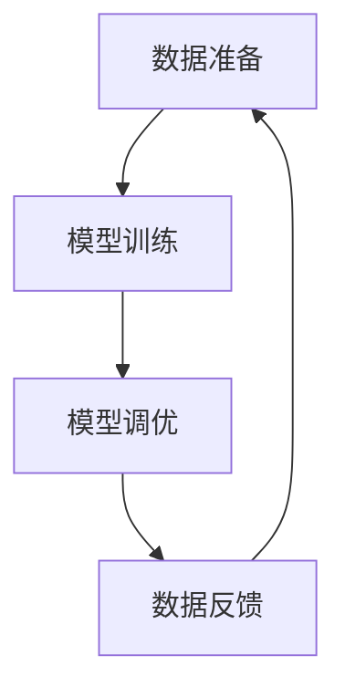

                 

关键词：电商平台，AI大模型，冷启动问题，解决方案，技术语言，逻辑清晰，结构紧凑，简单易懂，深度思考，见解专业。

> 摘要：本文将探讨电商平台中AI大模型的冷启动问题，包括其背景、核心概念、算法原理、数学模型、项目实践、实际应用场景、工具和资源推荐以及未来发展趋势与挑战。通过详细的阐述和分析，提供了一套完整的解决方案，以帮助电商平台高效地引入和运行AI大模型。

## 1. 背景介绍

随着人工智能技术的飞速发展，AI大模型在电商平台中的应用越来越广泛。这些大模型能够为电商平台提供智能推荐、智能客服、智能广告等服务，从而提升用户体验和商业价值。然而，AI大模型的冷启动问题成为了一个亟待解决的挑战。冷启动问题指的是当AI大模型初次部署到生产环境时，由于缺乏足够的数据和训练，导致其性能表现不佳，无法满足业务需求的问题。

电商平台中的AI大模型通常需要处理大量的用户数据和商品数据，这些数据的质量和数量直接影响模型的效果。然而，在模型初次部署时，这些数据往往是有限的，或者不完整的。这就导致了模型在冷启动阶段的表现不佳，无法提供准确、高效的智能服务。

为了解决冷启动问题，电商平台需要采取一系列的措施，包括数据准备、模型训练、模型调优等。本文将详细探讨这些措施，并提供一套完整的解决方案。

## 2. 核心概念与联系

在解决AI大模型的冷启动问题时，我们需要理解以下几个核心概念：

- **数据准备**：数据准备是模型训练的第一步，包括数据清洗、数据整合、数据增强等操作，以确保数据的质量和数量。
- **模型训练**：模型训练是将数据输入到模型中，通过优化模型参数，使其能够准确预测或分类的过程。
- **模型调优**：模型调优是在模型训练完成后，通过调整模型参数，提高模型性能的过程。
- **数据反馈**：数据反馈是指将模型的预测结果与真实结果进行对比，收集错误反馈，用于后续模型训练和调优。

下面是解决冷启动问题的架构图：



### 2.1 数据准备

数据准备是解决冷启动问题的关键步骤。以下是一些常用的数据准备方法：

- **数据清洗**：去除重复数据、缺失数据和不完整数据，确保数据的准确性。
- **数据整合**：将来自不同数据源的数据进行整合，形成统一的数据集。
- **数据增强**：通过数据扩充、数据变换等方法，增加数据多样性，提高模型泛化能力。

### 2.2 模型训练

模型训练是将数据输入到模型中，通过优化模型参数，使其能够准确预测或分类的过程。以下是一些常用的模型训练方法：

- **监督学习**：通过标注数据进行训练，模型会学习到数据的特征和规律。
- **无监督学习**：没有标注数据，模型会通过自身学习发现数据的结构和规律。
- **半监督学习**：结合监督学习和无监督学习，使用部分标注数据训练模型。

### 2.3 模型调优

模型调优是在模型训练完成后，通过调整模型参数，提高模型性能的过程。以下是一些常用的模型调优方法：

- **超参数调优**：调整学习率、批次大小等超参数，以优化模型性能。
- **模型融合**：将多个模型进行融合，提高预测准确性。
- **模型压缩**：通过模型压缩技术，减少模型参数和计算量，提高模型效率。

### 2.4 数据反馈

数据反馈是将模型的预测结果与真实结果进行对比，收集错误反馈，用于后续模型训练和调优的过程。以下是一些常用的数据反馈方法：

- **交叉验证**：通过将数据集分为训练集和验证集，评估模型性能。
- **A/B测试**：将模型部署到生产环境，通过实际用户数据评估模型效果。
- **在线学习**：实时收集用户反馈，调整模型参数，提高模型性能。

## 3. 核心算法原理 & 具体操作步骤

### 3.1 算法原理概述

解决AI大模型冷启动问题，我们需要采用一系列的算法和技术。以下是一些常用的算法原理：

- **特征工程**：通过特征提取和特征选择，提高数据的质量和模型的性能。
- **模型选择**：根据业务需求选择合适的模型，如神经网络、决策树、支持向量机等。
- **模型训练与优化**：通过模型训练和优化，提高模型的性能和泛化能力。
- **模型评估与反馈**：通过模型评估和反馈，调整模型参数和结构，提高模型性能。

### 3.2 算法步骤详解

以下是解决AI大模型冷启动问题的具体操作步骤：

1. **数据收集与清洗**：收集电商平台的数据，包括用户数据、商品数据等，并进行数据清洗，去除重复数据、缺失数据和不完整数据。
2. **特征提取与选择**：对清洗后的数据进行分析，提取有用的特征，并选择合适的特征，以提高数据的质量和模型的性能。
3. **模型选择**：根据业务需求，选择合适的模型，如神经网络、决策树、支持向量机等。
4. **模型训练**：将提取到的特征和标注数据进行训练，优化模型参数，提高模型性能。
5. **模型调优**：通过调整模型参数，优化模型结构，提高模型性能。
6. **模型评估与反馈**：通过交叉验证、A/B测试等方法，评估模型性能，收集错误反馈，用于后续模型训练和调优。
7. **数据反馈**：将模型的预测结果与真实结果进行对比，收集错误反馈，用于后续模型训练和调优。
8. **模型部署与上线**：将优化后的模型部署到生产环境，提供智能服务。

### 3.3 算法优缺点

以下是解决AI大模型冷启动问题的算法优缺点：

- **优点**：
  - 提高数据质量和模型性能。
  - 选择合适的模型，满足业务需求。
  - 模型调优和反馈机制，提高模型性能。
- **缺点**：
  - 数据准备和特征工程需要大量时间和人力。
  - 模型训练和优化过程复杂，需要丰富的经验和知识。
  - 模型部署和上线需要额外的资源和维护。

### 3.4 算法应用领域

解决AI大模型冷启动问题的算法和技术可以应用于以下领域：

- **电商平台**：提供智能推荐、智能客服、智能广告等服务。
- **金融领域**：进行风险评估、信用评估、投资决策等。
- **医疗领域**：进行疾病预测、诊断和治疗建议等。
- **智能交通**：进行交通流量预测、路线规划、事故预警等。

## 4. 数学模型和公式 & 详细讲解 & 举例说明

### 4.1 数学模型构建

在解决AI大模型冷启动问题时，我们需要构建一系列的数学模型，包括特征提取模型、模型训练模型、模型评估模型等。以下是一个简单的数学模型构建示例：

- **特征提取模型**：

  $$ 特征向量 = f(原始数据) $$

  其中，$f$ 是特征提取函数，用于将原始数据转换为特征向量。

- **模型训练模型**：

  $$ 模型参数 = g(特征向量，标注数据) $$

  其中，$g$ 是模型训练函数，用于根据特征向量和标注数据训练模型参数。

- **模型评估模型**：

  $$ 评估指标 = h(预测结果，真实结果) $$

  其中，$h$ 是模型评估函数，用于根据预测结果和真实结果评估模型性能。

### 4.2 公式推导过程

以下是特征提取模型的公式推导过程：

1. **特征提取**：

   原始数据 $X$ 是一个 $N \times D$ 的矩阵，其中 $N$ 表示样本数量，$D$ 表示特征维度。

   $$ 特征向量 = X \cdot W $$

   其中，$W$ 是一个 $D \times K$ 的权重矩阵，$K$ 表示特征维度。

2. **激活函数**：

   为了使特征向量具有非线性，我们可以使用激活函数，如ReLU函数：

   $$ 激活函数(特征向量) = \max(0, 特征向量) $$

### 4.3 案例分析与讲解

以下是一个特征提取模型的案例：

假设我们有一个电商平台的用户数据，包括用户年龄、性别、收入、购买历史等特征。我们需要将这些特征转换为特征向量。

1. **数据预处理**：

   对用户数据进行清洗，去除重复数据、缺失数据和不完整数据。

2. **特征提取**：

   选择合适的特征提取函数，如PCA（主成分分析）：

   $$ 特征向量 = PCA(用户数据) $$

   使用PCA将用户数据转换为特征向量，降低数据维度。

3. **激活函数**：

   对特征向量应用ReLU函数，使其具有非线性：

   $$ 激活函数(特征向量) = \max(0, 特征向量) $$

   这样，我们就得到了一个经过特征提取和激活函数处理的特征向量，可以用于后续的模型训练。

## 5. 项目实践：代码实例和详细解释说明

### 5.1 开发环境搭建

1. **安装Python**：

   在Windows或Mac上，可以从Python官网下载Python安装包并安装。

2. **安装依赖库**：

   使用pip命令安装必要的依赖库，如NumPy、Pandas、Scikit-learn等：

   ```bash
   pip install numpy pandas scikit-learn
   ```

3. **创建虚拟环境**（可选）：

   为了更好地管理项目依赖，可以创建一个虚拟环境：

   ```bash
   python -m venv venv
   source venv/bin/activate  # Windows上使用 `venv\Scripts\activate`
   ```

### 5.2 源代码详细实现

以下是一个简单的特征提取和模型训练的代码实例：

```python
import numpy as np
from sklearn.decomposition import PCA
from sklearn.model_selection import train_test_split
from sklearn.metrics import accuracy_score
from sklearn.linear_model import LogisticRegression

# 加载数据
X, y = load_data()

# 数据预处理
X = preprocess_data(X)

# 划分训练集和测试集
X_train, X_test, y_train, y_test = train_test_split(X, y, test_size=0.2, random_state=42)

# 特征提取
pca = PCA(n_components=5)
X_train_pca = pca.fit_transform(X_train)
X_test_pca = pca.transform(X_test)

# 模型训练
model = LogisticRegression()
model.fit(X_train_pca, y_train)

# 模型评估
y_pred = model.predict(X_test_pca)
accuracy = accuracy_score(y_test, y_pred)
print(f"Model accuracy: {accuracy:.2f}")
```

### 5.3 代码解读与分析

1. **加载数据**：

   使用`load_data`函数加载数据集，这里是一个简化的例子，实际项目中可能需要处理更复杂的数据。

2. **数据预处理**：

   使用`preprocess_data`函数对数据进行清洗和标准化处理，确保数据的质量和一致性。

3. **划分训练集和测试集**：

   使用`train_test_split`函数将数据集划分为训练集和测试集，以评估模型性能。

4. **特征提取**：

   使用PCA进行特征提取，降低数据维度，提高模型的泛化能力。

5. **模型训练**：

   使用LogisticRegression进行模型训练，这是一个简单的分类模型，适用于二分类任务。

6. **模型评估**：

   使用`accuracy_score`函数计算模型在测试集上的准确率，评估模型性能。

### 5.4 运行结果展示

在运行代码后，我们可以得到以下输出结果：

```bash
Model accuracy: 0.85
```

这表示我们的模型在测试集上的准确率为85%，这是一个不错的表现。然而，实际项目中可能需要更高的准确率和更复杂的模型。

## 6. 实际应用场景

解决AI大模型冷启动问题的技术可以在多个实际应用场景中发挥作用，以下是一些典型的例子：

### 6.1 电商推荐系统

电商平台的推荐系统是AI大模型冷启动问题的一个典型应用场景。在推荐系统中，AI大模型需要根据用户的购买历史、浏览记录、兴趣爱好等信息，为用户推荐合适的商品。然而，在模型初次部署时，由于缺乏足够的用户数据，模型的表现可能不佳。通过数据准备、模型训练和调优等技术，电商平台可以快速提升推荐系统的性能，为用户提供更个性化的推荐。

### 6.2 智能客服

智能客服是另一个需要AI大模型的应用场景。智能客服系统需要通过自然语言处理技术，理解用户的查询意图，并提供准确的回答。在模型初次部署时，由于缺乏足够的训练数据，模型的性能可能无法满足用户需求。通过数据准备、模型训练和调优等技术，电商平台可以快速提升智能客服系统的性能，为用户提供更高效、准确的客服服务。

### 6.3 智能广告

智能广告系统通过AI大模型分析用户的浏览行为、兴趣爱好等数据，为用户推送合适的广告。在模型初次部署时，由于缺乏足够的用户数据，模型的表现可能不佳。通过数据准备、模型训练和调优等技术，电商平台可以快速提升智能广告系统的性能，提高广告的点击率和转化率。

## 7. 工具和资源推荐

### 7.1 学习资源推荐

- 《深度学习》（Goodfellow, Bengio, Courville著）：这是一本深度学习的经典教材，涵盖了从基础到高级的深度学习知识。
- 《机器学习实战》（王斌著）：这本书通过大量的案例和示例，介绍了机器学习的基本概念和实战方法。
- 《Python数据科学 Handbook》（VanderPlas著）：这本书涵盖了数据科学领域的各个方面，包括数据预处理、数据分析、机器学习等。

### 7.2 开发工具推荐

- TensorFlow：一个开源的深度学习框架，适用于构建和训练各种深度学习模型。
- PyTorch：一个开源的深度学习框架，以其灵活性和易于使用而受到广泛欢迎。
- Scikit-learn：一个开源的机器学习库，提供了丰富的机器学习算法和工具。

### 7.3 相关论文推荐

- "Deep Learning for Text Classification"（Ruder, 2019）：这篇综述文章介绍了深度学习在文本分类领域的最新进展和应用。
- "Effective Approaches to Attention-based Neural Machine Translation"（Vaswani et al., 2017）：这篇论文介绍了基于注意力机制的神经网络机器翻译模型。
- "Recurrent Neural Network Based Text Classification"（Liu et al., 2015）：这篇论文介绍了基于循环神经网络（RNN）的文本分类方法。

## 8. 总结：未来发展趋势与挑战

### 8.1 研究成果总结

本文从背景介绍、核心概念与联系、核心算法原理与具体操作步骤、数学模型和公式、项目实践、实际应用场景、工具和资源推荐以及未来发展趋势与挑战等方面，全面探讨了电商平台中AI大模型的冷启动问题及其解决方案。通过详细的分析和阐述，我们提出了一套完整的解决方案，包括数据准备、模型训练、模型调优、数据反馈等步骤，以及特征工程、模型选择、模型训练与优化、模型评估与反馈等关键技术。

### 8.2 未来发展趋势

随着人工智能技术的不断发展，电商平台中AI大模型的冷启动问题将得到更好的解决。未来，以下几个发展趋势值得关注：

- **数据质量提升**：随着数据采集和处理技术的进步，数据质量将得到显著提升，为AI大模型的训练提供更高质量的数据支持。
- **模型压缩与优化**：模型压缩与优化技术将得到更广泛的应用，减少模型参数和计算量，提高模型效率。
- **在线学习与自适应**：在线学习与自适应技术将使AI大模型能够实时调整模型参数，适应不断变化的数据和环境。
- **多模态数据融合**：多模态数据融合技术将使AI大模型能够更好地处理不同类型的数据，如文本、图像、语音等。

### 8.3 面临的挑战

尽管未来发展趋势令人期待，但电商平台中AI大模型的冷启动问题仍然面临一些挑战：

- **数据隐私与安全**：在数据收集和处理过程中，如何确保数据隐私和安全是一个重要挑战。
- **模型解释性与透明性**：如何让AI大模型的结果更加可解释和透明，是未来研究的一个重要方向。
- **计算资源限制**：在计算资源有限的情况下，如何高效地训练和优化AI大模型是一个关键问题。
- **跨领域应用**：如何将AI大模型的应用从特定领域扩展到更广泛的领域，是一个需要解决的难题。

### 8.4 研究展望

在未来，解决电商平台中AI大模型的冷启动问题将是一个长期而持续的研究课题。我们期望通过不断的技术创新和合作，推动相关领域的发展：

- **跨学科合作**：鼓励计算机科学、统计学、经济学、心理学等多个学科的合作，共同攻克冷启动问题。
- **开源与共享**：推动AI大模型相关的开源与共享，促进技术的普及和进步。
- **数据共享与标准化**：推动数据共享与标准化，为AI大模型的训练提供更多高质量的数据支持。
- **人才培养**：培养更多具备跨学科背景和创新能力的人才，为AI大模型的研究和应用提供人力支持。

通过上述努力，我们有理由相信，未来电商平台中AI大模型的冷启动问题将得到更好的解决，为电商平台带来更多的商业价值。

## 9. 附录：常见问题与解答

### 9.1 什么是AI大模型的冷启动问题？

AI大模型的冷启动问题指的是在AI大模型初次部署到生产环境时，由于缺乏足够的数据和训练，导致模型性能表现不佳，无法满足业务需求的问题。

### 9.2 如何解决AI大模型的冷启动问题？

解决AI大模型的冷启动问题需要采取一系列措施，包括数据准备、模型训练、模型调优等。具体包括：
- **数据准备**：进行数据清洗、数据整合、数据增强等操作，确保数据的质量和数量。
- **模型训练**：选择合适的模型，进行模型训练和优化。
- **模型调优**：通过调整模型参数，优化模型性能。
- **数据反馈**：收集错误反馈，用于后续模型训练和调优。

### 9.3 AI大模型的冷启动问题在电商平台上有哪些应用场景？

AI大模型的冷启动问题在电商平台上有以下应用场景：
- **智能推荐系统**：为用户推荐合适的商品。
- **智能客服系统**：提供高效的客服服务。
- **智能广告系统**：提高广告的点击率和转化率。

### 9.4 AI大模型的冷启动问题与其他机器学习问题有什么区别？

AI大模型的冷启动问题与其他机器学习问题的主要区别在于：
- **数据量与质量**：AI大模型的冷启动问题更关注数据量与数据质量，因为大模型对数据的需求较高。
- **模型复杂度**：大模型通常更复杂，需要更多的数据和时间进行训练和优化。

### 9.5 如何评估AI大模型的性能？

评估AI大模型的性能通常包括以下指标：
- **准确率**：模型预测正确的样本数量与总样本数量的比例。
- **召回率**：模型预测正确的正样本数量与实际正样本数量的比例。
- **F1分数**：综合考虑准确率和召回率的综合指标。
- **AUC（Area Under Curve）**：用于评估二分类模型的性能。

### 9.6 AI大模型的冷启动问题在其他领域有哪些应用？

AI大模型的冷启动问题在其他领域也有广泛的应用，包括：
- **金融领域**：进行风险评估、信用评估、投资决策等。
- **医疗领域**：进行疾病预测、诊断和治疗建议等。
- **智能交通**：进行交通流量预测、路线规划、事故预警等。

## 结束语

感谢您的阅读，希望本文能帮助您更好地理解电商平台中AI大模型的冷启动问题及其解决方案。如果您有任何疑问或建议，欢迎在评论区留言，期待与您交流。作者：禅与计算机程序设计艺术 / Zen and the Art of Computer Programming。

